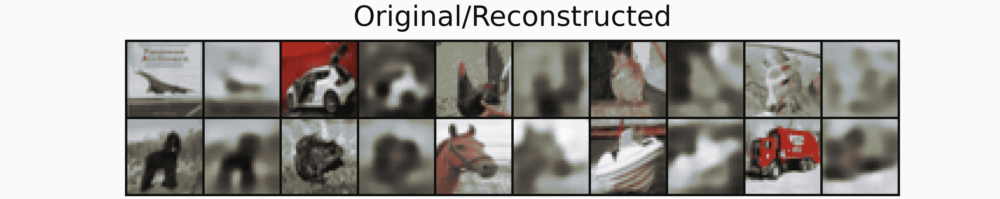
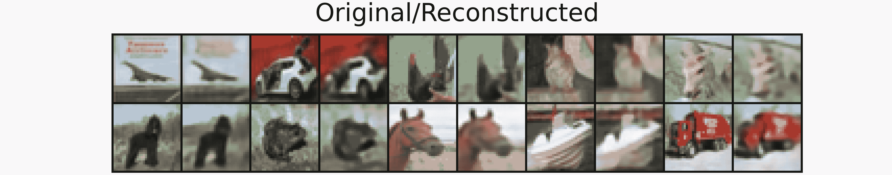
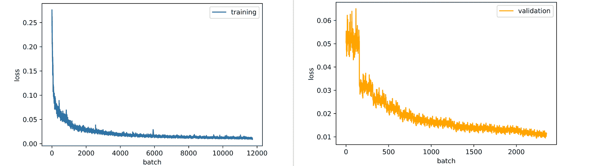
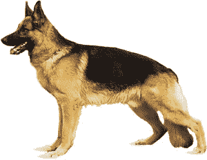
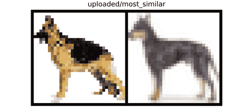
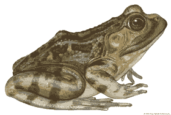
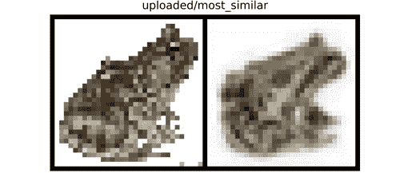
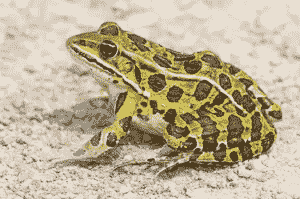
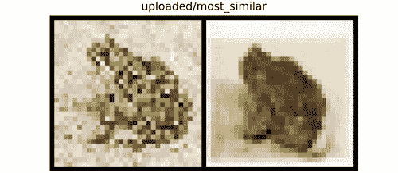

# 自动编码器和视觉相似性

> 原文：<https://blog.paperspace.com/autoencoders-and-visual-similarity/>

有没有想过图片搜索是如何工作的，或者社交媒体平台是如何推荐与你经常喜欢的图片相似的图片的？在这篇文章中，我们将看看自动编码器的另一个有益用途，并试图解释它们在计算机视觉推荐系统中的效用。

## 设置

我们首先需要为今天的任务导入相关的包:

```py
#  article dependencies
import torch
import torch.nn as nn
import torch.nn.functional as F
import torchvision
import torchvision.transforms as transforms
import torchvision.datasets as Datasets
from torch.utils.data import Dataset, DataLoader
import numpy as np
import matplotlib.pyplot as plt
import cv2
from tqdm.notebook import tqdm
from tqdm import tqdm as tqdm_regular
import seaborn as sns
from torchvision.utils import make_grid
import random
import pandas as pd
```

我们还检查机器是否有 GPU，如果有的话，让 Torch 在 CUDA 上运行。

```py
#  configuring device
if torch.cuda.is_available():
  device = torch.device('cuda:0')
  print('Running on the GPU')
else:
  device = torch.device('cpu')
  print('Running on the CPU')
```

### 视觉相似性

在人类视觉的背景下，我们人类能够通过感知图像的形状和颜色来进行图像之间的比较，使用这些信息来评估它们可能有多相似。然而，当涉及到计算机视觉时，为了理解图像，必须首先提取它们的特征。此后，为了比较两幅图像可能有多相似，需要以某种方式比较它们的特征，以便用数值来度量相似性。

### 自动编码器的作用

正如我们所知，自动编码器在表示学习方面非常出色。事实上，他们能够很好地学习表示法，能够将像素拼凑在一起，并得到原始图像。

基本上，autoencoder 的编码器充当特征提取器，提取的特征随后在瓶颈/代码层压缩成矢量表示。在这种情况下，瓶颈层的输出可以被视为图像的最显著特征，它保存了图像的颜色和边缘的编码。有了这种特征编码，人们就可以继续比较两幅图像，以测量它们的相似性。

### 余弦相似性度量

为了测量上一节提到的向量表示之间的相似性，我们需要一个特别适合这项任务的度量。这就是余弦相似性的由来，余弦相似性是一种通过比较向量空间中两个向量之间的角度来测量它们相似性的度量。

不同于像欧几里德距离这样的通过大小来比较向量的距离度量，余弦相似性只与两个向量是否指向相同的方向有关，这一属性使得它非常适合于度量显著的相似性。


Mathematical formula for cosine similarity.

### 利用自动编码器实现视觉相似性

在本节中，我们将训练一个自动编码器，然后使用自动编码器的编码器作为特征提取器，并使用余弦相似性作为评估相似性的度量，来编写一个视觉相似性函数。

#### 资料组

对于本 autoencoder 系列中的典型文章，我们将使用 CIFAR-10 数据集。该数据集包含青蛙、马、汽车等物体的 32 x 32 像素图像。可以使用下面的代码单元格加载数据集。

```py
#  loading training data
training_set = Datasets.CIFAR10(root='./', download=True,
                                transform=transforms.ToTensor())

#  loading validation data
validation_set = Datasets.CIFAR10(root='./', download=True, train=False,
                                  transform=transforms.ToTensor())
```


CIFAR-10 images.

由于我们正在训练一个基本上无人监管的自动编码器，我们不需要对标签进行分类，这意味着我们可以只提取图像本身。出于可视化的目的，我们将从每个类中提取图像，以便查看自动编码器在所有类中重建图像的效果如何。

```py
def extract_each_class(dataset):
  """
  This function searches for and returns
  one image per class
  """
  images = []
  ITERATE = True
  i = 0
  j = 0

  while ITERATE:
    for label in tqdm_regular(dataset.targets):
      if label==j:
        images.append(dataset.data[i])
        print(f'class {j} found')
        i+=1
        j+=1
        if j==10:
          ITERATE = False
      else:
        i+=1

  return images

#  extracting training images
training_images = [x for x in training_set.data]

#  extracting validation images
validation_images = [x for x in validation_set.data]

#  extracting validation images
test_images = extract_each_class(validation_set)
```

接下来，我们需要定义一个 PyTorch 数据集类，以便能够在训练 PyTorch 模型时使用我们的数据集。这是在下面的代码单元格中完成的。

```py
#  defining dataset class
class CustomCIFAR10(Dataset):
  def __init__(self, data, transforms=None):
    self.data = data
    self.transforms = transforms

  def __len__(self):
    return len(self.data)

  def __getitem__(self, idx):
    image = self.data[idx]

    if self.transforms!=None:
      image = self.transforms(image)
    return image

#  creating pytorch datasets
training_data = CustomCIFAR10(training_images, transforms=transforms.Compose([transforms.ToTensor(),
                                                                              transforms.Normalize((0.5, 0.5, 0.5), (0.5, 0.5, 0.5))]))
validation_data = CustomCIFAR10(validation_images, transforms=transforms.Compose([transforms.ToTensor(),
                                                                                  transforms.Normalize((0.5, 0.5, 0.5), (0.5, 0.5, 0.5))]))
test_data = CustomCIFAR10(test_images, transforms=transforms.Compose([transforms.ToTensor(),
                                                                                  transforms.Normalize((0.5, 0.5, 0.5), (0.5, 0.5, 0.5))]))
```

#### 自动编码器架构


上图所示的自动编码器架构在下面的代码块中实现，将用于培训目的。这个 autoencoder 是专门为说明目的定制的，并且是专门为 CIFAR-10 数据集定制的。对于这个特定的产品，瓶颈大小为 1000，而不是 200。

```py
#  defining encoder
class Encoder(nn.Module):
  def __init__(self, in_channels=3, out_channels=16, latent_dim=1000, act_fn=nn.ReLU()):
    super().__init__()

    self.net = nn.Sequential(
        nn.Conv2d(in_channels, out_channels, 3, padding=1), # (32, 32)
        act_fn,
        nn.Conv2d(out_channels, out_channels, 3, padding=1), 
        act_fn,
        nn.Conv2d(out_channels, 2*out_channels, 3, padding=1, stride=2), # (16, 16)
        act_fn,
        nn.Conv2d(2*out_channels, 2*out_channels, 3, padding=1),
        act_fn,
        nn.Conv2d(2*out_channels, 4*out_channels, 3, padding=1, stride=2), # (8, 8)
        act_fn,
        nn.Conv2d(4*out_channels, 4*out_channels, 3, padding=1),
        act_fn,
        nn.Flatten(),
        nn.Linear(4*out_channels*8*8, latent_dim),
        act_fn
    )

  def forward(self, x):
    x = x.view(-1, 3, 32, 32)
    output = self.net(x)
    return output

#  defining decoder
class Decoder(nn.Module):
  def __init__(self, in_channels=3, out_channels=16, latent_dim=1000, act_fn=nn.ReLU()):
    super().__init__()

    self.out_channels = out_channels

    self.linear = nn.Sequential(
        nn.Linear(latent_dim, 4*out_channels*8*8),
        act_fn
    )

    self.conv = nn.Sequential(
        nn.ConvTranspose2d(4*out_channels, 4*out_channels, 3, padding=1), # (8, 8)
        act_fn,
        nn.ConvTranspose2d(4*out_channels, 2*out_channels, 3, padding=1, 
                           stride=2, output_padding=1), # (16, 16)
        act_fn,
        nn.ConvTranspose2d(2*out_channels, 2*out_channels, 3, padding=1),
        act_fn,
        nn.ConvTranspose2d(2*out_channels, out_channels, 3, padding=1, 
                           stride=2, output_padding=1), # (32, 32)
        act_fn,
        nn.ConvTranspose2d(out_channels, out_channels, 3, padding=1),
        act_fn,
        nn.ConvTranspose2d(out_channels, in_channels, 3, padding=1)
    )

  def forward(self, x):
    output = self.linear(x)
    output = output.view(-1, 4*self.out_channels, 8, 8)
    output = self.conv(output)
    return output

#  defining autoencoder
class Autoencoder(nn.Module):
  def __init__(self, encoder, decoder):
    super().__init__()
    self.encoder = encoder
    self.encoder.to(device)

    self.decoder = decoder
    self.decoder.to(device)

  def forward(self, x):
    encoded = self.encoder(x)
    decoded = self.decoder(encoded)
    return decoded
```

#### 卷积自动编码器类

为了将模型训练和利用打包到单个对象中，卷积自动编码器类定义如下。这个类有一些利用方法，如`autoencode`促进整个自动编码过程，`encode`触发编码器和瓶颈，返回 1000 个元素的矢量编码，`decode`将 1000 个元素的矢量作为输入，尝试重建图像。

```py
class ConvolutionalAutoencoder():
  def __init__(self, autoencoder):
    self.network = autoencoder
    self.optimizer = torch.optim.Adam(self.network.parameters(), lr=1e-3)

  def train(self, loss_function, epochs, batch_size, 
            training_set, validation_set, test_set):

    #  creating log
    log_dict = {
        'training_loss_per_batch': [],
        'validation_loss_per_batch': [],
        'visualizations': []
    } 

    #  defining weight initialization function
    def init_weights(module):
      if isinstance(module, nn.Conv2d):
        torch.nn.init.xavier_uniform_(module.weight)
        module.bias.data.fill_(0.01)
      elif isinstance(module, nn.Linear):
        torch.nn.init.xavier_uniform_(module.weight)
        module.bias.data.fill_(0.01)

    #  initializing network weights
    self.network.apply(init_weights)

    #  creating dataloaders
    train_loader = DataLoader(training_set, batch_size)
    val_loader = DataLoader(validation_set, batch_size)
    test_loader = DataLoader(test_set, 10)

    #  setting convnet to training mode
    self.network.train()
    self.network.to(device)

    for epoch in range(epochs):
      print(f'Epoch {epoch+1}/{epochs}')
      train_losses = []

      #------------
      #  TRAINING
      #------------
      print('training...')
      for images in tqdm(train_loader):
        #  zeroing gradients
        self.optimizer.zero_grad()
        #  sending images to device
        images = images.to(device)
        #  reconstructing images
        output = self.network(images)
        #  computing loss
        loss = loss_function(output, images.view(-1, 3, 32, 32))
        #  calculating gradients
        loss.backward()
        #  optimizing weights
        self.optimizer.step()

        #--------------
        # LOGGING
        #--------------
        log_dict['training_loss_per_batch'].append(loss.item())

      #--------------
      # VALIDATION
      #--------------
      print('validating...')
      for val_images in tqdm(val_loader):
        with torch.no_grad():
          #  sending validation images to device
          val_images = val_images.to(device)
          #  reconstructing images
          output = self.network(val_images)
          #  computing validation loss
          val_loss = loss_function(output, val_images.view(-1, 3, 32, 32))

        #--------------
        # LOGGING
        #--------------
        log_dict['validation_loss_per_batch'].append(val_loss.item())

      #--------------
      # VISUALISATION
      #--------------
      print(f'training_loss: {round(loss.item(), 4)} validation_loss: {round(val_loss.item(), 4)}')

      for test_images in test_loader:
        #  sending test images to device
        test_images = test_images.to(device)
        with torch.no_grad():
          #  reconstructing test images
          reconstructed_imgs = self.network(test_images)
        #  sending reconstructed and images to cpu to allow for visualization
        reconstructed_imgs = reconstructed_imgs.cpu()
        test_images = test_images.cpu()

        #  visualisation
        imgs = torch.stack([test_images.view(-1, 3, 32, 32), reconstructed_imgs], 
                          dim=1).flatten(0,1)
        grid = make_grid(imgs, nrow=10, normalize=True, padding=1)
        grid = grid.permute(1, 2, 0)
        plt.figure(dpi=170)
        plt.title('Original/Reconstructed')
        plt.imshow(grid)
        log_dict['visualizations'].append(grid)
        plt.axis('off')
        plt.show()

    return log_dict

  def autoencode(self, x):
    return self.network(x)

  def encode(self, x):
    encoder = self.network.encoder
    return encoder(x)

  def decode(self, x):
    decoder = self.network.decoder
    return decoder(x)
```

完成所有设置后，现在可以通过实例化 autoencoder 来训练它，并使用参数调用 train 方法，如下所示。

```py
#  training model
model = ConvolutionalAutoencoder(Autoencoder(Encoder(), Decoder()))

log_dict = model.train(nn.MSELoss(), epochs=15, batch_size=64, 
                       training_set=training_data, validation_set=validation_data,
                       test_set=test_data)
```

在第一个时期之后，我们可以看到自动编码器已经开始学习足够强的表示，以便能够将输入图像放在一起，尽管没有太多细节。



Epoch 1.

然而，到了第 15 世纪，自动编码器已经开始以更精确的颜色和更好的形式将输入图像更详细地放在一起。



Epoch 15.

查看训练和验证损失图，两个图都是下降趋势，因此，模型实际上将受益于更多的训练时期。然而，对于这篇文章，15 个时期的训练被认为是足够的。



losses.

#### 编写视觉相似性函数

现在，自动编码器已经被训练来重建 CIFAR-10 数据集中所有 10 个类别的图像，我们可以继续使用自动编码器的编码器作为任何图像集的特征提取器，然后使用余弦相似性比较提取的特征。

在我们的例子中，让我们编写一个函数，它能够接收任何图像作为输入，然后在一组图像中查找相似的图像(为此我们将使用验证集)。该函数定义如下:必须小心预处理输入图像，就像预处理训练图像一样，因为这是模型所期望的。

```py
def visual_similarity(filepath, model, dataset, features):
  """
  This function replicates the visual similarity process
  as defined previously.
  """
  #  reading image
  image = cv2.imread(filepath)
  image = cv2.cvtColor(image, cv2.COLOR_BGR2RGB)
  image = cv2.resize(image, (32, 32))

  #  converting image to tensor/preprocessing image
  my_transforms=transforms.Compose([transforms.ToTensor(),
                                    transforms.Normalize((0.5, 0.5, 0.5), (0.5, 0.5, 0.5))])
  image = my_transforms(image)

  #  encoding image
  image = image.to(device)
  with torch.no_grad():
    image_encoding = model.encode(image)

  #  computing similarity scores
  similarity_scores = [F.cosine_similarity(image_encoding, x) for x in features]
  similarity_scores = [x.cpu().detach().item() for x in similarity_scores]
  similarity_scores = [round(x, 3) for x in similarity_scores]

  #  creating pandas series
  scores = pd.Series(similarity_scores)
  scores = scores.sort_values(ascending=False)

  #  deriving the most similar image
  idx = scores.index[0]
  most_similar = [image, dataset[idx]]

  #  visualization
  grid = make_grid(most_similar, normalize=True, padding=1)
  grid = grid.permute(1,2,0)
  plt.figure(dpi=100)
  plt.title('uploaded/most_similar')
  plt.axis('off')
  plt.imshow(grid)

  print(f'similarity score = {scores[idx]}')
  pass
```

因为我们要将上传的图像与验证集中的图像进行比较，所以在使用该函数之前，我们可以通过从所有 1000 幅图像中提取特征来节省时间。这个过程也可以被写入相似性函数，但是它会以计算时间为代价。这是下面做的。

```py
#  extracting features from images in the validation set
with torch.no_grad():
  image_features = [model.encode(x.to(device)) for x in tqdm_regular(validation_data)]
```

#### 计算相似度

在这一部分中，一些图像将被提供给视觉相似性函数，以访问所产生的结果。然而，应该记住，只有训练集中存在的类中的图像才会产生合理的结果。

##### 图片 1

考虑一只白色背景的德国牧羊犬，如下图所示。这种狗主要是金色的皮毛，黑色的马鞍，观察到它警惕地站在左边。



在将该图像传递给视觉相似性函数时，产生上传图像相对于验证集中最相似图像的绘图。请注意，根据模型的要求，原始图像被缩小为 32 x 32 像素。

```py
visual_similarity('image_1.jpg', model=model, 
                  dataset=validation_data, 
                  features=image_features)
```

从结果中，返回了一个白色背景图像，一只看似深色皮毛的狗面向左侧警惕地站着，相似性得分为 92.2%。在这种情况下，模型基本上找到了一个与原始图像的大部分细节相匹配的图像，这正是我们想要的。



##### 图片 2

下面的图片是一只棕色的青蛙俯卧在白色背景上，面朝右。同样，通过我们的视觉相似度函数传递图像会产生上传图像与其最相似图像的对比图。



```py
visual_similarity('image_2.jpg', model=model, 
                  dataset=validation_data, 
                  features=image_features)
```

从结果图来看，与我们上传的图像位置相似(俯卧)的一只看起来有些灰色的青蛙的相似性得分约为 91%。请注意，该图像也描绘在白色背景上。



##### 图 3

最后，下面是另一只青蛙的图片。这只青蛙呈绿色，与上一张照片中的青蛙处于类似的俯卧位置，但区别在于它面向左侧，并被描绘在纹理背景上(本例中为沙子)。



```py
visual_similarity('image_3.jpg', model=model, 
                  dataset=validation_data, 
                  features=image_features)
```

就像前面两个部分一样，当图像被提供给视觉相似性函数时，返回原始图像和在验证集中找到的最相似图像的图。在这种情况下，最相似的图像是一只棕色的青蛙，俯卧，面向左侧，也描绘在纹理背景上。返回大约 90%的相似性分数。



从本节中用作示例的图像可以看出，视觉相似性函数发挥了应有的作用。然而，随着更多时代的训练或者可能更好的架构，有可能在最初几个最相似的图像之外做出更好的相似性推荐。

### 结束语

在本文中，我们可以看到自动编码器的另一个有益用途，这一次是作为视觉相似性推荐的工具。在这里，我们探讨了如何将 autoencoder 的编码器用作特征提取器，然后使用余弦相似性比较提取的特征，以找到相似的图像。

基本上，在这种情况下，autoencoder 所做的就是提取特征。事实上，如果你非常熟悉卷积神经网络，那么你会同意不仅自动编码器可以作为特征提取器，而且用于分类目的的网络也可以用于特征提取。因此，这意味着它们依次用于视觉相似性任务。