# 理解程序

> 原文：<https://blog.paperspace.com/understanding-progan/>

[Image Source](https://unsplash.com/s/photos/motivation) with adding the quote 

这篇文章是关于一种革命性的 GANs，来自论文[为了提高质量、稳定性和变化性而进行的 GANs 渐进生长](https://arxiv.org/pdf/1710.10196.pdf)。我们将仔细检查它，查看它的目标、损失函数、结果、实现细节，并分解它的组件来理解每一个组件。如果我们想从头看到它的实现，看看这个[博客](https://blog.paperspace.com/p/157c6f39-80bb-4c88-a5e8-188d40e032f9/#load-all-dependencies-we-need)，在那里我们尽可能地复制了原始论文，并使用 PyTorch 使实现变得干净、简单和可读。

> 如果我们已经熟悉了 GANs，并且知道它们是如何工作的，请继续阅读本文，但如果不是，建议先看看这篇[博文](https://blog.paperspace.com/build-simple-gan-from-scratch-to-generate/)。

## Gan 改进

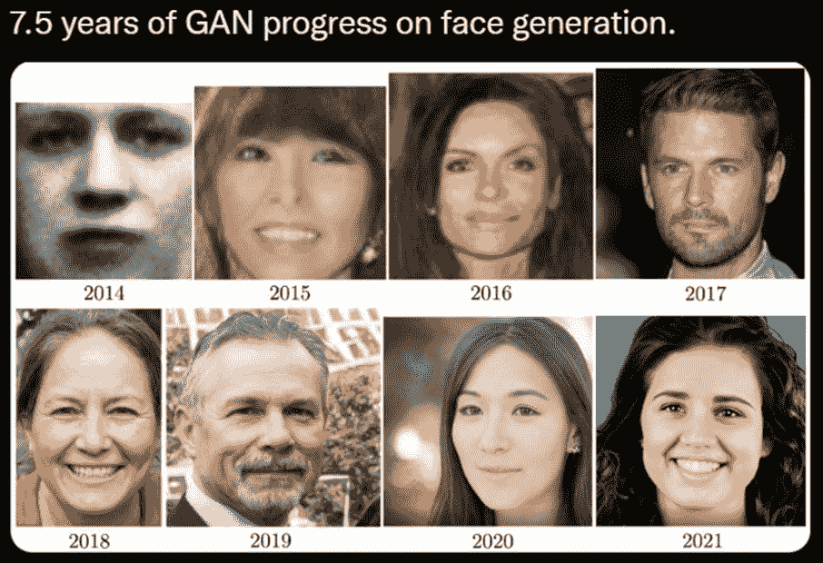

[Image source](https://twitter.com/tamaybes/status/1450873331054383104/photo/1)

在本节中，我们将了解 GAN 的改进。我们将看到 GANs 是如何随着时间的推移而发展的。在上图中，我们可以看到过去几年中 GANs 的改进速度。

*   2014 年**伊恩·古德菲勒**从论文[生成对抗网络](https://arxiv.org/pdf/1406.2661.pdf)中创造了强大的人工智能概念 ****甘斯**** ，赋予了机器想象力，但它们对超参数极其敏感，生成的图像看起来质量很低。我们可以看到第一张脸，它是黑白的，看起来几乎不像一张脸。我们可以在这些博客中了解原始的 gan:[发现为什么 gan 很棒！](https://blog.paperspace.com/build-simple-gan-from-scratch-to-generate/)、[生成对抗网络(GANs)完全指南](https://blog.paperspace.com/complete-guide-to-gans/)和[使用 TensorFlow 构建简单的生成对抗网络(GAN)](https://blog.paperspace.com/implementing-gans-in-tensorflow/)。
*   此后研究人员开始改进 GANs，并在 2015 年引入了一种新方法，来自论文[的 **DCGANs** 利用深度卷积生成对抗网络](https://arxiv.org/pdf/1511.06434.pdf)进行无监督表示学习。我们可以在第二张图片中看到，这张脸看起来更好，但它离完美还很远。我们可以在这个博客中读到:[开始使用 DCGANs](https://blog.paperspace.com/getting-started-with-dcgans/) 。
*   接下来在 2016 年，论文[耦合生成对抗网络](https://arxiv.org/pdf/1606.07536.pdf)中的 CoGAN 被引入，它进一步改进了人脸生成。
*   2017 年底， [NVIDIA AI](https://twitter.com/NVIDIAAI) 的研究人员发布了 ProGAN 以及论文[GANs 的渐进式增长以提高质量、稳定性和变化](https://arxiv.org/pdf/1710.10196.pdf)，这是本文的主要主题。我们可以看到第四张图看起来比前几张更真实。
*   2018 年，同样的研究人员从论文[中提出了 StyleGAN，这是一种基于风格的生成性对抗网络生成器架构](https://arxiv.org/abs/1812.04948)，它基于 ProGAN。我们将在下一篇文章中讨论它。我们可以看到 StyleGAN 可以生成的高质量人脸，以及它们看起来有多逼真。
*   2019 年，同样的研究人员再次从论文[中提出 StyleGAN2，分析并改善 StyleGAN 的图像质量](https://arxiv.org/abs/1912.04958)，这是对 StyleGAN 的改进。2021 年，他们再次从论文[中提出了 StyleGAN3，这是对 StyleGAN2 的改进。我们将在接下来的文章中分别介绍这两者，分解它们的组件并理解它们，然后使用 PyTorch 从头开始实现它们。](https://arxiv.org/abs/2106.12423)

> StyleGan3 是图像生成中的王者，它在定量和定性评估指标上击败了其他 Gan，无论是在保真度还是多样性方面。

因为这些论文和其他论文，GANs 已经从改进的**训练**、**稳定性**、**能力**和**多样性**有了很大的进步。

* * *

## 程序概述

在本节中，我们将了解 ProGAN 相对较新的架构，该架构被认为是 GAN 的转折点改进。我们将回顾 ProGAN 的主要目标，并在各个组件中介绍它的架构。

### 计划目标

*   生成高质量、高分辨率的图像。
*   输出图像的更大多样性。
*   提高 GANs 的稳定性。
*   增加生成图像的变化。

### ProGAN 的主要组件

传统的生成对抗网络有两个组成部分；发生器和鉴别器。生成器网络采用一个随机的潜在向量( *z* ∈Z)并试图生成一个真实的图像。鉴别器网络试图区分真实图像和生成的图像。当我们一起训练两个网络时，生成器开始生成与真实图像无法区分的图像。

在 ProGAN 中，关键思想是逐步增加生成器和鉴别器，生成器从学习生成 4x4 的非常小的输入图像开始，然后当它完成该任务时，目标图像看起来非常接近生成的图像，因此鉴别器无法在这个特定分辨率下区分它们，然后我们更新它，生成器生成 8x8 图像。当挑战结束后，我们再次将其升级到 16x16，我们可以想象这种情况会继续下去，直到最终达到 1024 x 1024 像素的图像。

这个想法很有意义，因为它类似于我们学习的方式。如果我们以数学为例，我们不要求在第一天计算梯度；我们从做简单加法的基础开始，然后逐步成长到做更具挑战性的任务。这是 ProGAN 中的关键思想，但此外，作者还描述了几个重要的实施细节，它们是 Minibatch 标准差、新层中的淡入淡出和归一化(PixelNorm & Eq。LR)。现在，让我们更深入地了解这些组件及其工作原理。

* * *

## 渐进增长

在这一节中，我们将学习渐进式增长，这是 ProGAN 的核心思想。我们将回顾它背后的直觉和动机，然后我们将更深入地探讨如何实现它。

首先，渐进式增长试图通过逐渐从低分辨率图像训练到高分辨率图像，使生成器更容易生成高分辨率图像。从一个更简单的任务开始，一个非常模糊的图像，它可以生成一个只有 16 像素的 4x4 图像，然后随着时间的推移，图像的分辨率会高得多。

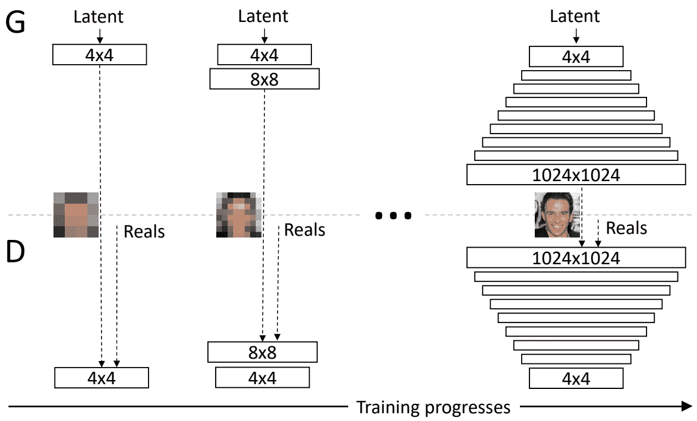

Image from the [research paper](https://arxiv.org/pdf/1710.10196.pdf)

首先，生成器只需要生成一个 4×4 的图像，鉴别器需要评估它是真的还是假的。当然，为了使真假不那么明显，真实的图像也将被下采样为 4x 4 的图像。在渐进生长的下一步中，所有的东西都加倍了，所以现在生成的图像是一个 8 乘 8 的图像。这是一个比以前分辨率高得多的图像，但仍然比超高分辨率图像更容易，当然，真实的图像也被下采样到一个 8 乘 8 的图像，以使哪个是真的哪个是假的不那么明显。沿着这条链，生成器最终能够生成超高分辨率的图像，鉴别器会将更高分辨率的图像与同样具有这种高分辨率的真实图像进行对比，因此不再需要降采样，并且能够检测出它是真的还是假的。

在下图中，我们可以看到从真正的像素化 4x 4 像素到超高分辨率图像的渐进发展。

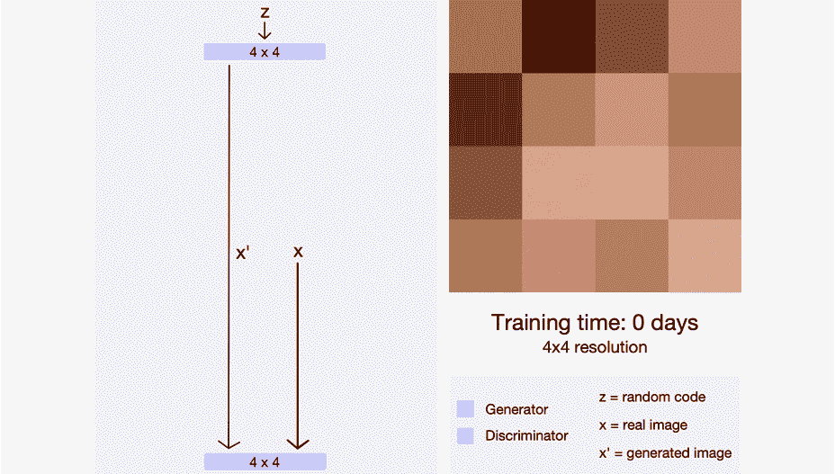

[Image source](https://towardsdatascience.com/progan-how-nvidia-generated-images-of-unprecedented-quality-51c98ec2cbd2)

* * *

## 小批量标准偏差

GAN 倾向于不像训练数据中那样显示多样的图像，因此 ProGAN 的作者用一种简单的方法解决了这个问题。他们首先计算所有通道和所有像素值的每个示例的标准偏差，然后取整批的平均值。然后，他们在所有示例中复制该值(只是一个标量值),然后复制所有像素值以获得一个通道，并将其连接到输入。

* * *

## 在新图层中淡入

现在，我们应该明白在 ProGANs 中，我们是如何从 4x4 开始，然后是 8x8 等等进行渐进式增长的。但是这种渐进的增长并不像在这些预定的时间间隔内规模立即翻倍那样简单，实际上比那要缓慢一些。

### 对于发电机

当我们想要生成双倍大小的图像时，首先我们对图像进行上采样(上采样可以使用像最近邻过滤这样的技术)。在不使用任何已知参数的情况下，这只是非常基本的上采样，然后在下一步中，我们可以进行 99%的上采样，并将 1%的上采样图像放入卷积层，产生两倍大小的分辨率图像，因此我们有一些已知参数。

随着时间的推移，我们开始减少上采样的百分比，并增加学习参数的百分比，因此图像开始看起来可能更像目标(即面部，如果我们想要生成面部的话)，而不像只是从最近的邻居上采样进行上采样。随着时间的推移，该模型将开始不依赖于上采样，而是仅依赖于学习到的参数进行推断。

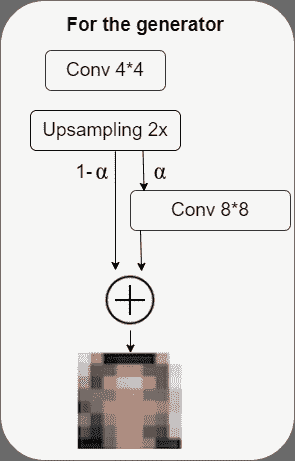

Created by https://app.diagrams.net

更一般地说，我们可以把这看作是一个随时间增长的 *α* 参数，其中α从 0 开始，然后一直增长到 1。我们可以把最终的公式写成:$[(1*α*)×upsampled layer+(*α*)×conv layer]$

### 对于鉴别器

对于鉴别器来说，有一些非常相似的东西，但是方向相反。

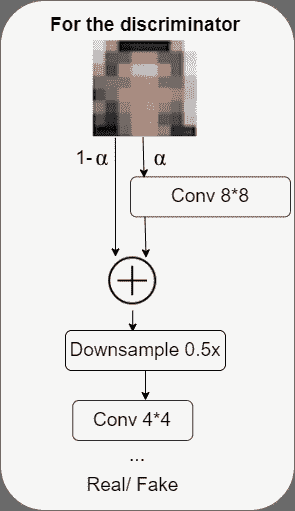

我们有一个高分辨率的图像(例如:上图中的 8x8)，随着时间的推移，我们慢慢地通过下采样层，然后处理低分辨率的图像(例如:上图中的 4x4)。在最后，我们输出一个与预测相对应的介于零和一(真实或虚假)之间的概率。

> 我们在鉴别器中使用的α与我们在发生器中看到的相同。

* * *

## 正常化

大多数(如果不是全部的话)早期的高级 GANs 在生成器和鉴别器中使用批量归一化来消除协变量移位。但是 ProGAN 的作者观察到，在 GANs 中这不是一个问题，他们使用了一种由两步过程组成的不同方法。

### 均衡学习率

由于优化器的问题，即 Adam 和 RMSProp 中的梯度更新步骤取决于参数的动态范围，ProGAN 的作者引入了他们的解决方案，即均衡学习率，以更好地解决他们的特定问题。

在每次向前传递之前，可以通过调整权重来均衡各层的学习速率。例如，在对大小为(k，k，c)的 f 个过滤器执行卷积之前，它们会缩放这些过滤器的权重，如下所示。通过这种方式，他们可以确保每个权重都在相同的动态范围内，然后所有权重的学习速度都相同。

### 像素标准化

为了摆脱批量归一化，作者在生成器的卷积层之后应用了像素归一化，以防止信号幅度在训练期间失控。

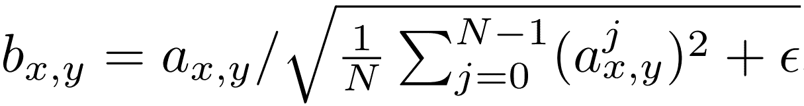

Image from the [research paper](https://arxiv.org/pdf/1710.10196.pdf)

数学上，像素(x，y)中的新特征向量将是旧特征向量除以该特定位置的所有像素值平方的平均值的平方根加上等于 10^-8.的ε这一点的实现将会非常清晰(你可以在这个[博客](https://blog.paperspace.com/p/157c6f39-80bb-4c88-a5e8-188d40e032f9/#load-all-dependencies-we-need)中从头看到 ProGAN 的整个实现)。

* * *

## 损失函数

对于损失函数，作者使用了 GANs 中常见的损失函数之一，Wasserstein 损失函数，也称为 WGAN-GP，来自论文[改进 Wasserstein GANs 的训练](https://arxiv.org/pdf/1704.00028.pdf)。但是，他们也说损失函数的选择与他们的贡献是正交的，这意味着 ProGAN (Minibatch 标准偏差，新图层中的淡入淡出和归一化(PixelNorm & Eq。依赖于特定损失函数。因此，使用我们想要的任何 GAN 损耗函数都是合理的，他们通过使用 LSGAN 损耗而不是 WGAN-GP 损耗来训练相同的网络来证明这一点。下图显示了使用 LSGAN 的方法生成的 10242 幅图像的六个示例。

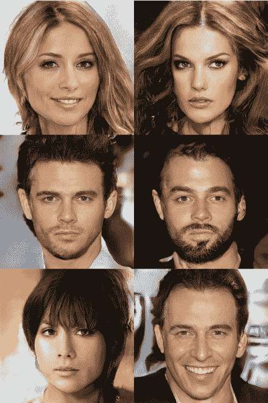

Image from the [research paper](https://arxiv.org/pdf/1710.10196.pdf)

然而，我们正试图完全遵循这篇论文，所以让我们稍微解释一下 WGAN-GP。在下图中，我们可以看到损失方程，其中:

*   “x”是生成的图像。
*   x 是来自训练集的图像。
*   d 是鉴别器。
*   GP 是一个梯度惩罚，有助于稳定训练。
*   梯度罚函数中的 **a** 项指的是 0 和 1 之间的随机数张量，均匀随机选择。
*   参数λ通常设置为 10。

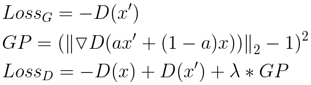

The WGAN-GP loss equations

* * *

## 结果

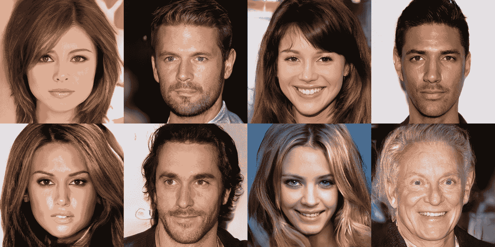

Image from the [research paper](https://arxiv.org/pdf/1710.10196.pdf)

我认为结果对大多数人来说是令人惊讶的，它们看起来非常好，它们是 1024 乘 1024 的图像，并且它们比以前的图像好得多。所以这是第一份在 GANs 产生真正高质量图像的革命性论文之一。

* * *

## 实施细节

作者在八个特斯拉 v100 GPUs 上训练网络，直到他们没有观察到任何类型的改进。这花了大约四天时间。在他们的实施中，他们根据输出分辨率使用自适应的微型批次大小，以便最佳利用可用的存储器预算(当他们无法将批次大小保存到存储器中时，他们会减小批次大小)。

### 发电机

在传统的 GANs 中，我们要求生成器立即生成一个固定的分辨率，比如 128 乘 128。一般来说，更高分辨率的图像更难生成，并且直接输出高质量的图像是一种具有挑战性的任务。在 ProGAN 中，我们要求生成器:

*   首先，通过将等于 512 的潜在向量作为输入来生成 4×4 的图像。他们也可以将其命名为噪声向量或 z-dim，然后将其映射到 512(在 1 个通道中)。然后，他们遵循一个很好的趋势，在开始时，他们使用一个转置卷积，从一个映射到四个，然后是具有三个三个滤波器的相同卷积，在两个卷积中使用泄漏 ReLU 作为激活函数。最后，他们添加一个逐个卷积，将通道数 512 映射到 RGB (3 个通道)。

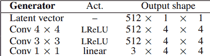

Image from the [research paper](https://arxiv.org/pdf/1710.10196.pdf) with some modification

*   接下来，他们使用相同的架构生成 8 乘 8 的图像，但没有将通道数映射到 RGB 的最终卷积层。然后，他们添加以下图层:上采样以将之前的分辨率翻倍，两个 Conv 图层使用 leaky ReLU 作为激活函数的三乘三滤镜，另一个 Conv 图层使用逐个滤镜输出 RGB 图像。

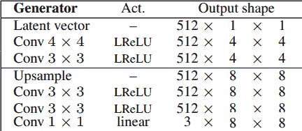

Image from the [research paper](https://arxiv.org/pdf/1710.10196.pdf) with some modification

*   然后，他们通过使用相同的架构而没有最后的卷积层并添加相同的层(上采样以使先前的分辨率加倍，两个具有使用 leaky ReLU 作为激活函数的 3×3 滤波器的 Conv 层，以及另一个具有逐个滤波器的 Conv 层以输出 RGB 图像),再次生成两倍于先前的尺寸。)直到达到期望的分辨率:1024×1024。在下图中，我们可以看到生成器的最终架构。

Generator architecture from the [research paper](https://arxiv.org/pdf/1710.10196.pdf)

### 鉴别器

对于鉴别者，他们做了相反的方法。这是发电机的镜像。当我们试图生成一个当前分辨率时，我们将真实图像下采样到相同的分辨率，以使真假不那么明显。

*   他们从生成 4x 4 图像开始，这意味着对真实图像进行下采样，直到达到相同的分辨率。鉴别器的输入是 RGB 图像，我们做了三个 Conv 层，第一个用一个接一个的滤波器，其他的用三个接三个的滤波器，使用 leaky ReLU 作为激活函数。然后，我们将图像下采样到之前分辨率的一半，并添加两个带有 3 乘 3 过滤器和泄漏 Relu 的 Conv 层。然后，我们再次向下采样，以此类推，直到达到我们想要的分辨率。然后，我们注入 Minibatch 标准差作为特征图，所以它从通道数到通道数+ 1(本例中为 512 到 513)。然后，他们可以分别用 3×3 和 4×4 的过滤器通过最后两个 Conv 层。最后，它们有一个完全连接的层来将多个通道(512)映射到一个通道。在下图中，我们可以看到 4x 4 图像的鉴别器架构。

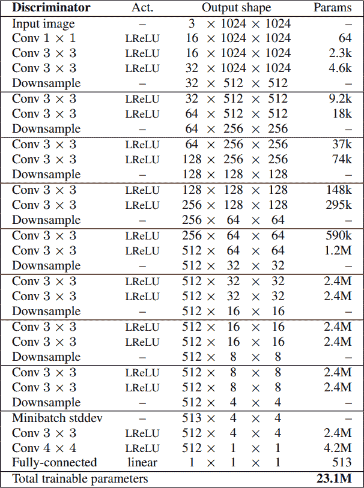

Discriminator architecture from the [research paper](https://arxiv.org/pdf/1710.10196.pdf)

*   如果我们想要生成 X 乘 X 的图像(其中 X 是图像的分辨率)，我们只需使用与前面相同的步骤，直到达到我们想要的分辨率，然后我们添加最后四个层(迷你批处理标准开发、Conv 3x3x、Conv 4x4 和完全连接)。在下图中，我们可以看到 32x32 图像的鉴别器架构。

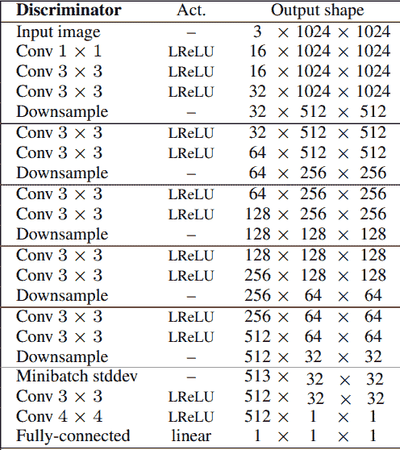

Image from the [research paper](https://arxiv.org/pdf/1710.10196.pdf) with some modification

* * *

## 结论

在本文中，我们研究了 GANs 发展史上的一些重要里程碑，并浏览了第一份生成真正高质量图像的革命性 ProGAN 论文。然后，我们探索了原始模型的目标、损失函数、结果、实现细节及其组件，以帮助深入理解这些网络。

希望读者能够遵循所有的步骤，很好地理解它，并准备好处理实现。我们可以在这篇[文章](https://blog.paperspace.com/p/157c6f39-80bb-4c88-a5e8-188d40e032f9/#load-all-dependencies-we-need)中找到它，在这篇文章中，我们使用来自 Kaggle 的这个[数据集](https://www.kaggle.com/datasets/tauilabdelilah/women-clothes?select=clothes)进行训练，对模型进行了一个干净、简单、可读的实现，以生成一些时装而不是人脸。在下图中，您可以看到分辨率为 128x128 的结果。

在接下来的文章中，我们将解释并使用 PyTorch 从头实现 style gan(style gan 1 基于 **ProGAN，** StyleGAN2 是对 SyleGAN1 的改进，StyleGAN3 是对 SyleGAN2 的改进)来生成一些很酷的时尚。