# 对图像网络的对抗性攻击:第一部分

> 原文：<https://blog.paperspace.com/adversarial-attacks/>

深度学习作为一个领域已经存在了 50 多年，但是，直到十年前，这些算法还不能很好地用于任何有意义的任务。计算的局限性是一个很难跨越的障碍。因此，当他们未能做正确的事情时，这被认为是典型的，而不是例外。今天，该领域已经发展到这些网络被用于一些关键的真实世界应用的程度。虽然这些模型可能在精选数据集上超过人类水平的性能，但当面对微不足道的敌对攻击时，它们会惨败。用伊恩·古德费勒(Ian Goodfellow)的话说，“我们已经到了机器学习行得通的地步，但可能很容易被打破”。

2014 年，来自谷歌和 NYU 的一个研究小组表明，CNN 很容易被愚弄，只要小心翼翼地给图像添加一些噪声。虽然这些扰动对于人眼来说是察觉不到的，但是它们会导致分类器产生不正确的输出。这里有一个例子。

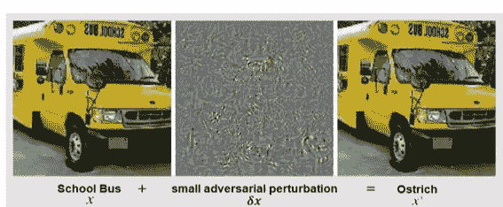

[Source](https://arxiv.org/pdf/2009.03728.pdf)

左边的图像被正确分类为校车，但通过添加少量噪声，模型被迫将其分类为鸵鸟。对于人类观察者来说，左图像和右图像之间没有区别。

虽然这种攻击可能看起来相当温和，但考虑一下无人驾驶汽车的场景。 [Metzen 等人](https://openaccess.thecvf.com/content_ICCV_2017/papers/Metzen_Universal_Adversarial_Perturbations_ICCV_2017_paper.pdf)在他们的论文“针对语义图像分割的通用对抗性扰动”中显示了通用噪声的存在，该噪声是输入不可知的，并且在大多数输入上愚弄了模型。

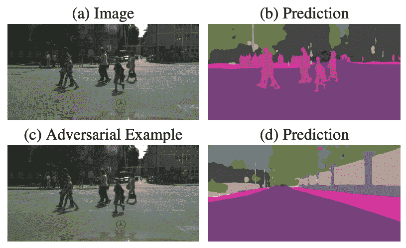

[Source](https://openaccess.thecvf.com/content_ICCV_2017/papers/Metzen_Universal_Adversarial_Perturbations_ICCV_2017_paper.pdf)

在上一行中，左边的图像是分割模型的输入，右边的图像是生成的输出。在较低的行中，图像被普遍的敌对噪声干扰，该噪声去除了行人目标类别，而在其他情况下使分割几乎不变。

有了这个例子，这种攻击的后果甚至会危及生命就更清楚了。因此，研究它们并降低它们的风险是很重要的。

## 敌对攻击的类型

根据黑客对目标模型的访问权限，对抗性攻击主要可以分为这两类。

### 白盒攻击

在这种情况下，攻击者可以完全访问深度学习模型或防御方案，或者攻击者在训练阶段具有影响力。在这个阶段，训练样本可能被破坏，或者训练集可能被对立的图像污染，以改变模型的参数。

由于安全措施的存在，这种类型的攻击非常罕见。此外，相比之下，由于攻击者在培训阶段就可以访问，所以这些也是最强大的攻击类型。因此，白盒攻击用于评估模型的健壮性及其在开发过程中的防御。

### 黑盒攻击

顾名思义，攻击者没有任何关于模型或防御机制的信息。尽管执行黑盒攻击有更大的困难，但这是最流行和最多样的攻击类别，因此当再现外部敌对攻击时，必须首先准备好这些攻击。

黑盒攻击的一个著名子类是 ***探索性攻击*** ，其中攻击者的目标是通过发送敌对图像的变化并观察模型对其的反应来探查模型的参数和成本函数。然后，攻击者试图通过训练一个*替代品或代理模型*，通过这些输入/输出对来复制模型。这种输入/输出攻击通常是执行黑盒攻击的第一步。

尽管与白盒攻击相比，在执行这些攻击时会遇到更大的困难，但是这些攻击更加危险，因为这里存在可以使用的普遍扰动(噪声)。这种“可转移性”有助于攻击者使用相同的扰动来欺骗不同的网络，这在白盒攻击中是不可能的，因为扰动取决于模型的权重和架构。

还有“灰箱攻击”，这是不言自明的，我不会在这里详细说明，因为对这一类别的研究非常有限。

## ML 模型的盲点

到目前为止，我们已经看到了对抗性攻击的不同设计方式。难道你不好奇这些攻击暴露出的训练模型的根本弱点是什么吗？

这个问题有很多假设。这里，我们将讨论这篇[论文](https://arxiv.org/pdf/1412.6572.pdf)中提出的线性假设。作者认为，神经网络是线性分类器的局部近似。LSTMs、ReLu、Maxout 网络都被有意设计成以线性方式运行，以便更容易优化。出于同样的原因，向非线性方向发展的模型，例如 sigmoid 网络，被仔细地调整以将它们的大部分时间花费在非饱和的、更线性的状态中。

这导致快速和容易的扰动。添加到靠近决策边界的实例的小噪声可以帮助它越过决策边界而落入错误的类中。我们在本文后面讨论的一些著名的对抗算法和防御机制就是基于这个假设。如需更深入的解释，请查看该文件本身。

## 对抗性攻击的算法

给图像添加随机噪声会骗过分类器吗？答案是，没有！用于创建噪声/扰动的算法基本上是优化，其通常利用 ML 模型的泛化缺陷来在原始图像中插入扰动。有很多开源的算法可以产生对抗性攻击。

除了讨论这些算法，我将讨论 3 种不同的方式来制定对抗性攻击，以及使用这些公式的算法。

### 1.最大允许攻击

为获得扰动图像而执行的优化是在一个约束条件下完成的。让我们来看看这门课的一般方程。

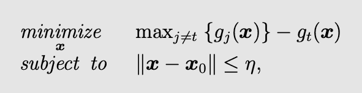

这个等式可能看起来有点可怕，但是让我们一点一点地分解它。

*   对于有针对性的对抗性攻击，我们希望攻击后我们的图像落在类别 *t* 中，g~t~(x)表示 x 落在 *t* 中的概率。
    等式的第一部分表示除了 *t* 之外的任何类的 x 的最大概率。总的来说，与其他类相比，第一个方程试图最大化预测错误类的概率。我们不仅希望分类器失败，而且希望以最高的置信度失败。
*   第二个等式是约束。还记得我们讨论过，对于人眼来说，扰动后的图像与原始图像是无法区分的。这个等式在差值上加了一个上限η，使之成为可能。

唷，那不算多。现在让我们看看实现这个公式的著名算法。

#### 快速梯度符号法

这是一个白盒策略，因为它使用模型的梯度来创建扰动。然后，这种扰动被添加到图像中，并由上限ε控制。

不要太担心等式的其他部分。在我们实现这个算法的博客文章的后面部分，我们将深入探讨这个问题。


还有一种 FGSM 的迭代版本，称为*基本迭代方法(BIM)。*它使用小步长迭代生成对立的例子。基本上，每一步的输入都是最后一步的扰动图像。与基本 FGSM 相比，通过多次迭代生成的对抗图像在欺骗模型方面更好，但是它不如 FGSM 快。

### 2.最小范数攻击

这些也是受约束的攻击，如最大允许攻击，但这里的约束有点不同。

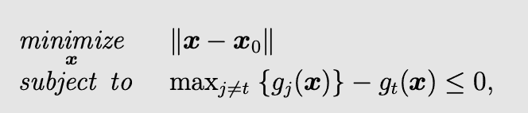

这里，与第一类攻击相比，要优化的等式及其优化的约束条件是相反的。所以，从根本上说，这不是一个很不同的方法。

我们希望最小化扰动幅度，同时还确保新图像 *x* 被分类到目标类别 *t* 中。如果最好的扰动图像( *x~0~* )仍然不能使目标值为负，那么我们可以说，对于特定的输入 x，攻击分类器是不可能的，这就是为什么我们考虑这个*约束优化*。

现在，让我们看看实现它的算法。

#### deepcool

这种攻击是最小范数攻击的推广。不是有针对性的攻击，所以约束改为非线性函数 *g(x)=0。*对于二元分类问题，优化被公式化为

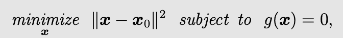

这里， *g(x)=0* 也可以被认为是分离两个类别的非线性决策边界。

这是数学部分。

在算法上，它被设计为执行分类器的迭代线性化，以产生足以改变分类标签的最小扰动。

简单地说，对于一个给定的输入 x，它为这个输入找到最近的决策边界(假设一个多类问题),并且将反复地给它添加细微的扰动，直到输入越过决策边界。

### 3.基于正则化的攻击

最大允许攻击和最小范数攻击是基于我们上面讨论的线性假设。这些方法不假设线性化的存在。对于高级分类器，如深度神经网络，求解包含约束的优化通常非常困难。基于正则化的攻击试图通过解除约束来解决这个问题。

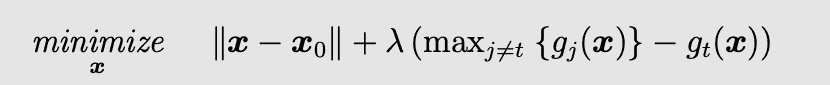

λ>0 是正则化参数，它试图同时最小化两个冲突的目标。等式的两个部分是冲突的，因为我们想要错误类别的概率与最大程度混合的其他类别的概率之间的差异，同时还保持低扰动。如果我们优化等式的一部分，另一部分就变得非最优。λ因此用于控制这两项的重要性。这个算法也是迭代的。

稍微简化一下上面的方程，我们就有了 f(x) = x + λy，现在在做迭代的时候，如果 y→∞，λ>1，f(x)→∞也是。在没有约束的情况下，这个问题可能变得无界，并且可能无限循环。

#### 卡里尼和瓦格纳攻击

该算法属于正则化攻击，但它试图解决无界问题。因此，当等式的第二部分小于等于 0 时，我们扰动的图像*x[o]已经在目标类中，并且没有必要再扰动它。在这种方法中，这是通过使用一种类似 ReLu 的叫做整流器的功能来实现的。*

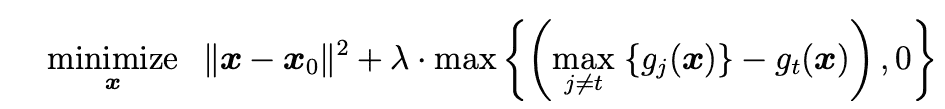

它将负值裁剪为 0，并保持正值不变。

我们已经讨论了敌对攻击的三个主要类别。是时候实施一个了！

### FGSM 的实施

这是 Ian GoodFellow 等人在 2014 年的这篇[论文](https://arxiv.org/pdf/1412.6572.pdf)中提出的第一批攻击策略之一，他还提出了我们不久前讨论过的线性假设。这是一种白盒方法，使用神经网络的梯度来产生扰动。它计算相对于输入图像的最大混合损失的损失梯度。这与训练期间发生的情况相反，损失的梯度是相对于模型参数计算的，随机梯度下降使其最小化。

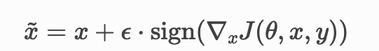

这里，x 表示原始图像，y 表示正确的标签，θ和 J 分别是模型参数和损失函数。ε是可以插入 x 的最大扰动量，由于攻击是在训练后进行的，并且需要单次的前后传球，所以速度非常快。

现在，理论已经讲得够多了，让我们在试图愚弄一个预先训练好的模型时弄脏我们的手。我们将使用 MobileNetV2 模型的 tensorflow 实现。

```py
import tensorflow as tf
import matplotlib as mpl
import matplotlib.pyplot as plt 

pretrained_model = tf.keras.applications.MobileNetV2(include_top=True,
                                                     weights='imagenet')
pretrained_model.trainable = False

# Loading ImageNet labels
decode_predictions = tf.keras.applications.mobilenet_v2.decode_predictions 
```

让我们定义辅助函数来预处理图像，并从 model.predict()返回的概率向量中提取标签

```py
def preprocess(image):
                      image = tf.cast(image, tf.float32)
                      image = tf.image.resize(image, (224, 224))
                      image = tf.keras.applications.mobilenet_v2.preprocess_input(image)
                      image = image[None, ...]
                      return image

def get_imagenet_label(probs):
     return decode_predictions(probs, top=1)[0][0] 
```

我们将要使用的图像是一只熊猫，因为熊猫是敌对攻击世界的典型代表。(第一篇论文展示了一个带有熊猫图像的对抗性攻击，从那以后，大多数关于对抗性攻击的文章都使用了这个图像)。让我们加载图像，对其进行预处理并获取类。

```py
image_raw = tf.io.read_file("panda.jpeg")
image = tf.image.decode_image(image_raw)
image = preprocess(image)
image_probs = pretrained_model.predict(image)

plt.figure()
plt.imshow(image[0] * 0.5 + 0.5)  # To change [-1, 1] to [0,1]
_, image_class, class_confidence = get_imagenet_label(image_probs)
plt.title('{} : {:.2f}% Confidence'.format(image_class, class_confidence*100))
plt.show() 
```

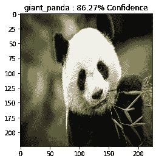

该形象以 86.27%的置信度被归类为“大熊猫”。

让我们通过获取原始图像的损失梯度来创建扰动。这些扰动将被添加到原始图像本身。

```py
loss_function = tf.keras.losses.CategoricalCrossentropy()
def create_adversarial_pattern(input_image, input_label):
  with tf.GradientTape() as tape:
    tape.watch(input_image)
    prediction = pretrained_model(input_image)
    loss = loss_function(input_label, prediction)

  # Get the gradients of the loss w.r.t to the input image.
  gradient = tape.gradient(loss, input_image)
  # Get the sign of the gradients to create the perturbation
  signed_grad = tf.sign(gradient)
  return signed_grad,gradient 
```

让我们也想象一下。

```py
# Get the input label of the image.
class_idx = 388 # index of the giant_panda class
label = tf.one_hot(class_idx, image_probs.shape[-1])
label = tf.reshape(label, (1, image_probs.shape[-1]))

perturbations,gradient = create_adversarial_pattern(image, label)
plt.imshow(perturbations[0] * 0.5 + 0.5); 
```

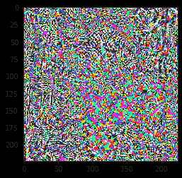

事先确定正确的ε值相当棘手。因此，我们将尝试多个值。

```py
epsilons = [0, 0.01,0.03,0.1, 0.15,0.3]
descriptions = [('Epsilon = {:0.3f}'.format(eps) if eps else 'Original Image')
                for eps in epsilons]
for i, eps in enumerate(epsilons):
    adv_x = image + eps*perturbations
    image = tf.clip_by_value(adv_x, -1, 1)
    _, label, confidence = get_imagenet_label(pretrained_model.predict(image))

    axs[pos[i][0], pos[i][1]].imshow(image[0]*0.5+0.5)
    axs[pos[i][0], pos[i][1]].set_title('{} \n {} : {:.2f}%'.format(descriptions[i],label, confidence*100)) 
```

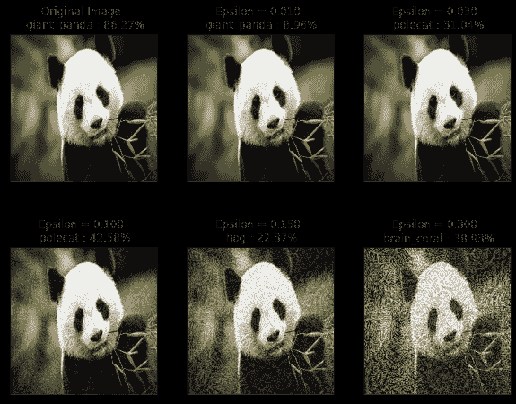

当我们增加ε值时，由类别和置信度识别的错误分类增加。此外，图像看起来越来越不安。正如所料，这两者之间似乎有所取舍。

### 结论

在这篇文章中，我们深入探讨了对抗性攻击，处理它们的重要性，实现它们的不同类型和不同类别的算法。我们还实现了快速梯度符号方法。为了探索其他方法的实现，我建议您查看一下 [cleverhans 库](https://github.com/cleverhans-lab/cleverhans)。现在我们知道了对抗性攻击的基本原理，学习如何减轻它们也很重要。在本系列的下一篇文章中，我计划探索这个问题。

*所以，敬请期待！*

### 参考资料:

*   [https://engineering . purdue . edu/Chang group/ECE 595/files/chapter 3 . pdf](https://engineering.purdue.edu/ChanGroup/ECE595/files/chapter3.pdf)
*   [https://www . tensor flow . org/tutorials/generative/adversarial _ fgsm](https://www.tensorflow.org/tutorials/generative/adversarial_fgsm)
*   [http://www . clever Hans . io/security/privacy/ml/2016/12/16/breaking-things-is-easy . html](http://www.cleverhans.io/security/privacy/ml/2016/12/16/breaking-things-is-easy.html)
*   [https://ui . adsabs . Harvard . edu/ABS/2020 ARX iv 200903728 r/abstract](https://ui.adsabs.harvard.edu/abs/2020arXiv200903728R/abstract)