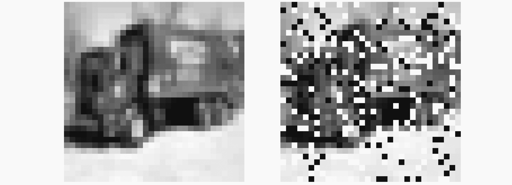
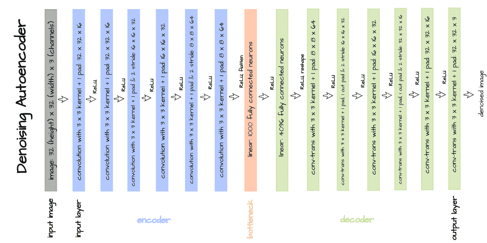
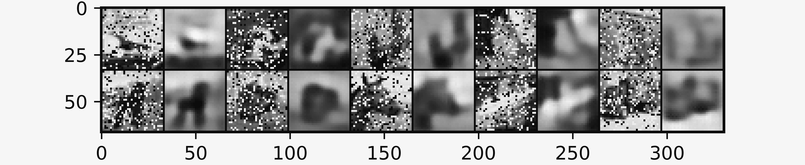
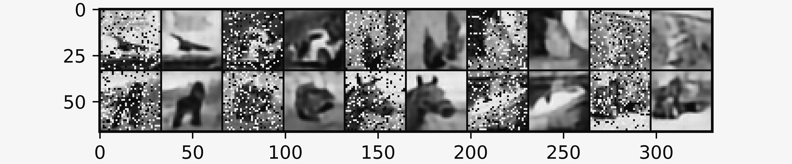
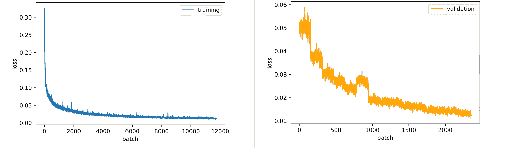

# 降噪自动编码器

> 原文：<https://blog.paperspace.com/denoising-autoencoders/>

在之前的文章中，我提到过自动编码器可能不是生成任务的首选。话虽如此，但他们都有自己独特的优势。在这篇文章中，我们将看看这些优势之一，图像去噪。

### 设置和导入

```py
#  article dependencies
import torch
import torch.nn as nn
import torch.nn.functional as F
import torchvision
import torchvision.transforms as transforms
import torchvision.datasets as Datasets
from torch.utils.data import Dataset, DataLoader
import numpy as np
import matplotlib.pyplot as plt
import cv2
from tqdm.notebook import tqdm
from tqdm import tqdm as tqdm_regular
import seaborn as sns
from torchvision.utils import make_grid
import random
```

```py
#  configuring device
if torch.cuda.is_available():
  device = torch.device('cuda:0')
  print('Running on the GPU')
else:
  device = torch.device('cpu')
  print('Running on the CPU')
```

### 自动编码器和表示学习

到目前为止，我们知道自动编码器学习从输入到输出的映射，唯一的目的是重建输入数据。然而，从表面上看，这真的没有多大用处。

例如，在卷积自动编码器的情况下，这些自动编码器学习表示以重建图像，您会同意简单地将图像通过卷积自动编码器只是为了在另一端获得相同图像的重建并不太有益。

### 超越图像重建

与我们关注图像数据的主题保持一致，考虑这样一种情况，我们有一堆损坏的图像，这些图像在某种意义上是损坏的，即一些/所有像素已经以某种不期望的方式被修改。如果可以再现这种特定形式的图像损坏，使得从一组未损坏的图像中生成损坏图像的数据集，则可以训练卷积自动编码器来学习从损坏图像到未损坏图像的映射，从而有效地学习消除这种特定形式的损坏的图像。

上述上下文中的图像恶化被称为 ***噪声**、*，并且从图像中去除所述恶化的过程被称为 ***图像去噪*** ，而用于此效果的自动编码器被称为 ***去噪自动编码器*** 。

### 实现去噪自动编码器

在本节中，我们将准备一个数据集，通过向图像添加一些噪声来训练去噪自动编码器，并训练卷积自动编码器来消除特定类型的图像噪声。

#### 资料组

CIFAR-10 数据集将用于训练和验证目的。这是一个数据集，包含 10 类图像，从青蛙到汽车、鸟类等等。可以在 PyTorch 中加载它，就像下面的代码单元格中所做的那样。

```py
#  loading training data
training_set = Datasets.CIFAR10(root='./', download=True,
                                transform=transforms.ToTensor())

#  loading validation data
validation_set = Datasets.CIFAR10(root='./', download=True, train=False,
                                  transform=transforms.ToTensor())
```


CIFAR-10 images.

由于我们将学习图像到图像的映射，在这种情况下，我们不需要类标签，所有需要做的就是从它们各自的对象中提取训练和验证图像。此外，为了直观起见，我们将从验证集中的每个类别中提取一幅图像，以便我们可以看到在训练时，自动编码器在每个时期后对该类别的图像进行去噪的效果如何，我们将此称为测试集。

```py
def extract_each_class(dataset):
  """
  This function searches for and returns
  one image per class
  """
  images = []
  ITERATE = True
  i = 0
  j = 0

  while ITERATE:
    for label in tqdm_regular(dataset.targets):
      if label==j:
        images.append(dataset.data[i])
        print(f'class {j} found')
        i+=1
        j+=1
        if j==10:
          ITERATE = False
      else:
        i+=1

  return images

#  extracting training images
training_images = [x for x in training_set.data]

#  extracting validation images
validation_images = [x for x in validation_set.data]

#  extracting one image from each class in the validation set
test_images = extract_each_class(validation_set)
```

##### 图像转换为灰度

虽然有不同类型的图像噪声，但在本文中，我们将重点讨论“椒盐噪声”，这是一种普遍存在于灰度图像中的噪声。正如我们所知，CIFAR-10 图像是彩色的，为了方便地将它们转换为灰度，我们可以简单地取各个通道的单个像素的平均值，这样我们就可以从 3 通道图像(彩色)转换为单通道图像(灰度)。

```py
#  converting images to grayscale by taking mean across axis-2 (depth)
training_gray = [x.mean(axis=2) for x in training_images]
validation_gray = [x.mean(axis=2) for x in validation_images]
test_gray = [x.mean(axis=2) for x in test_images]
```

为了稍微清理一下像素值，让我们通过将像素限制在 0 和 1 之间的值来归一化像素，这对于大多数灰度图像来说是典型的。

```py
def min_max_normalize_gray(dataset: list):
  """
  This function normalizes data by constraining
  data points between the range of 0 & 1  
  """
  #  create a list to hold normalized data  
  normalized = []

  for image in tqdm_regular(dataset):
    #  creating temporary store
    temp = []
    #  flatenning
    pixels = image.flatten()
    #  derive minimum and maximum values
    minimum = pixels.min()
    maximum = pixels.max()
    #  convert to list for iteration
    pixels = list(pixels)

    for pixel in pixels:
      #  normalizing pixels
      normalize = (pixel-minimum)/(maximum-minimum)
      #  appending each pixel to temporary store
      temp.append(round(normalize, 2))

    temp = np.array(temp)
    temp = temp.reshape((32, 32))
    #  appending normalized image to list
    normalized.append(temp)

  return normalized

#  normalizing pixels
training_gray = min_max_normalize_gray(training_gray)
validation_gray = min_max_normalize_gray(validation_gray)
test_gray = min_max_normalize_gray(test_gray)
```

##### 创建嘈杂的副本

椒盐噪声可以被认为是散布在图像表面的白色(盐)和黑色(胡椒)像素点。从概念上来说，这仅仅意味着一些像素被随机转换成 0(黑色)和 1(白色)。有了这些知识，我们可以使用下面的代码单元再现椒盐噪声。

```py
def random_noise(dataset: list, noise_intensity=0.2):
  """
  This function replicates the salt and pepper noise process
  """
  noised = []
  noise_threshold = 1 - noise_intensity

  for image in tqdm_regular(dataset):
    #  flatenning image
    image = image.reshape(1024)

    #  creating vector of zeros
    noise_vector = np.zeros(1024)

    #  noise probability
    for idx in range(1024):
      regulator = round(random.random(), 1)
      if regulator > noise_threshold:
        noise_vector[idx] = 1
      elif regulator == noise_threshold:
        noise_vector[idx] = 0
      else:
        noise_vector[idx] = image[idx]

    #  reshaping noise vectors
    noise_vector = noise_vector.reshape((32, 32))

    noised.append(noise_vector)
  return noised

#  adding noise to images
training_noised = random_noise(training_gray)
validation_noised = random_noise(validation_gray)
test_noised = random_noise(test_gray)
```

可视化上面定义的过程中的噪声图像显示了模拟盐和胡椒噪声的白色和黑色斑点的存在。由于 CIFAR-10 数据集中的图像大小为 32 x 32 像素，请原谅严重的像素化。



Uncorrupted vs corrupted image.

现在可以通过压缩损坏的和未损坏的图像来将训练集、验证集和测试集放在一起，以形成图像-目标对，如下面的代码单元格中所做的那样。

```py
#  creating image-target pair
training_set = list(zip(training_noised, training_gray))
validation_set = list(zip(validation_noised, validation_gray))
test_set = list(zip(test_noised, test_gray))
```

##### PyTorch 数据集

为了在 PyTorch 中使用我们的数据集，我们需要将它实例化为 PyTorch 数据集类的成员，如下所示。注意，图像中的像素再次在平均值 0.5 和标准偏差 0.5 附近被归一化，以试图将所有像素置于可管理的近似分布内。

```py
#  defining dataset class
class CustomCIFAR10(Dataset):
  def __init__(self, data, transforms=None):
    self.data = data
    self.transforms = transforms

  def __len__(self):
    return len(self.data)

  def __getitem__(self, idx):
    image = self.data[idx][0]
    target = self.data[idx][1]

    if self.transforms!=None:
      image = self.transforms(image)
      target = self.transforms(target)
    return (image, target)

#  creating pytorch datasets
training_data = CustomCIFAR10(training_set, transforms=transforms.Compose([transforms.ToTensor(),
                                                                          transforms.Normalize(0.5, 0.5)]))
validation_data = CustomCIFAR10(validation_set, transforms=transforms.Compose([transforms.ToTensor(),
                                                                              transforms.Normalize(0.5, 0.5)]))
test_data = CustomCIFAR10(test_set, transforms=transforms.Compose([transforms.ToTensor(),
                                                                  transforms.Normalize(0.5, 0.5)]))
```

##### 拼接卷积自动编码器

现在需要定义卷积自动编码器。对于本文，我们将实现下图所示的定制自动编码器架构。



Convolutional autoencoder architecture to be used for the sake of image denoising.

该自动编码器由一个编码器和一个解码器组成，每个解码器有 6 个卷积层。还指定了大小为 1000 的瓶颈/潜在空间。该架构是在 PyTorch 中实现的，如下面的代码单元所示。

```py
#  defining encoder
class Encoder(nn.Module):
  def __init__(self, in_channels=3, out_channels=16, latent_dim=1000, act_fn=nn.ReLU()):
    super().__init__()
    self.in_channels = in_channels

    self.net = nn.Sequential(
        nn.Conv2d(in_channels, out_channels, 3, padding=1), # (32, 32)
        act_fn,
        nn.Conv2d(out_channels, out_channels, 3, padding=1), 
        act_fn,
        nn.Conv2d(out_channels, 2*out_channels, 3, padding=1, stride=2), # (16, 16)
        act_fn,
        nn.Conv2d(2*out_channels, 2*out_channels, 3, padding=1),
        act_fn,
        nn.Conv2d(2*out_channels, 4*out_channels, 3, padding=1, stride=2), # (8, 8)
        act_fn,
        nn.Conv2d(4*out_channels, 4*out_channels, 3, padding=1),
        act_fn,
        nn.Flatten(),
        nn.Linear(4*out_channels*8*8, latent_dim),
        act_fn
    )

  def forward(self, x):
    x = x.view(-1, self.in_channels, 32, 32)
    output = self.net(x)
    return output

#  defining decoder
class Decoder(nn.Module):
  def __init__(self, in_channels=3, out_channels=16, latent_dim=1000, act_fn=nn.ReLU()):
    super().__init__()

    self.out_channels = out_channels

    self.linear = nn.Sequential(
        nn.Linear(latent_dim, 4*out_channels*8*8),
        act_fn
    )

    self.conv = nn.Sequential(
        nn.ConvTranspose2d(4*out_channels, 4*out_channels, 3, padding=1), # (8, 8)
        act_fn,
        nn.ConvTranspose2d(4*out_channels, 2*out_channels, 3, padding=1, 
                           stride=2, output_padding=1), # (16, 16)
        act_fn,
        nn.ConvTranspose2d(2*out_channels, 2*out_channels, 3, padding=1),
        act_fn,
        nn.ConvTranspose2d(2*out_channels, out_channels, 3, padding=1, 
                           stride=2, output_padding=1), # (32, 32)
        act_fn,
        nn.ConvTranspose2d(out_channels, out_channels, 3, padding=1),
        act_fn,
        nn.ConvTranspose2d(out_channels, in_channels, 3, padding=1)
    )

  def forward(self, x):
    output = self.linear(x)
    output = output.view(-1, 4*self.out_channels, 8, 8)
    output = self.conv(output)
    return output

#  defining autoencoder
class Autoencoder(nn.Module):
  def __init__(self, encoder, decoder):
    super().__init__()
    self.encoder = encoder
    self.encoder.to(device)

    self.decoder = decoder
    self.decoder.to(device)

  def forward(self, x):
    encoded = self.encoder(x)
    decoded = self.decoder(encoded)
    return decoded
```

##### 卷积自动编码器类

一个典型的自动编码器执行 3 个主要功能，它通过它的*编码器*学习一个矢量表示，在图像被它的*解码器*重建之前，这个表示在它的*瓶颈*中被压缩。为了能够在需要时单独使用自动编码器的这些独立组件，我们将定义一个类，通过将其中两个函数定义为方法来帮助实现这一点。为了可移植性，一个训练方法也将被构建到这个类中。

```py
#  defining class
class ConvolutionalAutoencoder():
  def __init__(self, autoencoder):
    self.network = autoencoder
    self.optimizer = torch.optim.Adam(self.network.parameters(), lr=1e-3)

  def train(self, loss_function, epochs, batch_size, 
            training_set, validation_set, test_set,
            image_channels=3):

    #  creating log
    log_dict = {
        'training_loss_per_batch': [],
        'validation_loss_per_batch': [],
        'visualizations': []
    } 

    #  defining weight initialization function
    def init_weights(module):
      if isinstance(module, nn.Conv2d):
        torch.nn.init.xavier_uniform_(module.weight)
        module.bias.data.fill_(0.01)
      elif isinstance(module, nn.Linear):
        torch.nn.init.xavier_uniform_(module.weight)
        module.bias.data.fill_(0.01)

    #  initializing network weights
    self.network.apply(init_weights)

    #  creating dataloaders
    train_loader = DataLoader(training_set, batch_size)
    val_loader = DataLoader(validation_set, batch_size)
    test_loader = DataLoader(test_set, 10)

    #  setting convnet to training mode
    self.network.train()
    self.network.to(device)

    for epoch in range(epochs):
      print(f'Epoch {epoch+1}/{epochs}')
      train_losses = []

      #------------
      #  TRAINING
      #------------
      print('training...')
      for images, targets in tqdm(train_loader):
        #  zeroing gradients
        self.optimizer.zero_grad()
        #  sending images and targets to device
        images = images.to(device).type(torch.cuda.FloatTensor)
        targets = targets.to(device).type(torch.cuda.FloatTensor)
        #  reconstructing images
        output = self.network(images)
        #  computing loss
        loss = loss_function(output, targets)
        loss = loss#.type(torch.cuda.FloatTensor)
        #  calculating gradients
        loss.backward()
        #  optimizing weights
        self.optimizer.step()

        #--------------
        # LOGGING
        #--------------
        log_dict['training_loss_per_batch'].append(loss.item())

      #--------------
      # VALIDATION
      #--------------
      print('validating...')
      for val_images, val_targets in tqdm(val_loader):
        with torch.no_grad():
          #  sending validation images and targets to device
          val_images = val_images.to(device).type(torch.cuda.FloatTensor)
          val_targets = val_targets.to(device).type(torch.cuda.FloatTensor)
          #  reconstructing images
          output = self.network(val_images)
          #  computing validation loss
          val_loss = loss_function(output, val_targets)

        #--------------
        # LOGGING
        #--------------
        log_dict['validation_loss_per_batch'].append(val_loss.item())

      #--------------
      # VISUALISATION
      #--------------
      print(f'training_loss: {round(loss.item(), 4)} validation_loss: {round(val_loss.item(), 4)}')

      for test_images, test_targets in test_loader:
        #  sending test images to device
        test_images = test_images.to(device).type(torch.cuda.FloatTensor)
        with torch.no_grad():
          #  reconstructing test images
          reconstructed_imgs = self.network(test_images)
        #  sending reconstructed and images to cpu to allow for visualization
        reconstructed_imgs = reconstructed_imgs.cpu()
        test_images = test_images.cpu()

        #  visualisation
        imgs = torch.stack([test_images.view(-1, image_channels, 32, 32), reconstructed_imgs], 
                          dim=1).flatten(0,1)
        grid = make_grid(imgs, nrow=10, normalize=True, padding=1)
        grid = grid.permute(1, 2, 0)
        plt.figure(dpi=170)
        plt.title('Original/Reconstructed')
        plt.imshow(grid)
        log_dict['visualizations'].append(grid)
        plt.axis('off')
        plt.show()

    return log_dict

  def autoencode(self, x):
    return self.network(x)

  def encode(self, x):
    encoder = self.network.encoder
    return encoder(x)

  def decode(self, x):
    decoder = self.network.decoder
    return decoder(x)
```

##### 训练去噪自动编码器

现在一个去噪自动编码器准备好被训练。训练是通过将 autoencoder 类实例化为卷积 autoencoder 类的成员并调用 train 方法来完成的。均方误差被用作选择的损失函数，因为模型使用 64 的批量大小被训练 15 个时期。

```py
#  training model
model = ConvolutionalAutoencoder(Autoencoder(Encoder(in_channels=1),
                                               Decoder(in_channels=1)))

log_dict = model.train(nn.MSELoss(), epochs=15, batch_size=64, 
                       training_set=training_data, validation_set=validation_data,
                       test_set=test_data, image_channels=1)
```

在第一个时期之后，很明显，自动编码器已经在从图像中去除噪声/破坏方面做得不错，如在每个时期之后返回的可视化中所看到的。它的重建是非常低的细节(模糊)。



Epoch 1.

针对更多时段的训练确保了产生更精细的重建，并且到第 15 时段，与时段 1 相比，在去噪图像的质量上可以看到明显的提升。必须记住的是，可视化中去噪的图像是测试图像，自动编码器并没有在这些图像上进行训练，这证明了它的通用性。



Epoch 15.

看一下训练和验证损失图，很明显两个损失都是下降趋势，因此意味着自动编码器仍然可以从一些额外的训练时期中受益。



Training and validation losses.

### 结束语

在本文中，我们了解了自动编码器的一个用途，即图像去噪。我们可以看到 autoencoder 的表示学习如何允许它学习映射，从而足够有效地修复不正确的像素/数据点。

这可以扩展到表格数据应用程序，在这些应用程序中，自动编码器有助于填充数据实例中的缺失值。然而，应该注意的是，去噪自动编码器仅在它们已经被训练的特定种类的噪声上工作。