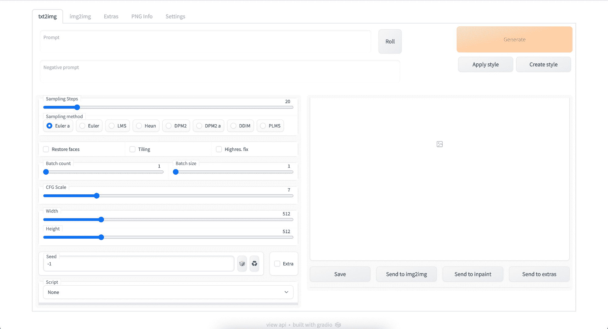
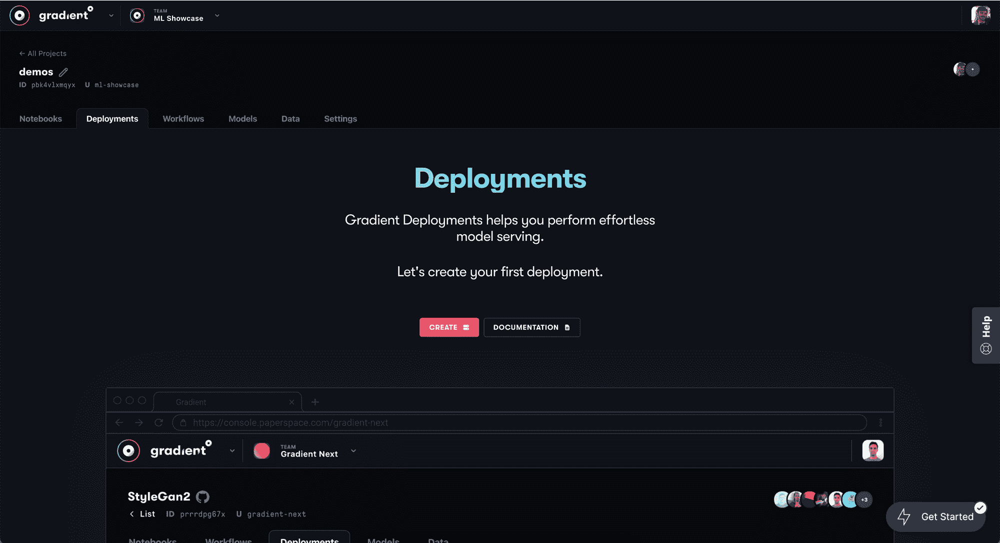
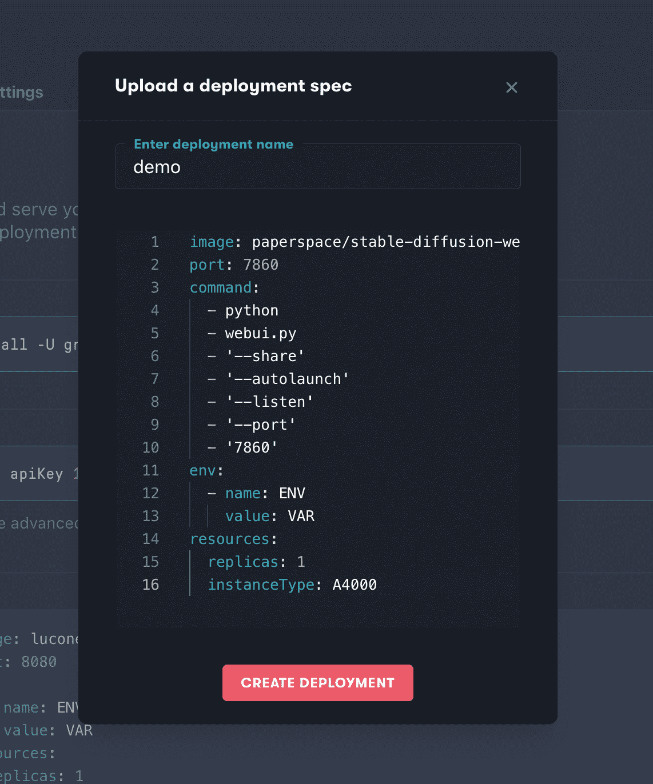
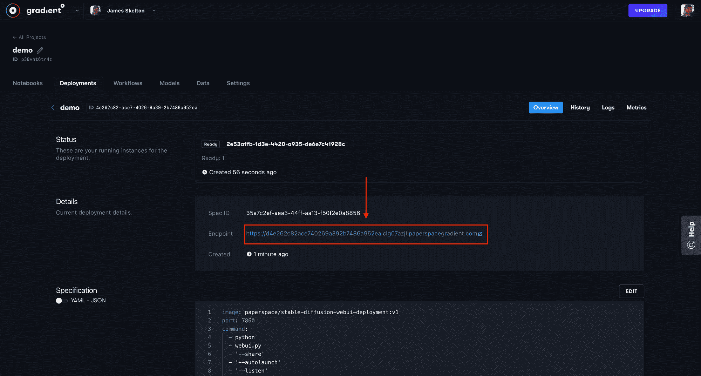
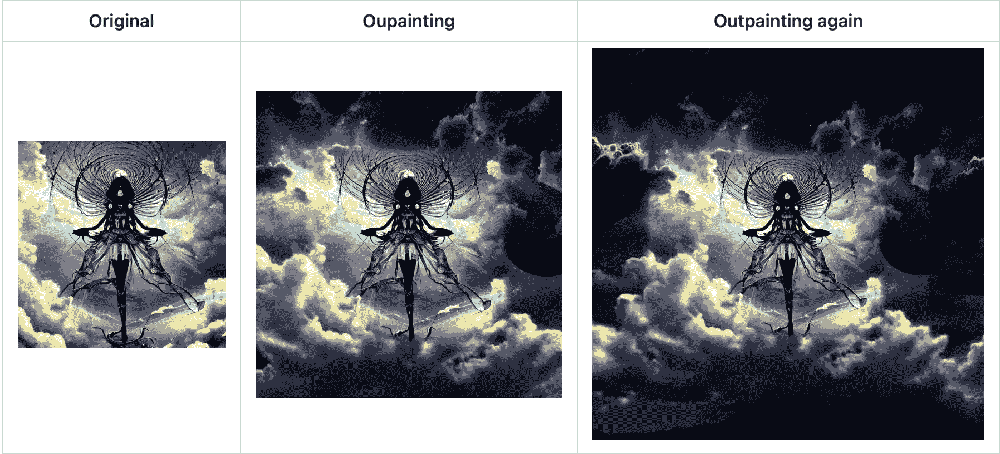
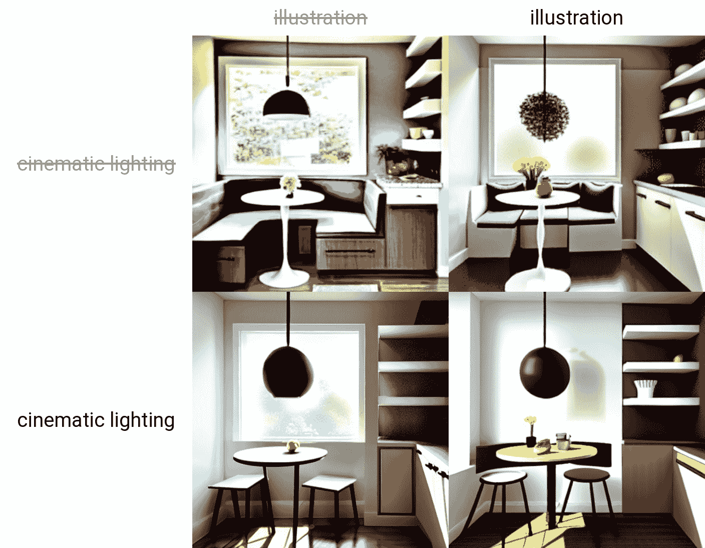
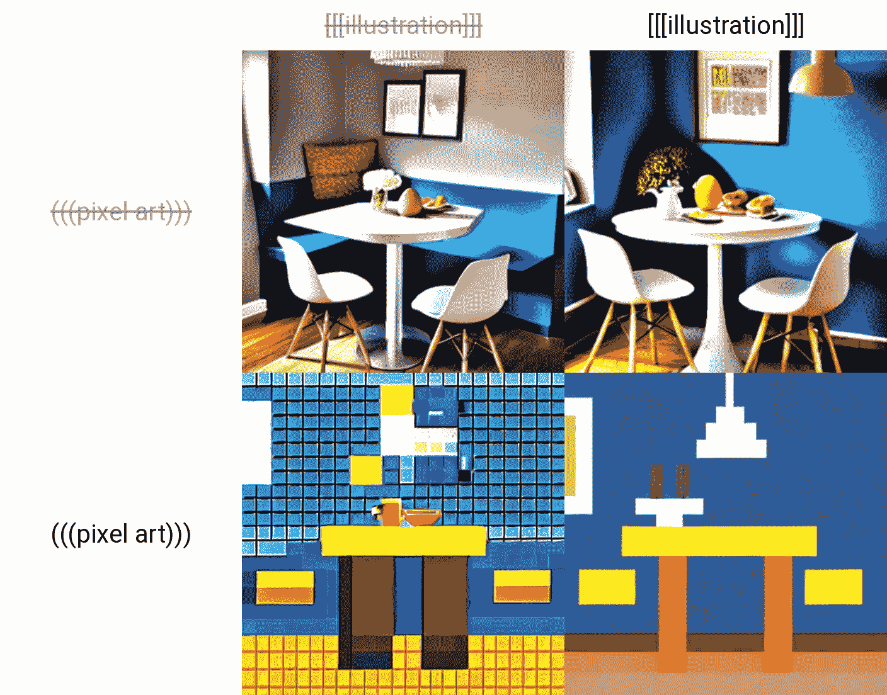

# 从梯度部署运行稳定扩散 web UI

> 原文：<https://blog.paperspace.com/stable-diffusion-webui-deployment/>

> 2022 年 11 月 30 日:[本教程现已过时:请点击此处查看后续文章，了解 Paperspace 上 Web UI 部署的最新版本](https://blog.paperspace.com/stable-diffusion-webui-deployment-2/)

随着越来越多的人赶上这股热潮，稳定扩散的受欢迎程度持续爆炸式增长。稳定扩散是潜在扩散模型的一个强大的预训练版本，是上个月由 CompVis 的研究人员发布的一个扩散模型。该模型使用 LAION 5B 数据集的子集进行训练，包括用于初始训练的高分辨率子集和用于后续回合的“美学”子集。

最终，他们得到了一个极其健壮的模型，它能够以视觉形式模拟和再现几乎任何可以想象的概念，除了文本提示输入之外，不需要任何指导。请务必查看我们关于稳定扩散的[完整报道](https://blog.paperspace.com/generating-images-with-stable-diffusion/)和[技术讲座](https://www.youtube.com/watch?v=_5eeItn-9tc&t=2s)，以获得关于该模型如何产生、底层架构的更多信息，并在发布时更全面地了解其功能。

在本文中，我们将看看 Stable Diffusion web UI 的 AUTOMATIC111 fork ,并展示如何在任何 Paperspace GPU 驱动的机器上在不到一分钟的时间内旋转 web UI。这个令人敬畏的应用程序由 [Gradio](https://gradio.app/) 提供支持，让用户在一个低代码 GUI 中立即访问稳定扩散。

## 稳定扩散网络用户界面

随着这项技术越来越受欢迎，使用 awesome 模型的不同方法也越来越多。虽然原始的扩散器包仍然是访问任何给定合成任务的稳定扩散检查点的最常见方法，但原始 repo 的许多替代分支、变化以及与其他技术的融合，如 [CrossAttentionControl](https://github.com/bloc97/CrossAttentionControl) 或 [Guided Diffusion](https://github.com/Jack000/glid-3-xl-stable) ，以及 full on web 应用程序已经发展到从原始存储库服务于社区。



The web UI GUI

可以说，其中最流行和更新最频繁的是 AUTOMATIC111 的稳定扩散 web UI 分支。除了稳定扩散的基本功能，如 txt2img、img2img、修复和升级，web UI 还打包了许多改进、生活质量修复、附加和实验脚本以及许多附加升级，所有这些都可以从易于使用的 web 应用程序 GUI 访问。(有关 web UI 特性的更多信息，请参阅本文的特性部分)

## 用户开始使用稳定扩散 web 用户界面的挑战

虽然 web UI 为稳定的扩散图像合成提供了对标准扩散器包方法的强大升级，但是想要利用这些升级的用户面临两个挑战:

*   设置:虽然 web UI 自带内置的设置脚本来帮助新用户，但它还不是即插即用的——即使在渐变笔记本中也是如此。用户要么需要学习如何自己设置环境，要么使用 fork 来为他们设置环境
*   计算:在本地机器上找到足够的计算量来及时运行稳定的扩散过程是很困难的，所以远程实例是理想的。

有了梯度部署，我们可以消除很多令人头疼的问题，包括采购计算和完成设置以运行 web UI。我们已经创建了一个 docker 容器，它预装了在部署中执行 web UI 所需的所有必需的包和模型。这个公共容器可以通过 Docker Hub 访问，用于任何渐变笔记本、工作流或部署。

### web 用户界面存在的问题

同样值得注意的是，这仍处于开发阶段，并且会遇到此类应用程序常见的成长烦恼。如果您遇到 web UI 的问题，比如图像生成后无法输出，这可能是 web UI 界面的问题。尽管有这些小问题，web UI 仍然是在低代码环境中使用稳定扩散的最佳方式之一。

稳定扩散模型本身有其局限性，如低分辨率图像生成。在使用 web 用户界面时，一定要记住这些，如果出现问题，可以考虑重新启动部署。

最后，如果部署本身突然离线，这可能有多种原因。在部署概述中检查您的规范，查看副本数量是否超过“0”。如果没有，请将其更改为重启部署。

## 如何在渐变部署中使用稳定扩散 web 用户界面

有两种方法可以启动梯度部署:通过 Paperspace web 控制台或梯度 CLI。让我们先来看看 web 设置方法:

> 2022 年 11 月 30 日:[本教程现已过时:请点击此处查看后续文章，了解 Paperspace 上 Web UI 部署的最新版本](https://blog.paperspace.com/stable-diffusion-webui-deployment-2/)

### Web 设置



要在渐变部署中运行稳定扩散 web UI，首先登录到您的渐变帐户，并导航到您选择的团队和项目。然后点击部署选项卡，并点击创建。



进入部署页面后，单击“上传部署规范”链接在“运行部署”部分下。然后，只需将下面的部署 YAML 规范粘贴到弹出窗口中，并适当地命名您的部署。

```py
image: paperspace/stable-diffusion-webui-deployment:v1
port: 7860
command:
  - python
  - webui.py
  - '--share'
  - '--autolaunch'
  - '--listen'
  - '--port'
  - '7860'
env:
  - name: ENV
    value: VAR
resources:
  replicas: 1
  instanceType: <Machine Type> <-- We suggest the A4000
```

请务必将底部的`<machine type>`改为您想要使用的机器。你可以在这里找到可用机器的完整列表[，并且一定要考虑价格。我推荐 A4000，但从成本效益的角度来看，从长远来看，更大的图像生成项目将受益于使用更强大的 GPU，如 A100。](https://docs.paperspace.com/gradient/machines/#list-of-gradient-machines)



Click on the link that says Endpoint to access the web UI GUI

完成后，点击“创建部署”启动机器。这需要大约一分钟的时间来设置。完成后，单击部署详细信息页面中的 API 端点链接打开 web UI。

使用完部署后，您可以删除它或使用概览页面右侧的“编辑”按钮更新规范。在规范中，将副本数量从“1”更改为“0”，机器将停止运行。

### 梯度 CLI 设置

首先，确保您已经按照[文档](https://docs.paperspace.com/gradient/cli/)中列出的步骤下载并登录到 Gradient CLI。您需要获得 API 密钥才能从 Paperspace 控制台登录。

一旦你用你的 API 密匙登录，进入你的终端并创建一个新的目录来保存我们的 YAML 文件。然后在终端用`touch deploy-stable-diffusion.yaml`新建一个文件“deploy-stable-diffusion.yaml”。在您选择文本编辑器中打开该文件，并粘贴以下内容

```py
image: paperspace/stable-diffusion-webui-deployment:v1
port: 7860
command:
  - python
  - webui.py
  - '--share'
  - '--autolaunch'
  - '--listen'
  - '--port'
  - '7860'
env:
  - name: ENV
    value: VAR
resources:
  replicas: 1
  instanceType: <Machine Type> <-- We suggest the A4000
```

请务必将底部的`<machine type>`更改为您想要使用的任何机器。你可以在这里找到可用机器[的完整列表，并且一定要考虑定价。接下来，运行 gradient projects list 并找到您想要用于此部署的项目的 ID。如果没有，用`gradient projects create`创建一个。](https://docs.paperspace.com/gradient/machines/#list-of-gradient-machines)

一旦完成，您就可以用一个终端执行来启动您的部署了！只需运行以下命令来加速您的部署:

```py
gradient deployments create --name [Deployment name] --projectId [your Project ID] --spec [path to your deployment spec file i.e. deploy-stable-diffusion.yaml]
```

从那里，它应该需要大约一分钟来设置。完成后，您需要单击部署详细信息页面中的 API 端点链接来打开 web UI。您可以在浏览器的渐变部署控制台中访问它，或者通过在您的终端中输入以下新部署 ID 来访问它:

`gradient deployments get --id <your deployment id>`

然后，当您使用完部署时，您可以通过返回到您的 spec 文件并将其更改为 0 个副本来删除它。这将停止部署运行，但不会删除它。然后使用以下终端命令更新您的部署:

`gradient deployments update --id <your deployment id> --spec <path to updated spec>`

## 稳定扩散 web 用户界面的功能

现在我们已经创建了我们的部署，我们准备在 GUI 中使用稳定扩散模型的功能。这些功能是从原始扩散器库高度变化和扩展的，包括但不限于:


samples from the txt2img input "A (((cowboy))) astronaut riding a horse on the moon"

*   原始 txt2img 和 img2img 模式:潜在扩散 img2img 和 txt2img 的原始脚本



Sample outpainting images from stable-diffusion-webui repo

*   Outpainting:使用它来预测图像边界之外的视觉上下文，即从图像的原始边界之外到新的所需边界填充缺失的信息。


From an original input photo of the Eifel Tower, this series of inpainted images shows "a (((gorilla))) (((King Kong))) climbing the side of a tower"

*   修复:以前，可以上传蒙版图像进行图像修复。通过 web UI，用户可以在 GUI 内的所需区域上绘画，并修补特定的目标区域。



Prompt matrix example using the prompt "a cute breakfast nook in a modern home with a small table and an egg|illustration|cinematic lighting"

*   提示矩阵:使用`|`字符分隔多个提示，系统将为它们的每个组合生成一个图像。
*   稳定扩散放大:使用稳定扩散将图像生成参数放大到更高的分辨率，而不会损失视觉敏锐度或主题



Example of using multiple attention flags to change presentation of final output using prompt "a cute breakfast nook in a modern home with a small table and an egg|illustration|pixel art"

*   注意:使用注意来控制提示的哪些部分更重要或更不重要。在提示中使用`()`增加模型对包含单词的注意，而`[]`减少它。您可以使用括号和圆括号的多个实例来增加或减少权重。

web UI 的其他有用功能包括:

*   采样方法选择:从大量不同的采样方法中进行选择，包括 ddim、欧拉和 PLMS。
*   随时中断处理:随时点击中断按钮，中断推理过程，吐出当前版本的图像。
*   提示长度验证:检测您的提示对于稳定扩散来说是否太长而无法用作输入。
*   设置页面:设置页面允许您定制用于不同建模过程的各种设置。
*   从 UI 运行定制代码:通过在部署规范中输入用户标志`--allow-code`，您可以在 web UI 中使用定制代码功能。
*   随机艺术家按钮:随机艺术家按钮会在你的提示中附加一个随机艺术家的名字(和风格)。
*   平铺支持:创建可以像纹理一样平铺的图像的 UI 复选框。这些平铺尺寸可以根据需要进行调整。
*   进度条和实时图像生成预览:在图像生成时实时查看您的进度。
*   负面提示:用户不希望赋予最终图像的特定关键字。
*   样式:保存提示和否定提示以备后用。
*   种子大小调整:在不同的输出分辨率下保持图像种子的“随机性”。
*   剪辑询问器:使用剪辑来确定相应的文字提示输入到任何图像。
*   即时编辑:即时编辑允许你开始对一张图片进行采样，但是在中间切换到其他图片。例如，[乔治·克鲁尼:布拉德·皮特:. 5]将让合成从克鲁尼的前半部分开始，然后使用皮特作为后半部分步骤的输入。
*   批处理:使用批处理一次对多个样本的相同参数进行推断。
*   Img2img 备选方案:使用欧拉扩散器的反转来解构输入图像，以创建用于构建输入提示的噪声模式。

“附加项目”选项卡中还有更多型号:

1.  GFPGAN，修复人脸的神经网络
2.  神经网络升级器
3.  ESRGAN，具有大量第三方模型的神经网络

有关这些功能的更多信息，请务必访问 [稳定扩散](https://github.com/AUTOMATIC1111/stable-diffusion-webui/wiki/Features#seed-resize) w [eb](https://github.com/AUTOMATIC1111/stable-diffusion-webui/wiki/Features#seed-resize) UI [功能列表页面](https://github.com/AUTOMATIC1111/stable-diffusion-webui/wiki/Features#seed-resize)。

## 结束语

有了这个指南，我们现在应该准备好启动带有渐变部署的稳定扩散 web UI 了。当我们与 web UI 开发团队就此项目进行迭代时，请返回此页面查看此部署规范的更新，以便为您提供梯度部署的最佳体验。

> 2022 年 11 月 30 日:[本教程现已过时:请点击此处查看后续文章，了解 Paperspace 上 Web UI 部署的最新版本](https://blog.paperspace.com/stable-diffusion-webui-deployment-2/)