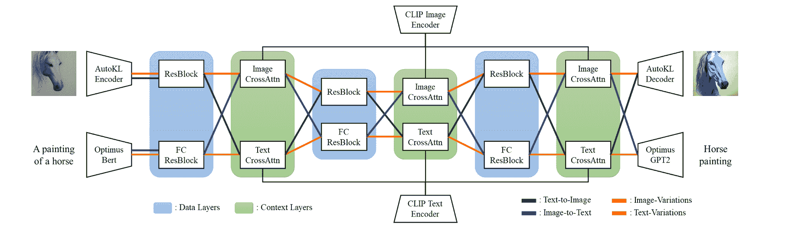
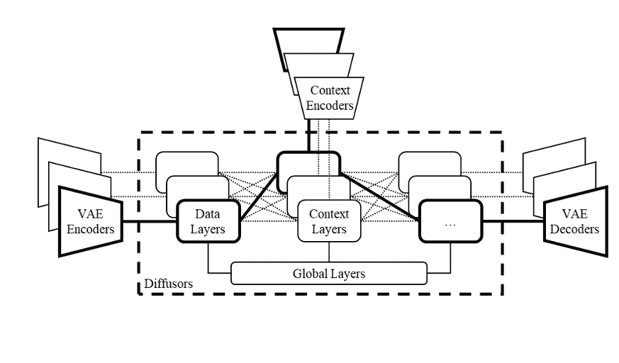
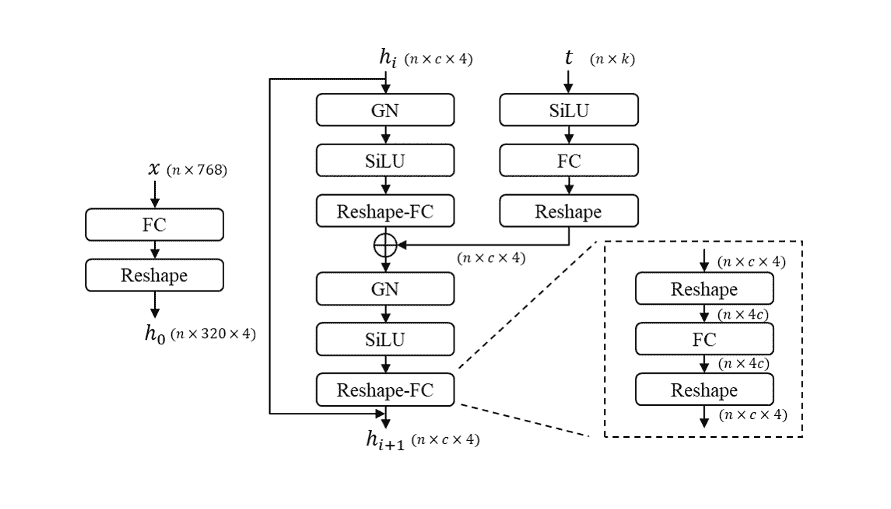
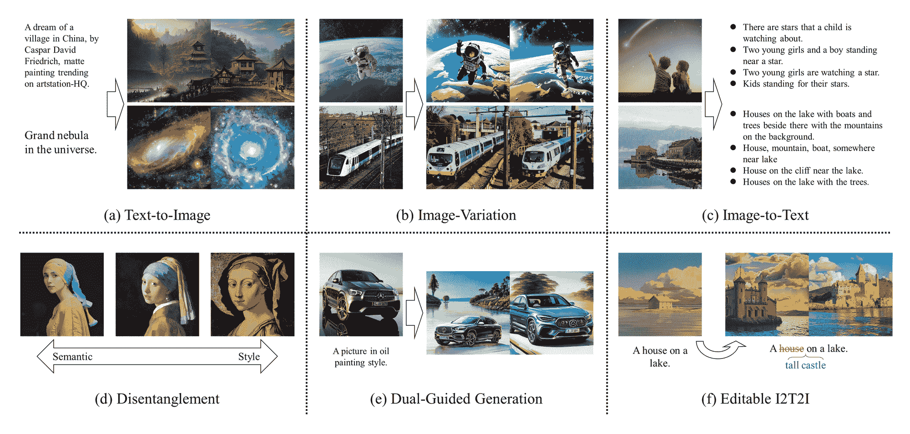
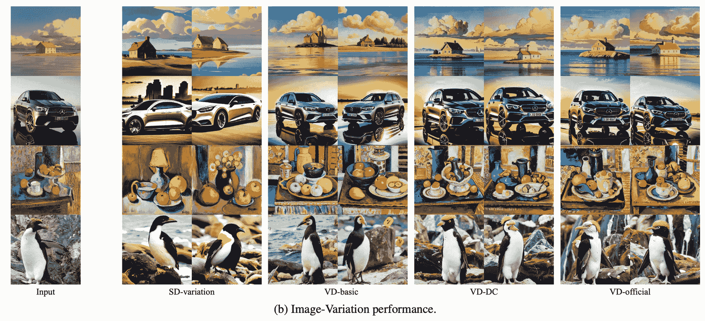
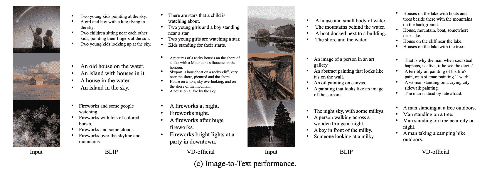
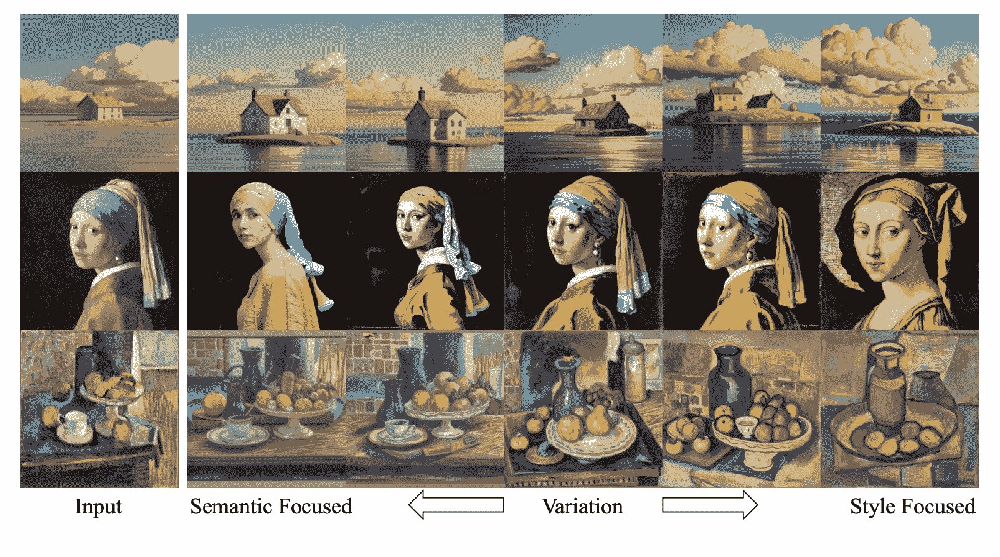
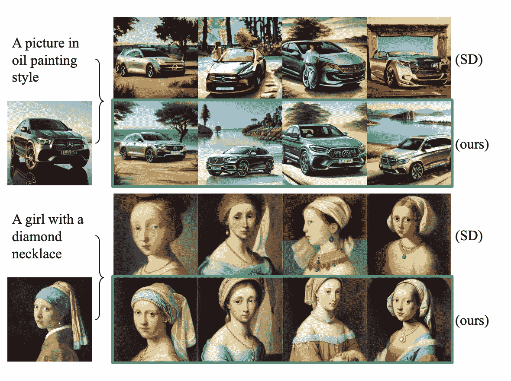
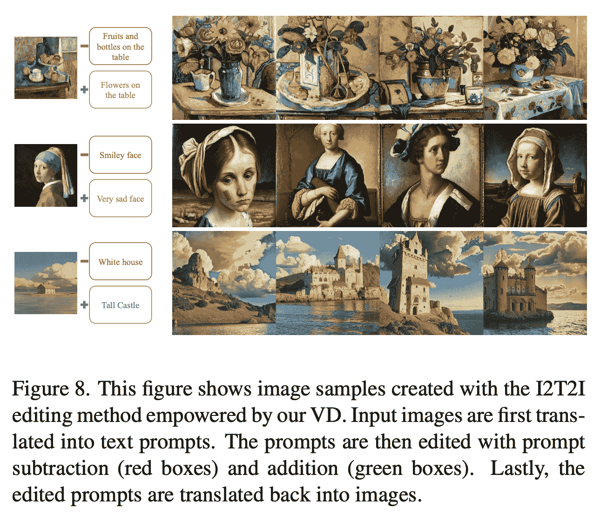
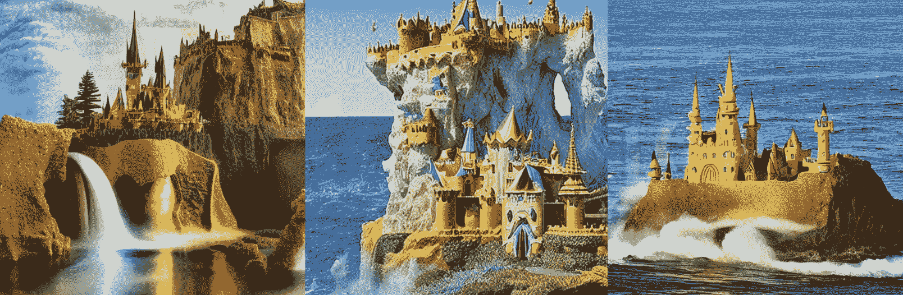

# 通用扩散:第一个统一的多流多模态扩散框架

> 原文：<https://blog.paperspace.com/versatile-diffusion/>

在过去的几个月里，扩散模型的力量已经完全取代了以前的图像合成框架，如 DALL-E 2、DALL-E Mini 和 GLIDE，成为个人和商业图像生成的首选方法。特别是，稳定扩散及其许多衍生项目，如 Dreambooth 和 Textual Inversion，以及 Imagen 代表了这些模型的两个最高性能的例子，但只有稳定扩散已向公众发布。感谢 [Stability AI](https://stability.ai/) 、 [CompVis](https://github.com/CompVis) 和 [RunwayML](https://runwayml.com/) 的研究人员，这个免费模型在寻求参与这一超越基于机器学习的图像合成限制的最新步骤的研究人员和临时用户中广受欢迎。

框架阵容中的新成员是[多功能扩散](https://github.com/SHI-Labs/Versatile-Diffusion)，这是第一个用于图像合成任务的统一多流多模式扩散框架。这使得通用扩散框架能够处理各种各样的任务，包括文本到图像合成、图像到文本合成、现有输入的图像变化、文本变化、语义风格解缠结、图像-文本双重引导生成以及潜在图像到文本到图像编辑。

遵循本教程的统一框架的分解，更彻底的分析，上面列出的每一个能力，并逐步说明从梯度笔记本运行多功能扩散。

## 通用扩散统一框架

在我们开始使用代码的通用扩散之前，让我们浏览一下架构和框架的功能，感受一下这个过程是如何工作的。

### 体系结构



Overview of Versatile Diffusion architecture [[Source](https://arxiv.org/pdf/2211.08332.pdf)]

让我们从浏览模型套件的架构开始。我们从输入层开始，它能够接受图像和文本输入。输入的类型，以及所选择的任务类型，决定了接下来会发生什么。这就是多流模型的特征:使用不同类型的输入和上下文数据。该模型可以采用的四种主要流程是文本到图像(绿色)、图像到文本(蓝色)、图像变化(红色)和文本变化(黄色)。



[Source](https://arxiv.org/pdf/2211.08332.pdf)

在我们继续之前，这里有一个额外的图形解释提出的多流多模态扩散框架与 VAEs，扩散器和上下文编码器。实线表示处理单个任务(即，文本到图像)的模型的典型流程，而其他虚线表示其他可能的流程以及其他可能的任务。这个流程的多功能性允许扩展每个流程的应用程序，从而从这个灵活的框架中产生潜在的新任务。[ [来源](https://arxiv.org/pdf/2211.08332.pdf)

在输入层，图像由 AutoKL 编码器编码，文本输入由 Optimus Bert 处理。这些都是 VAE 编码器，准确地编码各自的输入类型。从那里，它们被传递到第一个数据层。这里，我们有两个块:ResBlock 和 FCResBlock。根据所遵循的流程，可以将文本或图像传递给任何一个块。


[Source](https://arxiv.org/pdf/1512.03385.pdf)

首先是通常被称为 ResBlock 的，用于图像数据。在 ResBlock 中，我们将输入表征为 x，输出表征为 H(x)。ResBlock 使用“跳过连接”，跳过神经网络中的一些层，并将一层的输出作为下一层的输入。利用这一点，我们可以看到,**H(x)的输出等于 F(x) + x。该块因此具有调整后的学习目标。它不再试图学习完整的输出，而是试图最小化目标值 H(x)和 x 之间的差异，降低残差(F(x) = H(x) -x)。[ [来源](https://medium.com/ai%C2%B3-theory-practice-business/resblock-a-trick-to-impove-the-model-8ba11891c52a)**

**在实践中，这允许信息从初始层流到最后层，并且使得能够以逐渐减小的空间维度和增加的通道数量对图像信息进行进一步的鲁棒编码，而没有显著的进一步退化。**

**

[Source](https://arxiv.org/pdf/2211.08332.pdf)** 

**对于文本数据流，通用扩散的作者创建了一种新颖的全连接残差块(FCResBlock)架构。这能够将 768 维文本潜在向量扩展成 320×4 的隐藏特征，并且遵循与图像数据的 ResBlock 相似的通道增加范例。FCResBlock 包含两组完全连接的层(FC)、组规范化(GN)和 sigmoid 线性单元(路斯)。`x`是输入文本潜在代码，`t`是输入时间嵌入，`hi`是中间特征。来源**

**编码然后被传递到上下文层。在那里，图像或文本交叉注意被应用于剪辑图像或文本编码器。它使用内容嵌入通过投影图层、点积和 sigmoids 来操纵数据的特征。对于文本和图像编码，归一化和投影嵌入显著地最小化了剪辑对比损失。**

**从那以后，对于文本到图像和图像到文本的流，这个过程就颠倒了。文本编码通过数据层中的 ResBlock 传递，图像编码通过 FCResBlock 传递。然后，它们被传递到另一个 CrossAttention 编码器层，再次交替多模态流的“两侧”。**

**该论文作者陈述的主要目标之一是“为了实现更好的性能，[使用]上下文编码器[来]联合最小化所有支持的内容类型上的跨模态统计距离(例如 KL-divergence)[来源](https://arxiv.org/pdf/2211.08332.pdf)。通过在数据层中的不同类型的 ResBlocks 之间交替数据，他们能够使用 CLIP 更准确地将图像和文本连接到其编码。他们在实验中发现，关闭上下文类型之间的嵌入空间有助于模型更快地收敛和更好地执行。**

**从这个中间层，该过程然后被反转以将图像或文本编码解码成它们的结果图像或文本。**

## **能力**

**

The 6 potential flows identified by the original paper [[source](https://arxiv.org/pdf/2211.08332.pdf)]** 

**通用扩散模型因其广泛多样的能力而得名。在代码演示中展示它们之前，让我们先讨论一下它们。**

#### **a)文本到图像**

**对于任何与图像生成相关的模型来说，这是当前最常见和最有用的流程:使用一个文本字符串来影响图像生成过程的输出。通用扩散使用与标准稳定扩散相似的过程。**

**使用“文本到图像”功能，根据文本提示生成精确的合成图像。**

#### **b)图像变化**

**

[[Source](https://arxiv.org/pdf/2211.08332.pdf)]** 

**虽然稳定扩散没有固有的图像变化任务，但作者使用稳定扩散 v1-4 检查点重新创建了他们的图像变化脚本的效果。VD-basic 是一个单流程的图像变化模型。其次，VD-DC 是一个支持文本到图像合成和图像变化的双流模型。其 UNet 扩散器包含一个数据流和两个上下文流。最后，VD-official 是一个四流模型，包括另外两个任务，即图像到文本和文本变化，其 UNet 扩散器有两个数据流，分别用于数据和上下文。我们可以从结果中看出，VD 模型不仅对于来自原始输入的相关特征具有更高的表观视敏度和多样性，对于主要对象和背景特征也是如此。**

**使用图像变化来创建同一对象的不同角度，给现有图像添加微小的变化，并创建大量的潜在选项来选择，以准确地表示原始图像的特征。**

#### **c)图像到文本**

**

[[Source](https://arxiv.org/pdf/2211.08332.pdf)]** 

**以上是 VD-官方流程与流行的 BLIP 框架的定性性能比较。它们都旨在以清晰的文本格式捕获输入图像的特征。很难比较这两个结果，但可以认为 VD 似乎为每个样本输入生成了更大量的描述性标记，这提供了更高程度的人类可读准确性。**

**这对于尝试确定哪个提示将生成您正在寻找的精确图像非常有用。一定要留好种子，以备推断！**

#### **d)解开缠绕**

**

[[Source](https://arxiv.org/pdf/2211.08332.pdf)]** 

**VD 的一个有趣的应用是，它可以在没有进一步监督的情况下从语义上增强或减少图像样式。在实践中，这允许研究人员探索潜在空间的一个新领域，其中风格和语义之间的解开可以发生在具有任意风格的任意内容的图像上。[ [来源](https://arxiv.org/pdf/2211.08332.pdf)**

**使用此功能在合成图像之间交换语义和样式，或者提取它们以应用于其他地方。**

#### **e)双重引导生成**

**通常，不可能同时以文本和图像数据为条件。论文作者认为这是一个模型级的混合问题。简单地将这些效果结合起来就可以创建一个可用的基线，但是在没有显著改进的情况下，成本会翻倍。**

**

Comparison of SD and VD on a dual-guided generation task. S** 

**然而，VD 可以在更深的层次上处理跨模态条件:层层次或注意力层次。这允许模型在 VD 的可交互结构中混合属性，使得数据层可以适应所有的上下文层流。他们确定，在 VD 上使用注意力水平混合可以保持正确的对象结构，并协调提示和图像上下文，从而产生同时使用两种输入类型的高性能合成。**

#### **f)潜在的、可编辑的图像到文本到图像**

**

[[Source](https://arxiv.org/pdf/2211.08332.pdf)]** 

**这是使用图像生成提示的过程，然后修改该提示，并用于合成新图像。这允许用户在图像到图像编辑环境中对最终输出给予极高程度的控制，并进一步允许受控的、有针对性的特征编辑。**

* * *

**现在我们更彻底地理解了通用扩散，让我们跳到渐变笔记本代码演示，看看这个工具是如何工作的。**

# **代码演示**

 **## 设置

```py
!apt-get update && apt-get install git-lfs -y
!git-lfs clone https://huggingface.co/spaces/shi-labs/Versatile-Diffusion
!mv Versatile-Diffusion/pretrained ./
!rm -r Versatile-Diffusion
!pip install -r requirement.txt
!pip install -e git+https://github.com/CompVis/taming-transformers.git@master#egg=taming-transformers
!cp -r src/taming-transformers/taming ./
```

在开始之前，我们需要首先确保所有相关的包和模型文件都安装在实例上。首先，我们用 git-lfs 获得模型文件。

您可能需要将前两行拆分到它们自己的单元格中，因为 apt 在完成下载后似乎会挂起。这可以通过等待它说 100%，并重新启动内核来解决。

> **要知道，通用扩散的模型文件总共占用大约 15 GB 的存储空间，所以如果你是专业或免费帐户用户，就要小心这一点，以及存储空间过剩的可能性**。

获得所有文件后，我们安装所需的包，并将 taming 的副本移动到我们的工作区目录中。

## 实例化`vd_inference`类

现在我们的环境已经设置好了，我们可以开始了。我们首先需要导入相关的包，并声明相关的变量。

完成后，`vd_inference`类就是我们统一网络的“容器”。调用`vd_inference`将所有相关文件加载到内核中，为不同的流使用它们进行推理设置阶段。它还具有助手功能和推理功能。助手功能只是做一些小任务，比如优化图像输入。另一方面，推理功能用于执行每个不同的流程。

第一个是`inference()`，用于文本到图像和图像到文本的合成。它检查正在使用的输入类型，然后执行合成过程。然后，上面描述的每个功能都有函数，直接集成到类中。

正如我们所见，`vd_inference`类将整个项目保存在一个对象中，并包含大量相关的推理功能。通读下面的代码块，特别注意每个推理函数，以便更详细地了解这个过程是如何工作的。

```py
import os
import PIL
from PIL import Image
from pathlib import Path
import numpy as np
import numpy.random as npr
from contextlib import nullcontext

import torch
import torchvision.transforms as tvtrans
from lib.cfg_helper import model_cfg_bank
from lib.model_zoo import get_model
from lib.model_zoo.ddim_vd import DDIMSampler_VD, DDIMSampler_VD_DualContext
from lib.model_zoo.ddim_dualcontext import DDIMSampler_DualContext

from lib.experiments.sd_default import color_adjust

n_sample_image = 2
n_sample_text = 4
cache_examples = True

class vd_inference(object):
    def __init__(self, type='official'):
        if type in ['dc', '2-flow']:
            cfgm_name = 'vd_dc_noema'
            sampler = DDIMSampler_DualContext
            pth = 'pretrained/vd-dc.pth'
        elif type in ['official', '4-flow']:
            cfgm_name = 'vd_noema'
            sampler = DDIMSampler_VD
            pth = 'pretrained/vd-official.pth'
        cfgm = model_cfg_bank()(cfgm_name)
        net = get_model()(cfgm)

        sd = torch.load(pth, map_location='cpu')
        net.load_state_dict(sd, strict=False)

        self.use_cuda = torch.cuda.is_available()
        if self.use_cuda:
            net.to('cuda')
        self.model_name = cfgm_name
        self.net = net
        self.sampler = sampler(net)

    def regularize_image(self, x):
        BICUBIC = PIL.Image.Resampling.BICUBIC
        if isinstance(x, str):
            x = Image.open(x).resize([512, 512], resample=BICUBIC)
            x = tvtrans.ToTensor()(x)
        elif isinstance(x, PIL.Image.Image):
            x = x.resize([512, 512], resample=BICUBIC)
            x = tvtrans.ToTensor()(x)
        elif isinstance(x, np.ndarray):
            x = PIL.Image.fromarray(x).resize([512, 512], resample=BICUBIC)
            x = tvtrans.ToTensor()(x)
        elif isinstance(x, torch.Tensor):
            pass
        else:
            assert False, 'Unknown image type'

        assert (x.shape[1]==512) & (x.shape[2]==512), \
            'Wrong image size'
        if self.use_cuda:
            x = x.to('cuda')
        return x

    def decode(self, z, xtype, ctype, color_adj='None', color_adj_to=None):
        net = self.net
        if xtype == 'image':
            x = net.autokl_decode(z)

            color_adj_flag = (color_adj!='None') and (color_adj is not None)
            color_adj_simple = color_adj=='Simple'
            color_adj_keep_ratio = 0.5

            if color_adj_flag and (ctype=='vision'):
                x_adj = []
                for xi in x:
                    color_adj_f = color_adjust(ref_from=(xi+1)/2, ref_to=color_adj_to)
                    xi_adj = color_adj_f((xi+1)/2, keep=color_adj_keep_ratio, simple=color_adj_simple)
                    x_adj.append(xi_adj)
                x = x_adj
            else:
                x = torch.clamp((x+1.0)/2.0, min=0.0, max=1.0)
                x = [tvtrans.ToPILImage()(xi) for xi in x]
            return x

        elif xtype == 'text':
            prompt_temperature = 1.0
            prompt_merge_same_adj_word = True
            x = net.optimus_decode(z, temperature=prompt_temperature)
            if prompt_merge_same_adj_word:
                xnew = []
                for xi in x:
                    xi_split = xi.split()
                    xinew = []
                    for idxi, wi in enumerate(xi_split):
                        if idxi!=0 and wi==xi_split[idxi-1]:
                            continue
                        xinew.append(wi)
                    xnew.append(' '.join(xinew))
                x = xnew
            return x

    def inference(self, xtype, cin, steps, ctype, h = 512, w = 512, scale=7.5, n_samples=None, color_adj=None):
        net = self.net
        sampler = self.sampler
        ddim_steps = steps
        ddim_eta = 0.0

        if xtype == 'image':
            n_samples = n_sample_image if n_samples is None else n_samples
        elif xtype == 'text':
            n_samples = n_sample_text if n_samples is None else n_samples

        if ctype in ['prompt', 'text']:
            c = net.clip_encode_text(n_samples * [cin])
            u = None
            if scale != 1.0:
                u = net.clip_encode_text(n_samples * [""])

        elif ctype in ['vision', 'image']:
            cin = self.regularize_image(cin)
            ctemp = cin*2 - 1
            ctemp = ctemp[None].repeat(n_samples, 1, 1, 1)
            c = net.clip_encode_vision(ctemp)
            u = None
            if scale != 1.0:
                dummy = torch.zeros_like(ctemp)
                u = net.clip_encode_vision(dummy)

        if xtype == 'image':
            shape = [n_samples, 4, h//8, w//8]
            z, _ = sampler.sample(
                steps=ddim_steps,
                shape=shape,
                conditioning=c,
                unconditional_guidance_scale=scale,
                unconditional_conditioning=u,
                xtype=xtype, ctype=ctype,
                eta=ddim_eta,
                verbose=False,)
            x = self.decode(z, xtype, ctype, color_adj=color_adj, color_adj_to=cin)
            return x

        elif xtype == 'text':
            n = 768
            shape = [n_samples, n]
            z, _ = sampler.sample(
                steps=ddim_steps,
                shape=shape,
                conditioning=c,
                unconditional_guidance_scale=scale,
                unconditional_conditioning=u,
                xtype=xtype, ctype=ctype,
                eta=ddim_eta,
                verbose=False,)
            x = self.decode(z, xtype, ctype)
            return x

    def application_disensemble(self, cin, h = 512, w = 512, n_samples=None, level=0, color_adj=None,steps = None, scale = None):
        net = self.net
        scale = scale
        sampler = self.sampler
        ddim_steps = steps
        ddim_eta = 0.0
        n_samples = n_sample_image if n_samples is None else n_samples

        cin = self.regularize_image(cin)
        ctemp = cin*2 - 1
        ctemp = ctemp[None].repeat(n_samples, 1, 1, 1)
        c = net.clip_encode_vision(ctemp)
        u = None
        if scale != 1.0:
            dummy = torch.zeros_like(ctemp)
            u = net.clip_encode_vision(dummy)

        if level == 0:
            pass
        else:
            c_glb = c[:, 0:1]
            c_loc = c[:, 1: ]
            u_glb = u[:, 0:1]
            u_loc = u[:, 1: ]

            if level == -1:
                c_loc = self.remove_low_rank(c_loc, demean=True, q=50, q_remove=1)
                u_loc = self.remove_low_rank(u_loc, demean=True, q=50, q_remove=1)
            if level == -2:
                c_loc = self.remove_low_rank(c_loc, demean=True, q=50, q_remove=2)
                u_loc = self.remove_low_rank(u_loc, demean=True, q=50, q_remove=2)
            if level == 1:
                c_loc = self.find_low_rank(c_loc, demean=True, q=10)
                u_loc = self.find_low_rank(u_loc, demean=True, q=10)
            if level == 2:
                c_loc = self.find_low_rank(c_loc, demean=True, q=2)
                u_loc = self.find_low_rank(u_loc, demean=True, q=2)

            c = torch.cat([c_glb, c_loc], dim=1)
            u = torch.cat([u_glb, u_loc], dim=1)

        shape = [n_samples, 4, h//8, w//8]
        z, _ = sampler.sample(
            steps=ddim_steps,
            shape=shape,
            conditioning=c,
            unconditional_guidance_scale=scale,
            unconditional_conditioning=u,
            xtype='image', ctype='vision',
            eta=ddim_eta,
            verbose=False,)
        x = self.decode(z, 'image', 'vision', color_adj=color_adj, color_adj_to=cin)
        return x

    def find_low_rank(self, x, demean=True, q=20, niter=10):
        if demean:
            x_mean = x.mean(-1, keepdim=True)
            x_input = x - x_mean
        else:
            x_input = x

        u, s, v = torch.pca_lowrank(x_input, q=q, center=False, niter=niter)
        ss = torch.stack([torch.diag(si) for si in s])
        x_lowrank = torch.bmm(torch.bmm(u, ss), torch.permute(v, [0, 2, 1]))        

        if demean:
            x_lowrank += x_mean
        return x_lowrank

    def remove_low_rank(self, x, demean=True, q=20, niter=10, q_remove=10):
        if demean:
            x_mean = x.mean(-1, keepdim=True)
            x_input = x - x_mean
        else:
            x_input = x

        u, s, v = torch.pca_lowrank(x_input, q=q, center=False, niter=niter)
        s[:, 0:q_remove] = 0
        ss = torch.stack([torch.diag(si) for si in s])
        x_lowrank = torch.bmm(torch.bmm(u, ss), torch.permute(v, [0, 2, 1]))        

        if demean:
            x_lowrank += x_mean
        return x_lowrank

    def application_dualguided(self, cim, ctx, h = 512, w = 512, n_samples=None, mixing=0.5, color_adj=None, steps = None, scale = None):
        net = self.net
        scale = scale
        sampler = DDIMSampler_VD_DualContext(net)
        ddim_steps = steps
        ddim_eta = 0.0
        n_samples = n_sample_image if n_samples is None else n_samples

        ctemp0 = self.regularize_image(cim)
        ctemp1 = ctemp0*2 - 1
        ctemp1 = ctemp1[None].repeat(n_samples, 1, 1, 1)
        cim = net.clip_encode_vision(ctemp1)
        uim = None
        if scale != 1.0:
            dummy = torch.zeros_like(ctemp1)
            uim = net.clip_encode_vision(dummy)

        ctx = net.clip_encode_text(n_samples * [ctx])
        utx = None
        if scale != 1.0:
            utx = net.clip_encode_text(n_samples * [""])

        shape = [n_samples, 4, h//8, w//8]

        z, _ = sampler.sample_dc(
            steps=ddim_steps,
            shape=shape,
            first_conditioning=[uim, cim],
            second_conditioning=[utx, ctx],
            unconditional_guidance_scale=scale,
            xtype='image', 
            first_ctype='vision',
            second_ctype='prompt',
            eta=ddim_eta,
            verbose=False,
            mixed_ratio=(1-mixing), )
        x = self.decode(z, 'image', 'vision', color_adj=color_adj, color_adj_to=ctemp0)
        return x

    def application_i2t2i(self, cim, ctx_n, ctx_p, steps, scale, h = 512, w = 512, n_samples=None, color_adj=None,):
        net = self.net
        scale = scale
        sampler = DDIMSampler_VD_DualContext(net)
        ddim_steps = steps
        ddim_eta = 0.0
        prompt_temperature = 1.0
        n_samples = n_sample_image if n_samples is None else n_samples

        ctemp0 = self.regularize_image(cim)
        ctemp1 = ctemp0*2 - 1
        ctemp1 = ctemp1[None].repeat(n_samples, 1, 1, 1)
        cim = net.clip_encode_vision(ctemp1)
        uim = None
        if scale != 1.0:
            dummy = torch.zeros_like(ctemp1)
            uim = net.clip_encode_vision(dummy)

        n = 768
        shape = [n_samples, n]
        zt, _ = sampler.sample(
            steps=ddim_steps,
            shape=shape,
            conditioning=cim,
            unconditional_guidance_scale=scale,
            unconditional_conditioning=uim,
            xtype='text', ctype='vision',
            eta=ddim_eta,
            verbose=False,)
        ztn = net.optimus_encode([ctx_n])
        ztp = net.optimus_encode([ctx_p])

        ztn_norm = ztn / ztn.norm(dim=1)
        zt_proj_mag = torch.matmul(zt, ztn_norm[0])
        zt_perp = zt - zt_proj_mag[:, None] * ztn_norm
        zt_newd = zt_perp + ztp
        ctx_new = net.optimus_decode(zt_newd, temperature=prompt_temperature)

        ctx_new = net.clip_encode_text(ctx_new)
        ctx_p = net.clip_encode_text([ctx_p])
        ctx_new = torch.cat([ctx_new, ctx_p.repeat(n_samples, 1, 1)], dim=1)
        utx_new = net.clip_encode_text(n_samples * [""])
        utx_new = torch.cat([utx_new, utx_new], dim=1)

        cim_loc = cim[:, 1: ]
        cim_loc_new = self.find_low_rank(cim_loc, demean=True, q=10)
        cim_new = cim_loc_new
        uim_new = uim[:, 1:]

        shape = [n_samples, 4, h//8, w//8]
        z, _ = sampler.sample_dc(
            steps=ddim_steps,
            shape=shape,
            first_conditioning=[uim_new, cim_new],
            second_conditioning=[utx_new, ctx_new],
            unconditional_guidance_scale=scale,
            xtype='image', 
            first_ctype='vision',
            second_ctype='prompt',
            eta=ddim_eta,
            verbose=False,
            mixed_ratio=0.33, )

        x = self.decode(z, 'image', 'vision', color_adj=color_adj, color_adj_to=ctemp0)
        return x

vd_inference = vd_inference('official') 
```

## `main`功能

既然我们已经实例化了我们的模型代码，并将相关的模型文件加载到笔记本中，我们就可以开始制作我们的输入来放入到`main`函数中。调用`main`函数是为了使用我们在这篇博客的功能部分描述的任何不同的流程来启动推理。这是由`mode`参数决定的，并将导致模型当前可用的 7 个不同可选流程中的任何一个。让我们看看下面的单元格。

```py
def main(mode,
         image=None,
         prompt=None,
         nprompt=None,
         pprompt=None,
         color_adj=None,
         disentanglement_level=None,
         dual_guided_mixing=None,
         seed=0,
         steps=50,
         n_samples = 1,
         scale = 7.5, 
         h = 512,
         w = 512):

    if seed<0:
        seed = 0
    np.random.seed(seed)
    torch.manual_seed(seed+100)

    if mode == 'Text-to-Image':
        if (prompt is None) or (prompt == ""):
            return None, None
        with torch.no_grad():
            rv = vd_inference.inference(n_samples = n_samples, steps = steps,
                xtype = 'image',
                cin = prompt,
                ctype = 'prompt',
                scale = scale)
        return rv, None
    elif mode == 'Image-Variation':
        if image is None:
            return None, None
        with torch.no_grad():
            rv = vd_inference.inference(n_samples = n_samples, steps = steps,
                xtype = 'image',
                cin = image,
                ctype = 'vision',
                color_adj = color_adj,
                scale = scale)
        return rv, None
    elif mode == 'Image-to-Text':
        if image is None:
            return None, None
        with torch.no_grad():
            rv = vd_inference.inference(n_samples = n_samples, steps = steps,
                xtype = 'text',
                cin = image,
                ctype = 'vision',
                scale = scale)
        return None, '\n'.join(rv)
    elif mode == 'Text-Variation':
        if prompt is None:
            return None, None
        with torch.no_grad():
            rv = vd_inference.inference(n_samples = n_samples, steps = steps,
                xtype = 'text',
                cin = prompt,
                ctype = 'prompt',
                scale = scale)
        return None, '\n'.join(rv)
    elif mode == 'Disentanglement':
        if image is None:
            return None, None
        with torch.no_grad():
            rv = vd_inference.application_disensemble(
                n_samples = n_samples, 
                cin = image,
                level = disentanglement_level,
                color_adj = color_adj,
                steps = steps,
                scale = scale)
        return rv, None
    elif mode == 'Dual-Guided':
        if (image is None) or (prompt is None) or (prompt==""):
            return None, None
        with torch.no_grad():
            rv = vd_inference.application_dualguided(
                n_samples = n_samples, 
                cim = image,
                ctx = prompt,
                mixing = dual_guided_mixing,
                color_adj = color_adj,
                steps = steps,
                scale = scale)
        return rv, None
    elif mode == 'Latent-I2T2I':
        if (image is None) or (nprompt is None) or (nprompt=="") \
                or (pprompt is None) or (pprompt==""):
            return None, None
        with torch.no_grad():
            rv = vd_inference.application_i2t2i(
                n_samples = n_samples, 
                cim = image,
                ctx_n = nprompt,
                ctx_p = pprompt,
                color_adj = color_adj, 
                steps = steps,
                scale = scale)
        return rv, None
    else:
        assert False, "No such mode!"
```

### 调用`main`进行推理。

现在我们已经设置好了一切，我们可以调用`main`开始对任何流进行推断。除了模式参数之外，在开始合成之前，还有许多其他参数需要考虑。

也就是说，这些是:

*   prompt (str)用于指导生成过程。该模型将尝试创建对应于提示的图像或文本输出
*   nprompt (str)是负提示，包含我们不希望在合成输出中出现的单词
*   pprompt (str)包含我们希望在最终输出中显示的特性的肯定提示(用于 Latent-I2T2I)
*   种子(int)控制合成的随机性，可用于“重新创建”由扩散创建的图像
*   steps(int)ddim 采样步骤的数量
*   每批生成的图像数量
*   scale (int)模型的指导比例，范围为 0-30。0 相当于没有引导，30 是最大引导
*   高度，以像素为单位
*   w (int)宽度，以像素为单位

以下是一个可用于所有基于文本输入的流的示例，但当前设置为文本到图像:

```py
x = main(mode = 'Text-to-Image',
         image=None,
         prompt= 'a magical fantasy castle overlooking a golden gold colored oceans and giant crashing tsunami waves',
         nprompt='low contrast, blurry, out of frame, text, watermark, distortion, black and white, low resolution, low detail, closeup, out of focus, bad framing, tiling, grainy, grayscale, monotone, watermarked',
         pprompt='a magical fantasy castle overlooking a golden gold colored oceans and giant crashing tsunami waves',
         color_adj=None,
         disentanglement_level=None,
         dual_guided_mixing=None,
         seed=552523,
         steps = 50,
         n_samples = 1,
         scale = 7.5,
         h = 512,
         w = 512)
```

就这样了！如果我们按照上面的步骤，我们现在应该能够看到一些滑稽的，幻想的城堡坐落在一个海湾与崩溃的波浪。以下是我们实验的样本输出:



Samples generated using the code cell above

## 结束语

在这篇博文中，我们详细研究了最新发布的通用扩散统一、多模态和多流图像合成框架的架构和功能。然后，我们演示了如何在渐变笔记本中使用 Python 这个模型来生成梦幻城堡的图像。

我们鼓励您尝试 main 提供的所有不同模式/流程！

在此查看该项目的代码[。](https://github.com/gradient-ai/Versatile-Diffusion)**