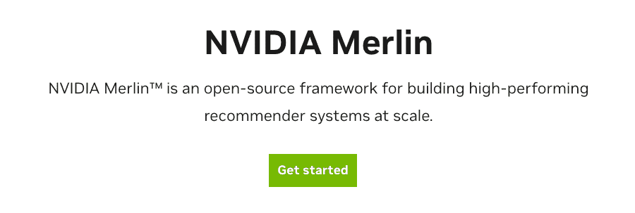
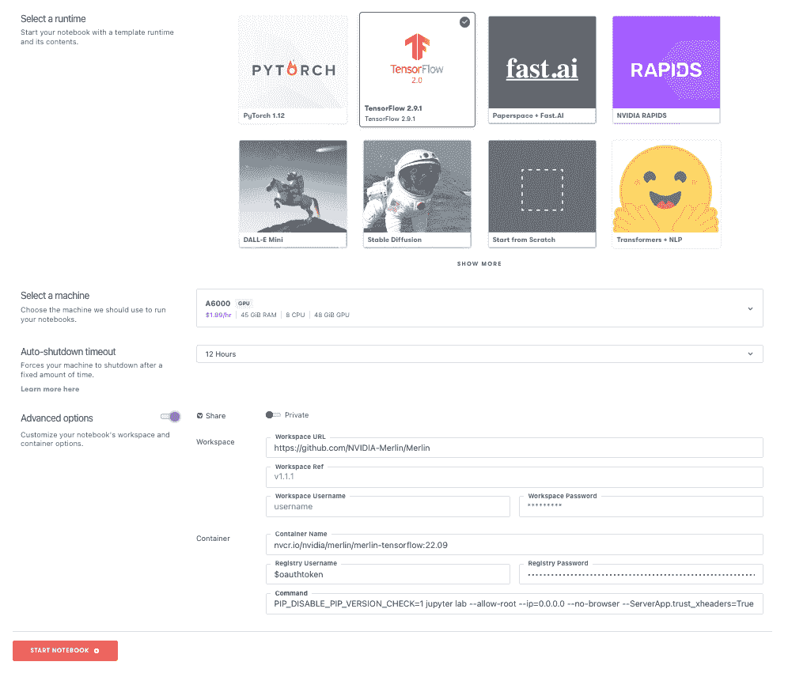
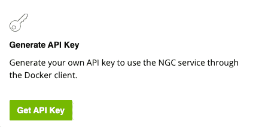
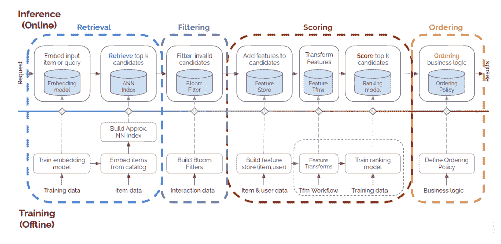
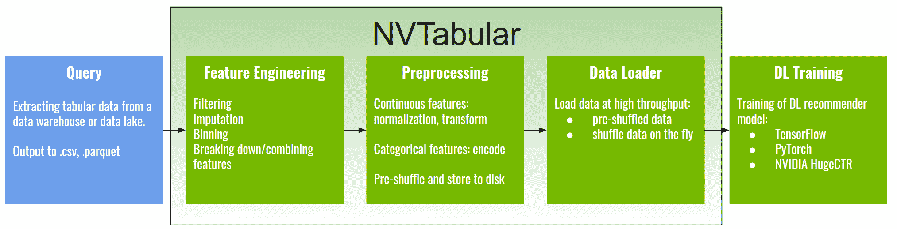
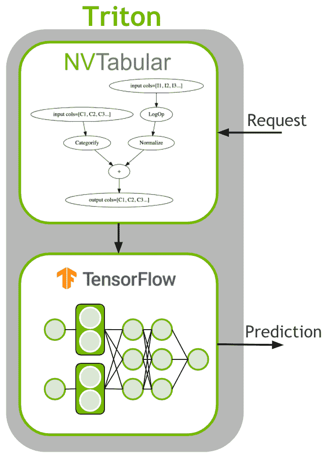

# 梯度上的端到端数据科学:Nvidia Merlin

> 原文：<https://blog.paperspace.com/end-to-end-data-science-on-gradient-nvidia-merlin/>

[Gradient](console.paperspace.com) 旨在成为一个端到端的数据科学平台，因此涵盖了数据科学的所有阶段，从原始数据的初始查看，到在生产环境中部署模型并附带应用程序。

因此，展示梯度上端到端数据科学的工作示例是有益的。

Nvidia 的 GPU 加速推荐系统 [Merlin](https://developer.nvidia.com/nvidia-merlin) 就是这样一个例子。作为 Nvidia 的用例框架之一，它拥有一些包含端到端工作的优秀笔记本电脑，并展示了一系列协同工作的工具，以大规模地与数据进行交互，并提供可操作的输出。

这篇博客中展示的端到端数据科学的主要部分是:

*   大规模 ETL/ELT
*   特征工程
*   专题报道
*   综合数据
*   深度学习推荐器的模型训练
*   保存模型
*   部署
*   模型集合:求解部署预处理

此外，其他详细方法，例如近似最近邻搜索、分类特征的单热点和多热点编码以及频率阈值(少于给定数量的类出现被映射到相同的索引)。

数据准备、模型训练和部署等各个阶段都在 GPU 上完成，因此速度大大加快。

工作笔记本示例中包含的工具有:

*   [Nvidia Merlin NVTabular](https://developer.nvidia.com/nvidia-merlin/nvtabular) 大规模 ETL 工作流，包括大于内存的数据集、功能工程和数据准备
*   Nvidia RAPIDS cuDF 用于熟悉的 Pandas API 中的大型数据帧
*   用于并行计算的开源 Python 库
*   [Apache Parquet](https://parquet.apache.org/) 面向列的数据存储格式
*   `generate_data()`Merlin 中的合成数据
*   [盛宴](https://feast.dev/)特色店
*   [梅林模型](https://github.com/NVIDIA-Merlin/models)包括深度学习的推荐器模型
*   Merlin Systems 的操作员和库有助于将模型与端到端工作流程的其他部分集成
*   [Nvidia Triton 推理服务器](https://developer.nvidia.com/nvidia-triton-inference-server)投入生产部署

另外还有 Faiss 快速相似性搜索、Protobuf 文本文件和 GraphViz。

让我们简单看看 Nvidia Merlin，然后是如何在 Gradient 上运行它，以及提供的三个端到端示例。

## 英伟达梅林

[Merlin](https://developer.nvidia.com/nvidia-merlin) 是 Nvidia 的端到端推荐系统，专为生产规模的 GPU 加速工作而设计。

因此，它是专门为推荐者设计的，而不是像计算机视觉或 NLP 文本模型那样。然而，推荐器是数据科学中的一个常见用例，需要自己的框架来实现最佳结果，就像深度学习的其他子领域一样。

它解决了尝试大规模端到端数据科学时出现的许多问题，例如:

*   数据准备是在 GPU 上完成的，因此速度大大加快(NVTabular)
*   大型数据可以在熟悉的 API 中处理，而不必在代码中添加并行性(cuDF)
*   使用一种高效的面向列的文件存储格式，比纯文本文件(Parquet)快得多
*   包括一个特征库，使特征工程有组织、简化和可重用(Feast)
*   当需要时，真实的训练数据可以通过合成数据来增加，这是人工智能工作中越来越受欢迎的组成部分
*   分布式模型训练可以更快地训练出更好的模型
*   模型针对推理进行了优化，可以以健壮的方式部署到生产中(Triton 推理服务器)
*   通过将典型推荐器的多个组件部署为一个集成(Triton 集成)，解决了在部署中对输入原始数据的预处理

运行它最简单的方法是使用 Nvidia 提供的支持 GPU 的 Docker 容器。通过在 Gradient 上运行，设置和使用它们的许多障碍都被消除了，例如获取 GPU 硬件和设置 Docker。

## 在梯度上运行

因为 Merlin 是以 Docker 容器和 GitHub 存储库的形式提供的，所以可以使用我们的运行时立即在 Gradient 上运行，这两个运行时结合了这两个组件。

### 创建笔记本

登录后，创建一个项目，然后创建一个笔记本。

Notebook creation in Gradient. You can see the use of the Merlin GitHub repository, Docker container, and Nvidia NGC Container catalog Docker registry credentials (see below) under Advanced Options.

选择一台运行它的 GPU 机器。我们使用了 48GB 内存的安培 A6000，但其他的，如 A100，可能也能工作。这是一个运行起来很昂贵的包，所以在选择机器类型时要考虑到高昂的 GPU 成本，如果使用功能不太强大的机器，还有可能出现 OOM 错误。

选择 TensorFlow 推荐运行时(编写时为 TensorFlow 2.9.1)。在高级选项下，输入`https://github.com/NVIDIA-Merlin/Merlin`作为工作空间，输入`nvcr.io/nvidia/merlin/merlin-tensorflow:22.10`作为图像。

您也可以点击以下链接启动笔记本(如果您是 [Growth 帐户用户](https://www.paperspace.com/pricing)，请参见链接了解详情):

### 需要额外的步骤:Nvidia API 密钥

对于许多容器和存储库来说，这就是全部！你已经准备好了。

然而，对于这一个，**有一个额外的步骤** : Nvidia NGC 目录 Docker 图像要求你首先登录 Nvidia 来下载它们。幸运的是，Paperspace 使这变得很容易，因为它能够登录到经过认证的 Docker 注册中心。

因此，在高级选项下，为注册表用户名输入`$oauthtoken`(这个实际的字符串，没有替代)，并在注册表密码下，粘贴您的英伟达 NGC 目录 API 密钥。

💡If you don't have an Nvidia NGC Catalog API key, you can create one by going to the [NGC Catalog](https://catalog.ngc.nvidia.com/) page, signing up, then in your profile dropdown on the top right under *Setup* there is an option to generate a key.

也可以用通常的方式(包括 API 键)编程创建一个渐变笔记本，使用渐变[命令行接口](https://docs.paperspace.com/gradient/cli/)。

有关渐变笔记本及其创建的更多信息，请参见[文档](https://docs.paperspace.com/gradient/notebooks/)。

## 这些例子

Nvidia Merlin 存储库提供了三个主要的[示例](https://github.com/NVIDIA-Merlin/Merlin/tree/main/examples):

*   多级推荐器
*   MovieLens 数据集
*   使用 Criteo 缩放数据

这里我们不会深入讨论推荐器是如何工作的，但是:

(a)谈论如何解决大规模端到端工作中遇到的常见问题

(b)提供一些注释和指示，以便在坡度上最佳运行示例。事实上，他们很容易就能实现他们的目标，但是这里或那里的一些奇怪的细节值得一提。

💡**Note:** the examples provided in the Merlin containers have parallel tracks using either TensorFlow 2 or HugeCTR (plus some PyTorch), but they run on different containers. To simplify the presentation, we focus on the TensorFlow 2 route, which provides end-to-end in all cases.

### 一般设置

一般渐变笔记本设置的一些注意事项:

*   我们在 6000 单 GPU 上运行笔记本电脑。其他 GPU 应该可以工作，尽管一些内存较小的 GPU 可能不会做得那么好。
*   如果遇到内存不足的错误，重置有问题的 Jupyter 笔记本或其他 run 笔记本的内核应该会清除已使用的 GPU 内存，并允许事情运行。您可以通过 GUI 左侧导航栏 metrics 选项卡或终端上的`nvidia-smi`来检查 GPU 内存使用情况。
*   我们建议在单独的渐变笔记本中运行多阶段、移动镜头和缩放标准，这样就可以清楚地看到哪个输出来自哪个示例。所有 3 个都可以使用相同的 Github 存储库和 Docker 容器，如上面的 *Create Notebook* 中所述。
*   运行笔记本时，您可能会偶尔看到警告，如 NUMA 代码或不赞成使用的项目。这些可能来自梯度，或从原来的例子，并不重要，看到笔记本运行。

### 示例 1:多阶段

多级推荐器的例子可以在[这里](https://github.com/NVIDIA-Merlin/Merlin/tree/main/examples/Building-and-deploying-multi-stage-RecSys)找到，由两个 Jupyter 笔记本组成:`01-Building-Recommender-Systems-with-Merlin.ipynb`和`02-Deploying-multi-stage-RecSys-with-Merlin-Systems.ipynb`。

它演示了如何使用四个阶段来构建推荐系统管道:检索、过滤、评分和排序。第一个笔记本中的图显示了其中的每一项:

Multi-stage recommendation system (from the first notebook in this example)

它训练检索(双塔)模型和评分/排名模型(深度学习推荐模型，又名。DLRM)，包括数据准备和一个特性库，更重要的是，展示了如何使用 Triton 推理服务器将多模型设置部署到生产环境中。

在`01-Building-Recommender-Systems-with-Merlin.ipynb`中，准备数据集，进行特征工程，训练模型。默认情况下，生成的数据集是合成的，使用梅林的`generate_data()`函数，但也可以选择使用来自阿里 CCP 的真实数据(阿里巴巴点击和转化预测)。特性工程使用 NVTabular 完成，特性库使用 Feast。模型训练后，输出到`/workspace/data/`。

在`02-Deploying-multi-stage-RecSys-with-Merlin-Systems.ipynb`中，部署被设置，包括特征存储、模型图形作为一个整体导出以及 Triton 服务器。然后部署模型，并检索建议。

不幸的是，笔记本并没有提供太多关于建议正确性的见解，或者他们将如何被使用，但是他们看起来似乎是合理的。

#### 运行笔记本

当运行 notebook 1 时，您可以执行 Run All，除了您需要取消注释第一个代码单元格中的`%pip install "feast<0.20" faiss-gpu`行。

对于 notebook 2，假设您运行了 notebook 1，那么您可以运行除最后一个单元格之外的所有内容，最后一个单元格将会失败。为了运行该单元，首先在终端中使用`tritonserver --model-repository=/Merlin/examples/Building-and-deploying-multi-stage-RecSys/poc_ensemble/ --backend-config=tensorflow,version=2`启动 Triton 推理服务器。如果它说内存不足，重启 notebook 1 内核清除一些。然后就可以运行笔记本 2 的最后一个单元格了。

💡**Note:** At the present time the deployment in this example will in fact hang on Gradient before becoming ready, and so the last cell in notebook 2 will still fail. This is because the Docker container invocation (`docker run`) used in the original Nvidia GitHub repository uses the argument `memlock=-1`, and in Gradient the container is invoked behind the scenes without this. A fix is planned in the first quarter of 2023\. In the meantime, to see deployments that do run, go to the MovieLens and Scaling Data examples below, which do not have this issue.

### 示例 2:电影镜头

MovieLens 推荐器的例子可以在[这里](https://github.com/NVIDIA-Merlin/Merlin/tree/main/examples/getting-started-movielens)找到，由 4 个步骤的笔记本组成。我们将重点关注 TensorFlow (TF)路径，因为它涵盖了培训和部署，并允许我们继续使用与上面相同的 Docker 映像。因此，我们运行这 4 台笔记本电脑:

*   `01-Download-Convert.ipynb`
*   `02-ETL-with-NVTabular.ipynb`
*   `03-Training-with-TF.ipynb`
*   `04-Triton-Inference-with-TF.ipynb`

在`01-Download-Convert.ipynb`中，MovieLens-25M 数据集被下载并从其提供的 CSV 格式转换成更高效的拼花。

在`02-ETL-with-NVTabular.ipynb`中，NVTabular 用于进行数据准备。它有一些有用的功能，如多热点功能，这意味着像电影类型这样的信息，其类别数量因每个数据行而异，可以得到充分利用。这是对用户、项目和评级信息的常规使用的补充。NVTabular 还能够处理大于 GPU 内存大小的数据。

然后训练模型，这里使用具有嵌入、ReLU 等的深度学习层。NVTabular 的数据加载器通过将数据直接读入 GPU 内存来加速训练，以及其他优化，消除了使用 GPU 时可能成为瓶颈的问题。

最后，在`04-Triton-Inference-with-TF.ipynb`中，使用 Triton 推理服务器部署模型。与上面第一个多阶段的例子一样，我们没有深入了解这些建议的效用，但是很明显模型输出正在产生。

这里的示例再次展示了 NVTabular 在进行实际数据准备方面的能力，并使用 GPU 加速了它:

NVTabular functionality (from the second notebook in this example)

我们还看到使用 Triton 推理服务器来解决在生产部署中预处理输入的不可见数据的问题:

Solving production deployment preprocessing by using a model ensemble (from the fourth notebook in this example)

#### 运行笔记本

前 3 台笔记本可以使用“全部运行”运行。

在运行 notebook 4 之前，启动 Triton 推理服务器，使用在 Gradient 上创建的目录:`tritonserver --model-repository=/root/nvt-examples/models/ --backend-config=tensorflow,version=2 --model-control-mode=explicit`。

那么 notebook 4 也可以运行 All。

### 示例 3:缩放标准数据

💡**Note:** This example takes longer to run than the others, 20 minutes+, because notebook 1 has steps to download, extract, and then write the now large-scale data.

在第三个也是最后一个例子中，我们看到了如何处理大规模数据。完整的公共 Criteo 数据集为 1tb，由 24 天内的 40 亿行点击日志组成。

我们关注的是 2 天的子集，尽管我们确实发现使用全部 24 天都可以下载和准备。培训和部署工作了 7 天，但 24 天需要一个更大的 GPU 设置。

对于整整 24 天，信息在线引用“1.3 兆兆字节”，但实际上这是压缩和未压缩文件的组合大小，它们不必都保存在磁盘上。1tb 是转换为 Parquet 之前平面文件的未压缩大小，大约为 250GB。

与前两个示例一样，我们关注 TensorFlow 2 路径，并运行:

*   `01-Download-Convert.ipynb`
*   `02-ETL-with-NVTabular.ipynb`
*   `03-Training-with-Merlin-Models-TensorFlow.ipynb`
*   `04-Triton-Inference-with-Merlin-Models-TensorFlow.ipynb`

在`01-Download-Convert.ipynb`中，数据集被下载并转换成拼花格式。默认情况下，它不会下载所有 1tb 的数据，而是下载 24 天中的 2 天，总共压缩了大约 30GB。可以选择下载 2 到 24 天之间的任意天数，因此您可以根据需要进行扩展。这款笔记本还设置并使用了 Dask 集群。

在`02-ETL-with-NVTabular.ipynb`中，使用 NVTabular 准备数据，设置包括扩展到多 GPU 和多节点的能力。这使用 Dask 集群和 Nvidia RAPIDS `dask_cudf`库来处理 Dask 数据帧。数据准备包括设定频率阈值，以便将不经常出现的类别归为一类。生成的 NVTabular 工作流在单个 GPU 上运行大约需要一分钟，包含 2 天的数据，输出到`/raid/data/criteo/test_dask/output/`。

Dask dataframes simplify working with large data in a distributed fashion (from the second notebook in this example)

模特在`03-Training-with-Merlin-Models-TensorFlow.ipynb`接受训练。这一次，又是 DLRM(深度学习排名模型)，训练+评估用了 2 天的数据值几分钟。模型被保存到`/raid/data/criteo/test_dask/output/dlrm/`。

在`04-Triton-Inference-with-Merlin-Models-TensorFlow.ipynb`中部署模型时，Triton 设置包括在笔记本 2 中设置的特征工程 NVTabular 工作流。

与其他两个示例一样，模型输出建议的正确性和实用性并没有真正得到解决，但我们再次看到它们正在产生，因此我们已经运行了我们的“端到端”数据科学。

#### 运行笔记本

所有 4 个都可以使用“全部运行”按原样运行。

💡**Note:** For this example in particular, you should restart the notebook kernels after running each one both to avoid running out of GPU memory that has been used for the large data, and to avoid attempting to start a Dask cluster twice on the same port.

对于 notebook 1，在它已经运行并且原始数据被转换为 Parquet 之后，您可以通过执行`rm -rf /raid/data/criteo/crit_orig/`来删除原始数据以节省磁盘空间。转换后的数据在`/raid/data/criteo/converted/criteo/`中。注意，如果你关闭并重启渐变笔记本，数据将被删除，因为`/raid`不是一个持久目录。要保留它，将其移动到持久化的地方，比如`/storage`。

对于使用 Dask 的 Notebook 2，Gradient 支持多 GPU，尽管您需要将机器类型更改为多 GPU 实例，如 A6000x2。但是，这不是必需的，它将在单个 A6000 上运行良好。不幸的是，它提到的将在`127.0.0.1:8787`中显示的仪表板不能与当前的渐变笔记本架构一起工作，但它不是其他功能所必需的。您仍然可以在单元输出中看到 CUDA 集群设置。

对于笔记本 3 来说，它是按原样运行的。

对于 notebook 4，在使用`tritonserver --model-repository=/raid/data/criteo/test_dask/output/ensemble --backend-config=tensorflow,version=2`启动 Triton 推理服务器之前，一定要先运行 All。倒数第二个单元将失败，但在服务器启动后，您可以运行最后两个单元。这些型号的服务器需要一两分钟才能启动。

## 结论和后续步骤

我们已经看到真正的端到端数据科学是如何在 Paperspace Gradient 上以适合生产的规模和稳健性完成的。Nvidia Merlin 推荐器很好地展示了这一点。

我们看到了三个例子:

*   多级推荐器
*   MovieLens 数据集
*   使用 Criteo 缩放数据

以及端到端数据科学中常用的大量不同工具协同工作。

对于一些后续步骤，您可以:

*   亲自试用这些笔记本
*   了解更多关于 Nvidia Merlin ( [网站](https://developer.nvidia.com/nvidia-merlin)、 [GitHub 库](https://github.com/NVIDIA-Merlin/Merlin)、[文档](https://nvidia-merlin.github.io/Merlin/main/README.html)、 [Docker 图片](https://catalog.ngc.nvidia.com/containers?filters=&orderBy=dateModifiedDESC&query=merlin)
*   在其[文档](https://docs.paperspace.com/gradient/)中了解更多关于 Paperspace Gradient 的信息
*   了解更多有关其他 Nvidia 端到端数据科学功能的信息，例如 [RAPIDS](https://developer.nvidia.com/rapids) ，以及用于企业工作的 [LaunchPad](https://www.nvidia.com/en-us/launchpad/)

祝你好运！