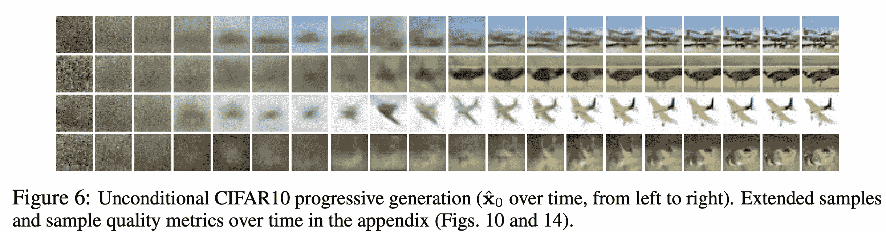
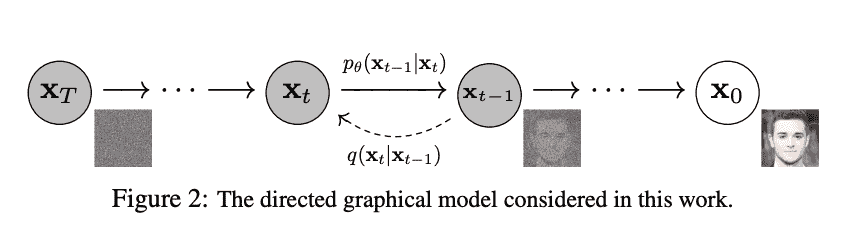
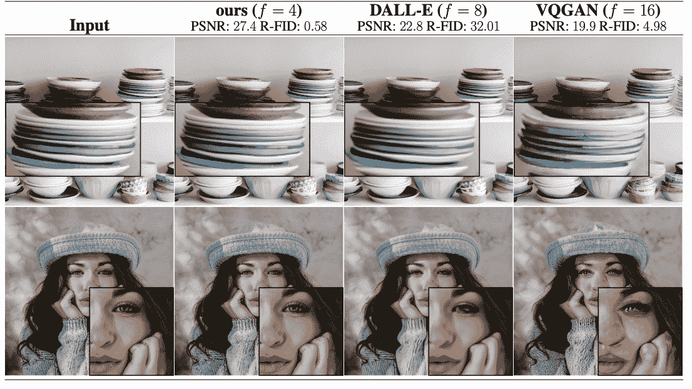
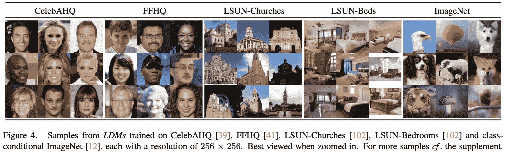
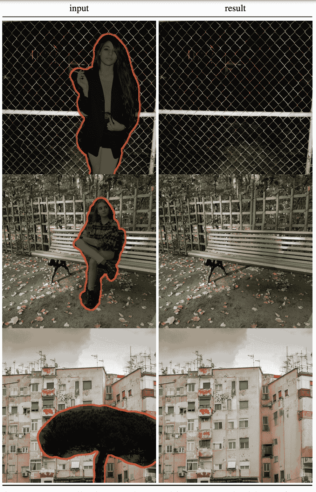
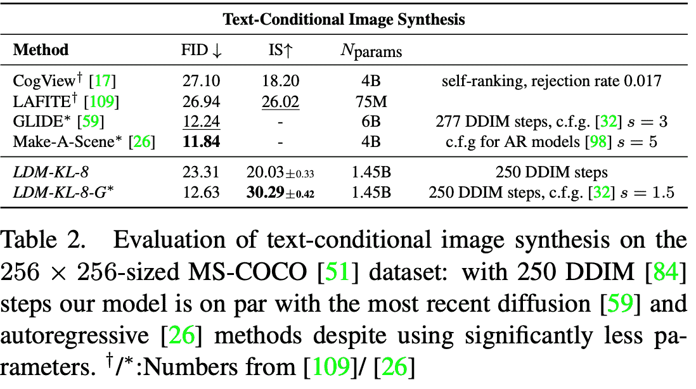
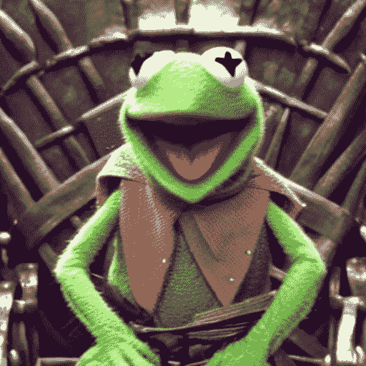
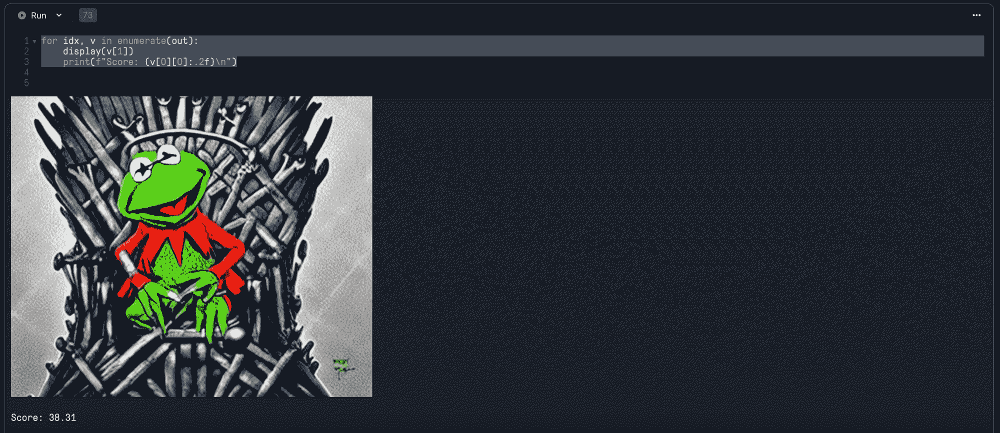

# 生成具有稳定扩散的图像

> 原文：<https://blog.paperspace.com/generating-images-with-stable-diffusion/>

用于图像合成的扩散模型的出现最近在互联网上掀起了风暴。这是有充分理由的。在今年早些时候发布了 CompVis 的“使用潜在扩散模型的高分辨率图像合成”之后，很明显，扩散模型不仅能够在给定的提示下生成高质量、精确的图像，而且这个过程的计算成本也远远低于许多竞争框架。

在这篇博文中，我们将在探索新的框架——稳定扩散——所带来的相应进步之前，考察扩散建模的基础。接下来，我们检查在当前状态下使用模型的优点和缺点。然后，我们进入一个简短的编码演示，展示我们如何在渐变笔记本上免费运行稳定的扩散。在这篇博文的结尾，读者将能够使用该模型生成他们自己的新颖艺术品/图像，同时建立对稳定扩散建模如何在幕后操作的理解。

## 扩散模型介绍



[Source](https://arxiv.org/pdf/2006.11239.pdf)

在本质上，扩散模型是生成模型。特别是在计算机视觉任务中，他们首先通过向训练图像数据中连续添加高斯噪声来工作。一旦原始数据被完全去噪，该模型就学习如何完全逆转去噪过程，称为去噪。该去噪过程旨在迭代地重建原始图像的由粗糙到精细的特征。然后，一旦训练完成，我们可以使用扩散模型来生成新的图像数据，只需将随机采样的噪声通过学习的去噪过程。



A visual interpretation of the denoising process - [Source](https://arxiv.org/pdf/2006.11239.pdf)

它通过使用固定的马尔可夫链映射图像的潜在空间来实现这一点。该链逐渐将噪声添加到数据中，以便使数据近似于后验函数，$ q(X1:T|X0) $。它假设$X0，...，XT$是与$X0$具有相同维数的图像潜变量。在序列结束时，图像数据被转换到类似于纯高斯噪声的程度。因此，扩散模型必须学会逆转这一过程，以获得所需的生成图像。因此，通过找到使训练数据的可能性最大化的反向马尔可夫转移来训练扩散模型。

# 稳定扩散

稳定扩散，后续的相同团队先前的工作对潜在扩散模型，大大改善了前人在图像质量和范围的能力。它通过更强大的训练数据集和对设计结构的有意义的改变实现了这一点。

该模型使用冻结剪辑 ViT-L/14 文本编码器来调节文本提示上的模型。用于训练的数据集是 [laion2B-en](https://laion.ai/blog/laion-5b/) ，它由英语中的 23.2 亿个图文对组成。经过训练后，凭借其 860M UNet 和 123M 文本编码器，该模型相对较轻，可以在至少 10GB VRAM 的 GPU 上运行。通过将数字格式的精度降低到半精度(FP16)，它还可以进一步优化，以便在大约 8 GB VRAM 的 GPU 上运行。

在实践中，这些变化使得稳定扩散在许多计算机视觉任务中表现出色，包括:

*   语义合成-仅通过文本提示生成图像
*   修复——精确填充图像的缺失部分，使用深度学习来预测图像缺失部分的特征
*   超分辨率-一类增强(增加)成像系统分辨率的技术

## 稳定扩散有什么新特性？

### 更好的缩放



[Source](https://arxiv.org/pdf/2112.10752.pdf)

稳定扩散与过去的扩散建模方法不同的一个关键方面是更容易扩展的能力。先前的相关工作，例如基于 GAN 的方法或纯变换器方法，需要在潜在空间中进行大量的空间下采样，以便降低数据的维数。因为扩散模型已经为空间数据提供了如此优秀的归纳偏差，所以对被移除的潜在空间进行下采样的效果对于我们的最终输出质量来说是无关紧要的。

在实践中，这允许模型功能的两个扩展:在压缩级别上工作，提供比以前的工作更忠实和详细的重建，以及有效地工作用于大图像的高分辨率合成。

### 运行训练和推理的成本更低

与其他 SOTA 竞争对手的框架相比，稳定扩散的运行计算成本相对较低。与其他方法相比，作者能够以低得多的运行成本展示修复、无条件图像合成和随机超分辨率生成任务的竞争性性能水平。与基于像素的扩散方法相比，他们还能够显著降低推理成本。

### 灵活性



[Source](https://arxiv.org/pdf/2112.10752.pdf)

许多以前关于该模型框架的工作需要模型的重构和生成能力的精确加权，因为它们同时学习编码器/解码器架构和基于分数的先验。与以前的工作相比，稳定扩散不需要重建和生成能力的这种微妙的加权，这允许在潜在空间相对较小的正则化的情况下更忠实地重建图像。

### 用于密集条件任务的高分辨率图像生成



High resolution inpainting - [Source](https://arxiv.org/pdf/2112.10752.pdf)

当使用该模型执行密集条件任务时，例如超分辨率、修补和语义合成，稳定扩散模型能够生成百万像素图像(大约 10242 像素大小)。当模型以卷积方式应用时，这种能力被启用。

## 稳定扩散:模型的应用&与竞争模型的比较

既然我们已经了解了扩散是如何工作的，为什么稳定扩散如此强大，那么了解什么时候应该使用这个模型，什么时候不应该使用这个模型是很重要的。具体来说，该模型是为一般研究目的而设计的。一些潜在的研究案例包括:

*   安全部署可能产生有害内容的模型
*   探索和理解生成模型的局限性和偏见
*   艺术品的生成以及在设计和其他艺术过程中的使用
*   教育或创意工具的应用
*   生成模型研究[ [来源](https://huggingface.co/CompVis/stable-diffusion-v1-4)



[Source](https://arxiv.org/pdf/2112.10752.pdf)

当执行这些任务时，稳定扩散被认为是综合能力方面的 SOTA。从上表可以看出，当执行文本条件图像合成任务时，稳定扩散(潜在扩散)的前身能够获得与两个顶级图像合成模型框架 GLIDE 和 Make-A-Scene 相当的 FID 分数。此外，LDM-KL-8-G 能够获得所有测试模型中最高的初始得分(IS)。基于这些数据，我们可以推断，稳定扩散是一个非常强大的图像合成工具，具有精确的再现。当执行其他任务时，模型也反映了这些发现，表明模型的总体稳健性。

## 稳定扩散:模型的问题

虽然稳定扩散具有最先进的能力，但在某些情况下，它在某些任务上不如其他技术。像许多图像生成框架一样，稳定扩散内置了由许多因素造成的限制，包括训练期间图像数据集的自然限制、开发人员对这些图像引入的偏见以及内置于模型中以防止误用的阻止程序。让我们逐一分析一下。

### 训练集限制

用于图像生成框架的训练数据总是会对其能力范围产生重大影响。即使在处理海量数据时，如用于训练稳定扩散的里昂 2B(en)数据集，也有可能通过输入提示引用看不见的图像类型来混淆模型。原始训练步骤中未包含的特征将无法重新创建，因为模型不了解这些特征。

这一点最明显的例子是人的形象和面孔。该模型在很大程度上不是以在生成的输出中提炼这些特征为重点来训练的。如果这是模型的预期用途，请注意这些限制。

### 研究人员引入的偏见

稳定扩散背后的研究人员认识到这种任务中固有的社会偏见的影响。首先，在里昂-2B(en)数据集的子集上训练稳定扩散 v1。这些数据几乎全部是英语。他们认为，来自不说英语的文化和社区的文本和图像在很大程度上是无法解释的。这种聚焦于这些英语语言数据的选择使得英语语言提示和输出之间的连接更加稳固，但是同时通过迫使白人和西方文化影响成为输出图像中的主导特征来影响输出。类似地，使用非英语语言输入提示的能力被这种训练范例所抑制。

### 内置针对色情、暴力和恶意图像内容的拦截器

模型架构的作者已经设置并定义了一个使用稳定扩散的上下文列表，该列表将被描述为滥用。这包括但不限于:

*   对人们或他们的环境、文化、宗教等产生贬低、非人性化或有害的描述
*   故意推广或传播歧视性内容或有害的陈规定型观念
*   未经他人同意冒充他人
*   未经可能看到它的人的同意的性内容
*   错误信息和假信息
*   令人震惊的暴力和血腥的表现
*   违反使用条款共享受版权保护或许可的材料
*   共享违反使用条款的版权或许可材料变更内容- [【来源】](https://huggingface.co/CompVis/stable-diffusion-v1-4)

# 代码演示

现在，我们已经了解了扩散的基础知识、稳定扩散模型的功能以及使用该模型时必须遵守的限制，我们可以进入编码演示，使用稳定扩散来生成我们自己的新图像。点击下面的链接，打开一个有免费 GPU 的笔记本来测试这段代码。

### 建立

首先，我们将进行一些必要的安装。值得注意的是，我们将使用`diffusers`来获取数据集和管道化我们的训练，并使用`flax`来根据提示的准确性对我们的图像进行剪辑重新排序。

```py
!pip install --upgrade diffusers transformers scipy ftfy
!pip install flax==0.5.0 --no-deps
!pip install ipywidgets msgpack rich 
```

接下来，你需要获得稳定扩散的预训练模型。为此，您必须登录 Huggingface 并创建一个[令牌。](https://huggingface.co/settings/tokens)完成后，转到[稳定扩散模型页面](https://huggingface.co/CompVis/stable-diffusion-v1-4)，确认并接受我们之前讨论的模型的使用条款。完成后，将你的令牌粘贴到笔记本上写有`<your_huggingface_token>`的地方。然后，运行单元。这也将创建一个输出目录来保存我们稍后生成的样本。

```py
!python login.py --token <your_huggingface_token>
!mkdir outputs
```

### 推理

现在我们已经完成了设置，我们可以开始生成我们的图像。在下面的示例中，我们展示了如何在 VRAM 小于 10 GB 的计算机上运行映像生成过程。

```py
# Low cost image generation - FP16

import torch
from torch import autocast
from diffusers import StableDiffusionPipeline

model_id = "CompVis/stable-diffusion-v1-4"
device = "cuda"
pipe = StableDiffusionPipeline.from_pretrained(model_id, torch_dtype=torch.float16, revision="fp16", use_auth_token=True)
pipe = pipe.to(device)

sample_num = 10
lst = []
prompt = "Kermit the Frog on the Iron Throne"
for i in range(sample_num):
    with autocast("cuda"):
        lst.append(pipe(prompt, guidance_scale=7.5)["sample"][0])

for i in range(sample_num):
    lst[i].save(f'outputs/gen-image-{i}.png') 
```

让我们走一遍。首先，我们导入 or 包并定义`model_id`和`device`变量。这些将指导我们的`StableDiffusionPipeline`从 HuggingFace Hub 下载适当的模型，设置模型处理半精度数据，并让它知道它必须使用我们的授权令牌来访问模型文件。然后，我们使用`.to`方法来移动管道，使其在我们的 GPU 上运行。

接下来，我们定义`sample_num`和`lst`。前者代表我们希望生成的图像数量，后者将保存我们的图像数据以供以后排序。然后，可以将提示更改为用户认为合适的任何内容。最后，我们准备好通过循环`sample_num`的范围来生成我们的图像，并在每一步从提示中生成一个新的图像来附加到`lst`。这些文件最终被保存到`outputs/`文件夹中，以备日后检查。下面是我们运行上述代码时的一个示例:



"Kermit the Frog sitting on the Iron Throne"

## 图像的剪辑排序

虽然对样本图像进行定性评估非常简单，但我们可以利用这里强大的 CLIP 模型，根据图像最终编码与原始输入提示编码的接近程度，对图像进行定量评估和排序。这段代码改编自 Boris Dayma 的 DALL-E Mini。

```py
from transformers import CLIPProcessor, FlaxCLIPModel
import jax
import jax.numpy as jnp
from flax.jax_utils import replicate
from functools import partial

# CLIP model
CLIP_REPO = "openai/clip-vit-base-patch32"
CLIP_COMMIT_ID = None

# Load CLIP
clip, clip_params = FlaxCLIPModel.from_pretrained(
    CLIP_REPO, revision=CLIP_COMMIT_ID, dtype=jnp.float16, _do_init=False
)
clip_processor = CLIPProcessor.from_pretrained(CLIP_REPO, revision=CLIP_COMMIT_ID)
clip_params = replicate(clip_params)

# score images
@partial(jax.pmap, axis_name="batch")
def p_clip(inputs, params):
    logits = clip(params=params, **inputs).logits_per_image
    return logits
```

首先，我们加载剪辑模型和处理器，复制参数，并定义我们的`p_clip`评分函数。

```py
from flax.training.common_utils import shard
import numpy as np
# get clip scores
clip_inputs = clip_processor(
    text=prompt * jax.device_count(),
    images=lst,
    return_tensors="np",
    padding="max_length",
    max_length=77,
    truncation=True,
).data
logits = p_clip(shard(clip_inputs), clip_params)

out = list(reversed(sorted(zip(logits[0], lst))))

for idx, v in enumerate(out):
    display(v[1])
    print(f"Score: {v[0][0]:.2f}\n")
```

然后我们用带有`clip_processor`的剪辑处理器得到每幅图像的剪辑分数。然后，我们可以将这些图片与我们的原始图片列表进行压缩和排序，以创建一个按得分排序的图片合并列表。



The top scoring image for "Kermit the Frog sits on the Iron Throne" 

通过剪辑排名，我们可以将我们自己的定性评估与图像生成的更客观的定量评分结合使用。CLIP 本身可以在给定提示的情况下找到最佳图像，但只有当它与人工代理结合时，我们才能找到生成的最佳图像。

# 结束语

总之，稳定扩散是一个强大且易于使用的图像合成框架。我们介绍了扩散是如何工作的，稳定的扩散模型有哪些新的和强大的功能，然后详细介绍了该框架的优点和缺点。之后，我们展示了如何在渐变笔记本上使用该技术执行文本条件图像合成。

现在就可以免费使用这些笔记本，看看你能创作出什么样的又酷又独特的作品！