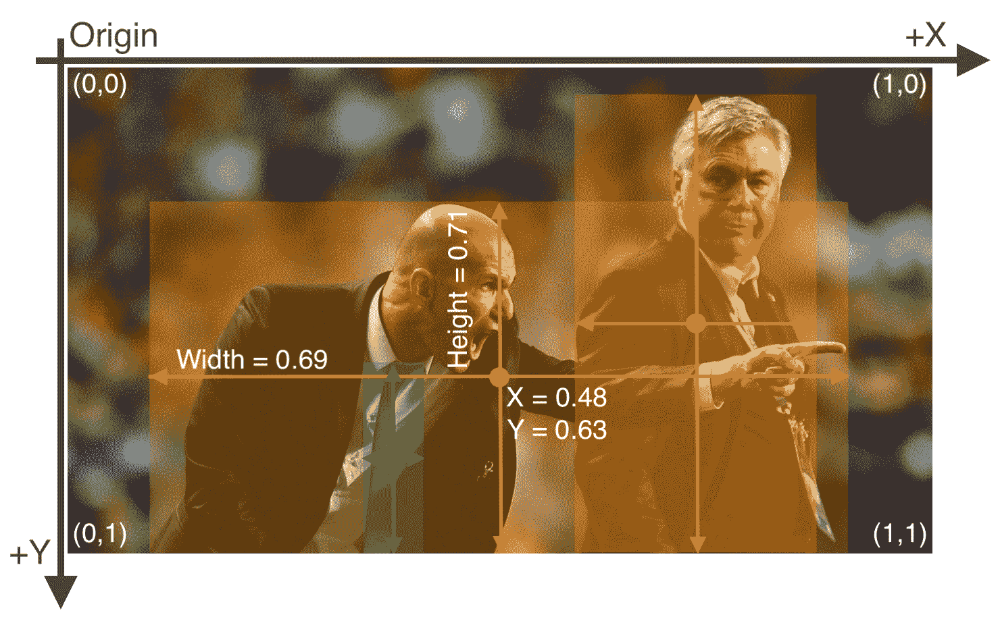
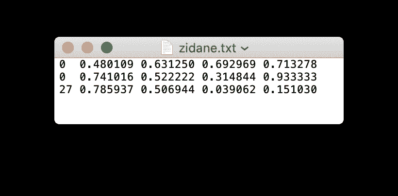
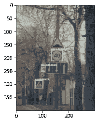
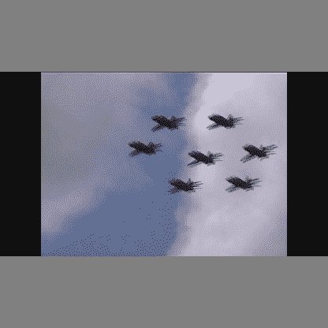
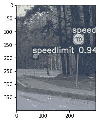

# 在自定义数据集上训练 YOLOv7 的分步说明

> 原文：<https://blog.paperspace.com/train-yolov7-custom-data/>

按照本指南获取在自定义数据集的渐变笔记本中运行 YOLOv7 模型训练的分步说明。本教程基于我们流行的使用梯度运行 [YOLOv5 自定义训练的指南，并对 YOLOv7 进行了更新。](https://blog.paperspace.com/train-yolov5-custom-data/)

我们将首先设置 Python 代码在笔记本中运行。接下来，我们将下载定制数据集，并将注释转换为 Yolov7 格式。提供了帮助器函数，以便于测试注释是否与图像匹配。然后，我们将数据集划分为训练集和验证集。对于训练，我们将建立几个训练选项，并设置我们的数据和超参数配置文件。然后，我们将介绍如何根据自定义数据的需要修改网络架构。一旦设置完成，我们将展示如何为 100 个时期训练模型，然后使用它在我们的验证集上生成预测。然后，我们将使用结果来计算测试数据的映射，以便我们可以评估最终模型的质量。

## 设置代码

我们首先克隆 YOLOv7 存储库，并设置运行 YOLOv7 所需的依赖项。如果您正在使用上面的梯度运行链接，这一步将为您完成。您还可以使用笔记本创建页面中的高级选项开关将 YOLOv7 repo 设置为您的工作区目录。

接下来，我们将安装所需的软件包。在终端中(或使用 cell magic)，键入:

```py
pip install -r requirements.txt
```

> 注意:如果你在一个渐变笔记本中工作，上面的步骤是不需要的-这些包已经被安装了。

安装完依赖项后，我们将导入所需的模块，以结束笔记本的设置。

```py
import torch
from IPython.display import Image  # for displaying images
import os 
import random
import shutil
from sklearn.model_selection import train_test_split
import xml.etree.ElementTree as ET
from xml.dom import minidom
from tqdm import tqdm
from PIL import Image, ImageDraw
import numpy as np
import matplotlib.pyplot as plt

random.seed(108)
```

## 下载数据

对于本教程，我们将使用来自 [MakeML](https://makeml.app/datasets/road-signs) 的路标对象检测数据集。只需几个步骤，我们就可以从 [Kaggle](https://www.kaggle.com/datasets/andrewmvd/road-sign-detection) 获取这些数据。

为此，首先我们将创建一个名为`Road_Sign_Dataset`的目录来保存我们的数据集。该目录需要与我们刚刚克隆的`YOLOv7`存储库文件夹在同一个文件夹中/这是我们在笔记本中的工作区目录。

```py
mkdir Road_Sign_Dataset
cd Road_Sign_Dataset
```

要从 Kaggle 下载用于渐变笔记本的数据集，首先要获得一个 Kaggle 帐户。接下来，通过转到您的帐户设置创建一个 API 令牌，并将 kaggle.json 保存到您的本地机器。将 kaggle.json 上传到渐变笔记本。最后，运行下面的代码单元格下载 zip 文件。

```py
pip install kaggle
mkdir ~/.kaggle
mv kaggle.json ~/.kaggle
kaggle datasets download andrewmvd/road-sign-detection 
```

解压缩数据集。

```py
unzip road-sign-detection.zip
```

删除不需要的文件。

```py
rm -r road-sign-detection.zip
```

## 探索数据集

我们在这个例子中使用的数据集相对较小，总共只包含 877 幅图像。推荐的通常值是每类 3000 张图像以上。我们可以对更大的数据集(如 [LISA 数据集](http://cvrr.ucsd.edu/LISA/lisa-traffic-sign-dataset.html))应用用于该数据集的所有相同技术，以充分实现 YOLO 的功能，但我们将在本教程中使用一个小数据集来促进快速原型制作。典型的训练需要不到半个小时，这将允许您快速迭代涉及不同超参数的实验。

数据集包含属于 4 类的路标:

1.  红绿灯
2.  停车标志
3.  限速标志
4.  人行横道标志


Road Sign Dataset

## 将注释转换为 YOLO 版本 5 的格式

现在我们有了数据集，我们需要将注释转换成 YOLOv7 期望的格式。YOLOv7 希望数据以特定的方式组织，否则它无法解析目录。重新排序我们的数据将确保我们没有问题开始训练。

路标检测数据集的注释都遵循 PASCAL VOC XML 格式。这是一种非常流行的格式，因为在一个表结构中存储多种类型的数据非常简单。因为这是一种流行的格式，所以有许多简单易用的在线转换工具来重新格式化 XML 数据。尽管如此，我们还是提供了代码来展示如何转换其他流行的格式(您可能找不到流行的工具)。

PASCAL VOC 格式将其注释存储在 XML 文件中，其中各种属性由标签描述。让我们看一个示例注释文件。

```py
# Assuming you're in the data folder
cat annotations/road4.xml
```

输出如下所示。

```py
<annotation>
    <folder>images</folder>
    <filename>road4.png</filename>
    <size>
        <width>267</width>
        <height>400</height>
        <depth>3</depth>
    </size>
    <segmented>0</segmented>
    <object>
        <name>trafficlight</name>
        <pose>Unspecified</pose>
        <truncated>0</truncated>
        <occluded>0</occluded>
        <difficult>0</difficult>
        <bndbox>
            <xmin>20</xmin>
            <ymin>109</ymin>
            <xmax>81</xmax>
            <ymax>237</ymax>
        </bndbox>
    </object>
    <object>
        <name>trafficlight</name>
        <pose>Unspecified</pose>
        <truncated>0</truncated>
        <occluded>0</occluded>
        <difficult>0</difficult>
        <bndbox>
            <xmin>116</xmin>
            <ymin>162</ymin>
            <xmax>163</xmax>
            <ymax>272</ymax>
        </bndbox>
    </object>
    <object>
        <name>trafficlight</name>
        <pose>Unspecified</pose>
        <truncated>0</truncated>
        <occluded>0</occluded>
        <difficult>0</difficult>
        <bndbox>
            <xmin>189</xmin>
            <ymin>189</ymin>
            <xmax>233</xmax>
            <ymax>295</ymax>
        </bndbox>
    </object>
</annotation>
```

上面的注释文件描述了一个名为`road4.jpg`的文件。我们可以看到它的尺寸为`267 x 400 x 3`。它还有 3 个`object`标签，每个标签代表 3 个相应的边界框。该类由`name`标签指定，边界框坐标的定位由`bndbox`标签表示。边界框由其左上角(`x_min`、`y_min`)和右下角(`xmax`、`ymax`)的坐标来描述。

#### YOLOv7 注释格式

让我们更仔细地看看注释文件。YOLOv7 希望每个图像都有一个`.txt`文件形式的注释，其中文本文件的每一行都描述了一个边界框。考虑下面的图像。



图像的注释文件包含上面显示的每个边界框的坐标。这些标签的格式如下所示:



我们可以看到，总共有 3 个对象(2 个`person`和一个`tie`)。每条线代表这些对象中的一个。每条线的规格如下。

*   每个对象一行
*   栏目格式为`class`、`x_center`、`y_center`、`width`、`height`。
*   这些框坐标必须标准化为图像的尺寸(即具有 0 到 1 之间的值)
*   类别号是零索引的(从 0 开始)。

接下来，我们将编写一个函数，它接受 VOC 格式的注释，并将它们转换为一种格式，在这种格式下，关于边界框的信息存储在字典中。

```py
# Function to get the data from XML Annotation
def extract_info_from_xml(xml_file):
    root = ET.parse(xml_file).getroot()

    # Initialise the info dict 
    info_dict = {}
    info_dict['bboxes'] = []

    # Parse the XML Tree
    for elem in root:
        # Get the file name 
        if elem.tag == "filename":
            info_dict['filename'] = elem.text

        # Get the image size
        elif elem.tag == "size":
            image_size = []
            for subelem in elem:
                image_size.append(int(subelem.text))

            info_dict['image_size'] = tuple(image_size)

        # Get details of the bounding box 
        elif elem.tag == "object":
            bbox = {}
            for subelem in elem:
                if subelem.tag == "name":
                    bbox["class"] = subelem.text

                elif subelem.tag == "bndbox":
                    for subsubelem in subelem:
                        bbox[subsubelem.tag] = int(subsubelem.text)            
            info_dict['bboxes'].append(bbox)

    return info_dict
```

让我们在一个示例注释文件上尝试这个函数。

```py
print(extract_info_from_xml('annotations/road4.xml'))
```

这将输出:

```py
{'bboxes': [{'class': 'trafficlight', 'xmin': 20, 'ymin': 109, 'xmax': 81, 'ymax': 237}, {'class': 'trafficlight', 'xmin': 116, 'ymin': 162, 'xmax': 163, 'ymax': 272}, {'class': 'trafficlight', 'xmin': 189, 'ymin': 189, 'xmax': 233, 'ymax': 295}], 'filename': 'road4.png', 'image_size': (267, 400, 3)} 
```

这有效地提取了使用 YOLOv7 所需的信息。

接下来，我们将创建一个函数来将这些信息(现在包含在`info_dict`中)转换成 YOLOv7 样式的注释，并将它们写入`txt`文件。如果我们的注释不同于 PASCAL VOC 注释，我们可以编写一个新的函数将它们转换成`info_dict`格式，并使用下面相同的函数将它们转换成 YOLOv7 样式的注释。只要保存了`info-dict`格式，这段代码应该可以工作。

```py
# Dictionary that maps class names to IDs
class_name_to_id_mapping = {"trafficlight": 0,
                           "stop": 1,
                           "speedlimit": 2,
                           "crosswalk": 3}

# Convert the info dict to the required yolo format and write it to disk
def convert_to_yolov5(info_dict):
    print_buffer = []

    # For each bounding box
    for b in info_dict["bboxes"]:
        try:
            class_id = class_name_to_id_mapping[b["class"]]
        except KeyError:
            print("Invalid Class. Must be one from ", class_name_to_id_mapping.keys())

        # Transform the bbox co-ordinates as per the format required by YOLO v5
        b_center_x = (b["xmin"] + b["xmax"]) / 2 
        b_center_y = (b["ymin"] + b["ymax"]) / 2
        b_width    = (b["xmax"] - b["xmin"])
        b_height   = (b["ymax"] - b["ymin"])

        # Normalise the co-ordinates by the dimensions of the image
        image_w, image_h, image_c = info_dict["image_size"]  
        b_center_x /= image_w 
        b_center_y /= image_h 
        b_width    /= image_w 
        b_height   /= image_h 

        #Write the bbox details to the file 
        print_buffer.append("{} {:.3f} {:.3f} {:.3f} {:.3f}".format(class_id, b_center_x, b_center_y, b_width, b_height))

    # Name of the file which we have to save 
    save_file_name = os.path.join("annotations", info_dict["filename"].replace("png", "txt"))

    # Save the annotation to disk
    print("\n".join(print_buffer), file= open(save_file_name, "w"))
```

接下来，我们对每个`xml`文件使用这个函数，将所有的`xml`注释转换成 YOLO 风格的`txt`注释。

```py
# Get the annotations
annotations = [os.path.join('annotations', x) for x in os.listdir('annotations') if x[-3:] == "xml"]
annotations.sort()

# Convert and save the annotations
for ann in tqdm(annotations):
    info_dict = extract_info_from_xml(ann)
    convert_to_yolov5(info_dict)
annotations = [os.path.join('annotations', x) for x in os.listdir('annotations') if x[-3:] == "txt"]
```

#### 测试注释

现在让我们测试一些转换后的注释，确保它们的格式正确。下面的代码将随机加载一个注释，并使用它来绘制带有转换后的注释的框。然后，我们可以直观地检查它，看看我们的代码是否按预期工作。

我们的建议是多次运行下一个单元。每次都会随机抽取一个注释，我们可以看到数据被正确排序。

```py
random.seed(0)

class_id_to_name_mapping = dict(zip(class_name_to_id_mapping.values(), class_name_to_id_mapping.keys()))

def plot_bounding_box(image, annotation_list):
    annotations = np.array(annotation_list)
    w, h = image.size

    plotted_image = ImageDraw.Draw(image)

    transformed_annotations = np.copy(annotations)
    transformed_annotations[:,[1,3]] = annotations[:,[1,3]] * w
    transformed_annotations[:,[2,4]] = annotations[:,[2,4]] * h 

    transformed_annotations[:,1] = transformed_annotations[:,1] - (transformed_annotations[:,3] / 2)
    transformed_annotations[:,2] = transformed_annotations[:,2] - (transformed_annotations[:,4] / 2)
    transformed_annotations[:,3] = transformed_annotations[:,1] + transformed_annotations[:,3]
    transformed_annotations[:,4] = transformed_annotations[:,2] + transformed_annotations[:,4]

    for ann in transformed_annotations:
        obj_cls, x0, y0, x1, y1 = ann
        plotted_image.rectangle(((x0,y0), (x1,y1)))

        plotted_image.text((x0, y0 - 10), class_id_to_name_mapping[(int(obj_cls))])

    plt.imshow(np.array(image))
    plt.show()

# Get any random annotation file 
annotation_file = random.choice(annotations)
with open(annotation_file, "r") as file:
    annotation_list = file.read().split("\n")[:-1]
    annotation_list = [x.split(" ") for x in annotation_list]
    annotation_list = [[float(y) for y in x ] for x in annotation_list]

#Get the corresponding image file
image_file = annotation_file.replace("annotations", "images").replace("txt", "png")
assert os.path.exists(image_file)

#Load the image
image = Image.open(image_file)

#Plot the Bounding Box
plot_bounding_box(image, annotation_list) 
```



Labeled sample output from Road Sign Dataset

太好了，我们能够从 YOLOv7 格式中恢复正确的注释。这意味着我们已经正确地实现了转换函数。

### 对数据集进行分区

接下来，我们需要将数据集划分为训练集、验证集和测试集。这些将分别包含 80%、10%和 10%的数据。可以根据需要编辑这些值来更改分割百分比。

```py
# Read images and annotations
images = [os.path.join('images', x) for x in os.listdir('images')]
annotations = [os.path.join('annotations', x) for x in os.listdir('annotations') if x[-3:] == "txt"]

images.sort()
annotations.sort()

# Split the dataset into train-valid-test splits 
train_images, val_images, train_annotations, val_annotations = train_test_split(images, annotations, test_size = 0.2, random_state = 1)
val_images, test_images, val_annotations, test_annotations = train_test_split(val_images, val_annotations, test_size = 0.5, random_state = 1) 
```

然后，我们将创建文件夹来保存新拆分的数据。

```py
!mkdir images/train images/val images/test labels/train labels/val labels/test
```

最后，我们通过将文件移动到各自的文件夹来完成数据的设置。

```py
#Utility function to move images 
def move_files_to_folder(list_of_files, destination_folder):
    for f in list_of_files:
        try:
            shutil.move(f, destination_folder)
        except:
            print(f)
            assert False

# Move the splits into their folders
move_files_to_folder(train_images, 'images/train')
move_files_to_folder(val_images, 'images/val/')
move_files_to_folder(test_images, 'images/test/')
move_files_to_folder(train_annotations, 'annotations/train/')
move_files_to_folder(val_annotations, 'annotations/val/')
move_files_to_folder(test_annotations, 'annotations/test/')
!mv annotations labels
%cd ../
```

## 培训选项

现在，是时候设置我们训练网络的选项了。为此，我们将使用各种标志，包括:

*   `img-size`:该参数对应图像的像素大小。对于 YOLOv7，图像必须是正方形。为了做到这一点，原始图像在保持纵横比的同时被调整大小。图像的长边被调整到这个数字。短边用灰色填充。



An example of letter-boxed image

*   `batch`:批量大小对应于在训练期间的任何给定时间通过网络传播的图像-字幕对的数量
*   `epochs`:训练的历元数。该值对应于模型训练将在整个数据集内通过的总次数
*   数据 YAML 文件包含关于数据集的信息，以帮助指导 YOLO。里面的信息包括图像的路径、类别标签的数量和类别标签的名称
*   `workers`:表示分配给培训的 CPU 工作人员的数量
*   `cfg`:模型架构的配置文件。可能的选择有 [yolov7-e6e.yaml](https://github.com/WongKinYiu/yolov7/blob/main/cfg/training/yolov7-e6e.yaml) 、 [yolov7-d6.yaml](https://github.com/WongKinYiu/yolov7/blob/main/cfg/training/yolov7-d6.yaml) 、 [yolov7-e6.yaml](https://github.com/WongKinYiu/yolov7/blob/main/cfg/training/yolov7-e6.yaml) [、](https://github.com/WongKinYiu/yolov7/commit/e2a5a543fb3c055e0c2d7502c56ffefd84f15483)[yolov 7-w6 . YAML](https://github.com/WongKinYiu/yolov7/blob/main/cfg/training/yolov7-w6.yaml)[、](https://github.com/WongKinYiu/yolov7/commit/31e2a9059884b5f8de67b1650a2cc36894cb3b8f) [yolov7x.yaml](https://github.com/WongKinYiu/yolov7/blob/main/cfg/training/yolov7x.yaml) 、 [yolov7.yaml](https://github.com/WongKinYiu/yolov7/blob/main/cfg/training/yolov7.yaml) 和 [yolov7-tiny。这些模型的大小和复杂度以降序增加，并且我们可以使用这些来最好地选择适合我们的对象检测任务的复杂度的模型。在我们想要使用定制架构的情况下，我们必须在指定网络架构的`cfg`文件夹中定义一个`YAML`文件](https://github.com/WongKinYiu/yolov7/blob/main/cfg/training/yolov7-tiny.yaml)
*   `weights`:我们想要重新开始训练的预训练模型重量。如果我们想从头开始训练，我们可以使用`--weights ' '`
*   `name`:培训日志等各种培训输出的路径。输出的训练权重、日志和批量图像样本存储在与`runs/train/<name>`对应的文件夹中。
*   `hyp`:描述模型训练的超参数选择的 YAML 文件。关于如何定义自定义超参数的示例，参见`data/hyp.scratch.yaml`。如果未指定，则使用`data/hyp.scratch.yaml`中的超参数。

### 数据配置文件

数据配置`YAML`文件定义了您想要训练模型的数据集的详细信息。必须在数据配置文件中定义以下参数:

1.  `train`、`test`和`val`:训练、测试和验证图像的路径
2.  `nc`:数据集中类的数量
3.  `names`:数据集中类标签的名称。这个列表中的类的索引可以用作代码中类名的标识符。

我们可以创建一个名为`road_sign_data.yaml`的新文件，并将其放在`data`文件夹中。然后用以下内容填充它。

```py
train: Road_Sign_Datasimg/train/ 
val:  Road_Sign_Datasimg/val/
test: Road_Sign_Datasimg/test/

# number of classes
nc: 4

# class names
names: ["trafficlight","stop", "speedlimit","crosswalk"]
```

YOLOv7 期望为文件夹中的图像找到相应的训练标签，该文件夹的名称是通过将数据集图像路径中的`images`替换为`labels`而得到的。例如，在上面的例子中，YOLO v5 将在`Road_Sign_Dataset/labels/train/`中寻找列车标签。

或者，我们可以跳过这一步，只需将文件下载到我们工作目录的`data`文件夹中。

```py
!wget -P data/ https://gist.githubusercontent.com/ayooshkathuria/bcf7e3c929cbad445439c506dba6198d/raw/f437350c0c17c4eaa1e8657a5cb836e65d8aa08a/road_sign_data.yaml 
```

### 超参数配置文件

超参数配置文件帮助我们定义神经网络的超参数。这使我们对模型训练的行为有了更多的控制，如果训练没有按预期进行，更高级的用户应该考虑修改某些值，如学习率。它也许能改善最终的结果。

我们将使用默认的配置规范`data/hyp.scratch.yaml`。看起来是这样的:

```py
# Hyperparameters for COCO training from scratch
# python train.py --batch 40 --cfg yolov5m.yaml --weights '' --data coco.yaml --img 640 --epochs 300
# See tutorials for hyperparameter evolution https://github.com/ultralytics/yolov5#tutorials

lr0: 0.01  # initial learning rate (SGD=1E-2, Adam=1E-3)
lrf: 0.2  # final OneCycleLR learning rate (lr0 * lrf)
momentum: 0.937  # SGD momentum/Adam beta1
weight_decay: 0.0005  # optimizer weight decay 5e-4
warmup_epochs: 3.0  # warmup epochs (fractions ok)
warmup_momentum: 0.8  # warmup initial momentum
warmup_bias_lr: 0.1  # warmup initial bias lr
box: 0.05  # box loss gain
cls: 0.5  # cls loss gain
cls_pw: 1.0  # cls BCELoss positive_weight
obj: 1.0  # obj loss gain (scale with pixels)
obj_pw: 1.0  # obj BCELoss positive_weight
iou_t: 0.20  # IoU training threshold
anchor_t: 4.0  # anchor-multiple threshold
# anchors: 3  # anchors per output layer (0 to ignore)
fl_gamma: 0.0  # focal loss gamma (efficientDet default gamma=1.5)
hsv_h: 0.015  # image HSV-Hue augmentation (fraction)
hsv_s: 0.7  # image HSV-Saturation augmentation (fraction)
hsv_v: 0.4  # image HSV-Value augmentation (fraction)
degrees: 0.0  # image rotation (+/- deg)
translate: 0.1  # image translation (+/- fraction)
scale: 0.5  # image scale (+/- gain)
shear: 0.0  # image shear (+/- deg)
perspective: 0.0  # image perspective (+/- fraction), range 0-0.001
flipud: 0.0  # image flip up-down (probability)
fliplr: 0.5  # image flip left-right (probability)
mosaic: 1.0  # image mosaic (probability)
mixup: 0.0  # image mixup (probability)
```

您可以根据需要编辑这个文件，保存它，并使用`hyp`选项将其指定为训练脚本的一个参数。

### 定制网络架构

如果某个预先定义的网络不适合我们的任务，YOLOv7 还允许我们定义自己的自定义体系结构和锚。为了利用这一点，我们将不得不定义一个自定义权重配置文件，或者只使用他们的预制规格之一。对于这个演示，我们不需要做任何修改，只需要使用`yolov7.yaml`。看起来是这样的:

```py
# parameters
nc: 80  # number of classes
depth_multiple: 1.0  # model depth multiple
width_multiple: 1.0  # layer channel multiple

# anchors
anchors:
  - [12,16, 19,36, 40,28]  # P3/8
  - [36,75, 76,55, 72,146]  # P4/16
  - [142,110, 192,243, 459,401]  # P5/32

# yolov7 backbone
backbone:
  # [from, number, module, args]
  [[-1, 1, Conv, [32, 3, 1]],  # 0

   [-1, 1, Conv, [64, 3, 2]],  # 1-P1/2      
   [-1, 1, Conv, [64, 3, 1]],

   [-1, 1, Conv, [128, 3, 2]],  # 3-P2/4  
   [-1, 1, Conv, [64, 1, 1]],
   [-2, 1, Conv, [64, 1, 1]],
   [-1, 1, Conv, [64, 3, 1]],
   [-1, 1, Conv, [64, 3, 1]],
   [-1, 1, Conv, [64, 3, 1]],
   [-1, 1, Conv, [64, 3, 1]],
   [[-1, -3, -5, -6], 1, Concat, [1]],
   [-1, 1, Conv, [256, 1, 1]],  # 11

   [-1, 1, MP, []],
   [-1, 1, Conv, [128, 1, 1]],
   [-3, 1, Conv, [128, 1, 1]],
   [-1, 1, Conv, [128, 3, 2]],
   [[-1, -3], 1, Concat, [1]],  # 16-P3/8  
   [-1, 1, Conv, [128, 1, 1]],
   [-2, 1, Conv, [128, 1, 1]],
   [-1, 1, Conv, [128, 3, 1]],
   [-1, 1, Conv, [128, 3, 1]],
   [-1, 1, Conv, [128, 3, 1]],
   [-1, 1, Conv, [128, 3, 1]],
   [[-1, -3, -5, -6], 1, Concat, [1]],
   [-1, 1, Conv, [512, 1, 1]],  # 24

   [-1, 1, MP, []],
   [-1, 1, Conv, [256, 1, 1]],
   [-3, 1, Conv, [256, 1, 1]],
   [-1, 1, Conv, [256, 3, 2]],
   [[-1, -3], 1, Concat, [1]],  # 29-P4/16  
   [-1, 1, Conv, [256, 1, 1]],
   [-2, 1, Conv, [256, 1, 1]],
   [-1, 1, Conv, [256, 3, 1]],
   [-1, 1, Conv, [256, 3, 1]],
   [-1, 1, Conv, [256, 3, 1]],
   [-1, 1, Conv, [256, 3, 1]],
   [[-1, -3, -5, -6], 1, Concat, [1]],
   [-1, 1, Conv, [1024, 1, 1]],  # 37

   [-1, 1, MP, []],
   [-1, 1, Conv, [512, 1, 1]],
   [-3, 1, Conv, [512, 1, 1]],
   [-1, 1, Conv, [512, 3, 2]],
   [[-1, -3], 1, Concat, [1]],  # 42-P5/32  
   [-1, 1, Conv, [256, 1, 1]],
   [-2, 1, Conv, [256, 1, 1]],
   [-1, 1, Conv, [256, 3, 1]],
   [-1, 1, Conv, [256, 3, 1]],
   [-1, 1, Conv, [256, 3, 1]],
   [-1, 1, Conv, [256, 3, 1]],
   [[-1, -3, -5, -6], 1, Concat, [1]],
   [-1, 1, Conv, [1024, 1, 1]],  # 50
  ]

# yolov7 head
head:
  [[-1, 1, SPPCSPC, [512]], # 51

   [-1, 1, Conv, [256, 1, 1]],
   [-1, 1, nn.Upsample, [None, 2, 'nearest']],
   [37, 1, Conv, [256, 1, 1]], # route backbone P4
   [[-1, -2], 1, Concat, [1]],

   [-1, 1, Conv, [256, 1, 1]],
   [-2, 1, Conv, [256, 1, 1]],
   [-1, 1, Conv, [128, 3, 1]],
   [-1, 1, Conv, [128, 3, 1]],
   [-1, 1, Conv, [128, 3, 1]],
   [-1, 1, Conv, [128, 3, 1]],
   [[-1, -2, -3, -4, -5, -6], 1, Concat, [1]],
   [-1, 1, Conv, [256, 1, 1]], # 63

   [-1, 1, Conv, [128, 1, 1]],
   [-1, 1, nn.Upsample, [None, 2, 'nearest']],
   [24, 1, Conv, [128, 1, 1]], # route backbone P3
   [[-1, -2], 1, Concat, [1]],

   [-1, 1, Conv, [128, 1, 1]],
   [-2, 1, Conv, [128, 1, 1]],
   [-1, 1, Conv, [64, 3, 1]],
   [-1, 1, Conv, [64, 3, 1]],
   [-1, 1, Conv, [64, 3, 1]],
   [-1, 1, Conv, [64, 3, 1]],
   [[-1, -2, -3, -4, -5, -6], 1, Concat, [1]],
   [-1, 1, Conv, [128, 1, 1]], # 75

   [-1, 1, MP, []],
   [-1, 1, Conv, [128, 1, 1]],
   [-3, 1, Conv, [128, 1, 1]],
   [-1, 1, Conv, [128, 3, 2]],
   [[-1, -3, 63], 1, Concat, [1]],

   [-1, 1, Conv, [256, 1, 1]],
   [-2, 1, Conv, [256, 1, 1]],
   [-1, 1, Conv, [128, 3, 1]],
   [-1, 1, Conv, [128, 3, 1]],
   [-1, 1, Conv, [128, 3, 1]],
   [-1, 1, Conv, [128, 3, 1]],
   [[-1, -2, -3, -4, -5, -6], 1, Concat, [1]],
   [-1, 1, Conv, [256, 1, 1]], # 88

   [-1, 1, MP, []],
   [-1, 1, Conv, [256, 1, 1]],
   [-3, 1, Conv, [256, 1, 1]],
   [-1, 1, Conv, [256, 3, 2]],
   [[-1, -3, 51], 1, Concat, [1]],

   [-1, 1, Conv, [512, 1, 1]],
   [-2, 1, Conv, [512, 1, 1]],
   [-1, 1, Conv, [256, 3, 1]],
   [-1, 1, Conv, [256, 3, 1]],
   [-1, 1, Conv, [256, 3, 1]],
   [-1, 1, Conv, [256, 3, 1]],
   [[-1, -2, -3, -4, -5, -6], 1, Concat, [1]],
   [-1, 1, Conv, [512, 1, 1]], # 101

   [75, 1, RepConv, [256, 3, 1]],
   [88, 1, RepConv, [512, 3, 1]],
   [101, 1, RepConv, [1024, 3, 1]],

   [[102,103,104], 1, IDetect, [nc, anchors]],   # Detect(P3, P4, P5)
  ]
```

如果我们想使用一个定制的网络，那么我们可以创建一个新文件(像`yolov7_training.yaml`)，并在我们训练时使用`cfg`标志指定它。

### 训练模型

我们现在已经使用我们的数据文件定义了`train`、`val`和`test`的位置、类的数量(`nc`)和类的名称，所以我们准备开始模型训练。由于数据集相对较小，并且每个图像没有很多对象，我们可以从可用的预训练模型的基本版本`yolosv7.pt`开始，以保持简单并避免过度拟合。我们将使用`8`的批量大小，因此这将在 Gradient 的免费 GPU 笔记本上运行，图像大小为`640`，我们将训练 100 个纪元。

如果您仍然无法将模型放入内存:

*   使用较小的批处理大小:如果 8 不能工作，尝试 2 或 4 的批处理大小，但这不应该发生在免费的 GPU 上
*   使用较小的网络:`yolov7-tiny.pt`检查点的运行成本将低于基本的`yolov7.pt`
*   使用较小的图像尺寸:图像的尺寸直接对应于培训期间的费用。将图像从 640 减少到 320，以损失预测准确性为代价显著降低成本

更改上述任何一项都可能会影响性能。这种折衷是一种设计决策，我们必须根据可用的计算能力做出决定。根据具体情况，我们可能还想使用更大的 GPU 实例。例如，像 A100-80G 这样的更强大的 GPU 将大大减少训练时间，但对于这个更小的数据集训练任务来说，这将是非常过分的。点击这里查看我们对 YOLOv7 基准测试的分析。

我们将使用名称`yolo_road_det`进行培训。请记住，如果我们要再次运行训练而不改变它，输出将重定向到`yolo_road_det1`，并在迭代时不断添加到追加的最后一个值。登船训练日志可以在`runs/train/yolo_road_det/results.txt`找到。您还可以利用 YOLOv7 模型与权重&偏差的集成，并连接一个`wandb`帐户，以便日志在您的[帐户](https://wandb.ai/site)上绘制。

最后，我们已经完成了设置，并准备训练我们的模型。通过执行下面的代码单元格来运行培训:

```py
!python train.py --img-size 640 --cfg cfg/training/yolov7.yaml --hyp data/hyp.scratch.custom.yaml --batch 8 --epochs 100 --data data/road_sign.yaml --weights yolov7_training.pt --workers 24 --name yolo_road_det
```

> 注意:在免费的 GPU (M4000)上进行训练可能需要 5 个小时。如果时间是一个因素，考虑升级到我们的一个更强大的机器。

## 推理

有许多方法可以使用`detect.py`文件运行推断，并为测试集图像中的类生成预测标签。

当运行`detect.py`代码时，我们再次需要设置一些选项。

*   `source`标志定义了我们的检测器的来源，它通常是以下之一:单个图像、一个图像文件夹、一个视频、或者来自某个视频流或网络摄像头的实时反馈。我们想在我们的测试图像上运行它，所以我们将`source`标志设置为`Road_Sign_Datasimg/test/`。
*   `weights`选项定义了我们想要运行探测器的模型的路径。我们将使用上一次训练运行中的`best.pt`模型，就验证集上的 mAP 而言，它是定量的“最佳”执行模型。
*   `conf`标志是阈值目标置信度。
*   `name`标志定义了检测的存储位置。我们将这个标志设置为`yolo_road_det`；因此，检测结果将存储在`runs/detect/yolo_road_det/`中。

决定了所有选项后，让我们用测试数据集进行推断，并定性地看看我们的模型训练是如何完成的。运行下面单元格中的代码:

```py
!python detect.py --source Road_Sign_Datasimg/test/ --weights runs/train/yolo_road_det5/weights/best.pt --conf 0.25 --name yolo_road_det
```

一旦完成，我们现在可以随机绘制其中一个检测，并查看我们的训练效果。

```py
detections_dir = "runs/detect/yolo_road_det/"
detection_images = [os.path.join(detections_dir, x) for x in os.listdir(detections_dir)]

random_detection_image = Image.open(random.choice(detection_images))
plt.imshow(np.array(random_detection_image))
```



OUTPUT

除了一个文件夹的图像，还有其他来源，我们可以使用我们的探测器。这些包括 http、rtsp、rtmp 视频流，它们可以为将这种模型部署到生产环境中增加许多实用工具。执行此操作的命令语法如下所述。

```py
python detect.py --source 0  # webcam
                            file.jpg  # image 
                            file.mp4  # video
                            path/  # directory
                            path/*.jpg  # glob
                            rtsp://170.93.143.139/rtplive/470011e600ef003a004ee33696235daa  # rtsp stream
                            rtmp://192.168.1.105/live/test  # rtmp stream
                            http://112.50.243.8/PLTV/88888888/224/3221225900/1.m3u8  # http stream
```

### 计算测试数据集的平均精度(mAP)

我们可以使用`test.py`脚本来计算测试集上的模型预测图。该脚本为我们计算每个类的平均精度，以及平均精度(mAP)。为了对我们的测试集进行评估，我们需要将`task`标志设置为`test`。然后，我们将该名称设置为`yolo_det`。`test.py`的各种输出，如各种曲线(F1，AP，Precision curves 等)的图，可以在输出文件夹:`runs/test/yolo_road_det`中找到。

```py
!python test.py --weights runs/train/yolo_road_det/weights/best.pt --data road_sign_data.yaml --task test --name yolo_det 
```

其输出如下所示:

```py
Fusing layers... 
Model Summary: 224 layers, 7062001 parameters, 0 gradients, 16.4 GFLOPS
test: Scanning 'Road_Sign_Dataset/labels/test' for images and labels... 
test: New cache created: Road_Sign_Dataset/labels/test.cache
test: Scanning 'Road_Sign_Dataset/labels/test.cache' for images and labels...
               Class      Images     Targets           P           R      mAP@.5
                 all          88         126       0.961       0.932       0.944         0.8
        trafficlight          88          20       0.969        0.75       0.799       0.543
                stop          88           7           1        0.98       0.995       0.909
          speedlimit          88          76       0.989           1       0.997       0.906
           crosswalk          88          23       0.885           1       0.983       0.842
Speed: 1.4/0.7/2.0 ms inference/NMS/total per 640x640 image at batch-size 32
Results saved to runs/test/yolo_det
```

## 结束语

至此，我们完成了教程。本教程的读者现在应该能够在任何自定义数据集上训练 YOLOv7，就像路标使用的例子一样。虽然不是所有的数据集都将使用这种`xml`格式，但该系统足够健壮，可以应用于任何对象检测数据集，以便与 YOLOv7 一起运行。

请务必在渐变笔记本中尝试该演示，并尝试将 GPU 扩展到支持更高 VRAM 的机器，以了解这如何影响训练时间。

感谢 Ayoosh Kathuria 在他的原创 [YOLOv5 教程](https://blog.paperspace.com/train-yolov5-custom-data/)上的出色工作，我们在这里对 YOLOv7 进行了改编。请务必查看他在博客上的其他文章。

这个项目的 github repo 可以在这里找到。