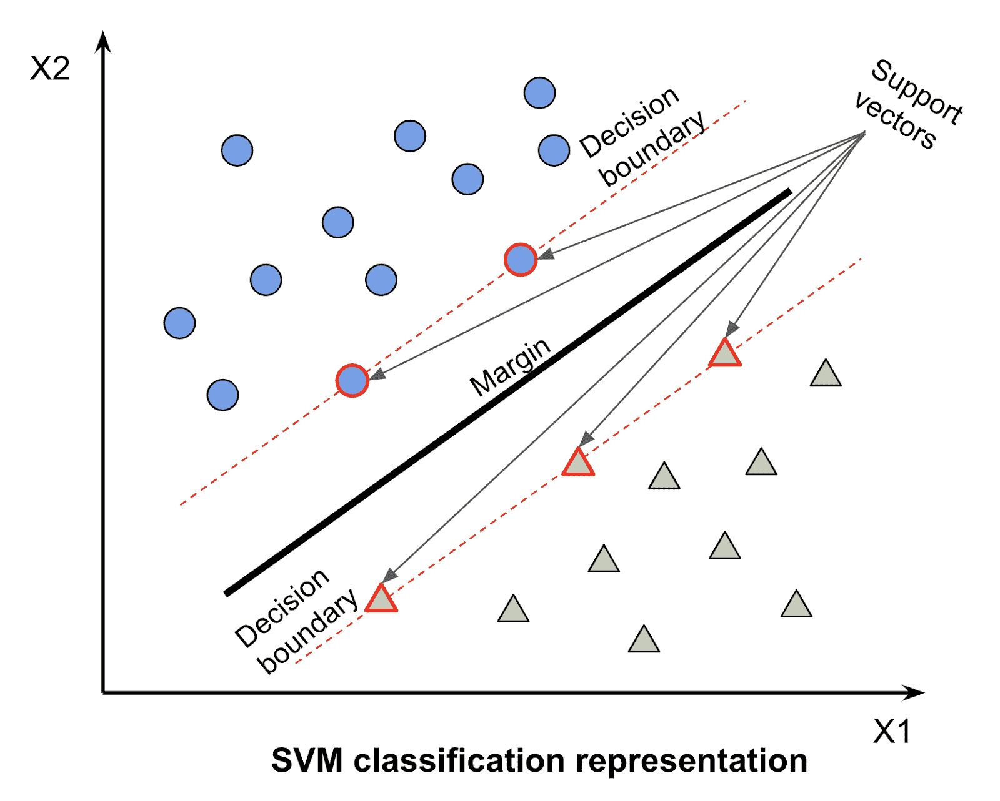
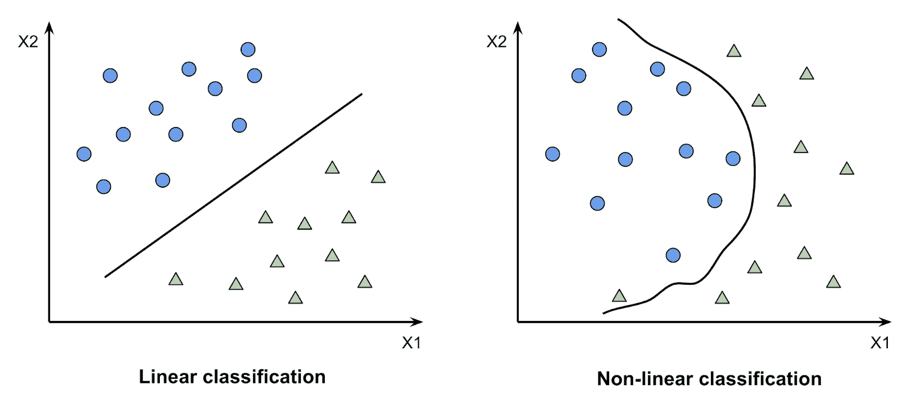

# 基于 LIBSVM 的多类分类

> 原文：<https://blog.paperspace.com/multi-class-classification-using-libsvm/>

**简介**

你有没有想过训练一个机器学习(ML)模型，将数据分成多个类别？例如，根据流派对电影进行分类，或者根据品牌名称对汽车进行分类。在本文中，我将介绍如何训练这样一个模型，使用称为支持向量机的监督 ML 算法将数据分类到多个类别中。

你可能会想，什么是支持向量机？

支持向量机(SVM)是一种受监督的机器学习算法，它使用核函数来创建由边距分隔的不同数据点组。它基于支持向量，支持向量是靠近页边的数据点，影响该页边的位置以及页边周围其他数据点的位置。如果有多个类，则可能有多个余量，但是如果向量只被分成两组，则只有一个余量。

本文将从引言部分开始讨论更多关于分类的内容，更具体地说是多类分类问题。然后，我将解释一般的 SVM 算法，然后重点介绍演示代码中使用的特定 SVM 包。在代码部分之后，我将分享一些额外的技巧，以帮助提高您的模型的性能，以及算法的一些假设和限制。最后，我将结束这篇文章，然后你可以自己去尝试一下！

**什么是分类？**

分类是一种将结果分组到类别标签下的问题。输入数据被给定，并且这些输入特征组合以产生作为输出的标签预测。分类问题通常用监督机器算法来解决。监督机器学习算法要么解决回归问题，要么解决分类问题。回归是预测一个数字或一个连续值作为结果，而分类给出一个标签或一个离散值作为结果。

在分类问题中，我们使用两种类型的算法(取决于它创建的输出类型):

*   类输出算法:像 SVM 和 KNN 这样的算法创建一个类输出。例如，在二进制分类问题中，输出将是 0 或 1。
*   概率输出算法:像逻辑回归、随机森林、梯度增强、Adaboost 等算法。给出概率输出。通过创建阈值概率，可以将概率输出转换为类输出。如果该概率输出小于阈值(例如，0.5)，则它被赋予预测值 0，如果原始输出值大于阈值，则预测值为 1。

分类问题可以是二元分类，也可以是多类分类。顾名思义，二进制分类就是只有两种可能的类别作为标签。相比之下，多类分类有多个标签(尽可能多)作为可能的结果。一些例子是如何将棋子的颜色分类为黑色或白色(二元分类)，而将棋子的类型分类为国王、王后、骑士、主教、车或卒。

在本文中，我将使用 SVM 解决一个多类分类问题。

**关于 SVM**

SVM，意为支持向量机，是一种有监督的机器学习算法。为什么叫被监督？这是因为该算法为这些数据点中的每一个接受训练特征和正确的标签，训练这些数据，然后尝试在看不见的数据上准确预测正确的标签。这种看不见的数据也称为测试数据。它是模型不在其上训练的数据集的子集，并且用于评估 ML 模型的性能。

SVM 是一种用于解决分类问题的算法。虽然不太常见，但它也可以用来解决回归和异常值问题。在 SVM 算法中，应用核函数进行精确预测。核函数是一种特殊的数学函数，它将数据作为输入，并将其转换为所需的形式。这种数据转换基于一种叫做内核技巧的东西，这就是内核函数的名字。使用核函数，我们可以将不可线性分离的数据(不能使用直线分离)转换为可线性分离的数据。

对于二进制分类，当从核函数得到的原始输出> = 0 时，算法预测 1，否则预测 0。但是，这样做的成本计算是，如果实际值为 1，而模型预测> = 1，则根本没有成本。但是如果预测值< 1, the cost increases as the value of the raw output from the model decreases. You may be wondering, if the raw output > = 0 预测为 1，为什么成本从 1 及以下开始增加，而不是从 0 开始增加？这是因为 SVM 惩罚不正确的预测和接近决策边界的预测。实际值为 1 时，判定边界是 0 和 1 之间的值，包括 0 和 1。正好落在边缘和决策边界上的值称为支持向量。



在 SVM，有四种类型的内核函数:

*   线性核
*   多项式核
*   径向基核
*   Sigmoid 内核

SVM 的目标职能:

*   铰链损耗:损耗函数测量预测和实际标签之间的误差。这是一种从训练数据到看不见的数据来衡量模型性能的方法。铰链损失是用于 SVM 的损失函数。
*   SVM 成本函数:成本函数是对多个数据点求和的目标函数。例如，它可以是训练集上损失函数的总和。

为什么是 SVM？

最后一节详细解释了 SVM 算法。但是，您可能仍然想知道为什么要在下一个多分类问题中使用这个算法。以下是使用 SVM 训练模型的一些优势:

*   训练 SVM 所需的观察次数并不多，因此需要的训练数据较少。
*   SVM 可以处理线性和非线性决策边界。它也是参数化的，大多数时候具有很高的精度。
*   在高维数据中表现良好。即数据集中要素的数量接近或大于观测值的数据。



**使用支持向量机的假设**

支持向量机的一些有助于良好性能的假设是:

1.  数据集是独立的，并且相同地分布在各个类中。这意味着每个类别中的数据点之间有明显的区别。
2.  数据没有太多的噪音和异常值。

**LIBSVM**

一个流行的 SVM 包是 LIBSVM 包。 [LIBSVM](https://www.csie.ntu.edu.tw/~cjlin/libsvm/) 是支持向量机分类、回归和多类分类的集成包。在下面的笔记本中，我将使用 LIBSVM 为 [UCI 葡萄酒数据集构建一个分类器模型。](http://archive.ics.uci.edu/ml/datasets/Wine) LIBSVM 构建在 C++和 Java 源代码上，但也有许多其他语言的接口，如 Python、MATLAB、R、Haskell、Perl、PHP 等。

我将在 Jupyter 笔记本中使用 Python 接口；通过从 [GitHub](https://github.com/cjlin1/libsvm) 克隆它并构建包来导入它。

**LIBSVM 的参数**

1.  **SVM 类型** : LIBSVM 支持支持向量分类(SVC)问题，二元和多类，例如 C-SVC 和 nu-SVC，支持向量回归(SVR)问题，例如 epsilon-SVR 和 nu-SVR，以及单类 SVM。
    *   代表成本的 c 是一个正则化参数。它是为 C-SVC、epsilon-SVR 和 nu-SVR SVM 设置的。它应该总是正数，默认值为 1.0
    *   Nu 是用于控制支持向量数量的参数。它通过设置误差分数的上限和支持向量分数的下限来实现这一点。默认值为 0.5，并且应该始终在区间[0，1]内
2.  **内核类型**:可以通过 LIBSVM 应用的不同类型的内核有线性、多项式、径向基函数(RBF)和 sigmoid 内核。一般来说，使用 SVM 时，RBF 核是合理的首选。这是因为它是一个非线性内核，所以它可以处理类标签和属性之间的关系不是线性的情况。
3.  **其他超参数**:其中一些包括伽玛、次数和核函数的系数等。这些的完整列表可以在[官方文件中找到。](https://www.csie.ntu.edu.tw/~cjlin/libsvm/)

**如何使用 LIBSVM 分八步将数据分类为多个类:**

1.  **获取数据，进行 EDA，了解数据集**:读取数据集，进行探索性数据分析，了解数据集中的数据。在这个演示中，我将使用 UCI 葡萄酒数据集。这是一个包含 178 条记录和 13 个要素的多类分类数据集。数据集中有三类葡萄酒作为标签。目的是利用化学分析来确定葡萄酒的原产地。链接到笔记本单元格:

```py
# Data from http://archive.ics.uci.edu/ml/datasets/Wine
!git clone https://gist.github.com/tijptjik/9408623

# Read in as a dataframe for EDA
wine_df = pd.read_csv('9408623/wine.csv')
print(wine_df.head())
print(wine_df.describe())
print(wine_df.columns)
print(wine_df.dtypes)

# Read in data as an array to begin analysis. Drop header row as it is # not needed for svm classification.
wine_data = np.genfromtxt('9408623/wine.csv', delimiter=',')
wine_data = wine_data[1:] 

print(wine_data[0]) 
```

2.  **数据预处理，准备 LIBSVM 格式**:
    1.  SVM 数据只接受数字数据。如果您有分类数据，如文本、日期或时间，您必须将它们转换成数值。
    2.  此外，SVM 在处理大范围数据时表现不佳。对于一个性能良好的模型，你必须调整你的数据。LIBSVM 的好处是有一个可执行文件来缩放数据。我将在第 4 步中详细讨论这一点。
    3.  解析数据时，请确保没有尾随的新行(' \n ')，因为这可能会在缩放和定型时导致错误。
    4.  最后，对于数据集中的每一行，LIBSVM 的格式是 label index:feature…
        label 1:feature 1 _ value 2:feature 2 _ value 3:feature 3 _ value
        等等。一个例子是:
        2 1: 0.22 2: 0.45 …
        其中 2 是标签，而 1，2，…...用相应的值描述要素的索引。
    5.  标签和索引的数据类型是整数，而特征值可以是整数或浮点数。
    6.  在您的数据集中，即使在标签后面作为注释，也不应该有冒号(:)。这是因为模型将冒号作为一个特征，因此，它将抛出一个错误，因为它不是。唯一允许的冒号位于索引和该索引的特征值之间。

```py
# Adding count, beginning from 1, to features for each row

with_features_index = []
data_with_features_index = []

for j in range(len(wine_data)):
    each_row = wine_data[j,0:]

    with_features_index.append(each_row[0])

    for l in range(1,14):
        with_features_index.append(str(l)+ ":" + str(each_row[l]))

    data_with_features_index.append(with_features_index)  
    with_features_index = [] 
```

3.  **将数据分割成训练和测试数据集**:现在我们已经读取了数据，探索了数据以更好地理解它，进行了预处理，并将其重新格式化为 LIBSVM 格式，下一步是将数据集分割成训练和测试数据集。因为我将执行交叉验证，所以我选择了 0.33 的测试大小，以允许更大的训练数据集。

```py
# Split into train and test datasets
train_data, test_data = train_test_split(data_with_features_index, test_size=0.33, random_state=42)

# Convert to Numpy array
train_data = np.asarray(train_data)
test_data = np.asarray(test_data)

# Get y_label from test data to compare against model result later
y_label = np.array(test_data[:,0], dtype=np.float32)
y_label

# Save train and test data to files
np.savetxt('wine_svm_train_data', train_data, delimiter=" ", fmt="%s") 
np.savetxt('wine_svm_test_data', test_data, delimiter=" ", fmt="%s") 
```

4.  **缩放数据**:如第 2 步所述，您希望在构建 SVM 模型时缩放数据。这是因为 SVM 是一种基于测量数据点相距多远并对其进行分类的算法。另一个类似的算法是 k-最近邻(KNN)。缩放还有助于避免较大数值范围内的属性支配较小数值范围内的属性。缩放数据时，应对训练数据集和测试数据集使用相同的缩放范围文本。因此，当您缩放训练数据集时，您保存训练数据的范围文本，然后加载范围文本并使用它来缩放测试数据。这是为了使两个数据集以完全相同的方式缩放。我把数据换算成[-1，1]。这些值在 svm-scale 命令中作为-l 和-u 参数传递，l 表示下限，u 表示上限。使用我们正在使用的 RBF 内核，在[0，1]和[-1，1]之间缩放数据执行相同的操作，因此您可以使用您喜欢的任何一个。然而，即使性能相同，计算时间也可能不同，所以这是可以试验的。如果有许多零条目，与[-1，1]相反，缩放[0，1]可以保持数据的稀疏性，并可以减少计算时间。

5.  **进行交叉验证**:我使用了 LIBSVM grid.py 脚本来处理交叉验证。交叉验证是将训练数据子集化为 k 个验证数据集以找到模型的正确超参数的过程。我将交叉验证的折叠次数设置为 5 次。这是通过 grid.py 命令中的-v 参数设置的。Grid.py 还具有使用 gnuplot 为交叉验证的每组超参数绘制精确度等值线的功能。然而，由于 gnuplot 在不同系统上的安装和访问障碍，我没有使用它。这是为了保持笔记本的再现性。但是，如果您想尝试一下，您可以在笔记本上查看这个关于如何获取 gnuplot 的资源库，然后用 gnuplot 可执行文件的路径替换 grid.py 命令中的“null”值。我调整的超参数是 [C 和 g 参数](https://scikit-learn.org/stable/auto_examples/svm/plot_rbf_parameters.html#:~:text=The%20gamma%20parameters%20can%20be,of%20the%20decision%20function's%20margin.):

    *   C: (cost) - C 是在 C-SVC 中防止过拟合和控制边界误差的正则化参数。默认值为 1。较低的 C 值给出了更简单的决策函数，代价是训练精度。这允许在决策边界中有更多的值；与给出较窄决策边界的较高 C 值相反。
    *   g: (gamma) -在内核函数中设置 gamma(默认为 1/num_features)。较低的 g 值给出了不能完全捕捉数据集的全部复杂性的受限模型。这很容易导致较高的方差和过度拟合，尽管 C 是管理这种情况的正则化参数。
6.  **训练模型**:交叉验证后，我用得到的最好的超参数训练模型。这个模型被保存到一个模型文件中，该文件被加载以对测试数据(看不见的数据)进行预测。这是通过从 LIBSVM 包中调用 svm-train 可执行文件来完成的。我将缩放、训练和测试过程耦合到一个函数中。因此，您可以通过调用 svm_model 函数来执行这些步骤，使用步骤 3 中的训练和测试数据集的文件名作为参数。

```py
# Function to scale, train, and test model

def svm_model(train_pathname, test_pathname):

  # Validate that train and test files exist
  assert os.path.exists(train_pathname),"training file not found"
  file_name = os.path.split(train_pathname)[1]

  # Create files to store scaled train data, range metadata for scaled data, and trained model
  scaled_file = file_name + ".scale"
  model_file = file_name + ".model"
  range_file = file_name + ".range" # store scale range for train data to be used to scale test data

  file_name = os.path.split(test_pathname)[1]
  assert os.path.exists(test_pathname),"testing file not found"

  # Create file for scaled test data and predicted output
  scaled_test_file = file_name + ".scale"
  predict_test_file = file_name + ".predict"

  # Scaling by range [-1, 1]
  cmd = '{0} -l {4} -u {5} -s "{1}" "{2}" > "{3}"'.format(svmscale_exe, range_file, train_pathname, scaled_file, -1, 1)
  print('Scaling train data')
  Popen(cmd, shell = True, stdout = PIPE).communicate()

  # Tuning c and g hyperparameters using a 5-fold grid search
  cmd = '{0} -v {4} -svmtrain "{1}" -gnuplot "{2}" "{3}"'.format(grid_py, svmtrain_exe, "null", scaled_file, 5)
  print('Cross validation')
  f = Popen(cmd, shell = True, stdout = PIPE).stdout

  line = ''
  while True:
      last_line = line
      line = f.readline()
      if not line: break
  c,g,rate = map(float,last_line.split())

  print('Best c={0}, g={1} CV rate={2}'.format(c,g,rate))

  cmd = '{0} -c {1} -g {2} "{3}" "{4}"'.format(svmtrain_exe,c,g,scaled_file,model_file)
  print('Training model')
  Popen(cmd, shell = True, stdout = PIPE).communicate()

  print('Output model: {0}'.format(model_file))

  cmd = '{0} -l {4} -u {5} -r "{1}" "{2}" > "{3}"'.format(svmscale_exe, range_file, test_pathname, scaled_test_file, -1, 1)
  print('Scaling test data')
  Popen(cmd, shell = True, stdout = PIPE).communicate()

  cmd = '{0} "{1}" "{2}" "{3}"'.format(svmpredict_exe, scaled_test_file, model_file, predict_test_file)
  print('Testing model\n')
  f = Popen(cmd, shell = True, stdout = PIPE).stdout
  result = (str(f.readline()).replace("\\n'", '')).replace("b'", '')
  print("{} \n".format(result))

  print('Output prediction: {0}'.format(predict_test_file)) 
```

7.  **在测试数据上测试模型**:为了测试模型，使用保存的模型、c 和 g 的最佳超参数值以及缩放的测试数据调用 svm-predict 可执行命令。其输出存储在预测文件中，是测试数据集中每一行的预测类的数组。对于这个问题，我将使用准确性作为性能的衡量标准。由于问题的性质、葡萄酒产地的分类以及不同类别的计数不会不平衡，因此准确性是衡量该演示性能的一个很好的标准。然而，如果你的类不平衡，准确性可能不是最好的度量。此外，对于某些问题，精确度、召回率或新颖性，或者其他一些度量标准可以更好地洞察该问题的模型性能，所以不要觉得有义务总是使用精确度。该模型的测试准确率为 98.3051%，数据集中 59 个数据点中的 58 个数据点被正确分类。这是如此出色的性能，我决定不对模型或超参数做进一步的调整。

```py
svm_model(wine_svm_data_train_file, wine_svm_data_test_file) 
```

8.  **评估模型的性能**:为了评估模型，我测试了在看不见的(测试)数据上用最佳超参数训练的模型，并使用 scikit-learn 绘制混淆矩阵。从混淆矩阵来看，一个错误的分类是在第二类。

```py
def evaluate_model(y_label, predict_test_file):

  # Creating the y_label for the confusion matrix
  f=open(predict_test_file,'r')
  y_pred = np.genfromtxt(f,dtype = 'float')

  # Confusion matrix
  cf_matrix = confusion_matrix(y_label, y_pred)

  # Plot heatmap
  ax = sns.heatmap(cf_matrix/np.sum(cf_matrix), annot=True, 
          fmt='.2%', cmap='Blues')

  # Format plot
  ax.set_title('Seaborn Confusion Matrix with wine class labels\n\n');
  ax.set_xlabel('\nPredicted action')
  ax.set_ylabel('Actual action ');

  # Ticket labels - List must be in alphabetical order
  ax.xaxis.set_ticklabels(['1', '2', '3'])
  ax.yaxis.set_ticklabels(['1', '2', '3'])

  # Display the visualization of the Confusion Matrix.
  plt.show() 
```

```py
evaluate_model(y_label, 'wine_svm_test_data.predict') 
```

**限制**

SVM，尤其是 LIBSVM，作为用于分类的机器学习算法有一些限制。在这一节中，我将提到其中的一些，以便您在考虑这种算法来满足您的分类需求时能够意识到并记住这些。

1.  需要输入数据的唯一格式，并针对每个要素进行标注。
2.  由于它在高维空间中的使用，它容易过拟合。您可以通过选择合适的核函数并设置正则化参数来避免这种情况。
3.  对于大型数据集，所涉及的交叉验证技术的计算成本很高。
4.  为了获得最佳结果，必须对数据进行缩放，并且在一个接近的范围内。
5.  对于观察值的分类，没有概率上的解释。

**结论**

我们刚刚使用 LIBSVM 完成了多类分类。SVM 是一种很好的分类机器学习算法，因为它不需要非常大的训练数据集，可以处理许多特征，并且可以处理线性和非线性边界。LIBSVM 是一个很好的 SVM 包，特别是对于初学者来说，因为大部分调整都是为您抽象的，但仍然可以产生非常高的性能。希望通过这篇文章，您已经能够使用 SVM 将数据分类到多个类中。请在此处找到使用过的完整笔记本[。](https://colab.research.google.com/drive/1Skp1-XjgdkBpkGIBE4wmsX_AIsblF1W6#scrollTo=V0jiyPeQTau-)

感谢您的阅读。

**参考文献**

1.  张志忠，林志仁，LIBSVM:支持向量机的资料库。ACM 智能系统与技术汇刊，2:27:1 - 27:27，2011。软件在[http://www.csie.ntu.edu.tw/~cjlin/libsvm](http://www.csie.ntu.edu.tw/~cjlin/libsvm)可用
2.  [https://www.csie.ntu.edu.tw/~cjlin/papers/guide/guide.pdf](https://www.csie.ntu.edu.tw/~cjlin/papers/guide/guide.pdf)
3.  [https://www . csie . NTU . edu . tw/~ cjlin/libsvm/FAQ . html](https://www.csie.ntu.edu.tw/~cjlin/libsvm/faq.html)
4.  Dua d .和 Graff c .(2019 年)。http://archive.ics.uci.edu/ml 的 UCI 机器学习知识库。加州欧文:加州大学信息与计算机科学学院。
5.  [https://www.csie.ntu.edu.tw/~cjlin/papers/libsvm.pdf](https://www.csie.ntu.edu.tw/~cjlin/papers/libsvm.pdf)