# 卷积神经网络中的批量归一化

> 原文：<https://blog.paperspace.com/batch-normalization-in-convolutional-neural-networks/>

批量标准化是在卷积神经网络的上下文中经常提到的术语。在本文中，我们将探讨它实际需要什么，以及它对卷积神经网络的性能或整体行为的影响(如果有的话)。

```py
import torch
import torch.nn as nn
import torch.nn.functional as F
import torchvision
import torchvision.transforms as transforms
import torchvision.datasets as Datasets
from torch.utils.data import Dataset, DataLoader
import numpy as np
import matplotlib.pyplot as plt
import cv2
from tqdm.notebook import tqdm
import seaborn as sns
from torchvision.utils import make_grid
```

```py
if torch.cuda.is_available():
  device = torch.device('cuda:0')
  print('Running on the GPU')
else:
  device = torch.device('cpu')
  print('Running on the CPU')
```

### 术语标准化

统计学中的规范化是指将数据或一组值限制在 0 和 1 之间的过程。更不方便的是，在某些方面，标准化也指的是将数据分布的平均值设置为零，将其标准偏差设置为 1 的过程。

在实际意义上，将分布的平均值设置为 0，将其标准差设置为 1 的过程称为标准化。然而，由于某些自由，它也被称为标准化或 z 分数标准化。了解这种区别并牢记在心是很重要的。

### 数据预处理

数据预处理是指在将数据输入机器学习或深度学习算法之前，准备数据所采取的步骤。前面提到的两个过程(规范化和标准化)是数据预处理步骤。

#### 最小-最大归一化

最小-最大归一化是归一化数据最常用的方法之一。顾名思义，它将数据集中的最小值设置为 0，最大值设置为 1，从而将数据点限制在 0 和 1 的范围内，并相应地缩放两者之间的所有值。下面的等式提供了最小-最大归一化过程的数学描述。本质上，它包括从每个数据点中减去数据集中的最小值，然后除以范围(最大值-最小值)。

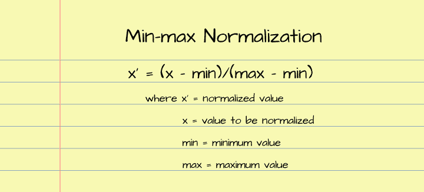

使用下面的函数，我们可以复制最小-最大归一化的过程。利用这个功能，我们可以对幕后实际发生的事情有一种直觉。

```py
def min_max_normalize(data_points: np.array):
  """
  This function normalizes data by constraining
  data points between the range of 0 & 1  
  """
  #  convert list to numpy array
  if type(data_points) == list:
    data_points = np.array(data_points)
  else:
    pass

  #  create a list to hold normalized data  
  normalized = []

  #  derive minimum and maximum values
  minimum = data_points.min()
  maximum = data_points.max()

  #  convert to list for iteration
  data_points = list(data_points)
  #  normalizing data
  for value in data_points:
    normalize = (value-minimum)/(maximum-minimum)
    normalized.append(round(normalize, 2))

  return np.array(normalized)
```

让我们使用 NumPy 创建一个随机值数组，然后尝试使用上面定义的最小-最大归一化函数来归一化它们。

```py
#  creating a random set of data points
data = np.random.rand(50)*20

#  normalizing data points
normalized = min_max_normalize(data)
```

从下面的图中可以看出，在标准化之前，值的范围是从 0 到 20，绝大多数数据点的值在 5 到 10 之间。然而，在归一化之后，可以看出，现在值的范围在 0 和 1 之间，绝大多数数据点的值在 0.25 和 0.5 之间。*注意:如果/当您运行这段代码时，数据分布将与本文中使用的不同，因为它是随机生成的。*

```py
#  visualising distribution
figure, axes = plt.subplots(1, 2, sharey=True, dpi=100)
sns.histplot(data, ax=axes[0])
axes[0].set_title('unnormalized')
sns.histplot(normalized, ax=axes[1])
axes[1].set_title('min-max normalized')
```

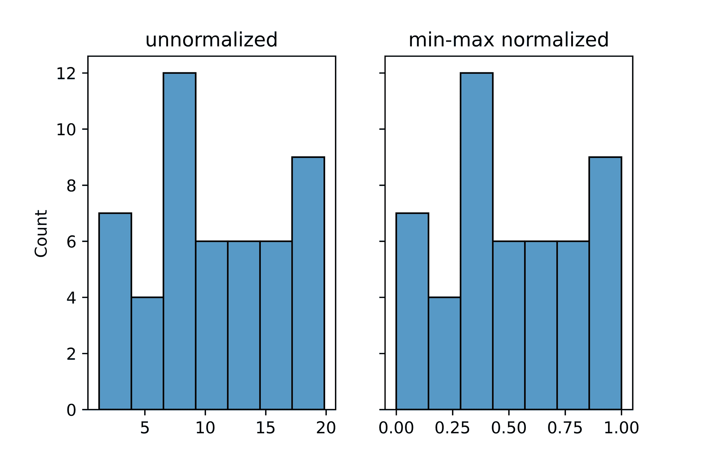

#### z 分数标准化

z 得分标准化也称为标准化，是将数据分布的平均值和标准差分别设置为 0 和 1 的过程。下面的等式是控制 z 得分归一化的数学等式，它涉及在除以分布的标准差之前，从要归一化的值中减去分布的平均值。

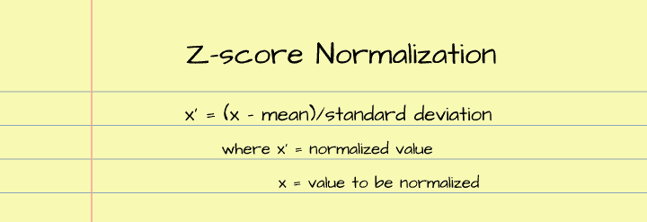

下面定义的函数复制了 z 分数归一化过程，使用该函数我们可以更仔细地了解它实际需要什么。

```py
def z_score_normalize(data_points: np.array):
  """
  This function normalizes data by computing
  their z-scores  
  """
  #  convert list to numpy array
  if type(data_points) == list:
    data_points = np.array(data_points)
  else:
    pass

  #  create a list to hold normalized data
  normalized = []

  #  derive mean and and standard deviation
  mean = data_points.mean()
  std = data_points.std()

  #  convert to list for iteration
  data_points = list(data_points)
  #  normalizing data
  for value in data_points:
    normalize = (value-mean)/std
    normalized.append(round(normalize, 2))

  return np.array(normalized)
```

使用上一节中生成的数据分布，让我们尝试使用 z 得分函数来归一化数据点。

```py
#  normalizing data points
z_normalized = z_score_normalize(data)

#  check the mean value
z_normalized.mean()
>>>> -0.0006

#  check the standard deviation
z_normalized.std()
>>>> 1.0000
```

同样，从可视化结果中，我们可以看到原始分布的值范围为 0 到 20，而 z 分数归一化值现在集中在 0(零的平均值)周围，范围大约为-1.5 到 1.5，这是一个更易于管理的范围。

```py
#  visualizing distributions
figure, axes = plt.subplots(1, 2, sharey=True, dpi=100)
sns.histplot(data, ax=axes[0])
axes[0].set_title('unnormalized')
sns.histplot(z_normalized, ax=axes[1])
axes[1].set_title('z-score normalized')
```

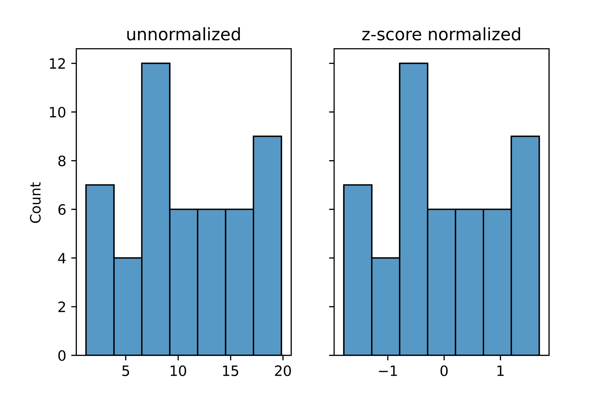

#### 预处理的原因

当考虑机器学习中的数据时，我们将单个数据点视为特征。所有这些特征通常不在相同的比例尺度上。例如，考虑一个有三个卧室和一个 400 平方英尺的客厅的房子。这两个特征在尺度上相距如此之远，以至于如果它们被输入到预定通过梯度下降来优化的机器学习算法中。优化将是相当乏味的，因为具有较大规模的特征将优先于所有其他特征。为了简化优化过程，最好让所有数据点都在相同的范围内。

### 卷积层中的标准化

图像中的数据点是它的像素。像素值的范围通常从 0 到 255；这就是为什么在将图像输入卷积神经网络之前，以某种方式将它们标准化是一个好主意，以便将所有像素置于一个可管理的范围内。

即使做到了这一点，在训练 convnet 时，权重(其过滤器中的元素)可能会变得太大，从而产生像素分布范围很广的特征地图。这实质上使得在预处理步骤中进行的标准化有些无效。此外，这可能会妨碍优化过程，使其变得缓慢，或者在极端情况下，可能会导致称为不稳定梯度的问题，这可能会从根本上阻止 convnet 进一步优化其权重。

为了防止这个问题，在修道院的每一层都引入了规范化。这种归一化称为 ***批量归一化*** 。

### 批量标准化的过程

批量归一化实质上是将卷积图层中所有要素地图的像素设置为新的平均值和新的标准差。通常，它从标准化所有像素的 z 分数开始，然后在添加另一个任意参数*β(偏移)*之前，继续将标准化的值乘以任意参数*α(缩放)*。

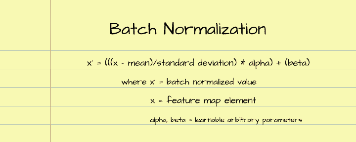

这两个参数α和β是可学习的参数，convnet 将使用它们来确保特征图中的像素值在可管理的范围内，从而改善不稳定梯度的问题。

### 批量标准化正在进行中

为了真正评估卷积层中批量归一化的效果，我们需要对两个卷积进行基准测试，一个不进行批量归一化，另一个进行批量归一化。为此，我们将使用 LeNet-5 架构和 MNIST 数据集。

#### 数据集和卷积神经网络类

在本文中，如前所述，MNIST 数据集将用于基准测试。该数据集由 28×28 像素的手写数字图像组成，其范围从数字 0 到数字 9，并被相应地标记。

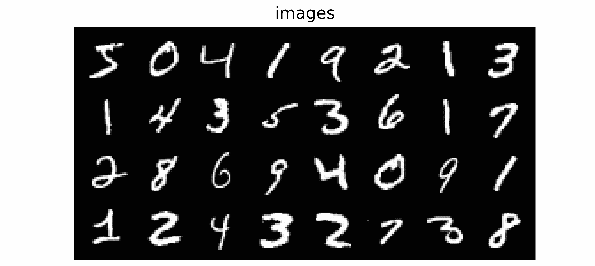

Sample images from the MNIST dataset.

可以使用下面的代码块将它加载到 PyTorch 中。训练集由 60，000 幅图像组成，而验证集由 10，000 幅图像组成。由于我们将在 LeNet-5 中使用该数据集，因此需要将图像的大小调整为 32 x 32 像素，如 transforms 参数中所定义的。

```py
#  loading training data
training_set = Datasets.MNIST(root='./', download=True,
                              transform=transforms.Compose([transforms.ToTensor(),
                                                            transforms.Resize((32, 32))]))

#  loading validation data
validation_set = Datasets.MNIST(root='./', download=True, train=False,
                                transform=transforms.Compose([transforms.ToTensor(),
                                                              transforms.Resize((32, 32))]))
```

为了训练和利用我们的 convnets，我们将使用下面的类，恰当地命名为“ConvolutionalNeuralNet()”。此类包含的方法将有助于使用经过训练的 convnet 对实例进行训练和分类。train()方法还包含内部辅助函数，如 init_weights()和 accuracy。

```py
class ConvolutionalNeuralNet():
  def __init__(self, network):
    self.network = network.to(device)
    self.optimizer = torch.optim.Adam(self.network.parameters(), lr=1e-3)

  def train(self, loss_function, epochs, batch_size, 
            training_set, validation_set):

    #  creating log
    log_dict = {
        'training_loss_per_batch': [],
        'validation_loss_per_batch': [],
        'training_accuracy_per_epoch': [],
        'validation_accuracy_per_epoch': []
    } 

    #  defining weight initialization function
    def init_weights(module):
      if isinstance(module, nn.Conv2d):
        torch.nn.init.xavier_uniform_(module.weight)
        module.bias.data.fill_(0.01)
      elif isinstance(module, nn.Linear):
        torch.nn.init.xavier_uniform_(module.weight)
        module.bias.data.fill_(0.01)

    #  defining accuracy function
    def accuracy(network, dataloader):
      network.eval()
      total_correct = 0
      total_instances = 0
      for images, labels in tqdm(dataloader):
        images, labels = images.to(device), labels.to(device)
        predictions = torch.argmax(network(images), dim=1)
        correct_predictions = sum(predictions==labels).item()
        total_correct+=correct_predictions
        total_instances+=len(images)
      return round(total_correct/total_instances, 3)

    #  initializing network weights
    self.network.apply(init_weights)

    #  creating dataloaders
    train_loader = DataLoader(training_set, batch_size)
    val_loader = DataLoader(validation_set, batch_size)

    #  setting convnet to training mode
    self.network.train()

    for epoch in range(epochs):
      print(f'Epoch {epoch+1}/{epochs}')
      train_losses = []

      #  training
      print('training...')
      for images, labels in tqdm(train_loader):
        #  sending data to device
        images, labels = images.to(device), labels.to(device)
        #  resetting gradients
        self.optimizer.zero_grad()
        #  making predictions
        predictions = self.network(images)
        #  computing loss
        loss = loss_function(predictions, labels)
        log_dict['training_loss_per_batch'].append(loss.item())
        train_losses.append(loss.item())
        #  computing gradients
        loss.backward()
        #  updating weights
        self.optimizer.step()
      with torch.no_grad():
        print('deriving training accuracy...')
        #  computing training accuracy
        train_accuracy = accuracy(self.network, train_loader)
        log_dict['training_accuracy_per_epoch'].append(train_accuracy)

      #  validation
      print('validating...')
      val_losses = []

      #  setting convnet to evaluation mode
      self.network.eval()

      with torch.no_grad():
        for images, labels in tqdm(val_loader):
          #  sending data to device
          images, labels = images.to(device), labels.to(device)
          #  making predictions
          predictions = self.network(images)
          #  computing loss
          val_loss = loss_function(predictions, labels)
          log_dict['validation_loss_per_batch'].append(val_loss.item())
          val_losses.append(val_loss.item())
        #  computing accuracy
        print('deriving validation accuracy...')
        val_accuracy = accuracy(self.network, val_loader)
        log_dict['validation_accuracy_per_epoch'].append(val_accuracy)

      train_losses = np.array(train_losses).mean()
      val_losses = np.array(val_losses).mean()

      print(f'training_loss: {round(train_losses, 4)}  training_accuracy: '+
      f'{train_accuracy}  validation_loss: {round(val_losses, 4)} '+  
      f'validation_accuracy: {val_accuracy}\n')

    return log_dict

  def predict(self, x):
    return self.network(x)
```

#### Lenet-5

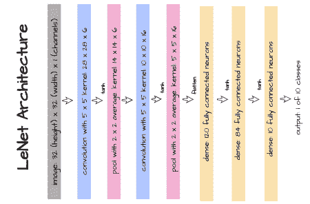

LeNet-5 ( [Y. Lecun *等人*](http://yann.lecun.com/exdb/publis/pdf/lecun-01a.pdf) )是最早的卷积神经网络之一，专门设计用于识别/分类手写数字的图像。上图描述了它的架构，下面的代码块提供了它在 PyTorch 中的实现。

```py
class LeNet5(nn.Module):
  def __init__(self):
    super().__init__()
    self.conv1 = nn.Conv2d(1, 6, 5)
    self.pool1 = nn.AvgPool2d(2)
    self.conv2 = nn.Conv2d(6, 16, 5)
    self.pool2 = nn.AvgPool2d(2)
    self.linear1 = nn.Linear(5*5*16, 120)
    self.linear2 = nn.Linear(120, 84)
    self.linear3 = nn. Linear(84, 10)

  def forward(self, x):
    x = x.view(-1, 1, 32, 32)

    #----------
    # LAYER 1
    #----------
    output_1 = self.conv1(x)
    output_1 = torch.tanh(output_1)
    output_1 = self.pool1(output_1)

    #----------
    # LAYER 2
    #----------
    output_2 = self.conv2(output_1)
    output_2 = torch.tanh(output_2)
    output_2 = self.pool2(output_2)

    #----------
    # FLATTEN
    #----------
    output_2 = output_2.view(-1, 5*5*16)

    #----------
    # LAYER 3
    #----------
    output_3 = self.linear1(output_2)
    output_3 = torch.tanh(output_3)

    #----------
    # LAYER 4
    #----------
    output_4 = self.linear2(output_3)
    output_4 = torch.tanh(output_4)

    #-------------
    # OUTPUT LAYER
    #-------------
    output_5 = self.linear3(output_4)
    return(F.softmax(output_5, dim=1))
```

使用上面定义的 LeNet-5 架构，我们将用代码块中看到的参数实例化 ConvolutionalNeuralNet 类的成员`model_1`。该模型将作为我们进行基准测试的基线。

```py
#  training model 1
model_1 = ConvolutionalNeuralNet(LeNet5())

log_dict_1 = model_1.train(nn.CrossEntropyLoss(), epochs=10, batch_size=64, 
                       training_set=training_set, validation_set=validation_set)
```

经过 10 个时期的训练，并从我们收到的度量日志中观察准确性，我们可以看到，在训练过程中，训练和验证准确性都有所提高。在我们的实验中，验证准确性在第一个时期后开始时约为 93%，然后在接下来的 9 次迭代中稳步增加，最终在第 10 个时期结束时略高于 98%。

```py
sns.lineplot(y=log_dict_1['training_accuracy_per_epoch'], x=range(len(log_dict_1['training_accuracy_per_epoch'])), label='training')

sns.lineplot(y=log_dict_1['validation_accuracy_per_epoch'], x=range(len(log_dict_1['validation_accuracy_per_epoch'])), label='validation')

plt.xlabel('epoch')
plt.ylabel('accuracy')
```

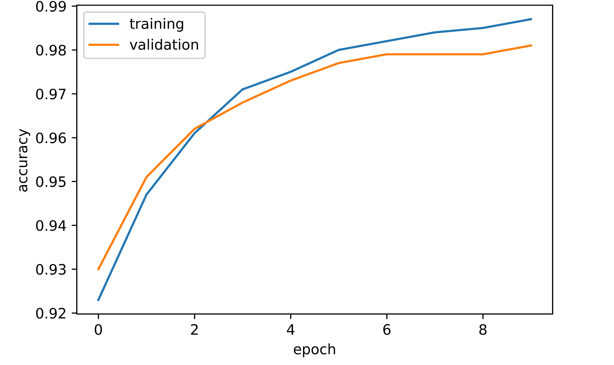

#### 批量标准化 LeNet-5

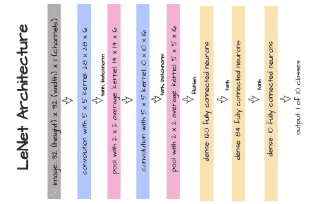

由于本文的主题是围绕卷积层中的批处理规范化，批处理规范仅应用于该架构中的两个卷积层，如上图所示。

```py
class LeNet5_BatchNorm(nn.Module):
  def __init__(self):
    super().__init__()
    self.conv1 = nn.Conv2d(1, 6, 5)
    self.batchnorm1 = nn.BatchNorm2d(6)
    self.pool1 = nn.AvgPool2d(2)
    self.conv2 = nn.Conv2d(6, 16, 5)
    self.batchnorm2 = nn.BatchNorm2d(16)
    self.pool2 = nn.AvgPool2d(2)
    self.linear1 = nn.Linear(5*5*16, 120)
    self.linear2 = nn.Linear(120, 84)
    self.linear3 = nn. Linear(84, 10)

  def forward(self, x):
    x = x.view(-1, 1, 32, 32)

    #----------
    # LAYER 1
    #----------
    output_1 = self.conv1(x)
    output_1 = torch.tanh(output_1)
    output_1 = self.batchnorm1(output_1)
    output_1 = self.pool1(output_1)

    #----------
    # LAYER 2
    #----------
    output_2 = self.conv2(output_1)
    output_2 = torch.tanh(output_2)
    output_2 = self.batchnorm2(output_2)
    output_2 = self.pool2(output_2)

    #----------
    # FLATTEN
    #----------
    output_2 = output_2.view(-1, 5*5*16)

    #----------
    # LAYER 3
    #----------
    output_3 = self.linear1(output_2)
    output_3 = torch.tanh(output_3)

    #----------
    # LAYER 4
    #----------
    output_4 = self.linear2(output_3)
    output_4 = torch.tanh(output_4)

    #-------------
    # OUTPUT LAYER
    #-------------
    output_5 = self.linear3(output_4)
    return(F.softmax(output_5, dim=1))
```

使用下面的代码段，我们可以实例化`model_2`,包括批处理规范化，并使用与 model_1 相同的参数开始训练。然后，我们得出准确度分数..

```py
#  training model 2
model_2 = ConvolutionalNeuralNet(LeNet5_BatchNorm())

log_dict_2 = model_2.train(nn.CrossEntropyLoss(), epochs=10, batch_size=64, 
                       training_set=training_set, validation_set=validation_set)
```

从图中可以清楚地看出，在训练过程中，训练和验证的准确性都有所提高，这与没有批量标准化的模型相似。第一个时期后的验证准确度略高于 95%，比同一时间点的`model_1 at`高 3 个百分点，然后逐渐增加，最终达到约 98.5%，比`model_1`高 0.5%。

```py
sns.lineplot(y=log_dict_2['training_accuracy_per_epoch'], x=range(len(log_dict_2['training_accuracy_per_epoch'])), label='training')

sns.lineplot(y=log_dict_2['validation_accuracy_per_epoch'], x=range(len(log_dict_2['validation_accuracy_per_epoch'])), label='validation')

plt.xlabel('epoch')
plt.ylabel('accuracy')
```

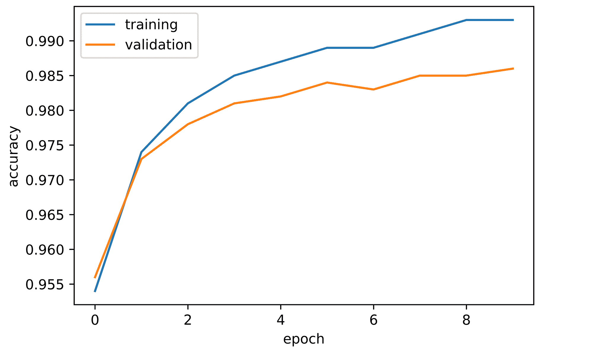

#### 比较模型

比较这两个模型，很明显，具有批量归一化卷积层的 LeNet-5 模型优于没有批量归一化卷积层的常规模型。因此，可以肯定地说，在这种情况下，批处理规范化有助于提高性能。

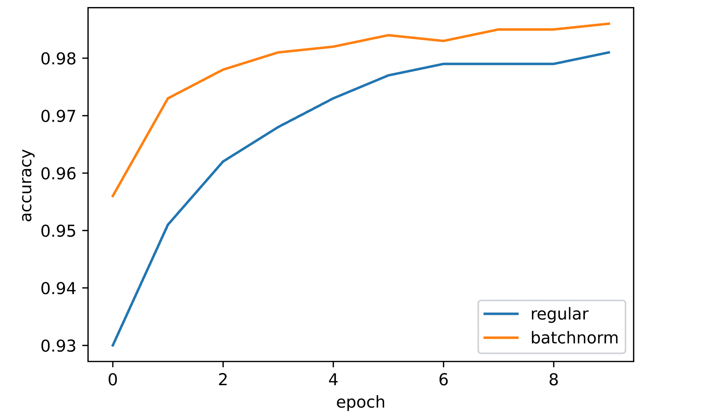

比较常规和批量标准化 LeNet-5 模型之间的训练和验证损失还表明，批量标准化模型比常规模型更快地获得更低的损失值。这是一个指向批处理规范化的指针，它提高了模型在正确方向上优化其权重的速率，换句话说，批处理规范化提高了 convnet 学习的速率。

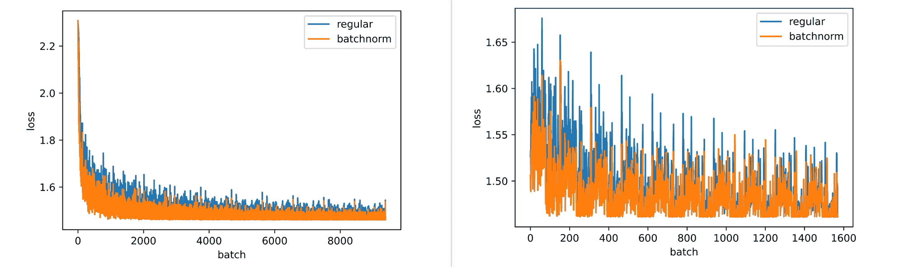

Training & validation losses.

### 结束语

在这篇文章中，我们探索了在机器学习/深度学习环境中规范化意味着什么。我们还探讨了作为数据预处理步骤的归一化过程，以及如何在预处理之外进行归一化，并通过批量归一化过程进入卷积层。

随后，我们在评估其效果之前检查了批处理规范化本身的过程，方法是在 MNIST 数据集上对 LeNet-5 convnets 的两个变体(一个没有批处理规范，另一个有批处理规范)进行基准测试。从结果中，我们推断批处理规范化有助于提高性能和权重优化速度。也有一些建议认为，它可以防止内部协变量的变化，但在这一点上还没有达成共识。