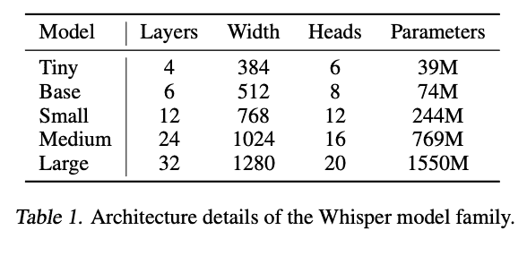
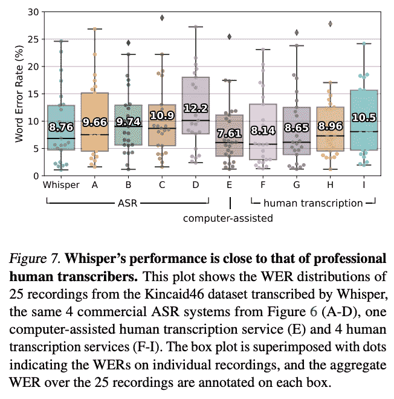

# 使用 Whisper AutoCaption 从任何语言生成自动视频字幕

> 原文：<https://blog.paperspace.com/automatic-video-subtitles-with-whisper-autocaption/>

我们最近报道了 [Whisper](https://github.com/openai/whisper) 的发布，这是一个来自 Open AI 的全新语音到文本转录模型。这个令人难以置信的模型带有许多有用的功能，包括多语言语音识别、转录和翻译。这扩展到包括在训练数据集中的 97 种语言，取得了不同程度的成功。

语音集成 NLP 的圣杯是能够以高精度实时将音频直接转录成单词。耳语代表了技术进化中的一个证据性步骤，证明了以相对较低的成本快速生成转录物是可能的。

在我们的[上一篇文章](https://blog.paperspace.com/whisper-openai-flask-application-deployment/)中，我们展示了如何在渐变笔记本中使用这个强大的工具，或者在一个简单的 Flask 界面中使用渐变部署来部署它。在本教程中，我们将扩展这项工作，将 Whisper 与 Flask 和 MoviePy 集成在一起，为任何视频自动生成英文字幕。

遵循本教程，深入了解如何使用 Whisper 进行开发，如何将 ML/DL 与 Flask 应用程序环境集成，以及如何在 Gradient Deployment 强大的 GPU 上将 ML/DL 应用程序部署到云中。

此代码可以在渐变笔记本和部署中运行。请务必尝试这两种方法！

## 耳语评论


[Source](https://cdn.openai.com/papers/whisper.pdf)

在各种语音处理任务上训练耳语变压器序列到序列模型。这些包括多语言语音识别、语音翻译、口语识别和语音活动检测。这些任务被表示为一系列标记，然后由解码器进行预测。

在功能上，这允许单个模型代替典型语音处理流水线的多个不同阶段。这种多任务训练形式使用一组特殊的标记作为任务说明符或分类目标，这赋予了游戏更多的多功能性。上图详细解释了这个过程。

为了实现这一目标，他们对对应于 680，000 小时音频的音频-语音对数据进行了训练。其中 117，000 小时的数据涵盖了除英语之外的 96 种语言。该数据集还包括 125，000 小时的各种语言到英语的翻译数据。这个庞大的训练数据集的结果使得 Whisper 在处理特殊的语言特征(如口音、行话或嘈杂的样本)时通常很健壮。



[Source](https://cdn.openai.com/papers/whisper.pdf)

这些型号有 9 种。这些参数的大小范围从 1550 万到 3900 万个参数，微型、基本型、小型和中型型号都有一个版本用于多语言和仅英语任务。纯英语任务在纯英语语言任务上有很大的改进，但随着模型规模的增加，这种差异变得更小。此外，就精度而言，大模型的性能最好，而小模型则对应着效率的大幅提高。



[Source](https://cdn.openai.com/papers/whisper.pdf)

综上所述，这些特性使得 Whisper 可以说是转录、翻译和语音识别/语言检测任务的最佳公开可用模型。这既适用于定量的机器分析，也适用于定性的人工任务。事实上，根据单词错误率来衡量，Whisper 在听觉理解方面的研究甚至超过了一些人类代理。

要更深入地了解 Whisper，请务必查看我们之前对该模型的了解，在该模型中，我们更深入地研究了该模型的架构和功能。接下来让我们看看如何在笔记本和 Flask 应用程序部署格式中使用 Whisper。

## 耳语自动字幕

Whisper AutoCaption 使用 MoviePy 和 Whisper 为任何视频文件自动生成翻译的英文字幕。该应用程序从输入视频中提取音频，使用 Whisper 生成带时间戳的字幕，然后 MoviePy 将这些字幕叠加到视频中。这些字幕的大小与原始视频输入成比例。你可以在 Github repo [中找到笔记本和 Flask 应用程序部署的源代码。](https://github.com/gradient-ai/whisper-autocaption)

用《辛普森一家》中著名的蒸火腿场景来看看这个例子。

<https://blog.paperspace.com/content/media/2022/10/special.mp4>


[Source](https://www.youtube.com/watch?v=4jXEuIHY9ic&t=7s&ab_channel=mr.bruh)

让我们首先在渐变笔记本中浏览代码，看看这是如何一起工作的。之后，我们将展示如何在应用程序中进行部署。

### 笔记本演示演练

单击下面的链接在免费的 GPU 上打开这个渐变笔记本。

#### 设置

为了开始，我们首先需要安装这个应用程序所需的包。此外，我们将从 ImageMagick 策略中删除阻止该代码运行的一行代码，创建我们的实验目录，并重新启动内核。我们需要重新启动内核，因为 MoviePy 的一个奇怪行为阻止了它在安装的同一个会话中工作。重启内核解决了这个问题。如果我们打算“运行所有”细胞，我们应该特别警惕这一点，因为它会在这里被捕捉到。

```py
import os
!pip install -r requirements.txt
!pip install git+https://github.com/openai/whisper.git 
!pip install yt-dlp
!pip install moviepy --upgrade
!apt-get update
!apt install imagemagick -y
# remove line 88 of vim ~/../etc/ImageMagick-6/policy.xml to run MoviePy
!sed -i '88d' ~/../etc/ImageMagick-6/policy.xml 
!mkdir experiments
os._exit(00)
```

#### 该功能

`subtitle_video`函数为我们做了所有的工作，在正确的时间戳自动为提供的视频加上 Whisper 生成的文本字幕。
这适用于 Youtube 链接和直接上传到笔记本工作区的视频。此外，它会自动缩放字幕的大小，以适应视频的大小。

```py
## Imports
from __future__ import unicode_literals
from yt_dlp import YoutubeDL
import yt_dlp
from IPython.display import Video
import whisper
import cv2
import pandas as pd
from moviepy.editor import VideoFileClip
import moviepy.editor as mp
from IPython.display import display, Markdown
from moviepy.editor import *
from moviepy.video.tools.subtitles import SubtitlesClip
import os

import cv2

def subtitle_video(download, url, aud_opts, vid_opts, model_type, name, audio_file, input_file, output, uploaded_vid = None):
    ## First, this checks if your expermiment name is taken. If not, it will create the directory.
    ## Otherwise, we will be prompted to retry with a new name
    try:
        os.mkdir(f'experiments/{name}')
        print('Starting AutoCaptioning...')
        print(f'Results will be stored in experiments/{name}')

    except:
        return print('Choose another folder name! This one already has files in it.')

    ## Use audio and video options for youtube-dl if downloading from youtube
    vid_opts['outtmpl'] = f'experiments/{name}/{input_file}'
    aud_opts['outtmpl'] = f'experiments/{name}/{audio_file}'

    URLS = [url]
    if download:
        with YoutubeDL(aud_opts) as ydl:
            ydl.download(url)
        with YoutubeDL(vid_opts) as ydl:
            ydl.download(URLS)
    else:
        # Use local clip if not downloading from youtube
        my_clip = mp.VideoFileClip(uploaded_vid)
        my_clip.audio.write_audiofile(f'experiments/{name}/{audio_file}')

    # Instantiate whisper model using model_type variable
    model = whisper.load_model(model_type)

    # Get text from speech for subtitles from audio file
    result = model.transcribe(f'experiments/{name}/{audio_file}', task = 'translate')

    # create Subtitle dataframe, and save it
    dict1 = {'start':[], 'end':[], 'text':[]}
    for i in result['segments']:
        dict1['start'].append(int(i['start']))
        dict1['end'].append(int(i['end']))
        dict1['text'].append(i['text'])
    df = pd.DataFrame.from_dict(dict1)
    df.to_csv(f'experiments/{name}/subs.csv')
    vidcap = cv2.VideoCapture(f'experiments/{name}/{input_file}')
    success,image = vidcap.read()
    height = image.shape[0]
    width =image.shape[1]

    # Instantiate MoviePy subtitle generator with TextClip, subtitles, and SubtitlesClip
    generator = lambda txt: TextClip(txt, font='P052-Bold', fontsize=width/50, stroke_width=.7, color='white', stroke_color = 'black', size = (width, height*.25), method='caption')
    # generator = lambda txt: TextClip(txt, color='white', fontsize=20, font='Georgia-Regular',stroke_width=3, method='caption', align='south', size=video.size)
    subs = tuple(zip(tuple(zip(df['start'].values, df['end'].values)), df['text'].values))
    subtitles = SubtitlesClip(subs, generator)

    # Ff the file was on youtube, add the captions to the downloaded video
    if download:
        video = VideoFileClip(f'experiments/{name}/{input_file}')
        final = CompositeVideoClip([video, subtitles.set_pos(('center','bottom'))])
        final.write_videofile(f'experiments/{name}/{output}', fps=video.fps, remove_temp=True, codec="libx264", audio_codec="aac")
    else:
        # If the file was a local upload:
        video = VideoFileClip(uploaded_vid)
        final = CompositeVideoClip([video, subtitles.set_pos(('center','bottom'))])
        final.write_videofile(f'experiments/{name}/{output}', fps=video.fps, remove_temp=True, codec="libx264", audio_codec="aac") 
```

首先，我们检查存储输出的目录是否已经创建，以及它是否为空。如果没有，它会创建它供我们使用。然后，它将尝试从提交的 Youtube URL 下载视频(如果已提交)及其相应的音频。我们用下载参数来控制它。如果没有提交 URL，它会检查本地文件作为输入，然后直接从本地文件中提取音频输入到 Whisper。

接下来，我们实例化 Whisper 模型。这可以是我们在本文前面提到的任何模型类型。然后，这被用于将音频输入翻译和转录成带有时间戳的字幕。然后，我们将这些数据放入 Dataframe，其中每一行都包含字幕片段的开始时间、结束时间和文本。

然后，我们使用这些字幕作为使用 TextClip 的 MoviePy 的字幕生成器的输入。然后，MoviePy 遍历输入视频的每一帧，并将这些区域的正确字幕叠加在原始视频上。然后我们保存视频。

```py
subtitle_video(
    download=True,
    uploaded_vid=None,     # path to local file
    url = URL,
    name = 'run1',
    aud_opts = opts_aud,
    vid_opts = opts_vid,   # Video download settings
    model_type = 'medium', # change to 'large' if you want more accurate results, 
                           #change to 'medium.en' or 'large.en' for all english language tasks,
                           #and change to 'small' or 'base' for faster inference
    audio_file = "audio.mp3",
    input_file = 'video.mp4',
    output = 'output.mp4')
```

为了调用模型进行生成，我们可以根据需要输入自己的参数来更改路径、模型类型和 Youtube 下载选项。可以确定的一件事是改变模型类型。微型模型可以以大约 32 倍于大型模型的速度生成质量不错的字幕。如果我们的机器上有超过 10 GB 的 RAM，我们也应该考虑升级到大型号。

```py
# Display your video output in markdown
<experiments/run1/output.mp4>

 
```

最后，我们可以在 Markdown 中显示现在带字幕的视频，看看字幕如何与原始音频保持一致。在下面的例子中，我们可以看到 Whisper 如何处理《辛普森一家》中不同语言的经典“单轨场景”中使用的各种语言。

<https://blog.paperspace.com/content/media/2022/10/modelasfas-1.mp4>


[Source](https://www.youtube.com/watch?v=C-WFK7iKPb0&ab_channel=BuzzFeedCeleb)

### 部署和使用应用程序的指南

既然我们已经看到了它们在引擎盖下运行的代码，让我们来看看应用程序版本，看看我们如何在渐变部署中将 ML/DL 代码与 Flask 集成，以创建交互式应用程序。

#### 设置

要开始，我们需要一个付费帐户与纸空间梯度。登录到控制台，导航到选择的项目，然后打开“部署”选项卡。单击“创建”进行新部署。

在部署创建页面中，用`spec.yaml`中相应保存的值填充网页中的字段

```py
image: paperspace/whisper-autocaption:v1.0
port: 5000
resources:
  replicas: 1
  instanceType: A6000
```

我们也可以使用 Gradient CLI 从终端运行这个部署。登录后，在终端中导航到 Github repo 的目录，并运行以下代码。

```py
gradient deployments create --projectId <your id> --name <name for deployment> --spec spec.yaml
```

让我们来看看引擎盖下运行的是什么。

#### 应用代码

```py
from __future__ import unicode_literals
from cgitb import text
from yt_dlp import YoutubeDL
import yt_dlp
import whisper
import pandas as pd
from moviepy.editor import VideoFileClip
import moviepy.editor as mp
from moviepy.editor import *
from moviepy.video.tools.subtitles import SubtitlesClip
import os
import cv2
from os import listdir
from os.path import isfile, join
from werkzeug.utils import secure_filename
import shutil
import argparse
import torch
import torchvision.transforms as transforms
from PIL import Image
from flask import Flask, jsonify, request, render_template, redirect, url_for, send_from_directory
import sys 
```

我们从导入所有必需的包开始。值得注意的是，我们将使用`yt_dlp`下载 Youtube 视频，使用 Whisper 将音频文件翻译并转录为文本，使用 MoviePy 对视频文件进行修改并生成字幕。

```py
UPLOAD_FOLDER = 'inputs/vids'
OUTPUT_FOLDER = 'results/subbed_vids'

ALLOWED_EXTENSIONS = {'mp4', 'mov', 'webm', 'ts', 'avi', 'y4m', 'mkv'}

app = Flask(__name__,static_folder='results')
app.config['UPLOAD_FOLDER'] = UPLOAD_FOLDER
app.config['OUTPUT_FOLDER'] = OUTPUT_FOLDER
```

接下来，我们将设置应用程序运行过程中需要的一些变量。然后，我们配置我们的 flask 应用程序，根据需要使用它们。

```py
# Helpers Flask
@app.route("/", methods = ['GET', 'POST'])
def index():
    return redirect(url_for('upload_file'))

def allowed_file(filename):
    return '.' in filename and \
           filename.rsplit('.', 1)[1].lower() in ALLOWED_EXTENSIONS

# Helpers display video
@app.route("/playvideourl/<filename>")
def playvideourl(filename): 
    return render_template('index.html', 
        movie_name='video.mp4',
        movie_ext='mp4')

@app.route("/media_video/<filename>")
def media_video(filename):
   # config_any_dir
   return send_from_directory(app.config['OUTPUT_FOLDER'],
                               filename, as_attachment=True)
```

在变量赋值和配置之后，我们定义助手函数来指导应用程序在 web 页面之间的流动，如果文件尚未提交，就将用户重定向到主页，并解析输入文件以确保它们与 MoviePy 兼容。接下来，我们有两个助手函数，使我们能够在 Flask 界面中显示最终的视频输出。

```py
@app.route("/upload", methods = ['GET', 'POST'])
def upload_file():
    # set variables 
    source = 'inputs/vids'
    audio = 'inputs/audio'
    out = 'results/subbed_vids/'
    # set options for youtube download 
    opts_aud = {'format': 'mp3/bestaudio/best','keep-video':True, 'outtmpl': f'inputs/audio/audio.mp3', 'postprocessors': [{'key': 'FFmpegExtractAudio','preferredcodec': 'mp3'}]}
    vid_opts = {'format': 'mp4/bestvideo/best','outtmpl': f'{source}/video.mp4'}

    # Empty out input and output folders to prevent conflict
    for f in os.listdir(source):
        os.remove(os.path.join(source, f))
    for f in os.listdir(audio):
        os.remove(os.path.join(audio, f))
    for f in os.listdir(out):
        os.remove(os.path.join(out, f))
    # Try to download the Youtube URL, if one exists
    try:
        text1 = request.form.values()
        text1 = list(text1)
        with YoutubeDL(vid_opts) as ydl:
            ydl.download(text1)
        with YoutubeDL(opts_aud) as ydl:
            ydl.download(text1)
    except:
        None

    if request.method == 'POST':
        # check if the post request has the file part
        if 'file' not in request.files:
            if 'video.mp4' in os.listdir('inputs/vids/'):
                return redirect(url_for('main', name='inputs/vids/video.mp4'))
            print('No file part')
            return redirect(request.url)
        file = request.files['file']

        # If the user does not select a file, the browser submits an
        # empty file without a filename.
        if file.filename == '':
            print('No selected file')
            return redirect(request.url)
        # pass the file onto main
        if file and allowed_file(file.filename):
            filename = secure_filename(file.filename)
            file.save(os.path.join(app.config['UPLOAD_FOLDER'], 'video.mp4'))
            return redirect(url_for('main', name='video.mp4'))
    return render_template('index2.html')
```

`upload_file`函数检测本地文件或 Youtube URL 是否被提交，然后执行相应的工作，从 Youtube 下载文件或从本地机器上传文件。每次我们运行这个，它将清除输入和输出文件夹，以防止不匹配的字幕从剩余的文件。

之后，该函数检查上传/下载是否成功。如果一切都在正确的位置，那么它将把我们的文件传递给 main 函数。这将是字幕生成和叠加的地方。

```py
@app.route('/main', methods=['POST','GET'])
def main():    
    my_clip = mp.VideoFileClip('inputs/vids/video.mp4')
    if len(os.listdir('inputs/audio')) == 0:
        my_clip.audio.write_audiofile('inputs/audio/audio.mp3', codec="libmp3lame")

    # Instantiate whisper model using model_type variable
    model = whisper.load_model('medium')

    # Get text from speech for subtitles from audio file
    result = model.transcribe(f'inputs/audio/audio.mp3', task = 'translate')

    # create Subtitle dataframe, and save it
    dict1 = {'start':[], 'end':[], 'text':[]}
    for i in result['segments']:
        dict1['start'].append(int(i['start']))
        dict1['end'].append(int(i['end']))
        dict1['text'].append(i['text'])
    df = pd.DataFrame.from_dict(dict1)
    # df.to_csv(f'experiments/{name}/subs.csv')
    vidcap = cv2.VideoCapture('inputs/vids/video.mp4')
    success,image = vidcap.read()
    height = image.shape[0]
    width =image.shape[1]

    # Instantiate MoviePy subtitle generator with TextClip, subtitles, and SubtitlesClip
    generator = lambda txt: TextClip(txt, font='P052-Bold', fontsize=width/20, stroke_width=1, color='white', stroke_color = 'black', size = (width, height*.25), method='caption')
    # generator = lambda txt: TextClip(txt, color='white', fontsize=20, font='Georgia-Regular',stroke_width=3, method='caption', align='south', size=video.size)
    subs = tuple(zip(tuple(zip(df['start'].values, df['end'].values)), df['text'].values))
    subtitles = SubtitlesClip(subs, generator)

    # Ff the file was on youtube, add the captions to the downloaded video

    video = VideoFileClip('inputs/vids/video.mp4')
    final = CompositeVideoClip([video, subtitles.set_pos(('center','bottom'))])
    final.write_videofile(f'results/subbed_vids/video.mp4', fps=video.fps, remove_temp=True, codec="libx264", audio_codec="aac")

    onlyfiles = [f for f in listdir('results/subbed_vids') if isfile(join('results/subbed_vids', f))]
    try:
        # onlyfiles.remove('.DS_Store')
        return playvideourl('results/subbed_vids/video.mp4')
        # return render_template("index.html", variable = onlyfiles[0])
    except:
        return playvideourl('results/subbed_vids/video.mp4')
        # return render_template("index.html", variable = onlyfiles[0])
```

主要功能是应用程序完成大部分工作的地方。首先，它将视频输入加载到 MoviePy 变量中。如果没有检测到音频文件，例如上传的视频，那么它将使用`write_audiofile`创建一个。

接下来，我们实例化我们的 Whisper 模型。由于所有 Gradient GPU 驱动的机器都有 8GB 以上的 VRAM，我们将使用“中型”模型来完成所有任务。然后，我们将使用它来生成输入音频的翻译转录。然后，我们将这些数据放入 Dataframe，其中每一行都包含字幕片段的开始时间、结束时间和文本。

为了确保我们的字幕美观，我们可以使用 CV2 的`VideoCap`方法来检测原始输入视频的尺寸。从那里，这些用于实例化 MoviePy 的 TextClip 生成器。这确保我们的字体大小和间距适合输入视频的大小，因为它们将缩放到任何输入视频的大小。

最后，我们使用`write_videofile`方法将字幕逐帧添加到原始输入视频的底部中央。Flask 应用程序会将我们重定向到一个页面，上面有 HTML 格式的视频。这个播放器允许右击下载。如果我们想给一个新视频加字幕，那么我们只需点击“返回主页”链接就可以重新开始。

这里有一个例子，使用了《辛普森一家》电影中的同一句台词，用不同的语言重复:

<https://blog.paperspace.com/content/media/2022/10/seved.mp4>


[Source](https://www.youtube.com/watch?v=LfGYq5KJ80Y&t=12s&ab_channel=MovieSceneinDifferentLanguages)

# 结束语

在本教程中，我们展示了如何将 Whisper 与 MoviePy 配合使用，以自动生成并覆盖任何视频样本的翻译字幕。这个过程是多用途的，可以处理大量不同的视频文件类型。我们演示了如何设置该流程，使其既可以在笔记本环境中运行，也可以从支持梯度部署的应用程序中运行。一定要试着两种都用！

有关该项目的更多信息，请访问这里的 Github repo。

原[纸](https://cdn.openai.com/papers/whisper.pdf)和 Github 回购也值得一看。