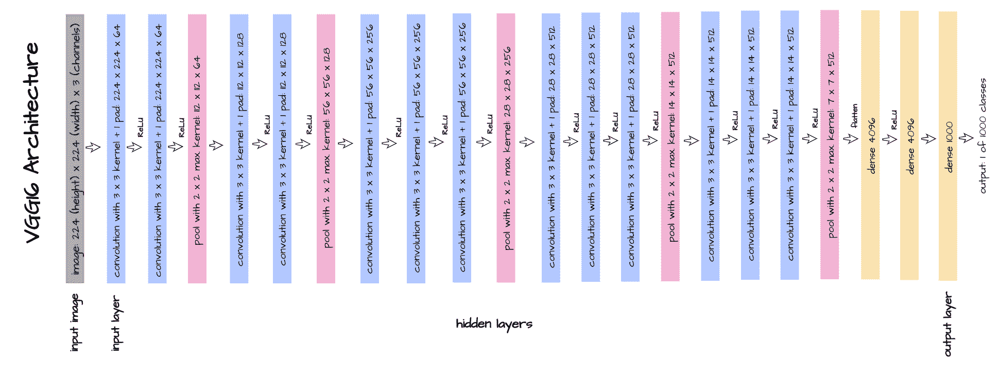
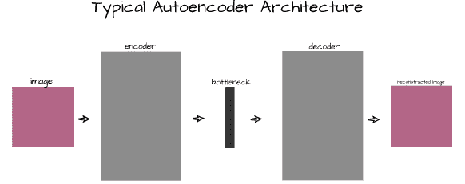
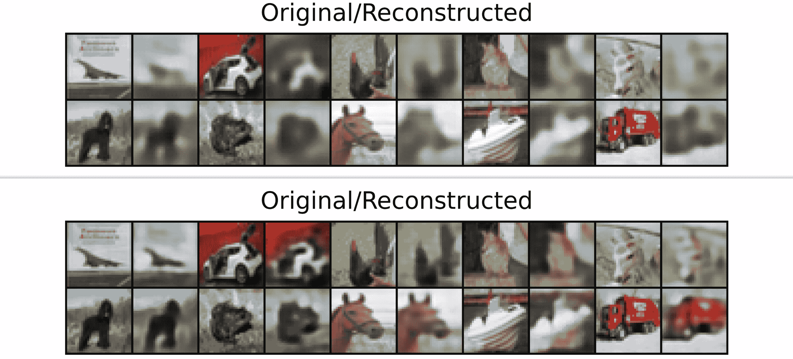
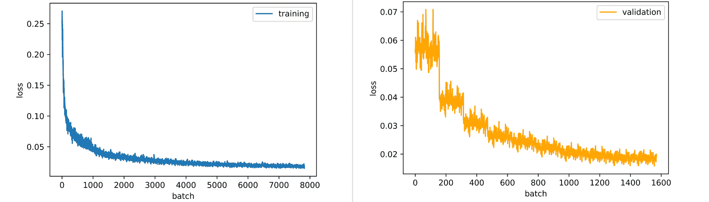
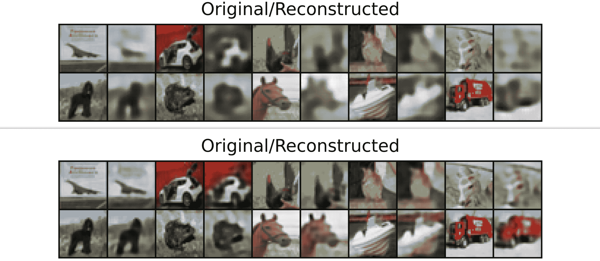
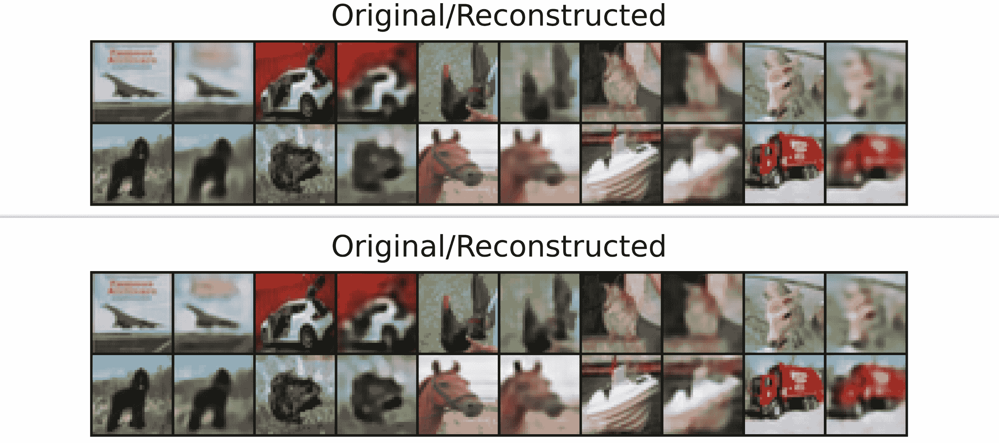

# 卷积自动编码器

> 原文：<https://blog.paperspace.com/convolutional-autoencoder/>

卷积神经网络接收二维空间结构化数据实例(图像)，并对其进行处理，直到产生某种类型的一维向量表示。这就引出了一个问题，如果从图像矩阵到向量表示的映射可以被学习，也许从向量表示到图像的映射也可以被学习。在这篇演示文章中，我们将探索这一点。

### 内容作为特征提取器

在以前的文章中，我提到了 convnet 中卷积层的作用是从图像中提取特征。然后，这些特征被传递给执行实际分类的线性层(利用 1 x 1 卷积层进行下采样的架构除外)。



考虑具有上述架构的 VGG-16，从输入层直到汇集的`7 x 7 x 512`特征地图被展平以创建大小为 25，088 个元素的向量的点:网络的该部分充当特征提取器。从本质上来说，一个总共有 50，176 个像素的`224 x 224`图像被处理以创建一个 25，088 个元素的特征向量，然后这个特征向量被传递到线性层用于分类。

由于这些特征是由一个 convnet 提取的，因此有理由认为另一个 convnet 可能理解这些特征，并将这些特征所属的原始图像放回一起，基本上与特征提取过程相反。这基本上就是一个 ***自动编码器*** 所做的。

### 自动编码器的结构

如前所述，自动编码器是深度学习架构，能够从其特征向量重建数据实例。它们处理各种数据，但本文主要关注它们在图像数据上的应用。自动编码器由 3 个主要组件组成；即一个 ***编码器*** ，一个 ***瓶颈*** 和一个 ***解码器*** 。



#### 编码器

自动编码器的第一部分，编码器是专门充当特征提取器的 convnet。它的主要功能是帮助从图像中提取最显著的特征，并将它们作为向量返回。

#### 瓶颈

位于编码器之后的瓶颈，也称为代码层，作为一个额外的层，有助于将提取的特征压缩成一个更小的矢量表示。这样做是为了使解码器更难理解这些特征，并迫使它学习更复杂的映射。

#### 解码器

自动编码器的最后一部分，解码器是 convnet，它试图理解来自编码器的特征，这些特征随后在瓶颈中被压缩，以便重建原始图像。

### 训练自动编码器

在本节中，我们将在 PyTorch 中从头开始实现一个自动编码器，并在一个特定的数据集上对其进行训练。

让我们从快速导入我们需要的包开始。

```py
#  article dependencies
import torch
import torch.nn as nn
import torch.nn.functional as F
import torchvision
import torchvision.transforms as transforms
import torchvision.datasets as Datasets
from torch.utils.data import Dataset, DataLoader
import numpy as np
import matplotlib.pyplot as plt
import cv2
from tqdm.notebook import tqdm
from tqdm import tqdm as tqdm_regular
import seaborn as sns
from torchvision.utils import make_grid
import random
```

```py
#  configuring device
if torch.cuda.is_available():
  device = torch.device('cuda:0')
  print('Running on the GPU')
else:
  device = torch.device('cpu')
  print('Running on the CPU')
```

#### 准备数据

出于本文的目的，我们将利用 CIFAR-10 数据集来训练卷积自动编码器。如下面的代码单元格所示，可以加载它。

```py
#  loading training data
training_set = Datasets.CIFAR10(root='./', download=True,
                              transform=transforms.ToTensor())

#  loading validation data
validation_set = Datasets.CIFAR10(root='./', download=True, train=False,
                                transform=transforms.ToTensor())
```

接下来，我们只需要从数据集中提取图像。由于我们试图教一个自动编码器重建图像，目标将不是类标签，而是实际的图像本身。还从每个类中提取一个图像，并存储在对象“test_images”中，这只是为了可视化的目的，稍后将详细介绍。

```py
def extract_each_class(dataset):
  """
  This function searches for and returns
  one image per class
  """
  images = []
  ITERATE = True
  i = 0
  j = 0

  while ITERATE:
    for label in tqdm_regular(dataset.targets):
      if label==j:
        images.append(dataset.data[i])
        print(f'class {j} found')
        i+=1
        j+=1
        if j==10:
          ITERATE = False
      else:
        i+=1

  return images

#  extracting training images
training_images = [x for x in training_set.data]

#  extracting validation images
validation_images = [x for x in validation_set.data]

#  extracting test images for visualization purposes
test_images = extract_each_class(validation_set)
```

现在我们需要定义一个 PyTorch 数据集类，以便能够将图像用作张量。这与类实例化一起在下面的代码单元中完成。

```py
#  defining dataset class
class CustomCIFAR10(Dataset):
  def __init__(self, data, transforms=None):
    self.data = data
    self.transforms = transforms

  def __len__(self):
    return len(self.data)

  def __getitem__(self, idx):
    image = self.data[idx]

    if self.transforms!=None:
      image = self.transforms(image)
    return image

#  creating pytorch datasets
training_data = CustomCIFAR10(training_images, transforms=transforms.Compose([transforms.ToTensor(),
                                                                              transforms.Normalize((0.5, 0.5, 0.5), (0.5, 0.5, 0.5))]))
validation_data = CustomCIFAR10(validation_images, transforms=transforms.Compose([transforms.ToTensor(),
                                                                                  transforms.Normalize((0.5, 0.5, 0.5), (0.5, 0.5, 0.5))]))
test_data = CustomCIFAR10(test_images, transforms=transforms.Compose([transforms.ToTensor(),
                                                                                  transforms.Normalize((0.5, 0.5, 0.5), (0.5, 0.5, 0.5))]))
```

#### 自动编码器架构

本文定义了一个自定义卷积自动编码器架构，如下图所示。该架构旨在与 CIFAR-10 数据集一起工作，因为其编码器通过 3 个通道接收`32 x 32`像素图像，并对其进行处理，直到生成 64 个`8 x 8`特征地图。

这些特征图随后被展平以产生 4096 个元素的向量，该向量随后在瓶颈中被压缩到仅 200 个元素。解码器采用这个 200 个元素的向量表示，并通过转置卷积对其进行处理，直到返回一个`3 x 32 x 32`图像作为输出。


上面定义的架构在下面的代码单元中实现。在这种情况下，参数“latent_dim”指的是瓶颈的大小，我们将它指定为 200。

```py
#  defining encoder
class Encoder(nn.Module):
  def __init__(self, in_channels=3, out_channels=16, latent_dim=200, act_fn=nn.ReLU()):
    super().__init__()

    self.net = nn.Sequential(
        nn.Conv2d(in_channels, out_channels, 3, padding=1), # (32, 32)
        act_fn,
        nn.Conv2d(out_channels, out_channels, 3, padding=1), 
        act_fn,
        nn.Conv2d(out_channels, 2*out_channels, 3, padding=1, stride=2), # (16, 16)
        act_fn,
        nn.Conv2d(2*out_channels, 2*out_channels, 3, padding=1),
        act_fn,
        nn.Conv2d(2*out_channels, 4*out_channels, 3, padding=1, stride=2), # (8, 8)
        act_fn,
        nn.Conv2d(4*out_channels, 4*out_channels, 3, padding=1),
        act_fn,
        nn.Flatten(),
        nn.Linear(4*out_channels*8*8, latent_dim),
        act_fn
    )

  def forward(self, x):
    x = x.view(-1, 3, 32, 32)
    output = self.net(x)
    return output

#  defining decoder
class Decoder(nn.Module):
  def __init__(self, in_channels=3, out_channels=16, latent_dim=200, act_fn=nn.ReLU()):
    super().__init__()

    self.out_channels = out_channels

    self.linear = nn.Sequential(
        nn.Linear(latent_dim, 4*out_channels*8*8),
        act_fn
    )

    self.conv = nn.Sequential(
        nn.ConvTranspose2d(4*out_channels, 4*out_channels, 3, padding=1), # (8, 8)
        act_fn,
        nn.ConvTranspose2d(4*out_channels, 2*out_channels, 3, padding=1, 
                           stride=2, output_padding=1), # (16, 16)
        act_fn,
        nn.ConvTranspose2d(2*out_channels, 2*out_channels, 3, padding=1),
        act_fn,
        nn.ConvTranspose2d(2*out_channels, out_channels, 3, padding=1, 
                           stride=2, output_padding=1), # (32, 32)
        act_fn,
        nn.ConvTranspose2d(out_channels, out_channels, 3, padding=1),
        act_fn,
        nn.ConvTranspose2d(out_channels, in_channels, 3, padding=1)
    )

  def forward(self, x):
    output = self.linear(x)
    output = output.view(-1, 4*self.out_channels, 8, 8)
    output = self.conv(output)
    return output

#  defining autoencoder
class Autoencoder(nn.Module):
  def __init__(self, encoder, decoder):
    super().__init__()
    self.encoder = encoder
    self.encoder.to(device)

    self.decoder = decoder
    self.decoder.to(device)

  def forward(self, x):
    encoded = self.encoder(x)
    decoded = self.decoder(encoded)
    return decoded
```

通常，我们现在需要定义一个类来帮助训练和验证更加无缝。在这种情况下，由于我们正在训练一个生成模型，损失可能不会携带太多信息。一般来说，我们希望减少损失，我们还可以使用损失值来查看自动编码器在每个时期重建图像的效果。出于这个原因，我包含了一个可视化块，如下所示。

```py
class ConvolutionalAutoencoder():
  def __init__(self, autoencoder):
    self.network = autoencoder
    self.optimizer = torch.optim.Adam(self.network.parameters(), lr=1e-3)

  def train(self, loss_function, epochs, batch_size, 
            training_set, validation_set, test_set):

    #  creating log
    log_dict = {
        'training_loss_per_batch': [],
        'validation_loss_per_batch': [],
        'visualizations': []
    } 

    #  defining weight initialization function
    def init_weights(module):
      if isinstance(module, nn.Conv2d):
        torch.nn.init.xavier_uniform_(module.weight)
        module.bias.data.fill_(0.01)
      elif isinstance(module, nn.Linear):
        torch.nn.init.xavier_uniform_(module.weight)
        module.bias.data.fill_(0.01)

    #  initializing network weights
    self.network.apply(init_weights)

    #  creating dataloaders
    train_loader = DataLoader(training_set, batch_size)
    val_loader = DataLoader(validation_set, batch_size)
    test_loader = DataLoader(test_set, 10)

    #  setting convnet to training mode
    self.network.train()
    self.network.to(device)

    for epoch in range(epochs):
      print(f'Epoch {epoch+1}/{epochs}')
      train_losses = []

      #------------
      #  TRAINING
      #------------
      print('training...')
      for images in tqdm(train_loader):
        #  zeroing gradients
        self.optimizer.zero_grad()
        #  sending images to device
        images = images.to(device)
        #  reconstructing images
        output = self.network(images)
        #  computing loss
        loss = loss_function(output, images.view(-1, 3, 32, 32))
        #  calculating gradients
        loss.backward()
        #  optimizing weights
        self.optimizer.step()

        #--------------
        # LOGGING
        #--------------
        log_dict['training_loss_per_batch'].append(loss.item())

      #--------------
      # VALIDATION
      #--------------
      print('validating...')
      for val_images in tqdm(val_loader):
        with torch.no_grad():
          #  sending validation images to device
          val_images = val_images.to(device)
          #  reconstructing images
          output = self.network(val_images)
          #  computing validation loss
          val_loss = loss_function(output, val_images.view(-1, 3, 32, 32))

        #--------------
        # LOGGING
        #--------------
        log_dict['validation_loss_per_batch'].append(val_loss.item())

      #--------------
      # VISUALISATION
      #--------------
      print(f'training_loss: {round(loss.item(), 4)} validation_loss: {round(val_loss.item(), 4)}')

      for test_images in test_loader:
        #  sending test images to device
        test_images = test_images.to(device)
        with torch.no_grad():
          #  reconstructing test images
          reconstructed_imgs = self.network(test_images)
        #  sending reconstructed and images to cpu to allow for visualization
        reconstructed_imgs = reconstructed_imgs.cpu()
        test_images = test_images.cpu()

        #  visualisation
        imgs = torch.stack([test_images.view(-1, 3, 32, 32), reconstructed_imgs], 
                          dim=1).flatten(0,1)
        grid = make_grid(imgs, nrow=10, normalize=True, padding=1)
        grid = grid.permute(1, 2, 0)
        plt.figure(dpi=170)
        plt.title('Original/Reconstructed')
        plt.imshow(grid)
        log_dict['visualizations'].append(grid)
        plt.axis('off')
        plt.show()

    return log_dict

  def autoencode(self, x):
    return self.network(x)

  def encode(self, x):
    encoder = self.network.encoder
    return encoder(x)

  def decode(self, x):
    decoder = self.network.decoder
    return decoder(x)
```

设置好一切之后，我们就可以使用下面代码单元中指定的参数，将我们的 autoencoder 实例化为卷积 autoencoder 类的成员。

```py
#  training model
model = ConvolutionalAutoencoder(Autoencoder(Encoder(), Decoder()))

log_dict = model.train(nn.MSELoss(), epochs=10, batch_size=64, 
                       training_set=training_data, validation_set=validation_data,
                       test_set=test_data)
```

从第一个时期结束时起，很明显，我们的解码器已经开始了解如何重建输入编码器的图像，尽管它只能访问压缩的 200 个元素的特征向量表示。直到第 10 个纪元，重建图像的细节也在不断增加。



Epoch 1 (top) vs Epoch 10 (bottom).

看看训练和验证的损失，自动编码器仍然可以从更多的训练中稍微受益，因为它的损失仍然呈下降趋势。验证损失的情况比训练损失的情况更严重，而训练损失似乎处于平稳状态。



### 瓶颈和细节

在前面的一节中，我提到了瓶颈代码层如何进一步压缩特征向量，从而迫使解码器学习更复杂和更一般化的映射。另一方面，由于编码层中的压缩幅度也会影响解码器重建图像的效果，因此需要寻求一种精细的平衡。

传递给解码器的矢量表示越小，解码器可访问的图像特征就越少，其重建就越不详细。同样，传递给解码器的矢量表示越大，它可以访问的图像特征就越多，重建的图像就越详细。按照这种思路，让我们训练相同的 autoencoder 架构，但是这次使用大小为 1000 的瓶颈。

```py
#  training model
model = ConvolutionalAutoencoder(Autoencoder(Encoder(latent_dim=1000), Decoder(latent_dim=1000)))

log_dict = model.train(nn.MSELoss(), epochs=10, batch_size=64, 
                       training_set=training_data, validation_set=validation_data,
                       test_set=test_data)
```

根据每个时期生成的可视化，很明显，解码器在细节和视觉精度方面在重建图像方面做得更好。这归结于这样一个事实，即新的解码器可以访问更多的特征，因为 4096 个元素的原始特征向量现在被下采样到 1000 个元素，而不是 200 个元素。



Epoch 1 (top) vs Epoch 10 (bottom).

同样，自动编码器可以从更多的训练中受益。它的训练和验证损失仍然呈下降趋势，其斜率比我们在只有 200 个元素的瓶颈下训练我们的自动编码器时观察到的斜率更陡。


在第 10 个时期比较大小为 200 和 1000 的瓶颈清楚地表明，用 1000 个元素的瓶颈生成的图像比用 200 个元素的瓶颈生成的图像更清晰/更详细。



Bottleneck 200 (top) vs bottleneck 1000 (bottom) both at the 10th epoch.

### 训练到极致

卷积自动编码器的最佳训练点是什么？从我们训练的两个自动编码器中，我们可以观察到重建在第 10 个时期仍然是模糊的，即使我们的损失图已经开始变平。增加瓶颈大小只会在一定程度上改善这个问题，但不会完全解决它。

这部分归因于在这种情况下使用的损失函数，均方差，因为它在测量生成模型中的损失时做得不太好。在很大程度上，这些模糊的重建是卷积自动编码器任务的祸根。如果一个人的目标是重建或生成图像，生成性对抗网络(GAN)或[扩散模型](https://github.com/gradient-ai/stable-diffusion)可能是一个更安全的赌注。然而，这并不是说卷积自动编码器没有用，因为它们可以用于异常检测、图像去噪等等。

### 结束语

在本文中，我们讨论了图像数据环境中的自动编码器。我们接着来看看卷积自动编码器到底是做什么的，以及它是如何工作的，目的是培养对其工作原理的直觉。此后，在进一步定义我们自己的自定义自动编码器、训练它并讨论模型训练的结果之前，我们触及了它的不同部分。