# 卷积神经网络中的池化

> 原文：<https://blog.paperspace.com/pooling-in-convolutional-neural-networks/>


Photo by [Lee Jeffs](https://unsplash.com/@grafiklee?utm_source=ghost&utm_medium=referral&utm_campaign=api-credit) / [Unsplash](https://unsplash.com/?utm_source=ghost&utm_medium=referral&utm_campaign=api-credit)

任何熟悉卷积神经网络的人都会对术语“汇集”感到熟悉，因为它是每个卷积层之后通常使用的过程。在本文中，我们将探索 CNN 架构中这一基本过程背后的原因和方法。

### 汇集过程

与卷积类似，池化过程也利用过滤器/内核，尽管它没有任何元素(有点像空数组)。它本质上包括在图像的连续补丁上滑动这个过滤器，并以某种方式处理内核中捕获的像素；基本上与卷积运算相同。

### 计算机视觉的飞跃

在深度学习框架中，有一个不太流行但非常基本的参数，它决定了卷积和池类的行为。从更一般的意义上来说，它控制任何由于某种原因使用滑动窗口的类的行为。该参数被称为'**步距**'它被称为滑动窗口，因为用滤镜扫描图像类似于在图像像素上滑动一个小窗口)。

跨距参数决定了在执行卷积和池化等滑动窗口操作时，mxuch 滤波器如何在任一维度上移动。


Strides in a sliding window operation using a kernel/filter of size (2, 2)

在上面的图像中，滤镜在(6，6)图像上的第 0 维度(水平)和第 1 维度(垂直)滑动。当 stride=1 时，滤波器滑动一个像素。然而，当步幅=2 时，滤波器滑动两个像素；步幅=3 时为三个像素。当通过滑动窗口过程生成新图像时，这具有有趣的效果；因为在两个维度上的步幅 2 基本上生成了一个图像，该图像是其原始图像的一半大小。同样，步幅为 3 将产生大小为其参考图像的三分之一的图像，依此类推。

> 当步幅> 1 时，产生的表示是其参考图像大小的一部分。

在执行池操作时，一定要注意默认情况下 stride 总是等于过滤器的大小。例如，如果要使用(2，2)滤波器，stride 的默认值为 2。

### 联营的类型

在细胞神经网络中主要使用两种类型的池操作，它们是最大池和平均池。这两种池操作的全局变体也存在，但是它们超出了本文的范围(全局最大池和全局平均池)。

#### 最大池化

最大池需要使用过滤器扫描图像，并在每个实例中返回过滤器中捕捉的最大像素值，作为新图像中它自己的像素。

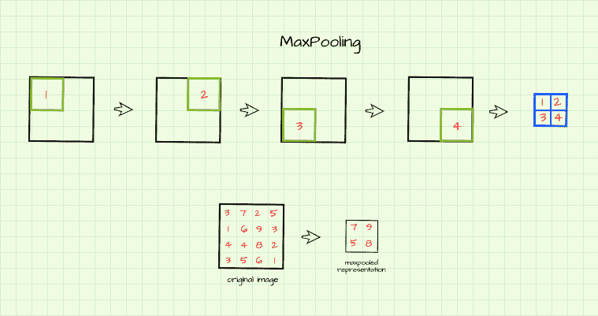

The max pooling operation

从图中可以看出，空的(2，2)滤波器在(4，4)图像上滑动，跨距为 2，如上一节所述。每个实例的最大像素值作为其自身的独特像素返回，以形成新的图像。所得到的图像被认为是原始图像的最大合并表示(*注意，由于前面章节*中讨论的默认步幅为 2，所得到的图像是原始图像的一半大小)。

#### 平均池

就像最大池一样，空过滤器也在图像上滑动，但在这种情况下，过滤器中捕获的所有像素的平均值将返回，以形成原始图像的平均池表示，如下图所示。

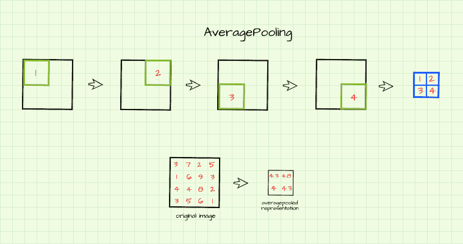

The average pooling operation

### 最大池与平均池

从上一节中的插图可以清楚地看到，与平均混合表示相比，最大混合表示中的像素值要大得多。用更简单的话来说，这仅仅意味着从最大池产生的表示通常比从平均池产生的表示更清晰。

### 联营的本质

在我以前的一篇文章中，我提到了卷积神经网络如何通过卷积过程从图像中提取边缘特征。这些提取的特征被称为**特征图。**然后，池化作用于这些特征图，并作为一种主成分分析(允许我对这一概念相当自由)，通过浏览特征图并在一个称为**下采样**的过程中产生一个小规模的摘要。

用不太专业的术语来说，汇集生成小尺寸的图像，这些图像保留了参考图像的所有基本属性(像素)。基本上，可以产生汽车的(25，25)像素图像，通过使用(2，2)核迭代汇集 4 次，该图像将保留大小为(400，400)的参考图像的所有一般细节和组成。它通过利用大于 1 的步幅来做到这一点，允许产生是原始图像的一部分的表示。

回到 CNN，随着卷积层变得更深，特征图(由卷积产生的表示)的数量增加。如果特征图的大小与提供给网络的图像的大小相同，由于网络中存在大量数据，特别是在训练期间，计算速度将受到严重阻碍。通过逐步对这些特征地图进行下采样，即使特征地图的数量增加，网络中的数据量也能得到有效控制。这意味着网络将逐步处理合理数量的数据，而不会丢失由先前卷积层提取的任何基本特征，从而提高计算速度。

池的另一个效果是，它允许卷积神经网络变得更加健壮，因为它们变得平移不变。这意味着该网络将能够从感兴趣的对象中提取特征，而不管该对象在图像中的位置如何(在未来的文章中会有更多相关内容)。

### 引擎盖下。

在本节中，我们将使用一个手动编写的池函数来可视化池过程，以便更好地理解实际发生了什么。提供了两个函数，一个用于最大池，另一个用于平均池。使用这些函数，我们将尝试合并以下大小为(446，550)像素的图像。

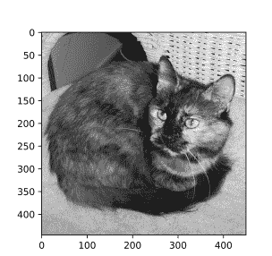

Reference image.

```py
#  import these dependencies
import torch
import numpy as np
import matplotlib.pyplot as plt
import torch.nn.functional as F
from tqdm import tqdm
```

Don't forget to import these dependencies

#### 幕后最大池

```py
def max_pool(image_path, kernel_size=2, visualize=False, title=''):
      """
      This function replicates the maxpooling
      process
      """

      #  assessing image parameter
      if type(image_path) is np.ndarray and len(image_path.shape)==2:
        image = image_path
      else:
        image = cv2.imread(image_path, cv2.IMREAD_GRAYSCALE)

      #  creating an empty list to store convolutions
      pooled = np.zeros((image.shape[0]//kernel_size, 
                        image.shape[1]//kernel_size))

      #  instantiating counter
      k=-1
      #  maxpooling
      for i in tqdm(range(0, image.shape[0], kernel_size)):
        k+=1
        l=-1
        if k==pooled.shape[0]:
          break
        for j in range(0, image.shape[1], kernel_size):
          l+=1
          if l==pooled.shape[1]:
            break
          try:
            pooled[k,l] = (image[i:(i+kernel_size), 
                                j:(j+kernel_size)]).max()
          except ValueError:
            pass

      if visualize:
        #  displaying results
        figure, axes = plt.subplots(1,2, dpi=120)
        plt.suptitle(title)
        axes[0].imshow(image, cmap='gray')
        axes[0].set_title('reference image')
        axes[1].imshow(pooled, cmap='gray')
        axes[1].set_title('maxpooled')
      return pooled
```

Max Pooling Function.

上面的函数复制了最大池化过程。使用函数，让我们尝试使用(2，2)内核最大化参考图像池。

```py
max_pool('image.jpg', 2, visualize=True)
```

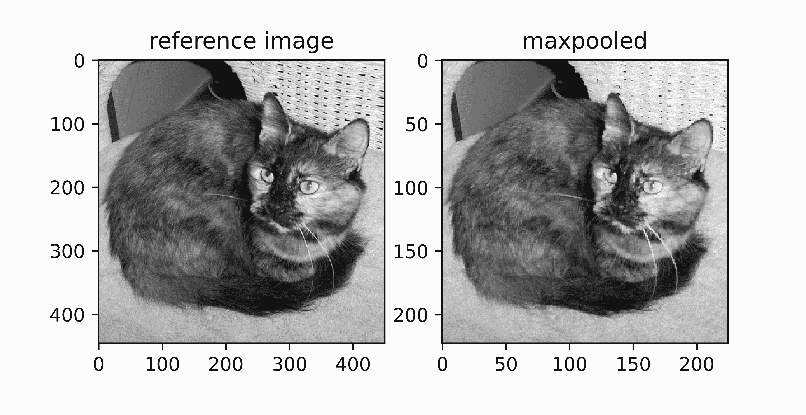

Producing a max pooled representation

查看每个轴上的数字线，可以清楚地看到图像的尺寸缩小了，但所有细节都保持不变。这几乎就像该过程已经提取了最显著的像素，并且产生了大小为参考图像一半的概括表示(一半是因为使用了(2，2)核)。

下面的函数允许最大池化过程的多次迭代的可视化。

```py
def visualize_pooling(image_path, iterations, kernel=2):
      """
      This function helps to visualise several
      iterations of the pooling process
      """
      image = cv2.imread(image_path, cv2.IMREAD_GRAYSCALE)

      #  creating empty list to hold pools
      pools = []
      pools.append(image)

      #  performing pooling
      for iteration in range(iterations):
        pool = max_pool(pools[-1], kernel)
        pools.append(pool)

      #  visualisation
      fig, axis = plt.subplots(1, len(pools), dpi=700)
      for i in range(len(pools)):
        axis[i].imshow(pools[i], cmap='gray')
        axis[i].set_title(f'{pools[i].shape}', fontsize=5)
        axis[i].axis('off')
      pass
```

Pooling visualization function

使用此函数，我们可以使用(2，2)过滤器可视化 3 代最大池表示，如下所示。图像从(446，450)像素的大小变为(55，56)像素的大小(本质上是 1.5%的总和)，同时保持其总体构成。

```py
visualize_pooling('image.jpg', 3)
```

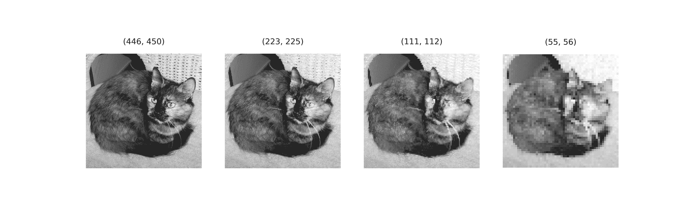

Reference image through 3 progressive iterations of max pooling using a (2, 2) kernel.

使用更大的核(3，3)的效果如下所示，正如预期的那样，对于每次迭代，参考图像减小到其先前大小的 1/3。到第三次迭代，产生像素化的(16，16)下采样表示(0.1%总和)。虽然是像素化的，但图像的整体概念仍然保持不变。

```py
visualize_pooling('image.jpg', 3, kernel=3)
```

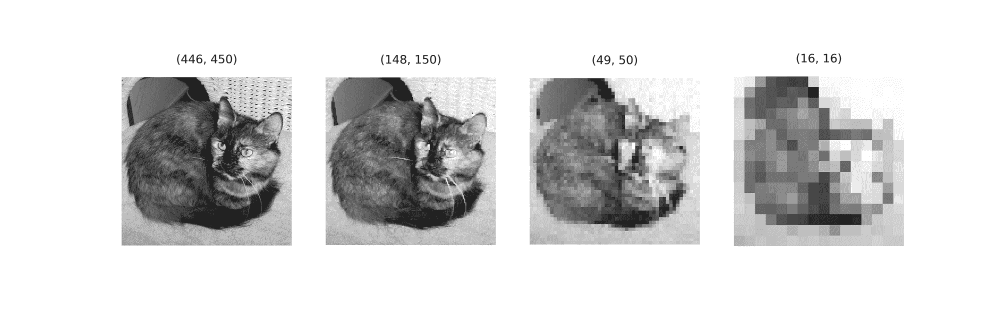

Reference image through 3 iterations of max pooling using a (3, 3) kernel.

为了正确地尝试模拟卷积神经网络中的最大池化过程，让我们使用 Prewitt 算子对图像中检测到的垂直边缘进行几次迭代。

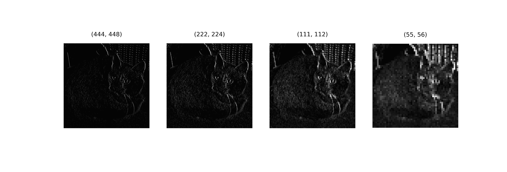

Max pooling over detected edges.

到第三次迭代时，虽然图像的尺寸减小了，但是可以看到它的特征(边缘)逐渐变得清晰。

#### 幕后平均池

```py
def average_pool(image_path, kernel_size=2, visualize=False, title=''):
      """
      This function replicates the averagepooling
      process
      """

      #  assessing image parameter
      if type(image_path) is np.ndarray and len(image_path.shape)==2:
        image = image_path
      else:
        image = cv2.imread(image_path, cv2.IMREAD_GRAYSCALE)

      #  creating an empty list to store convolutions
      pooled = np.zeros((image.shape[0]//kernel_size, 
                        image.shape[1]//kernel_size))

      #  instantiating counter
      k=-1
      #  averagepooling
      for i in tqdm(range(0, image.shape[0], kernel_size)):
        k+=1
        l=-1
        if k==pooled.shape[0]:
          break
        for j in range(0, image.shape[1], kernel_size):
          l+=1
          if l==pooled.shape[1]:
            break
          try:
            pooled[k,l] = (image[i:(i+kernel_size), 
                                j:(j+kernel_size)]).mean()
          except ValueError:
            pass

      if visualize:
        #  displaying results
        figure, axes = plt.subplots(1,2, dpi=120)
        plt.suptitle(title)
        axes[0].imshow(image, cmap='gray')
        axes[0].set_title('reference image')
        axes[1].imshow(pooled, cmap='gray')
        axes[1].set_title('averagepooled')
      return pooled
```

Average pooling function.

上面的函数复制了平均的池化过程。请注意，这是与 max pooling 函数相同的代码，不同之处在于在内核滑过图像时使用了 mean()方法。下面是我们参考图像的平均合并表示。

```py
average_pool('image.jpg', 2, visualize=True)
```

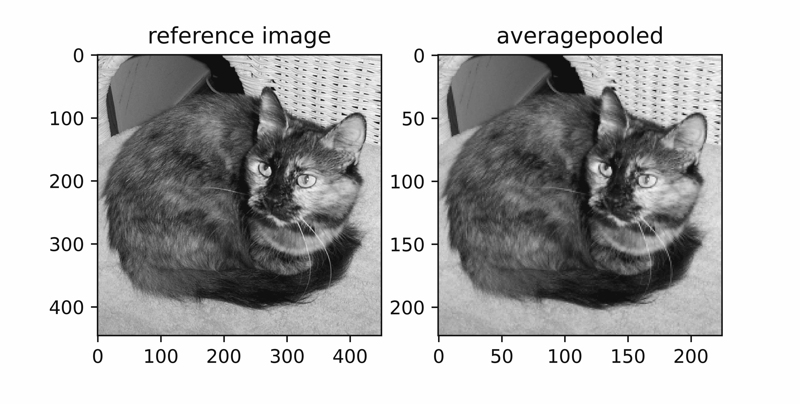

Producing an average pooled representation.

与 max pooling 类似，可以看到图像已经缩小到一半大小，同时保留了其最重要的属性。这非常有趣，因为与最大池不同，平均池不直接使用参考图像中的像素，而是将它们组合起来，基本上创建新的属性(像素)，而参考图像中的细节仍会保留。

让我们使用下面的可视化功能来看看平均池化过程是如何通过 3 次迭代进行的。

```py
def visualize_pooling(image_path, iterations, kernel=2):
      """
      This function helps to visualise several
      iterations of the pooling process
      """
      image = cv2.imread(image_path, cv2.IMREAD_GRAYSCALE)

      #  creating empty list to hold pools
      pools = []
      pools.append(image)

      #  performing pooling
      for iteration in range(iterations):
        pool = average_pool(pools[-1], kernel)
        pools.append(pool)

      #  visualisation
      fig, axis = plt.subplots(1, len(pools), dpi=700)
      for i in range(len(pools)):
        axis[i].imshow(pools[i], cmap='gray')
        axis[i].set_title(f'{pools[i].shape}', fontsize=5)
        axis[i].axis('off')
      pass
```

Pooling visualization function. 

同样，即使图像大小在每次迭代后逐渐减少一半，其细节仍然保持，尽管逐渐像素化(如小尺寸图像中所预期的)。

```py
visualize_pooling('image.jpg', 3)
```

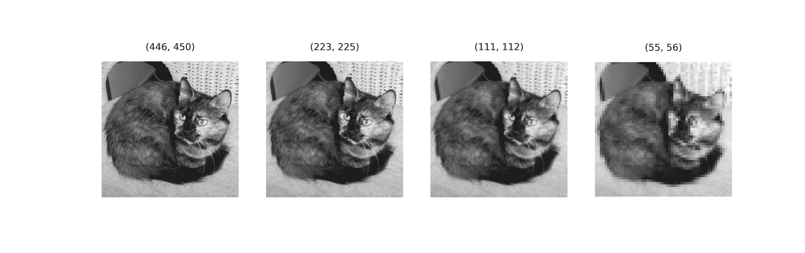

Reference image through 3 iterations of average pooling using a (2, 2) kernel.

使用(3，3)内核的平均池产生以下结果。不出所料，图像大小被缩小到之前值的 1/3。就像在 max pooling 中一样，在第 3 次迭代中出现大量像素，但图像的整体属性相当完整。

```py
visualize_pooling('image.jpg', 3, kernel=3)
```

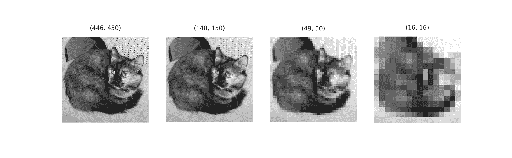

Reference image through 3 iterations of average pooling using a (3, 3) kernel.

使用 Prewitt 算子在检测到的垂直边缘上运行(2，2)平均汇集产生以下结果。正如在最大池中一样，图像特征(边缘)在渐进平均池中变得更加明显。

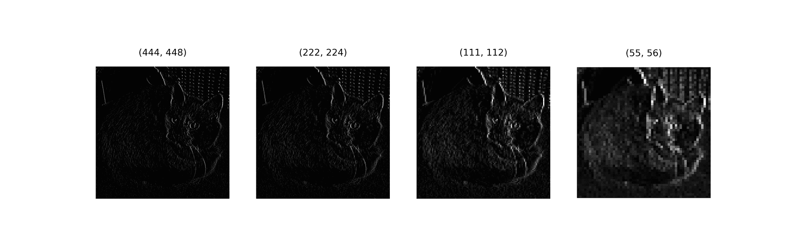

Average pooling over detected edges.

#### 最大池还是平均池？

在了解了最大和平均池过程之后，一个自然的反应是想知道对于计算机视觉应用来说，哪一个更优越。事实是，两种观点都有可能。

一方面，由于 max pooling 选择内核中捕获的最高像素值，它会产生更清晰的表示。

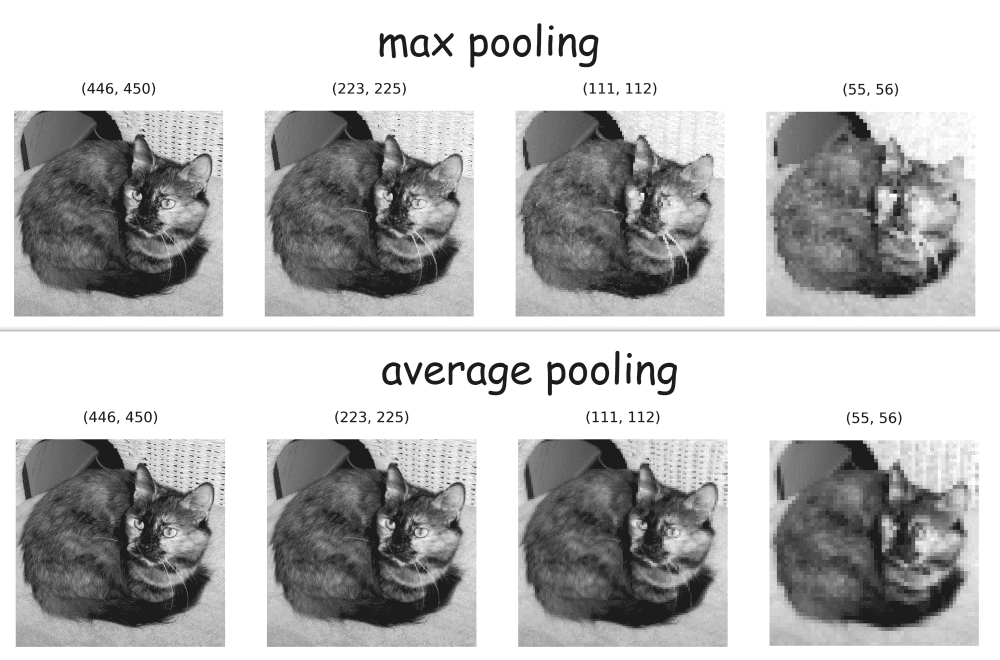

Comparing representations produced using both methods.

在卷积神经网络环境中，这意味着它可以更好地将检测到的边缘聚焦到特征地图中，如下图所示。

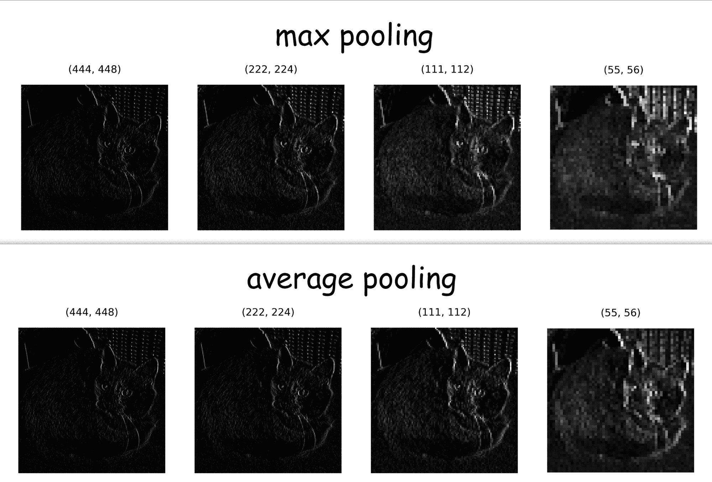

Comparing effect on edges.

另一方面，也可以支持平均池的观点，即平均池可以生成更一般化的要素地图。考虑我们的大小为(444，448)的参考图像，当与大小为(2，2)的核合并时，其合并表示的大小为(222，224)，基本上是参考图像中总像素的 25%。因为 max pooling 基本上选择像素，一些人认为它会导致数据丢失，这可能对网络性能有害。相反，平均池不是选择像素，而是通过计算它们的平均值将像素合并成一个像素，因此一些人认为平均池只是将像素压缩 75%，而不是显式地移除像素，这将产生更一般化的特征图，从而在对抗过拟合方面做得更好。

我属于分界线的哪一边？我个人认为 max pooling 在特征地图中进一步突出边缘的能力使其在计算机视觉/深度学习应用中具有优势，因此它更受欢迎。这并不是说使用平均池会严重降低网络性能，只是个人观点。

### 结束语

在本文中，我们对卷积神经网络环境下的池化有了直观的认识。我们已经研究了两种主要的池化类型，以及每种类型所产生的池化表示的差异。

对于 CNN 中关于池化的所有讨论，请记住，目前大多数架构都倾向于使用步长卷积层，而不是用于下采样的池化层，因为它们可以降低网络的复杂性。无论如何，池仍然是卷积神经网络的一个重要组成部分。