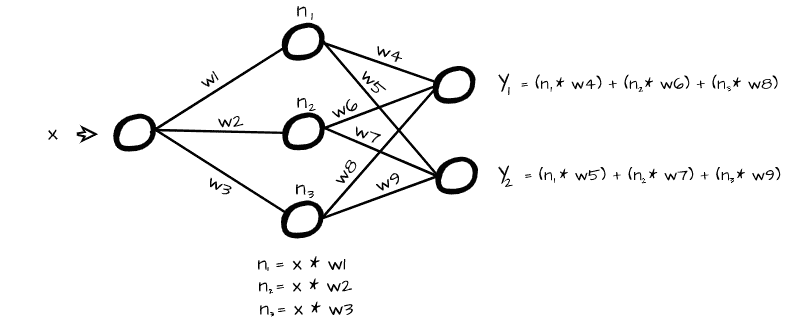
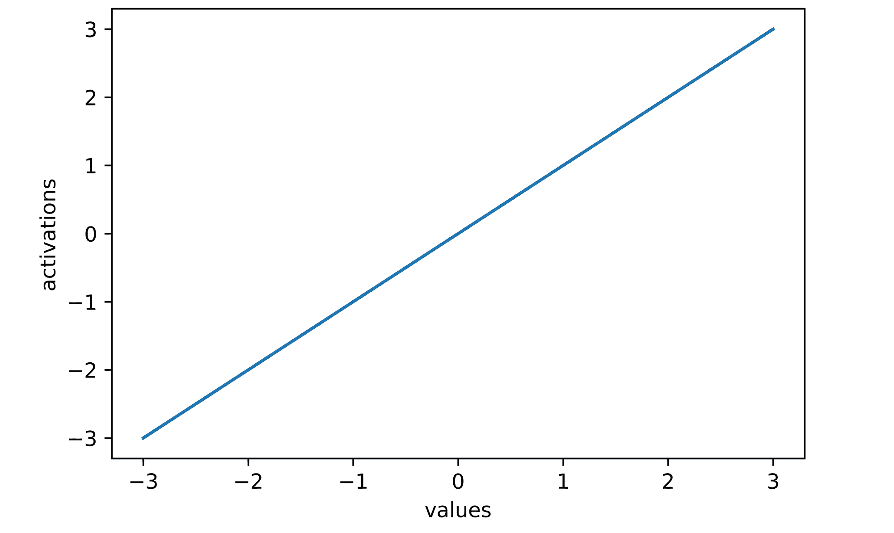
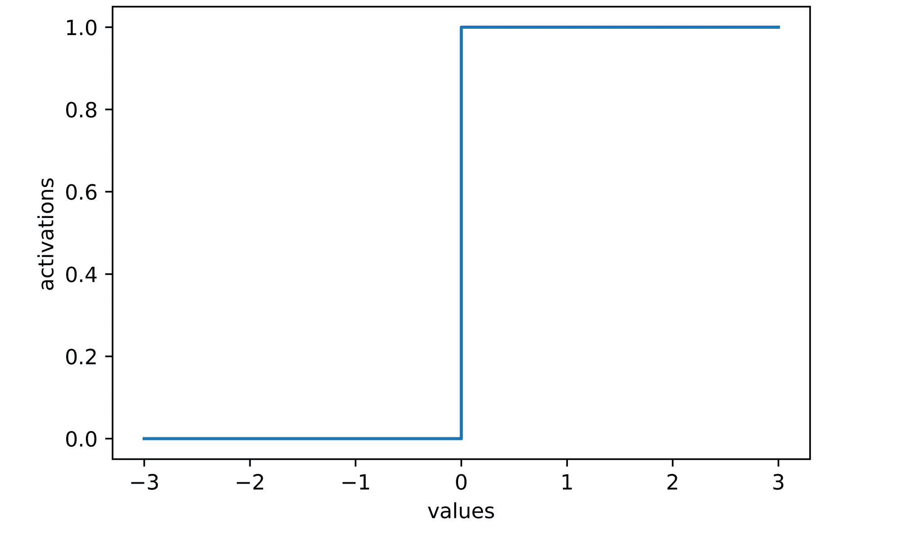
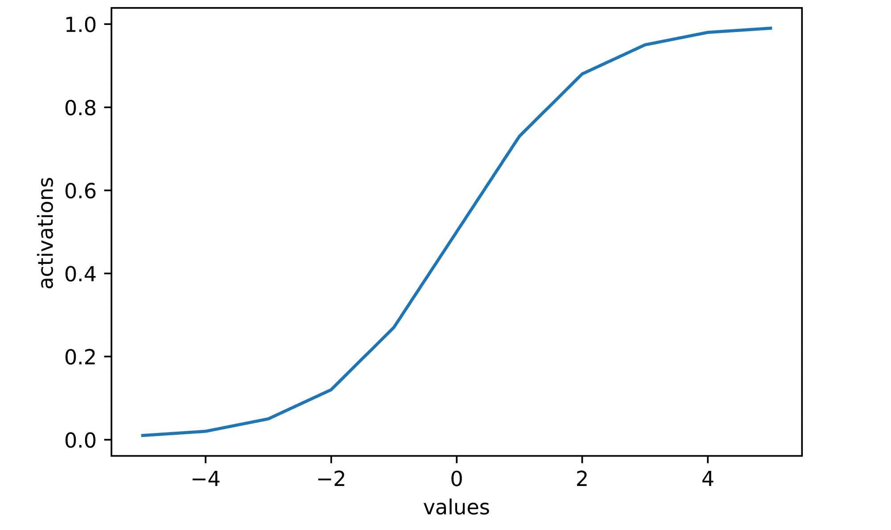
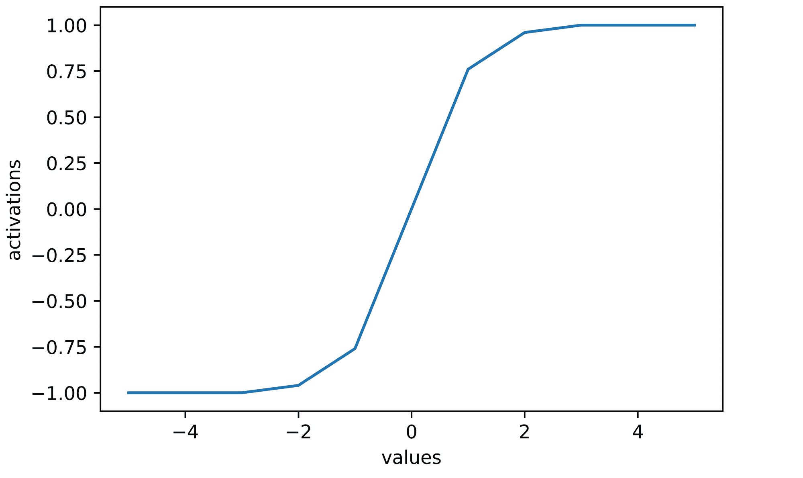
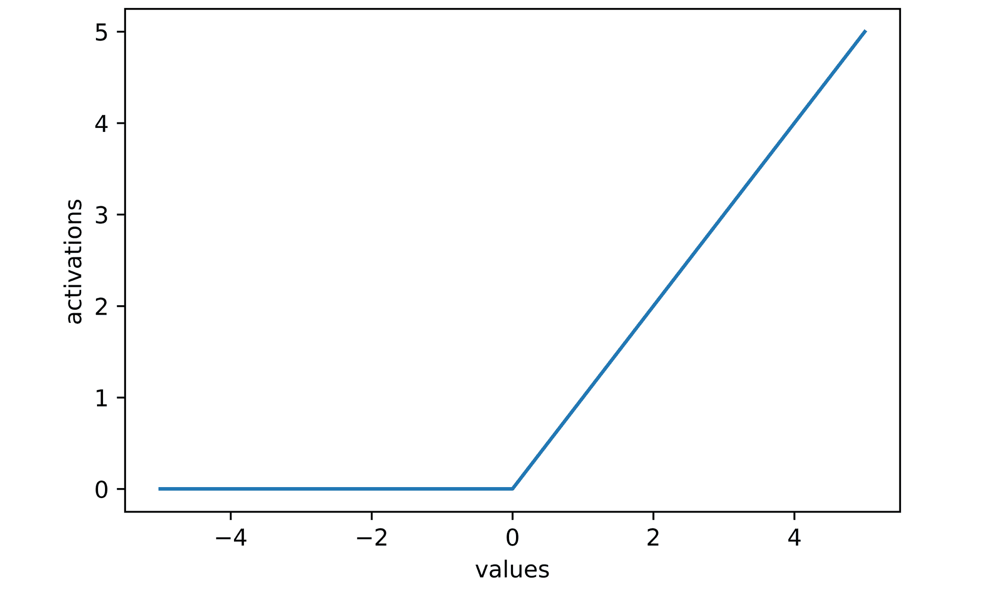
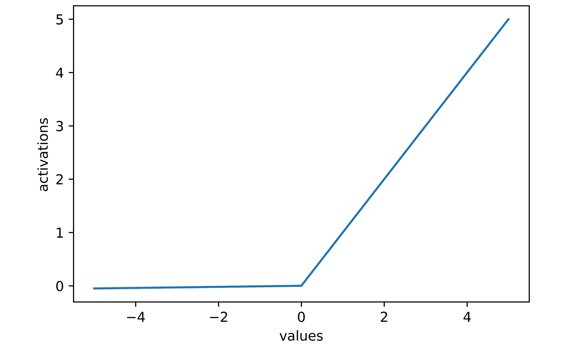
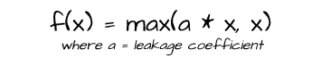
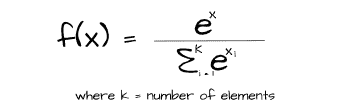

# 深度学习中的激活函数

> 原文：<https://blog.paperspace.com/activation-functions-in-deep-learning/>

激活函数是深度学习架构中的常见景象。在本文中，我们将了解深度学习应用程序中的一些常见激活函数，以及为什么要使用它们。

```py
#  article dependencies
import torch
import torch.nn.functional as F
import numpy as np
import matplotlib.pyplot as plt
from tqdm.notebook import tqdm
from tqdm import tqdm as tqdm_regular
import seaborn as sns
```

### 神经网络的工作

神经网络背后的整个思想/工作原理是将某种类型的输入数据实例(无论是矩阵还是向量)转换成特定输出表示(缩放器、向量或矩阵)的能力。为了做到这一点，它本质上是将每个元素乘以特定的数字(权重),并将它们作为新层中的神经元传递。



为了有效地做到这一点，神经网络必须学习一层中的神经元如何与下一层的神经元相关。当这从一层到另一层完成时，我们就可以有效地了解我们的输入和输出表示之间的关系。激活函数允许神经网络学习神经元之间的关系。

### 激活功能

如前一节所述，激活函数通过学习层与层之间的映射来帮助神经网络学习输入和输出之间的关系。激活函数可以分成许多类，如*线性函数*、*二元阶跃函数*和*非线性函数*。

#### 线性激活函数

线性激活函数产生与其输入成比例的神经元。线性激活函数的最简单形式是神经元不被激活，而是保持原样的情况。也被称为恒等函数，这等同于将每个神经元(x)乘以 1 以产生激活 y，因此称为`y = x`。

```py
def linear_activation(values):
  """
  This function replicates the identity
  activation function
  """
  activations = [x for x in values]
  return activations

# generating values from -3 to 3
values = np.arange(-3, 4)

#  activating generated values
activations = linear_activation(values)
#  activations are the same as their original values
activations
>>>> [-3, -2, -1, 0, 1, 2, 3]

#  plotting activations
sns.lineplot(x=values, y=activations)
plt.xlabel('values')
plt.ylabel('activations')
```



A plot of activations against values can be seen to be a straight line (**linear**)

#### 二元阶跃激活函数

二元阶跃激活函数定义了开启或关闭神经元的阈值。它基本上将神经元值与预定义的阈值进行比较，并且仅当它们大于或等于阈值时才激活它们。


在上面的数学表示中，阈值被设置为零，使得任何低于零的值被赋予值 0(未激活)，任何高于零的值被赋予值 1(激活)。

```py
def binary_step_activation(values):
  """
  This function replicates the binary step
  activation function
  """
  activations = []

  for value in values:
    if value < 0:
      activations.append(0)
    else:
      activations.append(1)

  return activations

# generating values from -3 to 3
values = np.arange(-3, 4)

#  activating generated values
activations = binary_step_activation(values)
#  activations are zero for values less than zero
activations
>>>> [0, 0, 0, 1, 1, 1, 1]

#  plotting activations
sns.lineplot(x=values, y=activations, drawstyle='steps-post')
plt.xlabel('values')
plt.ylabel('activations')
```



#### 非线性激活函数

到目前为止，在深度学习应用中使用最广泛的非线性激活函数是神经网络中的首选，因为它们有助于网络从一层到另一层学习输入和输出之间更复杂的关系。

从机器学习中可以明显看出，线性模型(线性回归)通常不足以有效地学习回归任务环境中的关系，回归任务促使使用正则化参数来尝试学习更复杂的表示。即便如此，线性模型的拟合程度也是有限的。

这同样适用于深度学习，大多数时候，通常用于训练深度学习模型的数据实例与其目标表示之间并不存在线性关系。想一想，在几幅鸟的图像和它们被赋予的任何类别标签之间，真的存在比例关系吗？不太可能。物体探测任务呢？在对象和能够定义它们的边界框的众多像素之间不可能存在线性关系。

在深度学习中，输入和目标之间往往存在非常复杂的关系，非线性激活函数有助于转化神经元，以至于网络被迫学习从一层到另一层的复杂映射。本节专门介绍深度学习中常用的非线性激活函数。

##### Sigmoid 函数

也称为逻辑函数，sigmoid 函数将值限制在值 0 和 1 之间。通过这样做，它在某种程度上提供了一种概率，这种概率又代表了对于特定数据实例，每个神经元对下一层神经元值的贡献的可能性。


然而，由于神经元被限制在小范围内，sigmoid 激活在较深的网络架构中会导致 ***涂漆梯度*** 的问题，因此最适合较浅的架构。

```py
def sigmoid_activation(values):
  """
  This function replicates the sigmoid
  activation function
  """
  activations = []

  for value in values:
    activation = 1/(1 + np.exp((-1*value)))
    activations.append(activation)

  activations = [round(x, 3) for x in activations]
  return activations

#  generating values from -5 to 5 
values = np.arange(-5, 6)

#  activating generated values
activations = sigmoid_activation(values)
#  all activations are now constrained between 0 and 1
activations
>>>> [0.01, 0.02, 0.05, 0.12, 0.27, 0.5, 0.73, 0.88, 0.95, 0.98, 0.99]

#  plotting activations
sns.lineplot(x=values, y=activations)
plt.xlabel('values')
plt.ylabel('activations')
```



##### 双曲正切激活函数

与 sigmoid 函数类似，双曲正切函数(通常称为双曲正切函数)将值限制在-1 和 1 之间，而不是 0 和 1 之间。它有效地调整了每一层中的神经元。


这种激活被视为对 sigmoid 激活函数的改进，因为其激活是以零为中心的，这有利于梯度下降。然而，就像 sigmoid 一样，它在更深的建筑中容易受到上漆梯度的影响，因为激活也被限制在小范围内。

```py
def tanh_activation(values):
  """
  This function replicates the tanh
  activation function
  """
  activations = []

  for value in values:
    activation = (np.exp(value) - np.exp((-1*value)))/(np.exp(value) + np.exp((-1*value)))
    activations.append(activation)

  activations = [round(x, 2) for x in activations]
  return activations

#  generating values from -5 to 5 
values = np.arange(-5, 6)

#  activating generated values
activations = tanh_activation(values)
#  all activations are now constrained between -1 and 1
activations
>>>> [-1.0, -1.0, -1.0, -0.96, -0.76, 0.0, 0.76, 0.96, 1.0, 1.0, 1.0]

#  plotting activations
sns.lineplot(x=values, y=activations)
plt.xlabel('values')
plt.ylabel('activations')
```



##### 校正线性单位激活函数(ReLU)

ReLU 激活是最流行的激活函数之一，它的工作原理是将零值赋给任何具有负值的神经元，而保留正值的神经元不变。它在数学上表示如下。


与 sigmoid 和 tanh 相比，ReLU 激活的计算效率更高，因为负向神经元被置零，从而减少了计算。然而，在使用 ReLU 激活功能时，人们可能会遇到一个名为 ***死亡 ReLU*** 的问题。随着优化过程的进行，神经元通过 ReLU 激活被转换为零，如果大量神经元变为零，则这些神经元在需要时不能进一步更新，因为它们的梯度将为零。这实际上导致了网络的一部分死亡。

```py
def relu_activation(values):
  """
  This function replicates the relu
  activation function
  """
  activations = []

  for value in values:
    activation = max(0, value)
    activations.append(activation)

  return activations

#  generating values from -5 to 5 
values = np.arange(-5, 6)

#  activating generated values
activations = relu_activation(values)
#  all negative values are zeroed
activations
>>>> [0, 0, 0, 0, 0, 0, 1, 2, 3, 4, 5]

#  plotting activations
sns.lineplot(x=values, y=activations)
plt.xlabel('values')
plt.ylabel('activations')
```



##### 泄漏整流线性单元激活函数

这个激活函数是 ReLU 函数的修改版本，它试图解决 ReLU 死亡的问题。与 ReLU 函数不同，leaky-ReLU 不会将非正值转换为零，而是通过 0.01 对它们进行加权，以使它们足够不重要，但是仍然有效，从而如果优化过程认为在训练期间的任何点有必要，可以对它们进行更新。


```py
def leaky_relu_activation(values):
  """
  This function replicates the leaky
  relu activation function
  """
  activations = []

  for value in values:
    activation = max(0.01*value, value)
    activations.append(activation)

  return activations

#  generating values from -5 to 5 
values = np.arange(-5, 6)

#  activating generated values
activations = leaky_relu_activation(values)
#  negative values are not zeroed
activations
>>>> [-0.05, -0.04, -0.03, -0.02, -0.01, 0.0, 1, 2, 3, 4, 5]

#  plotting activations
sns.lineplot(x=values, y=activations)
plt.xlabel('values')
plt.ylabel('activations')
```



Notice a slight slope in the negative region.

##### 参数整流器线性单元激活函数

参数整流线性单元(P-ReLU)激活函数非常类似于泄漏 ReLU 函数，因为它也试图减轻 ReLU 死亡的问题。然而，它不是为所有负值指定恒定的权重，而是将权重(泄漏系数)指定为可学习的参数，当模型被训练时，神经网络将能够学习和优化该参数。



##### SoftMax 激活功能

SoftMax 激活函数通常用于神经网络的输出层，用于多类分类任务。它有助于产生输出向量中元素的相对概率。与 sigmoid 函数不同，SoftMax 在计算概率时会考虑表示中其他元素的值，因此所有 SoftMax 激活值的总和始终等于 1。



```py
def softmax_activation(values):
  """
  This function replicates the softmax
  activation function
  """
  activations = []

  exponent_sum = sum([np.exp(x) for x in values])

  for value in values:
    activation = np.exp(value)/exponent_sum
    activations.append(activation)

  activations = [round(x, 3) for x in activations]

  return activations

#  generating values from -5 to 5 
values = np.arange(-5, 6)

#  activating generated values using softmax 
softmax_activations = softmax_activation(values)
#  values all sum up to 1
softmax_activations
>>>> [0.0, 0.0, 0.0, 0.001, 0.002, 0.004, 0.012, 0.031, 0.086, 0.233, 0.632]

#  activating generated values using sigmoid
sigmoid_activations = sigmoid_activation(values)
#  values do not sum up to 1 
sigmoid_activations
>>>> [0.007, 0.018, 0.047, 0.119, 0.269, 0.5, 0.731, 0.881, 0.953, 0.982, 0.993]
```

### 结束语

在这篇文章中，我们讨论了什么是激活函数以及为什么在神经网络中使用它们。我们还研究了几类激活函数，结论是非线性激活函数是最合适的。之后，我们从理论、数学、图形和代码实现的角度讨论了一些常见的非线性激活函数。