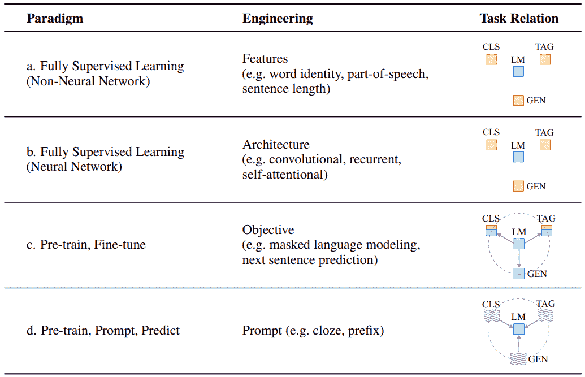
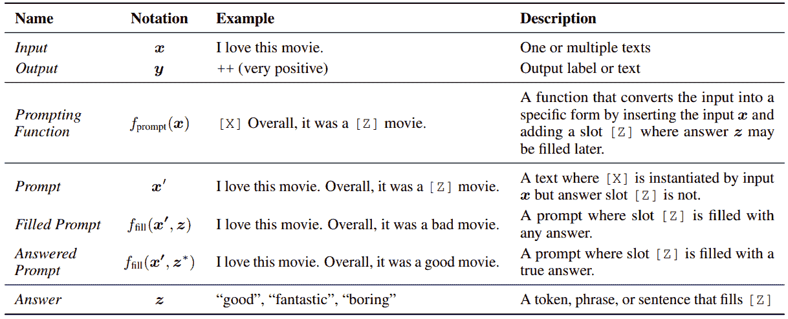
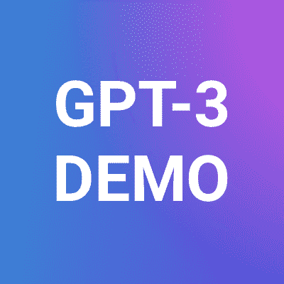
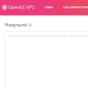

# 自然语言处理中基于提示的学习范式——第一部分

> 原文：<https://blog.paperspace.com/prompt-based-learning-in-natural-language-processing/>

基于提示的自然语言处理是最近人们讨论的自然语言处理领域最热门的话题之一。基于提示的学习通过利用预先训练的语言模型在大量文本数据上获得的知识来解决各种类型的下游任务，例如文本分类、机器翻译、命名实体检测、文本摘要等，这是有充分理由的。而那也是在*放松了* [*的约束下，首先没有任何任务特定的数据*](https://blog.paperspace.com/zero-shot-text-classification-with-hugging-face-on-gradient/) *。*与传统的监督学习范式不同，在传统的监督学习范式中，我们训练一个模型来学习一个将输入 x 映射到输出 y 的函数，这里的想法是基于直接对文本的概率进行建模的语言模型。

你可以在这里问一些有趣的问题，*我可以用 GPT 做机器翻译吗？* *可以用 BERT 做情感分类吗？*所有这些都不需要专门训练他们完成这些任务。这正是基于提示的自然语言处理的优势所在。因此，在这篇博客中，我们将尝试从这篇详尽且文笔优美的论文中总结出一些初始片段——[*预训练、提示和预测:自然语言处理中提示方法的系统调查*](https://arxiv.org/abs/2107.13586v1) *。*在这篇博客中，我们讨论了 NLP 中存在的各种类型的学习范例、基于提示的范例中经常使用的符号、基于提示的学习的演示应用，并讨论了在设计提示环境时需要考虑的一些设计问题。这个博客是 3 个博客系列的第 1 部分，将很快讨论论文的其他细节，如这样一个系统的挑战，学习自动设计提示等。

## 自然语言处理学习空间的演化

*   *范例 1:* ***完全监督(非神经网络)*** —这是最初的日子，那时 [TF-IDF](https://en.wikipedia.org/wiki/Tf%E2%80%93idf) 和其他人工设计的支持向量机、决策树、K 近邻等功能被认为是时尚的
*   *范式二:* ***全监督(神经网络)*** —计算得到了一点便宜，神经网络的研究终于有了进展。那时，使用具有长短期记忆的单词 2 vec(T7)、LSTM(T8)、其他深度神经网络架构等变得流行起来。
*   *范式 3:* ***预训练，微调***——切到 2017 年左右至今，这些日子里，在特定任务上微调预训练模型像 [BERT](https://arxiv.org/abs/1810.04805) 、 [CNN](https://en.wikipedia.org/wiki/Convolutional_neural_network) 等是最流行的方法论。
*   *范式四:* ***预训练、提示、预测*** —从去年开始，大家都在谈论基于提示的 NLP。不像*以前的学习模式，我们试图推动模型以适应数据，这里我们试图调整数据以适应预先训练的模型。*



Paradigms in NLP Learning Space| Source: [https://arxiv.org/pdf/2107.13586v1.pdf](https://arxiv.org/pdf/2107.13586v1.pdf)

直到 **范式*3*:********预训练、微调****** ，使用语言模型作为几乎每个任务的基础模型都不存在。这就是为什么我们在上图的方框中没有看到“*任务关系*”列下的箭头。同样，如上所述，利用 ****基于提示的学习，其思想是设计输入以适合模型** 。**上表中用传入箭头描述了同样的情况，指向 LM(语言模型)，其中的任务是 CLS(分类)、TAG(标记)、GEN(生成)。

## 提示符号

从下图可以看出，我们从输入 **(x)** *(比方说一个电影评论)*和输出预期 **(y)开始。**第一个任务是使用提示函数*(图中提到的****Fprompt****)*重新格式化这个输入，其输出表示为**(x’)**。现在，我们的语言模型的任务是预测代替占位符 **Z.** 的 **z** 值，然后对于槽 **Z** 被答案填充的提示，我们称之为**填充提示，**，如果答案为真，我们称之为**已回答提示**。



Terminology in Prompting | Source: [https://arxiv.org/pdf/2107.13586v1.pdf](https://arxiv.org/pdf/2107.13586v1.pdf)

## 应用程序

这个范例的一些流行应用是文本生成、问题回答、推理、命名实体识别、关系提取、文本分类等。

*   ***文本生成*** *-* 文本生成涉及到生成文本，通常以其他一些信息为条件。随着在自回归设置中训练的模型的使用，文本生成的任务变得自然。通常，所设计的提示在本质上以触发器标记为前缀，作为模型开始生成过程的提示。
*   ***问答** -* 问答(QA)旨在回答给定的输入问题，通常基于上下文文档。例如，给定一篇输入文章，如果我们想得到文章中提到的所有名字，我们可以将提示表述为“生成上面文章中提到的所有人名”。我们的模型现在的行为类似于文本生成，其中问题成为前缀。
*   ***命名实体识别***——命名实体识别(NER)是在给定的句子中识别命名实体(如人名、地点)的任务。*例如-* 如果输入是“Prakhar 喜欢打板球”，要确定“Prakhar”是什么类型的实体，我们可以将提示公式化为**“prak har 是一个 Z 实体”**，预先训练好的语言模型生成的答案空间 Z 应该是 person、organization 等，其中“person”的概率最高。
*   ***关系抽取***——关系抽取是预测给定句子中两个实体之间关系的任务。这个[视频讲解](https://www.youtube.com/watch?v=eUGc0BHUmNI)讲的是在零镜头设置下，使用预先训练的语言模型，将关系提取任务建模为自然语言推理任务。

[https://www.youtube.com/embed/eUGc0BHUmNI?feature=oembed](https://www.youtube.com/embed/eUGc0BHUmNI?feature=oembed)

*   ***文本分类*** *-* 文本分类是给给定的文本片段分配一个预定义的标签的任务。*该任务的可能提示可以是* **“本文档的主题是 z”**，然后将其馈入 mask 预训练语言模型进行槽填充。

*随时查看 GPT 3 号游乐场并测试您的提示-*

[OpenAI GPT-3 Playground | GPT-3 DemoAvailable after getting access to the GPT-3 API On November 18, 2021, OpenAI announced the broadened availability of its OpenAI API service, which enabl...GPT-3 DemoGPT-3 Demo](https://gpt3demo.com/apps/openai-gpt-3-playground)

GPT-3 Playground Demo

## 演示

我们将使用 [OpenPrompt](https://github.com/thunlp/OpenPrompt) - ***一个用于提示学习的开源框架*** 来编码一个基于提示的文本分类用例。它支持来自 [huggingface transformers](https://huggingface.co/transformers/) 的预训练语言模型和记号化器。

您可以使用如下所示的简单 pip 命令安装该库

```py
>> pip install openprompt
```

*我们模拟一个 2 类问题，其中**类**是**体育**和**健康**。我们还定义了三个输入**示例**，我们对这些示例的分类标签感兴趣。*

```py
from openprompt.data_utils import InputExample
classes = [ 
    "Sports",
    "Health"
]
dataset = [
    InputExample(
        guid = 0,
        text_a = "Cricket is a really popular sport in India.",
    ),
    InputExample(
        guid = 1,
        text_a = "Coronavirus is an infectious disease.",
    ),
    InputExample(
        guid = 2,
        text_a = "It's common to get hurt while doing stunts.",
    )
]
```

Defining Input Examples

*接下来，我们加载我们的**语言模型**，我们选择 RoBERTa 来实现我们的目的。*

```py
from openprompt.plms import load_plm
plm, tokenizer, model_config, WrapperClass = load_plm("roberta", "roberta-base")
```

Loading Pre-trained Language Models

*接下来，我们定义了我们的* ***模板*** *，它允许我们动态地将我们的输入示例存储在“text_a”变量中。{"mask"}标记是模型填充的内容。随意查看[如何写模板？](https://thunlp.github.io/OpenPrompt/notes/template.html#tutorial-template)了解设计您的产品的更多详细步骤。*

```py
from openprompt.prompts import ManualTemplate
promptTemplate = ManualTemplate(
    text = '{"placeholder":"text_a"} It was {"mask"}',
    tokenizer = tokenizer,
)
```

Defining Templates

*接下来，我们定义**描述器**，它允许我们将模型的预测投射到预定义的类别标签上。随意结账[怎么写大字报？](https://thunlp.github.io/OpenPrompt/notes/verbalizer.html#how-to-write-a-verbalizer)了解设计您的产品的更多详细步骤。*

```py
from openprompt.prompts import ManualVerbalizer
promptVerbalizer = ManualVerbalizer(
    classes = classes,
    label_words = {
        "Health": ["Medicine"],
        "Sports": ["Game", "Play"],
    },
    tokenizer = tokenizer,
)
```

Defining Verbalizer

*接下来，我们通过传入必要的参数(如模板、语言模型和描述符)来创建我们的**提示模型**用于分类。*

```py
from openprompt import PromptForClassification
promptModel = PromptForClassification(
    template = promptTemplate,
    plm = plm,
    verbalizer = promptVerbalizer,
)
```

*接下来，我们创建我们的**数据加载器**,用于从数据集中进行小批量采样。*

```py
from openprompt import PromptDataLoader
data_loader = PromptDataLoader(
        dataset = dataset,
        tokenizer = tokenizer,
        template = promptTemplate,
        tokenizer_wrapper_class=WrapperClass,
    )
```

Defining Dataloader

*接下来，我们将我们的模型设置为**评估**模式，并以**屏蔽语言模型** (MLM)的方式对每个输入示例进行预测。*

```py
import torch

promptModel.eval()
with torch.no_grad():
     for batch in data_loader:
         logits = promptModel(batch)
         preds = torch.argmax(logits, dim = -1)
         print(tokenizer.decode(batch['input_ids'][0], skip_special_tokens=True), classes[preds])
```

Making predictions

*下面的代码片段显示了每个输入示例的输出。*

```py
>> Cricket is a really popular sport in India. The topic is about Sports
>> Coronavirus is an infectious disease. The topic is about Health
>> It's common to get hurt while doing stunts. The topic is about Health
```

Output predictions

## 提示的设计考虑

这里我们讨论一些基本的 **设计考虑** 在设计提示环境时可以使用

1.  ***预训练模型的选择*** —这是设计整个提示系统非常重要的步骤之一。*预先训练的目标和训练风格推导出下游任务*的任何模型的适用性。例如，类似 BERT 的目标可以用于分类任务，但不太适合文本生成任务，而基于像 GPT 这样的自回归训练策略的模型非常适合自然语言生成任务。
2.  ******设计提示****** —一旦预先训练的模型被固定，设计提示/信号并以返回期望答案的方式格式化输入文本又是一项非常重要的任务。它对系统的整体精度有很大的影响。一种显而易见的方法是手工制作这些提示，但是考虑到这种方法的局限性，即劳动强度大且耗时的过程，已经进行了广泛的研究来自动化提示生成过程。一个提示的例子可以是，比如说— ****X 总的来说，这是一部 Z 电影**** 。这里，X 是回顾(原始输入)，Z 是我们的模型预测的，整个 ****【粗体】**** 序列被称为提示。
3.  ******设计答案*******——每个任务都会有自己的一组标记，这些标记通常出现在特定任务的语料库中。提出这样一个集合也很重要，然后有一个 **映射函数将这些标记翻译成实际的答案/标签** 是我们必须设计的另一件事。比如——“****我爱这部电影。总的来说，这是一部 Z 电影。**在这个句子中，模型可能会预测*很棒、棒极了、非常好、很好等，*种单词来代替 z。假设我们的任务是检测情绪，那么我们需要将这些单词(非常好、很棒等)映射到它们相应的标签，即非常积极的标签。***
4.  *********基于提示的训练策略****** :可能会出现我们有训练数据可用于下游任务的情况。在那些情况下，我们可以 **派生方法来训练参数，或者是提示符，或者是 LM，或者是两者都是** 。***

***有趣的是，在 NLP 中出现了一股新的研究潮流，处理最少的训练数据，并利用大型预训练语言模型。在本博客的后续部分，我们将扩展到上述每个设计考虑事项。***

## ***参考***

1.  ***[预训练、提示和预测:自然语言处理中提示方法的系统调查](https://arxiv.org/abs/2107.13586v1)***