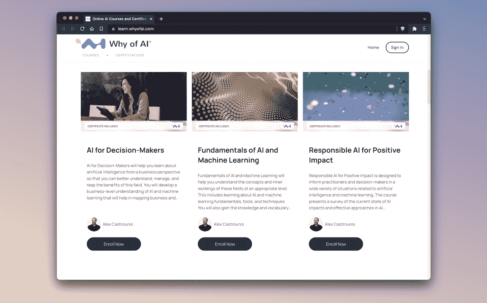

# 为了教授人工智能和机器学习，用正确的工具、课程和观点来满足学生

> 原文：<https://blog.paperspace.com/teach-machine-learning-alex-castrounis/>

[Alex Castrounis](https://www.whyofai.com/alex-castrounis) 是人工智能的 [Why 的创始人兼首席执行官，也是《人工智能对人和商业](https://www.whyofai.com/) 的 *[的作者。他还是西北大学凯洛格/麦考密克 MBA 项目的兼职人员，在那里他创建并教授该项目的核心人工智能和机器学习课程。](https://www.whyofai.com/ai-book)*

除了担任前 [INDYCAR 工程师](https://www.whyofai.com/blog/indycar-racing-to-business-success-using-ai-data)、竞赛策略师和数据科学家之外，Alex 在过去二十年中还为各种规模的企业(从初创公司到财富 100 强企业)提供建议，告诉他们如何使用数据、分析和技术来推动业务和客户的成功。

我们很高兴能够与 Alex 坐下来谈谈他通过在线课程、现场研讨会和西北大学 MBA 项目教授人工智能的丰富经验。

让我们开始吧！

***纸空间*** 。非常感谢您今天和我们连线。我们知道你在一段时间里一直在向处于不同学习阶段的人教授机器学习和人工智能。关于教 AI，你现在知道什么，你希望你在开始的时候就知道？

*。很棒的问题！这也是我的公司被命名为[AI](https://www.whyofai.com/)的原因之一！比如:AI 为什么会存在？AI 为什么重要？为什么人工智能是有益的和/或潜在有害的？为什么公司需要更多地了解 AI，并负责任地应用它？为什么个人需要获得 AI 素养和流畅度？诸如此类。*

*正确回答这些问题对于创建一个成功和负责任的人工智能愿景和战略至关重要，不管你是谁，也不管你有什么背景。*

*很多人工智能和机器学习教育都是非常技术性的，面向从业者，所以结果是大多专注于什么和如何。我在教学中的一个主要目标是重点关注“为什么”,以帮助人们理解这些技术如何应用于现实世界的问题、用例以及特定行业和业务职能中的应用。*

*对于我通常教授的观众来说，这往往比围绕机器学习算法、建模技术和其他相关技术主题的深层技术细节更重要。*

*

Why of AI is one of Castrounis' primary AI instruction avenues.* 

****纸空间*** 。你最喜欢的人工智能教材有哪些不是你自己的？你对其他人如何教授机器学习有特别的欣赏吗？*

**。我创作了大部分的教学材料，尽管我确实有一些自己不喜欢的。**

**对于那些想动手做 AI/ML 开发工作的人来说，我非常相信直接从 API 文档中学习。这可能包括语言、库、框架和平台。我认为没有比一头扎进去、亲自动手更好的学习方法了，尤其是学习如何直接从官方文档中阅读、理解和实现工作解决方案。**

**对于人工智能和机器学习领域最新最棒的研究和更新，arXiv 和 T2 的论文都是很好的资源。我也很喜欢内森·贝纳奇和伊恩·霍加斯的《人工智能状况报告》，以及斯坦福大学以人为中心的人工智能研究所(HAI)的《人工智能指数报告》[。](https://aiindex.stanford.edu/report/)**

**有一些很棒的交互式人工智能和机器学习工具可以帮助演示这些技术实际上可以做什么。用 Transformer 编写和 T2 的 OpenAI API 都是很好的例子，尽管还有很多其他的例子。**

**至于对其他人如何教授机器学习的欣赏，我真的很喜欢[两分钟论文](https://www.youtube.com/c/K%C3%A1rolyZsolnai)和 [Jay Alammar](https://jalammar.github.io/) 创造的许多伟大的机器学习可视化。**

**

Why of AI provides individual coursework options.** 

*****纸空间*** 。你会给第一次学习机器学习的人推荐什么？什么样的建议对刚起步的人有帮助？**

***。这真的取决于你对机器学习的目标是什么。如果你的学习目标是成为一名数据科学家、机器学习工程师或相关角色，我建议你学习 Python 这样的编程语言，以及 Jupyter Notebooks 这样广泛使用的 ide。在此基础上，我建议您开始尝试一些流行的工具，如 Pandas、Scikit-learn、PyTorch、Hugging Face 等等。***

***我也强烈建议找出你最感兴趣的机器学习领域，并以此为指导。机器学习是一个广阔的领域，横跨许多领域，如预测分析、个性化、推荐系统、计算机视觉、自然语言(NLP、NLG、NLU)、对话式人工智能等。我建议选择一个最有趣的机器学习子领域，并学习如何使用该领域的相关数据、工具和任务，而不是尝试一下子学会所有东西。***

***对于那些对学习更多用于商业和决策目的的机器学习感兴趣的人，我建议熟悉一下我所教的人工智能和机器学习的“景观”。这意味着减少对特定学习算法、建模技术和工具的关注，而是关注 AI/ML 的所有不同领域(例如，计算机视觉、自然语言、预测分析)以及每个领域中可以完成的许多任务(例如，对象检测、情感分析、语义相似性)。***

***这一切都是为了将输入(通常是数据)映射到输出(例如现实世界的结果和解决方案)。关键是要学会如何在高度有影响力和负责任的真实世界用例及应用中识别使用人工智能和机器学习的机会。***

******纸质空间*** 。除了机器学习学生，你还教商业学生。这将如何改变课程？当提到 ML 时，对商科学生(以及相关的教职员工)来说，什么是最重要的？***

***。我喜欢这个问题，它涉及到我在工作中花费了大量时间和精力来回答的一些问题。它不仅与我的西北大学凯洛格商学院 MBA 课程和学生有关，还与为什么进行人工智能培训和课程、我的书 *[人工智能与人和商业](https://www.whyofai.com/ai-book)* 以及我的总体咨询工作有关。***

**我的主要关注点是帮助商业人士和决策者更好地理解和应用负责任的人工智能和机器学习，以便为他们的组织、客户和用户创造积极的影响和利益。在许多情况下，我建议或教导那些可能没有任何技术专长的人。**

**挑战在于，对商业人士来说最重要的东西往往与从业者大相径庭。例如，从业者通常非常关注特定的学习算法和建模技术，如变压器、神经网络、随机森林、XGboost 等等。**

**然而，从商业角度来看，算法本身并不像潜在的结果和影响那样相关，例如 ROI、社会或环境影响、效率提高、客户保留或成本降低。同样，风险、财务和无形成本，以及与解决方案商业化或投入生产相关的其他关键考虑因素，如公平、安全和责任，也是至关重要的。**

**换句话说，商业人士通常希望知道他们如何在今天的特定行业或业务功能中使用人工智能和机器学习，包括他们如何快速开发真实世界的人工智能/人工智能用例及应用程序以实现某些目标，同时最大限度地降低和减轻风险。**

**教授商科学生和创建相关课程都是为了弥合技术差距，同时也帮助学生获得适当程度的 ML 读写能力、理解和欣赏。**

**

"图纸空间渐变...使学生能够直接投入到不受约束的开发工作中，而不是花费大量时间开发和构建定制的云环境。”

亚历克斯·卡斯特罗尼斯(Alex Castrounis)，人工智能为何的首席执行官** 

*****纸空间*** 。您提到您将 Paperspace 引入了您的课程，Paperspace 如何帮助您实现课程目标？**

***。在教授人工智能和机器学习时，我希望确保学习者不会受到缺乏数据存储或计算相关资源的限制。***

***因此，我认为 Paperspace Gradient platform 是一个很好的开发资源，在时间和成本方面促进了高效的学习。它使学生能够直接投入到不受约束的开发工作中，而不是花费大量时间开发和构建定制的云环境。由于此类环境的设置和管理可能非常耗时，并且需要基础架构专业知识和经验，因此拥有一个使这一切变得简单的环境会很方便。***

***梯度笔记本尤其是一个伟大的合作工具，学生执行快速原型和开发。拥有预安装了库和框架的基础环境来帮助加速开发工作是非常好的。学生还可以根据给定任务的需要轻松更改计算资源。***

***

A sample of Why of AI courses.*** 

******纸空间*** 。如果我们的读者想开始学习《为什么是人工智能》或你的其他课程，他们最好的入门方式是什么？他们有什么特别需要检查的吗？***

***。对于那些有兴趣开始他们的人工智能之旅的人，我们设计并构建了一个面向非从业者的指导方法，以理解并应用人工智能的原因。***

***请访问我们在[https://learn.whyofai.com](https://learn.whyofai.com)的学习平台，了解更多关于人工智能课程和认证的原因。在那里，个人可以直接注册课程和课程包，我们为五人或五人以上的团队提供折扣选项！***

***我们还提供现场研讨会和定制培训，读者可以在 https://www.whyofai.com/ai-training 了解更多。***

***对于那些 DIY 的人来说，人工智能的诞生源于我的研究和见解，这些研究和见解来自我的职业经历和我写这本书的过程， *[《人工智能与商业:一个更好的人类体验和商业成功的框架](https://www.whyofai.com/ai-book)* 》。对于那些喜欢用书的方式学习人工智能以及如何将人工智能用于商业的人来说，这绝对是一个很好的选择。***