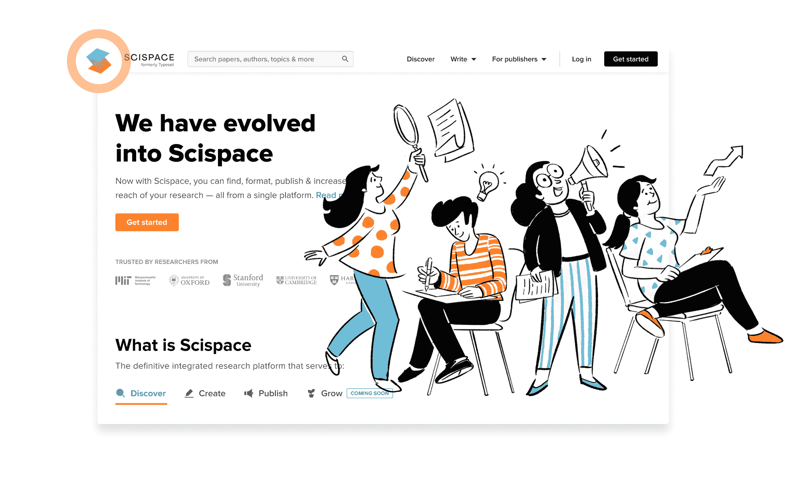
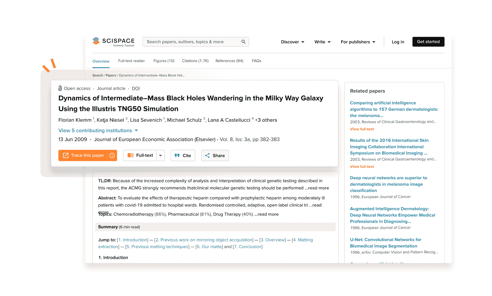
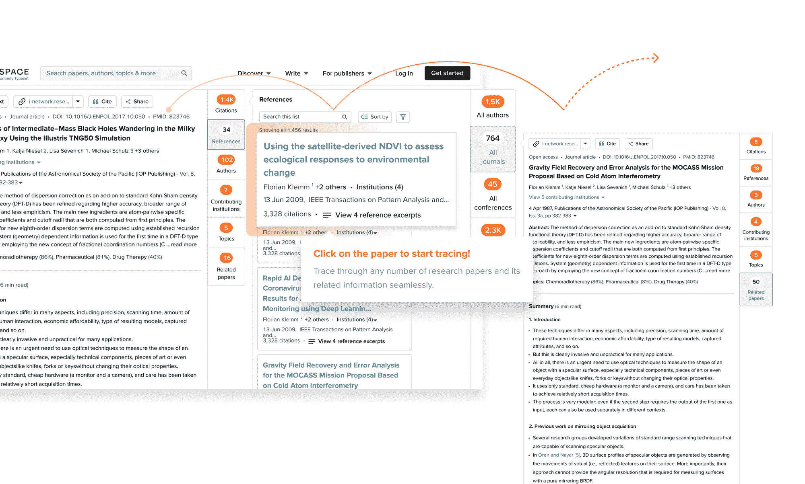

# 凭借海量数据集和尖端的自然语言处理技术，SciSpace 的一组 ML 研究人员正在为科学家和出版商构建下一代工具

> 原文：<https://blog.paperspace.com/scispace-nlp-tools-for-researchers-and-publishers/>

SciSpace(原名 Typeset)是一家软件公司，致力于让科学研究更具协作性和可访问性。

除了为研究人员提供有价值的工具来追踪科学文章的谱系之外，SciSpace 还是一个端到端的集成研究平台，具有现代化的工作流程，可以帮助学者毫不费力地撰写和发表研究。

我们很高兴有机会与 SciSpace 的高级研究科学家 Rohan Tondulkar 坐在一起，深入研究他的团队正在进行的一些机器学习工作。

我们开始吧！

***paper space***:SciSpace 是研究人员和出版商的平台。为了帮助我们的读者更好地理解产品，你能告诉我们一些你的用户的常见用例吗？

*:SciSpace 背后的想法是将研究生态系统中的每一个利益相关者——读者、研究人员、教授、出版商和大学——聚集在一个屋檐下，并为他们提供一套互联的应用程序，使科学知识和数据无缝地流动。*

*科学爱好者和研究人员依靠我们的 [Discover](https://typeset.io/discover/) 模块来搜索、访问和阅读科学手稿。我们的平台上有超过 2.7 亿篇来自不同领域的研究论文。结合强大的搜索过滤器和个性化推荐，我们使文献搜索变得更加简单快捷。*

*除此之外，学生和研究人员使用我们的 [Write](https://typeset.io/pricing/) 解决方案来创建、编辑、校对、排版和格式化他们的手稿。我们提供 30，000 多个期刊模板，使研究人员能够在几秒钟内根据最新的期刊指南格式化他们的手稿。*

*[出版商](https://typeset.io/for-publishers/)使用我们内置的 OJS 模块和自动化的 XML 优先制作工作流程来简化制作流程并提高其文章的可见性。*

*

SciSpace (formerly Typeset) is building ML-assisted tools for researchers and publishers.* 

****Paperspace*** :使用科学文献的一个令人畏惧的事情是，至少可以说，语料库是……庞大的。我们真正谈论的是什么样的规模？您每天都要处理什么样的数据集？*

****Tondulkar*** :我们每天都要处理海量数据集。我们允许用户搜索 2.7 亿篇研究文章以及每篇文章的元数据，如参考文献、引文等。总数达到数十亿个数据点。我们有近 5000 万个开放存取 pdf，每个任务都必须处理它们。我们开发的每一个功能都必须迎合这个庞大的数据。*

****Paperspace*** :你的职位是高级研究科学家——能告诉我们更多关于你的工作吗？你的团队正在应对什么样的挑战，这与公司更广泛的使命有什么关系？*

**:我们有一个由 Tirthankar Ghosal 博士领导的六人小型 ML 研究团队，他是来自 IIT 巴特那的博士，也是学术文档处理方面的专家。该团队旨在探索和部署各种 NLP 功能，以提高可发现性并使科学文章更容易消化。然后，研究团体能够从这些论文中获得更多价值，并更快地将这些点联系起来。**

**作为一名高级研究科学家，我有一个更广泛的角色，涵盖端到端的 ML 堆栈。我的职责包括研究和试验各种问题陈述，协调团队内部的工作，建立部署管道，解决可伸缩性问题，检查模型输出的质量，并为我们的模型提供服务。**

**我们的团队致力于许多独特而有趣的问题，包括生成研究文章的提取和抽象摘要。我们还建立语义搜索工具、推荐系统，并进行大规模引用分析。还有更多正在筹备中！**

**

Articles on SciSpace reference related works, citations, and more.** 

*****Paperspace*** :作为一家 GPU 云提供商，我们注意到人们对 NLP 用例及应用有着浓厚的兴趣。关于使用加速 GPU 计算来训练 NLP 模型，您能告诉我们些什么？**

*****Tondulkar*** :自从用于机器学习用例的 GPU 问世以来，我们也看到了 NLP 领域创新的激增。近年来，随着 GPU 在培训和部署过程中的易用性，这一数字才开始增加。各种 GPU 提供商，如 Paperspace、AWS 和 Google Cloud 等，在帮助研究人员以超快的速度训练和部署他们的模型方面发挥了重要作用。**

**在开发更强大的 GPU 的同时，NLP 模型(例如 [GPT-3](https://openai.com/api/) )的大小和性能也在增长。低成本的 GPU 使得大公司和小公司比以往任何时候都更容易使用和开发高性能的模型。这已经帮助各种基于人工智能/自然语言处理的初创公司成长起来，并且有着巨大的未来潜力，因为我们看到越来越多的用例以及问题陈述被 ML 解决。**

**

“我们的团队需要对各种问题陈述进行实验。这涉及到使用 PyTorch、TensorFlow、拥抱脸等训练大型深度学习模型。数百万个数据点。因此，我们需要一个可以扩展到多个用户和项目的平台。我们探索了许多最适合我们进行实验的选项——paper space、Google Colab、AWS Sagemaker 和 Vast.ai。

我们发现，对于我们这些研究人员来说，Paperspace 是最方便、最具成本效益的选择。Paperspace 通过允许选择 GPU/CPU 机器以及按需使用 GPU 来提供更多控制，这有助于显著优化成本。"

Rohan Tondulkar，SciSpace 高级研究科学家** 

*****纸空间*** :纸空间是如何进入画面的？您的团队开始使用 Paperspace 机器有什么特别的原因吗？**

*****Tondulkar*** :我们团队需要对各种问题语句进行实验。这涉及到使用 PyTorch、TensorFlow、拥抱脸等训练大型深度学习模型。数百万个数据点。因此，我们需要一个可以扩展到多个用户和项目的平台。我们探索了许多最适合我们进行实验的选项——paper space、Google Colab、AWS Sagemaker 和 Vast.ai。**

**我们发现，对于我们这些研究人员来说，Paperspace 是最方便、最具成本效益的选择。Paperspace 通过允许选择 GPU/CPU 机器以及按需使用 GPU 来提供更多控制，这有助于显著优化成本。**

**其他功能，如创建数据集和与 Git 集成，对我们也有好处。我们发现 Paperspace 中的环境稳定且易于设置。多亏了 Paperspace，我们可以可靠而系统地进行这些实验。**

*****Paperspace*** :在构建生产规模的 ML 应用程序时，你的团队遇到了哪些意想不到或意料之中的挑战？**

***:我们最大的挑战之一是获得良好的数据集来训练我们的模型。由于我们在一个利基空间中运作，很少有合适的数据集是公开可用的。此外，我们的模型必须在来自不同领域的研究文章上表现同样出色，这些领域包括人工智能、数学、物理、化学、医学等，这是一项非常具有挑战性的任务。模型经过严格的质量检查，以确保这一点。***

***从大型 ML 模型生成输出可能有点耗时。快速且经济高效地生成数百万篇研究文章的产出是一个巨大的挑战。***

******Paperspace*** :如果我们的读者想看看 SciSpace 并参与到社区中来，你会建议他们如何开始？***

*****Tondulkar*** :随意访问我们的网站， [typeset.io](https://typeset.io/) (我们的前身是 typeset.io)。在那里，您可以了解我们的所有产品。如果你想阅读一些关于你最喜欢的研究主题的最新研究，你可以从[主题](https://typeset.io/topics)页面开始。到目前为止，我们在这个平台上有大约 5000 万个全文 pdf。**

**您可以在 Twitter 上关注我们，地址为 [@Scispace_](https://mobile.twitter.com/scispace_) 。我们定期分享趋势研究论文的精选列表、开创性文章的摘要、研究写作和发布最佳实践，并积极与我们的研究人员和教授社区互动。您也可以查看我们的 [LinkedIn](https://in.linkedin.com/company/scispace) 页面，了解更多关于我们的工作文化、未来计划和其他计划。**

**

The Trace feature surfaces valuable information about scholarly articles.** 

*****Paperspace*** :还有什么你想大声喊出来的吗？**

***:一定要看看我们的痕迹功能。Trace 是我们的纸面文档发现引擎的新增功能，在业界是直观和独特的。你将能够深入钻研一个话题，而不会忘记你的进展。点击[这里](https://typeset.io/explore/papers/bert-pre-training-of-deep-bidirectional-transformers-for-3mez6kncl2)阅读最近一篇关于伯特的文章！***

****要了解更多关于 SciSpace 的信息，请务必查看 https://typeset.io/.****