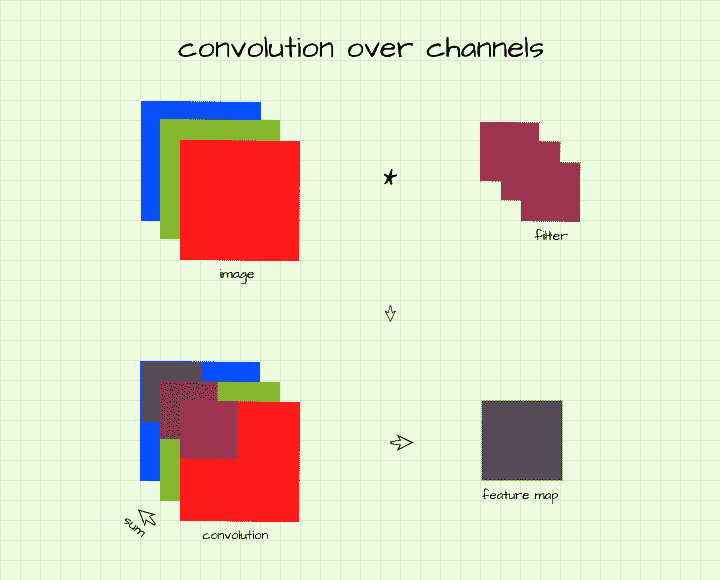
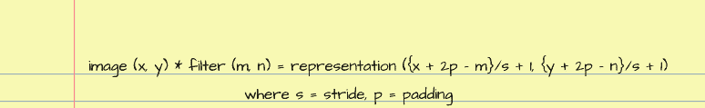
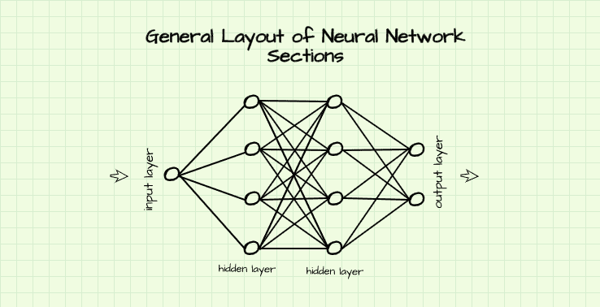
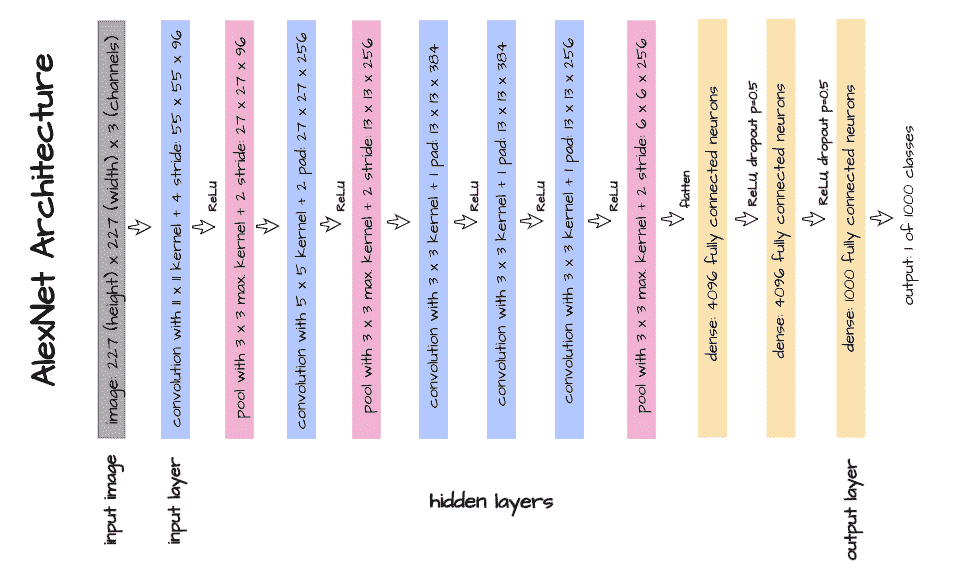

# 理解和解释卷积神经网络架构

> 原文：<https://blog.paperspace.com/understanding-interpreting-convolutional-neural-network-architectures/>

在对卷积、填充和汇集等卷积神经网络过程形成直觉后，自然的下一步是将它们以协同工作的方式组合在一起，以实现特定的目标。当所有这些过程放在一起，一个架构就产生了。

体系结构的配置在很大程度上决定了某个网络的性能。在本文中，我们将研究 CNN 架构，以了解图像从一层传递到另一层时，在空间维度上直到输出层会发生什么。

### 本文中使用的符号

指定矩阵/阵列尺寸的默认符号是从行数(高度)开始，到列数(宽度)，然后是通道数，最后是批量。按照这个符号，将指定 15 个大小为 250×320 像素的矩阵和 3 个通道`(250, 320, 3, 15)`。

然而，在本文中，我们将使用 PyTorch 表示法，从批量开始，到通道数，然后是行数，最后是列数。使用这种符号，上一段中的矩阵将被指定为`(15, 3, 250, 320)`。*请记住这一点*。

### 通道上的卷积

在以前的一篇文章中，我提到了如何使用卷积过程从图像中提取特征。为了便于说明，我使用了单通道图像(灰度)，即由单个像素阵列组成的图像。在大多数情况下，事实上在关于卷积神经网络的所有情况下，卷积运算被应用于具有多于一个通道的图像或一组特征图。

考虑打算对彩色图像执行卷积的情况。众所周知，彩色图像具有 3 个 RGB 通道(3 个阵列)，为了从该图像产生单个特征图(例如检测边缘)，需要具有相应数量通道的滤波器。



实质上，这意味着图像中的每个通道都有一个卷积滤波器，对应的卷积实例的结果在通道间相加，从而在特征图中产生单个像素。*用更专业的术语来说，为了产生单个特征图，使用* `*(3, 3, 3)*` *(3 通道，3 行，3 列)滤波器*对 `*(3, 6, 6)*` *(3 通道，6 行，6 列)图像进行卷积。按照相同的逻辑，如果想要从该图像产生 10 个特征图，那么需要 10 个`(3, 3, 3)`滤波器，即`(10, 3, 3, 3)`。*

### 滑动窗口操作和特征图尺寸

卷积和池化等滑动窗口操作构成了卷积神经网络中的绝大多数操作。值得记住的是，这些滑动窗口操作经常会修改图像/特征图的尺寸。其中一些修改是有意的，而另一些是使用填充来控制生成的表示发生什么的副产品。

正如我在这篇[文章](https://blog.paperspace.com/padding-in-convolutional-neural-networks/)中提到的，我来解释一下，如果大小为`(m, n)`的过滤器/内核滑过大小为`(x, y)`的图像，那么大小为`(x-m+1, y-n+1)`的图像就产生了。现在，当这些运算中涉及大于 1 的步长和填充时，该公式可以重写为:



因此，如果使用步幅 2 在`(55, 55)`图像上滑动`(3, 3)`滤镜，则产生大小为`(27, 27)` (({55-3}/2 + 1，{55-3}/2 + 1))的表示。

### 激活功能

激活函数是神经网络结构中的常见现象，因为它们在网络性能中起着至关重要的作用。它们的目的是增加网络本身的非线性，因为它们迫使网络学习输入和输出之间更复杂的映射/关系*(在下一篇文章中有更多介绍)*。

在卷积神经网络架构的上下文中，最常用的是校正线性单元激活函数 ReLU 或它的一些其他变体(参数 ReLU，Leaky-ReLU)。此激活功能实质上是检查要素地图中的像素，如果像素值大于零，则保持不变；如果像素值小于零(负值)，则将其设置为零。更简单地说，ReLU 激活功能关闭特征图中不太重要的像素。


### 卷积神经网络中的正则化

正规化指的是机器学习中使用的技术，以防止模型过度拟合。在深度学习中，两种主要的正则化技术被称为批归一化和丢失。

批量标准化通过标准化使用它的层中的所有输入来工作，它具有防止神经网络中的内部协变量变化和加速模型训练的独特优势。一些研究认为它最适合卷积层。

另一方面，dropout 通过在应用它的层中随机置零某些神经元来工作，通过这样做，它在训练期间为每批数据模拟稍微不同的网络架构，从而防止本地网络过度拟合数据。一些文献表明它在线性图层上效果最好。

### 神经网络体系结构中的章节

神经网络由几层组成。这些层可以分为三个部分，如输入层，隐藏层和输出层。



顾名思义，输入层是神经网络的一部分，数据通过它输入。另一方面，隐藏层是网络中位于输入层和输出层之间的层。网络的这一部分(隐藏层)负责数据的计算和数值转换，而输出层是网络的最终层，在这里获得结果/输出。

### AlexNet 架构

AlexNet 是 Alex Krizhevsky、Ilya Sutskever 和 Geoffery Hinton 于 2012 年设计的卷积神经网络架构( [Krizhevsky](https://proceedings.neurips.cc/paper/4824-imagenet-classification-with-deep-convolutional-neural-networks.pdf) *[等](https://proceedings.neurips.cc/paper/4824-imagenet-classification-with-deep-convolutional-neural-networks.pdf)* [，2012](https://proceedings.neurips.cc/paper/4824-imagenet-classification-with-deep-convolutional-neural-networks.pdf) )。虽然当时有点过时，但这种架构在当时是相当具有突破性的，因为它有助于形成常见卷积神经网络最佳实践的基础，例如 ReLU 非线性的主要使用，以及网络性能随着深度的增加而提高的断言。它也非常简单，易于理解和解释。



使用上面看到的 AlexNet 架构的图形表示，让我们尝试使用 PyTorch 复制这个架构。此后，我们将对每个图层进行遍历，以了解图像如何从输入图层中的原始像素到隐藏图层中的特征地图，最后到输出图层中的分类向量。

```py
class AlexNet(nn.Module):
    def __init__(self):
      super().__init__()
      #  instantiating network classes
      self.conv1 = nn.Conv2d(3, 96, (11, 11), stride=4)
      self.pool1 = nn.MaxPool2d((3, 3), stride=2)
      self.conv2 = nn.Conv2d(96, 256, (5, 5), padding=2)
      self.pool2 = nn.MaxPool2d((3, 3), stride=2)
      self.conv3 = nn.Conv2d(256, 384, (3, 3), padding=1)
      self.conv4 = nn.Conv2d(384, 384, (3, 3), padding=1)
      self.conv5 = nn.Conv2d(384, 256, (3, 3), padding=1)
      self.pool5 = nn.MaxPool2d((3, 3), stride=2)
      self.dense1 = nn.Linear(9216, 4096)
      self.dense2 = nn.Linear(4096, 4096)
      self.dense3 = nn.Linear(4096, 1000)
      self.dropout = nn.Dropout(p=0.5)

    def forward(self, x):
      #-------------------
      #  INPUT IMAGE(S)
      #-------------------
      input = x.view(-1, 3, 227, 227) # -> (3, 227, 227)

      #-------------------
      #  INPUT LAYER
      #-------------------
      #  convolution -> activation -> pooling
      layer_1 = self.conv1(x) # -> (96, 55, 55)
      output_1 = F.relu(layer_1)
      output_1 = self.pool1(output_1) # -> (96, 27, 27)

      #-------------------
      #  HIDDEN LAYERS
      #-------------------
      #  convolution -> activation -> pooling
      layer_2 = self.conv2(output_1) # -> (256, 27, 27)
      output_2 = F.relu(layer_2)
      output_2 = self.pool2(output_2) # -> (256, 13, 13)

      #  convolution -> activation
      layer_3 = self.conv3(output_2) # -> (384, 13, 13)
      output_3 = F.relu(layer_3)

      #  convolution -> activation
      layer_4 = self.conv4(output_3) # -> (384, 13, 13)
      output_4 = F.relu(layer_4)

      #  convolution -> activation -> pooling
      layer_5 = self.conv5(output_4) # -> (256, 13, 13)
      output_5 = F.relu(layer_5)
      output_5 = self.pool5(output_5) # -> (256, 6, 6)

      #  flattening feature map
      flattened = output_5.view(-1, 9216) # (256*6*6 = 9216)

      #  full connection -> activation -> dropout
      layer_6 = self.dense1(flattened) # -> (1, 4096)
      output_6 = F.relu(layer_6)
      output_6 = self.dropout(output_6)

      #  full connection -> activation -> dropout
      layer_7 = self.dense2(layer_6) # -> (1, 4096)
      output_7 = F.relu(layer_7)
      output_7 = self.dropout(output_7)

      #--------------------
      # OUTPUT LAYER
      #--------------------
      layer_8 = self.dense3(layer_7) # -> (1, 1000)
      output_8 = torch.sigmoid(layer_8)
      return output_8
```

该架构通过首先在 init 方法中实例化所需的卷积、池化、线性和丢弃方法来实现。此后，网络按正向方法组合在一起。这个实现也可以使用 PyTorch 顺序方法来完成，但是我决定不这样做，因为解释起来会很麻烦。您可能会发现上面的代码注释有点多，这是为了便于理解和解释，下面提供了 forward 方法中所有层的遍历。

#### 使用的神经网络方法

在这一节中，我们将仔细研究在 init 方法中实例化的神经网络方法。每个方法都被恰当地命名，以使它与 forward 方法中使用它的层相匹配。

##### 自我，conv1

这是一种二维卷积方法，它接收 3 个通道的图像或特征图，并使用`(11, 11)`过滤器从中产生 96 个通道，过滤器在每个实例后取 4 个像素的步长。

##### 自助池 1

这是一种二维最大池方法，它利用一个`(3, 3)`过滤器/内核，有效地将特征图的尺寸向下采样一半，因为它利用了 2 的步幅。这是一个重叠池的例子，因为内核的大小不等于它的跨度(3！= 2).

##### 自我，conv2

这是一种二维卷积方法，它接收 96 个通道的特征图，并使用默认步长为 1 的`(5, 5)`滤波器从这些特征图中产生 256 个通道，两层填充意味着所产生的通道不会缩减尺寸。

##### 自助池 2

就像 self.pool1 一样，这是一种二维最大池化方法，它利用一个`(3, 3)`过滤器/内核来有效地将特征地图下采样一半大小，因为它利用了 2 的跨距。

##### 自编自编自编自编自编自编自编自编自编自编自编自编自编自编自编自编自编自编自编自编自编自编自编自编自编自编自编自编

这是一种二维卷积方法，它接收 256 个通道的特征图，并使用默认步幅为 1 的`(3, 3)`滤波器从这些特征图中产生 384 个通道，以及单个填充层，这意味着所产生的通道不会缩减尺寸。

##### 自编自编自编自编自编自编自编自编自编自编自编自编自编自编自编自编自编自编自编自编自编自编自编自编自编自编自编自编

这是一种二维卷积方法，它接收 384 个通道的特征图，并再次使用默认步幅为 1 的`(3, 3)`滤波器从这些特征图中产生 384 个通道，并且具有单个填充层，这意味着所产生的表示不会减少维度。

##### 自我，conv5

self.conv5 似乎与 self.conv3 相反，它是一种二维卷积方法，可接收 384 个通道的特征图，并使用默认步幅为 1 的`(3, 3)`滤波器从中产生 256 个通道，以及单个填充层，这意味着所产生的通道不会缩减尺寸。

##### 自助游泳池 5

就像 self.pool1 和 2 一样，这是一种二维最大池化方法，它利用一个`(3, 3)`过滤器/内核有效地将特征图的大小向下采样一半，因为它利用了步长 2。

##### 自密实 1

这是一个线性方法，它接收 9216 个元素的向量(大小为`(1, 9216)`)并将它们连接到另一个 4096 个元素的向量(大小为`(1, 4096)`)。

##### 自我浓缩 2

这是一个线性方法，它接收 4096 个元素的向量(大小为`(1, 4096)`)并将它们连接到另一个 4096 个元素的向量(大小为`(1, 4096)`)。

##### 自我浓缩 3

这是一个线性方法，它接收 4096 个元素的向量(大小为`(1, 4096)`)并将它们连接到另一个 1000 个元素的向量(大小为`(1, 1000)`)。

##### 自我辍学

这是一种用于控制过拟合的辍学正则化方法，通过选择以 50%的概率忽略随机选择的神经元的输出。

#### 输入图像

正演方法中的参数“x”称为输入图像。这是为了分类目的而传递到网络的图像或一批图像。由于 AlexNet 架构指定了大小为 227 像素 x 227 像素的彩色输入图像`(3, 227, 227)`，输入被视为大小为`(-1, 3, 227, 227)`的张量。第一维考虑了批量大小，并被指定为`-1`，以允许网络接受任何批量大小(通常在训练期间是 8 的倍数，在生产中低至 1)。

#### 输入层

在层 1 中，由于我们试图使用`(11, 11)`滤波器产生 96 个特征图，大小为`(3, 227, 227)`的单个输入图像被大小为`(3, 11, 11)`的 96 个步长=4 的滤波器卷积，从而产生大小为`(96, 55, 55)`的特征图。如公式`*({x + 2p - m}/s + 1, {y + 2p - n}/s + 1)*` *所示，图像的尺寸从`(227, 227)`减小到`(55, 55)`。请注意，填充保留为默认值 0，因此本例中 p=0。*

接下来，使用 ReLU 非线性来激活所产生的特征图，并使用`(3, 3)`内核和步幅=2 来将它们下采样到`(96, 27, 27)`中。特征图变成了 27 x 27 像素，因为使用了带有`(3, 3)`内核的重叠池，步长为 2。再次，记住 *`({x + 2p - m}/s + 1, {y + 2p - n}/s + 1)`。*

#### 第二层

在层 2 中，将使用`(5, 5)`过滤器从来自层 1(大小`(96, 27, 27)`)的特征图中产生 256 个特征图。为此，使用了 256 个`(96, 5, 5)`大小的过滤器。由于填充设置为 2，生成的特征图不会缩小，并作为`(256, 27, 27)`返回。此后，激活被完成，随后用`(3, 3)`滤波器和步幅=2 合并，产生大小为`(256, 13, 13)`的特征图。

#### 第三层

在层 3 中，将使用`(3, 3)`过滤器从层 2 的输出(大小`(256, 13, 13)`)中产生 386 个特征地图。为此，使用了 386 个`(256, 5, 5)`大小的过滤器。由于填充设置为 1，生成的特征地图保持相同的大小。激活后没有池。

#### 第 4 层

关于层 4，将使用`(3, 3)`滤波器从层 3 的输出(大小`(386, 13, 13)`)产生 386 个特征图。为此，使用了 386 个`(386, 5, 5)`大小的过滤器。由于填充设置为 1，生成的特征地图保持相同的大小。同样，池化不是在激活后完成的，如网络体系结构中所规定的。

#### 第五层

第 5 层看起来与第 3 层相反，因为将使用`(3, 3)`过滤器从第 4 层的输出(大小`(386, 13, 13)`)产生 256 个特征地图。为此，使用了 256 个`(386, 5, 5)`大小的过滤器。由于填充设置为 1，生成的特征地图保持相同的大小。在激活后进行池化，以将特征映射下采样到`(256, 6, 6)`。

#### 第六层

就在第 6 层之前，特征地图被展平，因为它们将被送入仅接受矢量的密集层。为了展平特征图，从第 5 层作为输出返回的特征图的所有维度被相乘(256*6*6 = 9216)并被整形为向量(大小`(1, 9216)`)。这个向量然后被馈送到第 6 层，以产生另一个 4096 个元素的向量(大小`(1, 4096)`)。然后，生成的矢量被激活，并在其后应用漏失。

#### 第 7 层

从层 6 作为输出返回的 4096 个元素向量被馈送到该层，该层再次产生相同数量元素的另一个向量。在再次应用 dropout 之前，会激活 ReLU。

#### 输出层

第 8 层，也称为输出层，从第 7 层接收 4096 个元素向量，并产生 1000 个元素向量(大小`(1, 1000)`)作为最终输出。由于在包含 1000 个类的 ImageNet 数据集上使用了 AlexNet 架构，因此产生了 1000 个元素的向量作为最终输出。然后，将 sigmoid 激活应用于最终输出，以返回概率。

### 卷积神经网络中的参数

神经网络中的参数是将神经元从一层连接到另一层的偏差和权重。这个定义更适合于线性层中的参数，对于卷积层中的参数，参数可以说是卷积层中包含的滤波器中的元素总数(这些是权重)及其偏差。

确定某个神经网络架构中存在的参数数量是一件常见的事情。例如，具有 3 个滤波器的单个卷积层，每个滤波器具有 3 个信道和大小`(3, 3)`，总共具有 3 个偏差(每个滤波器一个)和 81 个权重(3*3*3*3)，导致总共 84 个参数。

利用这些知识，让我们试着确定上面 AlexNet 架构中的参数数量。

| 层 | 砝码 | 偏见 | 因素 |
| --- | --- | --- | --- |
| 第一层 | 11x11x3x96 = 34,848 | Ninety-six | Thirty-four thousand nine hundred and forty-four |
| 第二层 | 5x5x96x256 = 614，400 | Two hundred and fifty-six | Six hundred and fourteen thousand six hundred and fifty-six |
| 第三层 | 3x3x256x384 = 884,736 | Three hundred and eighty-four | Eight hundred and eighty-five thousand one hundred and twenty |
| 第 4 层 | 3x3x384x384 = 1,327,104 | Three hundred and eighty-four | One million three hundred and twenty-seven thousand four hundred and eighty-eight |
| 第五层 | 3x3x384x256 = 884,736 | Two hundred and fifty-six | Eight hundred and eighty-four thousand nine hundred and ninety-two |
| 第六层 | 9216x4096 = 37，748，736 | Four thousand and ninety-six | Thirty-seven million seven hundred and fifty-two thousand eight hundred and thirty-two |
| 第 7 层 | 4096x4096 = 16，777，216 | Four thousand and ninety-six | Sixteen million seven hundred and eighty-one thousand three hundred and twelve |
| 第八层 | 4096x1000 = 4,096,000 | One thousand | Four million and ninety-seven thousand |
| **总计** |  |  | **62378344** |

从上表可以看出，AlexNet 架构总共有大约 6200 万个参数。使用下面的函数可以得到相同的结果。

```py
def number_of_parameters(network):
    """
    This model derives the number of parameters
    in a PyTorch neural network architecture
    """
    params = []
    #  deriving parameters in the network
    parameters = list(network.parameters())

    for parameter in parameters:
      #  deriving total parameters per layer
      total = parameter.flatten().shape[0]
      params.append(total)

    return sum(params)
```

```py
#  passing the AlexNet class to the function
number_of_parameters(AlexNet())
```

输出:
62378344

### 结束语

在本文中，我们可以看看卷积神经网络中的大多数常见过程，以及如何使用 AlexNet 架构将它们拼凑在一起以形成一个架构，用于演示目的。此后，我们检查了在原始论文中实现的 AlexNet 中图像从一层到另一层发生了什么。

还有更复杂的体系结构，但是其中的基本思想是一样的。希望这是理解和解释卷积神经网络架构的一个很好的起点。