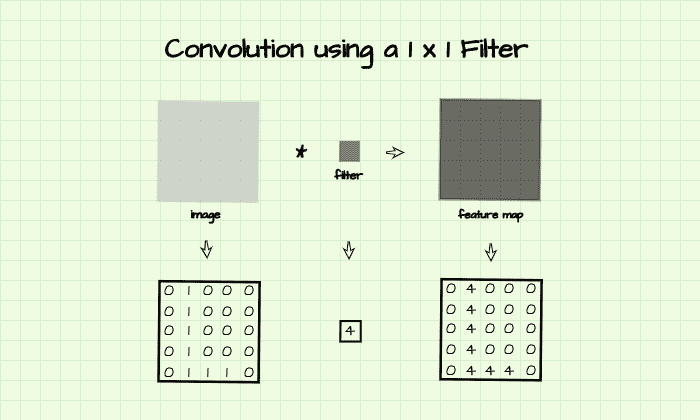

# 网络中的网络:1×1 卷积层的效用

> 原文：<https://blog.paperspace.com/network-in-network-utility-of-1-x-1-convolution-layers/>

下采样在卷积神经网络中是一个有益的过程，因为它有助于逐步管理网络中存在的像素/数据量，从而有助于管理训练期间的计算时间。正如我们现在所知道的，卷积层中的特征图是 4 维的，池化允许我们沿着高度和宽度维度向下采样。也可以通过称为 1×1 卷积的过程沿信道维度进行下采样。

在本文中，我们不仅将 1 x 1 卷积作为一种下采样工具，还将研究它在卷积神经网络中的多种用途。

```py
#  article dependencies
import torch
import torch.nn as nn
import torch.nn.functional as F
import time
```

### 1×1 卷积的概念

在论文《网络中的网络》中首次介绍([林敏](https://arxiv.org/abs/1312.4400)*等* [，2013](https://arxiv.org/abs/1312.4400) )，1×1 卷积是使用只有一行一列的滤波器进行卷积运算的过程。本质上，它是使用一个标量值(一个单一的数字)而不是一个典型的卷积层矩阵来执行卷积的过程，因此它基本上不提取特征。

用更专业的术语来说，1×1 卷积可以说是特征图的逐像素加权，因为每个像素乘以一个数，而不考虑相邻像素。在下图中，使用给定的过滤器对矩阵执行 1 x 1 卷积。所得到的特征图是原始矩阵的表示，其像素值是原始矩阵的 4 倍，因此原始图像被认为已经使用滤波器加权了 4 倍。



The process of 1 x 1 convolution.

### 1 x 1 卷积和降维

随着卷积神经网络变得更深，其层中的通道/特征图的数量逐渐增加。事实上，在一个中间卷积图层中有多达 512 个要素地图并不罕见。

如何控制要素地图的数量？让我们假设想要建立一个更深的网络，但是在中间层中已经有 512 个特征图，这被认为是过多的，我们可以很容易地应用 1 x 1 卷积来将特征图的数量减少到 32，然后继续添加更多的卷积层。例如，如果在卷积层中有`(512, 12, 12)` (512 个表示，每个大小为 12 像素乘 12 像素)特征图，我们可以简单地应用`(32, 512, 1, 1)` (32 个 1×1 卷积过滤器，每个具有 512 个通道)过滤器来将特征图的数量减少到 32，从而产生如下所示的`(32, 12, 12)`特征图。

```py
#  output from an intermediate layer
intermediate_output = torch.ones((512, 12, 12))

#  1x1 convolution layer
conv_1x1 = nn.Conv2d(512, 32, 1)

#  producing a downsampled representation 
downsampled = conv_1x1(intermediate_output)
downsampled.shape

#  output
>>>> torch.Size([32, 12, 12])
```

理论上，上述过程也可以使用常规的卷积滤波器来完成，但是不同之处在于特征将不会跨通道被汇总；相反，新的特征将被学习。由于 1 x 1 卷积只是单个像素的加权，而不考虑相邻像素，然后是跨通道求和，因此可以说是一种通道池。因此，生成的 32 个要素地图将是图层中所有 512 个要素地图的“汇总”。

最后，使用常规卷积滤波器的下采样在计算上更加昂贵。例如，假设一个人想要使用`(3, 3)`滤波器从 512 个特征图向下采样到 32 个特征图，这将产生 147，488 个参数(512*32*3*3 权重+ 32 偏差),而使用`(1, 1)`滤波器则产生 16，416 个参数(512*32*1*1 权重+ 32 偏差)。

```py
#  1x1 convolution layer
conv_1x1 = nn.Conv2d(512, 32, 1)

#  3x3 convolution layer
conv_3x3 = nn.Conv2d(512, 32, 3, padding=1)

#  deriving parameters in the network
parameters_1x1 = list(conv_1x1.parameters())
parameters_3x3 = list(conv_3x3.parameters())

#  deriving total number of parameters in the (1, 1) layer
number_of_parameters_1x1 = sum(x.numel() for x in parameters_1x1)
#  output
>>>> 16,416

#  deriving total number of parameters in the (3, 3) layer
number_of_parameters_3x3 = sum(x.numel() for x in parameters_3x3)
#  output
>>>> 147,488
```

Comparing total number of parameters.

参数的差异也转化为使用(1，1)滤波器进行下采样的计算速度比使用(3，3)滤波器进行相同处理快大约 23 倍。

```py
#  start time
start = time.time()

#  producing downsampled representation 
downsampled = conv_1x1(intermediate_output)

#  stop time
stop = time.time()

print(round(stop-start, 5))
#  output
>>>> 0.00056
```

Timing (1, 1) convolution.

```py
#  start time
start = time.time()

#  producing downsampled representation 
downsampled = conv_3x3(intermediate_output)

#  stop time
stop = time.time()

print(round(stop-start, 5))
#  output
>>>> 0.01297
```

Timing (3, 3) convolution.

### 1 x 1 卷积的附加非线性

由于 ReLU 激活通常遵循 1 x 1 卷积层，我们可以本质上包括它们(1 x 1 卷积层),而不仅仅是为了它们带来的额外 ReLU 非线性而执行维度缩减。例如，可以使用`(512, 512, 1, 1)` (512 个 1×1 卷积滤波器，每个滤波器具有 512 个通道)滤波器对来自前一部分的尺寸为`(512, 12, 12)`的特征图进行卷积，以再次产生`(512, 12, 12)`特征图，所有这些都只是为了利用随后的 ReLU 非线性。

为了更好地说明，考虑下面代码块中的示例 ConvNet，第 3 层是一个 1 x 1 卷积层，它返回与第 2 层中的(3，3)卷积相同数量的特征映射。在这种情况下，1×1 卷积层不是冗余的，因为它伴随着网络中不存在的 ReLU 激活功能。这是有益的，因为附加的非线性将进一步迫使网络学习更复杂的输入到输出的映射，从而使网络能够更好地概括。

```py
class ConvNet(nn.Module):
  def __init__(self):
    super().__init__()
    self.network = nn.Sequential(
        #  layer 1
        nn.Conv2d(1, 3, 3, padding=1),
        nn.MaxPool2d(2),
        nn.ReLU(),
        #  layer 2
        nn.Conv2d(3, 8, 3, padding=1),
        nn.MaxPool2d(2),
        nn.ReLU(),
        #  layer 3
        nn.Conv2d(8, 8, 1),
        nn.ReLU() #  additional non-linearity
    )

  def forward(self, x):
    input = x.view(-1, 1, 28, 28)
    output = self.network(input)
    return output
```

### 使用 1 x 1 卷积替换线性图层

设想为 10 类多类分类任务构建一个卷积神经网络架构。在经典的卷积神经网络体系结构中，卷积层充当特征提取器，而线性层分阶段对特征图进行矢量化，直到返回包含每个类别置信度得分的 10 元素向量表示。线性图层的问题在于，在训练过程中，它们很容易过度拟合，需要将丢失正则化作为缓解措施。

```py
class ConvNet(nn.Module):
  def __init__(self):
    super().__init__()
    self.conv1 = nn.Conv2d(1, 3, 3, padding=1)
    self.pool1 = nn.MaxPool2d(2)
    self.conv2 = nn.Conv2d(3, 64, 3, padding=1)
    self.pool2 = nn.MaxPool2d(2)
    self.linear1 = nn.Linear(3136, 100)
    self.linear2 = nn.Linear(100, 10)

  def forward(self, x):
    input = x.view(-1, 1, 28, 28)

    #-----------
    # LAYER 1
    #-----------
    output_1 = self.conv1(input)
    output_1 = self.pool1(output_1)
    output_1 = F.relu(output_1)

    #-----------
    # LAYER 2
    #-----------
    output_2 = self.conv2(output_1)
    output_2 = self.pool2(output_2)
    output_2 = F.relu(output_2)

    #  flattening feature maps
    output_2 = output_2.view(-1, 7*7*64)

    #-----------
    # LAYER 3
    #-----------
    output_3 = self.linear1(output_2)
    output_3 = F.relu(output_3)

    #--------------
    # OUTPUT LAYER
    #--------------
    output_4 = self.linear2(output_3)

    return torch.sigmoid(output_4)
```

Classic convnet architecture with linear layers.

结合 1×1 卷积，可以通过下采样特征图的数量直到它们与手头任务中的类的数量相同(在这种情况下是 10)来完全去除线性层。接下来，返回每个特征图中所有像素的平均值，以产生包含每个类别的置信度得分的 10 个元素的向量(*这个过程被称为全局平均池，在下一篇文章*中对此有更多介绍)。

```py
class ConvNet(nn.Module):
  def __init__(self):
    super().__init__()
    self.conv1 = nn.Conv2d(1, 3, 3, padding=1)
    self.pool1 = nn.MaxPool2d(2)
    self.conv2 = nn.Conv2d(3, 64, 3, padding=1)
    self.pool2 = nn.MaxPool2d(2)
    self.conv3 = nn.Conv2d(64, 32, 1) # 1 x 1 downsampling from 64 channels to 32 channels
    self.conv4 = nn.Conv2d(32, 10, 1) # 1 x 1 downsampling from 32 channels to 10 channels
    self.pool4 = nn.AvgPool2d(7) # deriving average pixel values per channel

  def forward(self, x):
    input = x.view(-1, 1, 28, 28)

    #-----------
    # LAYER 1
    #-----------
    output_1 = self.conv1(input)
    output_1 = self.pool1(output_1)
    output_1 = F.relu(output_1)

    #-----------
    # LAYER 2
    #-----------
    output_2 = self.conv2(output_1)
    output_2 = self.pool2(output_2)
    output_2 = F.relu(output_2)

    #-----------
    # LAYER 3
    #-----------
    output_3 = self.conv3(output_2)
    output_3 = F.relu(output_3)

    #--------------
    # OUTPUT LAYER
    #--------------
    output_4 = self.conv4(output_3)
    output_4 = self.pool4(output_4)
    output_4 = output_4.view(-1, 10)

    return torch.sigmoid(output_4)
```

Modern convnet architecture with 1 x 1 convolution layers. 

### 结束语

在本文中，我们研究了 1 x 1 卷积及其在卷积神经网络中的各种用途。我们研究了该过程本身，以及它如何被用作降维工具、作为额外非线性的来源以及作为在 CNN 架构中排除线性层和减轻过拟合问题的手段。这个过程是卷积神经网络体系结构的几个主要部分，绝对是一个需要正确掌握和理解的概念。