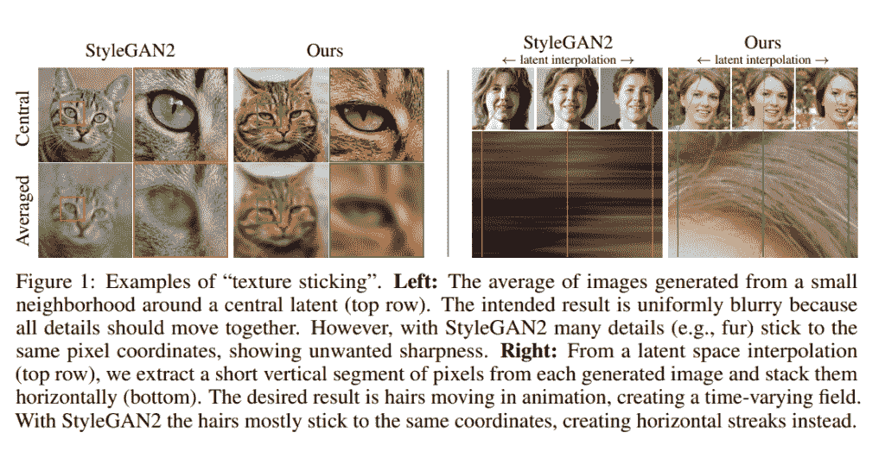
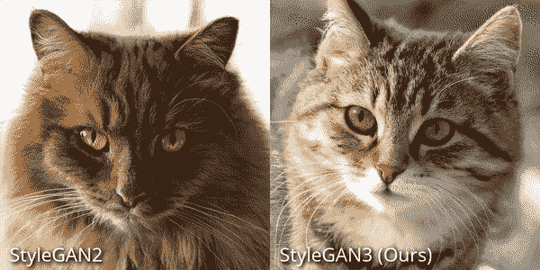
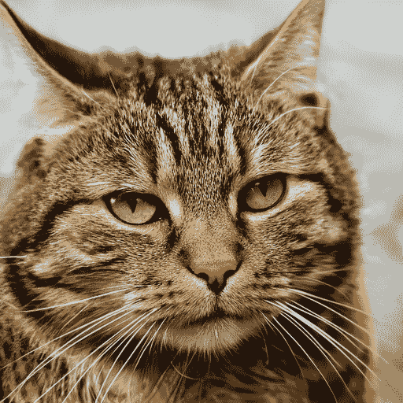
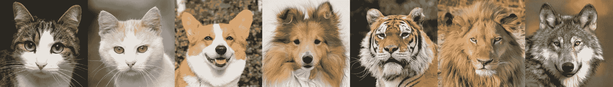
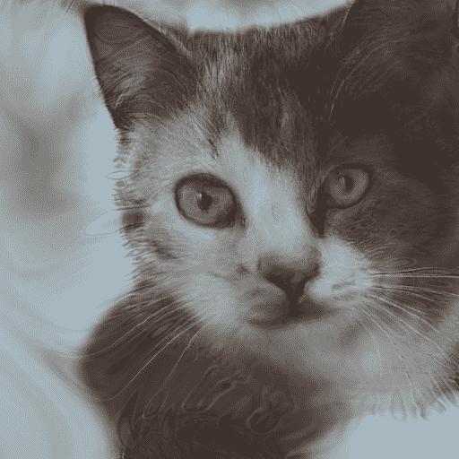

# 在渐变笔记本上运行 StyleGAN3

> 原文：<https://blog.paperspace.com/stylegan3-gradient-notebooks/>

更新于 2022 年 8 月 17 日

最近于 10 月 12 日发布的 StyleGAN3 在深度学习社区引起了很多兴奋，这是有充分理由的！多年来，StyleGAN2(及其各种分支，如 [StyleGAN2 与 ADA](https://github.com/NVlabs/stylegan2-ada) 和 [StarGAN-v2](https://github.com/clovaai/stargan-v2) )一直主导着深度学习的图像生成领域。

StyleGAN2 具有无与伦比的生成高分辨率(1024x1024)图像的能力。这种能力已经在无数的项目中得到应用，比如非常受欢迎的 [FaceApp](https://www.faceapp.com/) 或者学术项目[这个 X 不存在](https://thisxdoesnotexist.com/)。

StyleGAN2 还具有极大的通用性，这意味着它能够在任何符合其简单使用要求的图像数据集上表现良好。得益于这种高质量和易用性的结合，StyleGAN2 已成为需要生成新颖图像的任务的首选型号。

随着 StyleGAN3 的发布，这种情况可能会有所改变。

# StyleGAN3 有什么新特性？

### 在后台

Nvidia 实验室的团队在发布 StyleGAN3 之前有许多有趣的问题要解决。

在人类中，信息的处理方式使得感知图像的子特征能够分层转换。正如作者在[sync](https://syncedreview.com/2021/10/13/deepmind-podracer-tpu-based-rl-frameworks-deliver-exceptional-performance-at-low-cost-122/)[[1](https://syncedreview.com/2021/10/13/deepmind-podracer-tpu-based-rl-frameworks-deliver-exceptional-performance-at-low-cost-122/)所说:

> 当人的头部转动时，头发和鼻子等子特征也会相应地移动。大多数 GAN 发生器的结构是相似的。低分辨率特征通过上采样层进行修改，通过卷积进行局部混合，并且通过非线性引入新的细节



[Source](https://nvlabs.github.io/stylegan3/)

尽管有这种明显的相似性，但事实并非如此。目前，使用典型 GAN 发生器架构的图像合成以非分级方式创建图像。在 StyleGAN2 和其他图像生成器 GAN 架构中，精细细节定位由“纹理粘连”决定，而不是由粗糙特征控制精细特征的存在和位置这是细节被锁定到从训练中继承的像素坐标的地方。

消除这种混叠效应是 StyleGAN3 开发的首要任务。为此，他们首先确定 StyleGAN2 中的信号处理是问题所在。

在生成器中，由于走样的影响，非预期的位置引用被绘制到中间层上。因此，StyleGAN2 中没有直接的机制来强制生成器以严格的分层方式合成图像。该网络将总是放大任何混叠的效果，并且在多个尺度上组合该效果之后，使得纹理主题固定到像素级坐标。[ [2](https://nvlabs-fi-cdn.nvidia.com/stylegan3/stylegan3-paper.pdf)

为了解决这个问题，他们重新设计了无别名网络。这是通过考虑连续域中这种混叠的影响并对结果进行低通滤波来抑制这种混叠而实现的。在实践中，这允许在所有层中执行子像素平移和旋转的连续等变——这意味着可以在 StyleGAN3 中以相同的效率生成细节，而不管它们的位置，并消除任何“纹理粘连”的影响

### 有什么改进？

StyleGAN 架构上的混叠效应的消除大大提高了模型的效率，并使其潜在的用例多样化。

消除混叠效应对模型生成的图像有明显的影响。混叠直接阻碍了分层信息上采样的形成。它还消除了任何“纹理粘连”的存在



[Source](https://nvlabs.github.io/stylegan3/)

随着更精细的细节不再受到粗糙细节的物理位置的限制，StyleGAN3 的内部图像表示现在使用坐标系来构建，该坐标系引导细节信息适当地附着到底层表面。这一增加允许进行显著的改进，特别是在用于生成视频和动画的模型中。

最后，StyleGAN3 在完成所有这些工作的同时，还会生成令人印象深刻的 FID 分数。FID 或 Frechet 起始距离是合成图像质量的度量。较低的分数表示高质量的图像，而 StyleGAN3 实现了较低的分数以及较低的计算开销。

# 渐变笔记本中的 StyleGAN3:

[https://www.youtube.com/embed/iWxNyAB82-8?feature=oembed](https://www.youtube.com/embed/iWxNyAB82-8?feature=oembed)

[Gradient Notebooks](https://gradient.run/notebooks) 是在免费的 GPU 实例上尝试 StyleGAN3 的好地方。如果你还不知道 Gradient，它是一个构建和扩展现实世界机器学习应用的平台，Gradient 笔记本提供了一个 JupyterLab 环境，具有强大的[免费和付费 GPU](https://gradient.run/instances)。

为了在渐变笔记本中开始使用 StyleGAN3，我们将[登录或注册渐变控制台](https://console.paperspace.com/signup)并前往笔记本。


从笔记本页面，我们将滚动到最后一部分“高级选项”并单击切换按钮。

对于我们的`Workspace`，我们将告诉 Gradient 提取位于这个 URL 的存储库:

```py
https://github.com/NVlabs/stylegan3 
```

我们将使用已经提供的默认容器名。最后，我们将向上滚动到`Select a Machine`，并选择一个 GPU 实例。

免费的 GPU 实例将能够处理训练过程，尽管它会相当慢。如果可能的话，我们建议您尝试更强大的 GPU，例如付费的 A100 或 V100 实例类型——当然这并不总是可能的。

接下来，启动你的笔记本。

您可以通过点击下面的链接跳过上面的所有说明！

## 使用预训练模型生成图像

在继续之前，请确保在终端中运行以下命令来启用 StyleGAN3:

```py
pip install ninja
```

首先，我们将使用一个预训练的模型来生成我们的图像。 [StyleGAN3](https://github.com/NVlabs/stylegan3) 在“入门”一节中提供了相关的操作说明

```py
python gen_images.py --outdir=out --trunc=1 --seeds=2 \
    --network=https://api.ngc.nvidia.com/v2/models/nvidia/research/stylegan3/versions/1/files/stylegan3-r-afhqv2-512x512.pkl 
```

我们将复制列出的第一个命令。这使用了 AFHQ-v2 数据集上的预训练模型，该数据集包括 15，000 张高质量的猫、狗和各种野生动物的图像，以生成猫的单个图像。以下是输出结果的一个示例:



## 训练你自己的模型



[Source](https://github.com/clovaai/stargan-v2/blob/master/assets/afhq_dataset.jpg)

对于这个演示，我们将使用[动物面孔-总部](https://paperswithcode.com/dataset/afhq)数据集(AFHQ)。我们选择这个数据集是因为它很容易将文件下载到 Gradient，但是您可以使用任何符合 StyleGAN3 要求的图像数据集。

笔记本完成初始化后，在 IDE 中打开终端并输入以下命令:

```py
git clone https://github.com/clovaai/stargan-v2
cd stargan-v2
bash download.sh afhq-dataset 
```

这将把数据集下载到 stargan-v2 的预设文件夹中。

下载完成后，将目录改回笔记本以运行 [dataset_tool.py](https://github.com/NVlabs/stylegan3/blob/main/dataset_tool.py) 。这个脚本将图像打包成一个未压缩的 zip 文件，然后 StyleGAN3 可以将这个 zip 文件用于训练。在不使用数据集工具的情况下，仍然可以在文件夹上进行训练，但是这存在性能不佳的风险。

```py
cd ..
python stylegan3/dataset_tool.py --source=stargan-v2/data/afhq/train/cat --dest=data/afhq-256x256.zip --resolution=256x256 
```

现在我们的数据准备好了，我们可以开始训练了。如果您遵循了上述说明，您可以使用以下终端输入来运行培训:

```py
python train.py --outdir=mods --gpus=1 --batch=16 --gamma=8.2 --data=data/afhq-256x2562.zip  --cfg=stylegan3-t --kimg=10 --snap=10
```

一旦您完成了新模型的训练，它应该输出到指定的文件夹，在本例中是“mods”。



A cat image generated using the training parameters listed above and training for ~24 hours.

一旦我们完成了模型的训练，我们就可以开始生成图像了。这是一个使用模型生成的图像示例，我们使用此流程对该模型进行了训练。经过大约 24 小时的训练，我们能够使用 StyleGAN3 在渐变笔记本上生成逼真的新猫图像。

# 结论:

StyleGAN3 在以下方面改进了 StyleGAN2:

*   全面改进了上采样过滤器，以更积极地抑制图像的自动混叠
*   消除了锯齿的影响，这种影响会导致更精细的细节到粗糙细节像素坐标的纹理固定
*   通过强制对图像细节进行更自然的分层细化，并使用坐标系创建图像细节的内部表示，以将细节正确地关联到底层表面，从而提高视频和动画生成能力。

遵循本文顶部的指南，开始在渐变环境中设置您自己的 StyleGAN3 模型训练和图像生成过程，并在将来关注本文的第 2 部分，在那里我们将与 StyleGAN3 一起在工作流中训练一个完整的、新颖的模型，然后再部署它。

来源:

1.  [https://synced review . com/2021/10/13/deep mind-pod racer-TPU-based-rl-frameworks-deliver-excellent-performance-at-low-cost-122/](https://syncedreview.com/2021/10/13/deepmind-podracer-tpu-based-rl-frameworks-deliver-exceptional-performance-at-low-cost-122/)
2.  [https://nvlabs-fi-cdn . NVIDIA . com/style gan 3/style gan 3-paper . pdf](https://nvlabs-fi-cdn.nvidia.com/stylegan3/stylegan3-paper.pdf)