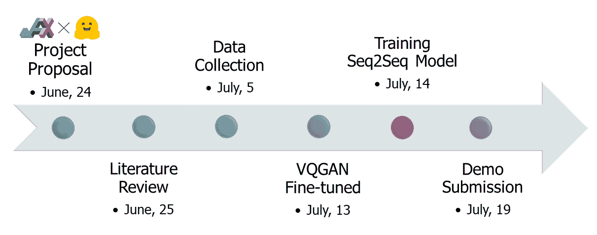
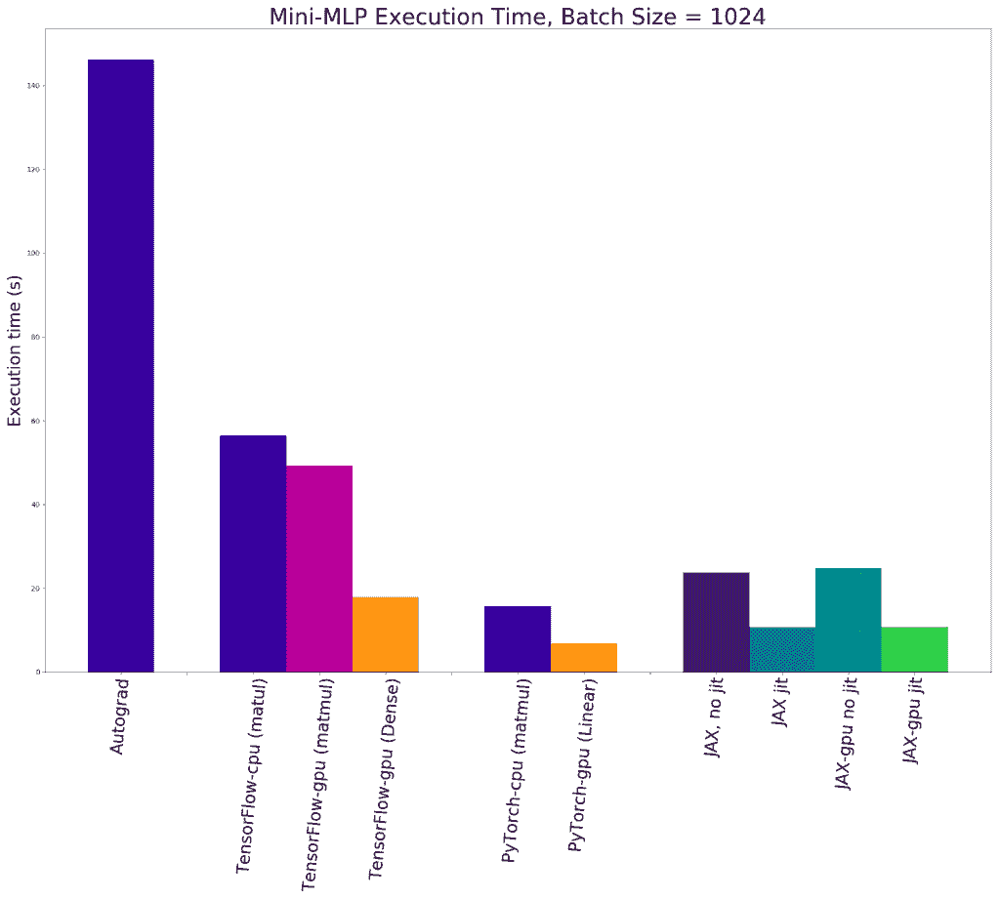
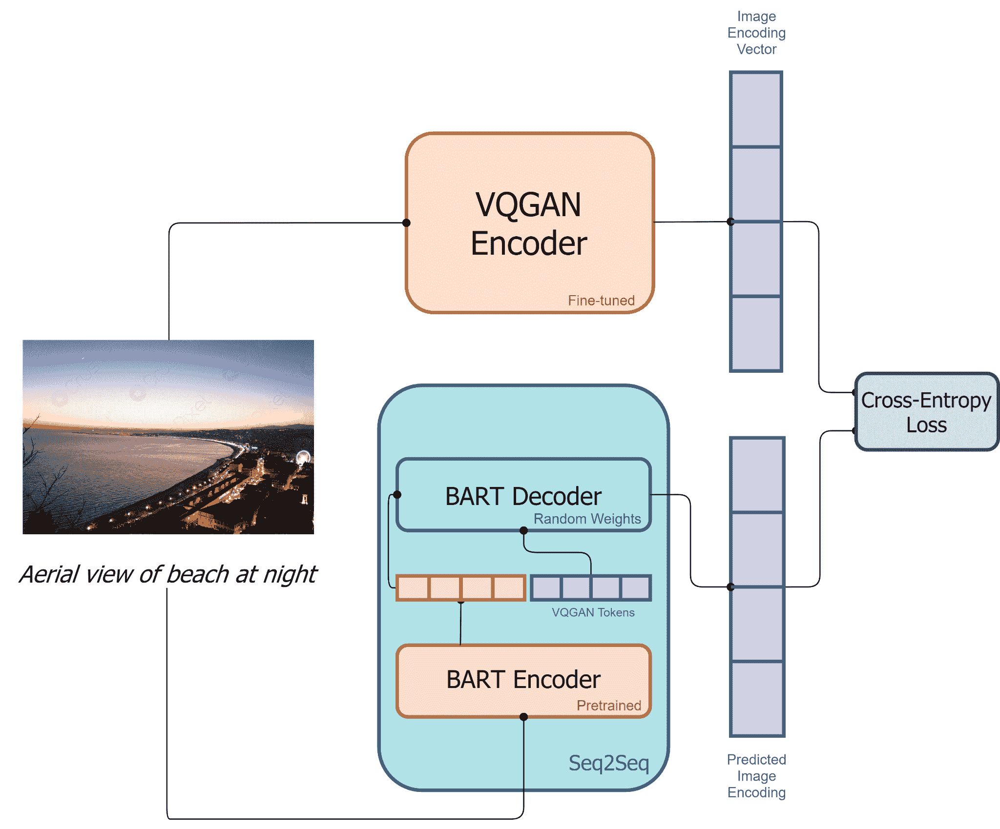
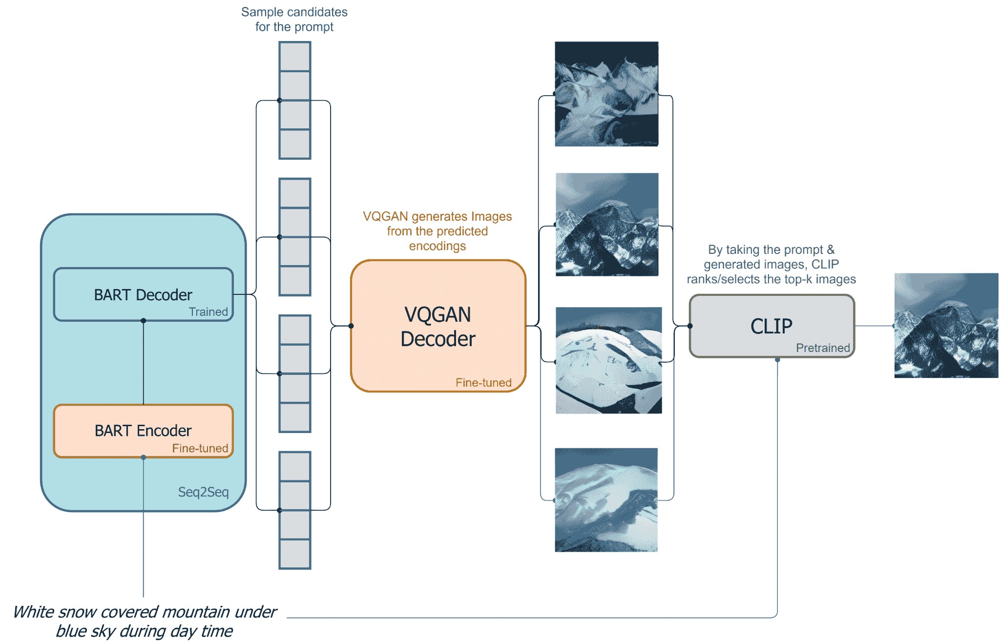
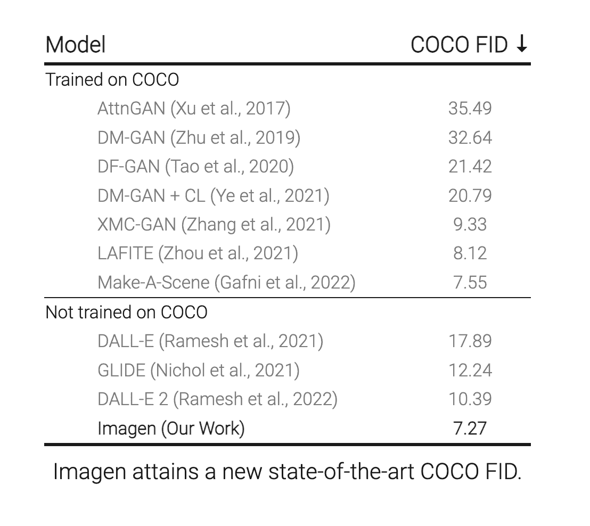
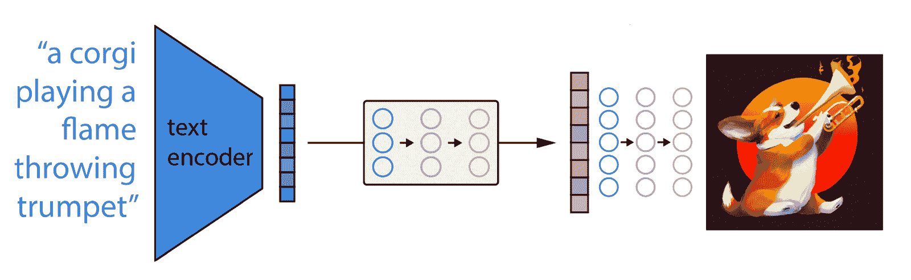
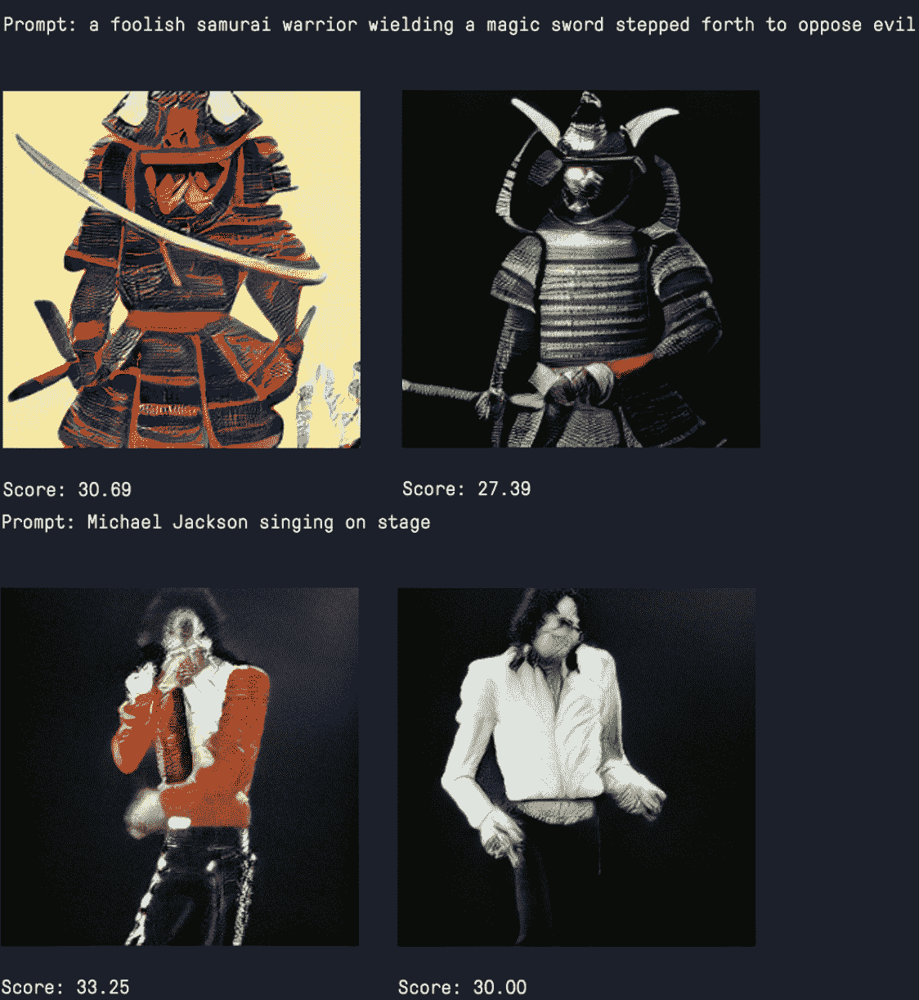

# DALL-E Mini:在微型模型中生成强大的图像

> 原文：<https://blog.paperspace.com/dalle-mini/>

在计算机视觉研究和外行使用计算机视觉应用的世界中，DALL-E 已经成为公认的开创性项目之一。虽然艺术质量在某些方面受到影响，如构图，即能够以某种有意义的方式合并多个对象属性(如形状、位移或颜色)的特性，但 DALL-E 是用户在现实的短时间内生成自己的艺术作品的最容易获得的选项之一。

问题是 DALL-E 仍然需要一个或多个具有大量内存的高级 GPU，以便能够以有利于在某种应用程序中使用的方式这样做，并且使用这样强大的 GPU 的服务器成本是不可持续的。Boris Dayma 领导的 Craiyon 团队与 Hugging Face 合作，发现了这个问题，并迅速推出了解决方案。



[[Source](https://wandb.ai/dalle-mini/dalle-mini/reports/DALL-E-Mini-Explained-with-Demo--Vmlldzo4NjIxODA)]

在短短的几周内，他们的产品 DALL-E Mini 或 Craiyon(为避免与最初的 DALL-E 和 DALL-E 2 混淆而改名)诞生了。借助谷歌强大的 JAX 库，Craiyon 能够在很短的时间内，用相对较少的 GPU 计算，几乎模仿其更大的堂兄弟的功效。通过这种方式，Craiyon 能够仅通过一个文本提示就快速生成高质量的艺术品。这是一个真正值得庆祝的进步，Craiyon 已经通过他们的[网络应用席卷了全世界。](https://www.craiyon.com/)

在今天的教程中，我们将讨论 Craiyon 如何工作，Craiyon 在 JAX 而不是更传统的 TensorFlow 或 Torch 中编写的一些原因，分解 Craiyon 架构的一些关键功能以生成艺术，然后将 Craiyon 与 DALL-E 进行比较和对比。然后我们将跳转到一个可以在渐变笔记本中访问的编码演示，这样您就可以开始使用 Craiyon 生成自己的作品或尽快制作自己的 DALL-E Mini 应用程序。

有关使用 DALL-E Mini 图块在渐变笔记本中运行 DALL-E Mini 的教程，请跳到“代码演示”一节

## DALL-E Mini 是如何工作的？

开发 JAX 的基本工作流程是首先训练 PyTorch 模型 VQGAN。这是一个[预训练、保存的检查点](https://heibox.uni-heidelberg.de/d/a7530b09fed84f80a887/)，它首先在 [ImageNet](https://image-net.org/) 上进行微调，缩减因子 f=16，词汇量为 16384。这很重要，因为它解释了我们将在后面看到的许多人为因素。这是因为该模型对于处理各种各样的图像来说非常健壮，但是对于处理人或人脸编码来说优化较差。作者选择尝试通过更多的微调来解决这个问题，但是，很可能由于模式崩溃，这是一个失败。

剩下的代码在 JAX，所以我们先来谈谈为什么使用 JAX 来实现这个模型。

### JAX

JAX 是由谷歌研究院开发的一个相对较新的库。与 TensorFlow 不同，它不是一个官方产品，因此随着它在稳定性方面的发展，它在研究社区中变得非常受欢迎。

JAX 利用即时编译的能力，允许用户捕获最大数量的 FLOPs 来生成优化的代码。这种实时(JIT)编译能够极大地提高计算速度。此外，除了通过自动签名在 CPU 上运行外，JAX 还支持在 GPU/TPU 上运行 NumPy 代码。这三种能力使得 JAX 可以在很大程度上加速张量运算。



[[Source](https://dzone.com/articles/accelerated-automatic-differentiation-with-jax-how)]

从上面的图中可以看出，在使用多层感知器进行的这一系列测试中，对于大多数用例来说，采用 jit 的 GPU 上的 JAX 表现出比竞争对手的 DL 库显著的速度提升。值得注意的是 Pytorch nn。总体而言，线性 MLP 速度最快，但我们可以假设这可能适用于特定的边缘情况，例如使用特别线性的数据。对于我们的计算机视觉来说，线性或任何其他混淆因素都不可能克服 JAX 的速度和效用。

## 克雷永是如何工作的？

既然我们理解了为什么使用 JAX 而不是 PyTorch 或 TensorFlow，让我们从 Craiyon 开始吧。让我们来看看架构。

### 架构概述



[[Source](https://wandb.ai/dalle-mini/dalle-mini/reports/DALL-E-Mini-Explained-with-Demo--Vmlldzo4NjIxODA)]

克雷永架构在执行上过于简单，但简单中蕴含着力量。从上面关于训练的图表中我们可以看到，图像和描述通过一系列不同的算法来获得类似于输入提示的图像输出。

首先进行训练，通过 VQGAN 编码器对图像进行编码，以将图像转换为令牌。类似地，文本描述也将被带到 BART 编码器进行转录。接下来，BART 编码器的输出和编码图像通过 BART 解码器。这是一个自回归模型，能够获取信息并尝试准确预测序列中的下一个令牌。



[[Source](https://wandb.ai/dalle-mini/dalle-mini/reports/DALL-E-Mini-Explained-with-Demo--Vmlldzo4NjIxODA)]

既然模型已经被训练来准确预测这些标记，我们就可以使用标题来生成图像。使用输入的字幕作为提示，基于解码器对下一个标记的预测分布，图像标记被顺序采样。BART 解码器然后基于来自 BART 编码器和 VQGAN 编码器的编码输出一系列样本候选图像编码。然后，这些序列由 VQGAN 解码器解码成近似于样本序列的图像。最后， [CLIP](https://openai.com/blog/clip/) 对输出的图像进行排序，并选择生成的最佳图像显示[源](https://wandb.ai/dalle-mini/dalle-mini/reports/DALL-E-Mini-Explained-with-Demo--Vmlldzo4NjIxODA)。VQGAN 和 CLIP 再次显示出和[再次显示出](https://github.com/nerdyrodent/VQGAN-CLIP)在一起使用时非常有效。

### Craiyon 和 DALL-E 2 有什么不同？



[[Source](https://imagen.research.google/)]

DALL-E 2 是目前公开可用的性能最高的图像生成器之一，仅次于 Imagen & Parti ( [FID 为 7.3](https://parti.research.google/) )的未在极其强大的 MS-COCO 数据集上训练的模型。它通过使用 CLIP 来指导 OpenAI 的另一个计算机视觉模型 GLIDE 的修改版本的生成工作。[查看这篇文章，了解 GLIDE 如何使用扩散模型先验生成图像。](blog.paperspace.com/glide-image-generation/)它们共同创造了一个强大的系统，其能力大于各个部分的总和。然而，累积起来，这使得模型变得庞大且运行起来昂贵。

这是创建克雷永的主要动力之一。克雷永比最初的 DALL-E 小 27 倍，这是因为人们努力制造出如此轻便的模型，使得克雷永如此普及。



[[Source](https://www.assemblyai.com/blog/how-dall-e-2-actually-works/)]

话虽如此，DALL-E 2 一点也不臃肿。模型大小的极端差异可以归因于导致类似输出的主要架构差异。DALL-E 2 图像生成任务的典型管道如上图所示，非常简单。正如我们所看到的，这个架构只是在接受和产生的内容上看起来相似。实现这一点的各种过程在两种模型之间有很大的不同。

我们看到的情况如下:

*   首先，剪辑文本编码器将图像描述映射到表示空间
*   那么扩散先验从剪辑文本编码映射到相应的剪辑图像编码
*   最后，修改的滑动生成模型经由反向扩散从表示空间映射到图像空间，生成传达输入字幕[【源】](https://www.assemblyai.com/blog/how-dall-e-2-actually-works/)内的语义信息的许多可能图像之一

这个框架无疑是强大的，但是比 DALL-E Mini 需要更多的计算开销。现在我们已经了解了什么是 DALL-E Mini，并看到了它与其同名产品相比是如何工作的，让我们来看看使这一切成为可能的代码。

## 代码演示

由于 DALL-E Mini/Craiyon 需要 JAX 和 GPU 支持才能运行，Gradient 是您访问所需计算的绝佳场所。您可以在此处查看此代码的公开版本，并通过转到笔记本创建页面，选择任何 GPU 机器，然后切换“高级选项”来创建自己的版本然后，使用这个 [Github repo 作为“工作区 URL”](https://github.com/gradient-ai/dalle-mini)，使用下面的标签作为“容器名”

`paperspace/gradient-base:pt112-tf29-jax0314-py39`

我们在这里使用的代码来自最初的研究团队提供的 DALL-E 迷你推理管道笔记本。这可以在 HuggingFace [这里](https://huggingface.co/spaces/dalle-mini/dalle-mini/blame/8ae91760794207b44dbc38761d075a7eab51f7d7/tools/inference/inference_pipeline.ipynb)找到。

### 必需的安装

第一步是安装我们需要的所有软件包。下面是 PyTorch 容器在 Gradient 上合适的 JAX 安装。注意，这些可能很挑剔，所以如果您在使用 CUDA 早期版本(< 11.0)或 cuDNN 不同版本的机器上运行这些代码，可能需要适当地重新配置。

我们还将安装 DALL-E 迷你库本身，以及子组件 vqgan-jax。

```py
# Install required libraries
!pip install pyyaml==5.4.1 --ignore-installed
!pip install -q dalle-mini
!pip install -q git+https://github.com/patil-suraj/vqgan-jax.git

#setup for easy display
!pip install ipywidgets
!pip install --upgrade tqdm 
```

### 设置

为了建立我们的推理和图像生成空间，通常我们首先需要从 Weights & Biases 或 HuggingFace Hub 获取将要使用的模型版本。这个版本来自 Weights & Biases，因此您需要创建一个帐户来访问 API 密钥。幸运的是，这可以免费完成。下面是指向预训练的 DALL-E Mini 和 VQGAN 模型的代码。

在 Gradient 笔记本中，我们可以通过装载已向用户提供的公共数据集，以平台的独特方式访问这些数据。建议使用这种方法，因为它速度更快。

<https://blog.paperspace.com/content/media/2022/07/dalleminiupload.mp4>


How to mount the dataset

要装载数据集，只需导航到屏幕左侧并选择第三个选项“Data Sources”选项卡。然后，单击“Public”切换到公共数据集，然后选择“dalle-mini-models”数据集并单击“Mount”这将把文件移动到`../datasets/dalle-mini-models`以便于访问。

```
# Model references: pull from mounted public dataset

# imports
import jax
import jax.numpy as jnp

# dalle-mega
DALLE_MODEL = "../datasets/dalle-mini-models/dallebart"  # can be wandb artifact or 🤗 Hub or local folder or google bucket
DALLE_COMMIT_ID = None

# if the notebook crashes too often you can use dalle-mini instead by uncommenting below line
# DALLE_MODEL = "dalle-mini/dalle-mini/mini-1:v0"

# VQGAN model
VQGAN_REPO = "../datasets/dalle-mini-models/vqgan-jax"
VQGAN_COMMIT_ID = "e93a26e7707683d349bf5d5c41c5b0ef69b677a9"
```py

如果您选择从 web 下载模型数据，您可以使用以下代码来完成:

```
# Model references: pull entire model from web (~5 GB)

# dalle-mega
DALLE_MODEL = "dalle-mini/dalle-mini/mega-1-fp16:latest"  # can be wandb artifact or 🤗 Hub or local folder or google bucket
DALLE_COMMIT_ID = None

# if the notebook crashes too often you can use dalle-mini instead by uncommenting below line
# DALLE_MODEL = "dalle-mini/dalle-mini/mini-1:v0"

# VQGAN model
VQGAN_REPO = "dalle-mini/vqgan_imagenet_f16_16384"
VQGAN_COMMIT_ID = "e93a26e7707683d349bf5d5c41c5b0ef69b677a9"
```py

为了实际加载模型，我们可以使用 dalle_mini 和 vqgan_jax 包中提供的方法。正如我们在上一节中所描述的，DALL-E Mini 利用了 VQGAN 和 BART。运行下面单元格中的代码，将模型下载到您的笔记本中。

```
# Load models & tokenizer
from ipywidgets import FloatProgress as IProgress
from dalle_mini import DalleBart, DalleBartProcessor
from vqgan_jax.modeling_flax_vqgan import VQModel
from transformers import CLIPProcessor, FlaxCLIPModel

# utils.logging.disable_progress_bar()
# Load dalle-mini
model, params = DalleBart.from_pretrained(
    DALLE_MODEL, revision=DALLE_COMMIT_ID, dtype=jnp.float16, _do_init=False
)

# Load VQGAN
vqgan, vqgan_params = VQModel.from_pretrained(
    VQGAN_REPO, revision=VQGAN_COMMIT_ID, _do_init=False
)
```py

然后，我们在每个设备上复制模型参数，以便更快地进行推断。这是为了利用您可能使用的任何多机实例。我们在一台 2 x A5000 机器上进行梯度测试。

```
from flax.jax_utils import replicate

params = replicate(params)
vqgan_params = replicate(vqgan_params)
```py

我们可以对我们的模型函数做同样的事情。下面的代码片段将对它们进行编译和并行化，以利用我们的多种设备。

```
from functools import partial

# model inference
@partial(jax.pmap, axis_name="batch", static_broadcasted_argnums=(3, 4, 5, 6))
def p_generate(
    tokenized_prompt, key, params, top_k, top_p, temperature, condition_scale
):
    return model.generate(
        **tokenized_prompt,
        prng_key=key,
        params=params,
        top_k=top_k,
        top_p=top_p,
        temperature=temperature,
        condition_scale=condition_scale,
    )

# decode image
@partial(jax.pmap, axis_name="batch")
def p_decode(indices, params):
    return vqgan.decode_code(indices, params=params)
```py

最后，我们生成随机密钥传递给我们的模型，以确保生成的图像的唯一性。

```
import random

# create a random key
seed = random.randint(0, 2**32 - 1)
key = jax.random.PRNGKey(seed)
```py

### 准备文本输入

为了接收我们的文本片段提示，我们的模型需要处理函数来加载数据。我们将使用提供的 DalleBartProcessor。这可以使用我们安装的软件包直接创建，也可以从 Weights & Biases 下载整个模型包(不推荐)。

```
# Create the processor piece by piece

from dalle_mini.model.configuration import DalleBartConfig
from dalle_mini.model.text import TextNormalizer
from dalle_mini.model.tokenizer import DalleBartTokenizer
from dalle_mini.model.utils import PretrainedFromWandbMixin

tokenizer = DalleBartTokenizer.from_pretrained('dalle-mini/dalle-mega')
config = DalleBartConfig.from_pretrained('dalle-mini/dalle-mega')
processor = DalleBartProcessor(tokenizer, config.normalize_text, config.max_text_length)
```py

您也可以直接下载模型数据，但这会强制进行完整下载，并且可能会很耗时:

```
# Download all model files (~5 GB)
from dalle_mini import DalleBartProcessor

processor = DalleBartProcessor.from_pretrained(DALLE_MODEL, revision=DALLE_COMMIT_ID)
```py

然后我们可以实例化我们的提示。我们应该尽力提交具有模型熟悉的特征的图像，因此避免不太为人所知的专有名词、行话和技术术语。您可以使用它来更改生成的图像的内容并修改其样式。这里有一些我认为有趣的提示示例。

```
prompts = [
    "fine art painting of a foolish samurai warrior wielding a magic sword stepping forth to oppose the evil that is Aku",
    "Barack Obama holding up the World Cup trophy",
    "Obi Wan Kenobi standing over lava with a lightsaber"
]
```py

然后，我们通过将提示复制到每台设备上来完成设置。我们也可以多次使用同一个提示来加快推断速度。

```
tokenized_prompts = processor(prompts)
tokenized_prompt = replicate(tokenized_prompts)
```py

### 推理

现在，我们已经设置好一切，开始生成我们的图像。让我们为我们的推理过程设置几个快速参数。特别是，改变`n_predictions`将影响它生成图像的次数，而`temperature`将影响从提示中处理出来的 ngrams 的数量/长度，作为编码的标记。

```
# number of predictions per prompt
n_predictions = 8

# We can customize generation parameters (see https://huggingface.co/blog/how-to-generate)
gen_top_k = None
gen_top_p = None
temperature = None
cond_scale = 10.0
```py

最后，我们到达我们的训练循环。对于每个步骤，我们使用 p_generate 为每个使用 DALL-E BART 编码器的标记化提示生成图像编码。然后，编码会删除序列开始(BOS)标记，然后传递给 VQGAN 解码器。然后，解码器获取图像编码，每个图像编码对应于提示列表中的单个提示，并为每个图像编码生成图像数据。这些然后显示给我们看。

```
from flax.training.common_utils import shard_prng_key
import numpy as np
from PIL import Image
from tqdm.notebook import trange

print(f"Prompts: {prompts}\n")
# generate images
images = []
for i in trange(max(n_predictions // jax.device_count(), 1)):
    # get a new key
    key, subkey = jax.random.split(key)
    # generate images
    encoded_images = p_generate(
        tokenized_prompt,
        shard_prng_key(subkey),
        params,
        gen_top_k,
        gen_top_p,
        temperature,
        cond_scale,
    )
    # remove BOS
    encoded_images = encoded_images.sequences[..., 1:]
    # decode images
    decoded_images = p_decode(encoded_images, vqgan_params)
    decoded_images = decoded_images.clip(0.0, 1.0).reshape((-1, 256, 256, 3))
    for decoded_img in decoded_images:
        img = Image.fromarray(np.asarray(decoded_img * 255, dtype=np.uint8))
        images.append(img)
        display(img)
        print()
```py

输出:


Sample images generated using DALL-E Mini on 2xA5000 

成功！如果一切都做对了，你应该会得到三个看起来非常诡异的山谷人形表演我们描述的动作。正如你所看到的，许多非人形的特征看起来比人类特征更真实。图案、衣服和被拿着的物品都相当接近我们对它们在低分辨率下的预期。然而，面部和头部尤其是一个真正的斗争，我们可以从它重新创建巴拉克·奥巴马头部的令人钦佩的尝试中看出，它在面部上表现最好，由于他的普遍受欢迎程度，这些面部更有可能出现在他们的训练数据中。Craiyon 团队打算进一步训练他们的模型来尝试和补救这一点，但在本文发布时还不可用。

### 对产出进行排序

下一步，我们可以选择使用 CLIP 来评估和排列新生成图像的质量。这就是生产这种产品的想法发挥作用的地方。通过这种剪辑集成，我们可以消除对评估生成图像质量的人工检查的需要，并在实践中自动使用 Craiyon。

为此，您首先需要加载预训练的剪辑模型和处理器。然后我们创建一个简短的函数`p_clip`来给我们的图像打分。

```
# CLIP model
CLIP_REPO = "openai/clip-vit-base-patch32"
CLIP_COMMIT_ID = None

# Load CLIP
clip, clip_params = FlaxCLIPModel.from_pretrained(
    CLIP_REPO, revision=CLIP_COMMIT_ID, dtype=jnp.float16, _do_init=False
)
clip_processor = CLIPProcessor.from_pretrained(CLIP_REPO, revision=CLIP_COMMIT_ID)
clip_params = replicate(clip_params)

# score images
@partial(jax.pmap, axis_name="batch")
def p_clip(inputs, params):
    logits = clip(params=params, **inputs).logits_per_image
    return logits
```py

接下来，我们使用`clip_processor`为剪辑模型准备我们的图像，然后将它们提交给`p_clip`来计算我们将用来对图像进行排序的分数。

```
from flax.training.common_utils import shard

# get clip scores
clip_inputs = clip_processor(
    text=prompts * jax.device_count(),
    images=images,
    return_tensors="np",
    padding="max_length",
    max_length=77,
    truncation=True,
).data
logits = p_clip(shard(clip_inputs), clip_params)

# organize scores per prompt
p = len(prompts)
logits = np.asarray([logits[:, i::p, i] for i in range(p)]).squeeze()
```py

最后，我们可以在提示中使用这个 logits 值，根据图像与原始提示编码的排序接近度来显示图像的有序排序。

```
for i, prompt in enumerate(prompts):
    print(f"Prompt: {prompt}\n")
    for idx in logits[i].argsort()[::-1]:
        display(images[idx * p + i])
        print(f"Score: {jnp.asarray(logits[i][idx], dtype=jnp.float32):.2f}\n")
    print()
```

以下是另一组提示的一些示例:



The more detailed images that better approximate the original prompt will receive higher scores

## 结论

在本文中，我们分析了 DALL-E Mini/Craiyon 的理由和灵感，探索了它的前辈以进行比较，并使用 Python 代码实现了光照图像生成器。这种用于图像生成的轻量级模型的实用性已经得到了证明。最初的团队已经将 DALL-E Mini 项目更名为 [Craiyon](https://www.craiyon.com/) ，并由于其可访问性而在互联网上取得了巨大成功。

如果你想了解更多关于 DALL-E Mini 及其与 DALL-E 2 的关系，请务必查看我们在 YouTube 频道上关于 DALL-E 的技术讲座。

[https://www.youtube.com/embed/92gVkdQigNY?feature=oembed](https://www.youtube.com/embed/92gVkdQigNY?feature=oembed)

您可以在这里的 [Github repo 中找到我们在本文中使用的代码。你也可以在 GPU 驱动的渐变笔记本](https://github.com/gradient-ai/dalle-mini) [这里](https://console.paperspace.com/ml-showcase/notebook/r9xxyd0pguepnvl?file=%2FDALL-E-Mini-inference-pipeline.ipynb)访问代码。