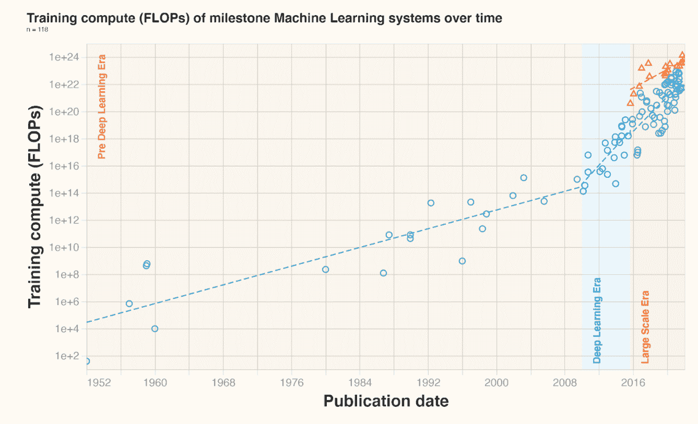
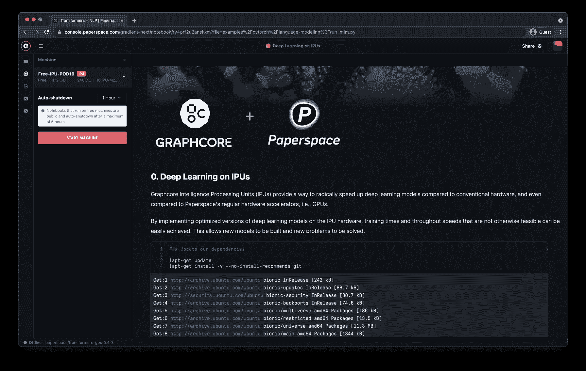

# Paperspace 与 Graphcore 合作推出 IPU 云服务

> 原文：<https://blog.paperspace.com/paperspace-graphcore-partnership/>

人工智能模型的规模和复杂性正以令人震惊的速度增长。训练最先进模型所需的计算周期需求通常超过数百亿个参数，这种需求确实非常迅速，使现有芯片的供应和能力紧张。

[Compute Trends Across Three eras of Machine Learning](https://www.lesswrong.com/posts/XKtybmbjhC6mXDm5z/compute-trends-across-three-eras-of-machine-learning)

作为一个旨在支持每一盎司性能都很重要的尖端加速应用的云平台，我们与基础设施的接近让我们对令人兴奋和快速增长的人工智能芯片领域有了独特的见解。特别是，我们已经看到 Graphcore 成为一个关键角色，通过其*智能处理单元*或 *IPU* 实现其提高人工智能系统效率和性能的愿景。

正如 Graphcore 首席执行官 Nigel Toon [在最近的一次采访中讨论的](https://www.zdnet.com/article/the-future-of-ai-is-a-software-story-says-graphcores-ceo/)，需要一个设计良好的人工智能软件栈来真正释放专用人工智能芯片提供的原始性能提升。

> 你可以构建各种奇异的硬件，但是如果你不能实际构建一个软件，将一个人在非常简单的水平上的描述能力转化为硬件，你就不能真正产生一个解决方案。
> –奈杰尔·图恩，Graphcore 首席执行官

开发人员需要一个简单的访问层来抽象出机器学习基础设施管理中涉及的许多复杂性，这一观点得到了 Paperspace 的热烈赞同。事实上，我们的 MLOps 平台 [Gradient](https://www.paperspace.com/gradient) 就是为此而打造的。

今天，我们激动地宣布 Graphcore IPUs 集成到渐变笔记本中。这种新的梯度机器类型提供了免费访问 IPU-POD16 经典机器提供 4 petaFLOPS 的人工智能计算。

任何 Paperspace 用户现在都可以毫不费力地在 Graphcore IPUs 上运行最先进的模型，包括与 [HuggingFace](https://huggingface.co/) 合作开发的预配置变压器示例项目。你可以在[这里](https://www.graphcore.ai/posts/paperspace-graphcore-partner-free-ipus-developers?utm_campaign=Paperspace%20-%20Social%20Media&utm_content=217663829&utm_medium=social&utm_source=twitter&hss_channel=tw-764088549230702592)的公告中了解更多。

[TRY NOW](http://console.paperspace.com/signup?graphcore=true&gradient=true)

### 还会有更多

Paperspace 和 Graphcore 将继续合作，将 IPUs 集成到完整的端到端梯度平台中，提供 ML 管道和推理功能，随着人工智能行业的成熟，这些功能越来越普遍。