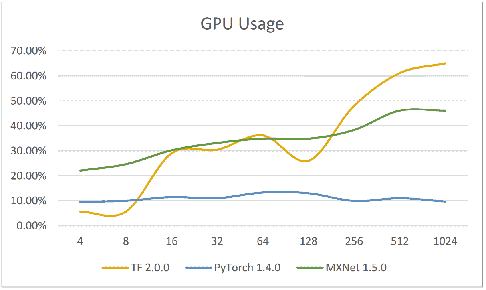
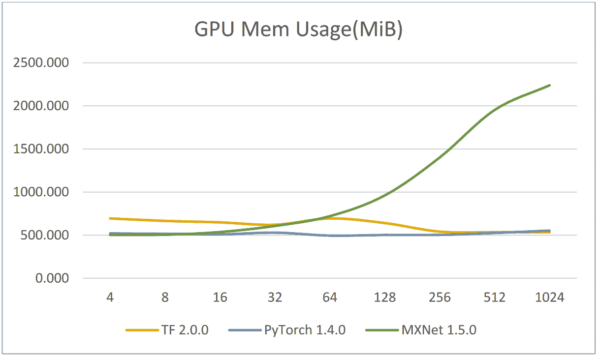
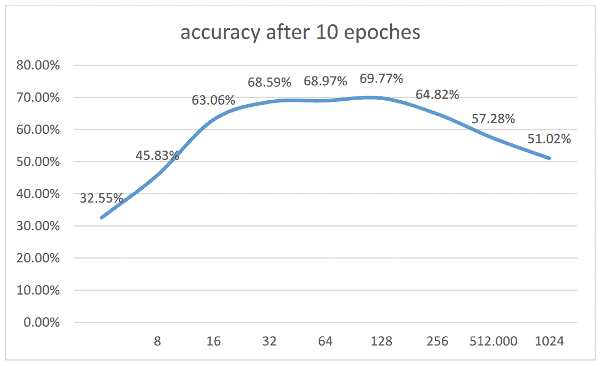
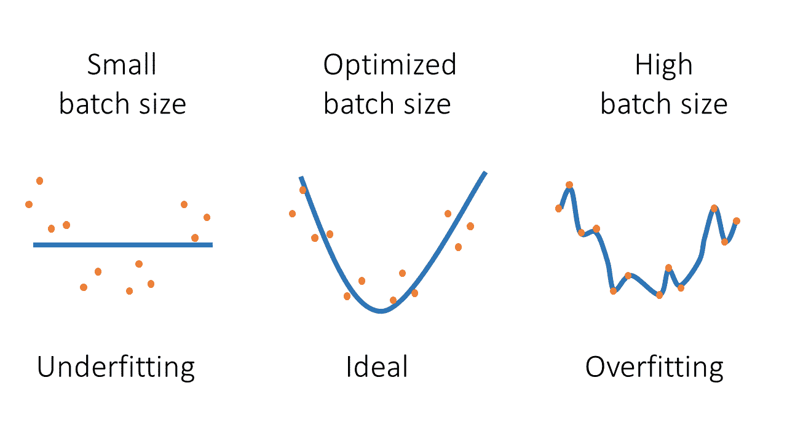
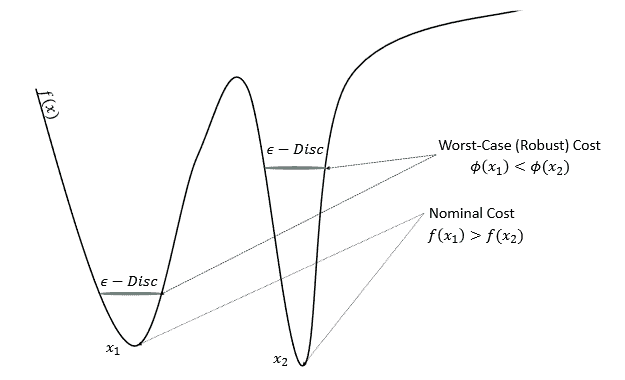
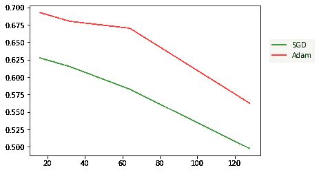
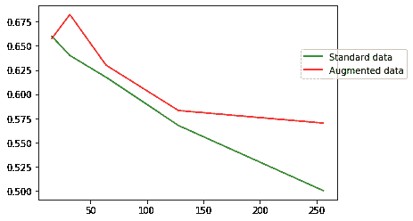

# 如何通过找到合适的批处理大小来最大化 GPU 利用率

> 原文：<https://blog.paperspace.com/how-to-maximize-gpu-utilization-by-finding-the-right-batch-size/>

在建立机器学习模型时，我们总是在为我们的模型和训练配置寻找最有效的参数。这些设置可能包括优化器、批量大小、层堆栈设置，甚至数据形状。在本文中，我们将讨论在训练神经网络架构时可能遇到的批量大小约束。我们还将看到这个元素如何受到 GPU 的能力及其可用内存的影响。然后，我们将看看如何为我们的 GPU/模型组合找到最佳批量。

## 理解术语

### 样品

一个样本代表一个数据元素。它包括用于训练算法的输入以及用于通过与预测进行比较来计算误差的输出。也可以叫做:**观测**，一个**输入向量**，或者一个**特征向量**。

### 批量

批量指的是在更新其可训练模型变量或权重和偏差之前，用于训练模型的样本的**数量。也就是说，一批样本在每个训练步骤通过模型，然后反向传递以确定每个样本的梯度。为了确定可训练模型变量的更新，然后根据所使用的优化器的类型，对所有样本的梯度进行平均或相加。参数更新后，将对后续批次的样本重复此过程。**

### 世

历元数，这是一个超参数，控制学习算法将在整个训练数据集中运行**多少次**。
一个时期表示内部模型参数有机会为训练数据集中的每个样本更新一次。根据配置，在一个时期内可以有一个或多个批次。

### 循环

一次迭代就是完成一个时期所需的**批数。例如，如果一个数据集包含被分成 *20* 批的 *10000* 个样本。然后，我们需要多次 *500 次*迭代(10 000 = 500 × 20)来遍历一个历元。**

## 确定批量大小对培训的影响

### GPU 使用和内存

首先，让我们来评估不同的批处理大小对 GPU 使用和 GPU 内存的影响。机器学习[俄亥俄大学的研究人员](https://etd.ohiolink.edu/apexprod/rws_etd/send_file/send?accession=osu1587693436870594)实际评估了增加批量大小对 GPU 利用率的影响。他们使用了 3 个最常用的机器学习框架(TensorFlow、PyTorch 和 MXnet ),然后记录了结果:

**TensorFlow** :

| 批量 | four | eight | Sixteen | Thirty-two | Sixty-four | One hundred and twenty-eight | Two hundred and fifty-six | Five hundred and twelve | One thousand and twenty-four |
| --- | --- | --- | --- | --- | --- | --- | --- | --- | --- |
| GPU 使用率(%) | 5.65% | 5.65% | 29.01% | 30.46% | 36.17% | 30.67% | 24.88% | 22.45% | 22.14% |
| GPU 内存使用量(MB) | Six hundred and ninety-four point two seven four | Six hundred and sixty-five point eight zero four | Six hundred and forty-nine point one three seven | Six hundred and twenty point nine zero nine | Six hundred and ninety-four point five six three | Six hundred and forty-one | Five hundred and forty-one point three three three | Five hundred and thirty-five point zero six three | Five hundred and thirty-five point zero six three |

**指针** :

| 批量 | four | eight | Sixteen | Thirty-two | Sixty-four | One hundred and twenty-eight | Two hundred and fifty-six | Five hundred and twelve | One thousand and twenty-four |
| --- | --- | --- | --- | --- | --- | --- | --- | --- | --- |
| GPU 使用率(%) | 9.59% | 9.98% | 11.46% | 11.00% | 13.29% | 13.00% | 9.91% | 11.00% | 9.67% |
| GPU 内存使用量(MB) | Five hundred and twenty point two two two | Five hundred and sixteen point seven eight four | Five hundred and nine point two nine six | Five hundred and thirty | Four hundred and ninety-five point two five | Five hundred and two point six four two | Five hundred and three point four seven eight | Five hundred and twenty-five point eight one eight | Five hundred and fifty-three point five two four |

**MXNet** :

| 批量 | four | eight | Sixteen | Thirty-two | Sixty-four | One hundred and twenty-eight | Two hundred and fifty-six | Five hundred and twelve | One thousand and twenty-four |
| --- | --- | --- | --- | --- | --- | --- | --- | --- | --- |
| GPU 使用率(%) | 22.13% | 24.65% | 30.22% | 33.14% | 34.91% | 34.83% | 38.33% | 46.09% | 46.09% |
| GPU 内存使用量(MB) | Five hundred and two point four five two | Five hundred and five point four seven nine | Five hundred and thirty-six point six seven two | Six hundred and six point nine five three | Seven hundred and twenty point eight one one | Two thousand four hundred and ninety-five point one five three | Two thousand four hundred and eighty-five point six three nine | Two thousand four hundred and ninety-one point nine two | Two thousand five hundred and eleven point four seven two |

然后将这些结果绘制成图表进行比较



GPU Usage under 3 frameworks ([Source](https://etd.ohiolink.edu/apexprod/rws_etd/send_file/send?accession=osu1587693436870594))

我们看到，当批量相对较小时，TensorFlow 的 GPU 使用率最低，MXnet 的 GPU 使用率最高。而当批量相对较大时，TensorFlow 的 GPU 利用率最高，PyTorch 最低。此外，我们还可以观察到，随着批处理大小的增长，GPU 消耗也将大幅增长。



GPU Memory Usage under 3 frameworks ([Source](https://etd.ohiolink.edu/apexprod/rws_etd/send_file/send?accession=osu1587693436870594))

当批处理大小增加时，我们可以看到 MXnet 比其他两个占用了更多的内存，尽管它们几乎没有变化。大多数时候，MXnet 占用的内存最多。MXnet 将所有批量数据保存在 GPU RAM 中，然后在整个应用程序运行完毕后释放它们，这是一个潜在的解释。另一方面，批量数据处理是 TensorFlow 和 PyTorch 的操作方式。在处理单个时期后，与单个批次相关的数据将从存储器中移除。

增加批处理大小是提高 GPU 使用率的一种直接方法，尽管它并不总是成功的。批量大小的梯度通常在 GPU 上并行计算。因此，只要有足够的内存来容纳一切，大批量就可以提高 GPU 的使用率和训练性能。在 PyTorch 的情况下，GPU 和内存利用率基本保持不变。这是因为 PyTorch 采用了一种分配方法，当批量过大时，这种方法会降低 GPU 利用率、CPU 内存和训练速度，反之亦然。

一般来说，内存消耗随着批处理大小值的增加而增加。
使用的框架，模型的参数和模型本身以及每一批数据都会影响内存的使用。然而，这种**效果**很大程度上取决于**使用的型号**！

### 精确度和算法性能

同一篇学术论文还包括一些关于批量大小及其对训练算法准确性的影响的有趣发现。对于 TensorFlow 框架，研究人员评估了不同批量值的 10 个时期后的准确性:

| 批量 | four | eight | Sixteen | Thirty-two | Sixty-four | One hundred and twenty-eight | Two hundred and fifty-six | Five hundred and twelve | One thousand and twenty-four |
| --- | --- | --- | --- | --- | --- | --- | --- | --- | --- |
| 10 个时期后的准确度 | 32.55% | 45.83% | 63.06% | 68.59% | 68.97% | 69.77% | 64.82% | 57.28% | 51.02% |

然后我们可以在下图中绘制这种变化:



Accuracy after 10 epoches vs Batch size for Tensorflow framework ([Source](https://etd.ohiolink.edu/apexprod/rws_etd/send_file/send?accession=osu1587693436870594))

评估准确度时，采用不同的批次大小值可能会产生重要影响，在选择批次大小时应予以考虑。使用小批量或大批量可能有两个主要的负面影响。



Illustration of Underfitting, Overfitting and Ideal scenarios of model training

**过拟合**

批量大可能导致泛化能力差，模型甚至会陷入局部极小值。由于泛化，神经网络将在训练集之外的样本上表现得相当好。然而，也可能发生相反的情况，神经网络在训练集之外发现的样本上表现不佳，这实质上是过度拟合。从图表中可以看出这种影响；从批量大小 256 开始，该模型偏离绝对最小值，并且在新数据上表现出较低的准确性。一项关于深度学习的大批量训练的研究通过分析检验了同样的现象，并证实了这一发现。

**欠拟合(缓慢收敛)**

小批量可能是学习算法收敛缓慢的原因。在每个阶段执行并使用一批样本计算的变量更新将决定未来一批样本的起始点。因为每一步都涉及从训练集中随机选择训练样本，所以产生的梯度是基于不完整数据的噪声估计。我们在单个批次中使用的数据越少，梯度估计就越嘈杂，越不精确。换句话说，当批量很小时，单个样本对应用的变量更新有更大的影响。换句话说，较小的批量可能会导致学习过程更加嘈杂和不规则，从而延迟学习过程。在上面的例子中，我们可以看到，在 10 个时期后，批量大小为 4 只能使我们达到 32%的准确度，这不如批量大小为 128 所获得的准确度好。

## 如何最大化批量

如前一节所述，批量大小是一个重要的超参数，对模型的拟合或缺失有重大影响。它也可能对 GPU 的使用产生影响。我们可以预计，提高批量大小将提高训练速度(即 GPU 利用率)，但这种增益将受到前述收敛问题(过拟合)的限制。

因此，在本节中，我们将讨论一些用于确定最佳批处理大小的策略，这些策略利用了 GPU 所提供的一切，同时避免了过度拟合的极端情况。

### 数据扩充

可以考虑的技术之一是数据扩充。该方法将提供增加批量大小的可能性，同时保持每个时期良好且可接受的精度增加。虽然这项技术的应用因地区而异，但通常需要通过对训练数据进行仔细控制的更改来增加数据集。例如，在图像识别的情况下，可以通过平移、旋转、剪切、调整大小、裁剪甚至翻转训练数据中的图像来放大训练集。

### 保守训练

在大批量训练的情况下，一些优化器的收敛速度比其他的更好。[关于随机优化技术效果的研究](https://dl.acm.org/doi/10.1145/2623330.2623612)表明，标准随机梯度下降(SGD)优化器的收敛速度可以提高，特别是对于大批量。在前面提到的论文中介绍了一种基于每个小批量内保守正则化目标函数的近似优化的方法。此外，研究表明收敛速度不受小批量大小的影响。他们还表明，通过替代优化器的正确实现，我们可以胜过传统的 SGD，例如**亚当**。ADAM 优化方法是一种随机梯度下降扩展，最近在深度学习应用中，尤其是在计算机视觉和自然语言处理中，越来越受欢迎。

### 强健的训练

稳健训练是另一种自然的技术，可以防止在增加批量时出现不良泛化的后果。这些策略试图通过最大化最坏情况(稳健)成本而不是目标函数的名义成本来减少增加批量的影响。



Example of two minima with the different nominal and robust cost ([Source](https://arxiv.org/pdf/1609.04836.pdf))

在前面的例子中，最大稳健最坏情况的位置不同于目标函数的标称最小位置。

### 案例研究:猫狗图像分类

在本节中，我们将使用 TensorFlow/Keras 为猫和狗的图像构建一个分类器。然后，使用标准 SGD 优化器和默认数据格式，针对各种批量值评估模型的性能。然后，使用前面讨论的策略，我们将尝试增加批量大小，同时保持甚至提高精度。

让我们首先准备[数据集](https://download.microsoft.com/download/3/E/1/3E1C3F21-ECDB-4869-8368-6DEBA77B919F/kagglecatsanddogs_5340.zip)

**下载&解压**

```py
curl https://download.microsoft.com/download/3/E/1/3E1C3F21-ECDB-4869-8368-6DEBA77B919F/kagglecatsanddogs_5340.zip --output dataset.zip
7z x dataset.zip
```

**分割训练/验证/测试子集**

首先，我们创建文件夹来存储调整后的图像

```py
mkdir -p train/Cat
mkdir -p train/Dog
mkdir -p validation/Cat
mkdir -p validation/Dog
mkdir -p test/Cat
mkdir -p test/Dog
```

然后，使用 Keras 图像预处理库，我们加载图像，将它们调整为 200 像素/200 像素的文件，然后将结果保存在文件夹中。我们每个班总共取 1000 幅图像:600 幅用于训练，200 幅用于验证，200 幅用于测试。

```py
# importing libraries
from keras.preprocessing.image import load_img,save_img,ImageDataGenerator
from os import listdir
from tensorflow import keras

# load dogs vs cats dataset, reshape into 200px x 200px image files
classes = ['Cat','Dog']
photos, labels = list(), list()
files_per_class = 1000
for classe in classes:
  i = 0
  # enumerate files in the directory
  for file in listdir('PetImages/'+classe):
    if file.endswith(".jpg"):
      # determine class
      output = 0.0
      if classe == 'Dog':
        output = 1.0
      # load image
      photo = load_img('PetImages/'+classe +'/' + file, target_size=(200, 200))
      if i < 600:
        save_img('train/'+classe+'/'+file, photo)
      elif i < 800:
        save_img('validation/'+classe+'/'+file, photo)
      else:
        save_img('test/'+classe+'/'+file, photo)
      i = i + 1
      if i == files_per_class:
        break
```

**培训&评估模型**

对于模型，我们将使用 Tensorflow/Keras 序列模型。训练和评估过程嵌入在一个函数中，该函数将批量大小和优化器作为输入。这个函数稍后将用于评估优化器对批量大小的影响

```py
def get_accuracy_for_batch_size(opt, batch_size):
  print("Evaluating batch size " + str(batch_size))
  # prepare iterators
  datagen = ImageDataGenerator(rescale=1.0/255.0)
  train_it = datagen.flow_from_directory(directory='train/',
    class_mode='binary', batch_size=batch_size, target_size=(200, 200))
  val_it = datagen.flow_from_directory(directory='validation/',
    class_mode='binary', batch_size=batch_size, target_size=(200, 200))
  test_it = datagen.flow_from_directory('test/',
    class_mode='binary', batch_size=batch_size, target_size=(200, 200))

  # create model
  model = keras.Sequential()
  model.add(keras.layers.Conv2D(32, (3, 3), activation='relu', kernel_initializer='he_uniform', padding='same', input_shape=(200, 200, 3)))
  model.add(keras.layers.MaxPooling2D((2, 2)))
  model.add(keras.layers.Flatten())
  model.add(keras.layers.Dense(128, activation='relu', kernel_initializer='he_uniform'))
  model.add(keras.layers.Dense(1, activation='sigmoid'))

  # compile model
  model.compile(optimizer=opt, loss='binary_crossentropy', metrics=['accuracy'])

  # train the model
  model.fit(train_it,
                      validation_data = train_it,
                      steps_per_epoch = train_it.n//train_it.batch_size,
                      validation_steps = val_it.n//val_it.batch_size,
                      epochs=5, verbose=0)

  # evaluate model
  _, acc = model.evaluate(test_it, steps=len(test_it), verbose=0)
  return acc
```

**比较优化器:SGD vs Adam**

对于不同的批量大小值(16、32、64 和 128)，我们将在 5 个时期后评估 Adam 和 SGD 优化器的模型准确性。

```py
batch_size_array = [16,32,64,128]
accuracies_sgd = []
optimizer = "sgd"
for bs in batch_size_array:
  accuracies_sgd.append(get_accuracy_for_batch_size(optimizer, bs))

accuracies_adam = []
optimizer = "adam"
for bs in batch_size_array:
  accuracies_adam.append(get_accuracy_for_batch_size(optimizer, bs))
```

然后，我们将使用 ***Matplotlib*** 绘制结果

```py
import matplotlib.pyplot as plt
plt.plot(batch_size_array, accuracies_sgd, color='green',label='SGD')
plt.plot(batch_size_array, accuracies_adam, color='red',label='Adam')
plt.show()
```



Accuracy vs batch size for Adam & SGD optimizers

我们可以清楚地看到，对于批量 16， **SGD** 的准确度约为 62%,随着批量的增加，准确度开始迅速下降。这与**亚当**、**T5 的情况不同，准确度下降不太明显，在批量 64 左右，准确度仍在 67%附近，这表示增加了四倍，同时仍保持可接受的准确度。**

但是，我们也可以注意到，对于这两个优化器，从批量大小 128 开始，准确性急剧下降。因此，我们可以推导出，在这个模型中，Adam 的最佳批量是 64，SGD 的最佳批量是 16。

**数据扩充的效果**

让我们首先为扩充的训练和验证数据创建新的目录。

```py
!mkdir -p train_augmented/Cat
!mkdir -p train_augmented/Dog
!mkdir -p validation_augmented/Cat
!mkdir -p validation_augmented/Dog
```

现在，让我们用原始数据和每个图像的新的调整大小和裁剪版本填充这些文件夹。这将导致最终数据集的大小是原始数据集的两倍。所述操作也通过图像预处理 Keras 库来完成:

```py
from tensorflow import image
# load dogs vs cats dataset, reshape into 200x200 files
classes = ['Cat','Dog']
photos, labels = list(), list()
files_per_class = 1000
for classe in classes:
  i = 0
  # enumerate files in the directory
  for file in listdir('PetImages/'+classe):
    if file.endswith(".jpg"):
      # determine class
      output = 0.0
      if classe == 'Dog':
        output = 1.0
      # load image
      photo = load_img('PetImages/'+classe +'/' + file, target_size=(200, 200))
      photo_resized = photo.resize((250,250))
      photo_cropped = photo_resized.crop((0,0, 200, 200))
      if i < 600:
        save_img('train_augmented/'+classe+'/'+file, photo)
        save_img('train_augmented/'+classe+'/augmented_'+file, photo_cropped)
      elif i < 800:
        save_img('validation_augmented/'+classe+'/'+file, photo)
        save_img('validation_augmented/'+classe+'/augmented_'+file, photo_cropped)
      else:
        save_img('test/'+classe+'/'+file, photo)
      i = i + 1
      if i == files_per_class:
        break
```

现在我们引入一个新的训练和评估函数，它将训练/验证文件夹以及批量大小作为输入。该函数将对所有数据集使用 Adam 优化器。

```py
def get_accuracy_for_batch_size_augmented_data(train_folder,validation_folder, batch_size):
  print("Evaluating batch size " + str(batch_size))
  # prepare iterators
  datagen = ImageDataGenerator(rescale=1.0/255.0)
  train_it = datagen.flow_from_directory(directory=train_folder,
    class_mode='binary', batch_size=batch_size, target_size=(200, 200))
  val_it = datagen.flow_from_directory(directory=validation_folder,
    class_mode='binary', batch_size=batch_size, target_size=(200, 200))
  test_it = datagen.flow_from_directory('test/',
    class_mode='binary', batch_size=batch_size, target_size=(200, 200))

  # create model
  model = keras.Sequential()
  model.add(keras.layers.Conv2D(32, (3, 3), activation='relu', kernel_initializer='he_uniform', padding='same', input_shape=(200, 200, 3)))
  model.add(keras.layers.MaxPooling2D((2, 2)))
  model.add(keras.layers.Flatten())
  model.add(keras.layers.Dense(128, activation='relu', kernel_initializer='he_uniform'))
  model.add(keras.layers.Dense(1, activation='sigmoid'))

  # compile model
  model.compile(optimizer="adam", loss='binary_crossentropy', metrics=['accuracy'])

  # train the model
  model.fit(train_it,
                      validation_data = train_it,
                      steps_per_epoch = train_it.n//train_it.batch_size,
                      validation_steps = val_it.n//val_it.batch_size,
                      epochs=5, verbose=0)

  # evaluate model
  _, acc = model.evaluate(test_it, steps=len(test_it), verbose=0)
  return acc
```

然后，我们将评估不同批量的准确性。在原始数据和扩充数据集的两种情况下。

```py
batch_size_array = [16,32,64,128,256]
accuracies_standard_data = []
for bs in batch_size_array:
  accuracies_standard_data.append(get_accuracy_for_batch_size_augmented_data("train/","validation/", bs))

accuracies_augmented_data = []
for bs in batch_size_array:
  accuracies_augmented_data.append(get_accuracy_for_batch_size_augmented_data("train_augmented/","validation_augmented/", bs))
```

最后，我们绘制两个数据集的结果精度值。您可能会在一个免费的 GPU 上耗尽内存，因此[考虑升级到我们的 Pro 或 Growth plan，以访问 Paperspace 上更强大的 GPU。](https://www.paperspace.com/pricing)

```py
import matplotlib.pyplot as plt
plt.plot(batch_size_array, accuracies_standard_data, color='green',label='Standard data')
plt.plot(batch_size_array, accuracies_augmented_data, color='red',label='Augmented data')
plt.legend(bbox_to_anchor =(1.25, 0.8))
plt.show()
```



Accuracy vs batch size for Standard & Augmented data

使用增加的数据，我们可以增加批量大小，同时降低对准确性的影响。事实上，仅用 5 个历元进行训练，我们就可以以 **58%** 的准确度读取批量 **128** ，以 **57.5%** 的准确度读取 **256** 。

由于结合了这两种策略(Adam optimizer 和数据扩充)，我们能够采用 128 而不是 16 的批量大小，这是 8 倍的收益，同时保持了可接受的准确率。

## 结论

在本文中，我们讨论了在训练神经网络体系结构时可能出现的批量大小限制。我们还看到了 GPU 的能力和内存容量如何影响这一因素。然后，我们评估了批量增加对模型精度的影响。最后，我们研究了如何确定我们的 GPU/模型组合的理想批量大小。

通常存在一个阈值，超过该阈值，模型的质量会随着用于模型训练的批量的增加而降低。然而，通过一些正确的方法，如案例研究中所示，这种降级可能会传递到更大的批量，从而允许我们增加该参数并更好地利用现有的 GPU 功能。

## 资源

[https://etd.ohiolink.edu/apexprod/rws_etd/send_file/send?登录=osu1587693436870594](https://etd.ohiolink.edu/apexprod/rws_etd/send_file/send?accession=osu1587693436870594)

[https://arxiv.org/pdf/1711.00489.pdf](https://arxiv.org/pdf/1711.00489.pdf)

[https://arxiv.org/pdf/1609.04836.pdf](https://arxiv.org/pdf/1609.04836.pdf)

[https://dl.acm.org/doi/10.1145/2623330.2623612](https://dl.acm.org/doi/10.1145/2623330.2623612)