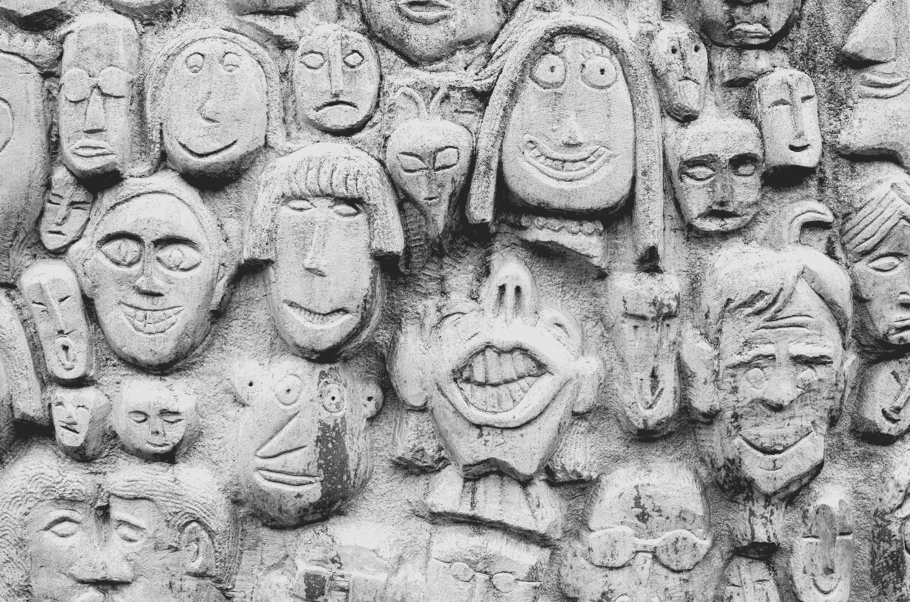
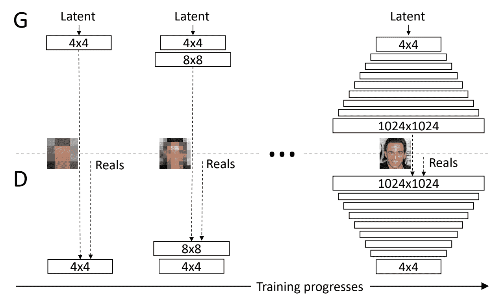
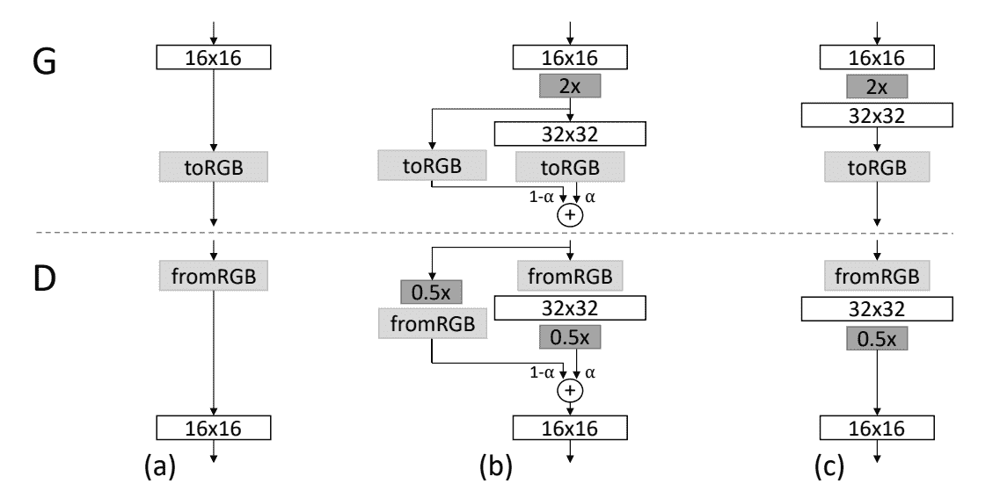
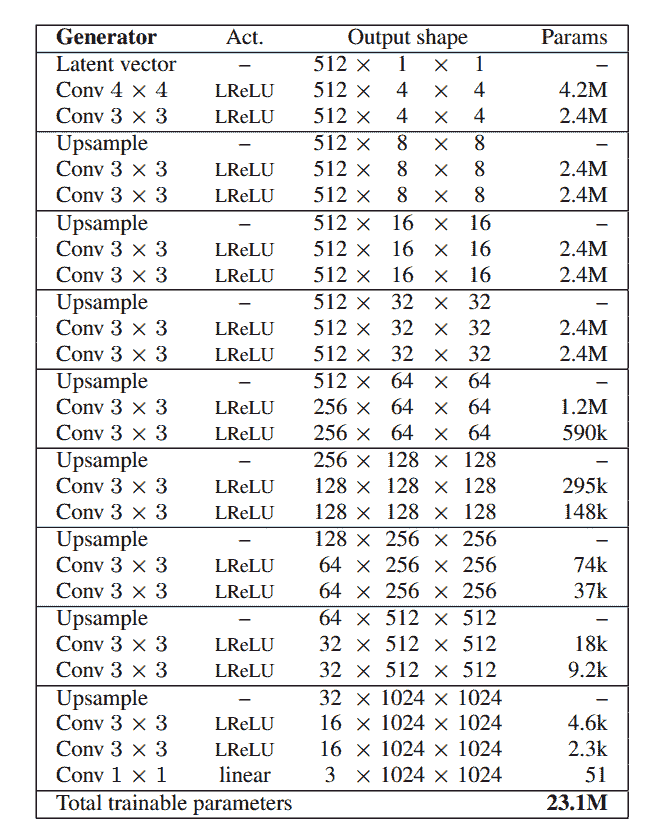
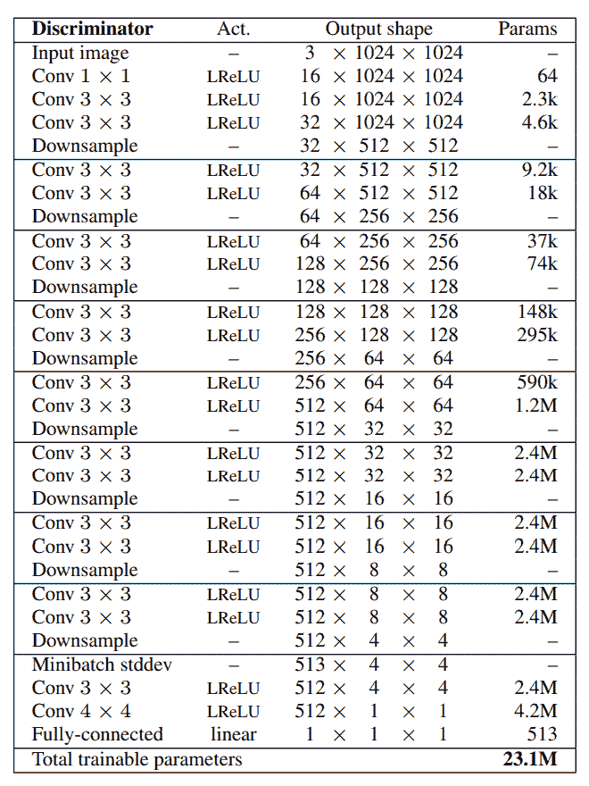
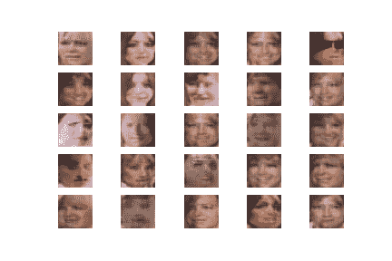
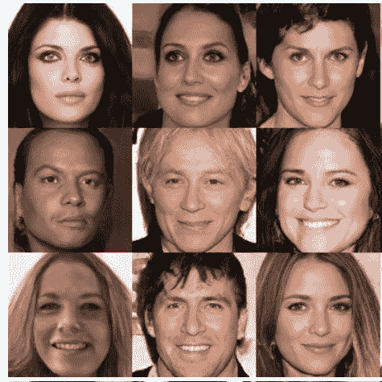

# ProGAN:渐进增长的生成性对抗网络

> 原文：<https://blog.paperspace.com/progan/>



Photo by [Andrew Seaman](https://unsplash.com/@amseaman?utm_source=ghost&utm_medium=referral&utm_campaign=api-credit) / [Unsplash](https://unsplash.com/?utm_source=ghost&utm_medium=referral&utm_campaign=api-credit)

人类学习的过程是一个渐进的曲线。作为婴儿，我们在几个月的时间里慢慢地从坐、爬、站、走、跑等等进步。大多数对概念的理解也是从初学者逐渐进步，并继续学习到高级/大师水平。即使是语言的学习也是一个渐进的过程，从学习字母表、理解单词开始，最后发展形成句子的能力。这些例子提供了人类如何理解最基本概念的要点。我们慢慢适应并学习新的主题，但这样的场景在机器和深度学习模型的情况下如何工作？

在以前的博客中，我们已经研究了几种不同类型的生成性敌对网络，它们都有自己独特的方法来获得特定的目标。之前的一些作品包括[循环甘](https://blog.paperspace.com/unpaired-image-to-image-translations-with-cycle-gans/)、 [pix-2-pix 甘](https://blog.paperspace.com/pix2pix-gan/)、【their 甘，以及其他多个生成网络，都有各自独特的特质。然而，在这篇文章中，我们将重点关注一个名为*GANs*Progressive Growing 的生成性对抗网络，它以大多数人都会采用的方式学习模式，从最低级开始，到更高级的理解。本文提供的代码可以有效地运行在 Paperspace Gradient 平台上，利用其大规模、高质量的资源来实现预期的结果。

## 简介:

在 ProGANs 之前建立的大多数生成网络使用独特的技术，主要涉及损失函数的修改以获得期望的结果。这些体系结构的生成器和鉴别器中的层总是同时被训练。此时，大多数生成网络都在改进其他基本特征和参数，以提高结果，但并不真正涉及渐进增长。然而，随着*逐渐增长的生成性对抗网络*的引入，训练程序的重点是逐渐增长网络，一次一层。

对于这种渐进增长的训练过程，直观的想法是经常人为地将训练图像缩小和收缩到最小的像素化尺寸。一旦我们有了最低分辨率的图像，我们就可以开始训练程序，随着时间的推移获得稳定性。在本文中，我们将更详细地探讨 ProGANs。在接下来的部分中，我们将学习对 ProGANs 如何工作有一个概念性理解的大部分要求。然后从头开始构建网络以生成面部结构。事不宜迟，让我们深入了解这些创意网络。

* * *

## 理解程序:



[Image Source](https://arxiv.org/pdf/1710.10196.pdf)

ProGAN 网络的主要思想是从最低层到最高层构建。在接下来的[研究论文](https://arxiv.org/pdf/1710.10196.pdf)中，作者描述了生成器和鉴别器逐步学习的方法。如上图所示，我们从一个 4 x 4 的低分辨率图像开始，然后开始添加额外的微调和更高的参数变量，以获得更有效的结果。网络首先学习并理解 4 x 4 图像的工作原理。一旦完成，我们开始教它 8 x 8 的图像，16 x 16 的分辨率，等等。上述示例中使用的最高分辨率为 1024 x 1024。

这种渐进式训练的方法使模型在整个训练过程中获得了前所未有的结果，整体稳定性更高。我们知道，这一革命性网络的主要理念之一是利用不断发展的技术。我们之前也注意到，它没有像其他架构一样过多地考虑这些网络的损失函数。在本实验中使用了默认的 Wasserstein 损失，但是也可以使用其他类似的损失函数，如最小平方损失。观众可以从我之前的一篇关于沃瑟斯坦生成对抗网络(WGAN)的文章中，通过这个[链接](https://blog.paperspace.com/wgans/)了解更多关于这种损失的信息。

除了渐进生长网络的概念之外，本文还介绍了其他一些有意义的主题，即最小批量标准偏差、新层中的褪色、像素归一化和均衡学习速率。在我们着手实现这些概念之前，我们将在本节中更详细地探索和理解每一个概念。

由于只考虑小批量，所以小批量标准偏差鼓励生成网络在生成的图像中产生更多变化。由于只考虑小批量，鉴别器更容易区分图像的真假，迫使生成器生成更多种类的图像。这种简单的技术解决了生成网络的一个主要问题，与各自的训练数据相比，生成的图像通常变化较小。



[Image Source](https://arxiv.org/pdf/1710.10196.pdf)

研究论文中讨论的另一个重要概念是在新层中引入淡化。当从一个阶段过渡到另一个阶段时，即从较低分辨率切换到下一个较高分辨率时，新的层被平滑地淡入。这防止了在添加这个新层时先前的层受到突然的“冲击”。参数$\alpha$用于控制衰落。该参数在多次训练迭代中线性插值。如上图所示，最终公式可以写成如下形式:

$$(1-\ alpha)\倍上采样\，层+(\ alpha)\倍输出\，层$ $

我们将在本节简要介绍的最后两个概念是均衡学习率和像素归一化。通过均衡的学习速率，我们可以相应地调整每一层的权重。公式类似于明凯初始化或 he 初始化。但是均衡学习率在每次向前传递时都使用它，而不是把它作为一个单独的初始化器。最后，使用像素归一化代替批量归一化，因为注意到内部协变量移位的问题在 GANs 中并不突出。像素归一化将每个像素中的特征向量归一化为单位长度。有了对这些基本概念的理解，我们可以着手构建用于生成面部图像的 ProGAN 网络架构。

* * *

## 从零开始构建 ProGAN 架构网络:

在本节中，我们将涵盖从零开始构建渐进增长的生成性对抗网络所需的大多数必要元素。我们将致力于利用这些网络架构生成面部图像。完成这个编码构建的主要要求是一个像样的用于训练的 GPU(或 Paperspace Gradient Platform)以及 TensorFlow 和 Keras 深度学习框架的一些基础知识。如果你不熟悉这两个库，我推荐你看看 TensorFlow 的这个[链接](https://blog.paperspace.com/absolute-guide-to-tensorflow/)和 Keras 的下面这个[链接](https://blog.paperspace.com/the-absolute-guide-to-keras/)。让我们从导入必要的库开始。

### 导入基本库:

第一步，我们将导入有效计算 ProGAN 网络所需的所有基本库。我们将导入 TensorFlow 和 Keras 深度学习框架，用于构建最佳鉴别器和生成器网络。NumPy 库将用于大多数需要执行的数学运算。我们也将利用一些计算机视觉库来相应地处理图像。此外，可以使用简单的 pip install 命令安装 mtcnn 库。下面是代表这个项目所需的所有库的代码片段。

```py
from math import sqrt
from numpy import load, asarray, zeros, ones, savez_compressed
from numpy.random import randn, randint
from skimage.transform import resize
from tensorflow.keras.optimizers import Adam
from tensorflow.keras.models import Sequential, Model
from tensorflow.keras.layers import Input, Dense, Flatten, Reshape, Conv2D
from tensorflow.keras.layers import UpSampling2D, AveragePooling2D, LeakyReLU, Layer, Add
from keras.constraints import max_norm
from keras.initializers import RandomNormal
import mtcnn
from mtcnn.mtcnn import MTCNN
from keras import backend
from matplotlib import pyplot
import cv2
import os
from os import listdir
from PIL import Image
import cv2
```

### 数据预处理:

本项目数据集可从以下 [网站](https://drive.google.com/file/d/0B7EVK8r0v71pZjFTYXZWM3FlRnM/view?usp=sharing&resourcekey=0-dYn9z10tMJOBAkviAcfdyQ)下载。*名人面孔属性(CelebA)数据集*是用于面部检测和识别相关任务的更受欢迎的数据集之一。在本文中，我们将主要使用这些数据，在 ProGAN 网络的帮助下生成新的独特面孔。我们将在下一个代码块中定义的一些基本函数将帮助我们以更合适的方式处理项目。首先，我们将定义一个函数来加载图像，将其转换为 RGB 图像，并以 numpy 数组的形式存储它。

在接下来的几个函数中，我们将利用预训练的多任务级联卷积神经网络(MTCNN)，它被认为是用于人脸检测的最先进的精度深度学习模型。使用这个模型的主要目的是确保我们只考虑这个名人数据集中可用的人脸，而忽略一些不必要的背景特征。因此，在将图像调整到所需的大小之前，我们将使用之前安装在本地系统上的 mtcnn 库来执行面部检测和提取。

```py
# Loading the image file
def load_image(filename):
    image = Image.open(filename)
    image = image.convert('RGB')
    pixels = asarray(image)
    return pixels

# extract the face from a loaded image and resize
def extract_face(model, pixels, required_size=(128, 128)):
    # detect face in the image
    faces = model.detect_faces(pixels)
    if len(faces) == 0:
        return None

    # extract details of the face
    x1, y1, width, height = faces[0]['box']
    x1, y1 = abs(x1), abs(y1)

    x2, y2 = x1 + width, y1 + height
    face_pixels = pixels[y1:y2, x1:x2]
    image = Image.fromarray(face_pixels)
    image = image.resize(required_size)
    face_array = asarray(image)

    return face_array

# load images and extract faces for all images in a directory
def load_faces(directory, n_faces):
    # prepare model
    model = MTCNN()
    faces = list()

    for filename in os.listdir(directory):
        # Computing the retrieval and extraction of faces
        pixels = load_image(directory + filename)
        face = extract_face(model, pixels)
        if face is None:
            continue
        faces.append(face)
        print(len(faces), face.shape)
        if len(faces) >= n_faces:
            break

    return asarray(faces)
```

根据您的系统功能，下一步可能需要一些时间来完全计算。数据集中有大量可用的数据。如果读者有更多的时间和计算资源，最好提取整个数据，并在完整的 CelebA 数据集上进行训练。然而，出于本文的目的，我将只利用 10000 张图片进行个人培训。使用下面的代码片段，我们可以提取数据并以. npz 压缩格式保存，以备将来使用。

```py
# load and extract all faces
directory = 'img_align_celeba/img_align_celeba/'
all_faces = load_faces(directory, 10000)
print('Loaded: ', all_faces.shape)

# save in compressed format
savez_compressed('img_align_celeba_128.npz', all_faces)
```

可以加载保存的数据，如下面的代码片段所示。

```py
# load the prepared dataset
from numpy import load
data = load('img_align_celeba_128.npz')
faces = data['arr_0']
print('Loaded: ', faces.shape)
```

### 构建基本功能:

在这一节中，我们将着重于构建我们之前在理解 ProGANs 如何工作时讨论过的所有函数。我们将首先构造像素归一化函数，该函数允许我们将每个像素中的特征向量归一化为单位长度。下面的代码片段可用于计算相应的像素归一化。

```py
# pixel-wise feature vector normalization layer
class PixelNormalization(Layer):
    # initialize the layer
    def __init__(self, **kwargs):
        super(PixelNormalization, self).__init__(**kwargs)

    # perform the operation
    def call(self, inputs):
        # computing pixel values
        values = inputs**2.0
        mean_values = backend.mean(values, axis=-1, keepdims=True)
        mean_values += 1.0e-8
        l2 = backend.sqrt(mean_values)
        normalized = inputs / l2
        return normalized

    # define the output shape of the layer
    def compute_output_shape(self, input_shape):
        return input_shape
```

在我们之前讨论的下一个重要方法中，我们将确保模型在小批量标准偏差上训练。小批量功能仅用于鉴频器网络的输出层。我们利用 minibatch 标准偏差来确保模型考虑较小的批次，从而使生成的各种图像更加独特。下面是计算迷你批次标准差的代码片段。

```py
# mini-batch standard deviation layer
class MinibatchStdev(Layer):
    # initialize the layer
    def __init__(self, **kwargs):
        super(MinibatchStdev, self).__init__(**kwargs)

    # perform the operation
    def call(self, inputs):
        mean = backend.mean(inputs, axis=0, keepdims=True)
        squ_diffs = backend.square(inputs - mean)
        mean_sq_diff = backend.mean(squ_diffs, axis=0, keepdims=True)
        mean_sq_diff += 1e-8
        stdev = backend.sqrt(mean_sq_diff)

        mean_pix = backend.mean(stdev, keepdims=True)
        shape = backend.shape(inputs)
        output = backend.tile(mean_pix, (shape[0], shape[1], shape[2], 1))

        combined = backend.concatenate([inputs, output], axis=-1)
        return combined

    # define the output shape of the layer
    def compute_output_shape(self, input_shape):
        input_shape = list(input_shape)
        input_shape[-1] += 1
        return tuple(input_shape)
```

下一步，我们将计算加权和并定义 Wasserstein 损失函数。如前所述，加权和类将用于层中的平滑衰落。我们将使用$\alpha$值计算输出，正如我们在上一节中所述。下面是以下操作的代码块。

```py
# weighted sum output
class WeightedSum(Add):
    # init with default value
    def __init__(self, alpha=0.0, **kwargs):
        super(WeightedSum, self).__init__(**kwargs)
        self.alpha = backend.variable(alpha, name='ws_alpha')

    # output a weighted sum of inputs
    def _merge_function(self, inputs):
        # only supports a weighted sum of two inputs
        assert (len(inputs) == 2)
        # ((1-a) * input1) + (a * input2)
        output = ((1.0 - self.alpha) * inputs[0]) + (self.alpha * inputs[1])
        return output

# calculate wasserstein loss
def wasserstein_loss(y_true, y_pred):
    return backend.mean(y_true * y_pred)
```

最后，我们将定义为图像合成项目创建 ProGAN 网络架构所需的一些基本功能。我们将定义函数来为发生器和鉴别器网络生成真实和虚假样本。然后，我们将更新淡入值，并相应地缩放数据集。所有这些步骤都在它们各自的函数中定义，这些函数可以从下面定义的代码片段中获得。

```py
# load dataset
def load_real_samples(filename):
    data = load(filename)
    X = data['arr_0']
    X = X.astype('float32')
    X = (X - 127.5) / 127.5
    return X

# select real samples
def generate_real_samples(dataset, n_samples):
    ix = randint(0, dataset.shape[0], n_samples)
    X = dataset[ix]
    y = ones((n_samples, 1))
    return X, y

# generate points in latent space as input for the generator
def generate_latent_points(latent_dim, n_samples):
    x_input = randn(latent_dim * n_samples)
    x_input = x_input.reshape(n_samples, latent_dim)
    return x_input

# use the generator to generate n fake examples, with class labels
def generate_fake_samples(generator, latent_dim, n_samples):
    x_input = generate_latent_points(latent_dim, n_samples)
    X = generator.predict(x_input)
    y = -ones((n_samples, 1))
    return X, y

# update the alpha value on each instance of WeightedSum
def update_fadein(models, step, n_steps):
    alpha = step / float(n_steps - 1)
    for model in models:
        for layer in model.layers:
            if isinstance(layer, WeightedSum):
                backend.set_value(layer.alpha, alpha)

# scale images to preferred size
def scale_dataset(images, new_shape):
    images_list = list()
    for image in images:
        new_image = resize(image, new_shape, 0)
        images_list.append(new_image)
    return asarray(images_list)
```

### 创建发电机网络:



[Image Source](https://arxiv.org/pdf/1710.10196.pdf)

生成器架构包括一个潜在向量空间，我们可以在其中初始化初始参数，以生成所需的图像。一旦我们定义了潜在向量空间，我们将获得 4×4 的维度，这将允许我们处理初始输入图像。然后，我们将继续添加上采样和卷积层，以及带有泄漏 ReLU 激活功能的几个块的像素归一化层。最后，我们将添加 1 x 1 卷积来映射 RGB 图像。

除了一些小的例外，开发的生成器将利用研究论文中的大多数特性。我们将使用 128 个过滤器，而不是使用 512 个或更多的过滤器，因为我们正在用更小的图像尺寸构建架构。代替均衡的学习速率，我们将利用高斯随机数和最大范数权重约束。我们将首先定义一个生成器块，然后开发整个生成器模型网络。下面是生成器块的代码片段。

```py
# adding a generator block
def add_generator_block(old_model):
    init = RandomNormal(stddev=0.02)
    const = max_norm(1.0)
    block_end = old_model.layers[-2].output

    # upsample, and define new block
    upsampling = UpSampling2D()(block_end)
    g = Conv2D(128, (3,3), padding='same', kernel_initializer=init, kernel_constraint=const)(upsampling)
    g = PixelNormalization()(g)
    g = LeakyReLU(alpha=0.2)(g)
    g = Conv2D(128, (3,3), padding='same', kernel_initializer=init, kernel_constraint=const)(g)
    g = PixelNormalization()(g)
    g = LeakyReLU(alpha=0.2)(g)

    out_image = Conv2D(3, (1,1), padding='same', kernel_initializer=init, kernel_constraint=const)(g)
    model1 = Model(old_model.input, out_image)
    out_old = old_model.layers[-1]
    out_image2 = out_old(upsampling)

    merged = WeightedSum()([out_image2, out_image])
    model2 = Model(old_model.input, merged)
    return [model1, model2]
```

下面是完成每个连续层的生成器架构的代码片段。

```py
# define generator models
def define_generator(latent_dim, n_blocks, in_dim=4):
    init = RandomNormal(stddev=0.02)
    const = max_norm(1.0)
    model_list = list()
    in_latent = Input(shape=(latent_dim,))
    g  = Dense(128 * in_dim * in_dim, kernel_initializer=init, kernel_constraint=const)(in_latent)
    g = Reshape((in_dim, in_dim, 128))(g)

    # conv 4x4, input block
    g = Conv2D(128, (3,3), padding='same', kernel_initializer=init, kernel_constraint=const)(g)
    g = PixelNormalization()(g)
    g = LeakyReLU(alpha=0.2)(g)

    # conv 3x3
    g = Conv2D(128, (3,3), padding='same', kernel_initializer=init, kernel_constraint=const)(g)
    g = PixelNormalization()(g)
    g = LeakyReLU(alpha=0.2)(g)

    # conv 1x1, output block
    out_image = Conv2D(3, (1,1), padding='same', kernel_initializer=init, kernel_constraint=const)(g)
    model = Model(in_latent, out_image)
    model_list.append([model, model])

    for i in range(1, n_blocks):
        old_model = model_list[i - 1][0]
        models = add_generator_block(old_model)
        model_list.append(models)

    return model_list
```

### 创建鉴别器网络:



[Image Source](https://arxiv.org/pdf/1710.10196.pdf)

对于鉴别器架构，我们将对生成器网络的构建方式进行逆向工程。我们将从一幅 RGB 图像开始，通过一系列卷积层进行下采样。一堆模块将重复这种模式，但在最后，在输出模块，我们将添加一个 minibatch 标准差层，与之前的输出连接。最后，在两个额外的卷积层之后，我们将使鉴别器输出单个输出，这决定了生成的图像是假的还是真的。下面是添加鉴别器块的代码片段。

```py
# adding a discriminator block
def add_discriminator_block(old_model, n_input_layers=3):
    init = RandomNormal(stddev=0.02)
    const = max_norm(1.0)
    in_shape = list(old_model.input.shape)

    # define new input shape as double the size
    input_shape = (in_shape[-2]*2, in_shape[-2]*2, in_shape[-1])
    in_image = Input(shape=input_shape)

    # define new input processing layer
    d = Conv2D(128, (1,1), padding='same', kernel_initializer=init, kernel_constraint=const)(in_image)
    d = LeakyReLU(alpha=0.2)(d)

    # define new block
    d = Conv2D(128, (3,3), padding='same', kernel_initializer=init, kernel_constraint=const)(d)
    d = LeakyReLU(alpha=0.2)(d)
    d = Conv2D(128, (3,3), padding='same', kernel_initializer=init, kernel_constraint=const)(d)
    d = LeakyReLU(alpha=0.2)(d)
    d = AveragePooling2D()(d)
    block_new = d

    # skip the input, 1x1 and activation for the old model
    for i in range(n_input_layers, len(old_model.layers)):
        d = old_model.layers[i](d)
    model1 = Model(in_image, d)

    model1.compile(loss=wasserstein_loss, optimizer=Adam(lr=0.001, beta_1=0, beta_2=0.99, epsilon=10e-8))

    downsample = AveragePooling2D()(in_image)

    block_old = old_model.layers[1](downsample)
    block_old = old_model.layers[2](block_old)
    d = WeightedSum()([block_old, block_new])

    for i in range(n_input_layers, len(old_model.layers)):
        d = old_model.layers[i](d)

    model2 = Model(in_image, d)

    model2.compile(loss=wasserstein_loss, optimizer=Adam(lr=0.001, beta_1=0, beta_2=0.99, epsilon=10e-8))
    return [model1, model2]
```

下面是完成每个连续层的鉴别器架构的代码片段。

```py
# define the discriminator models for each image resolution
def define_discriminator(n_blocks, input_shape=(4,4,3)):
    init = RandomNormal(stddev=0.02)
    const = max_norm(1.0)
    model_list = list()
    in_image = Input(shape=input_shape)

    d = Conv2D(128, (1,1), padding='same', kernel_initializer=init, kernel_constraint=const)(in_image)
    d = LeakyReLU(alpha=0.2)(d)
    d = MinibatchStdev()(d)

    d = Conv2D(128, (3,3), padding='same', kernel_initializer=init, kernel_constraint=const)(d)
    d = LeakyReLU(alpha=0.2)(d)
    d = Conv2D(128, (4,4), padding='same', kernel_initializer=init, kernel_constraint=const)(d)
    d = LeakyReLU(alpha=0.2)(d)

    d = Flatten()(d)
    out_class = Dense(1)(d)

    model = Model(in_image, out_class)
    model.compile(loss=wasserstein_loss, optimizer=Adam(lr=0.001, beta_1=0, beta_2=0.99, epsilon=10e-8))
    model_list.append([model, model])

    for i in range(1, n_blocks):
        old_model = model_list[i - 1][0]
        models = add_discriminator_block(old_model)
        model_list.append(models)

    return model_list
```

### 开发 ProGAN 模型体系结构:

一旦我们完成了对单个发生器和鉴别器网络的定义，我们将创建一个整体的复合模型，将它们结合起来以创建 ProGAN 模型架构。一旦我们组合了生成器模型，我们就可以编译它们并相应地训练它们。让我们定义创建复合程序网络的函数。

```py
# define composite models for training generators via discriminators

def define_composite(discriminators, generators):
    model_list = list()
    # create composite models
    for i in range(len(discriminators)):
        g_models, d_models = generators[i], discriminators[i]
        # straight-through model
        d_models[0].trainable = False
        model1 = Sequential()
        model1.add(g_models[0])
        model1.add(d_models[0])
        model1.compile(loss=wasserstein_loss, optimizer=Adam(lr=0.001, beta_1=0, beta_2=0.99, epsilon=10e-8))
        # fade-in model
        d_models[1].trainable = False
        model2 = Sequential()
        model2.add(g_models[1])
        model2.add(d_models[1])
        model2.compile(loss=wasserstein_loss, optimizer=Adam(lr=0.001, beta_1=0, beta_2=0.99, epsilon=10e-8))
        # store
        model_list.append([model1, model2])
    return model_list
```

最后，一旦我们创建了整体的复合模型，我们就可以开始训练过程了。训练网络的大部分步骤与我们之前训练 GANs 的方式相似。然而，在训练过程中还引入了渐强层和渐进生长 GAN 的渐进更新。下面是创建训练时期的代码块。

```py
# train a generator and discriminator
def train_epochs(g_model, d_model, gan_model, dataset, n_epochs, n_batch, fadein=False):
    bat_per_epo = int(dataset.shape[0] / n_batch)
    n_steps = bat_per_epo * n_epochs
    half_batch = int(n_batch / 2)

    for i in range(n_steps):
        # update alpha for all WeightedSum layers when fading in new blocks
        if fadein:
            update_fadein([g_model, d_model, gan_model], i, n_steps)
        # prepare real and fake samples
        X_real, y_real = generate_real_samples(dataset, half_batch)
        X_fake, y_fake = generate_fake_samples(g_model, latent_dim, half_batch)

        # update discriminator model
        d_loss1 = d_model.train_on_batch(X_real, y_real)
        d_loss2 = d_model.train_on_batch(X_fake, y_fake)

        # update the generator via the discriminator's error
        z_input = generate_latent_points(latent_dim, n_batch)
        y_real2 = ones((n_batch, 1))
        g_loss = gan_model.train_on_batch(z_input, y_real2)

        # summarize loss on this batch
        print('>%d, d1=%.3f, d2=%.3f g=%.3f' % (i+1, d_loss1, d_loss2, g_loss))

# train the generator and discriminator
def train(g_models, d_models, gan_models, dataset, latent_dim, e_norm, e_fadein, n_batch):
    g_normal, d_normal, gan_normal = g_models[0][0], d_models[0][0], gan_models[0][0]
    gen_shape = g_normal.output_shape
    scaled_data = scale_dataset(dataset, gen_shape[1:])
    print('Scaled Data', scaled_data.shape)

    # train normal or straight-through models
    train_epochs(g_normal, d_normal, gan_normal, scaled_data, e_norm[0], n_batch[0])
    summarize_performance('tuned', g_normal, latent_dim)

    # process each level of growth
    for i in range(1, len(g_models)):
        # retrieve models for this level of growth
        [g_normal, g_fadein] = g_models[i]
        [d_normal, d_fadein] = d_models[i]
        [gan_normal, gan_fadein] = gan_models[i]

        # scale dataset to appropriate size
        gen_shape = g_normal.output_shape
        scaled_data = scale_dataset(dataset, gen_shape[1:])
        print('Scaled Data', scaled_data.shape)

        # train fade-in models for next level of growth
        train_epochs(g_fadein, d_fadein, gan_fadein, scaled_data, e_fadein[i], n_batch[i], True)
        summarize_performance('faded', g_fadein, latent_dim)

        # train normal or straight-through models
        train_epochs(g_normal, d_normal, gan_normal, scaled_data, e_norm[i], n_batch[i])
        summarize_performance('tuned', g_normal, latent_dim)
```

在培训过程中，我们还将定义一个自定义函数，帮助我们相应地评估我们的结果。我们可以总结我们的性能，并绘制一些从每次迭代中生成的图，以查看我们对结果的改进有多好。下面是总结我们整体模型性能的代码片段。

```py
# generate samples and save as a plot and save the model
def summarize_performance(status, g_model, latent_dim, n_samples=25):
    gen_shape = g_model.output_shape
    name = '%03dx%03d-%s' % (gen_shape[1], gen_shape[2], status)

    X, _ = generate_fake_samples(g_model, latent_dim, n_samples)
    X = (X - X.min()) / (X.max() - X.min())

    square = int(sqrt(n_samples))
    for i in range(n_samples):
        pyplot.subplot(square, square, 1 + i)
        pyplot.axis('off')
        pyplot.imshow(X[i])

    # save plot to file
    filename1 = 'plot_%s.png' % (name)
    pyplot.savefig(filename1)
    pyplot.close()

    filename2 = 'model_%s.h5' % (name)
    g_model.save(filename2)
    print('>Saved: %s and %s' % (filename1, filename2))
```

最后，一旦相应地定义了所有必要的功能，我们就可以开始训练过程了。为了提高稳定性，我们将对小图像使用较大的批量大小和较小的时期，同时减少批量大小和增加时期的数量以实现更大的图像缩放。为图像合成训练 ProGAN 网络的代码片段如下所示。

```py
# number of growth phases where 6 blocks == [4, 8, 16, 32, 64, 128]
n_blocks = 6
latent_dim = 100

d_models = define_discriminator(n_blocks)
g_models = define_generator(latent_dim, n_blocks)
gan_models = define_composite(d_models, g_models)

dataset = load_real_samples('img_align_celeba_128.npz')
print('Loaded', dataset.shape)

n_batch = [16, 16, 16, 8, 4, 4]
n_epochs = [5, 8, 8, 10, 10, 10]

train(g_models, d_models, gan_models, dataset, latent_dim, n_epochs, n_epochs, n_batch)
```

### 结果和进一步讨论:

```py
>12500, d1=1756536064.000, d2=8450036736.000 g=-378913792.000
Saved: plot_032x032-faded.png and model_032x032-faded.h5 
```

下图显示了我在多次训练后进行 32 x 32 的上采样后获得的结果。



Image by Author

理想情况下，如果您有更多的时间、图像和计算资源来训练，我们将能够获得与下图类似的结果。



Ideal Results from [research paper](https://arxiv.org/pdf/1710.10196.pdf)

大部分代码来自机器学习知识库网站，我强烈推荐通过下面的[链接](https://machinelearningmastery.com/how-to-train-a-progressive-growing-gan-in-keras-for-synthesizing-faces/)查看。可以对下面的项目进行一些改进和补充。我们可以通过使用更高的图像质量、增加训练迭代次数和整体计算能力来改进数据集。另一个想法是将 ProGAN 网络与 SRGAN 架构合并，以创建独特的组合可能性。我建议感兴趣的读者尝试各种可能的结果。

* * *

## 结论:


Photo by [Birmingham Museums Trust](https://unsplash.com/@birminghammuseumstrust?utm_source=ghost&utm_medium=referral&utm_campaign=api-credit) / [Unsplash](https://unsplash.com/?utm_source=ghost&utm_medium=referral&utm_campaign=api-credit)

生物学习的一切都是循序渐进的，要么从以前的错误中适应，要么从零开始学习，同时慢慢发展任何特定概念、想法或想象的每个方面。我们不是直接创造大句子，而是先学习字母、小单词等等，直到我们能够创造更长的句子。类似地，ProGAN 网络使用类似的直观方法，其中模型从最低的像素分辨率开始学习。然后，它逐渐学习更高分辨率的递增模式，以在光谱的末端实现高质量的结果。

在本文中，我们讨论了获得对用于高质量图像生成的 ProGAN 网络的基本直观理解所需的大部分主题。我们从 ProGAN 网络的基本介绍开始，然后继续理解其作者在其研究论文中介绍的大多数独特方面，以实现前所未有的结果。最后，我们使用获得的知识从零开始构建一个 ProGAN 网络，用于使用 Celeb-A 数据集生成面部图像。虽然训练是针对有限的分辨率进行的，但是读者可以进行进一步的实验，一直到更高质量的分辨率。这些生成网络有无限的发展空间。

在接下来的文章中，我们将涵盖更多的生成性对抗网络的变体，比如 StyleGAN 架构等等。我们也将获得对可变自动编码器的概念性理解，并参与更多的信号处理项目。在那之前，继续尝试和编码更多独特的深度学习和 AI 项目！