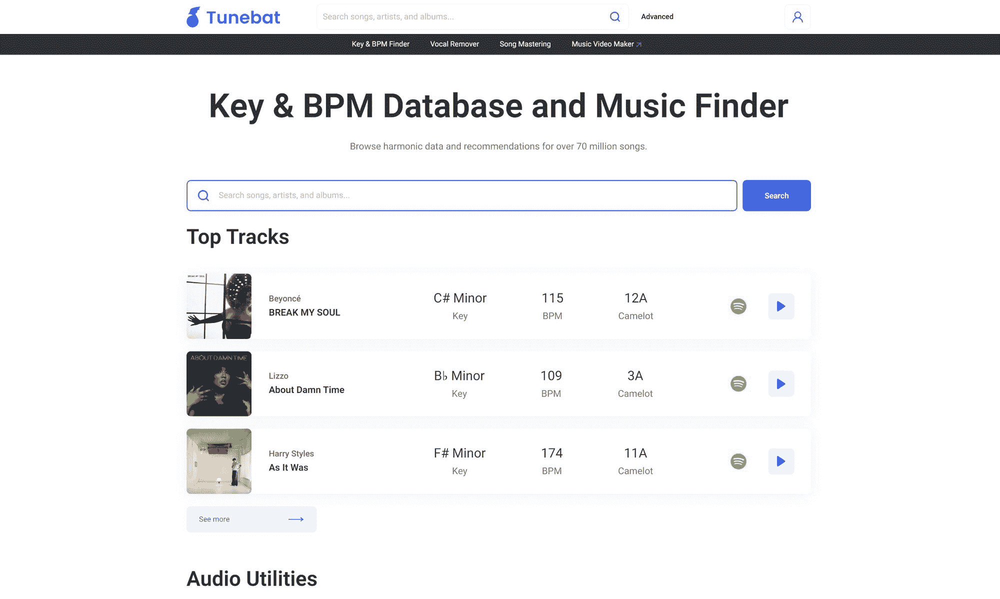
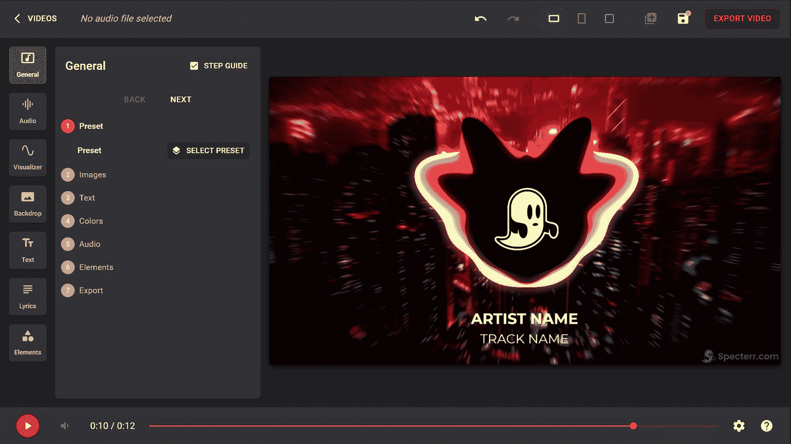

# Tunebat 和 Specterr 将机器学习带到了 DJ 展台和舞池

> 原文：<https://blog.paperspace.com/tunebat-and-specterr-bring-machine-learning-to-the-dj/>

我们一直有兴趣了解更多的事情之一是 ML 在音乐行业中的使用。我们最近发布了关于使用 LSTMs 生成[音乐和使用深度学习](https://blog.paperspace.com/music-generation-with-lstms/)进行[音频分类的教程，但是那些为音频专业人员开发基于 ML 特性的应用程序的公司呢？](https://blog.paperspace.com/audio-classification-with-deep-learning/)

这就是奥利弗·雷兹尼克发挥作用的地方。Oliver 和他的团队花了几年时间为音乐家、DJ 和制作人开发了一对 ML 驱动的应用程序，名为 Tunebat 和 Specterr。我们很幸运地与奥利弗坐在一起，一起探讨其中的一些话题。

让我们一起深入 ML 辅助专业音频工具的世界吧！

Tunebat makes it easy to identify the key and beats per minute of any song.

***paper space***:**你现在正在同时构建两个应用程序，对吗？你能告诉我们关于 Tunebat 和 Specterr 的事情吗？**

*****雷兹尼克*** :是的没错。 [Tunebat](https://tunebat.com/) 是一款网络应用，拥有许多不同的音乐相关功能，可能最出名的是让人们可以轻松找到歌曲的基调和 BPM(每分钟节拍数)。您可以浏览音乐数据库或上传音频文件，通过[键& BPM finder](https://tunebat.com/Analyzer) 进行分析。此外，Tunebat 还可以帮助用户进行音乐发现、[人声去除](https://tunebat.com/Vocal-Remover)和自动化母带制作。**

**Specterr 是一家在线音乐视频制作商。用户上传音频文件，并使用基于网络的编辑器创建定制的视频。导出后，视频可以下载或发布到社交媒体上，以帮助宣传该艺术家。Specterr 专门从事[音乐可视化器](https://specterr.com/music-visualizer/)和[抒情视频](https://specterr.com/lyric-video-maker/)创作。**

*****Paperspace*** :我们对你如何开始这些想法很感兴趣。你是如何以及何时知道自己发现了对音乐产业有用的东西的？你的 MVP 是什么样的？**

*****雷兹尼克*** :最初我对学习如何做 DJ 很感兴趣，我想找一些能很好地融合在一起的歌曲。DJ 通常喜欢将具有相似 BPM 和调的曲目混合，以实现平滑过渡。当我试着用谷歌搜索歌曲的基调和 BPM 时，什么都没有出现。因此，我暂时搁置了我的 DJ 梦想，创建了 Tunebat，作为一种找到这些信息的简单方法。**

**同样的数据也可以用来为 DJ 混音提供更好的音乐发现。MVP 是当今 Tunebat 的数据库部分的一个更加基础和丑陋的版本。在首次发布后不久，我在 DJ 留言板上发布了一个链接，流量开始涌入。用户喜欢它，并不断回来，所以我知道 Tunebat 满足了需求。**

**斯佩克特这个想法又一次来自我的个人经历。作为一名业余 EDM 制作人，我需要音乐视频，以便在视频平台上发布我的音乐。现有的音乐视频工具要么使用起来太单调乏味，无法实现正确的效果，要么用户体验很差。因此，我建立了一个视频渲染引擎，并开始接受艺术家的订单，我会用引擎为他们手动创建视频。**

**这对任何人来说都不是一个理想的过程，但是需求仍然存在。因此，Specterr 被创建为音乐视频定制和呈现的自助服务平台。**

**

“Paperspace 是将配备 GPU 的机器整合到我们的云基础设施中的理想平台。Tunebat 人声去除器依靠 GPU 来处理具有复杂模型的音频文件。另一方面，Specterr 依靠 GPU 来加速视频渲染过程，因此可以及时生成视频。Paperspace 支持这两种使用情形。”

奥利弗·雷兹尼克，Tunebat 和 Specterr 的创始人** 

*****paper space***:tune bat 能够将一个音轨解析成几个组成部分，包括每分钟节拍(BPM)和调号(或者 Camelot Wheel 上的位置)。它还能够从音轨中删除人声。你能告诉我们一些这些功能是如何工作的吗？**

*****雷兹尼克*** :确定。对于音频分析仪，我们与巴塞罗那 Pompeu Fabra 大学的音乐技术团队密切合作。**

**我们在 Tunebat 上实现了他们的 [essentia.js](https://mtg.github.io/essentia.js/) 库。这允许我们在客户端使用 Essentia 项目的算法和模型来确定音频特征。这里的主要 ML 用例是用于情绪分析，这在上下文中意味着确定一首曲目的感知能量、可跳舞性和快乐度。**

**Essentia.js 非常酷，因为它能够完全在网络浏览器中使用模型有效地分析这些音频文件。**

**人声去除器还使用模型来识别音轨的人声和乐器部分。然后它将这些部分分割成单独的文件。这个过程是在云中使用 PyTorch 在支持 GPU 的 Paperspace 虚拟机上完成的。**

***:Specterr 能够从一首歌曲中生成一些非常有趣的音乐感知视觉效果。你能告诉我们它是如何工作的吗？***

***使用 Specterr，重要的是视觉效果要与音频相得益彰，而不是相互竞争。可视化工具生成响应并强调所提交的音乐文件的特征的动画。***

***Specterr 使用 FFT(快速傅立叶变换)分析文件，FFT 收集振幅和频率数据。该数据然后被用于生成音频可视化。***

***我们已经花了大量的时间来弄清楚如何处理这些数据，以创建美观的视觉效果。我们的引擎使用各种内部算法来制作各种视频元素的动画。***

***当视频与音频同步时，您会看到随着音乐起舞的视觉效果。***

***

Specterr analyzes a song file for amplitude and frequency and then generates dramatic visualizations to accompany the music*** 

******Paperspace*** :前进的路线图会是什么样子？你如何决定下一步添加什么特性？在采纳过程中，你从用户那里寻找什么信号？***

***雷兹尼克 :我们一直致力于改进和增加新功能。在评估一个功能的影响时，我们主要看使用量和保持率。人声去除器已经成为 Tunebat 上最常用的功能之一，所以我们打算很快扩展它，增加新的去除选项，如鼓、贝斯等。***

***稍后在我们的路线图中，我们希望通过 Tunebat 和 Specterr 的 API 为开发人员提供更好的支持。此外，我们希望通过一个名为[MusicStats.com](https://musicstats.com)的项目，让音乐听众了解他们的聆听习惯。***

******Paperspace*** :你使用 Paperspace 已经有一段时间了，你能告诉我们 Paperspace 为你解决了什么问题吗？你能告诉我们关于 GPU 计算在构建 Tunebat & Specterr 中的作用吗？***

****:paper space 是将配备 GPU 的机器整合到我们的云基础设施中的理想平台。Tunebat 人声去除器依靠 GPU 来处理具有复杂模型的音频文件。另一方面，Specterr 依靠 GPU 来加速视频渲染过程，因此可以及时生成视频。Paperspace 支持这两种用例。****

****除此之外，作为一名开发人员，它真的很容易使用。Paperspace 有许多功能，如预配置的模板和设计良好的控制台应用程序，可以加快我们的许多开发过程。****

*******Paperspace*** :我们的读者开始使用 Tunebat 或 Specterr 的最佳方式是什么？如果他们想了解更多关于你的产品的信息，你会推荐他们做什么？****

*******雷兹尼克*** :我肯定会推荐从参观 tunebat.com 的[或 specterr.com](http://tunebat.com)[的](http://specterr.com)开始。从那里开始浏览 Tunebat 数据库相当容易。你会发现一些有趣的信息，关于你最喜欢的音乐有多快乐或有活力，你也可以很容易地发现一些新的音乐来听。****

****在 Specterr 上，你可以直接进入视频编辑器并开始定制。如果您有一些想要使用的音乐，只需上传它，您就可以在编辑时看到实时预览。****