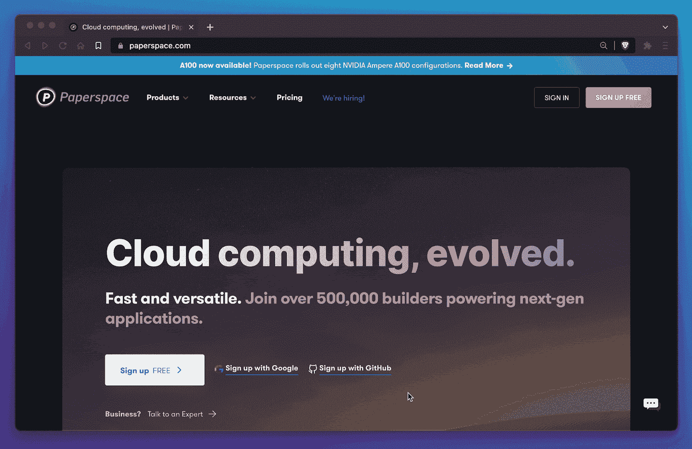
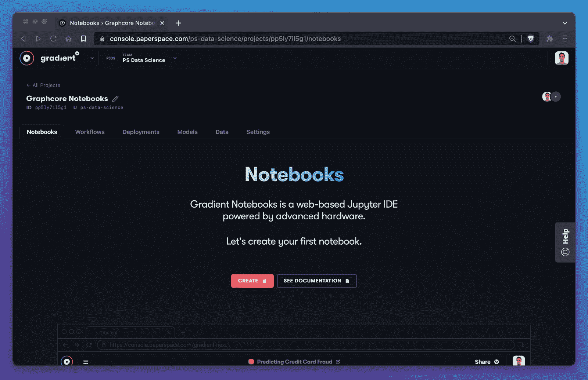
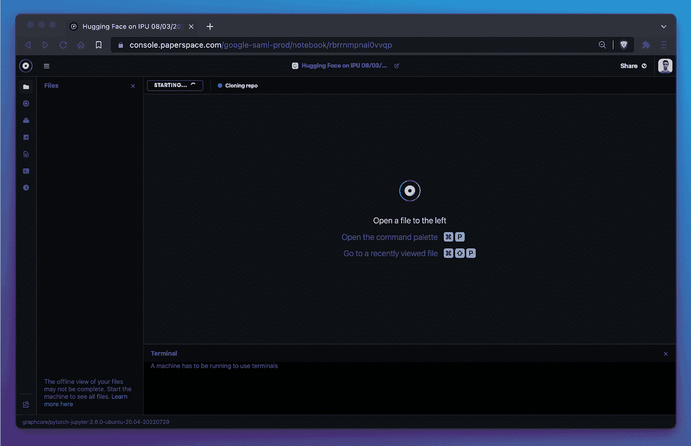
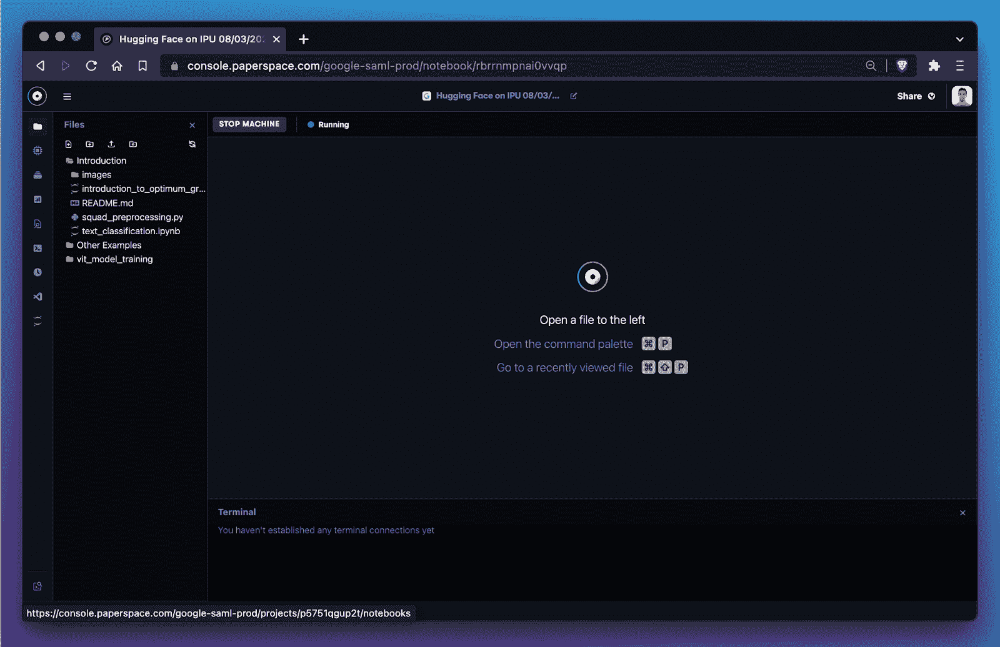
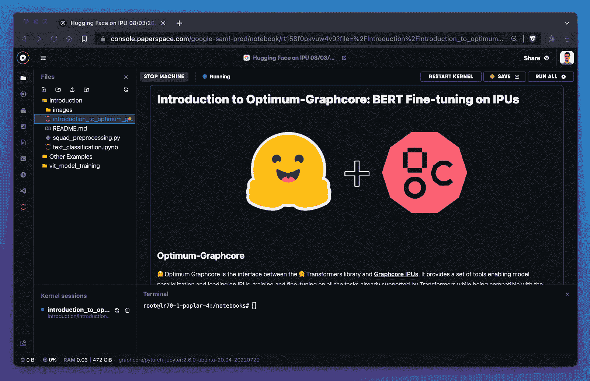
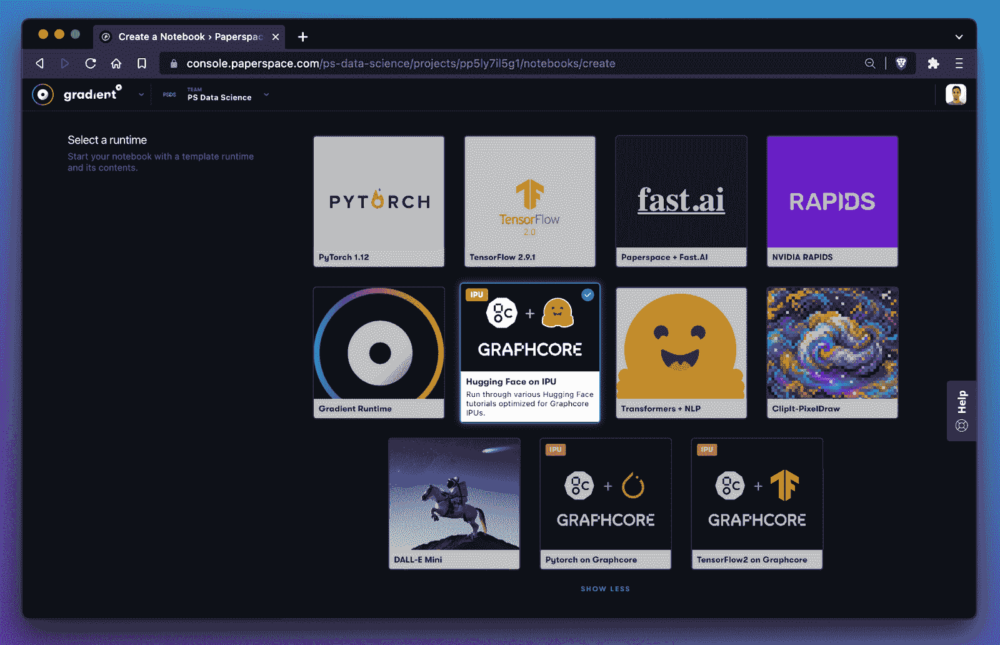

# 在 Paperspace 上启动和运行 Graphcore IPUs

> 原文：<https://blog.paperspace.com/graphcore-ipu-jupyter-tutorial/>

Graphcore 为机器学习和人工智能开发硬件加速器。与 Paperspace 的全新集成使得在数据科学笔记本环境中旋转 IPU 变得前所未有的简单。

# 入门指南

第一步是前往 Paperspace 并登录控制台。如果你还没有注册 Paperspace，它是免费的，大约需要 60 秒。

从控制台，我们将前往梯度和创建一个新的项目。

接下来，我们将使用预先配置的 Graphcore 运行时之一创建一个新的笔记本。这些运行时会自动将一些启动文件下载到您的笔记本中。它们还指定了 Graphcore IPU 机器类型和预先配置的容器，该容器已经包含了在 IPU 上运行工作负载所需的所有依赖项。

在我们启动笔记本电脑后，大约需要一分钟来克隆回购和配置机器。

机器现在正在运行！

让我们开始运行一些代码吧！

太棒了。我们现在在 Paperspace 上运行一个 Graphcore IPU。

如果我们想查看更多的入门项目，Paperspace 提供了三种不同的入门运行时，包括 HuggingFace、PyTorch 和 TensorFlow。

有关 Paperspace 上可用的特定 Graphcore IPUs 的更多信息，请务必[阅读文档](https://docs.paperspace.com/gradient/machines/)！