# 卷积神经网络中的滤波器

> 原文：<https://blog.paperspace.com/filters-in-convolutional-neural-networks/>

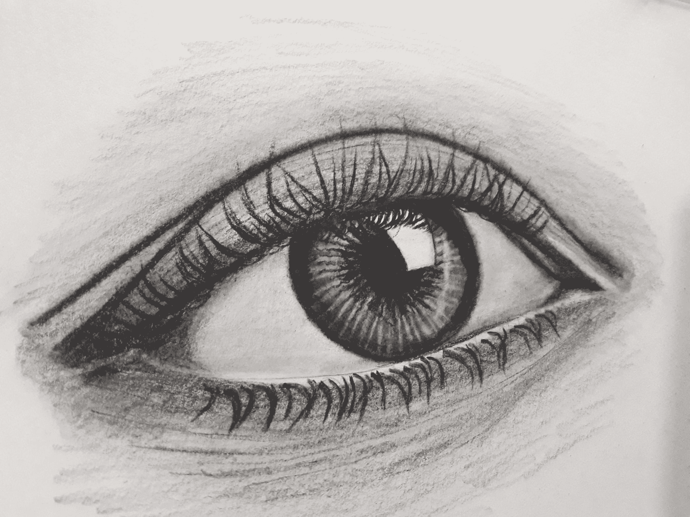

Photo by [DHANYA A V](https://unsplash.com/@dhanya21?utm_source=ghost&utm_medium=referral&utm_campaign=api-credit) / [Unsplash](https://unsplash.com/?utm_source=ghost&utm_medium=referral&utm_campaign=api-credit)

在多层感知器(MLP)中，可学习参数是映射到特征向量的网络权重。然而，在卷积神经网络的上下文中，可学习的参数被称为滤波器，滤波器是通常大小为正方形的二维矩阵/阵列。

在我的[上一篇文章](https://blog.paperspace.com/padding-in-convolutional-neural-networks/)中，我们通过一个叫做卷积的过程，对这些滤镜如何用于图像发展了一点我们的直觉。在本文中，我们将探讨当图像通过卷积神经网络(CNN)的各层时，这些滤波器实际上会对图像做什么。

### 神经网络和特征提取

神经网络的基本能力是它们从数据中提取特征的能力，以便然后使用它们来实现某个目标，无论是分类、回归等。在 MLPs 中，这个过程很容易概念化，数据点通常是特定数据实例的属性，被映射到训练的权重，以便以某种形式将它们组合或转换成本质特征。另一方面，当涉及到细胞神经网络时，特征提取并不明确，因为它们不处理属性向量，而是处理属性(像素)的二维矩阵的图像。

此外，说到图像，什么能代表一个特征呢？例如，当谈到房屋的表格数据集时，包含卧室数量或客厅大小等属性的列被称为特定房屋实例的特征。那么，一张尺寸为(640，480)像素的猫的增强清晰度(480p)图像呢？该图像有 640 列和 480 行，总共 307，200 个属性(像素)，在这种情况下什么代表特征？

### 边缘图像

构成图像的许多细节实际上包含在图像的边缘或轮廓中。这也是我们在漫画速写中很容易区分物体的原因之一。事实上，有大量研究表明，边缘感知是人类大脑在处理来自眼睛的视觉线索时首先利用的技术之一([威利安·麦克尔哈加，2018](https://www.sciencedirect.com/science/article/pii/S0042698918302050) )。边缘感知不仅仅局限于人类的视觉，一些研究认为这也是为什么鸟类如此擅长以如此高的速度在飞行途中躲避障碍，以及以极高的精确度降落在如此远的小目标上的原因之一([帕萨·巴加瓦图拉*等人*，2009](https://journals.plos.org/plosone/article?id=10.1371/journal.pone.0007301) )。


The only information we have are edges and we all know what this is.

### CNN 和人类视觉

有很多关于神经网络如何模仿人脑的讨论。一种对此给予一定信任的情况是，正如人脑通过感知边缘开始处理来自眼睛的视觉线索一样，卷积神经网络也开始通过检测边缘从图像中提取特征，事实上可以说边缘代表图像特征。它用于这个目的的工具是它的可学习参数，它的过滤器。

这正是卷积神经网络中滤波器的具体用途，它们有助于从图像中提取特征。虽然 CNN 的前几层由边缘检测过滤器(低级特征提取)组成，但更深的层通常学会聚焦于图像中的特定形状和对象。为了这篇文章的目的，我将集中在边缘检测的前几层，因为这是一个非常有趣的过程，过滤器很容易理解。

### 过滤掉边缘

卷积神经网络的酷之处在于，它们可以根据特定数据集中像素的概率分布和网络的特定目标来学习定制的边缘检测过滤器。尽管如此，仍有一些经典的手动制定的边缘检测滤波器可用于开发边缘检测在计算机视觉环境中看起来像什么的直觉。它们是 Prewitt、Sobel、Laplacian、Robinson 罗盘和克里施罗盘滤波器。

为了真正检查这些过滤器做什么，让我们做一些繁重的工作，使用下面给出的手动编写的卷积函数将它们应用于图像。

```py
import numpy as np
import torch
import torch.nn.functional as F
import cv2
from tqdm import tqdm
import matplotlib.pyplot as plt

def convolve(image_filepath, filter, title=''):
    """
    This function performs convolution and
    returns both the original and convolved
    images.
		"""

    #  reading image in grayscale format
    image = cv2.imread(image_filepath, cv2.IMREAD_GRAYSCALE)

    #  defining filter size
    filter_size = filter.shape[0]

    #  creating an array to store convolutions (x-m+1, y-n+1)
    convolved = np.zeros(((image.shape[0] - filter_size) + 1, 
                      (image.shape[1] - filter_size) + 1))

    #  performing convolution
    for i in tqdm(range(image.shape[0])):
      for j in range(image.shape[1]):
        try:
          convolved[i,j] = (image[i:(i+filter_size),
                                  j:(j+filter_size)] * filter).sum()
        except Exception:
          pass

    #  converting to tensor
    convolved = torch.tensor(convolved)
    #  applying relu activation
    convolved = F.relu(convolved)

    #  producing plots
    figure, axes = plt.subplots(1,2, dpi=120)
    plt.suptitle(title)
    axes[0].imshow(image, cmap='gray')
    axes[0].axis('off')
    axes[0].set_title('original')
    axes[1].imshow(convolved, cmap='gray')
    axes[1].axis('off')
    axes[1].set_title('convolved')
    pass
```

Convolution function.

该函数复制了卷积过程，并增加了一个 ReLU 激活步骤，这在典型的 convnet 中是意料之中的。利用这个功能，我们将使用上面列出的过滤器来检测下图中的边缘。

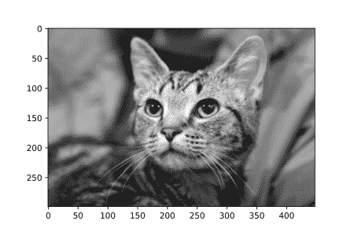

Specimen

您可以通过点击下面的链接在渐变笔记本中免费运行此代码！

#### Prewitt 过滤器

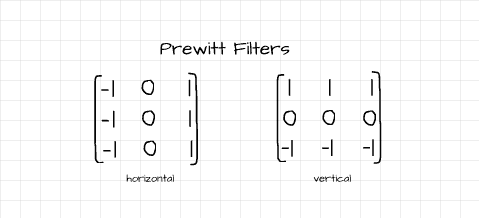

The vertical and horizontal Prewitt filters.

Prewitt 算子由两个滤波器组成，有助于检测垂直和水平边缘。水平(x 方向)滤镜有助于检测图像中垂直穿过水平轴的边缘，垂直(y 方向)滤镜则相反。

```py
# utilizing the horizontal filter
convolve('image.jpg', horizontal)
```

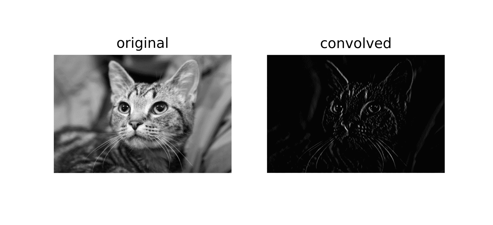

```py
# utilizing the vertical filter
convolve('image.jpg', vertical)
```

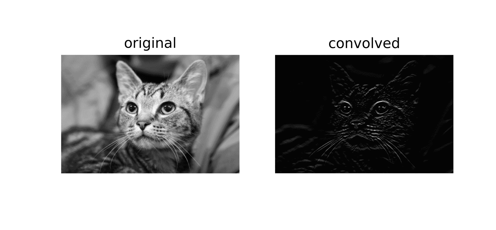

#### 索贝尔过滤器

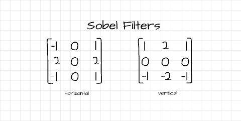

The vertical and horizontal Sobel filters

就像 Prewitt 算子一样，Sobel 算子也由垂直和水平边缘检测滤波器组成。检测到的边缘非常类似于使用 Prewitt 滤波器获得的结果，但是具有更高的边缘像素强度的区别。换句话说，与 Prewitt 滤波器相比，使用 Sobel 滤波器检测的边缘更清晰。

```py
# utilizing the horizontal filter
convolve('image.jpg', horizontal)
```

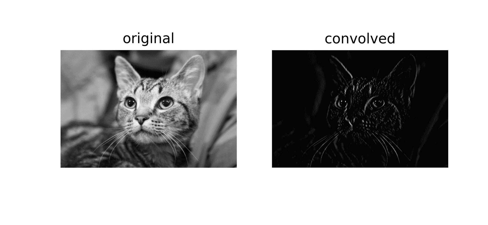

```py
# utilizing the vertical filter
convolve('image.jpg', vertical)
```

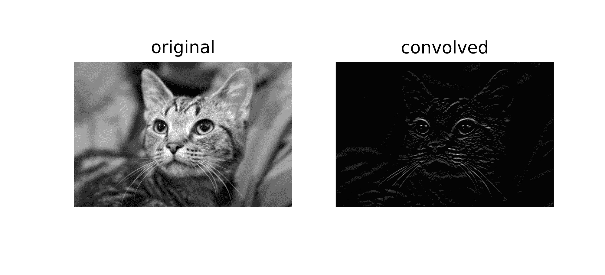

#### 拉普拉斯滤波器

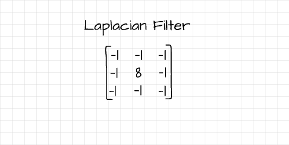

The Laplacian filter

与 Prewitt 和 Sobel 滤波器不同，拉普拉斯滤波器是检测不同方向的边缘的单个滤波器。从数学的角度来看，它计算像素值的二阶导数，而 Prewitt 和 Sobel 滤波器计算一阶导数。

```py
# utilizing the filter
convolve('image.jpg', filter)
```


#### 罗宾逊指南针面具

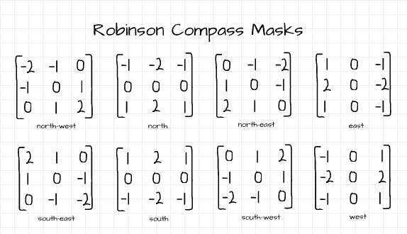

All 8 Robinson Compass masks

Robinson 罗盘蒙版是边缘检测过滤器，由 8 个不同的过滤器组成，分别代表 8 个地理罗盘方向，如上图所示。这些过滤器有助于检测罗盘方向上的边缘。为简洁起见，仅使用两个过滤器进行说明。

```py
# utilizing the north_west filter
convolve('image.jpg', north_west)
```

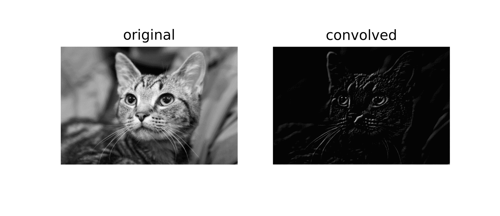

```py
# utilizing the north_east filter
convolve('image.jpg', north_east)
```

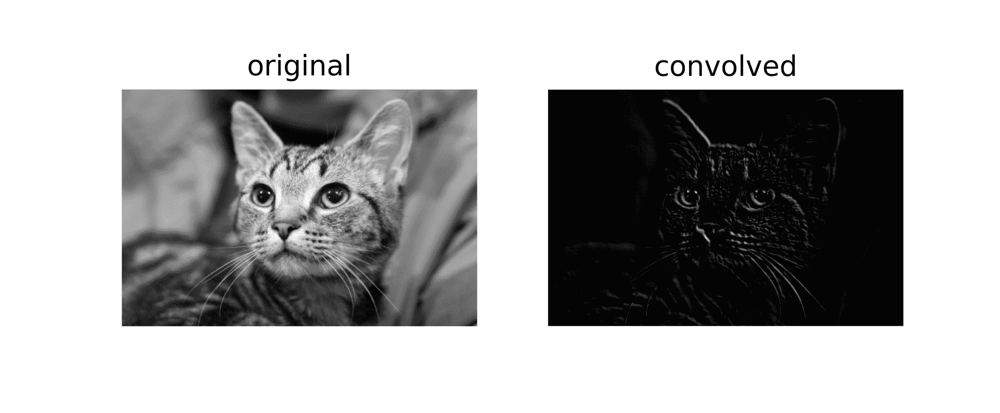

#### 克里施指南针面具

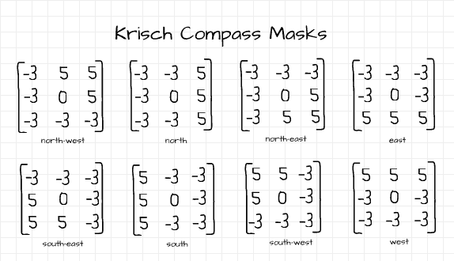

All 8 Krisch Compass masks

与 Robinson 罗盘遮罩类似，克里施罗盘遮罩也由 8 个过滤器组成，帮助检测地理罗盘方向上的边缘。下面使用了两个过滤器。

```py
# utilizing the south_west filter
convolve('image.jpg', south_west)
```

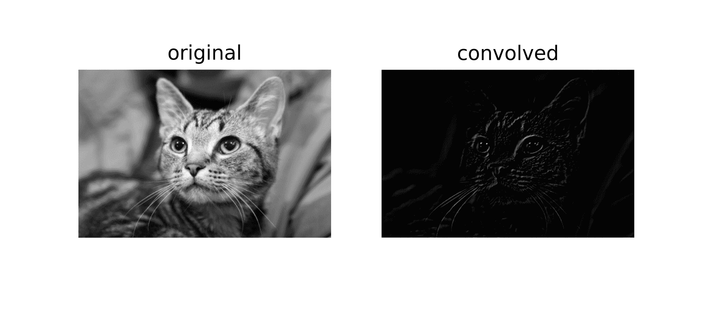

```py
# utilizing the south_east filter
convolve('image.jpg', south_east)
```

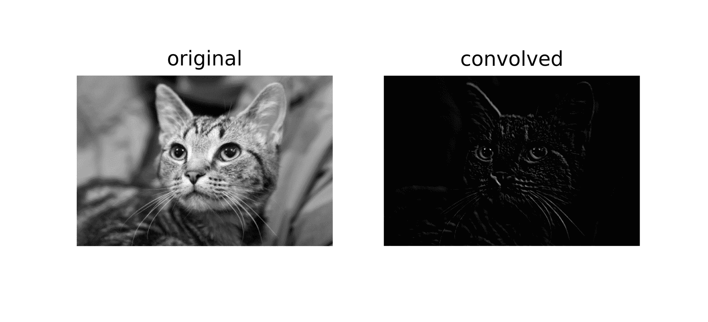

### 过滤器符号

上面有一个非常重要的陈述，你很可能忽略了，

> 水平(x 方向)滤镜有助于检测图像中垂直穿过水平轴的边缘，垂直(y 方向)滤镜则相反。

这种说法可能看起来有点混乱，但我将在这一部分进一步分解它。考虑下面的图像，右边的数字是人眼看到的，而左边的数字是计算机感知的。如图所示，白线在黑色“画布”上勾勒出一条清晰的垂直边缘，对于人眼而言，这是显而易见的，因为该线与其周围环境之间的对比度*(在同一叶片中，计算机需要能够感知像素级对比度的变化，这也是边缘检测所必需的)。*

然而，为了实际碰到这个边缘，需要从左向右(水平地)移动手指，反之亦然。这同样适用于边缘检测过滤器，要检测垂直边缘，您需要利用水平过滤器。

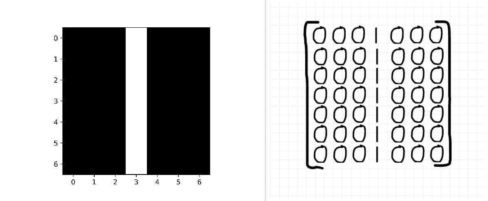

What you see VS What a computer 'sees'

让我们尝试使用水平和垂直 Prewitt 滤波器来检测图像中的边缘，边缘检测过程背后的数学原理如下图所示。卷积过程背后的数学很容易理解；

1.  将过滤器放在左上角。
2.  执行逐元素乘法。
3.  计算累计和。
4.  将获得的和作为空数组中的相应像素返回。
5.  将过滤器向右移动一个像素，并重复步骤 1 - 4，同时继续向右填充空数组中的第一行。
6.  当过滤器超出界限时停止。
7.  将过滤器向下移动一个像素到第二行。
8.  重复步骤 1 - 6，填充空数组中的第二行。
9.  对所有行执行相同的操作，直到过滤器超出垂直轴的界限(dim 1)。

激活是使用 ReLU 函数完成的，该函数简单地将任何负像素转换为 0。在卷积和激活之后，水平滤波器突出显示垂直边缘，而垂直滤波器返回涂黑的图像(全零像素)，这意味着它没有检测到边缘。

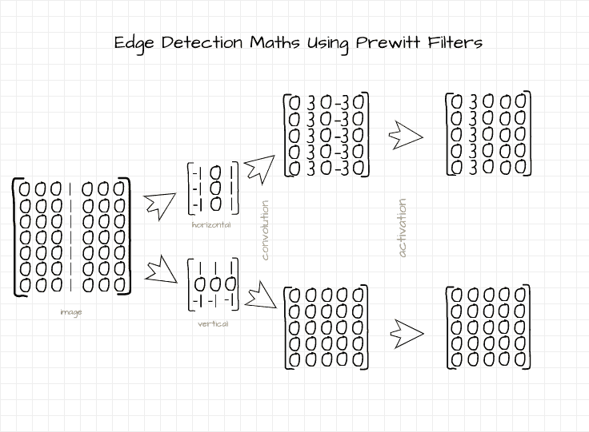

Edge detection math

检测到的边缘如下图所示。按照相同的逻辑，如果线是水平的，表示水平边缘，则垂直过滤器将突出显示水平边缘，而水平过滤器返回涂黑的图像。

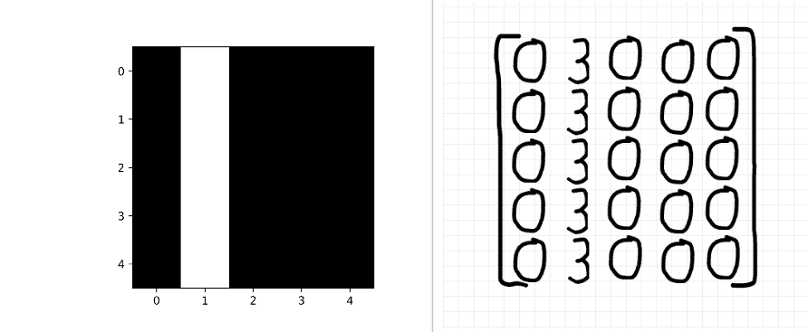

Edge detected by the horizontal filter

### 使用卷积函数

对于那些想在不同的图像上使用上述卷积函数，或者想测试不同的滤波器来进行边缘检测或其他图像处理任务的人来说，这一节是如何做的快速指南。

该函数采用 3 个参数，即“图像文件路径”、“过滤器”和“标题”。

#### '图像文件路径'

这是指所需映像在本地驱动器或云上的位置。如果您的图像在当前工作目录中，您需要做的就是输入图像名称及其文件扩展名。如果没有，您将需要提供一个绝对路径，格式为“C:/Users/Username/Downloads/image _ name . jpg”(因为我们使用的是 Python，所以这里是正斜杠)。

#### 过滤器

事实上，这是您希望在卷积过程中使用的过滤器。使用 NumPy 很容易制作过滤器，如下所示。接下来您需要做的就是在函数中提供过滤器对象。

```py
#  creating a Prewitt horizontal filter
prewitt_x = np.array(([-1, 0, 1],
                      [-1, 0, 1],
                      [-1, 0, 1]))

#  creating a laplacian filter
laplacian = np.array(([-1, -1, -1],
                      [-1, 8, -1],
                      [-1, -1, -1]))
```

#### 标题

这将是使用该函数时提供的图像可视化的标题。默认情况下，它是一个空字符串，但是您可以根据需要随意提供一个合适的标题。

### 结束语

卷积神经网络的特殊之处在于它们能够从图像像素等数据的二维表示中提取特征。使用包含在称为过滤器的神经网络中的工具将特征提取为边缘。

在本文中，我们使用一些预定义的过滤器，从计算机视觉的角度研究了边缘检测/特征提取是什么样子的。然而，值得注意的是，CNN 将不会使用这些预定义的滤波器来进行边缘检测，而是学习最佳滤波器来检测边缘并提取感兴趣的数据集中的特征。