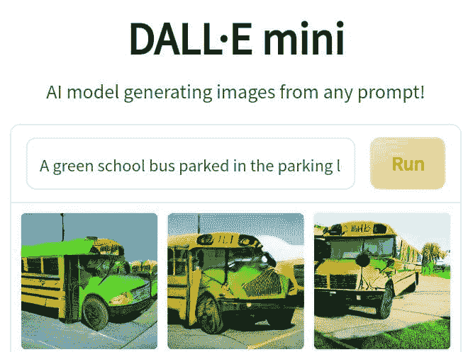
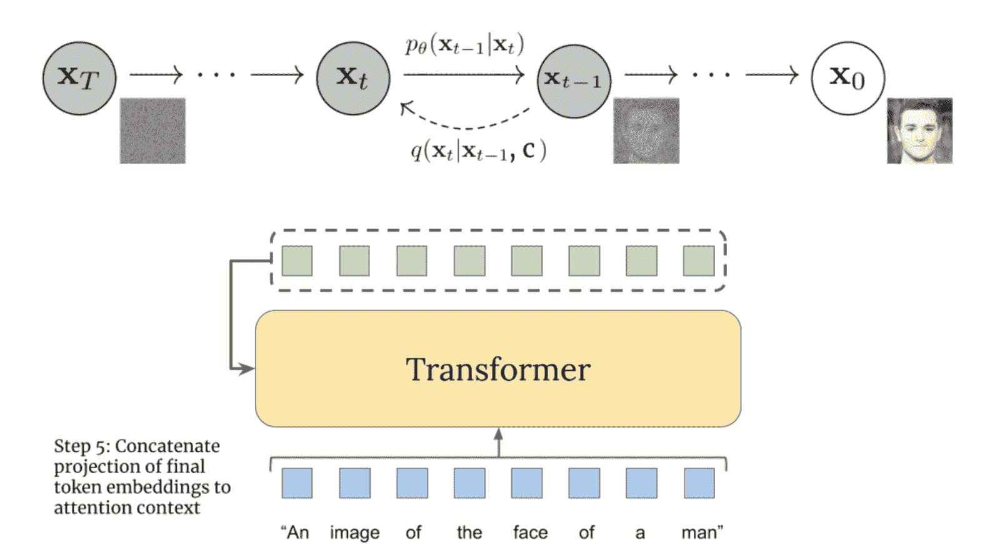

# DALL-E:人工智能程序内部，从文本描述中创建图像

> 原文：<https://blog.paperspace.com/dall-e-image-generator/>

萨瓦尔多·达利。超现实主义的古怪大师。被一些人描述为一个淘气的挑衅者。许多人认为他是一个傲慢的破坏者。一些人认为他疯了。尽管如此，每个人都认为他拥有不可否认的技术精湛。简而言之，没有几个人能像达利那样给生活带来想象。作为一名有创造力的艺术家，达利鼓舞人心。

西班牙抢劫犯罪剧 La casa de papel 的创作者和 Elon Musk 支持的人工智能研究实验室 OpenAI 的更多科学创作者对此进行了暗示。虽然来自两个相距甚远的领域，但两组创作者都从达利那里获得了灵感。受欢迎的网飞秀中受达利启发的面具暗指达利的张扬个性，而 OpenAI 的人工智能产品 DALL-E 则提到了他作品中的“*给生活带来想象”*行为。

当 DALL-E 在 2021 年 1 月首次发射时，OpenAI [将](https://openai.com/blog/dall-e/) 报告为*一个 GPT 3 的 120 亿参数版本，训练它使用文本-图像对的数据集从文本描述中生成图像。在那个时候，关于它的名字 DALL-E 的起源的问题并不少见。然而，在体验了该系统的强大功能后，人们一致认为该应用程序将萨瓦尔多·达利的奇妙疯狂与 Pixar 同名电影中憨态可掬的迪士尼机器人 WALL-E 的轻松生活属性结合在一起。因此，它不仅是名副其实的 DALL-E，而且它正在做一些令人难以置信的不同。*

## DALL-E 是什么？

当时(直到今天)大多数人工智能产品都试图将一种感觉转化为另一种感觉。他们的工作通常围绕视觉的可信度(即图像分析、笔迹识别等)。)、语言(即翻译、内容版主等。)、语音(即说话人验证、文本到语音的转录、实时翻译等。)，知识和搜索。例如，Meta(当时是脸书)的 [wav2letter++](https://research.facebook.com/downloads/wav2letter/) 和 Mozilla 的 [DeepSpeech](https://github.com/mozilla/DeepSpeech) 将语音转换为文本——利用两种感官工作。但后来，DALL-E 出现了，它能够连接到想象的感觉，并像其他产品一样重新创造它。与谷歌搜索不同，DALL-E 不检索已经存在的图像。

最简单的说，DALL-E 由两部分组成——一个自动编码器和一个变压器。前者学习在压缩的潜在空间中准确地表现图像，而后者学习语言和这种离散的图像表现之间存在的相关性。在我看来，transformer 是 DALL-E 的核心，因为它允许模型生成与给定文本提示相匹配的新图像。此外，它还负责如何将语言和图像结合在一起，因此当模型被提示生成如下所示的*“一辆停在停车场的绿色校车”*的图像时，它能够吐出一些校车的创意设计，这些设计可能以前只存在于我们的想象中，特别是因为几乎所有的校车都是黄色的。



2022 年 4 月，OpenAI 公布了 DALL-E 2。该公司[称](https://openai.com/dall-e-2/)能够以四倍于前一版本的分辨率生成更加真实和准确的图像，从而证明了许多人所描述的令人惊叹的图像视觉质量。令人印象深刻的是，该系统的智能更加惊人。尽管 OpenAI 并没有向所有人开放 DALL-E 2，但一个独立的开源开发者社区已经在他们可以访问的其他预训练模型的基础上构建了一些文本到图像的生成器。

其中一个发电机是 DALL-E Mini。它最近在[拥抱脸](https://huggingface.co/)上推出，并在互联网上掀起了风暴。该软件的名字和许多代码都来自 DALL-E 2。我用它工作，这里是我能注意到的关于这个系统的一些要点。该系统不仅能够以非凡的保真度和适应性将多种多样的艺术风格应用于特定的主题，更重要的是，它能够捕捉他们的精神/情绪。这意味着用该系统生成的卡通图像是轻松的，自然主义将是日常场景提示的主题，印象派绘画通常会表现得平静，同时给人以强烈的感觉，当然，该系统创建的黑色照片会微妙地令人不安。此外，生成的许多图像显示了 DALL-E 2 创造惊人的超现实主义图像的非凡能力。

如果在这一点上，你发现自己在思考 DALL-E 2 算法的工作原理，我认为这是公平的。在接下来的段落中，我将像向我在技术生态系统(而不是机器学习)工作的表弟解释算法一样解释算法，然后，我将如何向我非常熟悉机器学习的哥哥解释。

### 向我表哥解释

作为一点背景，需要注意的是，2015 年开发了自动图像字幕。那时，机器学习模型已经可以标记图像中的对象，但现在他们学会了将这些标签放入自然语言描述中。这一发展不仅使人们知道图像到文本的转换是可能的，而且也意味着翻转场景即文本到图像的转换是可能的。

现在，对于一个能够响应如此多不同提示的图像生成器来说，它需要一个大规模和多样化的训练数据集。理想情况下，数以百万计的图片和文字描述是从互联网上搜集来的。这些文字说明来自于网站所有者为了方便访问和搜索引擎而上传的图片文本。这就是工程师如何获得这些庞大的数据集。但是，模型实际上对数据集做了什么呢？你可能会认为，当我们给它一个文本提示，如“*黄桌上的绿球”*，它会搜索训练数据以找到相关的图像，然后复制其中的一些像素。然而，这种假设是错误的！因为新生成的图像不是来自训练数据，所以不会发生这种情况。相反，它来自深度学习模型的已学*【潜在空间】*。

当输入一个提示时，深度学习算法最初会检查所有的训练数据，找到有助于提高其任务性能的变量，在这个过程中，它会建立一个远不止三维的数学空间。这些轴代表了人类甚至无法识别或命名的变量。每个轴都有有意义的集群。例如，我们可以有一个轴来捕捉香蕉的本质，另一个轴代表 20 世纪 60 年代照片的纹理和颜色。创建了这些轴之后，文本就被传送到数学空间中的相应点。最后，数学空间中的点被转换成实际图像。这涉及到一个叫做扩散的生成过程。它从噪音开始，然后经过一系列迭代，将像素排列成对人类有意义的成分。

### 向我的哥哥解释

在生产层面，DALL-E 2 只是将文本作为输入，将图像作为输出。然而，这并不是一蹴而就的。这一过程的大致图示如下。


A high-level overview of CLIP. Above the dotted line, the CLIP training process is seen. Below the dotted line, the text-to-image generation process is shown: a CLIP text embedding is first fed to an autoregressive or diffusion prior to produce an image embedding, and then this embedding is used to condition a diffusion decoder which produces a final image. Note that the CLIP model is frozen during training of the prior and decoder - [[Source]](https://cdn.openai.com/papers/dall-e-2.pdf)

图片说明-> { *通过剪辑文字嵌入}*->->-*{通过剪辑图片嵌入}* - >解码器- >图片

从上图中可以看出，要理解 DALL-E 2 的体系结构，首先需要理解 CLIP——DALL-E2 的一个重要组成部分。对比语言图像预训练的缩写，它是一个神经网络，充当文本和图像之间的链接。同样由 OpenAI 开发的 CLIP 做的与 DALL-E 2 相反——它返回给定图像的最佳字幕。这是一个对比模型，意味着它将图像与其对应的标题进行匹配，而不是对它们进行分类。为了在 DALL-E 2 中做到这一点，它训练了两个编码器——一个将图像训练成图像嵌入，另一个将文本或字幕转换成文本嵌入。这意味着它能够创建一个表示图像和语言特征的向量空间。这个共享的向量空间构成了 DALL-E 模型的架构基础，它提供了一种图像-文本字典，可以在两者之间进行转换。



The diffusion process - [[Source]](https://www.assemblyai.com/blog/how-dall-e-2-actually-works/)

此外，前面解释中提到的扩散模型是一种生成模型，其工作原理是*通过高斯噪声的迭代添加来破坏*训练数据，然后*通过反转该过程来学习恢复*数据。

给我表弟的提示:这个过程类似于拥有一个排列好的魔方，一边在脑海中记下每一步棋，一边摸索，然后做完全相反的事情，直到从摸索的魔方中获得一个排列好的魔方。

## 演示-从-到

2021 年 3 月， [OpenAI](https://openai.com/) 在 DALL E public 制作了用于离散变分自动编码器(dVAE)的 [PyTorch 包](https://github.com/openai/DALL-E)。离散 VAE (dVAE)是 VQ-VAE(矢量量化变分自动编码器)的变体，是 DALL-E 用来学习离散图像表示的自动编码器技术。安装了[所需的库](https://github.com/openai/DALL-E/blob/master/requirements.txt)，获得了要处理的样本图像，预处理了样本图像，然后 PyTorch 包的应用程序代码如下所示。

```py
from dall_e import map_pixels, unmap_pixels, load_model
from IPython.display import display, display_markdown

import torch.nn.functional as F

z_logits = enc(x)
z = torch.argmax(z_logits, axis=1)
z = F.one_hot(z, num_classes=enc.vocab_size).permute(0, 3, 1, 2).float()

x_stats = dec(z).float()
x_rec = unmap_pixels(torch.sigmoid(x_stats[:, :3]))
x_rec = T.ToPILImage(mode='RGB')(x_rec[0])

display_markdown('Reconstructed image:')
display(x_rec) 
```

您可以在渐变笔记本中运行此代码，方法是单击下面的链接，然后打开 usage.ipynb 笔记本:

## 演示-自 E 2

最后，DALL-E 2 对之前的版本进行了改进，它能够编辑现有的图像。例如，我们可以*‘添加一个沙发’*关于一个空的客厅。DALL-E 2 发布后不久，OpenAI 首席执行官山姆·奥特曼在推特上写道*‘AGI 将变得狂野’*。在某些情况下，根据[维基百科](https://en.wikipedia.org/wiki/Artificial_general_intelligence)的说法，AGI(人工通用智能)意味着*智能代理理解或学习人类可以完成的任何智力任务的能力*。基本上，通用 AI。现在，首先，我想指出的是，在图像生成方面，DALL-E 2 无疑令人印象极其深刻。然而，尽管我同意/认为 AGI 的潜力可以被认为是“狂野的”，但我质疑 DALL-E 2 在解决常识推理、可靠性、理解力和其他真正通用的人工智能所需的素质等深层问题方面是否构成了进步。

> AGI 会很疯狂
> 
> — Sam Altman (@sama) [April 6, 2022](https://twitter.com/sama/status/1511735572880011272?ref_src=twsrc%5Etfw)