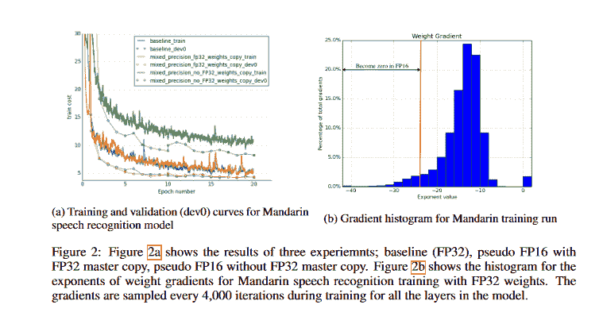
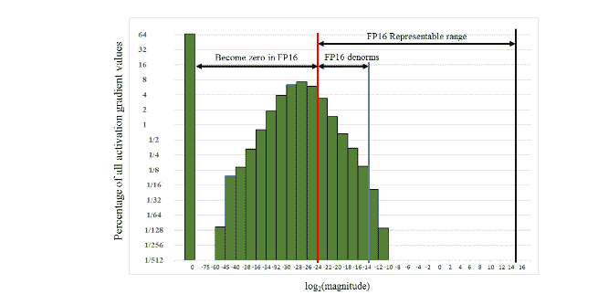
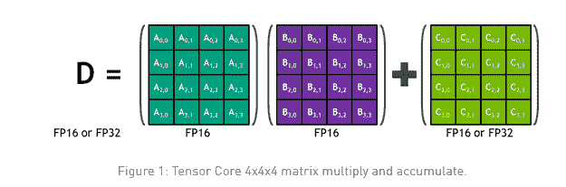
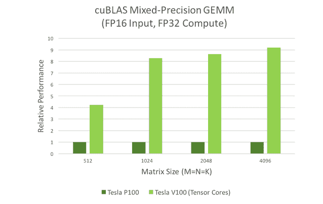
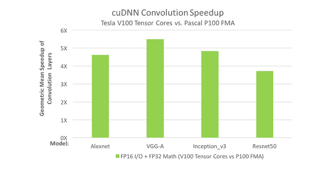
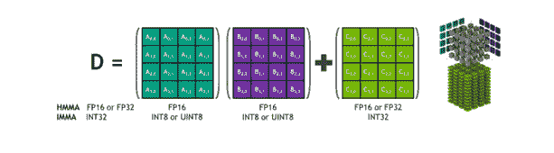

# 混合精确训练

> 原文：<https://blog.paperspace.com/mixed-precision-training-overview/>

### 介绍

使用多种数值精度组合的计算方法称为混合精度。混合精度训练指的是一种深度神经网络训练技术，它在可行时采用半精度，在不可行时采用完全精度。使用混合精度训练有两个阶段:

*   移植模型以在适当的地方使用 FP16 数据类型。
*   添加损耗缩放以保留小的梯度值。

这篇文章友好地概述了混合精度训练。

### 使用混合精确训练的一些好处

通过对算术密集型模型架构使用混合精度训练，可以将速度提高三倍。在内存受限的系统中采用半精度的好处也可能导致性能的提升。以低于 32 位浮点的精度训练深度神经网络有几个优点。

精度越低，训练更广泛的网络所需的内存就越少。结果，训练过程更有效，因为它占用更少的存储器带宽。最后，精度越低，数学运算的速度越快。

### 我们说的“精度更低”是什么意思？

32 位浮点(FP32)格式被称为单精度。当我们说“低精度”时，我们通常指的是 16 位浮点(FP16)格式。顾名思义，FP32 格式使用 32 位内存，而 FP16 格式使用 16 位内存。

因此，访问的字节数也减少了。另一方面，从 FP32 到 FP16 会降低精度，这在深度学习中处理微小的激活梯度值时至关重要。当梯度值太小而不能用 FP32 数字表示，但太大而不能用 FP16 数字表示时(在这种情况下，梯度值变为零)，FP16 训练精度会受到影响。

可以缩放渐变值，使它们落在 FP16 的可表示值范围内，从而减少出现的精度损失。

### FP32 砝码主副本:来自纸张的插图

> 在混合精度训练中，权重、激活和梯度存储为 FP16。为了匹配 FP32 网络的准确性，在优化步骤中，维护 FP32 主权重副本，并使用权重梯度进行更新。在每次迭代中，主权重的 FP16 副本用于向前和向后传递，将 FP32 训练所需的存储和带宽减半。

[研究人员使用了一个普通话语音模型](https://www.arxiv-vanity.com/papers/1710.03740/)，在 20 个时期的 800 小时语音数据的数据集上进行训练，以证明 FP32 主副本权重的必要性。

如下图所示，在 FP16 向前和向后传递后更新 FP32 主权重副本会导致与 FP32 训练结果匹配；但是，更新 FP16 权重会导致相对精度损失 80%。与单次精确训练相比，即使保留一份额外的重量副本也会增加 50%的重量记忆需求；对总内存消耗的影响要低得多。因为增加的批量大小和每层的激活被保存以在反向传播阶段重用，所以激活支配训练存储器的使用。

因为激活也是以半精度格式记录的，所以深度神经网络训练的总内存使用量大约减半。



### 使用缩放来防止精度损失

这篇论文强调了这样一个事实，即虽然梯度值往往以小幅度为主，但 FP16 指数偏差将归一化值指数的范围集中在[14，15]之间。通过从在多盒 SSD 检测器网络的 FP32 训练期间跨所有层收集的激活梯度值的直方图中取一个例子，我们可以观察到 FP16 可表示范围的大部分未被使用。

许多值低于最小可表示范围，变成了零。通过按比例放大梯度，有可能保留否则会丢失为零的值。放大梯度也将移动它们以占据更多的可表示范围。

当梯度没有被缩放时，这个网络会发散，但是将它们缩放 8 倍就足以达到与 FP32 训练相同的精确度。这表明，活化梯度值低于 2^-27 的数量级与该模型的训练无关，但在[2^-27，2^-24]范围内的值是必须保留的。



Histogram of activation gradient values during Multibox SSD network training 

一个太小而不能用 FP16 表示的数(因此用零表示会有问题)可以通过一个允许用 FP16 表示的因子进行缩放来检索。激活梯度是深度学习应用中感兴趣的小值。缩放通常发生在正向传播和反向传播的步骤之间。

如果反向传播输入被某个因子缩放，那么所有随后的激活梯度也将被该因子缩放；因此，反向传播技术的其余部分不需要缩放。为了更新权重，当反向传播完成时，可以向优化器提供未缩放的梯度。一般来说，方法如下:

*   执行正向传播
*   将输出放大 X 倍
*   反向传播技术应用
*   按 1/X 的比例缩小权重梯度
*   优化器更新权重

### 选择比例因子

损耗比例因子可以从各种选项中选择，恒定比例是最简单的选项。

从 8 到 32K，他们训练了广泛的网络(许多网络不需要缩放因子)。可以通过实验选择比例因子，或者，如果梯度统计数据可用，可以通过选择其乘积的最大绝对梯度值小于 65，504 的因子来直接确定恒定比例因子。

只要不通过反向传播产生溢出，选择一个显著的比例因子没有负面影响。**溢出将导致权重梯度中的无穷大和 NaNs，这将在更新**后永久破坏权重。应当注意，检查计算的重量梯度是发现溢出的有效方法。

动态选择损耗比例因子更可靠。有必要从一个重要的比例因子开始，并在每次训练迭代完成后重新评估它。如果在 N 次迭代后没有发生溢出，可以增加比例因子。如果有溢出，应该跳过权重更新。动态损失比例方法导致以下高级培训程序:

1.  在 FP32 中保留一份重量副本作为主副本。
2.  将 S 设置为一个相当大的值。
3.  对于每次迭代:

a.制作重量的 FP16 副本。

b.正向传播(FP16 权重和激活)。

c.将所得损耗乘以比例因子 s。

d.执行反向传播(FP16 权重、激活及其梯度)。

e.如果重量梯度中存在 Inf 或 NaN:

一、减少 s。

二。继续下一次迭代，不更新权重。

f.用 1/S 执行权重梯度乘法。

g.完成权重更新(包括渐变裁剪等。).

h.如果在最后 N 次迭代中没有出现 Inf 或 NaN，则应该增加 s。

### 张量核是如何工作的

张量核于 2017 年底在 Volta 架构中推出，在上一代图灵架构中得到改进，并在 Ampere 架构中得到进一步完善。在 [Paperspace GPU 云比较](https://www.paperspace.com/gpu-cloud-comparison)上查看安培、伏特和图灵 GPU 性能值的相互比较。

因为张量核可能优于标准 GPU 核，所以张量核是一个理想的特性。Nvidia Volta GPUs Tesla V100、Quadro V100 和 Titan V 拥有 640 个张量内核，最高可提供混合 FP16-FP32 精度的 TFLOPS。
传统的 CUDA 内核共有 5120 个 GPU，在 FP32 精度下可提供高达 15 TFLOPS 的性能，在 FP64 精度下可提供大约 7 TFLOPS 的性能。事实上，张量核的速度使得研究可能受益于这项新技术的新应用成为可能。

也就是说，利用张量核并不是没有限制和潜在的陷阱。第一个限制是张量核心编程实质上比典型的 GPU 编程更受限制。如果使用张量核，只能对 4×4 矩阵进行 MMA(矩阵-乘法-累加)运算(只需要一个 GPU 周期)，这是使用张量核时唯一可以完成的运算。


因此，创建可以受益于张量核加速的算法的唯一方法是将其重构为可以并行运行的多个 4×4×4 MMA 运算的集合。

数值精度是张量核的第二个限制。A×B+C 运算目前在 FP16 精度下完成，即使 D 矩阵存储在 FP32 中。这种混合运行方式可能会对某些应用程序产生不利影响。

然而，FP16 是运行张量核的绝佳场所，因为深度学习应用通常不会在 FP16 的训练和推理过程中遇到数值精度问题。



该操作可以是更广泛的 FP16 矩阵乘法操作的构建组件。假设大多数反向传播涉及矩阵乘法，张量核可以用于任何需要大量计算的网络层。

输入矩阵必须是 FP16 格式。如果你在基于张量核心的 GPU 上训练，而不是利用混合精度训练，你的 GPU 就没有得到最大的利用。你可以看看这篇[文章](https://blog.paperspace.com/understanding-tensor-cores/#how-do-tensor-cores-work)，它会给你一个张量核的概述，并帮助你理解它们是如何工作的。

### CUDA 库中的张量核心

CuBLAS 和 cuDNN 是两个利用张量核的 CUDA 库。为了加速 GEMM 计算，cuBLAS 使用张量核。由于 cuDNN，使用张量核可以更快地处理递归神经网络(rnn)和卷积。

> GEMM 是矩阵-矩阵乘法的术语。

这些模型广泛应用于信号处理、流体动力学和许多其他领域。这些应用需要不断提高处理速度，以跟上不断增长的数据量。通过查看下图中的混合精度 GEMM 性能图，我们可以很容易地看出这一点。



Performance comparison of matrix-matrix multiplication (GEMM)s on Tesla V100 (Volta) using Tensor Cores versus Tesla P100 (Pascal). Input matrices are half precision, computation is single precision.

随着人工智能研究人员不断拓展可能性的边界，神经网络每年都变得越来越复杂。目前最深的网络超过几十个卷积层。在前向和反向传播期间，需要卷积层来训练 dnn。下图描述了卷积性能图表，表明张量核可以满足高卷积速度的需求。



Convolution performance on Tesla V100 (Volta) using Tensor Cores against Tesla P100 (Pascal). The geometric means of run times of the convolution layers from each neural network are compared. The V100 and the P100 utilize FP16 input/output data and FP32 computation; the V100 employs Tensor Cores, while the P100 uses FP32 fused-multiply add (FMA). 

在这两个图表中，可以看出特斯拉 V100 的张量核优于特斯拉 P100。计算的方式因这些性能的提高而改变:可以探索交互式场景，并且由于这些性能的提高，可以更节省地使用服务器群。

### 张量核优化

混合精度训练的硬件加速由 NVIDIA Tensor Cores 提供。在使用张量核的 V100 GPU 上，float16 矩阵乘法性能可能比 float32 提高八倍。张量核可能需要修改模型代码以充分利用它们。Nvidia 的[文档](https://docs.nvidia.com/deeplearning/performance/mixed-precision-training/index.html#tensor-core-shape)提供了充分利用张量内核的三个步骤:

1.  满足张量核心形状约束
2.  增加算术强度
3.  减少非张量核心运算中的工作分数

这个优势列表以越来越复杂的方式呈现，初始阶段通常以最少的工作量提供最大的价值。

### 满足张量核心形状约束

张量核的输入受到其结构的形状限制。
要乘矩阵，请考虑以下规则:

*   FP16 输入的所有三个维度(M、N 和 K)必须是 8 的倍数。
*   对于 INT8 输入，所有三个维度必须是 16 的倍数(仅适用于图灵)。

谈到卷积过程:

*   FP16 输入的输入和输出通道必须是 8 的倍数。
*   INT8(仅限图灵)输入上的输入和输出通道必须是 16 的倍数。

[深度学习性能指南](https://docs.nvidia.com/deeplearning/performance/index.html)提供了对张量核心执行、这些约束源自何处以及它们如何在现实世界模型设计中具体化的深入研究。以下是 Nvidia 文档中关于混合精度训练的建议:

*   小批量应该是 8 的倍数。
*   线性层尺寸应选择 8 的倍数。
*   对卷积层通道数使用 8 的倍数。
*   填充词汇是 8 的倍数，用于涉及分类的挑战。
*   填充序列长度的倍数 8 以解决序列问题。

### 增加算术强度

> 算术强度衡量每个输入字节在内核中将执行多少计算工作。例如，V100 GPU 具有 125 TFLOPs 的数学吞吐量和 900 GB/s 的内存带宽。取两者之比，我们看到任何每输入字节少于~140 FLOPs 的内核都是内存受限的。张量核不能以全吞吐量运行，因为内存带宽将是限制因素。具有足够算术强度以允许全部张量核吞吐量的核是计算受限的。

在模型实现和模型架构中，运算强度可以增加。要增加模型实现中的算术强度:

*   在循环细胞中，连接权重和门激活
*   序列模型允许您随时连接激活

作为增加模型算术强度的一种方法:

*   密集的数学运算是优选的:众所周知，深度方向可分离卷积比普通卷积具有更低的算术强度
*   说到精度，尽可能选择最宽的图层

### 递减非张量核心功

张量核不会加速深度神经网络中的许多其他操作，理解它们对整体加速的影响至关重要。

考虑一个模型，其中一半的训练时间花在张量核加速运算上。如果张量核将这些运算的速度提高了 5 倍，那么总的加速是 1 美元。/ (0.5 + (0.5 / 5.))= 1.67x 美元

因为张量核操作在整个工作中所占的百分比越来越小，所以优化非张量核过程变得更加重要。定制 CUDA 实现和框架集成可以用来加速这些过程。编译器工具可以自动加速非张量核运算。

## 需要记住的要点

使用深度神经网络(DNNs)已经在各个领域取得了重大进展。随着 DNN 复杂度的提高，研究人员和用户需要越来越多的计算机资源来训练。在混合精度训练中使用较低精度的算法减少了所需的资源量，这具有以下优点:

*   **减少所需的内存量**:单精度(FP32)使用 32 位，而半精度(FP16)使用 16 位(FP16)。可以减少存储器需求，以便可以训练更广泛的模型或者可以训练更大的小批量。
*   **减少训练或推理的持续时间**:内存或算术带宽会影响执行时间。半精度通过将访问的字节数减半，减少了在内存有限的层上花费的时间。

[文档](https://developer.nvidia.com/blog/mixed-precision-training-deep-neural-networks/)强调了成功训练半精度 DNNs 的三种方法:

### 累加到 FP32

*   NVIDIA Volta GPU 架构中引入的张量核心指令乘以半精度矩阵，将结果聚合为单精度或半精度输出
*   为了获得有效的训练结果，积累成单精度是必不可少的。在写入内存之前，累加值被转换为半精度

### 损耗缩放

*   激活、激活梯度、权重和权重梯度是在训练 DNNs 时遇到的四种张量
*   激活、权重和权重梯度落在可以用半精度表示的幅度范围内。对于某些网络，小幅度激活梯度低于半精度范围
*   保证梯度落在可以由半精度表示的范围内的技术是将训练损失乘以比例因子
*   链式法则通过增加一次乘法运算来确保所有的梯度在没有额外成本的情况下被放大
*   丢失为零的梯度值可以通过丢失缩放来恢复。在权重更新之前，权重梯度必须按相同的因子 S 按比例缩小

> 缩小操作可以与权重更新本身融合，或者单独执行。

### FP32 重量的主副本

*   通过添加适当的权重梯度，网络权重随着 DNN 训练的每次迭代而更新
*   权重梯度幅度有时远小于相应的权重，特别是当乘以学习率时
*   如果加数中的一个在半精度表示中足够小以至于产生显著差异，则更新可能不会发生
*   对于以这种方式丢失更新的网络来说，维护和更新具有单精度的权重的主副本是一种简单的修复方法

> 在每次迭代中，制作主权重的半精度副本，并在前向和后向传播中使用，从而获得性能优势。

*   在权重更新期间计算的权重梯度被转换为单精度并用于更新主副本，并且该过程在接下来的迭代中重复。因此，我们只在必要时混合使用半精度和单精度存储

### 自动混合精度:TensorFlow 中的 NVIDIA 张量核心架构

NVIDIA 在 2019 年 GTC 上推出了自动混合精度(AMP)功能，该功能允许自动混合精度训练。使用自动混合精度可以提高性能，但这取决于模型的架构。在当前 TensorFlow 训练脚本中，设置一个环境变量或进行一些代码更改即可实现自动混合精度。

使用半精度浮点，混合精度训练速度更快，同时保持与使用相同超参数的单精度训练相同的精度水平..如下所示，NVIDIA Volta 和 Turing GPU 架构中引入的张量核可以在半精度下使用。



The FP16 and INT8 matrix computations are significantly sped up by tensor cores. 

尽管使用 vanilla TensorFlow 可以实现混合精度，但它需要开发人员对模型和优化器进行手动调整。与手动过程相比，使用 TensorFlow 的自动混合精度有两个优势。首先，减少了开发和维护工作量，因为网络模型代码不需要程序员修改。其次，AMP 确保了与所有 TensorFlow 模型定义和执行 API 的向前和向后兼容性。

NVIDIA NGC TensorFlow 19.03 容器(以及此后的每个版本)具有自动混合精度功能。要使用此功能，您只需设置一个环境变量:

```py
export TF_ENABLE_AUTO_MIXED_PRECISION=1
```

或者，可以在 TensorFlow 的 Python 脚本中指定环境变量:

```py
os.environ['TF_ENABLE_AUTO_MIXED_PRECISION']='1'
```

通过**启用** [**TensorFlow XLA 编译器**](https://www.tensorflow.org/xla) **并增加迷你批处理大小，有可能进一步加速。**

### 结论

在本文中，我们有:

*   仔细看看混合精度训练作为一种技术。
*   了解如何使用缩放来防止精度损失。
*   介绍什么是张量核:它们是什么，它们如何工作，如何优化它们。
*   了解如何在 TensorFlow 中为 NVIDIA 张量核心架构使用自动混合精度

### 参考

[https://developer . NVIDIA . com/blog/programming-tensor-cores-cuda-9/](https://developer.nvidia.com/blog/programming-tensor-cores-cuda-9/)[https://arxiv.org/abs/1903.03640](https://arxiv.org/abs/1903.03640)
[https://developer . NVIDIA . com/blog/mixed-precision-training-deep-neural-networks/](https://developer.nvidia.com/blog/mixed-precision-training-deep-neural-networks/)
[https://developer . NVIDIA . com/blog/NVIDIA-automatic-mixed-precision-tensor flow/](https://developer.nvidia.com/blog/nvidia-automatic-mixed-precision-tensorflow/)
[http://alexminnaar . com/2000](http://alexminnaar.com/2020/05/02/dl-gpu-perf-mixed-precision-training.html)[https://arxiv.org/pdf/1710.03740.pdf](https://arxiv.org/pdf/1710.03740.pdf)
[https://arxiv.org/pdf/1710.03740.pdf](https://arxiv.org/pdf/1710.03740.pdf)
T21【https://docs . NVIDIA . com/deep learning/performance/mixed-precision-training/index . html # tensor-core-shape