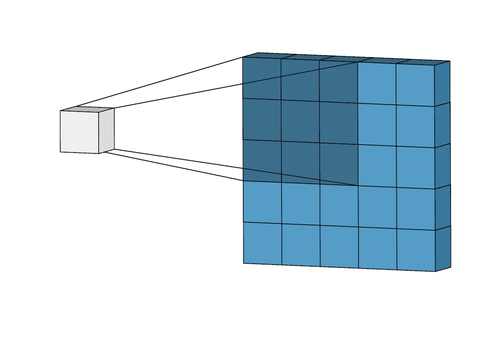
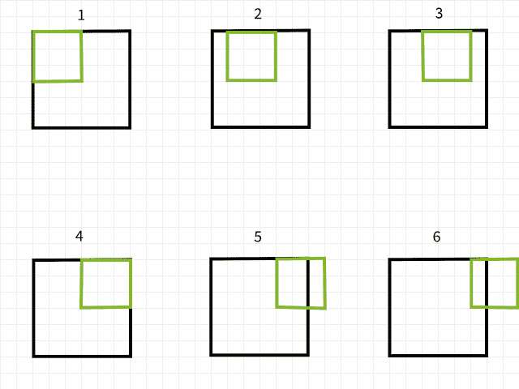
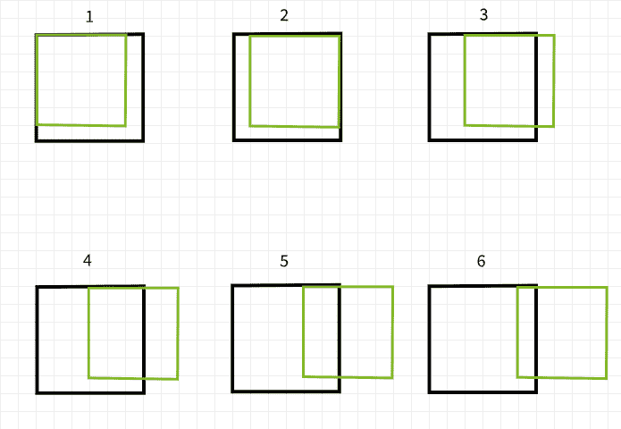
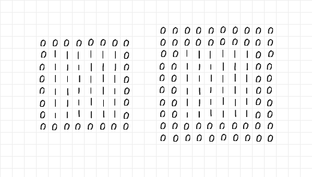
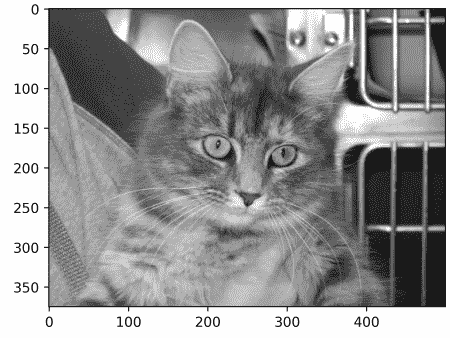
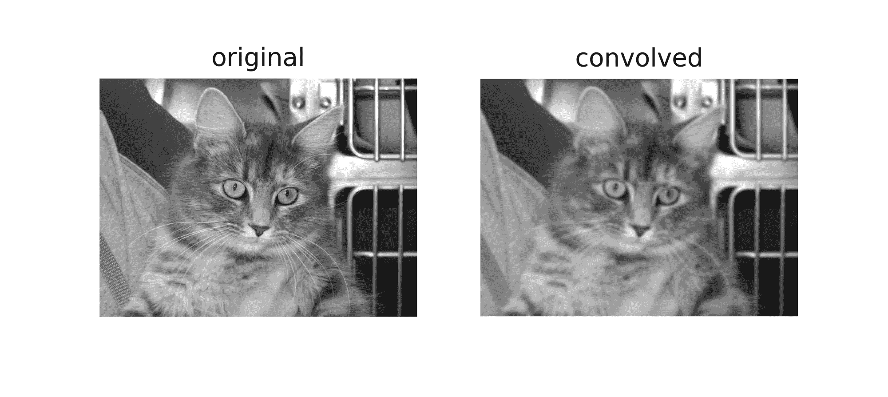
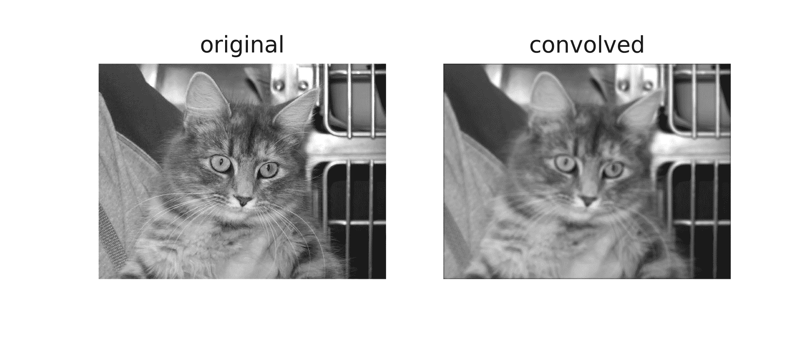
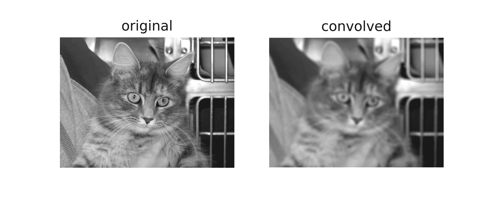
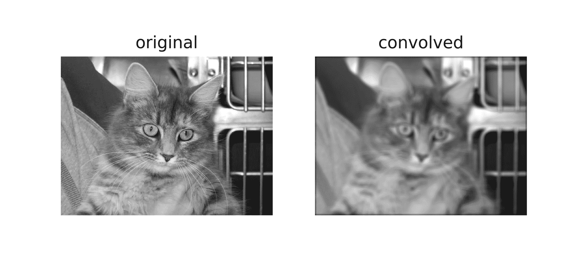

# 卷积神经网络中的填充

> 原文：<https://blog.paperspace.com/padding-in-convolutional-neural-networks/>

填充是卷积神经网络中的一个基本过程。虽然不是强制性的，但这是一个在许多 CNN 架构中经常使用的过程。在这篇文章中，我们将探讨为什么和如何做到这一点。

### 卷积的机制

图像处理/计算机视觉上下文中的卷积是一个过程，通过该过程，图像被滤波器“扫描”,以便以某种方式对其进行处理。让我们在细节上稍微技术性一点。

对计算机来说，图像只是一组数字类型(整数或浮点数)，这些数字类型被恰当地称为像素。事实上，1920 像素乘 1080 像素(1080p)的高清图像只是一个具有 1080 行和 1920 列的数字类型的表格/数组。另一方面，滤波器本质上是相同的，但通常尺寸较小，常见的(3，3)卷积滤波器是 3 行 3 列的阵列。

当对图像进行卷积时，对图像的连续片应用滤波器，其中在滤波器的元素和该片中的像素之间发生逐元素乘法，然后累积和作为其自己的新像素返回。例如，当使用(3，3)滤波器执行卷积时，9 个像素被聚集以产生单个像素。由于这种聚集过程，一些像素丢失了。

[](https://towardsdatascience.com/intuitively-understanding-convolutions-for-deep-learning-1f6f42faee1)

Filter scanning over an image to generate a new image via convolution.

### 丢失的像素

要理解像素丢失的原因，请记住，如果卷积滤波器在扫描图像时超出界限，则特定的卷积实例将被忽略。举例来说，考虑一个 6×6 像素的图像被一个 3×3 的滤波器卷积。如下图所示，前 4 个卷积落在图像内，为第一行生成 4 个像素，而第 5 个和第 6 个卷积落在边界外，因此被忽略。同样，如果滤波器向下移动 1 个像素，则对于第二行，同样的模式重复，同时损失 2 个像素。当该过程完成时，6×6 像素图像变成 4×4 像素图像，因为它在 dim 0 (x)中丢失了 2 列像素，在 dim 1 (y)中丢失了 2 行像素。



Convolution instances using a 3x3 filter.

同样，如果使用 5×5 滤波器，则在 dim 0 (x)和 dim 1 (y)中分别丢失 4 列和 4 行像素，从而产生 2×2 像素图像。



Convolution instances using a 5x5 filter.

不要相信我的话，试试下面的函数，看看是不是真的如此。随意调整论点。

```py
import numpy as np
import torch
import torch.nn.functional as F
import cv2
import torch.nn as nn
from tqdm import tqdm
import matplotlib.pyplot as plt

def check_convolution(filter=(3,3), image_size=(6,6)):
    """
    This function creates a pseudo image, performs
    convolution and returns the size of both the pseudo
    and convolved image
    """
    #  creating pseudo image
    original_image = torch.ones(image_size)
    #  adding channel as typical to images (1 channel = grayscale)
    original_image = original_image.view(1, 6, 6)

    #  perfoming convolution
    conv_image = nn.Conv2d(1, 1, filter)(original_image)

    print(f'original image size: {original_image.shape}')
    print(f'image size after convolution: {conv_image.shape}')
    pass

check_convolution()
```

像素丢失的方式似乎有一种模式。似乎每当使用 m×n 滤波器时，m-1 列像素在 dim 0 中丢失，n-1 行像素在 dim 1 中丢失。让我们更数学一点...

图像大小= (x，y)
滤波器大小= (m，n)
卷积后的图像大小= (x-(m-1)，y-(n-1)) = (x-m+1，y-n+1)

> 每当使用大小为(m，n)的滤波器对大小为(x，y)的图像进行卷积时，就会产生大小为(x-m+1，y-n+1)的图像。

虽然这个等式可能看起来有点复杂(没有双关的意思)，但它背后的逻辑很容易理解。由于大多数普通滤波器在尺寸上是正方形的(在两个轴上尺寸相同)，所有要知道的是一旦使用(3，3)滤波器完成卷积，2 行和 2 列像素丢失(3-1)；如果使用(5，5)过滤器，则丢失 4 行和 4 列像素(5-1)；如果使用(9，9)过滤器，你猜对了，8 行和 8 列像素丢失(9-1)。

### 丢失像素的含义

丢失 2 行和 2 列像素可能看起来没有那么大的影响，特别是在处理大图像时，例如，would 图像(3840，2160)在被(3，3)滤波器卷积成(3838，2158)时，看起来不受丢失 2 行和 2 列像素的影响，丢失了其总像素的大约 0.1%。当涉及多层卷积时，问题就开始出现了，这在当前 CNN 体系结构中是很典型的。以 RESNET 128 为例，该架构具有大约 50 (3，3)个卷积层，这将导致大约 100 行和 100 列像素的损失，将图像大小减小到(3740，2060)，图像总像素的大约 7.2%的损失，所有这些都没有考虑下采样操作。

即使是浅架构，丢失像素也会产生巨大的影响。在大小为(28，28)的 MNIST 数据集中的图像上使用仅应用了 4 个卷积层的 CNN 将导致 8 行和 8 列像素的损失，将其大小减小到(20，20)，损失了其总像素的 57.1%，这是相当可观的。

由于卷积运算是从左到右、从上到下进行的，因此最右边和最下边的像素会丢失。因此，可以有把握地说 ***卷积导致边缘像素*** 的丢失，这些像素可能包含手头的计算机视觉任务所必需的特征。

### 填充作为解决方案

因为我们知道像素在卷积后必然会丢失，所以我们可以通过预先添加像素来抢占先机。例如，如果要使用(3，3)滤波器，我们可以预先向图像添加 2 行和 2 列像素，以便在进行卷积时，图像大小与原始图像相同。

让我们再来一点数学...

图像尺寸= (x，y)
滤波器尺寸= (m，n)

填充后的图像大小= (x+2，y+2)

使用等式==> (x-m+1，y-n+1)

卷积后的图像大小(3，3) = (x+2-3+1，y+2-3+1) = (x，y)

### 分层填充

因为我们处理的是数字数据类型，所以额外像素的值也应该是数字。通常采用的值是像素值零，因此经常使用术语“零填充”。

抢先将像素的行和列添加到图像阵列的问题是，必须在两侧均匀地完成。例如，当添加 2 行和 2 列像素时，它们应该被添加为顶部一行、底部一行、左侧一列和右侧一列。

看下面的图像，已经添加了 2 行和 2 列来填充左边的 6 x 6 数组，同时在右边添加了 4 行和 4 列。如前一段所述，附加的行和列沿所有边缘均匀分布。

仔细观察左边的数组，似乎 6×6 的 1 数组被一层 0 包围起来，所以 padding=1。另一方面，右边的数组似乎被两层零包围，因此 padding=2。



Layers of zeros added via padding.

将所有这些放在一起，可以有把握地说，当一个人在准备(3，3)卷积时想要添加 2 行和 2 列像素时，他需要一个单层填充。在相同的叶片中，如果需要添加 6 行和 6 列像素以准备(7，7)卷积，则需要 3 层填充。用更专业的术语来说，

> 给定大小为(m，n)的滤波器，需要(m-1)/2 层填充以在卷积后保持图像大小不变；假设 m=n 并且 m 是奇数。

### 浸轧工艺

为了演示填充过程，我编写了一些普通代码来复制填充和卷积的过程。

首先，让我们看看下面的填充函数，该函数接受一个图像作为参数，默认填充层为 2。当 display 参数保留为 True 时，该函数通过显示原始图像和填充图像的大小来生成迷你报告；还会返回两个图像的绘图。

```py
def pad_image(image_path, padding=2, display=True, title=''):
      """
      This function performs zero padding using the number of 
      padding layers supplied as argument and return the padded
      image.
      """

      #  reading image as grayscale
      image = cv2.imread(image_path, cv2.IMREAD_GRAYSCALE)

      #  creating an array of zeros
      padded = arr = np.zeros((image.shape[0] + padding*2, 
                               image.shape[1] + padding*2))

      #  inserting image into zero array
      padded[int(padding):-int(padding), 
             int(padding):-int(padding)] = image

      if display:
        print(f'original image size: {image.shape}')
        print(f'padded image size: {padded.shape}')

        #  displaying results
        figure, axes = plt.subplots(1,2, sharey=True, dpi=120)
        plt.suptitle(title)
        axes[0].imshow(image, cmap='gray')
        axes[0].set_title('original')
        axes[1].imshow(padded, cmap='gray')
        axes[1].set_title('padded')
        axes[0].axis('off')
        axes[1].axis('off')
        plt.show()
        print('image array preview:')  
      return padded
```

Padding function.

为了测试填充功能，考虑下面的图片大小(375，500)。将此图像通过 padding=2 的 padding 函数应该会产生相同的图像，在左右边缘有两列零，在顶部和底部有两行零，从而将图像大小增加到(379，504)。我们来看看是不是这样...



Image of size (375, 500)

```py
pad_image('image.jpg')
```

输出:
原始图像尺寸:(375，500)
填充图像尺寸:(379，504)


Notice the thin line of black pixels along the edges of the padded image.

有用！请随意在您可能找到的任何图像上尝试该功能，并根据需要调整参数。下面是复制卷积的普通代码。

```py
def convolve(image_path, padding=2, filter, title='', pad=False):
      """
      This function performs convolution over an image 
      """

      #  reading image as grayscale
      image = cv2.imread(image_path, cv2.IMREAD_GRAYSCALE)

      if pad:
        original_image = image[:]
        image = pad_image(image, padding=padding, display=False)
      else:
        image = image

      #  defining filter size
      filter_size = filter.shape[0]

      #  creating an array to store convolutions
      convolved = np.zeros(((image.shape[0] - filter_size) + 1, 
                        (image.shape[1] - filter_size) + 1))

      #  performing convolution
      for i in tqdm(range(image.shape[0])):
        for j in range(image.shape[1]):
          try:
            convolved[i,j] = (image[i:(i+filter_size), j:(j+filter_size)] * filter).sum()
          except Exception:
            pass

      #  displaying results
      if not pad:
        print(f'original image size: {image.shape}')
      else:
        print(f'original image size: {original_image.shape}')
      print(f'convolved image size: {convolved.shape}')

      figure, axes = plt.subplots(1,2, dpi=120)
      plt.suptitle(title)
      if not pad:
        axes[0].imshow(image, cmap='gray')
        axes[0].axis('off')
      else:
        axes[0].imshow(original_image, cmap='gray')
        axes[0].axis('off')
      axes[0].set_title('original')
      axes[1].imshow(convolved, cmap='gray')
      axes[1].axis('off')
      axes[1].set_title('convolved')
      pass
```

Convolution function

对于过滤器，我选择了值为 0.01 的(5，5)数组。这背后的想法是，在求和以产生单个像素之前，过滤器将像素强度降低 99%。简单来说，这个滤镜应该对图像有模糊效果。

```py
filter_1 = np.ones((5,5))/100

filter_1
[[0.01, 0.01, 0.01, 0.01, 0.01]
 [0.01, 0.01, 0.01, 0.01, 0.01]
 [0.01, 0.01, 0.01, 0.01, 0.01]
 [0.01, 0.01, 0.01, 0.01, 0.01]
 [0.01, 0.01, 0.01, 0.01, 0.01]]
```

(5, 5) Convolution Filter

在没有填充的原始图像上应用过滤器应该产生大小为(371，496)的模糊图像，丢失 4 行和 4 列。

```py
convolve('image.jpg', filter=filter_1)
```

Performing convolution without padding

输出:
原始图像尺寸:(375，500)
卷积图像尺寸:(371，496)



(5, 5) convolution without padding

但是，当 pad 设置为 true 时，图像大小保持不变。

```py
convolve('image.jpg', pad=True, padding=2, filter=filter_1)
```

Convolution with 2 padding layers.

输出:
原始图像尺寸:(375，500)
卷积图像尺寸:(375，500)



(5, 5) convolution with padding

让我们重复相同的步骤，但这次使用(9，9)过滤器...

```py
filter_2 = np.ones((9,9))/100
filter_2

filter_2
[[0.01, 0.01, 0.01, 0.01, 0.01, 0.01, 0.01, 0.01, 0.01],
 [0.01, 0.01, 0.01, 0.01, 0.01, 0.01, 0.01, 0.01, 0.01],
 [0.01, 0.01, 0.01, 0.01, 0.01, 0.01, 0.01, 0.01, 0.01],
 [0.01, 0.01, 0.01, 0.01, 0.01, 0.01, 0.01, 0.01, 0.01],
 [0.01, 0.01, 0.01, 0.01, 0.01, 0.01, 0.01, 0.01, 0.01],
 [0.01, 0.01, 0.01, 0.01, 0.01, 0.01, 0.01, 0.01, 0.01],
 [0.01, 0.01, 0.01, 0.01, 0.01, 0.01, 0.01, 0.01, 0.01],
 [0.01, 0.01, 0.01, 0.01, 0.01, 0.01, 0.01, 0.01, 0.01],
 [0.01, 0.01, 0.01, 0.01, 0.01, 0.01, 0.01, 0.01, 0.01]])
```

(9, 9) filter

如果没有填充，生成的图像会缩小...

```py
convolve('image.jpg', filter=filter_2)
```

输出:
原始图像尺寸:(375，500)
卷积图像尺寸:(367，492)



(9, 9) convolution without padding

使用(9，9)过滤器，为了保持图像大小不变，我们需要指定填充层为 4 (9-1/2)，因为我们将向原始图像添加 8 行和 8 列。

```py
convolve('image.jpg', pad=True, padding=4, filter=filter_2)
```

输出:
原始图像尺寸:(375，500)
卷积图像尺寸:(375，500)



(9, 9) convolution with padding

### 从 PyTorch 的角度来看

为了便于说明，我在上一节中选择使用普通代码来解释这些过程。可以在 PyTorch 中复制相同的过程，但是要记住，由于 PyTorch 会随机初始化不是为任何特定目的而设计的过滤器，因此生成的图像很可能很少或没有经过变换。

为了演示这一点，让我们修改前面一节中定义的 check_convolution()函数...

```py
def check_convolution(image_path, filter=(3,3), padding=0):
    """
    This function performs convolution on an image and 
    returns the size of both the original and convolved image
    """

    image = cv2.imread(image_path, cv2.IMREAD_GRAYSCALE)

    image = torch.from_numpy(image).float()

    #  adding channel as typical to images (1 channel = grayscale)
    image = image.view(1, image.shape[0], image.shape[1])

    #  perfoming convolution
    with torch.no_grad():
      conv_image = nn.Conv2d(1, 1, filter, padding=padding)(image)

    print(f'original image size: {image.shape}')
    print(f'image size after convolution: {conv_image.shape}')
    pass
```

Function perform convolution using the default PyTorch convolution class

注意，在函数中我使用了默认的 PyTorch 2D 卷积类，函数的填充参数直接提供给卷积类。现在让我们尝试不同的过滤器，看看产生的图像大小...

```py
check_convolution('image.jpg', filter=(3, 3))
```

(3, 3) convolution without padding

输出:
原图尺寸:火炬。Size(1，375，500)
卷积后的图像大小:torch。尺寸(1，373，498)

* * *

```py
check_convolution('image.jpg', filter=(3, 3), padding=1) 
```

(3, 3) convolution with one padding layer.-

输出:
原图尺寸:火炬。Size(1，375，500)
卷积后的图像大小:torch。尺寸(1，375，500)

* * *

```py
check_convolution('image.jpg', filter=(5, 5))
```

(5, 5) convolution without padding-

输出:
原图尺寸:火炬。Size(1，375，500)
卷积后的图像大小:torch。尺寸(1，371，496)

* * *

```py
check_convolution('image.jpg', filter=(5, 5), padding=2)
```

(5, 5) convolution with 2 layers of padding-

输出:
原图尺寸:火炬。Size(1，375，500)
卷积后的图像大小:torch。尺寸(1，375，500)

从上面的例子可以明显看出，当卷积在没有填充的情况下完成时，得到的图像尺寸减小了。但是，当使用正确数量的填充层进行卷积时，生成的图像与原始图像大小相等。

### 结束语

在这篇文章中，我们已经能够确定卷积过程确实会导致像素丢失。我们还能够证明，在卷积之前，在一个称为填充的过程中，抢先向图像添加像素，可以确保图像在卷积之后保持其原始大小。