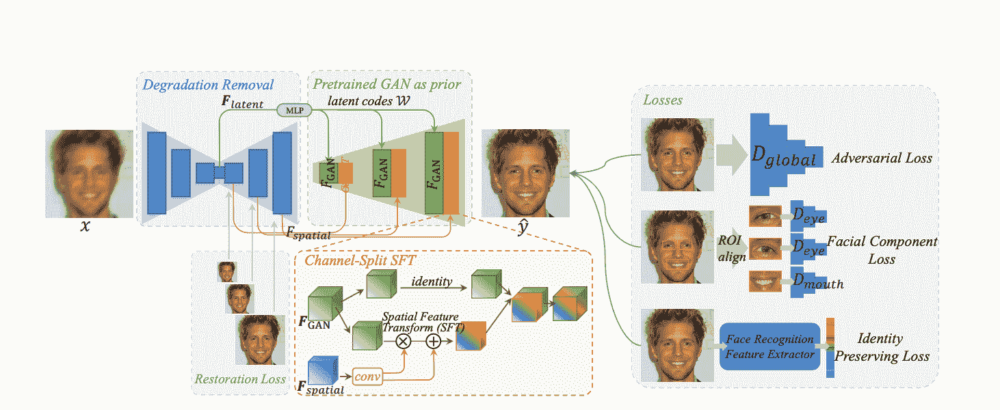
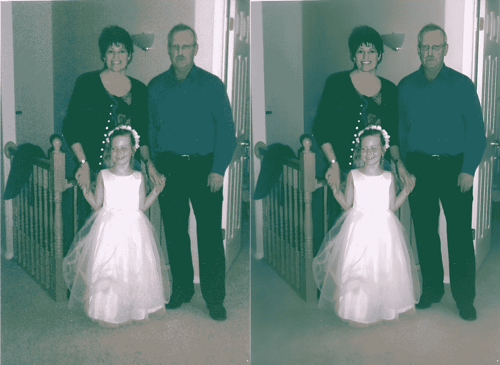
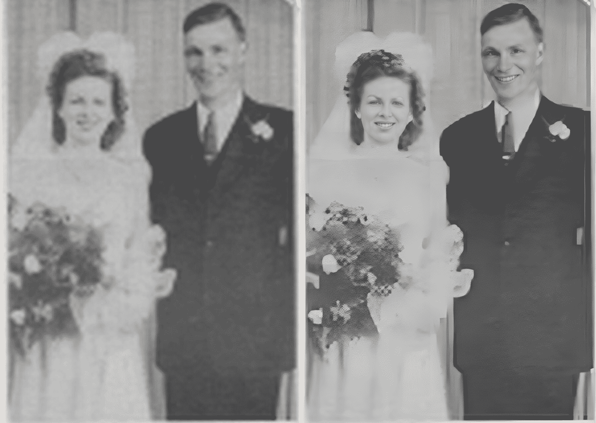
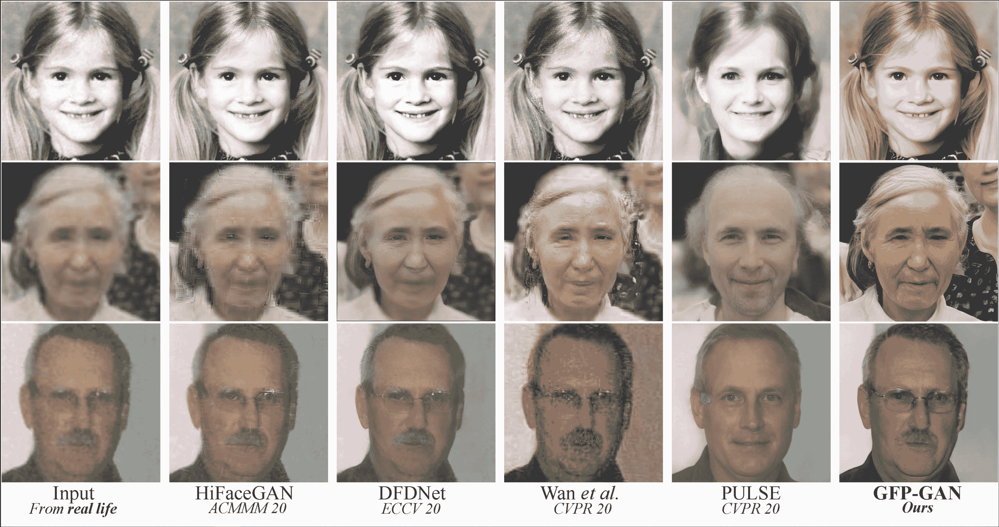

# 如何用 GFP-GAN 修复受损照片

> 原文：<https://blog.paperspace.com/restoring-old-photos-using-gfp-gan/>

2022 年 7 月 7 日:这篇博客文章及其相关的笔记本和回购已经更新，可以与 GFPGAN 1.3 一起使用。

* * *

自摄影发明以来的近 200 年里，我们一直面临着同样的问题:我们如何防止损害的积累和破坏图像的质量。印在胶片及其前体介质上的照片会因暴露于自然环境和老化而受损，更不用说材料本身的脆弱性和对急性损伤的敏感性了。

虽然数码照片已经消除了很多潜在的问题，包括储存和保护，但数码照片仍然存在一种内在的模糊性，这种模糊性在胶片中是没有的。这在很大程度上是因为一张 35 毫米的胶片能够捕捉的信息是 4k 数字图像捕捉设备的几倍。

因此，这两种摄影媒介各自的缺点都有一个相似的问题:如何恢复或提升这些图像的分辨率和质量。

# 绿色荧光蛋白-氮化镓

GFP-GAN 是一种新的 GAN 架构，旨在提升受损、老化和其他低分辨率照片中人脸的质量，由作者研究人员在他们的论文“[利用生成性面部先验信息进行真实世界的盲人脸恢复](https://arxiv.org/pdf/2101.04061.pdf)”中介绍，，，[张宏伦](https://arxiv.org/search/cs?searchtype=author&query=Zhang%2C+H)和。在实践中，这对于图像质量具有恢复和升级效果，并且可以与其他模型结合使用，以显著提高图像质量。



[Source](https://arxiv.org/pdf/2101.04061.pdf)

GFP-GAN 的组成如下:

首先，退化去除模块(在这种情况下，是普通的 U-Net)获取受损照片，并在提取潜在特征的同时去除退化。该模块特别提取两种类型的特征:将输入图像映射到最接近的潜在 StyleGAN2 码的潜在特征，以及用于调制 StyleGAN2 特征 [](https://arxiv.org/pdf/2101.04061.pdf) 的多分辨率空间特征。

接下来，预训练的 StyleGAN2 模型充当生成面部先验。在 GAN 和 DRM 之间，潜在特征由几个多层感知器转换成风格向量。这些向量然后被用来产生中间卷积特征，目的是使用空间特征来进一步调制最终输出。

通道分割要素变换允许空间要素用于预测变换参数，这些变换参数可用于缩放和置换生成器中要素地图中的要素。这种情况只发生在某些通道中，因此如果模型认为没有必要更改某些特征，则允许这些特征不加更改地通过。

最后，使用所生成图像的生成器感知重建损失、对抗性损失、ID 损失和面部成分损失来进一步细化所生成的图像，直到训练完成。

在实践中，这允许 GFP-GAN 从根本上恢复和升级受损图像的面部质量。当结合作者之前的作品 [REAL-ESRGAN](https://github.com/xinntao/Real-ESRGAN) 时，我们可以使用这些模型来增强照片，远远超过过去在相同挑战中尝试的水平。

# 在斜坡上跑步

## 建立

由于图像生成的成本很高，建议您在本地或远程机器上使用这个带有 GPU 的包。我们现在将浏览一个快速教程，使用 GFP-GAN repo 的 Gradient [预制 fork](https://github.com/gradient-ai/GFPGAN) 在远程实例上运行包。

登录到 Gradient，并在 Gradient 中导航到您想要工作的项目空间。然后，使用右上角的按钮创建一个新笔记本。

因为这个包是用 PyTorch 编写的，所以根据您的目的选择 PyTorch 运行时和合适的 GPU。这应该在我们提供给所有用户的免费 GPU 上运行良好，这取决于供应商。

最后一步是切换页面底部的高级选项。确保将 GFP-GAN repo 的[预制分支的 url 粘贴到“工作区 URL”框中。](https://github.com/gradient-ai/GFPGAN)现在你可以启动笔记本了。



An example of the photo restoration in practice. Notice how the effect is more pronounced on faces. 

## 梯度运行 GFP-GAN

一旦你的笔记本准备好了，打开笔记本“Run-GFPGAN.ipynb”

您可以使用这个笔记本来运行一个简单的演示，使用 repo 的创建者提供的预训练 GFP-GAN 模型实例。你可以运行所有现在看到提供的样本图像演示工作，但如果你想使用自己的图像:他们需要直接上传到梯度。

```py
# Install basicsr - https://github.com/xinntao/BasicSR
# We use BasicSR for both training and inference
!pip install basicsr

# Install facexlib - https://github.com/xinntao/facexlib
# We use face detection and face restoration helper in the facexlib package
!pip install facexlib

# If you want to enhance the background (non-face) regions with Real-ESRGAN,
# you also need to install the realesrgan package
!pip install realesrgan
```

当您点击 run all 时，它将首先安装所需的库依赖项。第一个细胞中的细胞都来自同一个研究团队，他们互相促进。BasicSR 是一个用于图像和视频恢复的开源工具包，facexlib 打包了一组现成的算法来处理面部特征，Real-ESRGAN 用于增强受损图像的背景，就像 GFP-GAN 恢复面部一样。

```py
!pip install -r requirements.txt
!pip install opencv-python==4.5.5.64 
```

您可能还需要在终端中输入以下命令。这需要在终端本身中运行，因为在安装过程中需要肯定的“是”才能在终端中进行安装。

```py
apt-get update && apt-get install libgl1
```

下一个代码单元包含确保我们的环境可以运行 GFP-GAN 所需的剩余包。

```py
!python setup.py develop
!wget https://github.com/TencentARC/GFPGAN/releases/download/v1.3.0/GFPGANv1.3.pth -P experiments/pretrained_models 
```

最后，我们可以运行 setup.py 脚本来完成运行生成器的环境设置。我们还使用一个 wget 来获得作者提供的预训练 GFP-GAN 模型以供使用。

```py
!python inference_gfpgan.py -i inputs/whole_imgs -o results -v 1.3 -s 2
```

要实际运行生成器，请运行笔记本中包含该命令的最后一个单元格。它会将您新恢复的图像直接输出到新创建的结果目录中。



An example i made using a random image I found on Reddit

# 结论

本教程分解了 GFP-GAN 的基本架构，并演示了如何使用 GFP-GAN 及其堂兄包 REAL-esrGAN 来大幅恢复老化和损坏的照片。虽然许多人将照片修复作为一种爱好，但这可能很快会使这种努力变得更加复杂，耗时更少。

感谢您的阅读！

来源和参考资料:

[Towards Real-World Blind Face Restoration with Generative Facial PriorBlind face restoration usually relies on facial priors, such as facialgeometry prior or reference prior, to restore realistic and faithful details.However, very low-quality inputs cannot offer accurate geometric prior whilehigh-quality references are inaccessible, limiting the applicability inre…arXiv.orgXintao Wang](https://arxiv.org/abs/2101.04061)[Casual GAN Papers: GFP-GAN ExplainedTowards Real-World Blind Face Restoration with Generative Facial Prior by Xintao Wang et al. explained in 5 minutes.Kirill Demochkin’s Picture](https://www.casualganpapers.com/generative-face-prior-blind-face-restoration/GFPGAN.html)