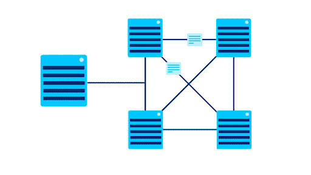

# 选择最佳云虚拟机服务的指南

> 原文：<https://blog.paperspace.com/guidelines-in-choosing-the-best-cloud-vm-service/>

## 介绍

大多数时候，当提到虚拟机或云虚拟化的话题时，人们会感到非常困惑。通常，当这些话题被提起时，人们心中会有很高程度的怀疑。听到“云是什么？”这样的问题并不少见或者“什么是虚拟机？”或者‘什么是云虚拟机？’在外行人中间。

在本文中，我们将逐一介绍这些术语，以帮助您更好地理解它们的含义。之后，我们将讨论以下主题:

→什么是虚拟机？

→使用虚拟机的优势

→什么是云虚拟机？

→使用云虚拟机的优势

→普通虚拟机和云虚拟机之间的区别

→云虚拟机的类型

→选择最佳云虚拟机服务的指南

在本教程结束时，我们将最终能够看到资源选择*隧道*尽头的*之光。*我们将能够根据我们项目的需求，放心地选择云虚拟机服务。

## 什么是虚拟机？

让我们想象一个没有虚拟机的世界。设想一个假设的情况，我们想要在一台 Windows 计算机上构建一个可以在不同操作系统上使用的应用程序。两个月后，我们完成了应用程序的构建。我们在我们的电脑上测试它，它工作得很完美。现在，我们想在 Mac OS 上测试它，但是我们遇到了一个问题。我们没有苹果电脑。

我们能想到的最佳解决方案是去亚马逊商店花 1500 美元买一台 Macbook。现在，我们有了 Macbook，我们在那里测试我们的应用程序。现在，如果我们想在 Linux 操作系统上测试应用程序，我们该怎么做呢？我们将不得不再次重复这个循环，去一些电脑商店购买 Linux 设备。

这个解决方案有什么问题？

显然，这种解决方案远非成本有效，更不用说耗时了。这样做的原因是，当我们想在多个设备上测试我们的应用程序时，我们必须购买这些设备，配置它们，并在它们上安装我们的依赖项，然后才能成功地测试它们。

这种解决方案的另一个问题是可伸缩性。当我们将应用程序推向生产，用户数量增加时会发生什么。我们现在需要再买一台更大规格的电脑吗？正如我们所看到的，在这样的物理限制下进行生产开发是很有压力的。

## 虚拟机在哪里发挥作用

现在，想象一个世界，我们可以在一台计算机中得到这些不同的机器。想象一下，我们可以从一个 Windows 操作系统开始，当我们想在 Linux 上测试它时，我们可以很容易地在同一个工作空间中切换到 Linux 操作系统。让我告诉你们一些好消息。没必要想象。时间已经到了。

有了虚拟机，我们不需要在任何时候测试应用程序都需要单独的硬件。我们可以在单台计算机上获得这些设备的虚拟图像。我们可以通过各种服务使用 windows 上的 Linux，mac 上的 Linux，mac 上的 windows 或者任意组合。

虚拟机的核心是虚拟机管理程序。

借助虚拟机管理程序，我们可以将多台虚拟计算机托管到一台物理计算机中。虚拟机管理程序的例子有 VirtualBox、VMware 和许多其他虚拟机管理程序。

关于虚拟机的一个非常有趣的事实是，它们不知道自己是虚拟机。虚拟机不需要互相查看，它们是完全隔离的。

### 使用虚拟机的优势

*   虚拟机是分布式的。这意味着，如果虚拟机出现故障，不会影响主机。
*   虚拟机是完全隔离的，不会危及我们的主操作系统
*   有了虚拟机，我们可以轻松地在多个操作系统中测试我们的应用程序。

## 云虚拟机

到目前为止，我们已经看到了虚拟机是多么迷人。云虚拟机(也称为云虚拟化)就是云上的虚拟机。它们充当可以在云中运行的物理机器的数字版本。就像我们的物理计算机一样，它可以运行操作系统，连接到多个网络，以分布式方式存储我们的数据，并执行许多其他任务。提供云虚拟机的服务示例包括 Paperspace、AWS 和 Azure

### 使用云虚拟机的优势

有了云虚拟机，我们可以用最佳优化的资源来构建我们的完美计算机。例如，如果我们需要一台具有高内存的计算机，我们可以简单地让云为我们完成这项工作。有了云虚拟机，我们可以用我们需要的资源来构建我们非常完美的计算机，并根据需要进行更改。

*   **低成本**:在云中创建虚拟机比购买物理机更容易、更便宜。还记得吗，当我们想在 safari 上测试我们的应用程序时，我们去商店买了一台 1500 美元的电脑。借助云虚拟化，我们可以以更低的价格获得更多资源。
*   **可扩展性**:我们可以根据负载轻松扩展我们的云虚拟机架构。在使用云虚拟机时，我们只为我们需要的东西付费。例如，让我们想象我们想要构建一个游戏软件。对于这个软件，我们将需要大量的 CPU 和 GPU。让我们想象我们不需要很多内存。我们可以购买一台拥有大量 CPU 和 GPU 的虚拟机，这样我们就能得到它。因此，通过这一点，我们可以获得优化的资源，并为我们需要的东西付费。如果我们需要更多这样的东西，我们可以很容易地支付更多的钱，获得更多的资源。
*   易维护性:还记得我们假设去商店买了那台 1500 美元的苹果电脑吗？购买后，我们需要对其进行配置。可想而知，买了这样一台电脑之后，要配置一台满足我们需求的电脑，压力会有多大。有了云虚拟机，设置和维护变得简单多了。这有助于我们快速开始。有了这一点，我们可以轻松地加速我们的增长，并让我们的软件快速上市。
*   **灾难恢复**:借助云虚拟化，我们可以在将软件投入生产的同时高枕无忧。我们的云提供商以分布式方式提供容错能力。我们不需要软件的副本，以防出现故障或软件宕机。云为我们提供了这一点。

### 常规虚拟机和云虚拟机的区别

*   **自动化**:在常规虚拟机中，我们需要与虚拟机管理程序交互来创建虚拟机。我们还需要自己管理我们的资源。所有这些都是通过使用云虚拟机来自动化的。云虚拟机不需要人类。它使用 API(应用程序可编程接口)与虚拟机管理程序进行通信。这减少了人工干预，使我们能够获得最好的资源。
*   **可扩展性**:与云虚拟机相比，常规虚拟机的可扩展性不好。
*   **灾难恢复**:云虚拟机依赖于多台机器，而常规虚拟机依赖于我们的外围设备。云虚拟机以分布式方式托管多个设备。这样做是为了容错。这样做的原因是为了防止多台机器中的一台损坏，另一台机器从那里拾取任务并运行它。因此，通过这一点，我们确信我们的软件将是容错的。

*   **灵活性**:与常规虚拟机相比，云虚拟机非常灵活
*   **资源**:在常规虚拟机中，资源是共享的。假设我们有一台 8gb 内存的计算机。我们想在 Linux 机器上测试我们的应用程序，所以我们安装了一个虚拟机。如果我们的计算机使用 4gb 的 ram，并且它将 4gb 的 ram 分配给 Linux 虚拟机，我们将无法添加另一个虚拟机，因为没有更多的 ram 可供分配。因此，在常规虚拟机中，资源是从我们的外围设备共享的。然而，在云虚拟机中，情况并非如此。云虚拟机根据策略、需求和规模自动放置机器。
*   **存储**:云虚拟机提供无限的存储，而常规虚拟机依赖于我们物理设备的存储

### 云虚拟机服务的示例

*   纸空间核心
*   亚马逊网络服务(AWS)
*   谷歌云
*   微软 Azure 虚拟机
*   VMWare Horizon 云
*   V2 云
*   腾讯云
*   阿里云

## 选择最佳云虚拟机服务的指南

### 可量测性

这是增加或减少 IT 资源以满足不断变化的需求的过程。使用云虚拟机服务的众多好处之一是可伸缩性。数据存储、网络、处理能力、计算资源等参数都可以扩展。使用云虚拟机服务，可以快速、轻松地完成扩展，不会出现中断或停机。原因是云提供商已经拥有了所有的基础设施。我们需要做的就是随时扩展。

云虚拟机的一个很好的优势是可伸缩性的速度。在物理虚拟机服务上扩展应用程序通常需要数周甚至数月时间。有两种缩放类型；垂直缩放和水平缩放。

垂直扩展(也称为向上/向下扩展)是增加或减少现有云 ram、存储或处理能力的过程。在本地计算中，这意味着购买额外的 ram 或额外的存储，并将其添加到我们的应用程序中。当内存或存储耗尽时，我们需要购买更高的内存并不断添加。

水平扩展(扩大/缩小)是向我们的系统添加资源(如服务器)以分散工作负载的过程。这进而提高了性能、处理能力和存储。当我们需要最小的停机时间时，水平扩展更为重要。

#### 我们如何知道何时扩展？

*   测试:知道我们的应用程序何时需要伸缩的方法之一是简单地测试它。通过测试，我们检查响应时间、用户数量、应用程序收到的请求数量、应用程序性能以及其他许多方面。通过测试应用程序，如果我们注意到加载时间太长或者执行一个查询需要很长时间，我们可能需要扩展它。同样，如果我们拥有的资源数量远远超过用户数量，我们就不能很好地利用资源，我们必须缩减我们的应用程序。
*   自动化:这有助于管理我们的扩展需求。自动化系统可以检测对更多资源的需求，并在需要时自动将它们拉进来。一些服务提供自动伸缩功能，根据负载的增加或减少，自动在[托管实例组(MIG)](https://cloud.google.com/compute/docs/instance-groups#managed_instance_groups) 中添加或删除虚拟机实例。这比直接测试更不可靠，但是可以节省时间。

### 监控工具

这是选择云虚拟机服务时要注意的另一件事。我们要选择的云虚拟机有监控工具吗？

首先，什么是监控工具？监控工具有助于监控、故障排除和提高应用程序性能。它自动捕获指标，并允许我们在应用程序中定义自定义指标。

它还允许我们执行分析、创建图表、查看相关性、创建自定义仪表板、创建警报等等。有很多云服务为我们的软件产品提供监控。一些例子是 Paperspace Gradient Notebook 的 Metrics window(用于深度学习)、Google Cloud LogicMonitor、Site 24X7 虚拟化监控、Veeam One、Quest Foglight、Amazon Cloudwatch、Microsoft Azure Monitor 等等。

在选择云虚拟化服务时，我们必须检查它是否支持监控。

### 数据准备工具

我们还应该看看我们想要选择的云虚拟机是否支持数据准备工具。数据准备是发现、丰富、预处理和转换数据的过程。我们的应用程序是数据驱动的吗？然后，我们需要看看我们的云服务是否支持数据准备工具。检查我们选择的服务是否可以访问这些工具来获取数据，以及是否有专门的数据存储区来存储数据。

### 深度学习支持

我们的应用需要深度学习支持吗？为此，我们需要寻找一种支持深度学习的云虚拟化服务。在深度学习支持方面，Paperspace Core 是一个非常高效的平台。借助 Core，我们可以使用他们的 ML-in-a-box 模板来创建虚拟机映像。这预装了 TensorFlow、PyTorch、Keras 等等。所有的 ML-in-a-box 实例都在 GPU 机器上运行。我们可以利用 Core 的内置可扩展性轻松升级我们的 GPU、vRAM 和存储，而无需担心软件兼容性。

### 可靠性

服务的可靠性对其成功至关重要。服务器端和客户端都有很多可能出错的地方，这会影响云虚拟机的成功运行。最好的云虚拟机服务将确保我们的机器在我们需要时始终可用，并且我们不会遇到像随机机器关闭这样的问题。

同样，各种类型的机器始终具有可靠的可用性也很重要。例如，由于高需求，具有强大 GPU(如 A100s 或 V100s)的流行实例在许多服务上经常不可用。像 Paperspace 这样的公司总是确保每种类型都有最大数量的机器可用，并且总是购买更多的硬件和升级来满足这种需求。

### 储存；储备

选择云虚拟化服务时，存储是我们最需要考虑的因素之一。在选择虚拟化服务时，我们需要一种能够在我们的虚拟机上提供高存储容量选项的服务。我们这样做是为了应对可能需要更多存储空间的情况，比如在扩展时。我们不希望出现因为虚拟化服务中存储不足而导致应用开发失败或中断的情况。

我们还寻求具有备份冗余的存储虚拟化服务。这意味着无论发生什么，我们的应用程序都能够提供服务的连续性。

在选择我们的存储虚拟化服务时，我们还希望减少成本节约和停机时间。我们不想因为我们选择的存储虚拟化服务而耗尽资金。

满足所有这些存储要求的良好虚拟化服务是 Paperspace Core。借助 Paperspace Core，我们获得了一个可变的高可用性存储系统，这是一种备份冗余存储服务，机器数据可在实例停机时保存，与竞争对手相比，存储成本更低，停机时间最短。

## 结论

在本文中，我们了解了物理虚拟机、云虚拟机、它们之间的区别、云虚拟机的优势，以及在选择云虚拟机服务时需要注意的一些准则。Paperspace 是一家云虚拟机公司，在可扩展性、容错性、对数据处理工具的支持、对深度学习的支持、存储和许多其他好处方面得分最高。

现在，我们已经看到了我们可以使用云虚拟机做的许多事情，并且可以自信地知道在为我们的应用程序选择最佳云虚拟机服务时应该注意什么。

感谢我们的阅读。