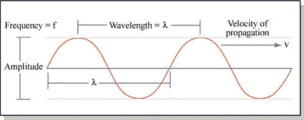
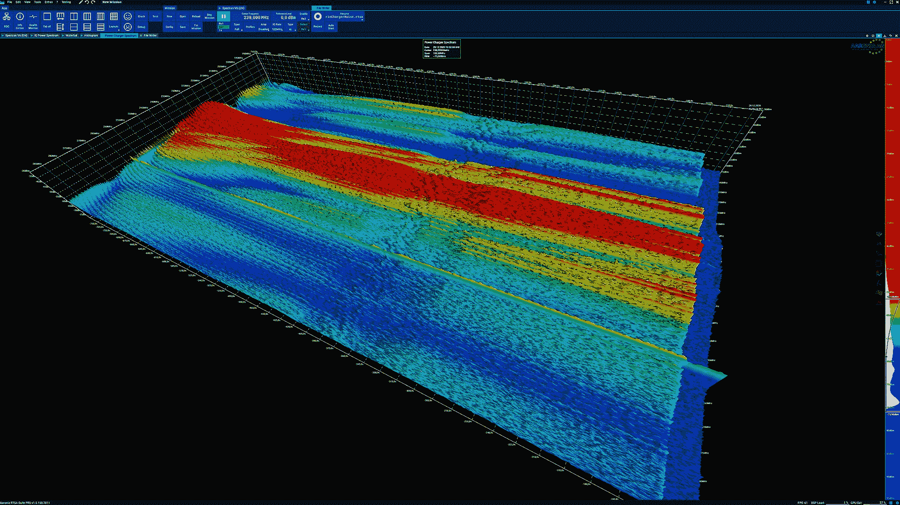
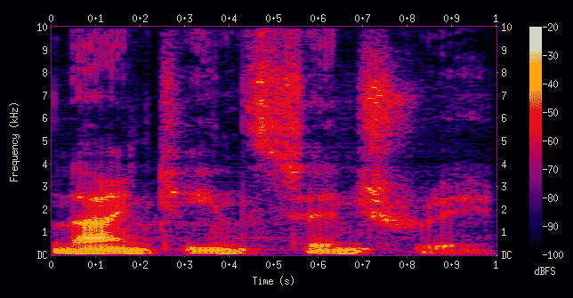
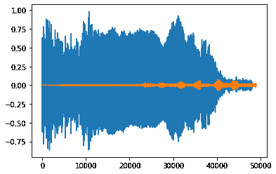
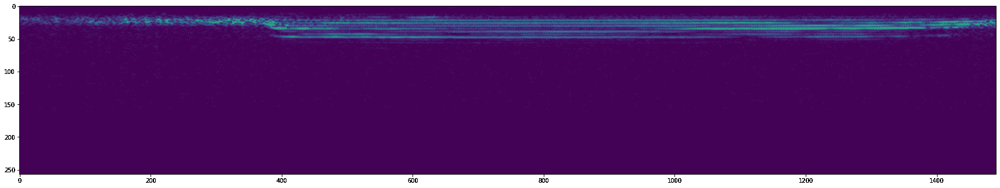

# 深度学习的音频分类

> 原文：<https://blog.paperspace.com/audio-classification-with-deep-learning/>


Photo by [James Kovin](https://unsplash.com/@james2k?utm_source=ghost&utm_medium=referral&utm_campaign=api-credit) / [Unsplash](https://unsplash.com/?utm_source=ghost&utm_medium=referral&utm_campaign=api-credit)

想运行本文中的代码吗？[点击此链接，在渐变笔记本](https://console.paperspace.com/ml-showcase/notebook/r9u4oia2wo0torf)中运行此代码，或者在笔记本创建页面的高级选项中，使用此 [repo](https://github.com/gradient-ai/Audio-Classifier) 作为笔记本的“工作区 URL ”,创建您自己的代码。

* * *

视觉和声音是人类感知的两种最常见的东西。对于大多数人来说，这两种感觉似乎都很琐碎，很难分析并发展出对它们的直观理解。与自然处理(NLP)相关的问题对于人类来说足够简单，但对于机器来说就不一样了，因为它们过去一直在努力实现理想的结果。然而，随着过去十年深度学习模型和架构的引入和兴起，我们已经能够以更高的成功率计算复杂的计算和项目。

在我们以前的博客中，我们已经详细讨论了计算机视觉和自然语言处理的多种不同类型的问题和解决方案。在本文和即将到来的未来工作中，我们将了解更多关于深度学习模型如何被用来解决音频分类任务以及用于音乐生成的信息。音频分类项目是我们将在本文中重点关注的内容，并试图用简单的架构实现良好的结果。代码和项目可以在 Paperspace 的 Gradient 平台上进行计算，以重现和重新创建本文中的代码片段。

## 简介:

音频分类是分析和识别任何类型的音频、声音、噪声、音符或任何其他类似类型的数据以对其进行相应分类的过程。我们可用的音频数据可以以多种形式出现，例如来自声学设备的声音、来自乐器的音乐和弦、人类语音，甚至是自然出现的声音，如环境中的鸟的啁啾声。现代深度学习技术使我们能够在与音频信号处理相关的任务和项目中实现最先进的结果。

在本文中，我们的主要目标是对音频分类项目有一个明确的了解，同时了解信号处理的基本概念和一些用于实现预期结果的最佳技术。在深入本文的内容之前，我首先建议您更加熟悉深度学习框架和其他重要的基本概念。您可以查看更多关于 TensorFlow ( [link](https://blog.paperspace.com/absolute-guide-to-tensorflow/) )和 Keras ( [link](https://blog.paperspace.com/the-absolute-guide-to-keras/) )库的信息，我们将利用它们来构建这个项目。让我们了解一下音频分类的一些基本概念。

* * *

## 探索音频分类的基本概念:

在文章的这一部分，我们将尝试理解一些对理解深度学习音频分类至关重要的有用术语。我们将探讨一些在音频处理项目中可能会遇到的基本术语。让我们从简要分析这些关键概念开始。

### 波形:



[Image Source](https://www.flickr.com/photos/mitopencourseware/3042950125)

在分析波形及其众多参数之前，让我们先了解一下声音是什么。声音是物体在周围的空气粒子振动时产生的振动。气压的相应变化产生了这些声波。声音是一种机械波，能量从一个源头传递到另一个源头。*波形*是帮助我们分析声波随时间的位移的示意图，以及特定任务所需的一些其他基本参数。

另一方面，波形中的*频率*是波形在一秒钟的时间周期内重复自身的次数的表示。波形顶部的峰值称为波峰，而底部的点称为波谷。*振幅*是从中心线到波谷顶部或波峰底部的距离。对这些基本概念有了简单的理解和掌握后，我们可以继续探讨音频分类所需的其他一些基本主题。

### 光谱图:



3-D Spectrogram from [wiki](https://en.wikipedia.org/wiki/Spectrogram#/media/File:3D_battery_charger_RF_spectrum_over_time.jpg)

*频谱图*是音频信号中频谱的可视化表示。频谱图的其他技术术语是声谱图、声纹或声谱图。这些频谱图广泛用于信号处理、音乐生成、音频分类、语言分析、语音检测等领域。我们还将在本文中使用频谱图来完成音频分类的任务。关于这个话题的更多信息，我推荐查看下面的[链接](https://en.wikipedia.org/wiki/Spectrogram)。

### 音频信号处理:

音频信号处理是处理音频信号、声波和其他音频操作的领域。当具体谈到音频信号处理的深度学习时，我们可以在这个大领域中进行大量的应用。

在本文中，我们将更详细地讨论音频分类这一主题。其他一些主要应用包括语音识别、音频去噪、声音信息检索、音乐生成等等。结合深度学习解决音频信号处理任务有着无数的可能性，值得探索。让我们在下一节开始理解音频分类项目，然后再从头开始实现它。

* * *

## 了解音频分类项目:



[Image Source](https://en.wikipedia.org/wiki/Spectrogram)

音频分类是入门音频深度学习最好的基础入门项目之一。目标是理解原始格式的可用波形，并将现有数据转换成开发人员可用的形式。通过将音频数据的原始波形转换为频谱图的形式，我们可以将其通过深度学习模型来解释和分析数据。在音频分类中，我们通常执行二元分类，其中我们确定输入信号是否是我们想要的音频。

在这个项目中，我们的目标是检索一只鸟发出的声音。传入的噪声信号被转换为波形，我们可以在 TensorFlow 深度学习框架的帮助下，利用该波形进行进一步的处理和分析。一旦成功获得波形，我们就可以将该波形转换成频谱图，频谱图是可用波形的可视化表示。由于这些光谱图是视觉图像，我们可以通过创建深度学习模型来计算二进制分类结果，从而利用卷积神经网络来相应地分析它们。

* * *

## 利用深度学习实现音频分类和识别项目:

如前所述，我们项目的目标是读取从森林传入的声音，并解释接收到的数据是属于特定的鸟(卷尾鸟)还是其他我们不太想知道的噪音。对于整个项目的构建，我们将利用 TensorFlow 和 Keras 深度学习框架。

你可以查看下面的[文章](https://blog.paperspace.com/absolute-guide-to-tensorflow/)来了解更多关于 TensorFlow 和 Keras 文章[这里](https://blog.paperspace.com/the-absolute-guide-to-keras/)。该项目需要的另一个额外安装是 TensorFlow-io 库，它将允许我们访问 TensorFlow 内置支持中不可用的文件系统和文件格式。以下提供的 pip 命令可用于在您的工作环境中安装库。

```py
pip install tensorflow-io[tensorflow] 
```

### 导入基本库:

在下一步中，我们将导入构建以下项目所需的所有基本库。对于这个项目，我们将使用一个序列类型模型，它将允许我们构建一个简单的卷积神经网络来分析产生的光谱图并获得理想的结果。由于所开发的模型的架构非常简单，我们并不真正需要利用功能模型 API 或者定制建模功能。

我们将利用卷积层的架构，以及一些密集和平坦的层。如前所述，我们还将利用 TensorFlow 输入输出库来处理大量的文件系统和格式，如。wav 格式和. mp3 格式。操作系统库导入将帮助我们以各自的格式访问所有需要的文件

```py
import tensorflow as tf 
from tensorflow.keras.models import Sequential
from tensorflow.keras.layers import Conv2D, Dense, Flatten
import tensorflow_io as tfio
from matplotlib import pyplot as plt
import os
```

### 正在加载数据集:

这个项目的数据集可以通过惠普解锁挑战 3 的*信号处理- Z 的 Kaggle 挑战获得，你可以从这个[链接](https://www.kaggle.com/datasets/kenjee/z-by-hp-unlocked-challenge-3-signal-processing)下载。*

#### 要将数据下载到梯度笔记本上:

1.获得一个 Kaggle 帐户

2.转到您的帐户设置创建一个 api 令牌，并保存 kaggle.json。注意:如果您已经创建了一个 API 令牌，您可能需要创建一个新的 API 令牌。

3.将 kaggle.json 上传到此渐变笔记本

4.运行下面的单元格或在终端中运行以下命令(这可能需要一段时间)

终端:

mv kaggle.json ~/。kaggle/

pip 安装卡格尔

kaggle 数据集下载 ken JEE/z-by-HP-unlocked-challenge-3-信号处理

解压 z-by-HP-unlocked-challenge-3-signal-processing . zip

单元格:

！mv kaggle.json ~/。kaggle/

！pip 安装卡格尔

！kaggle 数据集下载 ken JEE/z-by-HP-unlocked-challenge-3-信号处理

！解压 z-by-HP-unlocked-challenge-3-signal-processing . zip

下载并提取数据集后，我们可以注意到 data 文件夹中有三个目录。这三个目录分别是森林录音，包含森林中产生的声音的三分钟剪辑、僧帽猴鸟录音的三秒钟剪辑以及僧帽猴鸟不产生的声音的三秒钟录音剪辑。在下一个代码片段中，我们将定义变量来相应地设置这些路径。

```py
CAPUCHIN_FILE = os.path.join('data', 'Parsed_Capuchinbird_Clips', 'XC3776-3.wav')
NOT_CAPUCHIN_FILE = os.path.join('data', 'Parsed_Not_Capuchinbird_Clips', 'afternoon-birds-song-in-forest-0.wav')
```

在下一步中，我们将定义数据加载函数，该函数将有助于以所需格式创建所需波形，以供进一步计算。下面代码片段中定义的函数将允许我们读取数据，并将其转换为单声道(或单个)通道，以便于分析。我们还将改变频率信号，使我们能够修改整体振幅，以获得更小的数据样本用于整体分析。

```py
def load_wav_16k_mono(filename):
    # Load encoded wav file
    file_contents = tf.io.read_file(filename)
    # Decode wav (tensors by channels) 
    wav, sample_rate = tf.audio.decode_wav(file_contents, desired_channels=1)
    # Removes trailing axis
    wav = tf.squeeze(wav, axis=-1)
    sample_rate = tf.cast(sample_rate, dtype=tf.int64)
    # Goes from 44100Hz to 16000hz - amplitude of the audio signal
    wav = tfio.audio.resample(wav, rate_in=sample_rate, rate_out=16000)
    return wav
```



Image by Author

上图显示了卷尾猴和非卷尾猴信号的波形图。

### 准备数据集:

在文章的这一部分，我们将定义卷尾鸟剪辑的正路径和负路径。正路径变量存储包含卷尾鸟的剪辑记录的目录的路径，而负路径存储在另一个变量中。我们将把这些目录中的文件链接到。wav 格式并添加各自的标签。标签是按照二进制分类的，被标记为 0 或 1。正标签的值为 1，这意味着片段包含卷尾猴鸟的音频信号。带有零的负标签指示音频信号是不包含卷尾猴鸟的剪辑记录的随机噪声。

```py
# Defining the positive and negative paths
POS = os.path.join('data', 'Parsed_Capuchinbird_Clips/*.wav')
NEG = os.path.join('data', 'Parsed_Not_Capuchinbird_Clips/*.wav')

# Creating the Datasets
pos = tf.data.Dataset.list_files(POS)
neg = tf.data.Dataset.list_files(NEG)

# Adding labels
positives = tf.data.Dataset.zip((pos, tf.data.Dataset.from_tensor_slices(tf.ones(len(pos)))))
negatives = tf.data.Dataset.zip((neg, tf.data.Dataset.from_tensor_slices(tf.zeros(len(neg)))))
data = positives.concatenate(negatives)
```

我们还可以分析卷尾鸟的平均波长，如下面的代码片段所示，方法是加载到 positive samples 目录中，并加载我们之前创建的数据加载函数。

```py
# Analyzing the average wavelength of a Capuchin bird
lengths = []
for file in os.listdir(os.path.join('data', 'Parsed_Capuchinbird_Clips')):
    tensor_wave = load_wav_16k_mono(os.path.join('data', 'Parsed_Capuchinbird_Clips', file))
    lengths.append(len(tensor_wave))
```

最小、平均和最大波长周期分别如下所示。

```py
<tf.Tensor: shape=(), dtype=int32, numpy=32000>

<tf.Tensor: shape=(), dtype=int32, numpy=54156>

<tf.Tensor: shape=(), dtype=int32, numpy=80000> 
```

### 将数据转换成光谱图:

在下一步中，我们将创建函数来完成音频分析所需的预处理步骤。我们将把以前获得的波形转换成频谱图的形式。在接下来的步骤中，我们的深度学习模型将使用这些频谱图形式的可视化音频信号来相应地分析和解释结果。在下面的代码块中，我们获取所有波形，并使用 TensorFlow 库计算信号的短时傅立叶变换，以获取可视化表示，如下图所示。

```py
def preprocess(file_path, label): 
    for i in os.listdir(file_path):
        i = file_path.decode() + "/" + i.decode()
        wav = load_wav_16k_mono(i)
        wav = wav[:48000]
        zero_padding = tf.zeros([48000] - tf.shape(wav), dtype=tf.float32)
        wav = tf.concat([zero_padding, wav],0)
        spectrogram = tf.signal.stft(wav, frame_length=320, frame_step=32)
        spectrogram = tf.abs(spectrogram)

        spectrogram = tf.expand_dims(spectrogram, axis=2)
        return spectrogram, label

filepath, label = positives.shuffle(buffer_size=10000).as_numpy_iterator().next()

spectrogram, label = preprocess(filepath, label)
```



Image by Author

### 构建深度学习模型:

在我们开始构建深度学习模型之前，让我们通过加载数据来创建数据管道。我们将加载从预处理步骤函数获得的谱图数据元素。我们可以通过使用 TensorFlow 内置功能缓存和混洗这些数据，并创建一个 16 的批处理大小来相应地加载数据元素。在我们继续构建深度学习模型之前，我们可以为训练和测试样本创建分区，如下面的代码片段所示。

```py
# Creating a Tensorflow Data Pipeline
data = data.map(preprocess)
data = data.cache()
data = data.shuffle(buffer_size=1000)
data = data.batch(16)
data = data.prefetch(8)

# Split into Training and Testing Partitions
train = data.take(36)
test = data.skip(36).take(15)
```

在下一步中，我们将构建一个顺序类型模型。我们可以开发架构，用功能 API 或定制模型原型来解决任务。然后，我们可以继续将卷积层与样本标签的相应形状相加，以构建具有 16 个滤波器和(3，3)核大小的两个卷积层块。ReLU 激活功能用于卷积层的构建。然后，我们可以对从卷积层获得的输出进行平坦化，使其适合进一步处理。最后，我们可以添加具有 Sigmoid 激活函数的完全连接的层，其中一个输出节点接收二进制分类输出。代码片段和所构建模型的摘要如下所示。

```py
model = Sequential()
model.add(Conv2D(16, (3,3), activation='relu', input_shape=(1491, 257,1)))
model.add(Conv2D(16, (3,3), activation='relu'))
model.add(Flatten())
# model.add(Dense(128, activation='relu'))
model.add(Dense(1, activation='sigmoid'))

model.summary()
```

```py
Model: "sequential"
_________________________________________________________________
 Layer (type)                Output Shape              Param #   
=================================================================
 conv2d (Conv2D)             (None, 1489, 255, 16)     160       

 conv2d_1 (Conv2D)           (None, 1487, 253, 16)     2320      

 flatten (Flatten)           (None, 6019376)           0         

 dense (Dense)               (None, 1)                 6019377   

=================================================================
Total params: 6,021,857
Trainable params: 6,021,857
Non-trainable params: 0
_________________________________________________________________ 
```

一旦我们完成了模型架构的构建，我们就可以相应地继续编译和训练模型。对于模型的编译，我们可以使用 Adam 优化器、用于二进制分类的二进制交叉熵损失函数，并定义一些额外的召回和精度度量用于模型分析。我们可以训练之前用验证测试数据构建的数据，并在几个时期内拟合模型。在这个步骤之后获得的代码片段和结果如下所示。

```py
# Compiling and fitting the model
model.compile('Adam', loss='BinaryCrossentropy', metrics=[tf.keras.metrics.Recall(),tf.keras.metrics.Precision()])

model.fit(train, epochs=4, validation_data=test)
```

```py
Epoch 1/4
36/36 [==============================] - 204s 6s/step - loss: 1.6965 - recall: 0.8367 - precision: 0.8483 - val_loss: 0.0860 - val_recall: 0.9254 - val_precision: 0.9688
Epoch 2/4
36/36 [==============================] - 200s 6s/step - loss: 0.0494 - recall: 0.9477 - precision: 0.9932 - val_loss: 0.0365 - val_recall: 1.0000 - val_precision: 0.9846
Epoch 3/4
36/36 [==============================] - 201s 6s/step - loss: 0.0314 - recall: 0.9933 - precision: 0.9801 - val_loss: 0.0228 - val_recall: 0.9821 - val_precision: 1.0000
Epoch 4/4
36/36 [==============================] - 201s 6s/step - loss: 0.0126 - recall: 0.9870 - precision: 1.0000 - val_loss: 0.0054 - val_recall: 1.0000 - val_precision: 0.9861 
```

一旦我们成功地构建并训练了模型，我们就可以分析并验证结果。结果中获得的指标显示了良好的进展。因此，我们可以认为所构建的模型适合于对鸟的叫声进行相对成功的预测，以识别卷尾猴鸟的噪声频率。在下一节中，我们将研究这个过程的步骤。

### 进行所需的预测:

在这个项目的最后一步，我们将分析如何对森林记录中的所有现有文件进行适当的预测。在这一步之前，让我们看看如何对单个批次进行预测，如下面的代码片段所示。

```py
# Prediction for a single batch
X_test, y_test = test.as_numpy_iterator().next()
yhat = model.predict(X_test)

# converting logits to classes
yhat = [1 if prediction > 0.5 else 0 for prediction in yhat]
```

既然我们已经了解了如何对单个批次进行预测，那么有必要说明如何对森林记录目录中的文件进行预测。森林录音中的每个片段大约三分钟长。由于我们的预测由一个三秒钟的片段组成，用于检测卷尾猴鸟的叫声，我们可以将这些更长的片段分割成窗口频谱。我们可以将三分钟长的剪辑(180 秒)分成 60 个更小的片段来进行分析。我们将在这一部分检测卷尾猴鸟的总叫声，其中每个片段的得分为 0 或 1。

一旦我们确定了每个窗口频谱的调用，我们就可以通过将所有单个值相加来计算整个片段中的总计数。总计数告诉我们在整个音频剪辑中听到卷尾猴鸟声音的次数。在下面的代码片段中，我们将构建与上一节中讨论的函数类似的第一个函数，在该函数中，我们读取森林记录剪辑，这些剪辑是 mp3 文件的形式，而不是。wav 格式。下面的函数将 mp3 格式的输入转换成张量。然后，我们计算多声道输入的平均值，将其转换为单声道，并获得所需的频率信号。

```py
def load_mp3_16k_mono(filename):
    """ Load an audio file, convert it to a float tensor, resample to 16 kHz single-channel audio. """
    res = tfio.audio.AudioIOTensor(filename)
    # Convert to tensor and combine channels 
    tensor = res.to_tensor()
    tensor = tf.math.reduce_sum(tensor, axis=1) / 2 
    # Extract sample rate and cast
    sample_rate = res.rate
    sample_rate = tf.cast(sample_rate, dtype=tf.int64)
    # Resample to 16 kHz
    wav = tfio.audio.resample(tensor, rate_in=sample_rate, rate_out=16000)
    return wav

mp3 = os.path.join('data', 'Forest Recordings', 'recording_00.mp3')

wav = load_mp3_16k_mono(mp3)

audio_slices = tf.keras.utils.timeseries_dataset_from_array(wav, wav, sequence_length=48000, sequence_stride=48000, batch_size=1)

samples, index = audio_slices.as_numpy_iterator().next()
```

在下一个代码片段中，我们将构建一个函数，帮助我们将各个片段分离成窗口光谱图，以便进一步计算。我们将相应地映射数据，并创建适当的切片来进行所需的预测，如下所示。

```py
# Build Function to Convert Clips into Windowed Spectrograms
def preprocess_mp3(sample, index):
    sample = sample[0]
    zero_padding = tf.zeros([48000] - tf.shape(sample), dtype=tf.float32)
    wav = tf.concat([zero_padding, sample],0)
    spectrogram = tf.signal.stft(wav, frame_length=320, frame_step=32)
    spectrogram = tf.abs(spectrogram)
    spectrogram = tf.expand_dims(spectrogram, axis=2)
    return spectrogram

audio_slices = tf.keras.utils.timeseries_dataset_from_array(wav, wav, sequence_length=16000, sequence_stride=16000, batch_size=1)
audio_slices = audio_slices.map(preprocess_mp3)
audio_slices = audio_slices.batch(64)

yhat = model.predict(audio_slices)
yhat = [1 if prediction > 0.5 else 0 for prediction in yhat]
```

在本文的最后一段代码中，我们将对森林记录中的所有文件运行以下过程，并获得一个总的计算结果。结果将包含 0 和 1 的片段，其中输出 1 的总和以计算片段的总得分。我们可以根据以下项目的需要，使用下面提供的代码，在录音中找出卷尾猴鸟的叫声总数。

```py
results = {}
class_preds = {}

for file in os.listdir(os.path.join('data', 'Forest Recordings')):
    FILEPATH = os.path.join('data','Forest Recordings', file)

    wav = load_mp3_16k_mono(FILEPATH)
    audio_slices = tf.keras.utils.timeseries_dataset_from_array(wav, wav, sequence_length=48000, sequence_stride=48000, batch_size=1)
    audio_slices = audio_slices.map(preprocess_mp3)
    audio_slices = audio_slices.batch(64)

    yhat = model.predict(audio_slices)

    results[file] = yhat

for file, logits in results.items():
    class_preds[file] = [1 if prediction > 0.99 else 0 for prediction in logits]
class_preds
```

这个项目的两个主要参考是来自 Kaggle 的[笔记本](https://www.kaggle.com/code/lkergalipatak/bird-audio-classification-with-tensorflow)和下面的 [GitHub](https://github.com/nicknochnack/DeepAudioClassification) 链接。大部分代码摘自以下参考资料，我强烈建议您查阅一下。这篇博文的代码也在 [Gradient AI](https://github.com/gradient-ai/Audio-Classifier) 上托管。创建一个笔记本，将此 URL 作为工作区 URL，以便将此代码作为。ipynb 直接放入笔记本。

为了获得更好的结果，还可以对这个项目进行一些额外的改进。可以增加网络的复杂性，并且可以利用其他创新方法来获得卷尾猴鸟模式分析的更高精度。在以后的文章中，我们还将看看其他一些与音频信号处理相关的项目。

* * *

## 结论:


Photo by [Will Francis](https://unsplash.com/@willfrancis?utm_source=ghost&utm_medium=referral&utm_campaign=api-credit) / [Unsplash](https://unsplash.com/?utm_source=ghost&utm_medium=referral&utm_campaign=api-credit)

深度学习的音频信号处理因其在解释和完成各种复杂项目方面的高成功率而获得了高度关注。大多数复杂的信号项目，如声学音乐检测、音频分类、环境声音分类等等，都可以通过深度学习技术来实现。随着这些领域的进一步改进和发展，我们可以期待取得更大的成就。

在这篇文章中，我们介绍了深度学习的音频分类。我们探索和分析了一些基本和必要的组成部分，以彻底理解音频分类的概念。然后，在进入任务的实现部分之前，我们对这个博客的特定项目进行了简要总结。我们利用 TensorFlow 框架进行波形转换，使用频谱图进行分析，并构建了一个能够对音频数据进行二进制分类的简单卷积神经网络。有几个改进可以添加到下面的项目中，以获得更好的结果。

在接下来的文章中，我们将关注更多与深度学习音频信号处理相关的有趣项目。我们还将分析一些音乐生成项目，并从头开始继续我们在生成性对抗网络和神经网络方面的工作。在那之前，享受探索和构建新项目的乐趣吧！