# 你需要知道的关于少量学习的一切

> 原文：<https://blog.paperspace.com/few-shot-learning/>

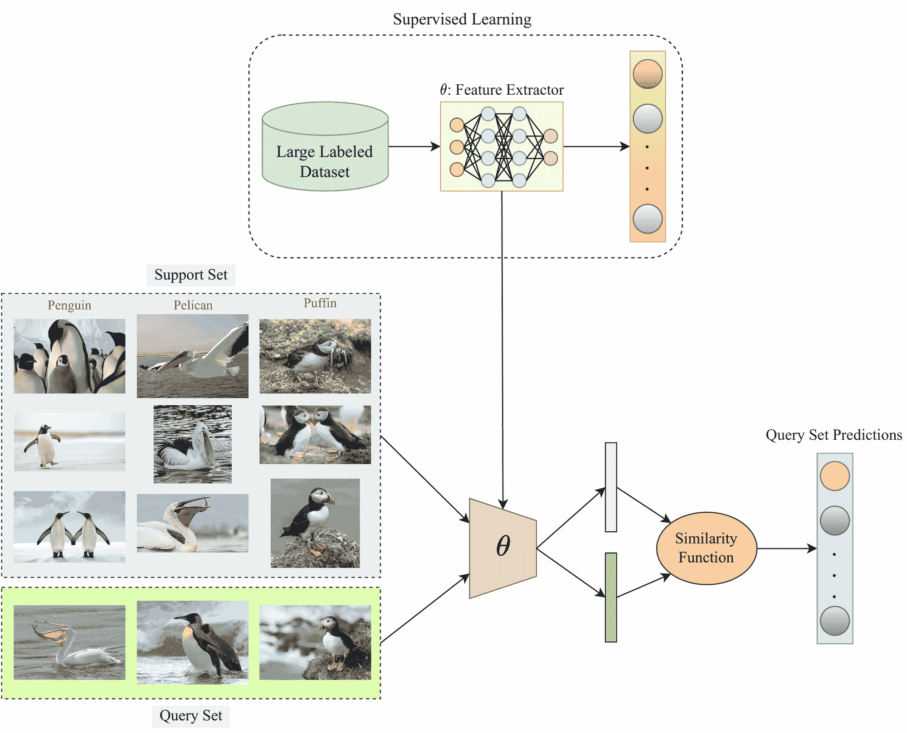

深度学习模型在图像分类、语义分割、对象检测等计算机视觉任务中的成功。归功于利用了用于训练网络的大量标记数据——一种称为监督学习的方法。尽管在这个信息技术时代，大量的非结构化数据是可用的，但是带注释的数据很难获得。

由于这个原因，数据标记占用了计算机视觉机器学习项目的大部分时间，并且也是一项昂贵的工作。此外，在医疗保健等领域，只有专家医生才能对数据进行分类——例如，看看下面两幅宫颈细胞学图像——你能肯定地说哪一幅是癌性的吗？

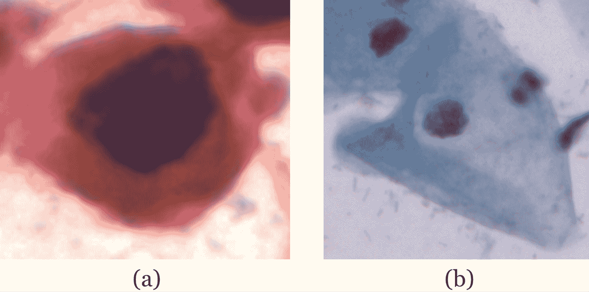

Source: [SIPaKMeD Dataset](https://www.cs.uoi.gr/~marina/sipakmed.html)

大多数未经训练的医疗专业人员不会知道答案——(a)是癌性的，而(b)是良性的。因此，在这种情况下，数据标记更加困难。在最好的情况下，我们将只有少数带注释的样本，这远远不足以训练监督学习模型。

此外，随着时间的推移，更新的数据可能会逐渐变得可用——比如，当新发现的鸟类物种的数据变得可用时。在大数据集上训练深度神经网络会消耗大量计算能力(例如，ResNet-200 在 8 个 GPU 上训练大约需要三周时间)。因此，在大多数情况下，必须重新训练模型以适应新的可用数据是不可行的。

这就是相对较新的少量学习概念的由来。

## 什么是少投学习？

少数镜头学习(FSL)是一种机器学习框架，它使预训练模型能够在每个类中仅使用几个标记样本的情况下，对新类别的数据(预训练模型在训练期间没有见过的)进行归纳。它属于元学习的范式(元学习就是学会学习)。

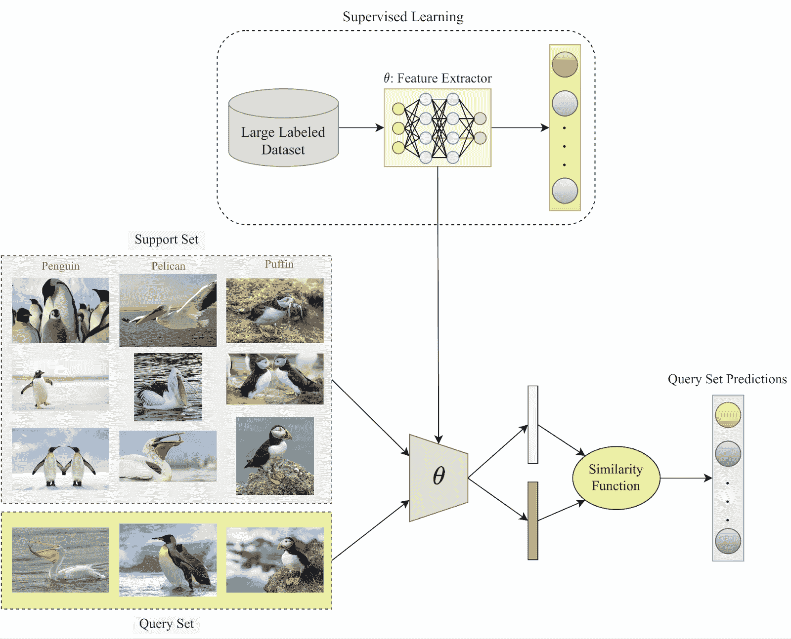

General overview of a Few-Shot Learning framework. Image by the author

我们，人类，能够利用我们以前学到的知识，仅仅通过几个例子，就很容易地识别出新的数据类别。FSL 也打算效仿。这叫元学习，举个例子可以更好理解。

假设你第一次去一个充满异国情调的动物园，你看到了一只你从未见过的特殊的鸟。现在，给你一套三张卡片，每张包含两张不同鸟类的图片。通过看到卡片上每个物种和动物园里的鸟的图像，你将能够利用羽毛的颜色、尾巴的长度等信息很容易地推断出鸟的种类。在这里，您通过使用一些辅助信息自己了解了这种鸟的种类。这就是元学习试图模仿的。

### 与少投学习相关的重要术语

让我们讨论几个与 FSL 文学相关的常见术语，这将有助于对该主题的进一步讨论。

**支持集:**支持集由每个新数据类别的少量标记样本组成，预训练模型将使用这些样本对这些新类别进行归纳。

**查询集:**查询集由新旧数据类别的样本组成，模型需要使用以前的知识和从支持集获得的信息对这些样本进行归纳。

**N 向 K-shot 学习方案:**这是 FSL 文献中使用的一个常用短语，它本质上描述了一个模型将要处理的少数镜头问题陈述。“ *N* -way”表示有“ *N* 个预训练模型需要概括的小说类别。更高的“ *N* ”值意味着更困难的任务。" *K* "-shot 为每个" *N* "小说类定义支持集中可用的标记样本数。随着“ *K* 值的降低，少量拍摄任务变得更加困难(即，更低的精度)，因为可用于做出推断的支持信息更少。

" *K* 值通常在 1 到 5 的范围内。 *K=1* 任务被命名为“一次性学习”,因为它们特别难以解决。我们将在本文后面讨论它们。 *K=0* 也是可以的，这就是所谓的“零拍学习”零镜头学习与所有其他少镜头学习方法有很大不同(因为它属于无监督学习范式)。因此，我们不会在本文中讨论它们。

## 为什么少拍学习？

传统的监督学习方法使用大量的标记数据进行训练。此外，测试集包括的数据样本不仅属于与训练集相同的类别，而且必须来自相似的统计分布。例如，由手机拍摄的图像创建的数据集在统计上不同于由高级 DSLR 相机拍摄的图像创建的数据集。这就是通常所说的域转移。

少量学习通过以下方式缓解了上述问题:

1.  训练模型不需要大量昂贵的标记数据，因为顾名思义，目的是仅使用少量标记样本进行概化。
2.  由于预训练模型(已经在大量数据集上训练的模型，例如，在 ImageNet 上)被扩展到新的数据类别，因此不需要从头开始重新训练模型，这节省了大量计算能力。
3.  使用 FSL，模型还可以了解只有有限先验信息的稀有数据类别。例如，来自濒危或新识别的动物/植物物种的数据是稀缺的，这将足以训练 FSL 模型。
4.  即使模型已经使用统计上不同的数据分布进行了预训练，它也可以用于扩展到其他数据域，只要支持集和查询集中的数据是一致的。

## 少镜头学习是如何工作的？

传统的少镜头框架的主要目标是学习相似性函数，该函数可以映射支持集和查询集中的类之间的相似性。相似性函数通常输出相似性的概率值。

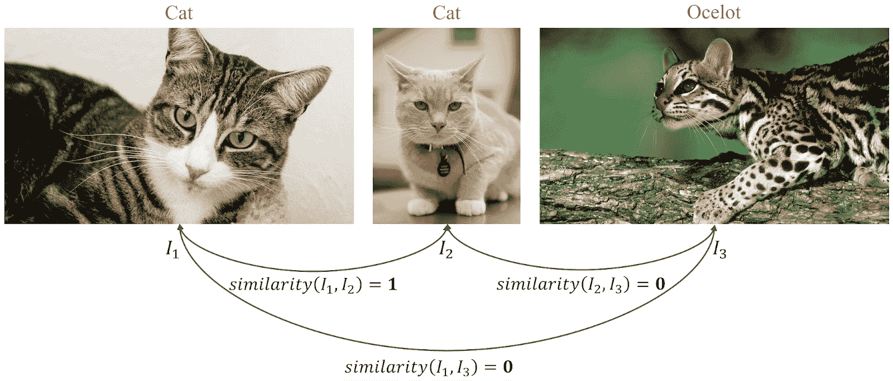

An ideal scenario for a similarity measure in Few-Shot Learning. Image by the author

例如，在下图中，当比较两张猫的图像(I1 和 I2)时，完美的相似性函数应该输出值 1.0。对于另外两种情况，猫的图像与豹猫的图像进行比较，相似性输出应该是 0.0。然而，这是一个理想的场景。实际上，I1 和 I2 的值可能是 0.95，其他两种情况下可能是一个大于 0 的小值(如 0.02 和 0.03)。

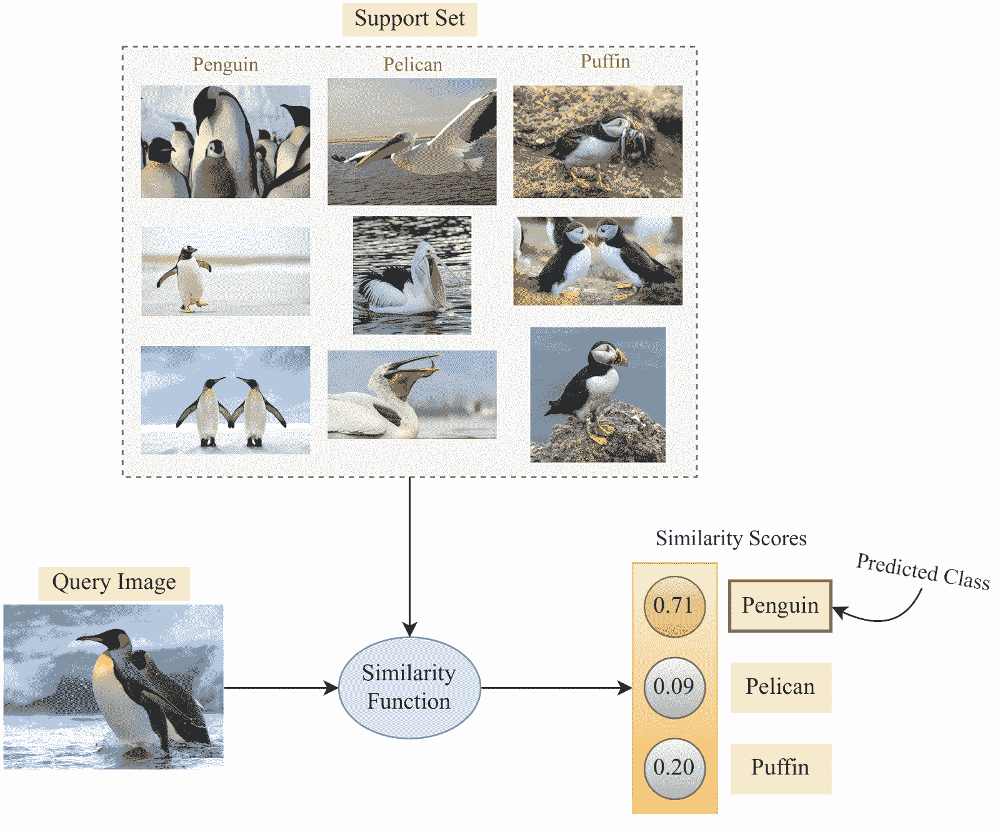

Overview of how a Few-Shot model makes a prediction. Image by the author

现在，我们使用大规模标记数据集来训练这样一个相似度函数的参数。用于以受监督的方式预训练深度模型的训练集可以用于此目的。一旦训练了相似性函数的参数，就可以在少量学习阶段中使用它，以通过使用支持集信息来确定查询集上的相似性概率。然后，对于每个查询集样本，具有来自支持集的最高相似性的类将通过少镜头模型被推断为类标签预测。上面举例说明了一个这样的例子。

### 暹罗网络

在少数镜头学习文献中，相似性函数根本不需要是“函数”。它们也可以，而且通常会是神经网络:其中一个最流行的例子是暹罗网络。这个名字来源于“连体双胞胎”身体相连的事实。不像传统的神经网络有一个输入分支和一个输出分支，暹罗网络有**两个或三个输入分支**(基于训练方法)和一个输出分支。

有两种方法来训练暹罗网络，我们将在下面讨论:

#### **方法-1:成对相似度**

在这种方法中，给定一个连体网络的两个输入及其相应的标签(采用用于预训练特征提取器的训练集)。这里，首先，我们从数据集中随机选择一个样本(比如说，我们选择一只狗的图像)。然后，我们再次从数据集中随机选择一个样本。如果第二个样本与第一个样本属于同一类，也就是说，如果第二个图像也是一只狗，那么我们将标签“1.0”指定为暹罗网络的基础事实。对于所有其他类别，标签“0.0”被指定为基本事实。

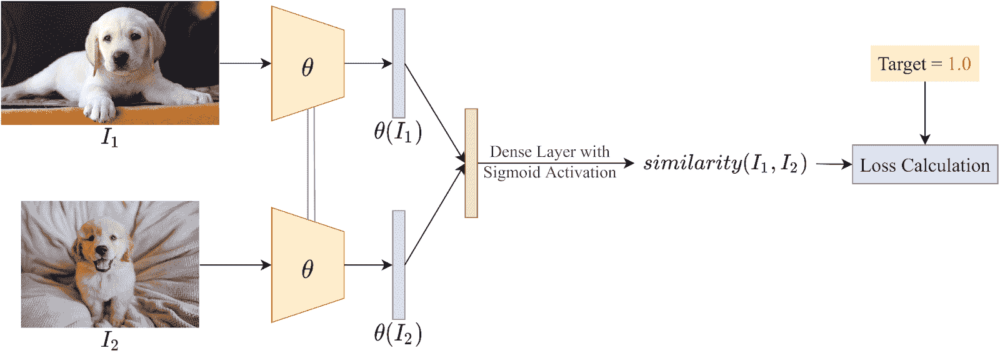

Overview of Learning Pairwise Similarity in Siamese Networks. Image by the author

因此，这个网络本质上通过标记的例子学习相似性匹配标准。上面已经用一个例子说明了这一点。图像首先分别通过相同的预先训练的特征提取器(典型地，卷积神经网络)以获得它们相应的表示。然后，两个获得的表示被连接并通过密集层和 sigmoid 激活函数以获得相似性得分。我们已经知道样本是否属于同一个类别，因此该信息被用作计算损失和计算反向传播的基本事实相似性得分。

在 Python3 中，两个样本之间的余弦相似性可以使用以下公式计算:

```py
import torch
import torch.nn as nn

input1 = torch.randn(100, 128)
input2 = torch.randn(100, 128)
cos = nn.CosineSimilarity(dim=1, eps=1e-6)
output = cos(input1, input2)
```

为了获得图像和关于它们是否属于同一个类的相应信息，需要在 Python3 中实现以下自定义数据集:

```py
import random
from PIL import Image
import torchvision
import torchvision.datasets as datasets
import torchvision.transforms as transforms
from torch.utils.data import DataLoader, Dataset
import torchvision.utils
import torch
import torch.nn as nn

class SiameseDataset(Dataset):
    def __init__(self,folder,transform=None):
        self.folder = folder        #type: torchvision.datasets.ImageFolder
        self.transform = transform  #type: torchvision.transforms

    def __getitem__(self,index):
        #Random image set as anchor
        image0_tuple = random.choice(self.folder.imgs)

        random_val = random.randint(0,1) 
        if random_val: #If random_val = 1, output a positive class sample
            while True:
                #Find "positive" Image
                image1_tuple = random.choice(self.folder.imgs) 
                if image0_tuple[1] == image1_tuple[1]:
                    break
        else: #If random_val = 0, output a negative class sample
            while True:
                #Find "negative" Image
                image1_tuple = random.choice(self.folder.imgs) 
                if image0_tuple[1] != image1_tuple[1]:
                    break

        image0 = Image.open(image0_tuple[0])
        image1 = Image.open(image1_tuple[0])

        image0 = image0.convert("L")
        image1 = image1.convert("L")

        if self.transform is not None:
            image0 = self.transform(image0)
            image1 = self.transform(image1)

        #Return the two images along with the information of whether they belong to the same class
        return image0, image1, int(random_val)

    def __len__(self):
        return len(self.folder.imgs)
```

#### **方法-2:三重态丢失**

这种方法基于“三重损失”标准，可视为方法 1 的扩展，尽管这里使用的训练策略不同。首先，我们从数据集(训练集)中随机选择一个数据样本，我们称之为“锚”样本。接下来，我们选择另外两个数据样本——一个来自与锚样本相同的类——称为“正”样本，另一个来自与锚不同的类——称为“负”样本。

一旦这三个样本被选择，它们通过相同的神经网络以获得它们在嵌入空间中的相应表示。然后，我们计算锚和正样本表示之间的 L2 归一化距离(姑且称之为“d+”)以及锚和负样本嵌入之间的 L2 归一化距离(姑且称之为“d-”)。这些参数允许我们定义需要最小化的损失函数，如下图所示。

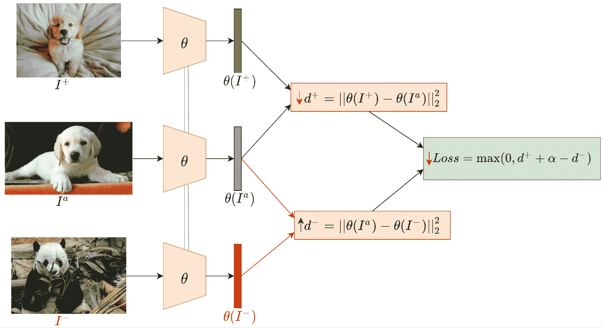

Overview of the Triplet Loss method of Siamese Network Training. Image by the author

这里，“> 0”是防止 max 函数的两项不相等的余量。这里的目的是在嵌入空间中尽可能远地推送锚样本和负样本的表示，同时尽可能近地拉取锚样本和负样本的表示，如下所示。

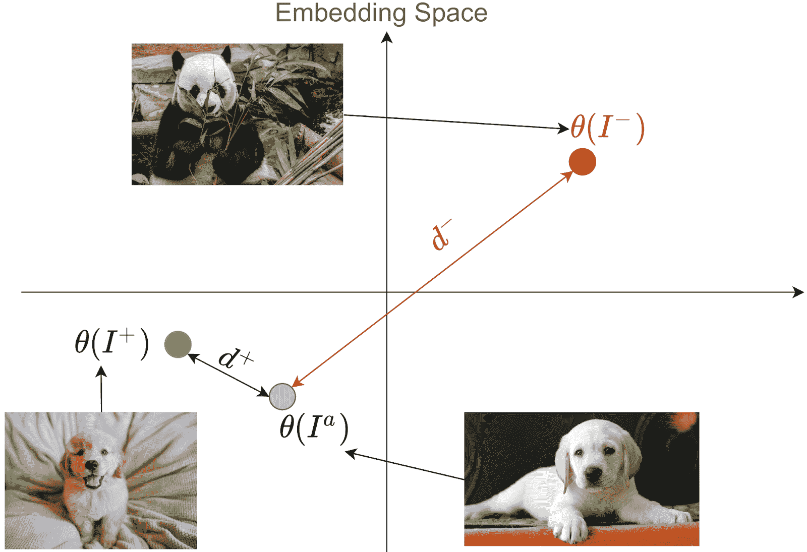

Example of how representations of data samples in the embedding space are aligned. Image by the author

使用 PyTorch，可以非常容易地实现三重态损失，如下所示(使用随机锚、正样本和负样本的示例):

```py
import torch
import torch.nn as nn

triplet_loss = nn.TripletMarginLoss(margin=1.0, p=2)
anchor = torch.randn(100, 128, requires_grad=True)
positive = torch.randn(100, 128, requires_grad=True)
negative = torch.randn(100, 128, requires_grad=True)
output = triplet_loss(anchor, positive, negative)
output.backward()
```

要使用 PyTorch 从影像数据集中生成锚定样本、阳性样本和阴性样本，需要编写以下自定义数据集类:

```py
import random
from PIL import Image
import torchvision
import torchvision.datasets as datasets
import torchvision.transforms as transforms
from torch.utils.data import DataLoader, Dataset
import torchvision.utils
import torch
import torch.nn as nn

class SiameseDataset(Dataset):
    def __init__(self,folder,transform=None):
        self.folder = folder        #type: torchvision.datasets.ImageFolder
        self.transform = transform  #type: torchvision.transforms

    def __getitem__(self,index):
        #Random image set as anchor
        anchor_tuple = random.choice(self.folder.imgs)

        while True:
            #Find "positive" Image
            positive_tuple = random.choice(self.folder.imgs) 
            if anchor_tuple[1] == positive_tuple[1]:
                break

        while True:
            #Find "negative" Image
            negative_tuple = random.choice(self.folder.imgs) 
            if anchor_tuple[1] != negative_tuple[1]:
                break

        anchor = Image.open(anchor_tuple[0])
        positive = Image.open(positive_tuple[0])
        negative = Image.open(negative_tuple[0])

        anchor = anchor.convert("L")
        positive = positive.convert("L")
        negative = negative.convert("L")

        if self.transform is not None:
            anchor = self.transform(anchor)
            positive = self.transform(positive)
            negative = self.transform(negative)

        return anchor, positive, negative

    def __len__(self):
        return len(self.folder.imgs)
```

上面的代码可以很容易地在渐变中实现。只需打开一个笔记本，在“高级选项”的“工作区 URL”字段中填入以下 URL:

[GitHub - gradient-ai/few-shot-learningContribute to gradient-ai/few-shot-learning development by creating an account on GitHub.GitHubgradient-ai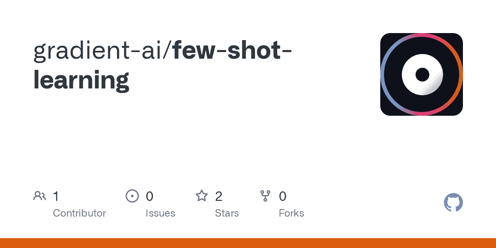](https://github.com/gradient-ai/few-shot-learning)

## 少镜头学习方法

一次性学习方法可以大致分为四类，我们接下来将讨论这四类:

### 数据级

数据级 FSL 方法有一个简单的概念。如果 FSL 模型训练由于缺乏训练数据而受阻(并且为了防止过拟合或欠拟合),可以添加更多的数据——这些数据可能是结构化的，也可能不是结构化的。也就是说，假设我们在支持集中每个类有两个标记样本，这可能不够，所以我们可以尝试使用各种技术来增加样本。

尽管数据扩充本身并不能提供全新的信息，但它仍然有助于 FSL 训练。另一种方法可以是将未标记的数据添加到支持集，使得 FSL 问题是半监督的。FSL 模型甚至可以使用非结构化数据来收集更多信息，这已被证明可以提高少量拍摄的性能。

其他方法也旨在使用生成网络(如 GAN 模型)从现有的数据分布中合成全新的数据。然而，对于基于 GAN 的方法，需要大量的标记训练数据来训练模型的参数，然后才能使用少量的支持集样本来生成新的样本。

### 参数级

在 FSL，样品是有限的；因此，过拟合是常见的，因为样本具有广泛的高维空间。参数级 FSL 方法涉及元学习的使用，元学习控制模型参数的利用，以智能地推断哪些特征对于手头的任务是重要的。

约束参数空间并使用正则化技术的 FSL 方法属于参数级方法的范畴。模型被训练以在参数空间中找到最佳路线，从而提供目标预测。

### 公制级别

度量级 FSL 方法旨在学习数据点之间的距离函数。从图像中提取特征，并且在嵌入空间中计算图像之间的距离。该距离函数可以是欧几里德距离、推土机距离、基于余弦相似性的距离等。这是我们在讨论暹罗网络时讨论过的内容。

这些方法使得距离函数能够使用已经用于训练特征提取器模型的训练集数据来调整其参数。然后，距离函数将基于支持集和查询集之间的相似性得分(样本在嵌入空间中有多接近)进行推断。

### 基于梯度的元学习

基于梯度的元学习方法使用两个学习者——教师模型(基础学习者)和使用知识提炼的学生模型(元学习者)。教师模型通过高维参数空间引导学生模型。

使用来自支持集的信息，教师模型首先被训练来对查询集样本进行预测。从教师模型导出的分类损失然后被用于训练学生模型，使其精通分类任务。

## 一次性学习

正如到目前为止的讨论所建议的，一次学习是这样一个任务，其中支持集只由每个类的一个数据样本组成。你可以想象在支持信息较少的情况下，任务会更加复杂。现代智能手机中使用的人脸识别技术使用一次性学习。

一个这样的例子是 Shaban 等人在这篇[论文](http://www.bmva.org/bmvc/2017/papers/paper167/paper167.pdf)中探索的一次性语义分割方法。作者提出了一种新的两个分支的方法，其中第一个分支将标记的图像作为输入，并产生一个参数向量作为输出。第二个分支将这些参数以及新图像作为输入，并为新类别产生图像的分割掩模作为输出。他们的架构图如下所示。

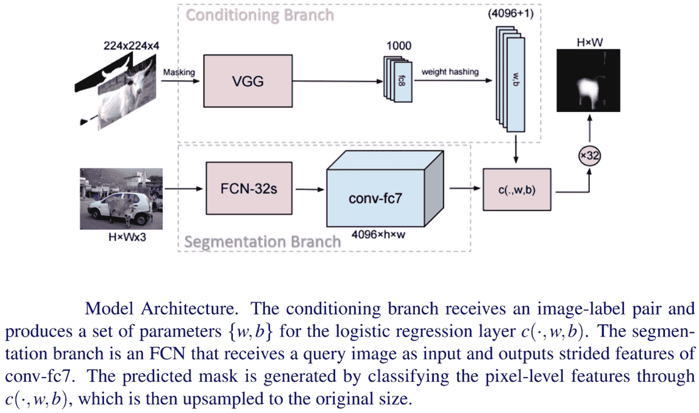

Source: [Paper](http://www.bmva.org/bmvc/2017/papers/paper167/paper167.pdf)

与单次学习的微调方法不同，单次学习可能需要多次迭代来学习分割网络的参数，该网络的第一个分支在单次正向传递中计算参数。这具有几个优点:1)单次正向传递使得所提出的方法快速；2)一次性学习的方法是完全可微分的，允许分支与网络的分段分支联合训练；3)最后，参数的个数与图像的大小无关，所以一次法在缩放方面没有问题。

## 少镜头学习的应用

在深度学习文献中，少镜头学习已经广泛用于多个领域，从图像分类和对象检测等计算机视觉任务到遥感、自然语言处理等。让我们在本节中简要讨论一下它们。

### **图像分类**

少数镜头学习已广泛用于图像分类，其中一些例子，我们已经探讨。

张等人在他们的[论文](https://openaccess.thecvf.com/content_CVPR_2020/papers/Zhang_DeepEMD_Few-Shot_Image_Classification_With_Differentiable_Earth_Movers_Distance_and_CVPR_2020_paper.pdf)中提出了一种有趣的少镜头图像分类方法。比较两个复杂结构化表示的自然方法是比较它们的构建块。困难在于我们没有他们相应的培训监督，而且不是所有的建筑构件都能在其他结构中找到它们的对应部分。为了解决上述问题，本文将少镜头分类形式化为最佳匹配的一个实例。作者建议使用两个结构之间的最佳匹配成本来表示它们的相似性。

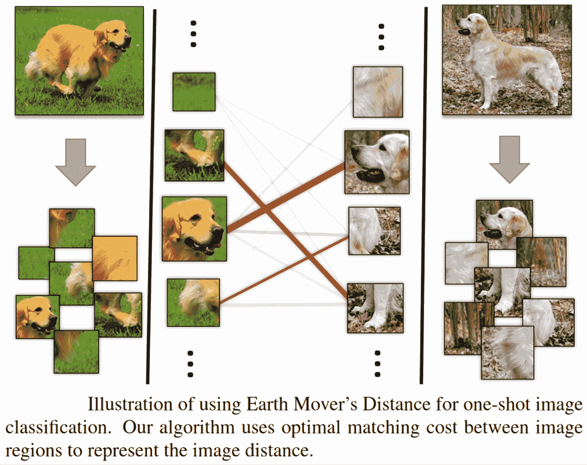

Source: [Paper](https://openaccess.thecvf.com/content_CVPR_2020/papers/Zhang_DeepEMD_Few-Shot_Image_Classification_With_Differentiable_Earth_Movers_Distance_and_CVPR_2020_paper.pdf)

给定两幅图像产生的特征表示，作者采用推土机距离(EMD)来计算它们的结构相似性。EMD 是计算结构表示之间距离的度量，最初是为图像检索提出的。给定所有元素对之间的距离，EMD 可以获得具有最小成本的两个结构之间的最佳匹配流。它也可以解释为用另一个重建结构表示的最小成本。

### **物体检测**

目标检测是在图像或视频序列中识别和定位目标的计算机视觉问题。单个图像可以包含多个对象。因此，它不同于简单的图像分类任务，其中整个图像被赋予一个类别标签。

这篇[论文](https://openaccess.thecvf.com/content_CVPR_2020/papers/Perez-Rua_Incremental_Few-Shot_Object_Detection_CVPR_2020_paper.pdf)提出了开放式中心网(ONCE)模型来解决增量少镜头检测目标检测的问题。作者采取了基于特征的知识转移策略，将之前名为 [CentreNet](https://arxiv.org/pdf/1904.07850.pdf%EF%BC%9B%E5%9B%9E%E5%BD%923%E4%B8%AA%E7%82%B9%EF%BC%8C%E5%B7%A6%E4%B8%8A%EF%BC%8C%E5%8F%B3%E4%B8%8B%EF%BC%8C%E4%B8%AD%E5%BF%83%E7%82%B9) 的模型分解为类通用和类专用组件，以实现增量式少量学习。更具体地说，ONCE 首先使用丰富的基类训练数据来训练类通用特征提取器。接下来是元学习，这是一个特定于类的代码生成器，具有模拟的少量学习任务。一旦被训练，给定新对象类的少量图像，元训练的类代码生成器优雅地使一次检测器能够在元测试阶段(新类注册)以有效的前馈方式递增地学习新类。

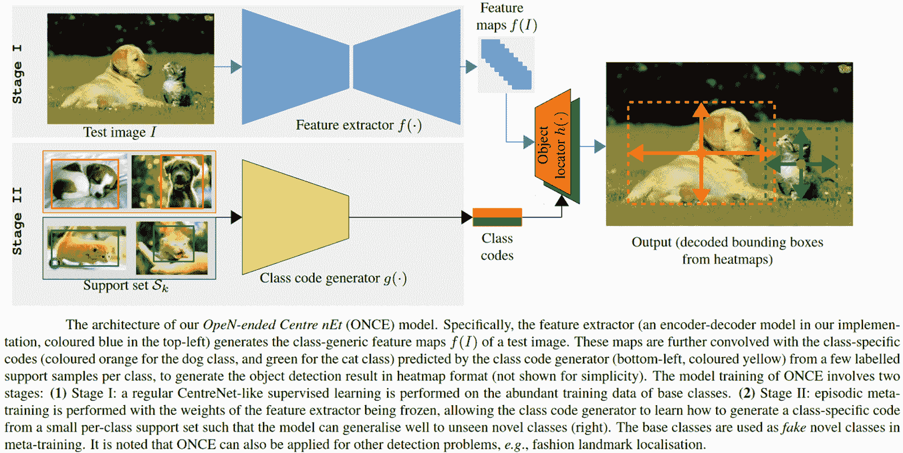

Source: [Paper](https://openaccess.thecvf.com/content_CVPR_2020/papers/Perez-Rua_Incremental_Few-Shot_Object_Detection_CVPR_2020_paper.pdf)

### **语义分割**

语义分割是一项任务，其中图像中的每个像素被分配一个类别——一个或多个对象，或者背景。在文献中，少镜头学习已经被用于执行二元和多标签语义分割。

刘等人在这篇[论文](https://arxiv.org/pdf/2007.06309.pdf)中提出了一个新颖的基于原型的半监督少镜头语义切分框架，其主要思想是在两个方向上丰富语义类的原型表示。首先，他们将常用的整体原型表示分解为一小组部分感知的原型，这些原型能够捕捉不同的细粒度对象特征，并在语义对象区域中产生更好的空间覆盖。此外，作者将一组未标记的图像合并到他们的支持集，以便可以从标记和未标记的数据源中学习零件感知原型。这使得它们能够超越受限的小支持集，并更好地模拟对象特征的类内变化。他们的模型概述如下所示。

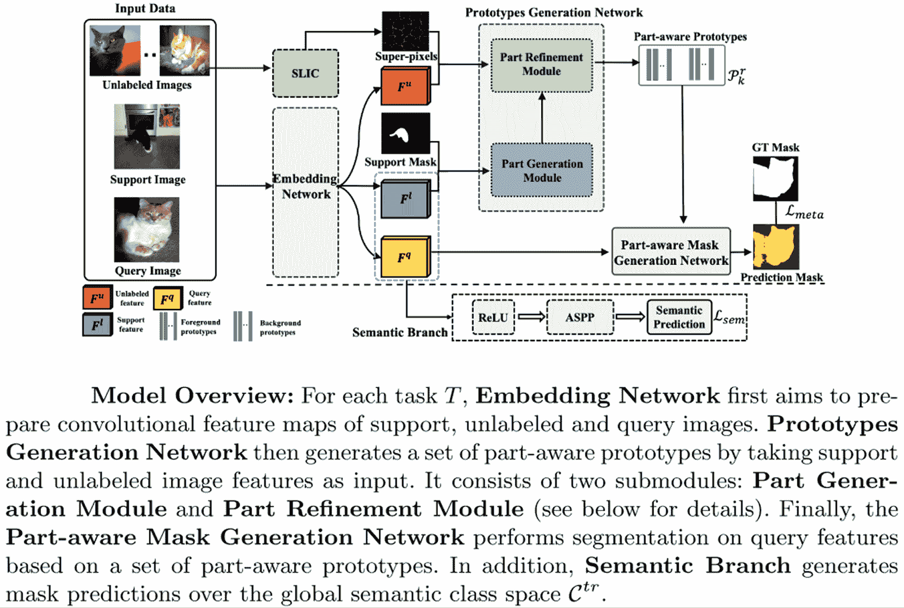

Source: [Paper](https://arxiv.org/pdf/2007.06309.pdf)

### **机器人技术**

机器人领域还使用了少量学习方法，使机器人能够模仿人类的能力，仅使用少量演示来概括任务。

为了减少学习中涉及的试验次数，吴等人在这篇[论文](https://spiral.imperial.ac.uk/bitstream/10044/1/12669/4/icra2010.pdf)中提出了一种算法来解决模仿中的“如何做”问题。作者介绍了一种通过模仿学习路径规划的新计算模型，该模型使用了计划适应中的基本思想——在演示和给定情境中存在不变的特征点——来为新场景生成运动路径。

### **自然语言处理**

少数镜头学习最近在自然语言处理任务中也变得流行，其中语言处理的标签本来就很难获得。

例如，Yu 等人在他们的[论文](https://arxiv.org/pdf/1805.07513.pdf)中，使用少数镜头学习，特别是度量学习方法来解决文本分类问题。他们的元学习者使用元训练任务上的任务聚类来选择和组合用于学习目标任务的多个度量。在元训练过程中，作者提出将元训练任务划分成簇，使得每个簇中的任务可能是相关的。

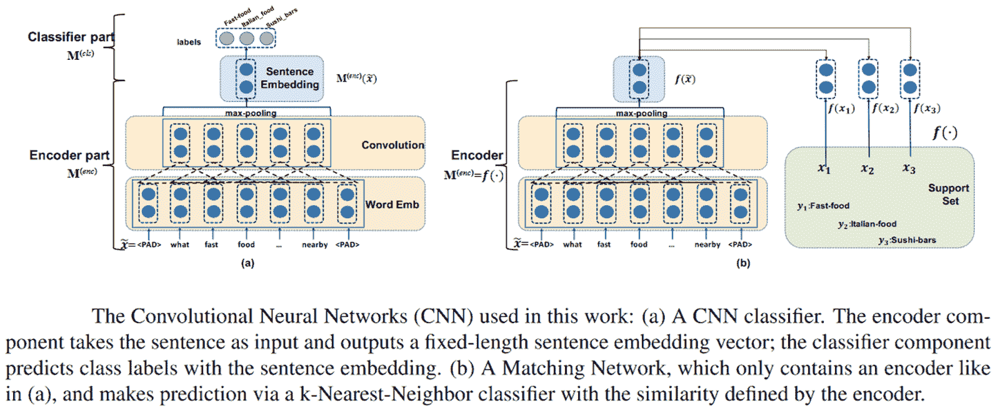

然后在每个聚类中，作者训练一个深度嵌入函数作为度量。这确保了公共指标只在同一个集群中的任务之间共享。此外，在元测试期间，每个目标 FSL 任务被分配给特定于任务的度量，该度量是由不同集群定义的度量的线性组合。通过这种方式，多样化的少数镜头任务可以从以前的学习经验中获得不同的度量。

## 结论

深度学习已经成为解决复杂的计算机视觉和模式识别任务的事实上的选择。然而，对大量标记训练数据的需求和训练深度架构所产生的计算成本阻碍了此类任务的进展。

少数镜头学习是这个问题的一个变通方法，允许预训练的深度模型扩展到新的数据，只有几个标记的例子，没有重新训练。由于其可靠的性能，像图像分类和分割、对象识别、自然语言处理等任务。看到了 FSL 建筑的使用的兴起。

对更好的 FSL 模型的研究仍在积极进行，以使它们与完全监督的学习方法一样准确，甚至更好。像一次性或零次学习这样明显更复杂的问题正在被广泛研究，以弥合人工智能和人类学习者之间的差距。