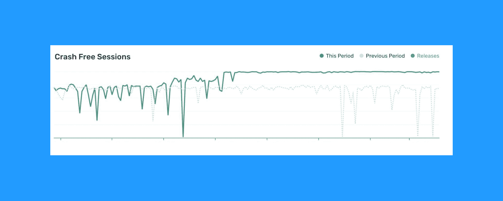

# 大规模的可靠性和性能

> 原文：<https://blog.paperspace.com/reliability-and-performance-at-scale/>

在过去几年中，纸张空间云已经大规模增长。我们现在支持 60 多万用户，为我们的用户提供近 1 亿小时的 GPU 计算服务。

随着我们的发展，我们遇到了一些扩展障碍。我们充分意识到停机和错误是不可接受的，尤其是当我们越来越多的用户群在生产中运行时。

我们已经在幕后进行了一些改进，以增强虚拟机运行状况检查和警报。我们看到错误率下降，内核和梯度的加速和减速持续时间更快，梯度笔记本的内核性能更好。在 Paperspace 控制台中，我们已经超过了 99.85%的持续无崩溃会话率，而且这一趋势还在继续。

Console data from May 2022

我们正夜以继日地努力正面解决剩余的可靠性和性能问题。在接下来的几个月里，在大大小小的问题上，期待着有影响的变化。我们将在硬件和软件方面进行改进，包括重新编写计费引擎，这是我们一段时间以来一直困扰的问题。

在接下来的几个版本中，我们将继续在幕后进行这些改进。感谢您的支持，我们正在扩展世界上最好的云来加速计算。

💜PS 工程