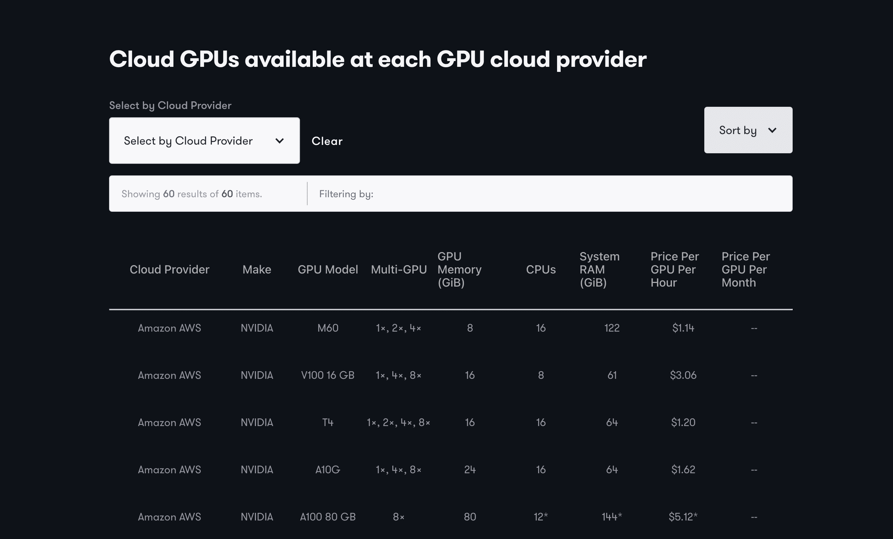

# GPU 云提供商终极指南简介

> 原文：<https://blog.paperspace.com/introducing-the-ultimate-guide-to-gpu-cloud-providers/>

我们长期以来一直对 GPU 云提供商让识别和比较 GPU 硬件变得如此困难感到沮丧。

事实上，GPU 云提供商提供不同形状和大小的 GPU 实例，对附加组件的定义也不同，这加剧了这种挫折感。根据供应商的不同，我们可能会发现自己需要考虑添加 CPU 实例(如 Google Cloud)、添加内存、添加存储等的隐藏成本。

当比较不同的供应商时，这个过程变得非常复杂。当单元完全不同时，我们如何比较实例和产品？这需要一点努力。

为了给 GPU 云提供商的世界带来透明度，我们创建了[云 GPU 提供商终极指南](https://www.paperspace.com/gpu-cloud-comparison)。

主要目标是为 GPU 云客户提供资源，以比较和对比最受欢迎的 GPU 云提供商的产品。

Cloud GPU provider comparison by price

我们的方法如下:

*   关注每种产品的底层 GPU 规格，而不是营销
*   将所有实例标准化为每 GPU 每单位时间的价格
*   只考虑有保证的 GPU 资源，而不是可抢占的产品
*   仅考虑专用 GPU 资源，而非部分产品
*   避免“双边市场”的 GPU 产品
*   比较每小时和每月的定价选项
*   不要考虑存储、网络性能或入口/出口

这些是我们纳入的 GPU 云提供商。此外，每个供应商都有一个图纸空间比较页面，链接如下。

*   里诺德
*   [AWS EC2](https://www.paperspace.com/cloud-providers/amazon-aws-alternative-gpu-cloud)
*   [CoreWeave](https://www.paperspace.com/cloud-providers/coreweave-alternative-gpu-cloud)
*   [谷歌云计算引擎](https://www.paperspace.com/cloud-providers/google-gcp-alternative-gpu-cloud)
*   贾维斯实验室
*   [λ实验室](https://www.paperspace.com/cloud-providers/lambda-labs-alternative-gpu-cloud)
*   [微软 Azure](https://www.paperspace.com/cloud-providers/microsoft-azure-alternative-gpu-cloud)
*   [OVH](https://www.paperspace.com/cloud-providers/ovh-cloud-alternative-gpu-cloud)
*   [Vultr](https://www.paperspace.com/cloud-providers/vultr-alternative-gpu-cloud)

尽情享受吧！我们希望本指南为比较不同云提供商的 GPU 实例提供有用的资源。