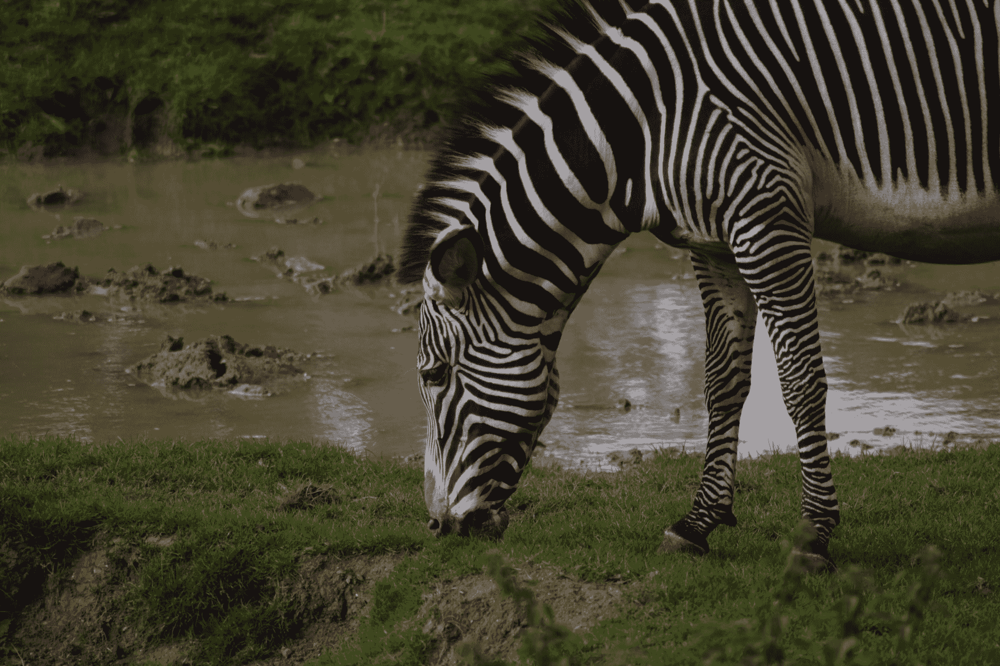
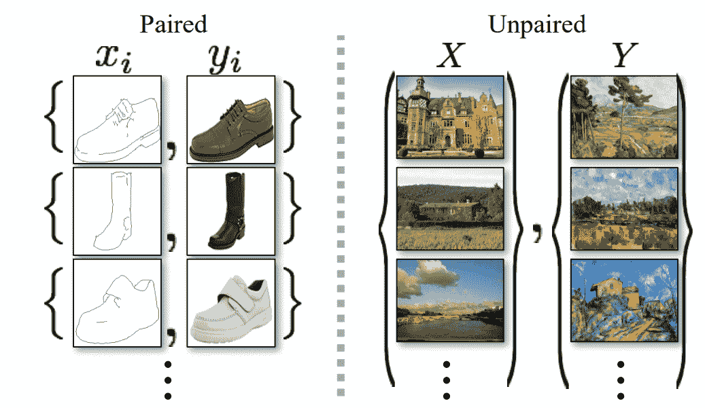
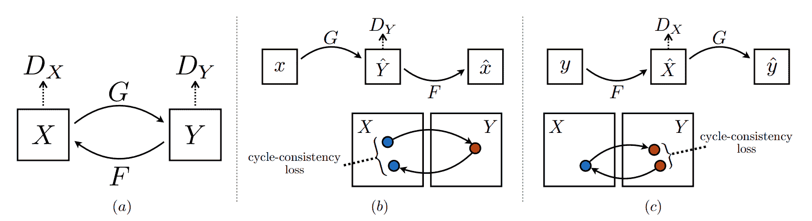
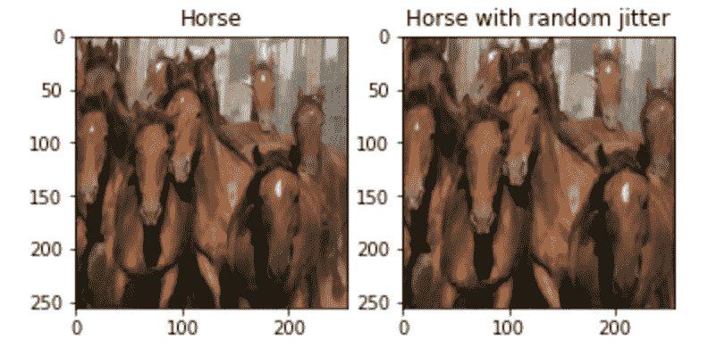
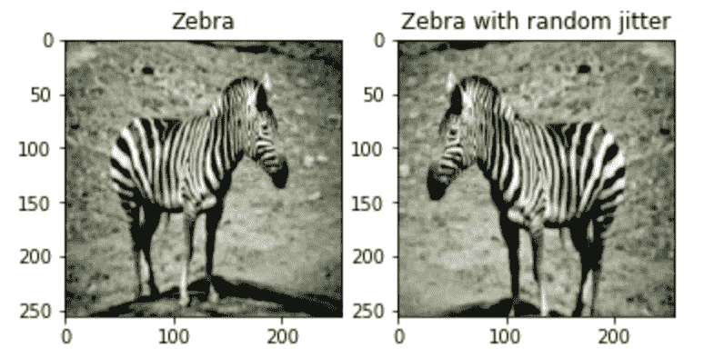
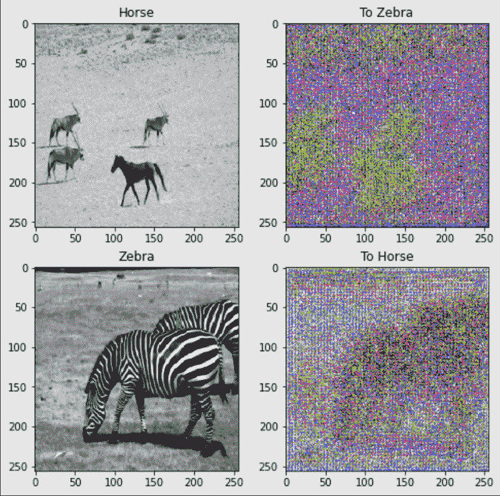
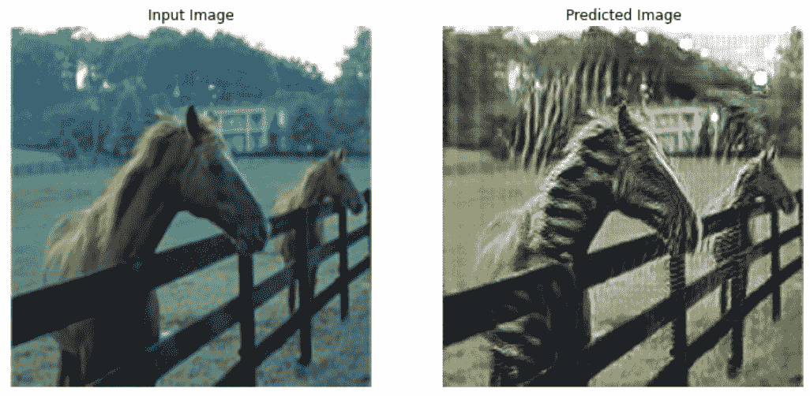
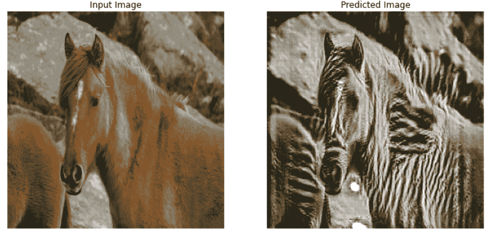
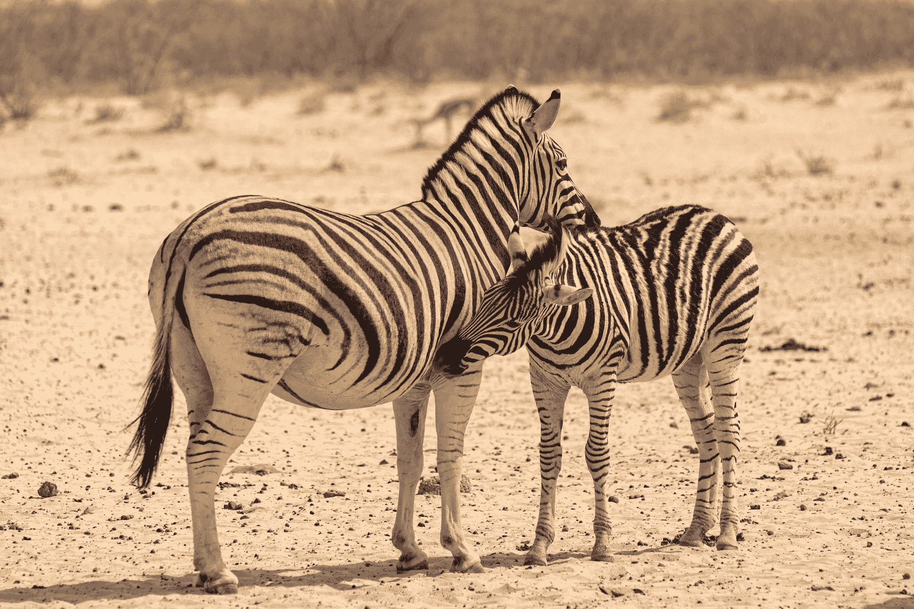

# 具有循环 gan 的不成对的图像到图像转换

> 原文：<https://blog.paperspace.com/unpaired-image-to-image-translations-with-cycle-gans/>



Photo by [Tom Copus](https://unsplash.com/@tomcopus?utm_source=ghost&utm_medium=referral&utm_campaign=api-credit) / [Unsplash](https://unsplash.com/?utm_source=ghost&utm_medium=referral&utm_campaign=api-credit)

深度学习在几十年前被引入时没有腾飞的主要原因之一是缺乏数据。神经网络本质上需要巨大的处理能力和大数据才能在实践中真正利用。在当今时代，随着设备越来越现代化，存储大量数据不再是问题。还可以使用计算机视觉或自然语言处理的现代工具来创建和提炼可用数据。大多数深度学习模型利用成对的例子，其中源图像直接链接到其目标图像。然而，一个重要的问题出现了。什么类型的深度学习最适合解决彼此之间很少或没有包含数据的链接的任务？

在我们之前的文章中，我们已经探讨了条件性 gan 及其在成功训练后相对容易地执行复杂的图像到图像翻译任务的能力。我们已经介绍了[条件 gan](https://blog.paperspace.com/conditional-generative-adversarial-networks/)(cgan)和这些条件 gan 在[pix 2 pix gan](https://blog.paperspace.com/pix2pix-gan/)中的变体。为了快速回顾我们以前关于 pix2pix 的 GAN 文章，我们重点关注执行卫星图像到地图的图像到图像翻译。在本文中，我们将关注循环一致对抗网络(循环 gan)中条件 gan 的另一种变体，并开发一个不成对的图像到图像翻译项目。

通过使用[后续链接报告](https://github.com/gradient-ai/Cycle_GANs)作为“工作区 URL”来创建 Paperspace Gradient 笔记本，可以利用 Paperspace Gradient 平台来运行以下项目通过切换笔记本创建页面上的高级选项按钮，可以找到该字段。

## 简介:



Image Source

当我们有了特定的条件和将一个图像链接到其相应对应物的数据元素的适当配对时，就更容易训练这样的条件 gan。Pix2Pix GANs 就是我们处理成对图像的一个例子。成对图像是源图像与其对应的目标图像相链接的图像。在成对的图像数据集中，我们有源图像和目标图像的清晰映射，这是相应提供的。然而，这样的数据在现实世界中很难获得。

另一方面，不成对的数据相对来说更容易获得，而且大量存在。在不成对的数据集中，不直接提供源图像和它们对应的目标图像。解决与不成对数据集相关的项目或任务的主要方法之一是利用循环一致的对抗网络(循环 gan)。在大多数情况下，Cycle GANs 为用户提供了实现令人信服的结果的有效方法。在这篇[研究论文](https://arxiv.org/pdf/1703.10593.pdf)中，详细描述了该网络的大部分主要目标和成就。

循环 GAN 网络能够从不成对的例子中学习从图像源$X$到$Y$的映射，使得所产生的图像具有高质量。本文还引入了一个额外的循环损失，以证实生成图像的逆映射再次再现了源图像。让我们在本文的下一节中进一步理解工作过程和实现细节。

* * *

## 了解循环甘纳:



[Image Source](https://arxiv.org/pdf/1703.10593.pdf)

在本节中，我们将了解 Cycle GANs 的详细工作说明。在引言中，我们委婉地承认循环 gan 的应用主要用于不成对的图像到图像的翻译，这与其他条件 gan 相反，例如 pix2pix GANs。让我们试着理解这些网络的工作过程和基本概念，并清楚地了解发生器和鉴别器的结构。

在上图中，让我们考虑带有生成器$G$和$F$以及鉴别器$Dx$和$Dy$的第一个子部分。$X$表示输入图像，而$Y$表示生成的图像。与大多数使用单个发生器和鉴别器的 GAN 网络不同，循环 GAN 网络使用两个发生器和鉴别器。生成器$G$处理输入$X$以生成图像$Y$。鉴别器$Dy$鉴别生成的图像是真的还是假的。类似地，生成器$F$在考虑输入$Y$的情况下生成图像$X$。鉴别器$Dx$鉴别这个生成的图像是真的还是假的。

除了有一个双生成器和鉴别器设置之外，我们还有一个周期一致性损失来帮助模型获得更直观的理解。如果模型在一个源图像上被训练以产生生成的图像，则循环一致性损失确保当生成的图像被再次转换回原始域时，我们应该能够再次近似地检索原始源图像。

在上图中，我们可以注意到前向周期一致性丢失和后向周期一致性丢失在各自的子图中。以下是针对循环 GAN 网络的所有损失函数的最终等式。在这个项目中，我们还使用了额外的身份丢失，这在大多数情况下可能并不需要。

$$L(G，F，DX，DY ) = LGAN(G，DY，X，Y ) + LGAN(F，DX，Y，X) + λLcyc(G，F)$$

既然我们已经理解了这些循环 GAN 网络的工作过程，我们还可以简单地讨论实现发生器和鉴别器网络背后的细节。生成器架构由三个卷积层组成，具有不同的滤波器、内核大小和步长。在三个卷积层之后，我们有剩余的块。网络可以包含六个或九个剩余块。

在残差块的末尾，我们利用几个上采样层(或卷积转置层)和最终的卷积层，得到生成器所需的图像大小。在鉴频器架构中，我们有一个简单的 70 x 70 贴片 GAN 网络，它包含四个滤波器尺寸递增的卷积层。在这些网络中，实例规范化优于批量规范化以及泄漏 ReLU 激活函数。当我们从头开始构建这些模型时，我们将进一步讨论架构细节。

* * *

## 使用循环 GANS 开发不成对图像到图像的翻译；

在本文的这一部分，我们将在 Cycle GANs 的帮助下重点开发不成对的图像到图像翻译项目。现在我们已经对这些循环一致的对抗网络的基本工作过程有了一个简单的了解，我们可以建立一个整体架构来处理和计算所需的任务。我们将利用 TensorFlow 和 Keras 深度学习框架来构建这些网络。如果读者不熟悉这些库，我建议查看我以前的几篇文章，以便更熟悉这些主题。你可以查看下面的[文章](https://blog.paperspace.com/absolute-guide-to-tensorflow/)来了解更多关于 TensorFlow 和 Keras 文章[这里](https://blog.paperspace.com/the-absolute-guide-to-keras/)。一旦完成，我们就可以开始导入必要的库了。

### 导入基本库:

如前所述，与之前的 pix2pix GAN 架构相比，主要变化之一是在批量标准化层上使用了实例标准化层。由于没有办法通过现有的 Keras API 直接调用实例规范化层，我们将继续安装一个额外的需求。我们将安装 Keras-Contrib 存储库，这将允许我们直接利用这些必要的层，而无需经历太多的麻烦。

```py
pip install git+https://www.github.com/keras-team/keras-contrib.git 
```

一旦我们完成了项目的先决条件要求的安装，我们就可以导入我们将用于构建 Cycle GAN 架构的所有基本库，并相应地训练模型以获得所需的结果。如前所述，我们将使用 TensorFlow 和 Keras 深度学习框架来构建网络。我们将使用功能性 API 模型类型，而不是顺序模型，以便更好地控制网络设计。我们还将使用 TensorFlow 数据集库中可用的数据集。其他必要的导入包括用于可视化的 matplotlib 和用于处理与本地操作系统相关的任务的 OS。以下是所有必需进口的清单。

```py
import tensorflow as tf
from tensorflow.keras.optimizers import Adam
from tensorflow.keras.initializers import RandomNormal
from tensorflow.keras.models import Model
from tensorflow.keras.layers import Input, Conv2D, LeakyReLU, Conv2DTranspose
from tensorflow.keras.layers import Activation, Concatenate, BatchNormalization
from keras_contrib.layers.normalization.instancenormalization import InstanceNormalization
from tensorflow.keras.utils import plot_model
import tensorflow_datasets as tfds

import matplotlib.pyplot as plt
from IPython.display import clear_output
import time
import os

AUTOTUNE = tf.data.AUTOTUNE
```

### 获取和准备数据集:

在这一步中，我们将获得数据集，我们将为其执行图像转换。我们利用 TensorFlow 数据集库，通过它我们可以检索所有相关信息。该数据集包含马和斑马的图像。为了获得 Cycle GAN 项目的类似数据集，我建议查看以下[链接](https://people.eecs.berkeley.edu/~taesung_park/CycleGAN/datasets/)。下面是将数据集加载到它们各自的训练和测试变量中的代码片段。

```py
dataset, metadata = tfds.load('cycle_gan/horse2zebra',
                              with_info=True, as_supervised=True)

train_horses, train_zebras = dataset['trainA'], dataset['trainB']
test_horses, test_zebras = dataset['testA'], dataset['testB']
```

一旦我们检索到数据集，我们就可以继续定义一些基本参数，我们将利用这些参数来准备数据集。

```py
BUFFER_SIZE = 1000
BATCH_SIZE = 1
IMG_WIDTH = 256
IMG_HEIGHT = 256
```

在下一个代码块中，我们将为数据集准备定义一些基本函数。我们将执行数据集的规范化，以避免额外的内存使用，并使用相对较少的资源解决该任务。正如研究论文中所建议的，我们还将抖动和镜像应用于现有的可用数据，以避免过度拟合。这种增强技术通常非常有用。在这一步中，我们将图像的大小调整为 286 x 286，然后将其裁剪回所需的 256 x 256 大小，并从左向右水平翻转图像。下面是执行以下操作的代码块。

```py
def random_crop(image):
    cropped_image = tf.image.random_crop(
      image, size=[IMG_HEIGHT, IMG_WIDTH, 3])

    return cropped_image

# normalizing the images to [-1, 1]
def normalize(image):
    image = tf.cast(image, tf.float32)
    image = (image / 127.5) - 1
    return image

def random_jitter(image):
    # resizing to 286 x 286 x 3
    image = tf.image.resize(image, [286, 286],
                          method=tf.image.ResizeMethod.NEAREST_NEIGHBOR)

    # randomly cropping to 256 x 256 x 3
    image = random_crop(image)

    # random mirroring
    image = tf.image.random_flip_left_right(image)

    return image

def preprocess_image_train(image, label):
    image = random_jitter(image)
    image = normalize(image)
    return image

def preprocess_image_test(image, label):
    image = normalize(image)
    return image
```

最后，我们将把所有这些数据元素计算成一个最终数据集。我们将使用随机洗牌和预定义的批量大小来映射数据，通过这些数据可以访问所有组件。我们将为马和斑马图像的所有训练元素和测试元素定义数据集，如下面的代码片段所示。

```py
train_horses = train_horses.cache().map(
    preprocess_image_train, num_parallel_calls=AUTOTUNE).shuffle(
    BUFFER_SIZE).batch(BATCH_SIZE)

train_zebras = train_zebras.cache().map(
    preprocess_image_train, num_parallel_calls=AUTOTUNE).shuffle(
    BUFFER_SIZE).batch(BATCH_SIZE)

test_horses = test_horses.map(
    preprocess_image_test, num_parallel_calls=AUTOTUNE).cache().shuffle(
    BUFFER_SIZE).batch(BATCH_SIZE)

test_zebras = test_zebras.map(
    preprocess_image_test, num_parallel_calls=AUTOTUNE).cache().shuffle(
    BUFFER_SIZE).batch(BATCH_SIZE)

sample_horse = next(iter(train_horses))
sample_zebra = next(iter(train_zebras))
```

下面是一些样本图像，其数据集包含原始图像及其带有一些随机抖动的对应图像。



Sample Image for Horse with random jitter



Sample Image for Zebra with random jitter

一旦我们完成了获取和准备数据集所需的所有步骤，我们就可以开始创建鉴频器和发生器网络，以构建整体循环 GAN 架构。

### 定义鉴别器架构:

对于鉴别器架构，我们有四个卷积块，定义如下- $C64-C128-C256-C512$。使用α(斜率)值为 0.2 的泄漏 ReLU 激活函数。除了第一个卷积块之外，所有其他块都在卷积层之后立即使用实例归一化。步幅和内核大小如下面的代码片段所示。我们将最终编译具有均方误差损失函数和 Adam 优化器的模型，以完成贴片 GAN 鉴别器型网络。

```py
# define the discriminator model
def define_discriminator(image_shape):
    # weight initialization
    init = RandomNormal(stddev=0.02)
    # source image input
    in_image = Input(shape=image_shape)
    # C64
    d = Conv2D(64, (4,4), strides=(2,2), padding='same', kernel_initializer=init)(in_image)
    d = LeakyReLU(alpha=0.2)(d)
    # C128
    d = Conv2D(128, (4,4), strides=(2,2), padding='same', kernel_initializer=init)(d)
    d = InstanceNormalization(axis=-1)(d)
    d = LeakyReLU(alpha=0.2)(d)
    # C256
    d = Conv2D(256, (4,4), strides=(2,2), padding='same', kernel_initializer=init)(d)
    d = InstanceNormalization(axis=-1)(d)
    d = LeakyReLU(alpha=0.2)(d)
    # C512
    d = Conv2D(512, (4,4), strides=(2,2), padding='same', kernel_initializer=init)(d)
    d = InstanceNormalization(axis=-1)(d)
    d = LeakyReLU(alpha=0.2)(d)
    # second last output layer
    d = Conv2D(512, (4,4), padding='same', kernel_initializer=init)(d)
    d = InstanceNormalization(axis=-1)(d)
    d = LeakyReLU(alpha=0.2)(d)
    # patch output
    patch_out = Conv2D(1, (4,4), padding='same', kernel_initializer=init)(d)
    # define model
    model = Model(in_image, patch_out)
    # compile model
    model.compile(loss='mse', optimizer=Adam(learning_rate=0.0002, beta_1=0.5), loss_weights=[0.5])
    return model

# define image shape
image_shape = (256,256,3)

# create the model
model = define_discriminator(image_shape)

# summarize the model
model.summary()
```

### 定义发电机架构:

生成器架构包括一个卷积块，具有 64 个滤波器和步长为 2 的 7 x 7 内核大小，其后是两个步长为 1 的 3 x 3 内核大小的卷积层，分别具有 128 和 256 个滤波器。然后我们将定义残差块，它只不过是一堆卷积层。这个残差块之后是由卷积 2D 转置层定义的几个上采样层。最终的卷积层包含 7×7 的内核大小，步长为 1 和 3 个滤波器。

9 个残差块的生成器架构定义如下:＄c7s 1-64，d128，d256，R256，R256，R256，R256，R256，R256，R256，R256，R256，R256，u128，u64，c7s 1-3＄个

```py
# generator a resnet block
def resnet_block(n_filters, input_layer):
    # weight initialization
    init = RandomNormal(stddev=0.02)
    # first layer convolutional layer
    g = Conv2D(n_filters, (3,3), padding='same', kernel_initializer=init)(input_layer)
    g = InstanceNormalization(axis=-1)(g)
    g = Activation('relu')(g)
    # second convolutional layer
    g = Conv2D(n_filters, (3,3), padding='same', kernel_initializer=init)(g)
    g = InstanceNormalization(axis=-1)(g)
    # concatenate merge channel-wise with input layer
    g = Concatenate()([g, input_layer])
    return g

# define the standalone generator model
def define_generator(image_shape=(256, 256, 3), n_resnet=9):
    # weight initialization
    init = RandomNormal(stddev=0.02)
    # image input
    in_image = Input(shape=image_shape)
    # c7s1-64
    g = Conv2D(64, (7,7), padding='same', kernel_initializer=init)(in_image)
    g = InstanceNormalization(axis=-1)(g)
    g = Activation('relu')(g)
    # d128
    g = Conv2D(128, (3,3), strides=(2,2), padding='same', kernel_initializer=init)(g)
    g = InstanceNormalization(axis=-1)(g)
    g = Activation('relu')(g)
    # d256
    g = Conv2D(256, (3,3), strides=(2,2), padding='same', kernel_initializer=init)(g)
    g = InstanceNormalization(axis=-1)(g)
    g = Activation('relu')(g)
    # R256
    for _ in range(n_resnet):
        g = resnet_block(256, g)
    # u128
    g = Conv2DTranspose(128, (3,3), strides=(2,2), padding='same', kernel_initializer=init)(g)
    g = InstanceNormalization(axis=-1)(g)
    g = Activation('relu')(g)
    # u64
    g = Conv2DTranspose(64, (3,3), strides=(2,2), padding='same', kernel_initializer=init)(g)
    g = InstanceNormalization(axis=-1)(g)
    g = Activation('relu')(g)
    # c7s1-3
    g = Conv2D(3, (7,7), padding='same', kernel_initializer=init)(g)
    g = InstanceNormalization(axis=-1)(g)
    out_image = Activation('tanh')(g)
    # define model
    model = Model(in_image, out_image)
    return model

# create the model
model = define_generator()
# summarize the model
model.summary()
```



Sample Untrained Generated Image

### 定义损失函数和检查点:

在下一段代码中，我们将探讨不同类型的损耗函数，这些函数将用于循环 GAN 架构。我们将定义生成器损失、鉴别器损失、周期一致性损失和同一性损失。如前所述，周期一致性丢失的原因是为了保持源图像和再现图像之间的近似关系。最后，我们将为生成器和鉴别器网络定义 Adam 优化器，如下面的代码块所示。

```py
LAMBDA = 10

loss_obj = tf.keras.losses.BinaryCrossentropy(from_logits=True)

def discriminator_loss(real, generated):
    real_loss = loss_obj(tf.ones_like(real), real)

    generated_loss = loss_obj(tf.zeros_like(generated), generated)

    total_disc_loss = real_loss + generated_loss

    return total_disc_loss * 0.5

def generator_loss(generated):
    return loss_obj(tf.ones_like(generated), generated)

def calc_cycle_loss(real_image, cycled_image):
    loss1 = tf.reduce_mean(tf.abs(real_image - cycled_image))

    return LAMBDA * loss1

def identity_loss(real_image, same_image):
    loss = tf.reduce_mean(tf.abs(real_image - same_image))
    return LAMBDA * 0.5 * loss

generator_g_optimizer = tf.keras.optimizers.Adam(2e-4, beta_1=0.5)
generator_f_optimizer = tf.keras.optimizers.Adam(2e-4, beta_1=0.5)

discriminator_x_optimizer = tf.keras.optimizers.Adam(2e-4, beta_1=0.5)
discriminator_y_optimizer = tf.keras.optimizers.Adam(2e-4, beta_1=0.5)
```

一旦我们完成了损失函数和优化器的定义，我们还将定义一个检查点系统，在这里我们将存储所需的检查点以及保存的最新结果。我们可以这样做，以便在需要时重新加载和重新训练重量。

```py
checkpoint_path = "./checkpoints/train"

ckpt = tf.train.Checkpoint(generator_g=generator_g,
                           generator_f=generator_f,
                           discriminator_x=discriminator_x,
                           discriminator_y=discriminator_y,
                           generator_g_optimizer=generator_g_optimizer,
                           generator_f_optimizer=generator_f_optimizer,
                           discriminator_x_optimizer=discriminator_x_optimizer,
                           discriminator_y_optimizer=discriminator_y_optimizer)

ckpt_manager = tf.train.CheckpointManager(ckpt, checkpoint_path, max_to_keep=5)

# if a checkpoint exists, restore the latest checkpoint.
if ckpt_manager.latest_checkpoint:
    ckpt.restore(ckpt_manager.latest_checkpoint)
    print ('Latest checkpoint restored!!')
```

### 定义最终培训功能:

在最后一步，我们将定义训练函数来训练我们的模型，并根据需要生成所需的图像。首先，让我们设置我们计划为其训练模型的时期的数量，并创建用于创建用于可视化输入和预测图像的相应图的函数。注意，对于这次训练，我在二十个时期后使用键盘中断，但是观众可以训练更长的时间以获得更好的结果。

```py
EPOCHS = 50

def generate_images(model, test_input):
    prediction = model(test_input)

    plt.figure(figsize=(12, 12))

    display_list = [test_input[0], prediction[0]]
    title = ['Input Image', 'Predicted Image']

    for i in range(2):
        plt.subplot(1, 2, i+1)
        plt.title(title[i])
        # getting the pixel values between [0, 1] to plot it.
        plt.imshow(display_list[i] * 0.5 + 0.5)
        plt.axis('off')
    plt.show()
```

在训练步骤函数中，我们将调用 tf .函数和梯度带来更快地训练反向传播权重的计算。训练方法类似于我们之前构建的 GAN 架构，只是我们将在此方法中训练两个生成器和鉴别器，并根据需要评估周期一致性损失。以下是 Cycle GAN 架构完整培训程序的代码块。

```py
@tf.function
def train_step(real_x, real_y):
  # persistent is set to True because the tape is used more than
  # once to calculate the gradients.
    with tf.GradientTape(persistent=True) as tape:
        # Generator G translates X -> Y
        # Generator F translates Y -> X.

        fake_y = generator_g(real_x, training=True)
        cycled_x = generator_f(fake_y, training=True)

        fake_x = generator_f(real_y, training=True)
        cycled_y = generator_g(fake_x, training=True)

        # same_x and same_y are used for identity loss.
        same_x = generator_f(real_x, training=True)
        same_y = generator_g(real_y, training=True)

        disc_real_x = discriminator_x(real_x, training=True)
        disc_real_y = discriminator_y(real_y, training=True)

        disc_fake_x = discriminator_x(fake_x, training=True)
        disc_fake_y = discriminator_y(fake_y, training=True)

        # calculate the loss
        gen_g_loss = generator_loss(disc_fake_y)
        gen_f_loss = generator_loss(disc_fake_x)

        total_cycle_loss = calc_cycle_loss(real_x, cycled_x) + calc_cycle_loss(real_y, cycled_y)

        # Total generator loss = adversarial loss + cycle loss
        total_gen_g_loss = gen_g_loss + total_cycle_loss + identity_loss(real_y, same_y)
        total_gen_f_loss = gen_f_loss + total_cycle_loss + identity_loss(real_x, same_x)

        disc_x_loss = discriminator_loss(disc_real_x, disc_fake_x)
        disc_y_loss = discriminator_loss(disc_real_y, disc_fake_y)

    # Calculate the gradients for generator and discriminator
    generator_g_gradients = tape.gradient(total_gen_g_loss, 
                                        generator_g.trainable_variables)
    generator_f_gradients = tape.gradient(total_gen_f_loss, 
                                        generator_f.trainable_variables)

    discriminator_x_gradients = tape.gradient(disc_x_loss, 
                                            discriminator_x.trainable_variables)
    discriminator_y_gradients = tape.gradient(disc_y_loss, 
                                            discriminator_y.trainable_variables)

    # Apply the gradients to the optimizer
    generator_g_optimizer.apply_gradients(zip(generator_g_gradients, 
                                            generator_g.trainable_variables))

    generator_f_optimizer.apply_gradients(zip(generator_f_gradients, 
                                            generator_f.trainable_variables))

    discriminator_x_optimizer.apply_gradients(zip(discriminator_x_gradients,
                                                discriminator_x.trainable_variables))

    discriminator_y_optimizer.apply_gradients(zip(discriminator_y_gradients,
                                                discriminator_y.trainable_variables))
```

最后，我们可以开始定义数量的时期的训练过程。我们将循环遍历我们的训练数据，并相应地训练模型。在每个时期结束时，我们可以生成结果图像来注意模型的进展。我们还可以保存检查点，如下面的代码片段所示。

```py
for epoch in range(EPOCHS):
    start = time.time()

    n = 0
    for image_x, image_y in tf.data.Dataset.zip((train_horses, train_zebras)):
        train_step(image_x, image_y)
        if n % 10 == 0:
            print ('.', end='')
        n += 1

    clear_output(wait=True)
    # Using a consistent image (sample_horse) so that the progress of the model
    # is clearly visible.
    generate_images(generator_g, sample_horse)

    if (epoch + 1) % 5 == 0:
        ckpt_save_path = ckpt_manager.save()
        print ('Saving checkpoint for epoch {} at {}'.format(epoch+1,
                                                         ckpt_save_path))

    print ('Time taken for epoch {} is {} sec\n'.format(epoch + 1,
                                                      time.time()-start))
```

```py
Saving checkpoint for epoch 20 at ./checkpoints/train/ckpt-4 
```

以下是我经过二十个时期的训练后获得的一些结果。训练更多的时期和改变一些参数可以产生更好的结果。



在 Cycle GANs 的帮助下，我们可以注意到使用训练过的架构获得的总体结果非常令人信服。我们能够为不成对的图像翻译任务产生明显可解释程度的期望结果。虽然这个网络有一些限制，包括背景颜色和纹理细节的丢失，但我们仍然能够检索特定任务的大约大部分必要信息。我建议尝试各种参数、变化和微小的架构变化，以获得更好的结果。

该代码的主要部分来自 TensorFlow 官方网站，可通过此[链接](https://www.tensorflow.org/tutorials/generative/cyclegan)查看。然而，他们利用 pix-2-pix 模型的变体来训练循环 GAN 网络，为了简单起见，利用类似 U-Net 的发生器网络和相应的鉴别器网络。在本文中，我们只关注从零开始重新构建研究论文，并使用 ResNet 架构作为生成器，使用稍加修改的 Patch GAN 架构作为鉴别器。我建议查看下面的参考[链接](https://machinelearningmastery.com/how-to-develop-cyclegan-models-from-scratch-with-keras/)以获得关于循环 GAN 发生器和鉴别器实现的更详细的指导。

* * *

## 结论:



Photo by [Chris Stenger](https://unsplash.com/@chrisstenger?utm_source=ghost&utm_medium=referral&utm_campaign=api-credit) / [Unsplash](https://unsplash.com/?utm_source=ghost&utm_medium=referral&utm_campaign=api-credit)

在自然界中，对于复杂的问题，很难获得大量成对的例子。创建这样的将源图像链接到它们各自的目标图像的成对数据集通常是昂贵且耗时的。然而，因特网上有大量不成对的图像到图像翻译的例子。本文中讨论的马和斑马数据集就是这样一个例子，其中期望的输出没有明确定义。大多数现代 GANs 可以解决与图像到图像翻译的成对示例相关的任务和项目。但是循环 GAN 条件 GAN 具有在不成对数据集上实现期望输出的能力。

在这篇文章中，我们探索了循环一致对抗网络中条件 gan 的另一种变体(循环 gan)。我们了解这些 GANs 有多么强大，以及它们即使在没有成对例子的情况下也能学习图像到图像的翻译。我们简要介绍了这些 Cycle GANs 的一些基本概念，并详细分析了其网络架构的一些核心概念。最后，我们从零开始开发了“使用循环 GANS 的不成对图像到图像的翻译”项目，从而结束了我们的概念性理解。

在以后的文章中，我们将讨论更多类型的 GAN，比如 ProGAN、StyleGAN 等等。我们还将尝试一些具有深度学习的音频任务，并从零开始学习构建神经网络。在那之前，继续学习探索吧！