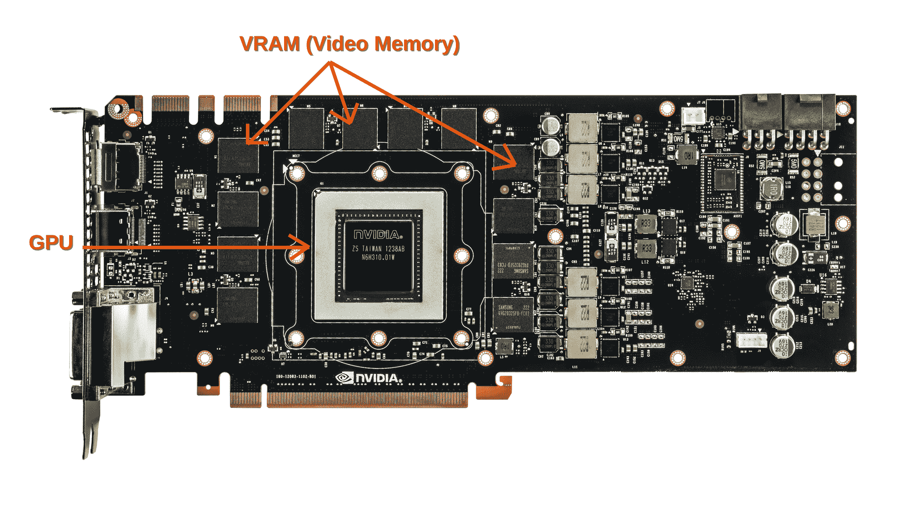

# GPU 内存带宽

> 原文：<https://blog.paperspace.com/gpu-memory-bandwidth/>

Photo by [Rafael Pol](https://unsplash.com/@rapol?utm_source=ghost&utm_medium=referral&utm_campaign=api-credit) / [Unsplash](https://unsplash.com/?utm_source=ghost&utm_medium=referral&utm_campaign=api-credit)

这篇博客分解了一个最容易被忽视的 GPU 特性:内存带宽。我们将深入什么是 GPU 内存带宽，并看看为什么它应该被视为一个 ML 专家应该在机器学习平台中寻找的品质之一。

理解机器学习的内存需求是模型开发过程的重要组成部分。然而，这有时很容易被忽视。

## 基本的 GPU 剖析

与主板一样，显卡也是一块印刷电路板，其中包含处理器、内存和电源管理单元。它还有一个 BIOS 芯片，可以保留卡的设置，并对内存、输入和输出执行启动诊断。

图形卡上的图形处理单元(GPU)有点类似于计算机主板上的 CPU。另一方面，GPU 被设计为进行图形渲染或其他机器学习相关应用所需的复杂数学和几何计算。

Nvidia GTX 780 PCB Layout, [Source](https://www.flickr.com/photos/83620044@N06/8800935020)

对于显卡来说，计算单元(GPU)通过称为内存接口的总线连接到内存单元(VRAM，视频随机存取内存的缩写)。

在整个计算机系统中，有许多内存接口。内存接口是内存总线的物理位宽，因为它与 GPU 相关。数据在每个时钟周期(每秒数十亿次)被发送到卡上存储器和从卡上存储器接收。每个时钟周期适合总线的物理位数是该接口的宽度，通常被描述为“384 位”或类似的东西。384 位存储器接口允许每个时钟周期传输 384 位数据。因此，在 GPU 上建立最大内存吞吐量时，内存接口也是内存带宽计算的一个重要部分。因此，NVIDIA 和 AMD 更有可能在其显卡中采用标准化的串行点对点总线。例如，POD125 标准由 A4000、A5000 和 A6000 NVIDIA Ampere 系列显卡使用，您可以找到适用于 [Paperspace 用户](https://blog.paperspace.com/new-ampere-gpus/)的显卡，它本质上描述了与 GDDR6 vRAMs 的通信协议。

说到内存带宽，延迟是第二个要考虑的因素。最初，实现了 VMEbus 和 S-100 总线等通用总线，但当代的存储器总线设计为直接连接到 VRAM 芯片以减少延迟。

在 GDDR5 和 GDDR6 存储器的情况下，这是 GPU 存储器标准的最新形式之一。每个存储器由两个芯片组成，每个芯片都有一个 32 位总线(两个并行的 16 位)，允许同时进行多个存储器访问。因此，具有 256 位内存接口的 GPU 将具有八个 GDDR6 内存芯片。

存储器类型的另一个标准是 HBM 和 HBM2(高带宽存储器 v1 和 v2)，根据这些标准，每个 HBM 接口都是 1024 位，通常提供比 GDDR5 和 GDDR6 更高的带宽。

主板和显卡之间的外部 PCI-express 连接不要与此内部内存接口混淆。这种总线的特点还在于它的带宽和速度，尽管它要慢几个数量级。

## 什么是 GPU 内存带宽？

GPU 的内存带宽决定了它将数据从内存(vRAM)移动到计算核心的速度。是比 GPU 内存速度更有代表性的指标。它取决于内存和计算内核之间的数据传输速度，以及这两部分之间的总线中独立并行链路的数量。

自 20 世纪 80 年代初的家用电脑以来，消费电子设备中的绝对内存带宽增加了几个数量级(约 1MB/s)，但可用的计算资源增加得更快，避免不断触及带宽限制的唯一方法是确保工作负载和资源在内存大小和带宽方面具有相同的数量级。

让我们来看一个最先进的面向 ML 的 GPU，NVIDIA RTX A4000:

它配备了 16 GB 的 GDDR6 内存，256 位内存接口(GPU 和 VRAM 之间的总线上的独立链接数量)和数量惊人的 CUDA 内核，达到 6144 个。凭借所有这些与内存相关的特性，A4000 可以达到 448 GB/s 的内存带宽。

其他面向 [Gradient](https://docs.paperspace.com/gradient/machines/) 用户的 GPU 也提供了一些高性能内存特性:

| 国家政治保卫局。参见 OGPU | 视频随机存取存储器 | 存储器接口宽度 | 存储带宽 |  |
| --- | --- | --- | --- | --- |
| P4000 | 8GB GDDR5 | 256 位 | 243 GB/秒 |  |
| P5000 | 16GB GDDR5X | 256 位 | 288 GB/秒 |  |
| P6000 | 24GB GDDR5X | 384 位 | 432 GB/秒 |  |
| V100 | 32GB HBM2 | 4096 位 | 900 GB/秒 |  |
| RTX4000 | 8GB GDDR6 | 256 位 | 416 GB/秒 |  |
| RTX5000 | 16GB GDDR6 | 256 位 | 448 GB/秒 |  |
| A4000 | 16GB GDDR6 | 256 位 | 448 GB/秒 |  |
| A5000 | 24GB GDDR6 | 384 位 | 768 GB/秒 |  |
| A6000 | 48GB GDDR6 | 384 位 | 768 GB/秒 |  |
| A100 | 40GB HBM2 | 5120 位 | 1555 GB/秒 |  |

## 为什么机器学习应用需要高内存带宽？

内存带宽的影响本质上并不明显。如果速度太慢，系统将出现瓶颈，这意味着所有成千上万的 GPU 计算核心在等待内存响应时都将处于空闲状态。此外，根据 GPU 的应用类型，GPU 可以重复处理数据块(称之为 T 次)，因此外部 PCI 带宽必须是 GPU 内部带宽的 1/Tth。

GPU 最常见的用途证明了上述限制。例如，模型训练程序会将训练数据加载到 GDDR RAM 中，并为计算核心中的神经网络层运行几次，每次运行几个小时。所以 PCI 总线带宽与 GPU 内部带宽之比可以达到 20 比 1。

所需的内存带宽完全取决于您正在进行的项目的类型。例如，如果您正在进行一个深度学习项目，该项目依赖于在内存中输入、重新处理和持续恢复大量数据，您将需要更宽的内存带宽。对于一个基于视频和图像的机器学习项目，对内存和内存带宽的要求不像自然语言处理或声音处理项目那么低。对于大多数普通项目来说，一个较好的大概数字是 300 GB/s 到 500 GB/s。这并不总是如此，但通常有足够的内存带宽来适应各种各样的视觉数据机器学习应用。

我们来看一个深度学习内存带宽需求验证的例子:

如果我们考虑具有超过 2500 万个权重参数的 50 层 ResNet，并且如果我们使用 32 位浮点来存储单个参数，则它将占用大约 0.8GB 的存储空间。因此，在以 32 为例的小批量并行计算期间，我们将需要在每次模型传递期间加载 25.6GB 的内存。使用像 [A100](https://blog.paperspace.com/new-ampere-gpus/) 这样能够处理 19.5 万亿次浮点运算的 GPU，并考虑到 ResNet 模型在一次传递中使用 497 万亿次浮点运算(对于特征大小为 7 x 7 x 2048 的情况)，我们将能够每秒完成大约 39 次完整传递，这将导致 998 GB/s 的带宽需求。因此带宽为 1555 GB/s 的 [A100](https://blog.paperspace.com/new-ampere-gpus/) 将能够有效地处理这种模型，并远离瓶颈。

## 如何优化模型以降低内存带宽使用率？

一般的机器学习算法，特别是计算机视觉领域中的深度神经网络，会导致大量的存储器和存储器带宽占用。一些技术可以用于在资源受限的环境中或者甚至在强大的云 ML 服务中部署 ML 模型，以减少成本和时间。以下是一些可以实施的策略:

**部分拟合:**如果数据集太大，无法在一次处理中拟合。此功能允许您分阶段地在数据上拟合模型，而不是一次性地在数据上拟合模型。因此，它获取一段数据，拟合它以获得一个权重向量，然后继续处理下一段数据，拟合它以获得另一个权重向量，以此类推。不用说，这降低了 VRAM 的使用，同时增加了训练持续时间。最大的缺陷是，并不是所有的算法和实现都利用部分拟合，或者在技术上可以调整到这样做。然而，只要有可能，就应该考虑到这一点。

**降维:**这不仅对减少训练时间很重要，对减少运行时的内存消耗也很重要。一些技术，如主成分分析(PCA)、线性判别分析(LDA)或矩阵分解，可以显著降低维数并产生具有较少特征的输入变量子集，同时保留原始数据的一些重要质量。

**稀疏矩阵:**处理稀疏矩阵时，只存储非零项可以节省大量内存。根据非零项的数量和分布，可以使用不同的数据结构，与基本技术相比，可以节省大量的内存。代价是访问单个组件变得更加困难，并且需要额外的结构来无歧义地检索原始矩阵，这需要使用更多的核心计算来换取更低的存储器带宽利用率。

## 结论

了解机器学习的内存带宽要求是模型构建过程的关键部分。通过阅读本文，您现在知道了什么是内存带宽。在回顾了相关性以及如何评估存储器带宽需求之后。我们讨论了一些减少带宽使用和降低成本的方法，方法是选择功能较弱的云包，同时保持时间和准确性标准。