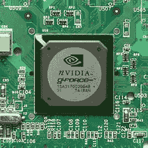

# 利用深度学习基准计算 GPU 内存带宽

> 原文：<https://blog.paperspace.com/understanding-memory-bandwidth-benchmarks/>

在这篇文章中，我们将首先讨论 GPU 和 GPU 内存带宽的含义。然后，我们将讨论如何确定 GPU 内存带宽的引擎盖下。我们还将讨论 GPU 计算的原理、各代 GPU 之间的差异以及当前高端深度学习 GPU 基准的概述。

这篇博文概括介绍了 GPU的功能和能力。如果你想阅读关于深度学习的 Paperspace GPUs 的基准测试，请参考我们的[最新一轮基准测试](https://blog.paperspace.com/best-gpu-paperspace-2022/)。

## 介绍

这里的想法是探索 GPU 的历史，它们是如何开发的，由谁开发的，GPU 内存带宽是如何确定的，相关的商业模式，以及 GPU 在各代之间发生的实质性变化。这将为我们提供足够的信息，以便深入研究专门关注 GPU 模型和微体系结构的深度学习基准。

在开发 GPU 加速的应用程序时，有多种技术和编程语言可供使用，但在本文中，我们将使用 CUDA(一种框架)和 Python 作为示例。

> ***注意:这篇文章要求你具备 Linux 操作系统和 Python 编程语言的基础知识，因为我们将使用它，因为它在研究、工程、数据分析和深度学习领域非常普遍，这些领域都非常依赖于并行计算。***

* * *

## 什么是 GPU？

缩写 GPU 代表图形处理单元，这是一种定制的处理器，旨在加快图形性能。您可以将 GPU 视为开发人员用来解决计算世界中一些最困难的任务的设备。GPU 可以实时处理大量数据，这使得它们适用于深度学习、视频制作和视频游戏开发。

> 今天，GPU 可以说是最受认可的，因为它们用于产生现代视频和视频游戏观众所期望的流畅图像。

虽然 GPU 和视频卡(或图形卡)这两个词有时使用相同，但两者之间有一点点不同。视频卡和 GPU 不共享内存，因此将数据写入视频卡和读取输出是两个独立的操作，可能会导致系统出现“瓶颈”。显卡只是 GPU 和计算机系统之间的主要链接。

大多数计算机系统不是依赖集成到主板上的 GPU，而是利用带有 GPU 的专用显卡来增强性能。

## GPU 的一点历史

1999 年，Nvidia 首次向市场推出 GPU。Nvidia 的第一个 GPU 被称为 Geforce 256，它被设计为每秒至少容纳 1000 万个多边形。缩写“GPU”在 1999 年 GeForce 256 发布之前并不存在。这使得 Nvidia 可以铸造并声称拥有“世界上第一个 GPU”在 GeForce 256 之前，有不同的其他加速器，如图形倍增器。



Figure 1: GeForce 256, Image credit, Konstantine Lanzet, Wikipedia

与较新的 GPU 相比，GeForce 256 已经过时，而且动力不足，但它仍然是 3D 图形发展中的一张重要卡片。它是基于 220 纳米技术设计的，能够处理 50 千兆次浮点运算

## GPU 内存带宽

GPU 内存带宽指的是**总线在任何给定时间**可以处理的潜在最大数据量，并在决定 GPU 检索和使用其帧缓冲区的速度方面发挥作用。内存带宽是每个新 GPU 最广泛宣传的指标之一，有许多型号每秒能够传输数百千兆字节。

### GPU 内存带宽重要吗？

你的内存带宽越高越好。这是一个硬性规定。例如，内存带宽更大的显卡可以更快更准确地绘制图形。

带宽计数器可以用来判断程序是否访问了足够的内存。当您希望尽可能快地复制数据时，您可能希望可访问的系统内存范围很大。类似地，如果你的程序执行的算术运算少于所请求的系统内存量，你可能希望使用大量的带宽。

### GPU 内存带宽的计算

要确定 GPU 内存带宽，首先必须了解一些基本概念(这些概念将在后面的计算中用到):

1.  咬和咬是两回事。
2.  **我们有不同的内存数据速率**

#### 位和字节之间的差异|内存的数据速率

**比特与字节**
比特与字节的主要区别在于，一个比特是**最基本的计算机内存类型，只能存储两种不同的值，但一个由八个比特组成的字节可以存储多达 256 种不同的值。**

在计算中，位用小写字母“b”表示，即 Gbps

字节用大写字母“B”表示，即 GB/s

**存储器的数据速率**

数据速率是模块在给定时间内可以发送的位数。我们有三种数据速率的随机存取存储器:

*   单数据速率(SDR)
*   双倍数据速率(DDR)
*   四倍数据速率(QDR)

最常见的类型是 DDR，比如 DDR4 RAM。DDR 每个时钟周期发送两个信号。每个时钟周期都有一个上升和下降。

因此，QDR 每个时钟周期发送四个信号。

所获得的持续存储器带宽可以被计算为传输的字节与内核执行时间的比率。
一个典型的当代 GPU 可以提供等于或大于其峰值存储器带宽 80%的流结果。

GPU- STREAM 作为一种工具，可以告知应用程序开发人员内存带宽受限内核的性能。GPU-STREAM 是开源的，可以在 [GitHub](https://github.com/UoB-HPC/BabelStream) 上的这个资源库中找到。

**例子**:让我们计算一下 GTX 1660 - 2019 的 GDDR5 Nvidia GeForce 的 GPU 内存带宽。(内存时钟= 2001 MHz，有效内存。时钟= 8 Gbps，存储器总线宽度= 192 位)

**解决方案**:
第一步

**计算有效内存时钟**
有效内存时钟由下式给出，内存时钟* 2(上升和下降)*(数据速率式)

*数学表达式:*
有效内存时钟=内存时钟 2(上升和下降)(数据速率类型)

因此:
2001MHz * 2(上升和下降)* 2(DDR) = 8004 位
8004 位= 8Gbps

**第二步**

**计算内存带宽**
内存带宽=有效内存布*内存总线宽度/ 8

内存带宽:
8004bits * 192/8 = 192 096 字节= 192 GB/s
* *
最终输出

GPU 内存带宽为 192 GB/秒

### 寻找各代 GPU 的内存带宽？

了解何时以及如何使用每种类型的内存对于最大化应用程序的速度有很大的影响。通常最好使用共享内存，因为使用共享内存的同一个框架内的线程可以交互。如果使用得当，共享内存再加上它的最高性能，是一个极好的“全能”选择。然而，在某些情况下，最好采用其他类型的可访问存储器。

根据内存带宽，GPU 有四种主要形式，即:

*   专用显卡
*   集成图形处理单元
*   混合图形处理
*   流处理和通用图形处理器

在低端台式机和笔记本电脑领域，最新的 GPU(混合图形处理)与集成显卡竞争。ATI 的 HyperMemory 和 Nvidia 的 TurboCache 就是这方面最频繁的改编。混合显卡的成本略高于集成显卡，但远低于独立显卡。两者都与主机交换内存，并具有适度的专用内存高速缓存，以补偿计算机 RAM 的过度响应。

**大多数 GPU 都是基于内存带宽和其他大规模计算为某种目的而构建的:**

1.  深度学习与人工智能: [英伟达特斯拉](https://www.nvidia.com/en-gb/data-center/tesla-v100/)/数据中心， [AMD 镭龙本能](https://www.amd.com/en/graphics/instinct-server-accelerators)。
2.  视频制作和游戏: [GeForce GTX RTX](https://www.nvidia.com/en-us/geforce/20-series/) ， [Nvidia 泰坦](https://www.nvidia.com/en-us/titan/titan-v/)，[镭龙 VII](https://www.amd.com/en/products/graphics/amd-radeon-vii) ，[镭龙和 Navi 系列](https://en.wikipedia.org/wiki/Radeon_RX_5000_series)
3.  小型工作站:[英伟达 Quadro](https://www.nvidia.com/en-us/design-visualization/rtx/) ，[英伟达 RTX](https://www.nvidia.com/en-us/geforce/rtx/) ， [AMD FirePro](https://www.amd.com/en/graphics/workstation-certified-applications) ， [AMD 镭龙 Pro](https://www.amd.com/en/graphics/workstations)
4.  云工作站: [英伟达特斯拉](https://www.nvidia.com/en-gb/data-center/tesla-v100/)/数据中心， [AMD Firestream](https://www.techpowerup.com/gpu-specs/firestream-9250.c772)
5.  机器人: [Nvidia Drive PX](https://www.nvidia.com/en-us/self-driving-cars/)

嗯，一旦你对 GPU 应用中可访问的各种类型的内存有了一点了解，你就准备好学习如何以及何时有效地使用它们。

## GPU 编程的语言解决方案 Python 的 CUDA

GPU 编程是一种使用 GPU 加速器执行高度并行的通用计算的技术。虽然 GPU 最初是为 3d 建模而创建的，但它们现在广泛用于广泛的计算。

除了图形渲染之外，GPU 支持的并行计算正被用于深度学习和其他并行化密集型任务。

在开发 GPU 加速的应用程序时，有多种技术和编程语言可供使用，但在本文中，我们将使用 CUDA 和 Python 作为示例。

> 让我们看看如何在 Python 中使用 CUDA，从在机器上安装 CUDA 开始。

### 安装 CUDA 系统

首先，您需要确保您的机器具备以下条件:

*   支持 CUDA 的 GPU
*   支持的 Linux 版本- Ubuntu 20.04
*   GCC 安装在您的系统上
*   安装正确的内核管理器和开发包

然后[安装 CUDA](https://developer.nvidia.com/cuda-downloads) 。按照下面的说明在本地安装程序上安装 CUDA:

```py
wget https://developer.download.nvidia.com/compute/cuda/repos/ubuntu2004/x86_64/cuda-ubuntu2004.pin
sudo mv cuda-ubuntu2004.pin /etc/apt/preferences.d/cuda-repository-pin-600
wget https://developer.download.nvidia.com/compute/cuda/11.4.2/local_installers/cuda-repo-ubuntu2004-11-4-local_11.4.2-470.57.02-1_amd64.deb  
sudo dpkg -i cuda-repo-ubuntu2004-11-4-local_11.2-470.57.02-1_amd64.deb  
sudo apt-key add /var/cuda-repo-ubuntu2004-11-4-local/7fa2af80.pub 
sudo apt-get update  
sudo apt-get -y install cuda
```

你可以抛弃你的本地设备，换一个更强大的云机器，比如[渐变笔记本](https://gradient.run/)或者[核心机](https://www.paperspace.com/core)，来消除这个麻烦。除非另有说明，否则每台 Paperspace 机器都预装了 CUDA 和 CuPy，以方便用户的任何深度学习需求。

### 安装 CuPy 库

其次，因为 NumPy 是 Python 数据科学环境的基础库，我们将在本次会议中使用它。

利用 NumPy 的最简单方法是使用 CuPy，这是一个在 GPU 上复制 NumPy 功能的替代库。

Pip 可用于安装 CuPy 源包的稳定发布版本:

```py
pip install cupy
```

### 确认 CuPy 安装正确

这一步是必要的，以确认 CuPy 可以增强您的系统到什么水平。为此，我们将通过在. py 文件中编写一个简单的 Python 脚本来实现。

> 注意:这一步需要你知道一个 Python 程序的[基本文件结构](https://docs.python-guide.org/writing/structure/)。

下面的脚本将导入 NumPy 和 CuPy 库，以及时间库，它们将用于对处理单元进行基准测试。

```py
import numpy as np
import cupy as cp
from time import time
```

### 标杆管理

现在让我们定义一个函数，用来比较 GPU 和 CPU。

```py
def benchmark_speed(arr, func, argument):
	start_time = time()
    func(arr, argument) #your argument will be broadcasted into a matrix
    finish_time = finish_time - start_time
    return elapsed_time
```

然后，您必须创建两个矩阵:一个用于 CPU，一个用于 GPU。对于我们的矩阵，我们将选择 9999 乘 9999 的形式。

```py
# store a matrix into global memory
array_cpu = np.random.randint(0, 255, size=(9999, 9999))

# store the same matrix to GPU memory
array_gpu = cp.asarray(array_cpu)
```

最后，我们将使用一个基本的加法函数来测试 CPU 和 GPU 处理器的效率。

```py
# benchmark matrix addition on CPU by using a NumPy addition function
cpu_time = benchmark_speed(array_cpu, np.add, 999)

# you need to run a pilot iteration on a GPU first to compile and cache the function kernel on a GPU
benchmark_speed(array_gpu, cp.add, 1)

# benchmark matrix addition on GPU by using CuPy addition function
gpu_time = benchmark_speed(array_gpu, cp.add, 999)

# Compare GPU and CPU speed
faster_speed = (gpu_time - cpu_time) / gpu_time * 100
```

让我们将结果打印到控制台上

```py
print(f"CPU time: {cpu_time} seconds\nGPU time: {gpu_time} seconds.\nGPU was {faster_speed} percent faster")
```

我们已经证实，整数加法在 GPU 上要快得多。如果您处理大量可以并行处理的数据，学习更多关于 GPU 编程的知识通常是值得的。正如您所见，对大矩阵采用 GPU 计算显著提高了性能。

如果您没有 GPU，您可以在 Gradient 笔记本中运行这段代码，亲自看看他们的 GPU 在这个基准测试任务中的表现。你可以在你已经拥有的渐变笔记本的任何单元格中运行这段代码，或者你可以用任何 GPU 作为机器类型来启动一台新机器。

## 深度学习和 GPU 之间的联系

人工智能(AI)正在快速变化，新的神经网络模型、方法和应用案例定期出现。因为没有一种技术对所有机器学习和深度学习应用都是最优的，所以在特定的使用场景下，GPU 可以提供优于其他不同硬件平台的独特优势。

今天的许多深度学习解决方案都依赖于 GPU 与 CPU 的协作。由于 GPU 具有巨大的处理能力，它们可以极大地加速受益于 GPU 并行计算设计的工作负载，例如图像识别。人工智能和深度学习是 GPU 技术最有趣的两个用途。

### 基准测试 GPU 的摘要

NVIDIA 的最新产品都包括在内，包括安培 GPU 一代。多 GPU 配置的功能，如四 RTX 3090 安排，也进行了评估。

本节涵盖了本地 GPU 的一些选项，由于其计算和内存性能以及与当前深度学习框架的连接性，这些本地 GPU 目前最适合深度学习培训和开发。

| GPU 名称 | 描述 |
| --- | --- |
| GTX 1080TI | NVIDIA 用于深度学习的传统 GPU 于 2017 年推出，专为计算任务而设计，具有 11 GB DDR5 内存和 3584 个 CUDA 内核。它已经停产一段时间了，只是作为参考点添加的。 |
| RTX 2080TI | RTX 2080 TI 于 2018 年第四季度推出。它拥有 5342 个 CUDA 内核，结构为 544 个 NVIDIA Turing 混合精度张量内核，具有 107 个张量 TFLOPS 的人工智能功能和 11 GB 的超快速 GDDR6 内存。这款 GPU 已于 2020 年 9 月停产，不再提供。 |
| 泰坦 RTX | 泰坦 RTX 由最强大的 TuringTM 架构驱动。泰坦 RTX 拥有 576 个张量内核和 24 GB 超快 GDDR6 内存，可提供 130 张量 TFLOPs 的加速度。 |
| RTX 6000 帧 | Quadro RTX 6000 是著名的泰坦 RTX 的服务器变体，具有增强的多 GPU 鼓风机通风、扩展的虚拟化功能和 ECC 内存。它使用与泰坦 RTX 相同的 TuringTM 内核，拥有 576 个张量内核，可提供 130 张量 TFLOPs 的生产力以及 24 GB 的超快速 GDDR6 ECC 内存。 |
| RTX 8000 帧 | 夸德罗 RTX 8000 是 RTX 6000 的兄弟姐妹。采用相同的 GPU 处理单元，但 GPU 内存翻倍(48 GB GDDR6 ECC)。事实上，它是目前拥有最高可访问 GPU 内存的 GPU，是内存密集型活动的理想选择。 |
| RTX 3080 | 首批使用 NVIDIA AmpereTM 架构的 GPU 型号之一，具有改进的 RT 和张量内核以及新的实时多处理器。RTX 3080 拥有 10 GB 的超快 GDDR6X 内存和 8704 个 CUDA 内核。 |
| RTX 3080 Ti | RTX 3080 的大兄弟，配备 12 GB 超快 GDDR6X 内存和 10240 个 CUDA 内核。 |
| RTX 3090 | GeForce RTX 3090 属于 NVIDIA 的 AmpereTM GPU 一代的泰坦级。它由 10496 个 CUDA 内核、328 个第三代张量内核和创新的流多处理器提供支持。它和泰坦 RTX 一样，拥有 24 GB 的 GDDR6X 内存。 |
| 英伟达 RTX A6000 | 英伟达 RTX A6000 是夸德罗 RTX 6000 的基于安培的更新。它拥有与 RTX 3090 相同的 GPU 处理器(GA-102)，但是它支持所有的 CPU 内核。因此，有 10752 个 CUDA 核心和 336 个第三代张量核心。此外，它的 GPU 内存是 RTX 3090 的两倍:48GB GDDR6 ECC。 |
|  |  |

然而，使用本地 GPU 有许多限制。首先，你受限于你的购买能力。对于大多数 GPU 拥有者来说，切换到不同的 GPU 要么是不可能的，要么是极其昂贵的。其次，这些主要是英伟达的 GeForce 30 和 workstation 系列 GPU。这些不是像 Tesla/数据中心 GPU 那样为处理大数据而设计的。

你可以在这里访问他们可用的 GPU 的完整列表:[https://docs.paperspace.com/gradient/machines/](https://docs.paperspace.com/gradient/machines/)

您还可以在这里访问他们的 GPU 的完整基准分析:[https://blog.paperspace.com/best-gpu-paperspace-2022/](https://blog.paperspace.com/best-gpu-paperspace-2022/)

# 总结

您项目的最佳 GPU 将由您的人工智能操作的成熟度、您工作的规模以及您使用的特定算法和模型来决定。在前面的章节中已经提供了许多因素来帮助您根据自己的目的选择最佳的 GPU 或 GPU 组。

Paperspace 可以让你根据任何和所有深度学习任务的需要在不同的 GPU 之间切换，所以在购买昂贵的 GPU 之前，请尝试他们的服务。