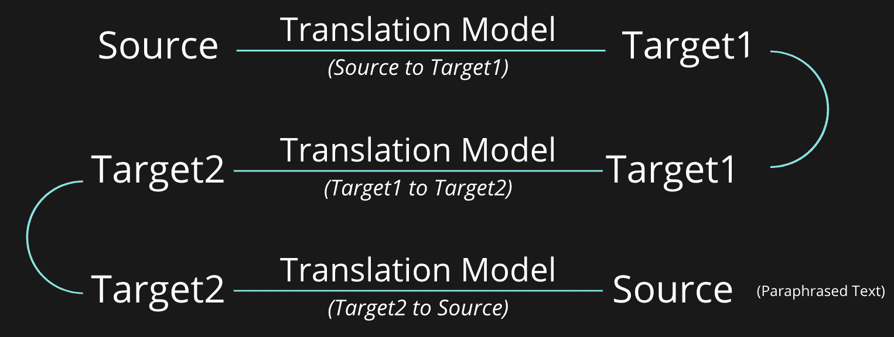

# 自然语言处理中流行的数据扩充技术

> 原文：<https://blog.paperspace.com/data-augmentation-for-nlp/>

**数据扩充**是在机器学习的各个垂直领域广泛使用的实践，有助于增加现有数据集中的数据样本。可能有多种原因导致您希望在训练数据中包含更多样本。这可能是因为你收集的数据太少，无法开始训练一个好的 ML 模型，或者也许你看到了一些过度拟合发生的证据。在任何一种情况下，数据增强都可以帮助使用各种技术在现有数据中引入多样性/多样性，并最终帮助我们的机器学习模型处理对未知样本的过度拟合和推广。这里也可以认为是正则化。增强方法在计算机视觉领域非常流行，在自然语言处理领域也是如此。

在这篇博客中，我们将主要关注一些流行的技术和 python 库，它们可以用来扩充文本数据。

### 方法 1

谈到在 NLP 中的[简单数据扩充技术中所做的工作，作者提出了各种简单、直观和有效的函数，用于将给定的文本样本转换成其扩充版本，特别是对于文本分类的用例。文本分类是将文本块分类到预定义的组中的任务。作者提出了 4 个函数，分别是 **SR** *(同义词替换)*， **RI** *(随机插入)*， **RS** *(随机替换)*， **RD** *(随机删除)*。每种方法的详细情况如下:](https://arxiv.org/abs/1901.11196)

**同义词替换(SR)**——随机选择一个不停的单词，用它的同义词替换。

> 注意:停用词是那些在所有文档中出现的可能性相同的常用词。这些单词本身并没有给相关文本添加任何重要的分界信息。其中一些例子有“the”、“an”、“is”等。可以使用特定语言的单个通用停用词列表来将它们从给定文本中移除，尽管通常的做法是通过从特定领域语料库中挖掘常用词来扩展通用列表。自然语言工具包(NLTK)预先打包了一个停止用户列表，您可以将它作为一个起点。

**随机插入(RI)** -在文本中的随机位置插入随机选择的单词的同义词。

**随机替换(RS)** -随机交换文本中任意两个单词。

**随机删除(RD)** -从文本中随机删除一个单词。

上述每个功能都可以执行 1 次以上，但是应该考虑信息损失和样本总数之间的权衡来选择。这种转换背后的直觉是模仿任何人在书写一段文本时都会犯的一般书写行为和错误。我还建议你浏览一下[论文](https://arxiv.org/abs/1901.11196)或观看这个[视频](https://www.youtube.com/watch?v=-1unNLkwImw)来获得关于所做实验的见解。你可以从这个[令人敬畏的 python 库](https://github.com/makcedward/nlpaug)中学习例子，直接使用这些开箱即用的函数。该库还允许您在字符级别执行这些操作，而不仅仅是单词。

除了上面提到的，还有一件事可以尝试做*表面级转换*就是使用预定义的映射，使用正则表达式来扩展收缩。例如- *不要- >不要，我们要- >我们要等。*

### 方法 2

**回译**也是在实践中进行文本增强时经常使用的一种流行技术。考虑到当今翻译系统的概率性行为，反向翻译可以非常有效地生成原文的释义版本。释义是保留原句原意的句子，同时也允许对内容进行重新措辞。例如，如果原来的句子是“每个人都经常去看电影”，那么它的一个释义可以是“*每个人*都经常去看电影”。

反向翻译方法包括 3 个基本步骤。其中每一个都在下面提到:

**中间翻译** -将文本从源语言翻译成目标语言。例如，英语到法语。

**反向翻译** -将步骤 1 中的文本翻译回其源语言。

**修剪**——如果与原文相同，删除反向翻译。

您可以使用任何可用的翻译模型来构建这个管道。实践中经常看到，做一级以上的翻译可以得到很好的解释。例如，按照管道-英语到法语，法语到西班牙语，西班牙语到英语。下图说明了流程。但当然，这取决于手头的计算带宽。你可以从这个[棒极了的 python 库](https://github.com/makcedward/nlpaug)中学习例子，直接使用这个开箱即用的函数。



Back-Translation Flow

你也可以看看这个 github 的[，它在](https://github.com/ramsrigouthamg/Paraphrase-any-question-with-T5-Text-To-Text-Transfer-Transformer-) [Quora 重复问题数据集](https://www.kaggle.com/c/quora-question-pairs)上微调一个预先训练好的 [T5 模型](https://huggingface.co/docs/transformers/model_doc/t5)，以监督的方式生成转述问题。你总是可以通过在[微软研究释义语料库](https://www.microsoft.com/en-us/download/details.aspx?id=52398&from=https%3A%2F%2Fresearch.microsoft.com%2Fen-us%2Fdownloads%2F607d14d9-20cd-47e3-85bc-a2f65cd28042%2F)、 [PPDB:释义数据库](https://aclanthology.org/N13-1092.pdf)和类似的数据集上进行微调来进一步扩展它，以构建一个更通用的释义系统。

### 
方法三

随着变形金刚模型在自然语言处理方面的最新进展，[这篇博客](https://towardsdatascience.com/text-data-augmentation-using-gpt-2-language-model-e5384e15b550)谈到了使用 **GPT-2 模型进行文本数据增强**(点击这里查看 [GTP-2](https://blog.paperspace.com/generating-text-summaries-gpt-2/) 的更全面概述)。在很高的层面上，该博客讨论了通过向输入的例句添加类别标签的前缀文本，对来自训练数据的句子的现有 GPT-2 模型进行微调。然后，它对模型进行训练，以在存在类别标签的情况下最大化生成序列的可能性。添加类标签有助于模型理解训练数据中可用的各种类聚类。在推理过程中，只要给 GPT-2 模型一个类名提示，它就会生成与类名意图一致的句子。你可以在[text augmentation-gp T2 Github](https://github.com/prakhar21/TextAugmentation-GPT2)找到代码。此外，下面是上述模型(*如官方 GitHub* 中所述)在垃圾邮件/业余邮件分类任务上生成的一些示例。

```py
SPAM: you have been awarded a £2000 cash prize. call 090663644177 or call 090530663647<|endoftext|>
SPAM: FREE Call Todays top players, the No1 players and their opponents and get their opinions on www.todaysplay.co.uk Todays Top Club players are in the draw for a chance to be awarded the £1000 prize. TodaysClub.com<|endoftext|>
HAM: I don't think so. You got anything else?<|endoftext|>
HAM: Ugh I don't want to go to school.. Cuz I can't go to exam..<|endoftext|> 
```

Synthetic examples generated by the GPT-2 model

您可以将此方法用于渐变笔记本，方法是创建以 repo 作为工作区 URL 的笔记本，可在“高级选项切换”部分找到。

### 方法 4

上面提到的一些方法如果盲目地进行，可能会导致标签和文本意图不匹配。比如，如果句子是“*我不喜欢这个食物*”，标签是“*负面*”。假设我们正在进行随机单词删除，结果是单词“don't”被删除，所以现在新句子变成了“*我喜欢这种食物*”，标签为“*负面*”。这是不对的！因此，关注转换后的句子并相应地调整它们总是很重要的。

因此，作者在[中使用预先训练的 Transformer 模型](https://arxiv.org/abs/2003.02245)进行数据增强，指出了上述局限性，并提出了一种执行**上下文增强**的技术，以保留标签和句子意图。他们通过微调各种预训练的变压器模型来做到这一点，如[伯特](https://arxiv.org/abs/1810.04805)、 [GPT](https://en.wikipedia.org/wiki/GPT-3) 、Seq2Seq [巴特](https://www.youtube.com/watch?v=BGWpNQHIcs4)、 [T5](https://arxiv.org/abs/1910.10683) 等句子以及类标签信息。他们尝试了它的两种变体，这两种变体都在下面提到:

**Expand** -这涉及到为每个句子预先添加类标签，并添加类标签作为模型词汇表的一部分，然后根据各个 Transformer 模型的预定义目标对其进行微调。

**Prepend**——这包括为每个句子预先添加类标签，但不添加类标签作为模型词汇表的一部分，并根据相应 Transformer 模型的预定义目标对其进行微调。

他们发现，与作者尝试的其他方法相比，预训练的 Seq2Seq 模型表现良好。我建议你浏览一下[论文](https://arxiv.org/abs/2003.02245)来获得对实验的见解。同样，你也可以随意访问[代码](https://github.com/varunkumar-dev/TransformersDataAugmentation)来获取相同的信息。

### 结论

如前所述，数据扩充是您在构建机器学习模型时应该纳入的重要实践之一。在这篇博客中，我们看到了自然语言处理领域中的各种数据扩充技术，从上下文无关到敏感转换，python 库可以帮助更快地构建这些函数的原型，以及在使用各种转换选项时需要记住的事情。此外，值得注意的是，数据扩充可能并不总是有助于提高模型性能*(但同样，这也不能保证机器学习中的任何实践)*，但肯定的是，可以尝试一些东西，并将其放在手边是一种好的实践。根据经验，尝试各种增强方法，看看哪种效果更好，并使用验证集来调整要增强的样本数量，以获得最佳结果，这总是好的。

希望你觉得这篇文章有用。谢谢大家！