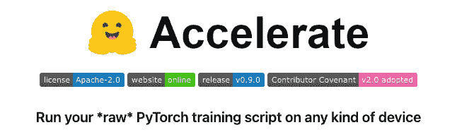
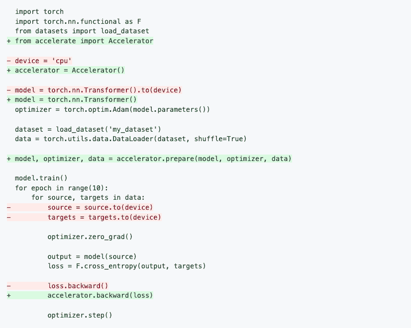
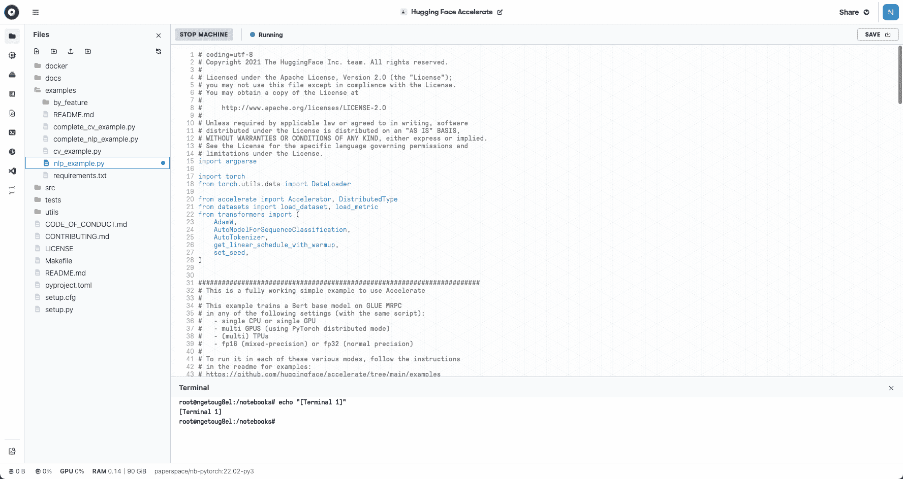
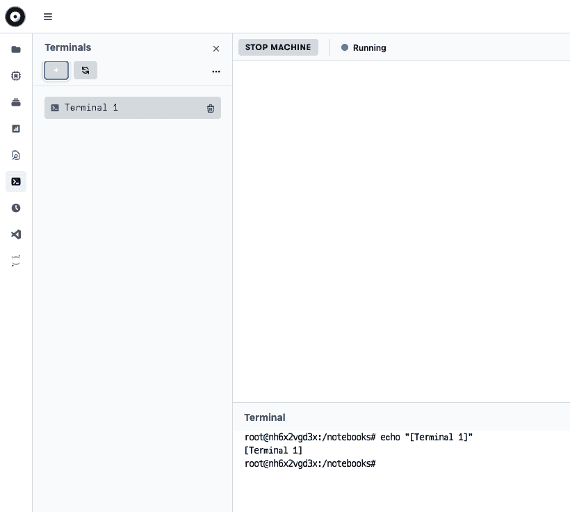
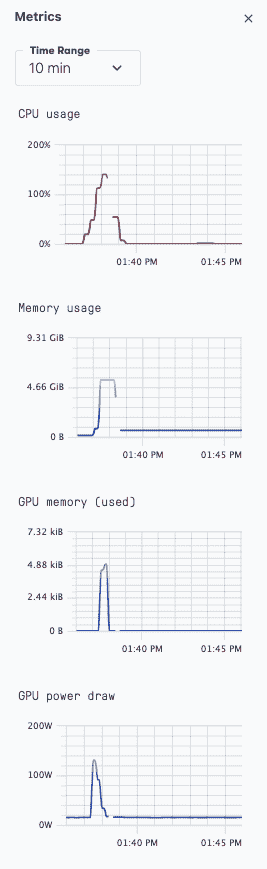
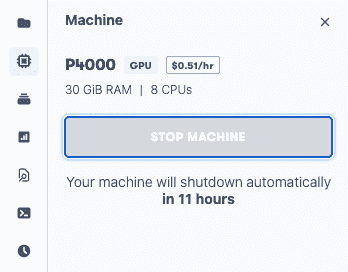
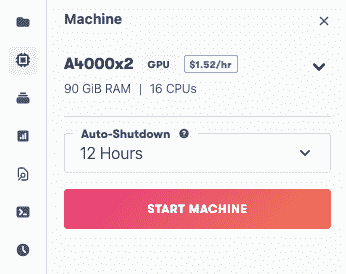

# raw PyTorch 上的多 GPU，带有拥抱脸的加速库

> 原文：<https://blog.paperspace.com/multi-gpu-on-raw-pytorch-with-hugging-faces-accelerate-library/>

分布式机器学习是复杂的，当与同样复杂的深度学习模型相结合时，它可以让任何事情都进入研究项目。加上设置你的 GPU 硬件和软件，它可能会变得太多了。

这里我们展示了[humping Face 的 Accelerate 库](https://huggingface.co/blog/accelerate-library)消除了使用分布式设置的一些负担，同时仍然允许您保留所有原始 PyTorch 代码。

当与 Paperspace 的多 GPU 硬件及其现成的 ML 运行时相结合时，Accelerate 库可以更轻松地运行用户以前可能会发现很难的高级深度学习模型。新的可能性打开了，否则可能会去探索。

## 什么是加速？



Accelerate 是来自 Hugging Face 的一个库，它简化了在单台或多台机器上将单个 GPU 的 PyTorch 代码转换为多个 GPU 的代码。你可以在他们的 [GitHub 库](https://github.com/huggingface/accelerate)这里阅读更多关于 Accelerate 的内容。

### 动机

有了最先进的深度学习技术，我们可能无法总是避免真实数据或模型中的复杂性，但我们可以降低在 GPU 上运行它们的难度，并且一次在多个 GPU 上运行。

有几个库可以做到这一点，但它们通常要么提供更高层次的抽象来消除用户的细粒度控制，要么提供另一个 API 接口，在使用它之前需要先学习它。

这就是 Accelerate 的动机:让需要编写完整的通用 PyTorch 代码的用户能够这样做，同时减少以分布式方式运行这些代码的负担。

该库提供的另一个关键功能是，固定形式的代码可以分布式运行，也可以非分布式运行。这不同于传统的 PyTorch 分布式启动，传统的 py torch 分布式启动必须进行更改，以便从一个启动到另一个启动，然后再返回。

## 使用 Accelerate 的代码更改

如果您需要使用完全通用的 PyTorch 代码，很可能您正在为模型编写自己的训练循环。

**训练循环**

典型的 PyTorch 训练循环是这样的:

*   导入库
*   设置设备(例如，GPU)
*   点模型到设备
*   选择优化器(如 Adam)
*   使用 DataLoader 加载数据集(这样我们可以将批传递给模型)
*   循环中的训练模型(每个时期一次):
    *   将源数据和目标指向设备
    *   将网络梯度归零
    *   从模型计算输出
    *   计算损失(例如交叉熵)
    *   反向传播梯度

根据所解决的问题，还可能有其他步骤，如数据准备，或在测试数据上运行模型。

**代码变更**

在 Accelerate GitHub 存储库的自述文件中，通过突出显示要更改的行，说明了与常规 PyTorch 相比，上述训练循环的代码更改:



Code changes for a training loop using Accelerate versus original PyTorch. (From the Accelerate GitHub repository README)

绿色表示添加的新行，红色表示删除的行。我们可以看到代码是如何与上面概述的训练循环步骤相对应的，以及需要进行的更改。

乍一看，这些变化似乎没有简化代码，但是如果您想象红线已经消失，您可以看到我们不再谈论我们在什么设备上(CPU、GPU 等)。).它被抽象掉了，而循环的其余部分保持不变。

更详细地说，代码更改如下:

*   导入加速器库
*   使用加速器作为设备，可以是 CPU 或 GPU
*   实例化模型，无需指定设备
*   设置 Accelerate 要使用的模型、优化器和数据
*   我们不需要将源数据和目标指向设备
*   加速器执行反向传播步骤

**多 GPU**

上面的代码是针对单个 GPU 的。

在他们的[拥抱脸博客条目](https://huggingface.co/blog/accelerate-library)上，Accelerate 的作者展示了 PyTorch 代码需要如何改变，以使用传统方法实现多 GPU。

它包括更多的代码行:

```py
import os
...
from torch.utils.data import DistributedSampler
from torch.nn.parallel import DistributedDataParallel
local_rank = int(os.environ.get("LOCAL_RANK", -1))
...
device = device = torch.device("cuda", local_rank)
...
model = DistributedDataParallel(model)  
...
sampler = DistributedSampler(dataset)
...
data = torch.utils.data.DataLoader(dataset, sampler=sampler)
...
    sampler.set_epoch(epoch)  
    ...
```

由此产生的代码不再适用于单个 GPU。

相比之下，使用 Accelerate *的代码已经适用于多 GPU* ，并且也继续适用于单个 GPU。

这听起来很棒，但是它在一个完整的程序中是如何工作的，又是如何被调用的呢？我们现在将通过一个关于 Paperspace 的示例来展示 Accelerate 的实际应用。

## 在图纸空间上运行加速

[Accelerate GitHub 库](https://github.com/huggingface/accelerate)通过一组记录良好的例子展示了如何运行这个库。

在这里，我们将展示如何在 Paperspace 上运行它，并浏览一些示例。我们假设您已经登录，并且熟悉[基本笔记本用法](https://docs.paperspace.com/gradient/notebooks/runtimes)。您还需要付费订阅，以便可以访问终端。

Paperspace 允许您直接连接到 GitHub 存储库，并将其用作项目的起点。因此，您可以指向现有的 Accelerate 存储库并立即使用它。不需要安装 PyTorch，或者先设置一个虚拟环境。

要运行，以通常的方式启动笔记本。使用推荐选项卡下的 **PyTorch 运行时**，然后滚动到页面底部并切换*高级选项*。然后，在【高级选项】下，将工作区 URL 更改为 Accelerate 存储库的位置:[https://github.com/huggingface/accelerate](https://github.com/huggingface/accelerate)。首先，我们使用单个 GPU，因此机器的默认选择(P4000)就足够了。我们将在本文后面讨论多 GPU。

这将启动笔记本，并在左侧导航栏的“文件”选项卡中显示回购文件。



Hugging Face Accelerate Github repository being used in a Paperspace Notebook

因为 repo 提供的示例是`.py` Python 脚本，并且这些脚本在这个接口中的 Paperspace 上运行良好，所以我们不打算在这里将它们显示为`.ipynb`笔记本。不过，如果你愿意，图书馆[也可以从笔记本](https://github.com/huggingface/accelerate#launching-your-training-from-a-notebook)上启动。

让我们看看这个例子。

**简单的自然语言处理示例**

拥抱脸建立在使自然语言处理(NLP)更容易被人们使用的基础上，所以 NLP 是一个合适的起点。

从左侧导航栏打开一个终端:



Open terminal in Paperspace Notebook

接下来是一些简短的设置步骤

```py
pip install accelerate
pip install datasets transformers
pip install scipy sklearn
```

我们可以继续这个例子

```py
cd examples
python ./nlp_example.py
```

这在众所周知的 BERT transformer 模型的基础配置上执行微调训练，使用关于一个句子是否是另一个句子的释义的[胶水 MRPC](https://www.microsoft.com/en-us/download/details.aspx?id=52398) 数据集。

它输出的准确率约为 85%，F1 值(准确率和召回率的组合)略低于 90%。所以表现还过得去。

如果您导航到 metrics 选项卡，您可以看到 GPU 确实被使用了:



GPU usage in Paperspace Notebook while running our Accelerate example

也可以使用各种参数调用该脚本来改变行为。我们将在最后提到其中的一些。

### 多 GPU

对于多 GPU，库 Accelerate 的简化能力真正开始显现，因为可以运行与上面相同的代码。

类似地，在 Paperspace 上，要获得多 GPU 设置，只需将机器从我们一直使用的单 GPU 切换到多 GPU 实例。Paperspace 为 A4000s、A5000s、A6000s 和 A100s 提供多 GPU 实例，尽管这因地区而异。

如果您已经在运行笔记本，请停止当前的计算机:



然后使用左侧导航栏中的下拉菜单:


要选择多 GPU 计算机并重新启动，请执行以下操作:



这里从 P4000 换成 A4000x2 就很好了。

*注意:*如果您还没有运行单个 GPU 机器，请以与上述单个 GPU 情况相同的方式创建一个笔记本，但选择 A4000x2 机器而不是 P4000 机器。

然后，要调用多 GPU 的脚本，请执行以下操作:

```py
pip install accelerate datasets transformers scipy sklearn
```

并通过简短的配置步骤告诉它如何在这里运行:

```py
accelerate config
```

```py
In which compute environment are you running? ([0] This machine, [1] AWS (Amazon SageMaker)): 0

Which type of machine are you using? ([0] No distributed training, [1] multi-CPU, [2] multi-GPU, [3] TPU): 2

How many different machines will you use (use more than 1 for multi-node training)? [1]: 1

Do you want to use DeepSpeed? [yes/NO]: no

Do you want to use FullyShardedDataParallel? [yes/NO]: no

How many GPU(s) should be used for distributed training? [1]: 2

Do you wish to use FP16 or BF16 (mixed precision)? [NO/fp16/bf16]: no
```

请注意，我们说 1 台机器，因为我们的 2 个 GPU 在同一台机器上，但我们确认要使用 2 个 GPU。

然后我们可以像以前一样运行，现在使用`launch`命令而不是`python`来告诉 Accelerate 使用我们刚刚设置的配置:

```py
accelerate launch ./nlp_example.py
```

通过在终端中运行`nvidia-smi`可以看到两个 GPU 都在使用。

### 更多功能

正如上面的配置文件设置所暗示的那样，我们只是触及了库特性的表面。

其他一些功能包括:

*   启动脚本的一系列参数:参见[https://github . com/hugging face/accelerate/tree/main/examples](https://github.com/huggingface/accelerate/tree/main/examples)
*   多 CPU 和多 GPU
*   多台机器上的多 GPU
*   Jupyter 笔记本上的发射器
*   混合精度浮点
*   极速集成
*   带 MPI 的多 CPU

**计算机视觉示例**

还有另外一个机器学习的例子，你可以运行；它类似于我们在这里运行的 NLP 任务，但是是针对计算机视觉的。它在牛津-IIT 宠物数据集上训练了一个 ResNet50 网络。

在我们的笔记本上，您可以将以下内容添加到代码单元格中，以快速运行示例:

```py
pip install accelerate datasets transformers scipy sklearn
pip install timm torchvision
cd examples
wget https://www.robots.ox.ac.uk/~vgg/data/pets/data/images.tar.gz
tar -xzf images.tar.gz
python ./cv_example.py --data_dir images
```

## 结论和后续步骤

我们已经展示了与传统 PyTorch 相比，来自 Hugging Face 的 Accelerate 库如何以分布式方式简化 PyTorch 深度学习模型的运行，而没有删除用户代码的完全通用性质。

同样，Paperspace 通过提供一个随时可用的环境，简化了多 GPU + PyTorch + Accelerate 的访问。

对于一些后续步骤:

*   查看原始的[拥抱脸博客条目](https://huggingface.co/blog/accelerate-library)
*   查看 [Accelerate GitHub 库](https://github.com/huggingface/accelerate)了解更多示例和功能
*   在 Paperspace 上运行您自己的加速和分布式深度学习模型

### *发牌*

在 Apache License 2.0 下，他们可以使用 Hugging Face GitHub 库中的代码。