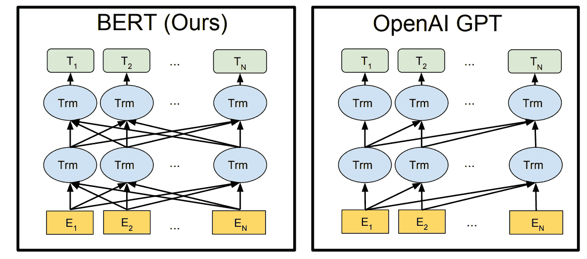
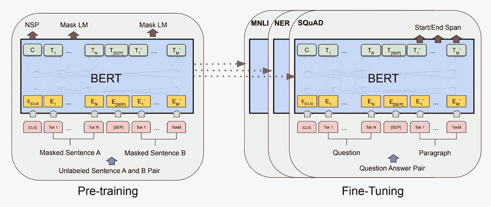
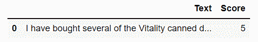
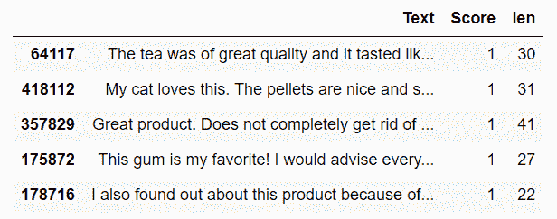
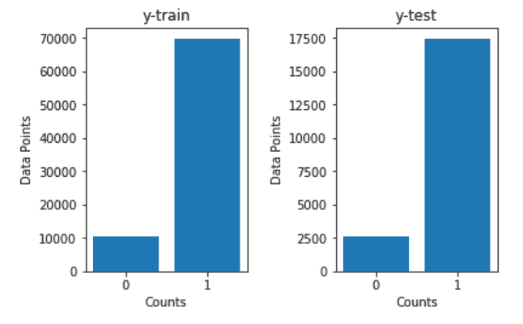
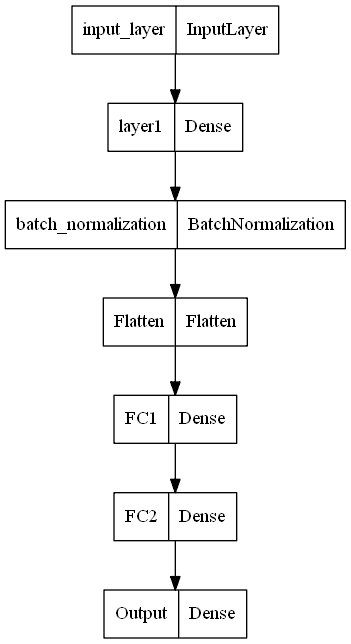
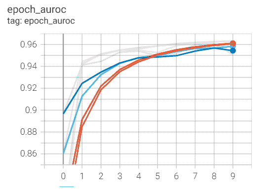
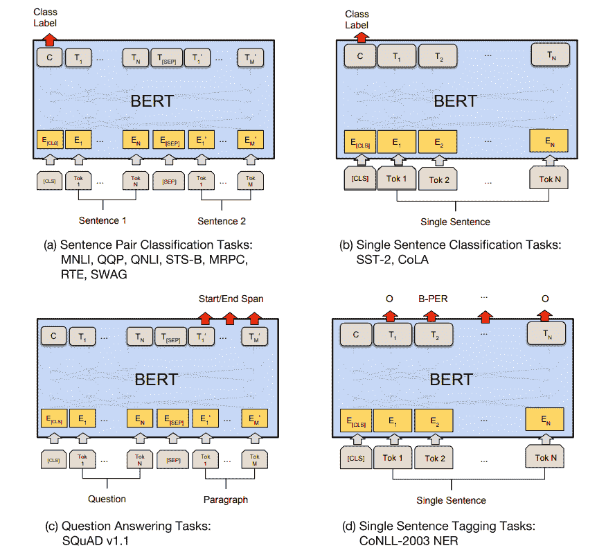

# 用于自然语言处理的 BERT 变换器

> 原文：<https://blog.paperspace.com/bert-natural-language-processing/>


Photo by [Ugur Akdemir](https://unsplash.com/@ugur?utm_source=ghost&utm_medium=referral&utm_campaign=api-credit) / [Unsplash](https://unsplash.com/?utm_source=ghost&utm_medium=referral&utm_campaign=api-credit)

人工智能的辉煌，尤其是在深度学习的子领域，一直在不断前进，随着进步的加速，每个月都有无数的成就。我的许多文章主要关注深度学习的两个重要子领域:即计算机视觉和自然语言处理(NLP)。NLP 侧重于语言任务、语法和对语言的语义理解。我们利用深度学习模型来确保我们可以提出一种模式，让人工智能解码复杂的细节和特定文本或句子上下文的特定模式。为此，自该领域开始以来，已经开发了许多方法，旨在解决一些主要的 NLP 问题，例如文本分类、语言翻译(机器翻译)、聊天机器人以及其他类似的任务。

解决这类任务的一些流行方法包括序列对序列模型、注意力机制的应用、变形器和其他类似的流行技术。在本文中，我们的主要焦点是变压器的一个更成功的变体，来自变压器的双向编码器表示(BERT)。我们将理解入门所需的大多数基本概念，并利用这个 BERT 体系结构来计算自然语言处理问题的解决方案。下面的目录显示了我们将在这篇博文中讨论的特性列表。对于并行运行代码，我建议使用 Paperspace 上的渐变平台。

## 简介:



[Image Source](https://arxiv.org/pdf/1810.04805.pdf)

大多数与自然语言处理相关的任务最初都是在简单的 LSTMs(长短期记忆)网络的帮助下解决的。这些层可以相互叠加，形成矢量单词的学习过程。然而，这些网络本身不足以产生高质量的结果，并且在需要更高精度的任务和项目中失败，例如神经机器翻译和文本分类任务。简单 LSTMs 失败的主要原因是它们是缓慢而笨重的网络。此外，LSTM 的任何变体都不是完全双向的。因此，当我们在学习过程中前进时，单词向量的上下文和真正含义就丢失了。

这些任务中的一项突破性变革发生在 2017 年，推出了变压器。这些变压器网络发表在“ [Attention is all you need](https://arxiv.org/abs/1706.03762) ”研究论文中，以其独特的方法来解决简单 LSTM 架构中先前存在的问题，从而彻底改变了自然语言处理的世界。在我以前的一篇文章中，我们已经非常详细地介绍了变形金刚的概念。我强烈推荐通过下面的[链接](https://blog.paperspace.com/transformers-text-classification/)来看看这篇博客。在下一节中，我们将进一步了解变压器网络和 BERT 架构之间的密切关系。

然而，现在值得注意的是，当我们堆叠变压器网络的一堆解码器层而忽略变压器的编码器网络时，我们将获得*生成预训练变压器(GPT)* 模型。这种流行的架构在 GPT-2 和 GPT-3 网络中有了更多的变化，并在以前的版本中不断改进。然而，如果我们忽略变压器的解码器网络并堆叠变压器模型的编码器部分，我们将从变压器(BERT) 获得*双向编码器表示。在接下来的部分，我们将更详细地了解 BERT 变压器的工作机制，通过它我们可以轻松解决许多问题。*

* * *

## 了解 BERT 变压器:



[Image Source](https://arxiv.org/pdf/1810.04805.pdf)

与简单的 LSTM 网络不同，伯特变换器能够以更加复杂的方式理解语言。在变压器架构中，单独的编码器网络和解码器模块都具有理解语言的能力。因此，这些层中的任何一层的叠加都会产生这样一种场景，其中所产生的网络能够理解和学习语言。但是，问题是这些 BERT 模型究竟是如何被训练和利用来执行各种自然语言处理任务的。

BERT 的训练过程主要包括两个阶段，即 BERT 模型的预训练和 BERT 模型的微调。在预训练步骤中，我们的主要目标是教会我们的 BERT 模型对语言的理解。这个过程是通过使用半监督学习方法来完成的:在从网络或其他资源收集的大量信息上训练数据。在 BERT 模型的预训练步骤中，同时运行两个任务，包括掩蔽语言模型(MLM)和下一句预测(NSP)以理解上下文(或语言)。

在掩蔽语言模型(MLM)中，我们利用掩蔽来隐藏句子中的一些数据(大约 15%)，以使模型更好地理解句子的上下文。目标是输出这些屏蔽的标记，以通过利用双向性来实现期望的语言理解。在下一个句子预测(NSP)的情况下，BERT 模型考虑两个句子，并确定第二个句子是否是第一个句子的适当后续。

在预训练的帮助下，BERT 模型能够实现对上下文和语言的理解。然而，为了将它用于我们试图执行的特定任务，我们需要进行第二步微调。在微调 BERT 模型时，我们用新的层网络替换了完全连接的输出层。BERT 模型的微调步骤是一个监督学习任务，我们训练模型来完成特定的任务。

由于网络已经被预先训练，微调步骤将相对更快，因为只有新的网络必须被训练，而其他权重被相应地稍微修改(微调)用于特定项目。我们将在本文的应用部分讨论这些具体任务。现在，让我们继续与 BERT 一起开发一个评审分数分类项目。

* * *

## 使用 TensorFlow-Hub 与 BERT 一起开发项目:

在本文的这一部分，我们将详细探讨如何加载 TensorFlow Hub 提供的预训练 BERT 模型，并向该 BERT 模型添加额外的迁移学习层，以构建文本分类项目。在本文中，我们将利用 TensorFlow 和 Keras 深度学习框架。如果你不熟悉这两个库，我强烈推荐你去看看我以前的博客中的这两个库，或者快速温习一下这些主题。你可以查看下面的[文章](https://blog.paperspace.com/absolute-guide-to-tensorflow/)来了解更多关于 TensorFlow 和 Keras 文章[这里](https://blog.paperspace.com/the-absolute-guide-to-keras/)。让我们通过导入必要的库来开始创建 BERT 工作管道。

### 导入所需的库:

TensorFlow 深度学习框架以及 TensorFlow Hub 导入是这个项目的精髓。TensorFlow Hub 库使开发人员能够加载预训练的模型，以便进一步微调和部署众多项目。我们还将导入一些额外的层，这些层将添加到 BERT 模型的合并输出层，并使用这些更改来创建迁移学习模型，以执行文本分类任务。

我们还将使用一些额外的回调来保存训练好的模型，并使用张量板可视化性能。此外，还使用了一些其他的基本导入，如 NumPy 库、用于访问系统组件的 os 库、用于调节正则表达式操作的 re，以及用于过滤掉不必要注释的警告。

```py
#Importing the essential libraries

import tensorflow as tf
import tensorflow_hub as hub
from tensorflow.keras.models import Model
from tensorflow.keras.layers import Input, Dense, Activation, Dropout, Flatten
from tensorflow.keras.layers import BatchNormalization, Conv2D, MaxPool2D
from tensorflow.keras.models import Model, Sequential
from tensorflow.keras.callbacks import ModelCheckpoint, ReduceLROnPlateau
from tensorflow.keras.callbacks import LearningRateScheduler, TensorBoard
from datetime import datetime
from sklearn.metrics import roc_auc_score
import numpy as np
import pandas as pd
from tqdm import tqdm
import os
import re
import warnings
warnings.filterwarnings("ignore")
```

### 准备数据集:

我们将利用从以下 [Kaggle](https://www.kaggle.com/datasets/snap/amazon-fine-food-reviews) 链接获得的*亚马逊美食评论*数据集。下面是对数据集及其相应代码片段的简要描述，以便阅读和理解数据。确保该文件位于构建项目的工作目录中。

> 这个数据集由亚马逊的美食评论组成。这些数据跨越了 10 多年的时间，包括截至 2012 年 10 月的所有约 500，000 篇评论。评论包括产品和用户信息、评级和纯文本评论。它还包括所有其他亚马逊类别的评论。
> - [卡格尔](https://www.kaggle.com/datasets/snap/amazon-fine-food-reviews)

```py
#Read the dataset - Amazon fine food reviews
reviews = pd.read_csv("Reviews.csv")

#check the info of the dataset
reviews.info()
```

在下一步中，我们将过滤掉任何不必要的“非数字”(NAN)值，同时只检索文本信息及其各自的分数。

```py
# Retrieving only the text and score columns while drop NAN values

reviews = reviews.loc[:, ['Text', 'Score']]
reviews = reviews.dropna(how='any')
reviews.head(1)
```



在下一步中，我们将通过省略中性分数，将文本数据的分数转换为只有负面或正面评论的二元分类任务。中性分数，即值为 3 的分数被移除。由于这是一个关于自然语言处理的二元分类任务，我们尽量避免中性评论。所有小于 2 的分数都被认为是负面评价，所有大于 3 的分数都被认为是正面评价。

```py
reviews.loc[reviews['Score'] <= 2, 'Score'] = 0 
reviews.loc[reviews['Score'] > 3, 'Score'] = 1
reviews.drop(reviews[reviews['Score']==3].index, inplace=True)

reviews.shape
```

```py
(525814, 2) 
```

在下一步中，我们将对数据集执行一些必要的预处理。我们将创建两个函数。第一个函数将使我们能够只检索前 50 个单词，第二个函数将允许我们删除训练过程中不需要的一些不必要的字符。我们可以调用函数并获得新的数据集。下面是预处理后的代码块和样本数据集。

```py
def get_wordlen(x):
    return len(x.split())
reviews['len'] = reviews.Text.apply(get_wordlen)
reviews = reviews[reviews.len<50]
reviews = reviews.sample(n=100000, random_state=30)

def remove_html(text):
    html_pattern = re.compile('<.*?>')
    return html_pattern.sub(r'', text)

text=reviews['Text']
preprocesstext=text.map(remove_html)
reviews['Text']=preprocesstext

#print head 5
reviews.head(5)
```



下面是用分层抽样和特定随机状态分割数据的代码块。分层抽样分裂允许我们在训练和测试数据中保持 0 和 1 的平衡计数，即保持适当的二进制组成。随机状态规范允许我们跨各种系统和平台以不变的方式更容易地跟踪结果。下面是分割数据集及其各自的训练和测试图的代码片段。

```py
# Split the data into train and test data(20%) with Stratify sampling and random state 33 

from sklearn.model_selection import train_test_split
X = reviews['Text']
y = reviews["Score"].values
X_train, X_test, y_train, y_test = train_test_split(X, y, test_size=0.20, stratify=y, random_state = 33)
```



Image by Author

最后，在执行完本节中的所有步骤后，您可以将数据以预处理的 CSV 文件的形式保存到工作目录中，以便在需要时进行任何进一步的计算。

```py
# Saving to disk. if we need, we can load preprocessed data directly. 
reviews.to_csv('preprocessed.csv', index=False)
```

* * *

### 开发 BERT 模型:

对于这个项目，我们将使用 BERT 无案例模型，您可以从以下 TensorFlow Hub [网站](https://tfhub.dev/tensorflow/bert_en_uncased_L-12_H-768_A-12/4)获得该模型。它使用 L=12 个隐藏层(即变压器块)，隐藏大小 H=768，A=12 个注意头。如前一节所述，在使用预训练的 BERT 模型时，我们还将传递屏蔽输入。我们可以从 BERT 模型中检索所需的输出，并继续对其执行进一步的迁移学习操作。

```py
## Loading the Pretrained Model from tensorflow HUB
tf.keras.backend.clear_session()

max_seq_length = 55

# Creating the necessary requirements
input_word_ids = tf.keras.layers.Input(shape=(max_seq_length,), dtype=tf.int32, name="input_word_ids")
input_mask = tf.keras.layers.Input(shape=(max_seq_length,), dtype=tf.int32, name="input_mask")
segment_ids = tf.keras.layers.Input(shape=(max_seq_length,), dtype=tf.int32, name="segment_ids")

#bert layer 
bert_layer = hub.KerasLayer("https://tfhub.dev/tensorflow/bert_en_uncased_L-12_H-768_A-12/1", trainable=False)
pooled_output, sequence_output = bert_layer([input_word_ids, input_mask, segment_ids])

bert_model = Model(inputs=[input_word_ids, input_mask, segment_ids], outputs=pooled_output)
bert_model.summary()
```

```py
Model: "model"
__________________________________________________________________________________________________
 Layer (type)                   Output Shape         Param #     Connected to                     
==================================================================================================
 input_word_ids (InputLayer)    [(None, 55)]         0           []                               

 input_mask (InputLayer)        [(None, 55)]         0           []                               

 segment_ids (InputLayer)       [(None, 55)]         0           []                               

 keras_layer (KerasLayer)       [(None, 768),        109482241   ['input_word_ids[0][0]',         
                                 (None, 55, 768)]                 'input_mask[0][0]',             
                                                                  'segment_ids[0][0]']            

==================================================================================================
Total params: 109,482,241
Trainable params: 0
Non-trainable params: 109,482,241
__________________________________________________________________________________________________ 
```

一旦我们获得了预训练的 BERT 模型，我们就可以继续对可用数据进行一些最终的符号化，并开发最终的模型，该模型将被微调以有助于我们旨在实现的特定任务。

### 符号化:

在下一步中，我们将对数据集执行标记化操作。为了计算这个特定的动作，有必要从下面的官方 [GitHub](https://github.com/google-research/bert/blob/master/tokenization.py) 链接下载一个名为 tokenization.py 的预处理文件(在 Gradient 中使用终端对原始文件使用`wget`)。一旦我们下载了下面的文件并把它放在工作目录中，我们就可以把它导入到我们的主项目文件中。在下面的代码块中，我们将较大的数据转换成对 BERT 模型有用且可理解的较小信息块。

我们在标记的开始和结束分别标记评论和[CLS](分类)和[SEP](分隔符)操作。这样做将有助于 BERT 模型区分每个句子的开头和结尾，这通常在二进制分类或下一句预测项目中很有用。我们还可以添加一些额外的填充以避免形状不匹配，最后，继续创建训练和测试数据，如下面的代码块所示。

```py
#getting Vocab file
vocab_file = bert_layer.resolved_object.vocab_file.asset_path.numpy()
do_lower_case = bert_layer.resolved_object.do_lower_case.numpy()

#import tokenization from the GitHub link provided
import tokenization

tokenizer = tokenization.FullTokenizer(vocab_file, do_lower_case)

X_train=np.array(X_train)
# print(X_train[0])
X_train_tokens = []
X_train_mask = []
X_train_segment = []
X_test_tokens = []
X_test_mask = []
X_test_segment = []

def TokenizeAndConvertToIds(text):
    tokens= tokenizer.tokenize(reviews) # tokenize the reviews
    tokens=tokens[0:(max_seq_length-2)] 
    tokens=['[CLS]',*tokens,'[SEP]'] # adding cls and sep at the end
    masked_array=np.array([1]*len(tokens) + [0]* (max_seq_length-len(tokens))) # masking 
    segment_array=np.array([0]*max_seq_length)
    if(len(tokens)<max_seq_length):
        padding=['[PAD]']*(max_seq_length-len(tokens)) # padding
        tokens=[*tokens,*padding]
    tokentoid=np.array(tokenizer.convert_tokens_to_ids(tokens)) # converting the tokens to id
    return tokentoid,masked_array,segment_array

for reviews in tqdm(X_train):
    tokentoid,masked_array,segment_array=TokenizeAndConvertToIds(reviews)
    X_train_tokens.append(tokentoid)
    X_train_mask.append(masked_array)
    X_train_segment.append(segment_array)

for reviews in tqdm(X_test):
    tokentoid,masked_array,segment_array=TokenizeAndConvertToIds(reviews)
    X_test_tokens.append(tokentoid)
    X_test_mask.append(masked_array)
    X_test_segment.append(segment_array)

X_train_tokens = np.array(X_train_tokens)
X_train_mask = np.array(X_train_mask)
X_train_segment = np.array(X_train_segment)
X_test_tokens = np.array(X_test_tokens)
X_test_mask = np.array(X_test_mask)
X_test_segment = np.array(X_test_segment)
```

一旦您成功地创建了所有的令牌，将它们保存在 pickle 文件中是一个好主意，以便为任何需要的未来计算重新加载它们。您可以从下面的代码片段中做到这一点，其中显示了转储和加载功能。

```py
import pickle

# save all your results to disk so that, no need to run all again. 
pickle.dump((X_train, X_train_tokens, X_train_mask, X_train_segment, y_train),open('train_data.pkl','wb'))
pickle.dump((X_test, X_test_tokens, X_test_mask, X_test_segment, y_test),open('test_data.pkl','wb'))

# you can load from disk
X_train, X_train_tokens, X_train_mask, X_train_segment, y_train = pickle.load(open("train_data.pkl", 'rb')) 
X_test, X_test_tokens, X_test_mask, X_test_segment, y_test = pickle.load(open("test_data.pkl", 'rb')) 
```

### 在 BERT 上训练迁移学习模型；

一旦我们完成了数据的预处理、BERT 模型的预训练和数据的符号化，我们就可以通过开发我们的微调架构模型来创建迁移学习模型。首先，让我们通过传递标记、掩码和它们各自的段来获得训练数据的输出。

```py
# get the train output with the BERT model
X_train_pooled_output=bert_model.predict([X_train_tokens,X_train_mask,X_train_segment])
```

类似地，我们也将使用 BERT 模型对测试数据进行预测，如下面的代码片段所示。

```py
# get the test output with the BERT model
X_test_pooled_output=bert_model.predict([X_test_tokens,X_test_mask,X_test_segment])
```

下一步，我们可以使用 pickle 库来存储预测。请注意，前两个预测步骤可能需要一点时间来运行，这取决于您的系统硬件。一旦您成功地保存了预测输出并将它们转储到 pickle 文件中，您就可以注释掉该语句。然后，您可以再次使用 pickle 库为任何未来的计算加载数据。

```py
# save all the results to the respective folder to avoid running the previous predictions again. 
pickle.dump((X_train_pooled_output, X_test_pooled_output),open('final_output.pkl','wb'))

# load the data for second utility
X_train_pooled_output, X_test_pooled_output= pickle.load(open('final_output.pkl', 'rb'))
```

我们将创建一个自定义架构，作为微调层添加到预训练的 BERT 模型中。我们将添加一个具有 768 个输入要素的输入图层、一个指定了参数的密集图层、一个批量归一化图层和一个展平图层。我们将最终使用三个背靠背完全连接的层来完成网络。

最终的输出层将利用具有一个输出节点的 sigmoid 激活函数，因为这是一个二元分类任务，我们需要预测结果输出是正还是负。我使用了函数式 API 类型建模来允许对层和架构构建进行更多的控制。在这个步骤中也可以使用序列建模结构。

```py
# input layer
input_layer=Input(shape=(768,), name='input_layer') 

# Dense layer
layer1 = Dense(50,activation='relu',kernel_initializer=tf.keras.initializers.RandomUniform(0,1), name='layer1')(input_layer) 

# MaxPool Layer
Normal1 = BatchNormalization()(layer1)

# Flatten
flatten = Flatten(data_format='channels_last',name='Flatten')(Normal1)

# FC layer
FC1 = Dense(units=30,activation='relu',kernel_initializer=tf.keras.initializers.glorot_normal(seed=32),name='FC1')(flatten)

# FC layer
FC2 = Dense(units=30,activation='relu',kernel_initializer=tf.keras.initializers.glorot_normal(seed=33),name='FC2')(FC1)

# output layer
Out = Dense(units=1,activation= "sigmoid", kernel_initializer=tf.keras.initializers.glorot_normal(seed=3),name='Output')(FC2)

model = Model(inputs=input_layer,outputs=Out)
```

一旦迁移学习微调模型被创建，我们可以调用一些必要的回调来保存我们的模型并相应地监控结果。然而，由于培训过程非常快，一些这样的回访可能是不必要的。我们将监控该模型的 AUROC 分数，因为它更准确地描述了所获得的结果。

```py
checkpoint = ModelCheckpoint("best_model1.hdf5", monitor='accuracy', verbose=1,
    save_best_only=True, mode='auto', save_freq=1)

reduce = ReduceLROnPlateau(monitor='accuracy', factor=0.2, patience=2, min_lr=0.0001, verbose = 1)

def auroc(y_true, y_pred):
    return tf.py_function(roc_auc_score, (y_true, y_pred), tf.double)

logdir = os.path.join("logs", datetime.now().strftime("%Y%m%d-%H%M%S"))
tensorboard_Visualization = TensorBoard(log_dir=logdir, histogram_freq=1)
```

最后，我们可以编译和训练模型。对于编译，我们将利用 Adam 优化器、二进制交叉熵损失以及准确性和 AUROC 指标。我们将用 300 的批处理大小和下面代码块中提到的必要回调来训练 10 个时期的模型。

```py
model.compile(optimizer='adam', loss='binary_crossentropy', metrics=['accuracy', auroc])

model.fit(X_train_pooled_output, y_train, 
          validation_split=0.2, 
          epochs=10, 
          batch_size = 300,
          callbacks=[checkpoint, reduce, tensorboard_Visualization])
```

下面是我们为了更好的概念理解而构建的模型的图。该网络构建在 BERT 架构之上，作为执行文本分类特定任务的微调步骤。

```py
tf.keras.utils.plot_model(
    model, to_file='model1.png', show_shapes=False, show_layer_names=True,
    rankdir='TB', expand_nested=False, dpi=96
)
```



Image by Author

在下一步中，我们将可视化模型的训练过程的性能。我们将使用张量板的神奇功能，并指定存储在当前工作目录中的日志文件夹的路径。运行外部张量板扩展时，我们可以查看各种图表。然而，我们关心的是 AUROC 分数，因为它代表了我们模型性能的最准确描述。下面是以下任务的图表。

```py
%load_ext tensorboard

%tensorboard --logdir logs
```



Image by Author

我建议尝试 BERT 模型的许多迭代和变化，看看哪种类型的模型最适合您的特定用例。在本节中，我们讨论了如何使用 BERT 模型来解决二进制文本分类问题。但是，BERT 的应用并不局限于这个任务。在接下来的部分中，我们将进一步探索 BERT 的更多应用。

* * *

## BERT 的应用:



[Image Source](https://arxiv.org/pdf/1810.04805.pdf)

伯特变压器有许多应用。总结一下这些网络是如何工作的，我们有一个预先训练好的 BERT 模型，可以用来解决各种各样的任务。在第二步中，我们添加微调层，这些层将确定我们试图在 BERT 模型的帮助下执行的任务或应用程序的类型。让我们看看 BERT 的一些更受欢迎的应用:

1.  **文本分类**——在本文中，我们讨论如何使用 BERT transformer 进行文本分类。最终的 BERT 模型相应地用最终的 sigmoid 激活函数进行微调，以产生任何给定句子的二元分类输出。
2.  **问答任务** -我们还可以使用 BERT 模型执行问答搜索。[CLS]和[SEP]标记可以用在问题的开头和结尾，而其他段落则代表答案。我们可以相应地训练模型来执行这样的任务。
3.  神经机器翻译(Neural Machine Translation)-BERT 模型对于机器翻译任务也很有用，该架构可以用来将一种语言输入的信息翻译成另一种语言。我们可以用特定的语言输入来训练模型，使其得到适当的翻译输出。
4.  **情感分析**——类似于文本分类，我们可以使用 BERT 模型对多种情感进行分类。我们可以对情绪进行分类，如积极、消极或中性，以及通过正确的数据环境扩展到人类表现出的其他一些情绪，以执行这样的项目。

除了这四个主要应用之外，还有许多更自然的语言处理应用，其中可以利用 BERT 模型来实现期望的结果。这个领域非常广阔，有各种各样的任务和项目要做。我建议观众查看更多的应用程序，并尝试本文中已经提到的应用程序。

* * *

## 结论:


Photo by [Alfons Morales](https://unsplash.com/@alfonsmc10?utm_source=ghost&utm_medium=referral&utm_campaign=api-credit) / [Unsplash](https://unsplash.com/?utm_source=ghost&utm_medium=referral&utm_campaign=api-credit)

随着社交媒体的急剧崛起，人工智能的力量，特别是在深度学习的分支中，正处于历史最高水平。这些深度学习模型产生和计算解决 NLP 问题的有效解决方案的要求，对于公司改进其产品至关重要。虽然在深度学习的早期，使用简单的 LSTM 架构很难对抗和处理与 NLP 相关的任务，但随着 transformer 网络的引入，在 2017 年和 2018 年期间出现了一个革命性的时期。在这个时代，建立了多种语言模型来产生高效的结果，包括 BERT 模型。

在本文中，在继续解释来自变压器(BERT) 的*双向编码器表示的工作背后的工作概念之前，我们简要介绍了具有深度学习的 NLP 的历史。我们检查了它们功能的详细机制，然后继续查看这些模型可以执行得最好的自然语言处理任务的类型。在对 BERT 架构有了基本了解之后，我们在 TensorFlow-Hub 的帮助下构建了一个 BERT 模型来执行文本分类的任务，产生了非常好的结果。最后，我们分析了现代工业用来实现高质量结果的 BERT 的一些最重要的应用。*

在以后的文章中，我们将看到一些更有效的方法，用于解决与深度学习的自然语言处理相关的问题和项目。我们还将着眼于其他基于循环 gan 的生成性对抗网络的项目，并在第 2 部分从头开始更深入地研究神经网络的构造。在那之前，享受学习和编程 AI 项目吧！

你可以用这篇博文中的所有代码创建一个渐变笔记本，方法是将这个 [URL](https://github.com/gradient-ai/BERT-TensorFlow) 粘贴到渐变笔记本创建页面的高级设置部分的“Workplace URL”字段中。