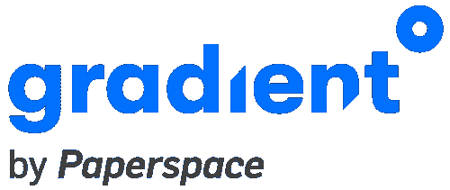
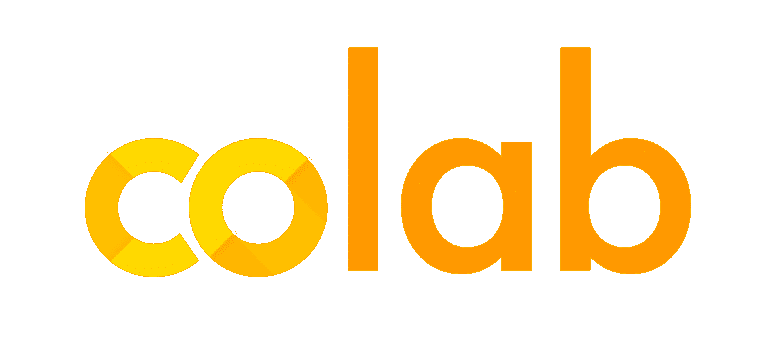

# 2022 年最好的 Kaggle 替代品

> 原文：<https://blog.paperspace.com/the-best-kaggle-alternatives-in-2022/>

Jupyter 类似笔记本的环境仍然是大多数数据科学家、机器学习工作者和爱好者参与和探索数据集和深度学习包的标准起点。许多 ML ops 平台提供他们自己的打包的、类似 Jupyter 的 IDE 来帮助用户容易地直接跳转到处理他们平台上的数据。这些都有很多有用的特性，比如云存储、版本控制、模型保存，以及其他各种帮助用户充分利用平台的特性。

对于许多用户来说，谷歌的 Kaggle 是数据科学家在互联网上的首要社交和学习平台。Kaggle 的主要特点是，它为用户提供了一个强大的环境，可以上传数据集和代码，并与其他用户共享。然后，他们可以使用他们的笔记本工具操作、处理和执行机器和深度学习任务，并免费访问 P100 GPU 和谷歌 TPUs。

虽然 Kaggle 是一个非常有用的工具，可以用来查找数据和进行一些初步探索，但我们发现，GPU 硬件的可访问性导致的限制意味着 Kaggle 对于任何计算成本高昂或耗时的深度学习任务来说往往都远非理想。这启发我们进一步观察这个平台，然后观察一些竞争对手，看看我们是否能发现用户可能会在 Kaggle 的哪里找到缺点，然后利用这些发现提出替代方案。在这篇博客文章中，我们将首先提出一些用户可能不想使用 Kaggle 平台的原因，讨论用户应该在高质量平台中寻找的品质，并以一些减轻了我们发现的问题的高质量替代网站结束。

## 为什么会考虑 Kaggle 之外的其他平台？

#### GPU 限制

所有 Kaggle 笔记本都运行在[P100 GPU](https://www.kaggle.com/docs/efficient-gpu-usage)上。 [P100 是英伟达 2016 年发布的数据中心(原特斯拉)GPU](https://www.nvidia.com/content/dam/en-zz/Solutions/Data-Center/tesla-p100/pdf/nvidia-tesla-p100-datasheet.pdf) ，采用 Pascal 微架构。这曾经是特斯拉的第一个 GPU，但 Pascal 架构自发布以来已经改进了几次。当与许多其他 ML ops 平台上可用的安培，RTX 和沃尔特 GPU 相比时，P100 经常被发现缺乏。

#### 会话时间限制

对于 CPU 和 GPU 笔记本会话，Kaggle 笔记本上的每个会话的执行时间限制为 12 小时，对于 TPU 笔记本会话，执行时间限制为 9 小时。还有一个额外的限制，即每个用户每周允许的总 GPU 时间为 30 小时，总 TPU 时间为 20 小时。

#### 缺乏部署能力

虽然 Kaggle 笔记本电脑完全能够执行深度学习模型的培训和评估，但部署则是另一回事。如果用户希望将他们的工作部署到另一个服务的端点上，那么他们将不得不直接从 Kaggle 下载他们的工作。

#### 未配置的环境

所有 Kaggle 笔记本都从同一个通用容器开始。这个容器预装了许多流行的深度学习、机器学习和相邻的数据处理库，以便在平台内使用。用户被锁定使用这个容器，这限制了通过更轻的容器进行优化，以及定制选项。如果用户试图安装一个额外的库，与预安装的包发生冲突，这也可能会影响用户体验。

## 在 ML 操作平台中寻找什么？

基于上述详细信息，Kaggle 并不总是许多给定深度学习任务的理想平台。尽管由于其完全免费的服务、对 P100s 的访问以及类似协作环境的社交媒体，它对于业余爱好者、学生和初学者来说是一个非常棒的地方，但当涉及到企业级生产时，它与许多竞争对手相比受到了影响。现在，我们已经了解了使 Kaggle 不太适合专业数据科学家的问题，让我们考虑一下在选择像 Kaggle 这样的托管 Jupyter 笔记本服务时可能需要考虑的一些因素:

#### 不间断服务

Kaggle 在这个功能上做得很好，但前提是训练时间在他们规定的时间限制之内。像大多数计算机视觉模型一样，寻求使用需要长训练时间的模型的用户会希望寻求替代方案。

在考虑其他产品时，考虑一下你的培训在新环境中能持续多久。生产级 EDA、模型训练和评估的稳健设置将考虑到 DL 模型可能需要达到适当功效的漫长期限。总的限制也是有问题的，因为很多时候模型在第一次训练后并不完善。

#### 持久环境

Kaggle 笔记本文件确实会跨会话保存，但只有当您[选择全部运行并保存选项](https://www.kaggle.com/questions-and-answers/207185)时，数据才会保存在持久存储中。此外，如果我们想使用 Kaggle 上的一个笔记本，必须将它的数据下载到本地并重新上传到另一个笔记本的工作目录中。

我们的工作、数据和文件如何在不同的用户会话中保持不变？我们选择的环境需要能够在每次会话后重新访问而不丢失工作。这也有助于实现基本的版本控制。

#### 储存；储备

Kaggle 最出名的可能是它的数据存储和数据集共享功能。这些在很大程度上促成了 Kaggle 经常举办的著名比赛。用户可以通过每台笔记本电脑访问大量不同的公开共享数据集，并且文件组织非常简单易用。虽然这很方便，但所有数据集(除了一些比赛)的大小都被限制在 20 GB。这使得在 Kaggle 上处理大数据变得复杂，单个大数据集需要多个 20 GB 的数据集页面，如果需要使用大数据集，用户应该考虑内置存储更多的平台，如 MS-COCO。

我们可以上传多少数据用于模型训练？考虑存储的限制，以及在一定程度上工作记忆的限制，以及它们如何影响我们实现高质量模型训练的能力

#### 硬件选择和种类

Kaggle 和它的一些竞争对手如 Colab 的最大问题是硬件限制。虽然 P100 对于深度学习来说是一个非常有用的 GPU，但与更现代的微体系结构(如 Ampere 或 Volta)相比，支持 GPU 进程的软件已经非常过时。

在为我们的深度学习任务选择平台之前，我们需要评估我们是否可以选择一台具有正确硬件的机器来完成我们的任务。如果我们有会话时间限制，由于 RAM 或吞吐量不足而无法训练我们的模型，可能会迫使用户不得不在不方便的时候重新开始他们的工作，或者完全失去进度。

## 2022 年最佳 Kaggle 替代品

现在我们知道了在 ML ops 平台中应该寻找什么，Kaggle 在哪里做得好，在哪里挣扎，我们可以开始确定 2022 年互联网上可用的最佳替代方案。以下是建议试用的平台列表。以下托管 Jupyter 环境在上述一个或所有方面都优于 Kaggle 笔记本电脑:

### 图纸空间梯度

Gradient 是一个端到端的 MLOps 平台，包括一个[免费托管的 Jupyter 笔记本服务](https://gradient.paperspace.com/free-gpu)，有许多预配置环境和免费 GPU 和 CPU 的选项，以及我们对 2022 年 Kaggle 最佳替代方案的选择。付费用户可以从这些机器类型的大量列表中进行选择，包括大量免费使用 GPU 驱动的实例，如付费订阅用户的 RTX4000、P5000 和 M4000，并且可以根据需要运行笔记本电脑。还提供完全免费的 GPU 笔记本，以及付费的实例，机器类型一直到任何云虚拟机服务的最佳可用[:8 个 A100 - 80 GB 的多 GPU 实例。](https://blog.paperspace.com/new-ampere-gpus/)

Gradient 通过其三个主要的数据科学工具简化了深度学习模型的开发、培训和部署:笔记本、工作流和部署。它们各自执行不同的任务，但笔记本电脑是 Kaggle 笔记本电脑的可比产品。例如，每个笔记本实例都有 50 GB 的保证存储，不间断服务的保证，以及跨启动的持久文件存储。然后，工作流可用于版本化、评估和上传模型和数据到平台，而部署用于将训练好的模型部署到 API 端点。Gradient 还具有强大的 SDK 和 CLI。

Gradient 的一个优点是，它为从初学者到专业人员的所有级别的工作人员提供了有价值的功能，其直观的 web UI 和极低的入门门槛反过来又与高功能平台配合使用。爱好者可以利用梯度的免费 GPU 机器和易于使用的速度。人工智能课程，而专业数据科学家可以在 Gradient 平台内进行实验、训练模型、扩展能力和部署。Gradient 真正满足了双方的需求，而没有牺牲任何一组用户成功所需的功能或体验。

与 Google Colab 相比，Gradient 的一些优势包括:

*   **会话得到保证:** Gradient 笔记本用户永远不必担心他们的实例在工作中关闭。他们也不需要一直保持联系。可以在笔记本上开始一个培训会话，注销，转到其他地方，重新登录，然后继续使用继续运行代码的笔记本工作
*   **预先配置的容器和模板:**用户可以从 Gradient 预先选择的环境中进行选择，为他们的笔记本容器预装流行的深度学习框架依赖项，他们甚至可以通过笔记本的高级设置使用他们自己的自定义容器上传到 Dockerhub
*   **R 兼容性:**和 Kaggle 一样，用户可以通过选择 R 笔记本栈运行时，在渐变笔记本上执行 R 代码。
*   **公共数据集:**一个流行的公共数据集存储库可安装在任何渐变笔记本上。安装过程非常快，选择的种类也不断增加
*   **可扩展性:** Gradient 可轻松实现纵向扩展:根据需要，在同一环境中添加更多存储或更多强大的 GPU
*   **全 ML 管道:** Gradient 包含全 ML 管道的集成特性。这些包括版本控制、平台上的模型保存库，以及通过单击鼠标直接部署这些保存的模型的能力
*   **轻松协作:**团队可以轻松地实时一起处理项目，项目可以将工作分散到每个团队中有组织的工作区
*   **免费的 GPU 笔记本:**虽然不是所有的笔记本都是免费的，但是所有付费计划级别的用户都可以在 Gradient 上访问免费的 M4000 GPUs。付费层可以访问更强大的 GPU，而无需任何额外的每分钟费用，包括 P5000s、RTX5000s，甚至未来的 A100s
*   **Github 集成:** Github 与 Gradient 的集成允许用户随着工作的进展积极地版本化和更新他们的代码库
*   **积极而有益的支持:**paper space 响应团队致力于确保用户获得最佳体验。除了对产品非常了解之外，他们还能快速响应，并尽最大努力改善用户可能看到的任何问题

由于 Paperspace Gradient 的多功能性、强大功能和强健的构建，我们建议企业级和专业级用户使用它，他们正在寻找一个具有过多附加功能的更好版本的 Kaggle。

### Google Colab

Colab 是另一个用于深度学习的谷歌产品，它是通过合作努力和与谷歌产品的集成而创建的。Colab 是一个免费使用的 IDE，用于在 cells 中执行 Python 代码。它是最受学生和爱好者欢迎的 ML 入门平台之一，还有 Kaggle。

与竞争对手相比，Colab 的特点是启动速度极快，环境一般化，缺乏定制选项，意外关机的可能性更高。在环境中开始、加载和测试代码片段以及训练玩具模型都很容易，但处理大数据和相应的大型深度学习模型却很困难。这种影响在某种程度上因其与 Google Drive 的强集成而得到缓解，但 Drive 并不总是存储深度学习数据的理想位置。实际上，这使得 Colab 成为一个玩弄各种 Python 代码的神奇沙盒，但它缺乏能力和冗长的定时会话，而这将实现更高级的模型训练。

像 Kaggle 一样，Colab 用户不能选择他们的机器类型，除了是否使用额外的机器类型，在他们的情况下是 TPUs 和 GPU。另外值得注意的是，Colab 不再发布平台上有哪些[GPU 的信息，但过去他们会将 V100s、P100s、K80s 和 T4s 的访问权限提供给用户。Colab 的付费 Pro 和 Pro +版本对更好的 GPU 给予更高的优先级，但用户永远无法自行选择，许多用户报告称，即使在更高的](https://colab.research.google.com/signup)[层级](https://www.reddit.com/r/GoogleColab/comments/pcjoyo/caolab_pro_now_only_gives_you_t4_and_sometimes/)[付费](https://www.reddit.com/r/GoogleColab/comments/plk29z/a_week_now_without_access_to_v100_on_pro_wtf/) [计划](https://www.reddit.com/r/GoogleColab/comments/pnjbpa/only_getting_k80_t4_and_p4_on_colab_pro/)(单击每个单词/链接查看不同的用户报告)中，也从未获得更强大的 GPU。然而，与 Kaggle 不同的是，实际上有各种潜在的 GPU 选择，因此用户仍有机会获得更好的选择，如强大的 V100。

Colab 是 Kaggle 的一个很好的替代品，并且可能是在功能上最接近 Kaggle 的，这要归功于他们对简化环境的共同关注。由于没有每周 GPU 和 TPU 运行时限制，它甚至可能是更好的选择。也就是说，如果你想要一个像 V100 这样强大的 GPU，那么首先去亚马逊 Sagemaker 或 Paperspace Gradient 可能会更好，因为在那里它们会得到保证(尽管这可能因地区而异)。即便如此，Kaggle 的 P100s 通常也会超过 Colab 用户可能使用的 K80。

### 亚马逊 SageMaker

亚马逊 SageMaker 可能是企业数据科学领域最知名的端到端机器学习平台。SageMaker 拥有众多额外的功能，使这款强大的产品与 Kaggle 区别开来。从数据标签等预处理辅助工具到培训和部署能力，所有这些都在 Jupyter Labs 这样的环境中进行。SageMaker 还提供了第二个最强大的、第一个最多样化的 GPU 列表，这是这篇博客文章中提到的所有平台中的一个。它也可能是这个列表中最可靠的，因为亚马逊是云虚拟机世界中最大的玩家，拥有最大的支持团队。也就是说，虽然 SageMaker 与 Kaggle 相比功能强大，但它有一个当之无愧的名声，就是对用户来说不是很直观，而且价格比其他付费竞争对手高。

第一次使用 SageMaker 的用户通常很难理解它的文档、定价和使用。它对企业和技术用户的关注使得业务分析师和非技术用户更难上手。它还经常优先考虑平台的速度而不是定制选项，这对于许多用户来说表现为缺乏灵活性和可理解性。对于许多有这类平台经验的用户来说，这不是问题，但是值得注意。

有经验的用户关心的是定价。Kaggle，Colab 和 Gradient 都有免费笔记本在他们的平台上运行的选项。虽然这对许多企业级用户来说不是问题，但个人数据科学家和机器学习工程师可能会选择避开该平台，转而选择免费选项。此外，他们的 GPU 定价在许多情况下比竞争对手更贵。例如，一个 100 - 80 GB 的 Paperspace 在 Gradient 上的价格是 25.54 美元，在 SageMaker 上的价格是 32.77 美元。即使考虑到增长计划的每月定价，Paperspace 的更高 GPU 内存集群也只需要 5.4 个小时，比亚马逊的选项更便宜。

## 我应该使用哪个 Jupyter 笔记本服务？

基于这些观察，我们建议从 Gradient 的免费 [GPU 笔记本开始，将](https://gradient.run/free-gpu)作为 Kaggle IDE 的首选替代品。凭借免费的 GPU 和 CPU、50 GB 的存储、不间断的服务、直观的 UI、部署能力等等，很难想象 Gradient 不是任何用户(从初学者到专家)的理想平台。如果你想进一步扩大你的项目，请查看[付费计划](https://gradient.run/pricing)，因为免费的 GPU 机器类型(带 M4000)可能不足以满足你的需求。

欲了解更多关于纸空间梯度的信息，请访问[paperspace.com](https://www.paperspace.com/)或阅读我们在[https://docs.paperspace.com/](https://docs.paperspace.com/)的文档