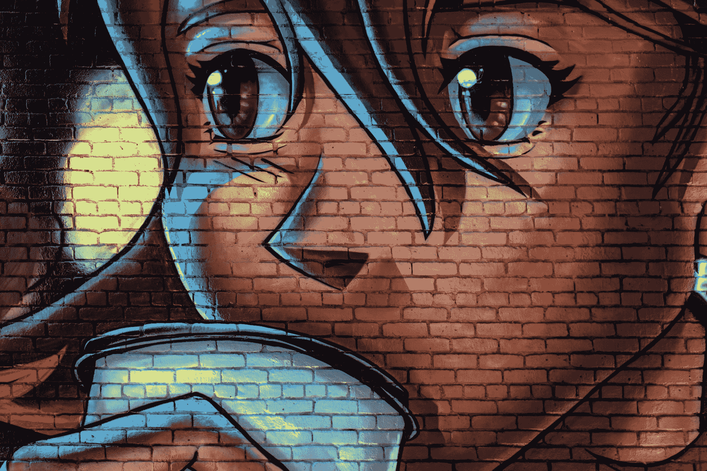
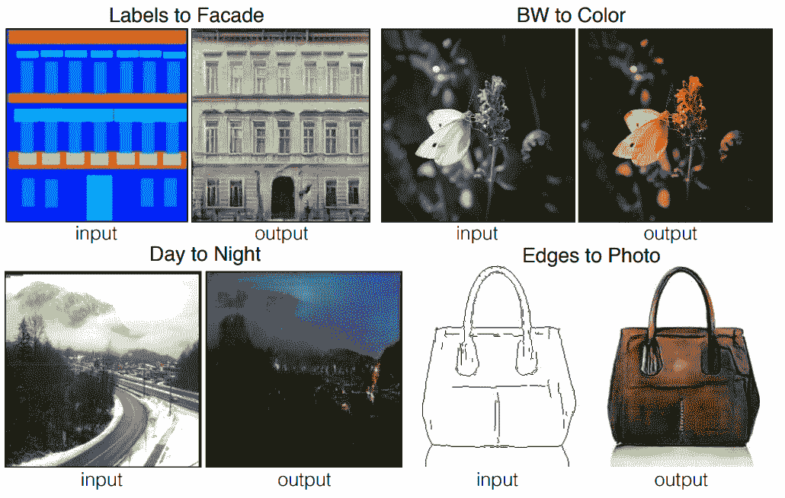
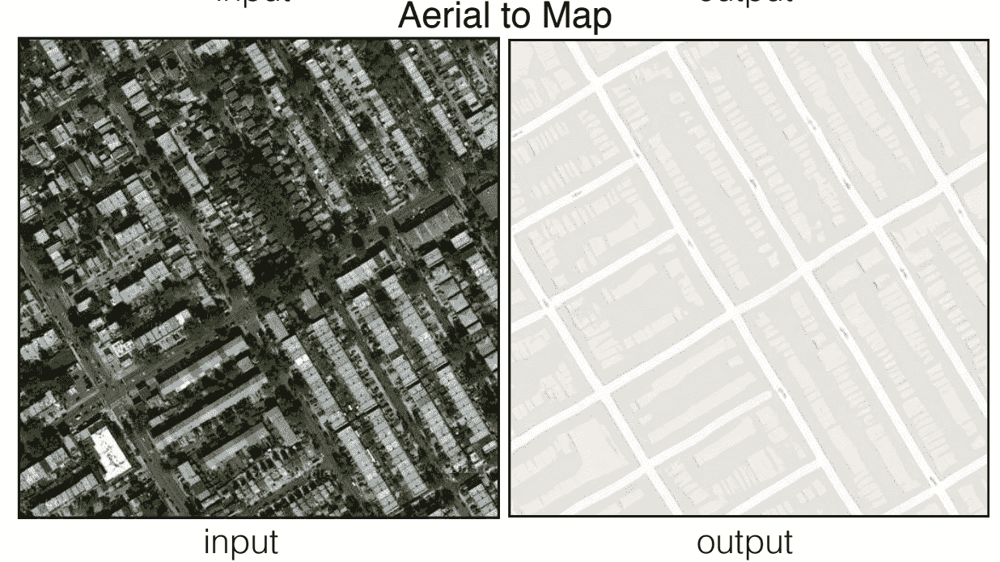
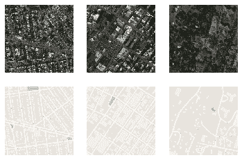
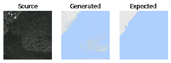
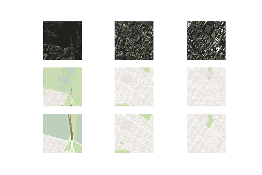

# pix2pix 生成对抗网络

> 原文：<https://blog.paperspace.com/pix2pix-gan/>



Photo by [Tim Mossholder](https://unsplash.com/@timmossholder?utm_source=ghost&utm_medium=referral&utm_campaign=api-credit) / [Unsplash](https://unsplash.com/?utm_source=ghost&utm_medium=referral&utm_campaign=api-credit)

除了生成对抗网络(GANs)可以实现的无数奇迹之外，例如从零开始生成全新的实体，它们还有另一个用于图像到图像翻译的奇妙用例。在之前的博客中，我们了解了条件 GANs 的实现。这些条件 gan 的特征在于执行任务以获得提供给训练网络的特定输入所需的输出的能力。在我们继续本文中这些条件 GAN 的一个变体之前，我建议从这个[链接](https://blog.paperspace.com/conditional-generative-adversarial-networks/)检查 CGAN 的实现。

在本文中，我们将探讨 GAN 的一种变体:pix2pix GANs，这种变体近年来因其能够高精度地将图像从源域转换到目标域而广受欢迎。在我们开始理解 pix2pix GAN 的研究论文和体系结构分析之前，我们将首先简要介绍阅读这篇博客所需的基础知识。最后，我们将从头开始使用 pix2pix GANs 开发一个卫星图像到地图的翻译项目。

通过使用以下链接的 repo 作为“工作区 URL”来创建 Paperspace Gradient 笔记本，可以利用 Paperspace Gradient 平台来运行以下项目通过切换笔记本创建页面上的高级选项按钮，可以找到该字段。

### 简介:

条件 GANs 的主要应用之一是这些网络执行高精度图像到图像翻译的能力。图像到图像的翻译是一项任务，其中我们从一个特定的域获取图像，并通过根据特定任务的需要对其进行变换，将其转换为另一个域中的图像。有各种各样的图像翻译项目可供使用，包括将黑白图像转换为彩色图像，将动画草图转换为逼真的人类图片，以及许多其他类似的想法。

先前已经利用了许多方法来高精度地执行图像到图像的转换。然而，一种简单的 CNN 方法来最小化预测像素和真实像素之间的欧几里德距离往往会产生模糊的结果。模糊效应的主要原因是通过平均所有似是而非的输出来最小化欧几里德距离。pix2pix 条件 GAN 解决了大部分这些潜在问题。模糊图像将被鉴别器网络确定为假样本，解决了以前 CNN 方法的一个主要问题。在下一节中，我们将对这些 pix2pix 条件 gan 有一个更概念性的理解。

* * *

## 了解 pix2pix GANs:



[Image Source](https://arxiv.org/pdf/1611.07004.pdf)

先前已经使用了许多方法来执行各种图像转换任务。然而，历史上大多数原始方法都失败了，包括一些流行的深度学习框架。当大多数方法在生成任务中挣扎时，生成对抗网络在大多数情况下成功了。最好的图像翻译网络之一是 pix2pix GANs。在本节中，我们将分解这些 pix2pix GAN 的程序工作，并尝试理解 pix 2 pix GAN 架构的发生器和鉴别器网络的复杂细节。

生成器架构利用了 U-Net 架构设计。在我之前的一篇博客中，我们已经非常详细地讨论了这个话题，你可以通过这个[链接](https://blog.paperspace.com/unet-architecture-image-segmentation/#understanding-the-u-net-architecture)查看。U-Net 架构使用编码器-解码器类型的结构，其中我们在架构的前半部分对卷积层进行下采样，后半部分涉及使用卷积转置等分层上采样来调整大小，以实现更高的图像缩放。传统的 U-Net 架构略显陈旧，因为它最初是在 2015 年开发的，自那以来神经网络已经取得了巨大的进步。

因此，pix2pix GAN 的发电机网络中使用的 U-Net 架构是原始 U-Net 架构的略微修改版本。而编码器-解码器结构以及跳跃连接是两个网络的关键方面；有一些关键的值得注意的差异。原始 U-Net 架构中的图像大小从原始尺寸变为新的较小高度和宽度。在 pix2pix GAN 网络中，发生器网络保留图像大小和尺寸。在向下步进之前，我们在 pix2pix 生成器网络中仅使用一个卷积层模块，而不是最初使用的两个模块。最后，U-Net 网络缩小到大约 32 x 32 的最大值，而发电机网络一直缩小到 1 x 1。

至于所提出的鉴别器架构，pix2pix GAN 使用了一种分片方法，该方法仅在分片尺度上惩罚结构。虽然 GAN 架构中的大多数复杂鉴别器利用整个图像来建立伪或实(0 或 1)值，但是块 GAN 试图对图像中的每个 N ×N 块是真还是假进行分类。对于每个特定的任务，N×N 小块的大小可以不同，但是最终的输出是所考虑的小块的所有响应的平均值。贴片 GAN 鉴别器的主要优势在于它们具有更少的训练参数、运行更快，并且可以应用于任意大的图像。

在 pix2pix GANs 的帮助下，我们可以进行许多实验。其中一些实验包括城市景观照片翻译的语义标签，立面数据集照片的建筑标签，黑白图像到彩色图像，动画草图到现实人类图片，等等！在这个项目中，我们将把重点放在卫星地图到航空照片的转换，从谷歌地图刮数据训练。

* * *

## 使用 pix2pix GANs 将卫星图像转换为地图；



[Image Source](https://arxiv.org/pdf/1611.07004.pdf)

在本文的这一部分中，我们将着重于从头开始开发一个 pix2pix GAN 架构，用于将卫星图像转换为各自的地图。在开始本教程之前，我强烈建议查看一下我之前在 TensorFlow [文章](https://blog.paperspace.com/absolute-guide-to-tensorflow/)和 Keras [文章](https://blog.paperspace.com/the-absolute-guide-to-keras/)上的博客。这两个库将是我们用于构建以下项目的主要深度学习框架。该项目被分成许多更小的子部分，以便更容易理解完成预期任务所需的所有步骤。让我们从导入所有必要的库开始。

### 导入基本库

如前所述，我们将利用的两个主要深度学习框架是 TensorFlow 和 Keras。最有用的层包括卷积层、泄漏 ReLU 激活函数、批量归一化、漏失层和其他一些基本层。我们还将导入 NumPy 库来处理数组，并相应地生成真实和虚假的图像。Matplotlib 库用于绘制所需的图形和必要的绘图。请查看下面的代码块，了解我们将在这个项目的构造中使用的所有必需的库和导入。

```py
from tensorflow.keras.optimizers import Adam
from tensorflow.keras.initializers import RandomNormal
from tensorflow.keras.models import Model
from tensorflow.keras.layers import Input, Conv2D, Conv2DTranspose, LeakyReLU, Activation
from tensorflow.keras.layers import BatchNormalization, Concatenate, Dropout
from keras.preprocessing.image import img_to_array
from keras.preprocessing.image import load_img
from tensorflow.keras.utils import plot_model
from tensorflow.keras.models import load_model
from os import listdir
from numpy import asarray, load
from numpy import vstack
from numpy import savez_compressed
from matplotlib import pyplot
import numpy as np
from matplotlib import pyplot as plt
from numpy.random import randint
from numpy import zeros
from numpy import ones
```

### 准备数据:

通过查看和分析我们的数据，我们可以注意到，我们有一个完整的图像，其中包含地图和它们各自的卫星图像。在接下来的代码块中，我们将定义数据集的路径。我推荐那些想和教程一起实验的读者从 Kaggle 下载这个数据集。以下数据集旨在作为图像到图像翻译问题的通用解决方案。他们有四个数据集，我们可以用来开发 Pix2Pix GANs。这些数据集包括门面、城市景观、地图和鞋的边缘。

您还可以下载任何其他想要测试模型工作过程的下载内容。对于本文，我们将使用地图数据集。在下面的代码块中，我定义了到我的目录的特定路径，该目录包含带有训练和验证目录的地图数据。请随意相应地设置自己的路径位置。我们还将定义一些基本参数，使用这些参数可以更轻松地完成一些编码过程。由于图像包含卫星图像及其各自的地图，我们可以将它们平均分割，因为它们的尺寸都是 256 x 256，如下面的代码块所示。

```py
# load all images in a directory into memory
def load_images(path, size=(256,512)):
    src_list, tar_list = list(), list()
    for filename in listdir(path):
        # load and resize the image
        pixels = load_img(path + filename, target_size=size)
        # convert to numpy array
        pixels = img_to_array(pixels)
        # split into satellite and map
        sat_img, map_img = pixels[:, :256], pixels[:, 256:]
        src_list.append(sat_img)
        tar_list.append(map_img)
    return [asarray(src_list), asarray(tar_list)]

# dataset path
path = 'maps/train/'
# load dataset
[src_images, tar_images] = load_images(path)
print('Loaded: ', src_images.shape, tar_images.shape)

n_samples = 3
for i in range(n_samples):
    pyplot.subplot(2, n_samples, 1 + i)
    pyplot.axis('off')
    pyplot.imshow(src_images[i].astype('uint8'))

# plot target image
for i in range(n_samples):
    pyplot.subplot(2, n_samples, 1 + n_samples + i)
    pyplot.axis('off')
    pyplot.imshow(tar_images[i].astype('uint8'))
pyplot.show()
```

```py
Loaded:  (1096, 256, 256, 3) (1096, 256, 256, 3) 
```



### u 网发电机网络:

为了构建 pix2pix GAN 架构的发生器网络，我们将把该结构分成几个部分。我们将从编码器模块开始，这里我们将定义步长为 2 的卷积层，然后是泄漏 ReLU 激活函数。大多数卷积层之后还会有批量标准化层，如下面的代码块所示。一旦我们返回了发生器网络的编码器模块，我们可以如下构建网络的前半部分-C64-C128-C256-C512-C512-C512-C512-C512-C512。

```py
# Encoder Block
def define_encoder_block(layer_in, n_filters, batchnorm=True):
    init = RandomNormal(stddev=0.02)
    g = Conv2D(n_filters, (4,4), strides=(2,2), padding='same', kernel_initializer=init)(layer_in)
    if batchnorm:
        g = BatchNormalization()(g, training=True)
    g = LeakyReLU(alpha=0.2)(g)
    return g
```

我们将定义的发生器网络的下一部分是解码器模块。在该功能中，我们将对所有先前下采样的图像进行上采样，并添加(连接)从编码器到解码器网络必须进行的必要跳跃连接，类似于 U-Net 架构。对于模型的上采样，我们可以利用卷积转置层和批量归一化层以及可选的丢弃层。发生器网络的解码器模块包含如下架构-CD 512-CD 512-CD 512-C512-C256-C128-C64。下面是以下结构的代码块。

```py
# Decoder Block
def decoder_block(layer_in, skip_in, n_filters, dropout=True):
    init = RandomNormal(stddev=0.02)
    g = Conv2DTranspose(n_filters, (4,4), strides=(2,2), padding='same', kernel_initializer=init)(layer_in)
    g = BatchNormalization()(g, training=True)
    if dropout:
        g = Dropout(0.5)(g, training=True)
    # merge with skip connection
    g = Concatenate()([g, skip_in])
    g = Activation('relu')(g)
    return g
```

现在，我们已经构建了前面的两个主要函数，即编码器和解码器模块，我们可以继续多次调用它们，根据必要的要求调整网络。我们将遵循本节之前讨论的编码器和解码器网络架构，并相应地构建这些模块。大部分结构都是按照下面的[研究论文](https://arxiv.org/pdf/1611.07004.pdf)搭建的。最终输出激活函数 tanh 生成-1 到 1 范围内的图像。通过修改一些参数，您可以随意尝试任何其他可能产生更好结果的较小修改。发电机网络的代码块如下所示。

```py
# Define the overall generator architecture
def define_generator(image_shape=(256,256,3)):
    # weight initialization
    init = RandomNormal(stddev=0.02)

    # image input
    in_image = Input(shape=image_shape)

    # encoder model: C64-C128-C256-C512-C512-C512-C512-C512
    e1 = define_encoder_block(in_image, 64, batchnorm=False)
    e2 = define_encoder_block(e1, 128)
    e3 = define_encoder_block(e2, 256)
    e4 = define_encoder_block(e3, 512)
    e5 = define_encoder_block(e4, 512)
    e6 = define_encoder_block(e5, 512)
    e7 = define_encoder_block(e6, 512)

    # bottleneck, no batch norm and relu
    b = Conv2D(512, (4,4), strides=(2,2), padding='same', kernel_initializer=init)(e7)
    b = Activation('relu')(b)

    # decoder model: CD512-CD512-CD512-C512-C256-C128-C64
    d1 = decoder_block(b, e7, 512)
    d2 = decoder_block(d1, e6, 512)
    d3 = decoder_block(d2, e5, 512)
    d4 = decoder_block(d3, e4, 512, dropout=False)
    d5 = decoder_block(d4, e3, 256, dropout=False)
    d6 = decoder_block(d5, e2, 128, dropout=False)
    d7 = decoder_block(d6, e1, 64, dropout=False)

    # output
    g = Conv2DTranspose(image_shape[2], (4,4), strides=(2,2), padding='same', kernel_initializer=init)(d7) #Modified 
    out_image = Activation('tanh')(g)  #Generates images in the range -1 to 1\. So change inputs also to -1 to 1

    # define model
    model = Model(in_image, out_image)
    return model
```

### 贴片 GAN 鉴频器网络:

一旦构建了发生器网络，我们就可以继续研究鉴别器架构。在继续构建鉴别器结构之前，我们将初始化我们的权重并合并输入源图像和目标图像。鉴别器结构将遵循 C64-C128-C256-C512 的模式构建。在最后一层之后，应用卷积来映射到 1 维输出，随后是 sigmoid 函数。下面代码块中使用的鉴别器网络允许大小低至 16 x 16。最后，我们可以编译用一个图像的批量大小和具有小学习率和 0.5 beta 值的 Adam 优化器训练的模型。对于每次模型更新，鉴别器的损耗被加权 50%。查看以下代码片段，了解完整的 GAN 鉴频器网络补丁。

```py
def define_discriminator(image_shape):

    # weight initialization
    init = RandomNormal(stddev=0.02)

    # source image input
    in_src_image = Input(shape=image_shape)  

    # target image input
    in_target_image = Input(shape=image_shape)  

    # concatenate images, channel-wise
    merged = Concatenate()([in_src_image, in_target_image])

    # C64: 4x4 kernel Stride 2x2
    d = Conv2D(64, (4,4), strides=(2,2), padding='same', kernel_initializer=init)(merged)
    d = LeakyReLU(alpha=0.2)(d)

    # C128: 4x4 kernel Stride 2x2
    d = Conv2D(128, (4,4), strides=(2,2), padding='same', kernel_initializer=init)(d)
    d = BatchNormalization()(d)
    d = LeakyReLU(alpha=0.2)(d)

    # C256: 4x4 kernel Stride 2x2
    d = Conv2D(256, (4,4), strides=(2,2), padding='same', kernel_initializer=init)(d)
    d = BatchNormalization()(d)
    d = LeakyReLU(alpha=0.2)(d)

    # C512: 4x4 kernel Stride 2x2 
    d = Conv2D(512, (4,4), strides=(2,2), padding='same', kernel_initializer=init)(d)
    d = BatchNormalization()(d)
    d = LeakyReLU(alpha=0.2)(d)

    # second last output layer : 4x4 kernel but Stride 1x1 (Optional)
    d = Conv2D(512, (4,4), padding='same', kernel_initializer=init)(d)
    d = BatchNormalization()(d)
    d = LeakyReLU(alpha=0.2)(d)

    # patch output
    d = Conv2D(1, (4,4), padding='same', kernel_initializer=init)(d)
    patch_out = Activation('sigmoid')(d)

    # define model
    model = Model([in_src_image, in_target_image], patch_out)
    opt = Adam(lr=0.0002, beta_1=0.5)

    # compile model
    model.compile(loss='binary_crossentropy', optimizer=opt, loss_weights=[0.5])
    return model
```

### 定义完整的 GAN 架构:

既然我们已经定义了发生器和鉴频器网络，我们可以根据需要继续训练整个 GAN 架构。鉴别器中的重量是不可训练的，但是独立的鉴别器是可训练的。因此，我们将相应地设置这些参数。然后，我们将把源图像作为输入传递给模型，而模型的输出将包含生成的结果以及鉴别器输出。总损失计算为对抗性损失(BCE)和 L1 损失(MAE)的加权和，权重比为 1:100。我们可以用这些参数和 Adam 优化器来编译模型，以返回最终的模型。

```py
# define the combined GAN architecture
def define_gan(g_model, d_model, image_shape):
    for layer in d_model.layers:
        if not isinstance(layer, BatchNormalization):
            layer.trainable = False

    in_src = Input(shape=image_shape)
    gen_out = g_model(in_src)
    dis_out = d_model([in_src, gen_out])
    model = Model(in_src, [dis_out, gen_out])
    # compile model
    opt = Adam(lr=0.0002, beta_1=0.5)

    model.compile(loss=['binary_crossentropy', 'mae'], 
               optimizer=opt, loss_weights=[1,100])

    return model
```

### 定义所有基本参数:

下一步，我们将定义训练 pix2pix GAN 模型所需的所有基本函数和参数。首先，让我们定义生成真样本和假样本的函数。下面提供了执行以下操作的代码片段。

```py
def generate_real_samples(dataset, n_samples, patch_shape):
    trainA, trainB = dataset
    ix = randint(0, trainA.shape[0], n_samples)
    X1, X2 = trainA[ix], trainB[ix]
    y = ones((n_samples, patch_shape, patch_shape, 1))
    return [X1, X2], y

def generate_fake_samples(g_model, samples, patch_shape):
    X = g_model.predict(samples)
    y = zeros((len(X), patch_shape, patch_shape, 1))
    return X, y
```

在下一个代码块中，我们将创建一个函数来总结模型的性能。生成的图像将与它们的原始对应物进行比较，以获得期望的响应。我们可以为源图像、生成的图像和目标输出图像绘制三幅图。我们可以保存绘图和发电机模型，以便以后根据需要进行进一步计算。

```py
#save the generator model and check how good the generated image looks. 
def summarize_performance(step, g_model, dataset, n_samples=3):
    [X_realA, X_realB], _ = generate_real_samples(dataset, n_samples, 1)
    X_fakeB, _ = generate_fake_samples(g_model, X_realA, 1)

    # scale all pixels from [-1,1] to [0,1]
    X_realA = (X_realA + 1) / 2.0
    X_realB = (X_realB + 1) / 2.0
    X_fakeB = (X_fakeB + 1) / 2.0

    # plot real source images
    for i in range(n_samples):
        plt.subplot(3, n_samples, 1 + i)
        plt.axis('off')
        plt.imshow(X_realA[i])

    # plot generated target image
    for i in range(n_samples):
        plt.subplot(3, n_samples, 1 + n_samples + i)
        plt.axis('off')
        plt.imshow(X_fakeB[i])

    # plot real target image
    for i in range(n_samples):
        plt.subplot(3, n_samples, 1 + n_samples*2 + i)
        plt.axis('off')
        plt.imshow(X_realB[i])

    # save plot to file
    filename1 = 'plot_%06d.png' % (step+1)
    plt.savefig(filename1)
    plt.close()

    # save the generator model
    filename2 = 'model_%06d.h5' % (step+1)
    g_model.save(filename2)
    print('>Saved: %s and %s' % (filename1, filename2))
```

最后，让我们定义训练函数，通过它我们可以训练模型并调用所有适当的函数来生成样本、总结模型性能，以及根据需要训练批处理函数。一旦我们为 pix2pix 模型创建了训练函数，我们就可以继续训练模型并为卫星图像到地图图像转换任务生成结果。下面是 train 函数的代码块。

```py
# train function for the pix2pix model
def train(d_model, g_model, gan_model, dataset, n_epochs=100, n_batch=1):
    n_patch = d_model.output_shape[1]
    trainA, trainB = dataset
    bat_per_epo = int(len(trainA) / n_batch)
    n_steps = bat_per_epo * n_epochs

    for i in range(n_steps):
        [X_realA, X_realB], y_real = generate_real_samples(dataset, n_batch, n_patch)
        X_fakeB, y_fake = generate_fake_samples(g_model, X_realA, n_patch)

        d_loss1 = d_model.train_on_batch([X_realA, X_realB], y_real)
        d_loss2 = d_model.train_on_batch([X_realA, X_fakeB], y_fake)
        g_loss, _, _ = gan_model.train_on_batch(X_realA, [y_real, X_realB])

        # summarize model performance
        print('>%d, d1[%.3f] d2[%.3f] g[%.3f]' % (i+1, d_loss1, d_loss2, g_loss))
        if (i+1) % (bat_per_epo * 10) == 0:
            summarize_performance(i, g_model, dataset)
```

### 训练 pix2pix 模型:

一旦我们构建了整个发生器和鉴别器网络，并将它们组合到 GAN 架构中，并完成了所有基本参数和值的声明，我们就可以开始最终训练 pix2pix 模型并观察其性能。我们将传递源的镜像形状，并根据发生器和鉴频器网络构建 GAN 架构。

我们将定义输入源图像和目标图像，然后根据输出双曲正切函数的执行情况，对这些图像进行相应的归一化处理，使其在-1 到 1 的理想范围内缩放。我们最终可以开始模型的训练，并在十个时期后评估性能。为每个时期的每批(总共 1096 个)报告参数。对于十个纪元，我们应该注意到总数为 10960。下面是训练模型的代码片段。

```py
image_shape = src_images.shape[1:]
d_model = define_discriminator(image_shape)
g_model = define_generator(image_shape)
gan_model = define_gan(g_model, d_model, image_shape)

data = [src_images, tar_images]

def preprocess_data(data):
    X1, X2 = data[0], data[1]
    # scale from [0,255] to [-1,1]
    X1 = (X1 - 127.5) / 127.5
    X2 = (X2 - 127.5) / 127.5
    return [X1, X2]

dataset = preprocess_data(data)

from datetime import datetime 
start1 = datetime.now() 

train(d_model, g_model, gan_model, dataset, n_epochs=10, n_batch=1) 

stop1 = datetime.now()
#Execution time of the model 
execution_time = stop1-start1
print("Execution time is: ", execution_time)
```

```py
>10955, d1[0.517] d2[0.210] g[8.743]
>10956, d1[0.252] d2[0.693] g[5.987]
>10957, d1[0.243] d2[0.131] g[12.658]
>10958, d1[0.339] d2[0.196] g[6.857]
>10959, d1[0.010] d2[0.125] g[4.013]
>10960, d1[0.085] d2[0.100] g[10.957]
>Saved: plot_010960.png and model_010960.h5
Execution time is:  0:39:10.933599 
```

在我的系统上，用于模型训练的程序的执行花费了大约 40 分钟。根据您的 GPU 和设备功能，培训时间可能会有所不同。Paperspace 上的梯度平台是这种培训机制的一个很好的可行选择。训练完成后，我们有了一个模型和一个可用的图。可以加载模型，并相应地对其进行必要的预测。下面是用于加载模型以及进行基本预测和相应绘图的代码块。

```py
# Plotting the Final Results
model = load_model('model_010960.h5')

# plot source, generated and target images
def plot_images(src_img, gen_img, tar_img):
    images = vstack((src_img, gen_img, tar_img))
    # scale from [-1,1] to [0,1]
    images = (images + 1) / 2.0
    titles = ['Source', 'Generated', 'Expected']

    # plot images row by row
    for i in range(len(images)):
        pyplot.subplot(1, 3, 1 + i)
        pyplot.axis('off')
        pyplot.imshow(images[i])
        pyplot.title(titles[i])
    pyplot.show()

[X1, X2] = dataset
# select random example
ix = randint(0, len(X1), 1)
src_image, tar_image = X1[ix], X2[ix]
# generate image from source
gen_image = model.predict(src_image)
# plot all three images
plot_images(src_image, gen_image, tar_image)
```



我强烈推荐查看下面的[网站](https://machinelearningmastery.com/how-to-develop-a-pix2pix-gan-for-image-to-image-translation/)，其中大部分代码都被考虑到了。作为下一步，我们强烈建议观众尝试各种可能有助于产生更好效果的组合。观众也可以选择对更多的时期进行训练，以尝试获得更理想的结果。除了这个项目，pix2pix GANs 在各种项目中都有很高的实用性。我建议尝试许多项目，以便更好地掌握这些生成网络的能力。

* * *

## 结论:


Photo by [Kobby Mendez](https://unsplash.com/@kobbyfotos?utm_source=ghost&utm_medium=referral&utm_campaign=api-credit) / [Unsplash](https://unsplash.com/?utm_source=ghost&utm_medium=referral&utm_campaign=api-credit)

从一幅图像到另一幅图像的图像到图像转换是一项非常复杂的任务，因为简单的卷积网络由于缺乏特征提取能力而无法以最理想的方式完成这项任务。另一方面，GANs 在生成一些高精度和准确度的最佳图像方面做得非常出色。它们还有助于避免简单卷积网络的一些暗淡效果，如输出清晰、逼真的图像等。因此，推出的 pix2pix GAN 架构是解决此类问题的最佳 GAN 版本之一。艺术家和多个用户甚至通过互联网使用 pix2pix GAN 软件来实现高质量的结果。

在本文中，我们主要关注 pix2pix GANs 中用于图像翻译的最重要的条件类型 gan 之一。我们了解了更多关于图像翻译的主题，并理解了与 pix2pix GANs 及其功能机制相关的大多数基本概念。一旦我们介绍了 pix2pix GAN 的基本方面，包括生成器和鉴别器架构，我们就开始构建卫星图像转换为地图项目。强烈建议观众尝试其他类似项目，并尝试 pix2pix GAN 架构的发生器和鉴频器网络的各种可能变化。

在以后的文章中，我们将关注用 pix2pix GANs 构建更多的项目，因为这些条件网络有许多可能性。我们还将探索其他类型的 gan，如 Cycle GANs，以及关于 BERT 变换器和从头构建神经网络的其他教程和项目(第 2 部分)。在那之前，享受编码和构建新项目吧！