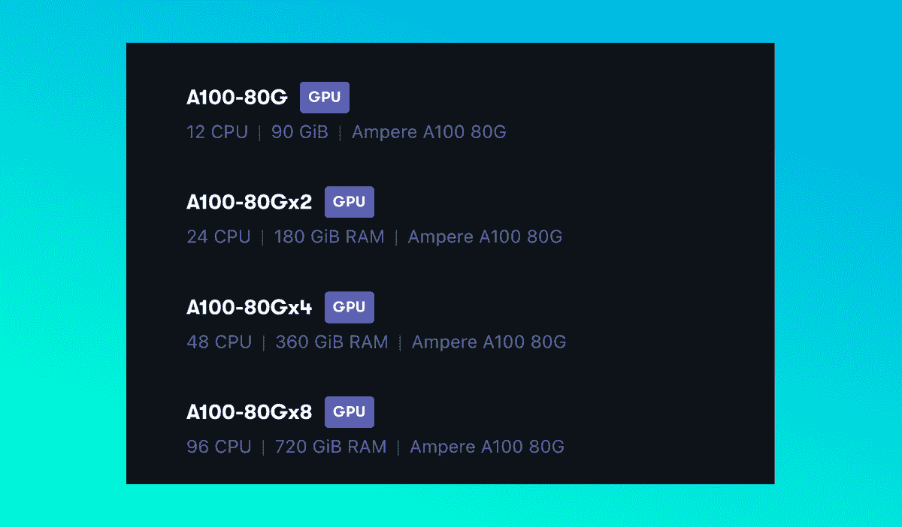

# 公告:增加了纸张空间上的安培 A100、A4000 和 A6000 容量

> 原文：<https://blog.paperspace.com/new-ampere-gpus/>

事实证明，Ampere 微体系结构在每个需要 GPU 计算的领域都占据主导地位，尤其是在深度学习领域。无论我们讨论的是功耗较低的消费级工作站 GPU 还是功耗较高的专业级数据中心 GPU，用户都很难在同级别的老一代 GPU 上实现类似的性能。我们在 [Ampere deep dive](https://blog.paperspace.com/ampere-gpus-with-paperspace/) 和[张量核心](https://blog.paperspace.com/understanding-tensor-cores/)和[混合精度训练](https://blog.paperspace.com/mixed-precision-training/)中概述了 Ampere 如此强大的原因，因此，请务必查看这些内容以了解有关该微架构的更多信息。

在深度学习的事实上的顶级机器:A100 的背景下，这种能力尤其如此。A100 已经在[基准测试任务](https://blog.paperspace.com/best-gpu-paperspace-2022/)中证明，它是对之前数据中心 GPU 峰值 V100 的彻底改进。这些 GPU，无论是单独使用还是在多 GPU 机器实例中使用，都代表了数据科学家技术武器库中的最先进水平。

Paperspace 欣喜若狂地宣布，我们将为用户带来更多这种强大的 Ampere GPUs。这些新机器，包括新的 A100-80GB、A4000 和 A6000 GPUs，现已面向 Paperspace 用户提供，可访问性因地区而异。在下一节中，让我们更深入地了解一下这种新类型的可用实例，将其价格与竞争对手进行对比，并详细说明其区域可用性。然后，我们将讨论其他新的 Ampere GPU 及其区域可用性。

## Paperspace 上的 A100 - 80 GB

我们很高兴地宣布，我们现在在 Paperspace 上有 40 GB 和 80 GB GPU 内存的 A100s。之前只有 40gb GPU 内存的 A100s。除了 GPU 内存规格之外，80 GB 版本与同类产品几乎没有什么不同，但其可用 RAM 却增加了一倍。实际上，这允许这些 GPU 上的用户更好地利用这些发电站机器的大规模吞吐量(1，555 GB/s)能力，以比以往任何时候都更快的速度训练深度学习模型！

80 GB 和 40gb a100 现在都可以配置到更大的多 GPU 实例中。如果您参加了[增长计划](https://www.paperspace.com/pricing)，您现在可以选择 1x、2x、4x 和 8x 配置的 A100s。使用这些多 GPU 机器类型中的一种，当与用于多 GPU 实例的深度学习包(如巨型人工智能)结合使用时，可以大大减少您的训练时间。A100s 中的[第三代 NVLink](https://www.nvidia.com/en-us/data-center/ampere-architecture/) 软件进一步加剧了这种情况，与上一代多 GPU 实例相比，它将进一步加速训练。

| GPU | 图形内存 | CPU | 系统内存 | 价格 |
| A100 x 1 | 40 GB | 12 | 90 GB | $3.09 /小时 |
| A100 x 2 | 40 GB | 24 | 180 GB | $6.18 /小时 |
| A100 x 4 | 40 GB | 48 | 360 GB | $12.36 /小时 |
| A100 x 8 | 40 GB | 96 | 720 GB | $24.72 /小时 |
| A100 x 1 | 80 GB | 12 | 90 GB | $3.18 /小时 |
| A100 x 2 | 80 GB | 24 | 180 GB | $6.36 /小时 |
| A100 x 4 | 80 GB | 48 | 360 GB | $12.72 /小时 |
| A100 x 8 | 80 GB | 96 | 720 GB | $25.44 /小时 |

从上表可以看出，这些多 GPU 机器的定价取决于系统中 GPU 的数量和初始定价。A100- 40 GB x 8 实例每小时 24.72 英镑，在 Paperspace 上比 AWS(不允许用户访问 A100 的 x 1、x 2 或 x 4 实例)和 GCP(类似实例的价格分别为每小时 32.77 美元(T0)和 29.38 美元(t 2)要便宜得多。

这种价格差异特别有趣，因为 100 - 80GB 的实例也更便宜，使用这些机器时，时间和成本之间的直接关系加剧了这种影响。相对较少的其他 GPU 云提供商在 Paperspace 之外提供对这些 100 - 80 GB 机器的访问。像 AWS 和 GCP 这样的主要竞争对手不提供这种 GPU 类型的任何实例，只有 40 GB 版本。尽管如此，价格继续比较有利的那些。例如，Azure 的 NC A100 v4 系列仍在他们的文档中处于预览阶段，单个 GPU 实例的价格将为每小时[3.64 美元](https://azure.microsoft.com/en-us/pricing/details/virtual-machines/linux/#pricing):比 Paperspace 每小时多半美元。

A100s 的这一扩展 GPU 容量目前将在 NY2 中可用，但请务必观看我们的公告页面，了解您所在地区的进一步更新！

## 更多地区有更多安培数！

除了针对 NY2 地区的新款 A100s，我们的其他两个地区也获得了额外的安培机器类型的重大升级。具体来说，这些是单 GPU、x 2 和 x 4 多 GPU 机器类型的 CA1 和 AMS1 中的新 A4000 实例，以及 AMS1 中可用的新 A6000 单 GPU 机器类型。

这些对我们的 Ampere Workstation GPU 产品线的扩展将为上一代迭代提供大规模升级，RTX 4000 和 RTX 6000 GPU 也可在 Paperspace 上获得，并可用于这些地区的用户。

有关 Paperspace 机器地区可用性的更多信息，请访问我们的[文档](https://docs.paperspace.com/core/compute/machine-types)。

## 结束语

这些强大的 Ampere 系列 GPU 对于任何新用户来说都是微体系结构的一次大规模升级。现在，每个地区都有比以往更多的用户可以在 Paperspace 上访问这些强大的 GPU，并且我们通过新的强大的 100 - 80GB 多 GPU 实例将比以往更多的能力交到了用户手中。

我们一直在努力为用户提供最强大的机器来处理他们在 Paperspace 上的工作。敬请关注我们在[https://updates.paperspace.com/](https://updates.paperspace.com/)举办的活动，了解更多即将推出的新机型和其他纸质空间更新。