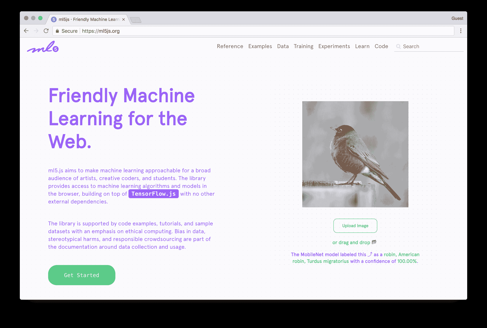
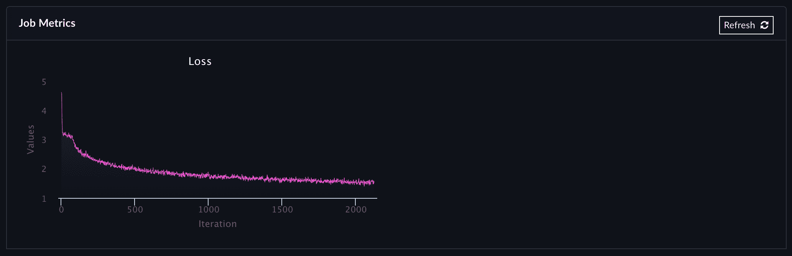

# 训练 LSTM 网络并对 ml5.js 中的结果模型进行采样

> 原文：<https://blog.paperspace.com/training-an-lstm-and-using-the-model-in-ml5-js/>

更新于 2022 年 5 月 9 日:这篇博客文章引用了现已废弃的 Paperspace 作业。如果您对 Paperspace 上的类似功能感兴趣，请查看我们文档中的[渐变工作流。](https://docs.paperspace.com/gradient/workflows/)

## LSTMs 的简单介绍

有各种类型的神经网络结构。根据您的任务、手头的数据和想要生成的输出，您可以选择或创建不同的网络架构和设计模式。如果你的数据集包含图像或像素，那么一个[卷积神经网络](https://en.wikipedia.org/wiki/Convolutional_neural_network)可能就是你所需要的。如果你试图在一系列输入上训练一个网络，那么一个[循环神经网络](https://en.wikipedia.org/wiki/Recurrent_neural_network) (RNN)可能会起作用。RNNs 是一种人工神经网络，当你的目标是识别数据序列中的模式时，它可以取得非常好的结果。当处理文本数据时，任何给定前一个字符计算下一个字符概率的模型都被称为语言模型[1]。

例如，如果您的输入是一个文本集或音乐作品，并且您试图从中预测有意义的序列，那么 rnn 非常有用。长短期记忆网络(LSTMs)只是一种特殊类型的 RNN，在学习“长期依赖”时表现更好。

例如，如果您有一个大型文本数据集，您可以训练一个 LSTM 模型，它将能够学习文本数据的统计结构。然后，您可以从该模型中进行采样，并创建看起来像原始训练数据的有意义的字符序列。换句话说，如果你想预测下面句子中的最后一个单词:

> *“我在法国长大……我说一口流利的[]”*，

LSTMs 可以帮助解决这个问题。通过学习句子的上下文，基于训练数据，可以建议接下来的单词是“法语”[2](https://colah.github.io/posts/2015-08-Understanding-LSTMs/)

我们将使用 LSTM 的生成能力来创建一个交互式的在线演示，您可以从一个经过训练的模型中抽取字符样本，并根据您所写的内容生成新的文本序列。

## ml5.js 简介



关于 LSTMs 的好消息是，有许多好的方法可以轻松地开始使用它们，而不必太深入地钻研技术基础。其中一种方式是使用 [ml5.js](https://ml5js.org/) 。

ml5.js 是一个新的 JavaScript 库，旨在让艺术家、创意程序员和学生等广大受众能够接触到机器学习。该库在浏览器中提供对机器学习算法和模型的访问，构建在 TensorFlow.js 之上，没有其他外部依赖性。该项目目前由教师、居民和学生组成的社区在 [NYU ITP](https://itp.nyu.edu/) 进行维护。你可以在[这篇文章](https://itp.nyu.edu/adjacent/issue-3/ml5-friendly-open-source-machine-learning-library-for-the-web/)或者这个 [Twitter 帖子](https://twitter.com/shiffman/status/1008082538999504897)中了解更多关于 ml5.js 的历史。

本教程将使用 [ml5。LSTMGenerator()](https://ml5js.org/docs/LSTMGenerator) 方法加载预训练的 LSTM 模型，我们将在本文中使用 Python 和 GPU 加速计算开发该模型，并使用它在 Javascript 中生成新的字符序列。

好奇？这是我们将要建立的演示。这个例子使用了在欧内斯特·海明威的语料库上训练的模型。开始输入一些东西，模型会根据你的书写建议新的行:

[https://paperspace.github.io/training-lstm/ml5js_example/](https://paperspace.github.io/training-lstm/ml5js_example/)

## 安装

LSTMs 需要很长时间来训练，所以我们将使用 P5000 GPU 显卡来加快速度。运行本教程的惟一要求是安装[node . js](https://nodejs.org/en/download/)和 [Paperspace 账户](https://www.paperspace.com/account/signup)。

本教程的训练代码基于 [char-rnn-tensorflow](https://github.com/sherjilozair/char-rnn-tensorflow) ，而后者的灵感来自安德烈·卡帕西的 [char-rnn](https://github.com/karpathy/char-rnn) 。

### 安装图纸空间节点 API

我们将使用[纸空间节点 API](https://paperspace.github.io/paperspace-node/) 。您可以使用 npm 轻松安装它:

```py
npm install -g paperspace-node 
```

或者使用 Python:

```py
pip install paperspace 
```

(如果你愿意，也可以从 [GitHub 发布页面](https://github.com/Paperspace/paperspace-node/releases)安装二进制文件)。

创建 Paperspace 帐户后，您将能够从命令行使用您的凭据登录:

```py
paperspace login 
```

出现提示时，添加您的 Paperspace 电子邮件和密码。

## 培训说明

### 1)克隆存储库

这个项目的代码可以在这里找到[。从克隆或下载存储库开始:](https://github.com/Paperspace/training-lstm)

```py
git clone https://github.com/Paperspace/training-lstm.git
cd training-lstm 
```

这将是我们项目的开始。

### 2)收集你的数据

当您想要从大型数据集中预测序列或模式时，LSTMs 非常有用。尽可能多地收集干净的文本数据！越多越好。

一旦你准备好了数据，在`/data`中创建一个新的文件夹，并随意命名。在这个新文件夹中，只需添加一个名为`input.txt`的文件，其中包含您所有的训练数据。

*(将许多小的不同的`.txt`文件连接成一个大的训练文件的快速技巧:`ls *.txt | xargs -L 1 cat >> input.txt` )*

对于这个例子，我们将使用一些[佐拉·尼尔·赫斯顿](https://en.wikipedia.org/wiki/Zora_Neale_Hurston)的书作为我们的源文本，因为它们可以在[古腾堡项目](https://www.gutenberg.org/ebooks/author/6368)上免费获得。你可以在这里找到我们将使用[的`input.txt`文件。](https://github.com/Paperspace/training-lstm/blob/master/data/zora_neale_hurston/input.txt)

### 3)在 Paperspace 上运行您的代码

训练 LSTM 的代码包含在您刚刚下载的项目中。我们唯一需要修改的文件是 [`run.sh`](https://github.com/Paperspace/training-lstm/blob/master/run.sh) 。这个文件设置了我们需要的所有参数:

```py
python train.py --data_dir=./data/zora_neale_hurston \
--rnn_size 128 \
--num_layers 2 \
--seq_length 50 \
--batch_size 50 \
--num_epochs 50 \
--save_checkpoints ./checkpoints \
--save_model /artifacts 
```

在这里，我们设置所有的超参数:输入数据、网络的层数、批量大小、历元数以及保存检查点和最终模型的位置。我们现在将使用默认设置，但是请查看部分，了解更多关于如何最好地训练您的网络的信息。您需要修改的唯一一行是指向您自己的数据集的`--data_dir=./data/bronte`(即:`--data_dir=./data/MY_OWN_DATA`

现在我们可以开始训练了。只需键入:

```py
paperspace jobs create --container tensorflow/tensorflow:1.5.1-gpu-py3 --machineType P5000 --command 'bash run.sh' --project 'LSTM training' 
```

这意味着我们希望`create`一个新的`paperspace job`使用一个 Docker 镜像作为基础`container`，该镜像安装了 Tensorflow 1.5.1 和 Python 3(这样我们就不需要担心安装依赖项、包或管理版本)。我们还想使用一个`machineType P5000`，我们想运行`command` `bash run.sh`来开始训练过程。这个`project`将被称为`LSTM training`

如果您输入正确(或复制正确)，培训过程应该开始，您应该看到如下内容:

```py
Uploading training-lstm.zip [========================================] 18692221/bps 100% 0.0s
New jobId: j8k4wfq65y8b6
Cluster: PS Jobs on GCP
Job Pending
Waiting for job to run...
Job Running
Storage Region: GCP West
Awaiting logs...

Here we go! Reading text file...
{"chart": "loss", "axis": "Iteration"}
{"chart": "loss", "x": 0, "y": 4.431717}
0/4800 (epoch 0), train_loss = 4.432, time/batch = 0.447
Model saved to ./checkpoints/zora_neale_hurston/zora_neale_hurston!
{"chart": "loss", "x": 1, "y": 4.401691}
1/4800 (epoch 0), train_loss = 4.402, time/batch = 0.060
{"chart": "loss", "x": 2, "y": 4.337208}
2/4800 (epoch 0), train_loss = 4.337, time/batch = 0.059
{"chart": "loss", "x": 3, "y": 4.193798}
3/4800 (epoch 0), train_loss = 4.194, time/batch = 0.058
{"chart": "loss", "x": 4, "y": 3.894172}
4/4800 (epoch 0), train_loss = 3.894, time/batch = 0.056 
```

这可能需要一段时间来运行，LSTMs 是众所周知的通话时间训练。一个好处是您不需要监控整个过程，但是您可以通过键入以下命令来检查它是如何进行的:

```py
paperspace jobs logs --tail --jobId YOUR_JOB_ID 
```

如果您登录到您的 Paperspace 帐户，您还可以在“渐变”选项卡下以更具互动性的方式遵循培训流程:



培训过程完成后，您应该会看到以下日志:

```py
Model saved to ./checkpoints/zora_neale_hurston/zora_neale_hurston!
Converting model to ml5js: zora_neale_hurston zora_neale_hurston-18
Done! The output model is in /artifacts
Check https://ml5js.org/docs/training-lstm for more information. 
```

### 4)使用 ml5.js 中的模型

现在我们可以用 ml5js 从 JavaScript 中的模型中取样。模型保存在作业的`/artifacts`文件夹中。所以我们首先需要下载它。从项目变更目录的`root`进入`/ml5js_example/models`并运行:

```py
paperspace jobs artifactsGet --jobId YOUR_JOB_ID 
```

这将下载我们需要的包含在您的训练模型中的所有文件。

现在打开`sketch.js`文件，在下面一行中更改模型的名称:

```py
const lstm = ml5.LSTMGenerator('./PATH_TO_YOUR_MODEL', onModelReady); 
```

代码的其余部分相当简单。一旦我们用 ml5js 创建了 lstm 方法，我们就可以使用下面的函数让它对模型进行采样:

```py
 const data = {
      seed: 'The meaning of life is ',
      temperature: 0.5,
      length: 200
 };
 lstm.generate(data, function(results){
     /*  Do something with the results */
 }); 
```

我们几乎准备好测试模型了。剩下的唯一一件事就是启动一个服务器来查看我们的文件。如果您使用的是 Python 2:

```py
python -m SimpleHTTPServer 
```

如果您使用的是 Python 3:

```py
python -m http.server 
```

请访问 http://localhost:8000 ，如果一切顺利，您应该会看到演示:

[https://paperspace.github.io/training-lstm/ml5js_example/](https://paperspace.github.io/training-lstm/ml5js_example/)

这就对了。我们使用 Python 为字符级语言训练了一个多层递归神经网络(LSTM，RNN)，通过 GPU 加速，将结果模型移植到 JavaScript，并在交互式演示中使用它来创建带有 [ml5js](https://ml5js.org/) 的文本序列。

### 5)调整模型

调整你的模型可能很难，因为涉及到很多参数和变量。一个很好的起点是遵循[原文的存储库建议](https://github.com/sherjilozair/char-rnn-tensorflow#tuning)。但总的来说，考虑到训练数据集的规模，这里有一些好的见解可以考虑:

*   2 MB:
    *   rnn_size 256(或 128)
    *   层 2
    *   序列长度 64
    *   批量 _ 大小 32
    *   辍学 0.25
*   5-8 MB:
    *   rnn_size 512
    *   第 2 层(或第 3 层)
    *   序列长度 128
    *   批量大小 64
    *   辍学 0.25
*   10-20 MB:
    *   rnn_size 1024
    *   第 2 层(或第 3 层)
    *   seq_length 128(或 256)
    *   批量大小 128
    *   辍学 0.25
*   25 MB 以上:
    *   rnn_size 2048
    *   第 2 层(或第 3 层)
    *   seq_length 256(或 128)
    *   批量大小 128
    *   辍学 0.25

# 资源

## 了解有关 LSTMs 的更多信息

*   Christopher Olah 著[了解 LSTMs](https://colah.github.io/posts/2015-08-Understanding-LSTMs/)
*   [递归神经网络的不合理有效性](https://karpathy.github.io/2015/05/21/rnn-effectiveness/)，作者 Andrej Karpathy。

## JavaScript 中的机器学习

*   [ml5js](https://ml5js.org)
*   [Tensorflow.js](https://js.tensorflow.org)