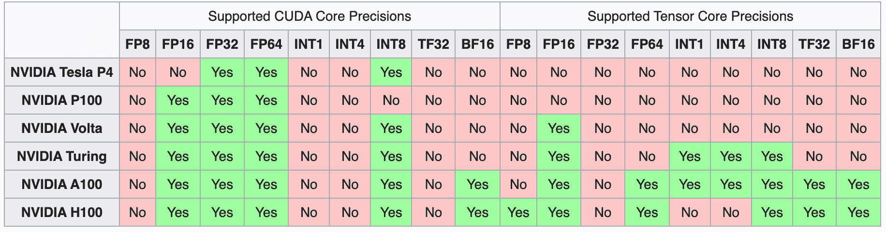
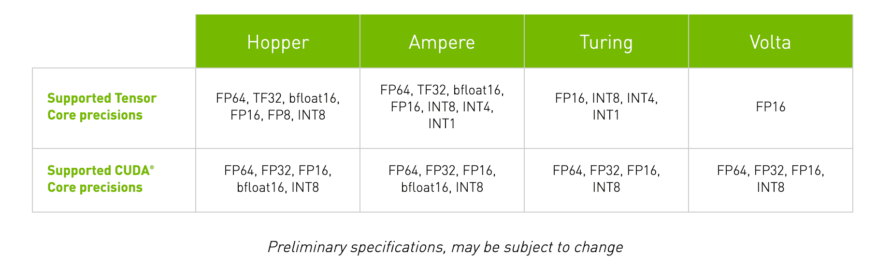
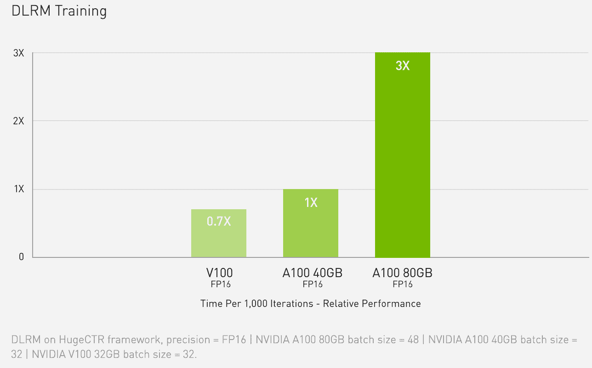

# 理解张量核

> 原文：<https://blog.paperspace.com/understanding-tensor-cores/>

英伟达最新一代 GPU 微架构发布的关键技术之一是张量核心。这些专门的处理子单元自引入 Volta 以来每一代都在进步，在[自动混合精度训练的帮助下加快了 GPU 的性能。](https://blog.paperspace.com/mixed-precision-training/)

在这篇博文中，我们将总结 NVIDIA 的 Volta、Turing 和 Ampere 系列 GPU 中张量核的功能。读者应该希望在阅读完本文后，能够理解不同类型的 NVIDIA GPU 核心的作用，张量核心如何在实践中支持深度学习的混合精度训练，如何区分每个微体系结构的张量核心的性能，以及在 Paperspace 上识别张量核心驱动的 GPU 的知识。

## 什么是 CUDA 核心？

Processing flow on CUDA for a GeForce 8800\. [Source](https://en.wikipedia.org/wiki/File:CUDA_processing_flow_(En).PNG)

当讨论张量核的架构和效用时，我们首先需要讨论 CUDA 核的话题。 [CUDA](https://developer.nvidia.com/cuda-zone) (计算统一设备架构)是 NVIDIA 专有的并行处理平台和 GPU 的 API，而 CUDA 内核是 NVIDIA 显卡中的标准浮点单元。这些已经作为 NVIDIA GPU 微体系结构的定义特性出现在过去十年发布的每一款 NVIDIA GPU 中。

每个 CUDA 内核能够执行计算，并且每个 CUDA 内核每个时钟周期可以执行一个操作。虽然能力不如 CPU 核心，但当一起用于深度学习时，许多 CUDA 核心可以通过并行执行进程来加速计算。

在张量核心发布之前，CUDA 核心是加速深度学习的定义硬件。由于每个时钟周期只能进行一次计算，因此受限于 CUDA 内核性能的 GPU 也受到可用 CUDA 内核数量和每个内核时钟速度的限制。为了克服这一限制，NVIDIA 开发了张量核心。

## 什么是张量核？

[https://www.youtube.com/embed/yyR0ZoCeBO8?feature=oembed](https://www.youtube.com/embed/yyR0ZoCeBO8?feature=oembed)

A breakdown on Tensor Cores from Nvidia - [Michael Houston, Nvidia](https://www.youtube.com/watch?v=yyR0ZoCeBO8)

张量核心是支持混合精度训练的专门核心。这些专用内核的第一代是通过融合乘加计算实现的。这允许两个 4 x 4 FP16 矩阵相乘并相加为 4 x 4 FP16 或 FP32 矩阵。

混合精度计算之所以如此命名，是因为虽然输入矩阵可以是低精度 FP16，但最终输出将是 FP32，输出精度损失最小。实际上，这快速地加速了计算，而对模型的最终功效的负面影响最小。随后的微体系结构将这种能力扩展到更不精确的计算机数字格式！

A table comparison of the different supported precisions for each generation of data center GPU - [Source](https://en.wikipedia.org/wiki/Hopper_(microarchitecture))

从 V100 开始，Volta 微体系结构推出了第一代张量内核。[(来源)](https://www.nvidia.com/en-us/data-center/volta-gpu-architecture/)随着每一代产品的推出，新的 GPU 微体系结构支持更多的计算机数字精度格式用于计算。在下一节中，我们将讨论每一代微体系结构如何改变和改进张量核心的能力和功能。

有关混合信息训练的更多信息，请查看我们的细目分类[此处](https://blog.paperspace.com/mixed-precision-training/)了解如何在 Paperspace 上使用混合精确训练和深度学习。

## 张量核是如何工作的？

[Source](https://www.nvidia.com/en-us/data-center/tensor-cores/)

每一代 GPU 微体系结构都引入了一种新的方法来提高张量核运算的性能。这些变化扩展了张量核在不同计算机数字格式上操作的能力。实际上，这极大地提高了每一代 GPU 的吞吐量。

#### 第一代

<https://blog.paperspace.com/content/media/2022/05/ezgif.com-gif-maker.mp4>

Visualization of Pascal and Volta computation, with and without Tensor Cores respectively - [Source](https://www.nvidia.com/en-us/data-center/tensor-cores/)

第一代张量内核来自 Volta GPU 微体系结构。这些核心支持 FP16 数字格式的混合精度训练。就万亿次浮点运算而言，这将这些 GPU 的潜在吞吐量提高了 12 倍。与上一代 Pascal GPUs 相比，旗舰版 V100 的 640 个内核将性能速度提高了 5 倍。[(来源)](https://www.nvidia.com/en-us/data-center/volta-gpu-architecture/)

#### 第二代

<https://blog.paperspace.com/content/media/2022/05/ezgif.com-gif-maker--1--1.mp4>

Visualization of Pascal and Turing computation, comparing speeds of different precision formats - [Source](https://www.nvidia.com/en-us/data-center/tensor-cores/)

随着图灵 GPU 的发布，出现了第二代张量核。支持的张量核心精度从 FP16 扩展到还包括 Int8、Int4 和 Int1。这允许混合精度训练操作将 GPU 的性能吞吐量提高到 Pascal GPUs 的 32 倍！

除了第二代 GPU，图灵 GPU 还包含光线跟踪核心，用于计算图形可视化属性，如 3d 环境中的光线和声音。借助基于 Paperspace Core 的 RTX Quadro GPU，您可以利用这些专业内核将您的游戏和视频创作流程提升到新的水平。

#### 第三代

Comparison of DLRM training times in relative terms on FP16 precision - [Source](https://www.nvidia.com/en-us/data-center/a100/)

GPU 的安培线推出了第三代张量核，也是迄今为止最强大的。

在 Ampere GPU 中，该架构基于 Volta 和 Turing 微架构的先前创新，将计算能力扩展到 FP64、TF32 和 bfloat16 精度。这些额外的精度格式有助于进一步加速深度学习训练和推理任务。例如，TF32 格式的工作方式类似于 FP32，同时在不改变任何代码的情况下确保高达 20 倍的加速。从这里开始，实现自动混合精度将进一步加快训练速度，只需几行代码就可以实现 2 倍的额外速度。此外，Ampere 微体系结构还具有其他特性，如稀疏矩阵数学的专业化、支持多 GPU 快速交互的第三代 NVLink 以及第三代光线跟踪内核。

凭借这些进步，Ampere GPUs 特别是数据中心 A100——是目前市场上最强大的 GPU。当处理更多预算时，工作站 GPU 系列，如 A4000、A5000 和 A6000，也提供了一个以较低价格利用强大的安培微体系结构及其第三代张量内核的绝佳途径。

#### 第四代

Plot showing comparative times to train a large language model as a function of the number of H100 and A100 GPUs parallelized in a system - [Source](https://www.nvidia.com/en-us/data-center/h100/)

第四代张量内核将在未来的某个时候随 Hopper 微体系结构一起发布。即将于 2022 年 3 月发布的 H100 将采用第四代张量内核，该内核将具有处理 FP8 精确格式的扩展能力，NVIDIA 声称该内核将使大型语言模型的速度“比上一代产品快 30 倍”[(来源)](https://www.nvidia.com/en-us/data-center/h100/)。

除此之外，英伟达声称他们新的 NVLink 技术将允许多达 256 个 H100 GPUs 连接。这对进一步提高数据工作者的运算规模将是巨大的好处。

## 哪些 Paperspace GPUs 有张量核？

|  | M4000 | P4000 | P5000 | P6000 | V100 | RTX4000 | RTX5000 | A4000 | A5000 | A6000 | A100 |
| 有张量核。 | 不 | 不 | 不 | 不 | 是 | 是 | 是 | 是 | 是 | 是 | 是 |
| 有 RT 内核？ | 不 | 不 | 不 | 不 | 不 | 是 | 是 | 是 | 是 | 是 | 是 |

Paperspace GPU cloud 提供了过去五代的各种 GPU，包括来自 Maxwell、Pascal、Volta、Turing 和 Ampere 微体系结构的 GPU。

Maxwell 和 Pascal 微体系结构早于张量核和光线跟踪核的发展。当查看这些机器的[深度学习基准数据时，这种组成差异的影响非常明显，因为它清楚地表明，当它们具有类似的规格(如内存)时，更新的微体系结构将优于旧的微体系结构。](https://blog.paperspace.com/best-gpu-paperspace-2022/)

V100 是 Paperspace 上唯一一款具有张量内核但没有光线跟踪内核的 GPU。虽然它总体上仍然是一台优秀的深度学习机器，但 V100 是第一款采用张量核心的数据中心 GPU。其较旧的设计意味着，在深度学习任务的性能方面，它已经落后于 A6000 等工作站 GPU。

工作站 GPUs RTX4000 和 RTX5000 在 Paperspace 平台上为深度学习提供了出色的预算选项。例如，与 V100 相比，第二代 Tensor Cores 在功能上的提升使 RTX5000 在批量和完成基准测试任务的时间方面实现了几乎相当的性能。

Ampere GPU 系列具有第三代张量内核和第二代光线跟踪内核，比前几代产品的吞吐量提高到了前所未有的水平。这项技术使 A100 的吞吐量从 V100 的 900 GB/s 提高到了 1555 GB/s。

除了 A100，Paperspace 上的 Ampere GPUs 工作站系列还包括 A4000、A5000 和 A6000。这些产品以低得多的价格提供出色的吞吐量和强大的安培微体系结构。

当 Hopper 微体系结构发货时，H100 将再次将 GPU 性能提高到 A100 当前峰值的 6 倍。根据英伟达首席执行官黄仁勋的 GTC 2022 主题演讲，H100 至少要到 2022 年第三季度才能上市。

## 总结想法

GPU 一代又一代的技术进步，部分可以用张量核心技术的进步来表征。

正如我们在这篇博客文章中详细介绍的那样，这些核心实现了高性能混合精度训练范式，使 Volta、Turing 和 Ampere GPUs 成为人工智能开发的主导机器。

通过了解这些张量核心及其能力之间的差异，我们可以更清楚地了解每一代后续产品如何导致原始数据量的大规模增加，这些数据可以在任何给定的时刻进行深度学习任务的处理。

如果您对在 Paperspace 上运行什么 GPU 有任何疑问，无论您是在 Core 上运行 Ubuntu 机器还是在 Gradient 上运行笔记本，请不要犹豫[联系](https://www.paperspace.com/contact-sales)！

我们始终致力于帮助您优化 GPU 云支出和效率。

## 资源

*   [Paperspace 文档和 GPU 阵容](https://docs.paperspace.com/gradient/machines/)
*   [英伟达-张量核心](https://www.nvidia.com/en-us/data-center/tensor-cores/)
*   [英伟达-张量核心(2)](https://developer.nvidia.com/tensor-cores)
*   [Nvidia - Hopper 架构](https://www.nvidia.com/en-us/technologies/hopper-architecture/)
*   [Nvidia - Ampere 架构](https://www.nvidia.com/en-us/data-center/ampere-architecture/)
*   [英伟达-图灵架构](https://www.nvidia.com/en-us/design-visualization/technologies/turing-architecture/)
*   [Nvidia - Volta 架构](https://www.nvidia.com/en-us/data-center/volta-gpu-architecture/)
*   [H100 - Nvidia 产品](https://www.nvidia.com/en-us/data-center/h100/) [p](https://www.nvidia.com/en-us/data-center/h100/) 年龄
*   [A100 - Nvidia 产品页面](https://www.nvidia.com/en-us/data-center/a100/)
*   [V100 - Nvidia 产品页面](https://www.nvidia.com/en-us/data-center/v100/)
*   [来自 TechSpot 的张量核的全面分解](https://www.techspot.com/article/2049-what-are-tensor-cores/)
*   【TechCenturion 提供的张量核心简明分类
*   [A100 GPU 中的 TensorFloat-32 加速 AI 训练，HPC 高达 20x](https://blogs.nvidia.com/blog/2020/05/14/tensorfloat-32-precision-format/)