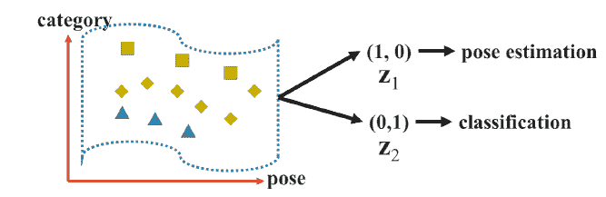
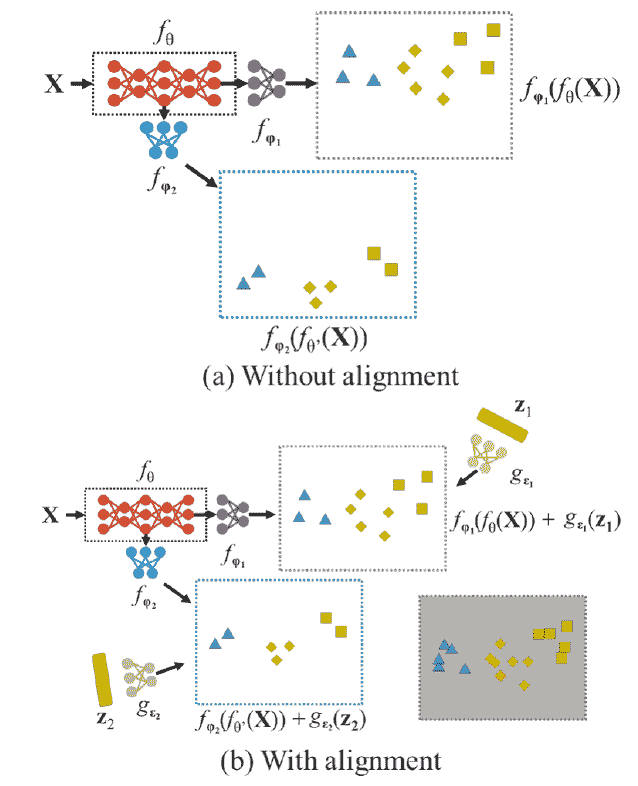
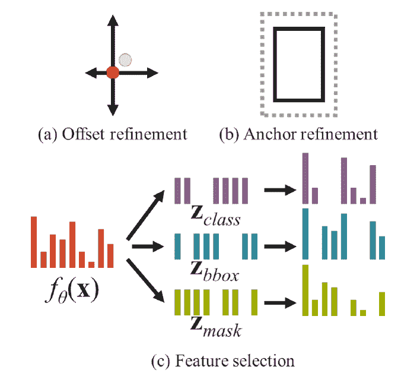

# 梯度中的彩色物体检测

> 原文：<https://blog.paperspace.com/yolor/>

深度学习的普及和研究中最受欢迎和立即可用的概念之一是对象检测。对象检测是使用对象识别和图像分割来创建带标签的边界框以识别和标记图像和视频中对象的分类的实践。由于免费使用 YOLO 算法，这一概念迅速普及。过去，我们在关于在 [PyTorch 中实现对象检测器的系列文章中广泛讨论了 YOLOv4。](https://blog.paperspace.com/tag/series-yolo/)

在本文中，我们将研究 YOLOR(您只学习一种表示)。YOLOR 是 2021 年发布的一种对象检测算法，它可以匹配甚至优于一个缩放的 YOLO v4 模型。YOLOR 在概念上不同于 YOLO，因为它使用统一的网络来同时编码隐性知识和显性知识。YOLOR 可以执行“卷积神经网络中的内核空间对齐、预测细化和多任务学习”，作者的研究结果表明，包含隐式信息有助于所有任务的执行。 [(1)](https://arxiv.org/pdf/2105.04206.pdf)

在本教程中，我们将分解 YOLOR 如何检测对象，将其与众所周知的 YOLO 算法进行对比，并在使用 YOLOR 模型检测 Youtube 视频中的对象之前，以训练 YOLOR 模型的编码演示结束。

## YOLOR:架构和能力

YOLOR 与 YOLO 的不同之处在于，它能够使用单一、统一的模型，将显性和隐性知识编码在同一个表示中，因此得名。为了澄清，显式深度学习指的是理解存储在网络浅层中的图像的粗略细节。隐式深度学习专注于更精细的细节，对应于网络的更深层。通过在单个模型中结合这两种努力，YOLOR 可以快速准确地检测高清照片中的细节，YOLOR 比缩放的 YOLOv4 模型快大约 88%。

我们来分解一下 YOLOR 是如何利用隐性知识学习的，然后考察一下统一模型。

### YOLOR 如何解释隐性知识:

在我们研究统一网络之前，我们将介绍一些原始论文作者建议用于此任务的概念。这些技术允许作者为隐性知识建模并快速推理。

#### 歧管空间缩减:



流形空间缩减是论文中提到的第一个技术。作者断言，一个好的、单一的表示应该能够在它所属的流形空间中定位相应的投影 [(1)](https://arxiv.org/pdf/2105.04206.pdf) 。使用流形学习，这种技术旨在将流形空间的维度减少到平坦、无特征的空间。这种近似欧几里得空间允许算法在没有任何预定分类的情况下获得对数据的高维结构的隐含理解。如果可以在这个缩减的投影空间内对目标类别进行分类，我们就可以在降低维数的同时改进预测。

##### 内核对齐:



如上图所示，使用多任务和多头神经网络处理内核空间错位可能会有问题。这种不一致会导致模型功能的重大中断。为了补救这一点，作者提出了对输出特征和隐式表示的一系列操作。这允许内核空间被适当地平移、旋转和缩放，使得每个输出内核空间被对齐 [(1)](https://arxiv.org/pdf/2105.04206.pdf) 。实际上，这意味着在特征金字塔网络 [(2)](https://medium.com/augmented-startups/is-yolor-better-and-faster-than-yolov4-54812da66cc1) 中对齐输出的较小细节和较粗略细节的特征。这些特征金字塔允许识别系统在不同尺度下保持其能力。

#### 其他建议方法:



如上面的部分 *a* 所示，加法的引入可以使神经网络预测中心坐标的偏移，然后可以用于通知最终的预测。在部分 *b，*中，我们看到引入乘法允许锚细化。锚定框允许一个网格单元检测多个对象，并防止重叠细节带来的复杂性。在实践中，通过有效地自动扫描锚的超参数集，这形成了更鲁棒的模型。最后，在章节 *c* 中，该图显示了如何应用点乘和串联来实现多任务特征选择，并为后续计算 [(1)](https://arxiv.org/pdf/2105.04206.pdf) 设置前提条件。

### 架构:统一的模型


YOLOR 的作者在通过上述技术寻求一种可以处理传统神经网络的显式知识和隐式知识的模型时，创建了一个多模态统一网络(如上图)。该模型的功能是生成一个具有显式知识和隐式知识的表示，以服务于多个任务。

为了实现这一点，作者使用显性和隐性知识一起建模误差项。这个误差项然后又被用来指导多用途网络训练过程。这可以映射到以下用于训练的等式:

$y = fθ(x) + ε + gφ(εₑₓ(x), εᵢₘ(z))$

$最小化ε + gφ(εₑₓ(x)，εᵢₘ(z))$

其中 *εₑₓ* 和 *εᵢₘ* 项代表分别对来自观测值 *x* 和潜在代码 *z* 的显式和隐式误差项建模的操作。然后，gφ 是一个特定于任务的操作，它从显式和隐式知识库中组合或选择信息。既然我们已经概述了将显式知识直接整合到 *fθ，*中的方法，那么我们可以将等式改写为

$y =系数(x)φ(z)$ y

其中☆表示组合 *fθ和 gφ的可能运算符。*在这里，我们在隐性知识部分讨论的运算符，如加法、乘法和串联都可以使用。通过扩展误差项的推导过程以处理多个任务，我们得到以下等式:

$F(x、θ、z、φ、y、ψ)= 0 美元

其中 Z = {z1，z2，...，zT }是 T 个不同任务的一组隐含的潜在代码。接下来，φ充当从 z 生成隐式表示的参数。然后，ψ项用于从显式表示和隐式表示的不同组合计算最终输出参数。

最后，由此我们可以导出下面的公式来获得对所有 z ∈ Z 的预测，并使用它来解决各种任务。

$ dψ(fθ(x)、gφ(z)、y) = 0 美元

根据这个等式，我们用一个通用的统一表示法 *fθ(x)开始所有的任务。*每个任务然后经过任务特定的隐式表示，*gφ(z)。*任务鉴别器*dψ*然后完成每个不同的任务。 [(1)](https://arxiv.org/pdf/2105.04206.pdf)

在实践中，这创建了一个系统，该系统能够在整体表示中既接受对应于网络浅层的显性知识，又接受对应于网络深层的隐性知识。然后，鉴别器可以快速有效地指导不同的任务完成。

### 能力


到目前为止，我们已经谈论了很多关于 YOLOR 的内容，任何阅读这篇文章并且熟悉 YOLO 的人都可以猜到，YOLOR 也是一个极其强大的对象检测算法。通过模型中前面描述的过程的组合效果，YOLOR 算法能够在用带标签的边界框包围对象之前对其进行检测和分类。从上图中可以看出，作者已经证明，在相同的数据集上训练时，YOLOR 在平均精度和批处理 1 延迟方面都优于 YOLOX 和 Scaled-YOLOv4。

现在我们已经看到了 YOLOR 的工作原理，让我们看看如何训练 YOLOR 模型，并使用它从渐变笔记本中的图像和视频中检测对象。

# 演示

要在渐变笔记本上运行 YOLOR，首先创建一个带有 PyTorch 运行时的笔记本。如果你想加快训练的速度，你可以用增长包设置一个多 GPU 的机器，你可能需要采取措施来减少训练过程中使用的内存。任何可用的 GPU 都将运行检测脚本。

设置的最后一步是切换高级选项，并将以下 URL 设置为您的工作区 URL:

[T2`https://github.com/WongKinYiu/yolor`](https://github.com/WongKinYiu/yolor)

完成设置后，点击“创建”启动笔记本。

#### 准备工作:

现在，在你的渐变笔记本中，我们可以开始设置。在我们可以训练模型或使用预训练模型进行一些检测之前，我们需要做两件事情。首先，我们需要准备和下载数据集。虽然数据作为公共数据集可用，但它当前存储在不可变的卷中。不幸的是，这产生了对工作目录中数据的需求。因此，为 YOLOR 准备好 COCO 数据的最快方法是使用脚本目录 get_coco.sh 中的内置 Python 脚本。在终端中执行以下命令，将数据加载到工作目录中:

```py
mkdir coco
cd coco
bash get_coco.sh 
```

这将在 coco 目录中设置您的数据，并将图像、注释和标签文件放在正确的位置以运行 YOLOR。

接下来，用户将需要安装 gdown，一个 Google Drive 下载程序，以获得 YOLOR-CSP-X 的预训练模型权重，我们稍后将使用它来进行对象检测。您可以使用下面的代码片段安装 gdown 并下载权重。

```py
pip install gdown 
gdown https://drive.google.com/uc?id=1NbMG3ivuBQ4S8kEhFJ0FIqOQXevGje_w
```

一旦完成，你就可以开始用我们刚刚下载的预训练模型来训练 YOLOR 或检测。

#### 如何使用 YOLOR 检测视频和图像中的物体

我们先来看看 YOLOR 是如何实时工作的。用 youtube_dl 下载一段人在人群中穿行的视频。您可以安装它

`pip install youtube_dl`

然后用下面的代码执行一个 notebook 单元格，将视频下载到推理目录。

```py
import youtube_dl

url = 'https://www.youtube.com/watch?v=b8QZJ5ZodTs'

url_list = [url]
youtube_dl.YoutubeDL({'outtmpl': 'inferenimg/inputvid.mp4', 'format_id': 'worstvideo/worst', 'format': '160', 'vcodec': 'utf-8'}).download(url_list)
```

推理目录存储了我们将与 YOLOR 一起用于对象检测任务的图像。它将与马的现有图片。我们将使用这张图片和我们刚刚下载的视频来演示 YOLOR 的速度和准确性。您可以通过在终端中执行以下命令来实现:

`python detect.py --source inferenimg/* --cfg cfg/yolor_csp_x.cfg --weights yolor_csp_x.pt --conf 0.25 --img-size 1280 --device 0`

这将对`inferenimg/`文件夹中的每个文件运行对象检测器，并将它们输出到`inference/output/`。当它完成运行时，该模型将输出一个视频和图像，其中包含每个文件中分类对象上的带标签的边界框。它们应该看起来像这样:

<https://blog.paperspace.com/content/media/2022/04/upload-vid.mp4>


现在，如果您想要运行相同的过程，您需要做的就是将您的图像或视频文件放入推理/图像文件夹中。

#### 如何用 COCO 训练自己的 YOLOR 模型

设置培训可能有点复杂。前面，我们使用`bash get_coco.sh`设置了 COCO 数据集。这已经为 YOLOR 定位了用于培训的注释、标签和注解。要使用 COCO 数据集为新的 YOLOR 模型执行训练例程，可以将以下内容放入控制台:

`python train.py --batch-size 8 --img 1280 1280 --data data/coco.yaml --cfg cfg/yolor_csp_x.cfg --weights '' --device 0 --name yolor_csp_x_run1 --hyp data/hyp.scratch.1280.yaml --epochs 300`

coco.yaml 文件与我们的 YOLOR repo 克隆一起提供，它将引导训练到正确的目录并输入分类标签。这将运行 300 个纪元的训练，这将花费很长时间。一旦模型完成，您就可以使用输出的模型权重作为训练出来的最佳整体模型，以执行与预训练模型类似的检测过程:

`python detect.py --source inferenimg/horses.jpg --cfg cfg/yolor_csp_x.cfg --weights runs/train/yolor_csp_x_run1/weights/best_overall.pt --conf 0.25 --img-size 1280 --device 0`

# 总结想法

在本文中，我们详细研究了 YOLOR。我们看到 YOLOR 如何能够在一个统一的模型中集成隐式知识和显式知识，并使用对单个表示的理解来执行复杂的对象检测任务。最后，我们演示了如何在渐变笔记本上启动 YOLOR，并在下载的 Youtube 视频上执行检测任务。

想要了解更多关于 YOLOR 的信息，你可以在这里阅读原文[并访问](https://arxiv.org/pdf/2105.04206.pdf)[作者的 Github。](https://github.com/WongKinYiu/yolor)