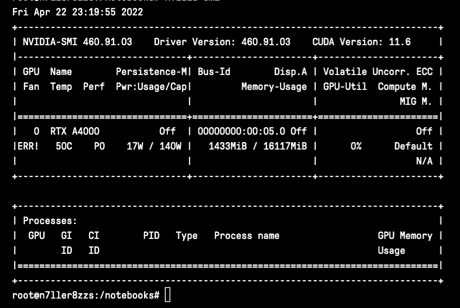
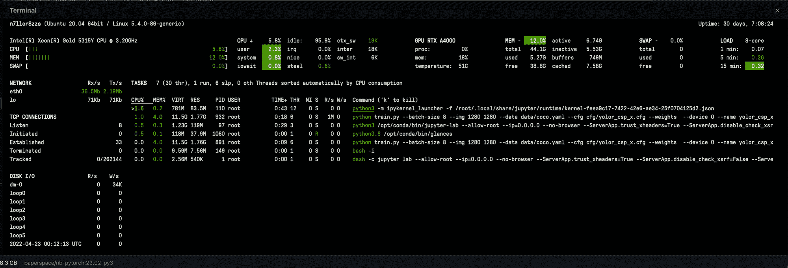

# 监控用于深度学习的 GPU 利用率

> 原文：<https://blog.paperspace.com/monitoring-gpu-utilization-in-real-time/>

GPU 是大多数用户执行深度和机器学习任务的首要硬件。“GPU 通过并行执行计算来加速机器学习操作。许多运算，尤其是那些可表示为矩阵乘法的运算，开箱即可获得良好的加速。通过调整操作参数来有效利用 GPU 资源，甚至可以获得更好的性能。” [(1)](https://docs.nvidia.com/deeplearning/performance/dl-performance-getting-started/index.html)

在实践中，即使在 GPU 上进行，执行深度学习计算在计算上也是昂贵的。此外，很容易使这些机器过载，触发内存不足错误，因为很容易超出机器解决分配任务的能力范围。幸运的是，GPU 自带内置和外部监控工具。通过使用这些工具来跟踪功耗、利用率和已用内存百分比等信息，用户可以在出现问题时更好地了解问题出在哪里。

## GPU 瓶颈和障碍

### CPU 中的预处理

在许多深度学习框架和实现中，在切换到 GPU 进行更高阶处理之前，通常使用 CPU 对数据执行转换。这种预处理可能会占用 65%的历元时间，详见最近的研究。像对图像或文本数据进行转换这样的工作会产生影响性能的瓶颈。在 GPU 上运行这些相同的过程可以提高项目变更的效率，从而缩短培训时间。

#### 什么导致内存不足(OOM)错误？

内存不足意味着 GPU 已经用完了它可以为分配的任务分配的资源。这种错误通常发生在特别大的数据类型，如高分辨率图像，或者批处理太大，或者多个进程同时运行时。它是可以访问的 GPU RAM 数量的函数。

#### OOM 的建议解决方案

*   使用较小的批量。由于迭代是完成一个时期所需的批次数量，降低输入的批次大小将减少 GPU 在迭代期间需要在内存中保存的数据量。这是 OOM 错误最常见的解决方案
*   您正在处理图像数据并对数据执行变换吗？考虑使用类似于 [Kornia](https://github.com/kornia/kornia) 的库来使用你的 GPU 内存执行转换
*   考虑您的数据是如何加载的。考虑使用 DataLoader 对象，而不是一次性加载所有数据，以节省工作内存。它通过组合数据集和采样器来提供给定数据集上的可迭代对象

## 用于监控性能的命令行工具:

nvidia-smi windows 

### nvidia-smi

代表 nvidia 系统管理接口， [nvidia-smi](https://developer.nvidia.com/nvidia-system-management-interface) 是一个建立在 Nvidia 管理库之上的工具，旨在促进对 Nvidia GPUs 的监控和使用。您可以使用`nvidia-smi`快速打印出一组关于您的 GPU 利用率的基本信息。第一个窗口中的数据包括 GPU 的等级、它们的名称、风扇利用率(尽管这将在梯度上出错)、温度、当前性能状态、您是否处于持续模式、您的功率消耗和上限以及您的总 GPU 利用率。第二个窗口将详细说明特定的进程和进程的 GPU 内存使用情况，例如运行一个培训任务。

#### 使用 nvidia-smi 的提示

*   使用`nvidia-smi -q -i 0 -d UTILIZATION -l 1`显示 GPU 或单元信息('-q ')，显示单个指定 GPU 或单元的数据('-i '，我们使用 0，因为它是在单个 GPU 笔记本上测试的)，指定利用率数据('-d ')，每秒重复一次。这将输出关于您的利用率、GPU 利用率示例、内存利用率示例、ENC 利用率示例和 DEC 利用率示例的信息。这些信息将每秒循环输出，因此您可以实时观察变化。
*   使用标志“-f”或“- filename=”将命令结果记录到特定文件中。
*   点击查看完整文档[。](https://developer.download.nvidia.com/compute/DCGM/docs/nvidia-smi-367.38.pdf)

### 反光

Glances 是另一个用于监控 GPU 利用率的神奇库。与`nvidia-smi`不同，在您的终端中输入`glances`会打开一个仪表盘，用于实时监控您的流程。您可以使用此功能来获得许多相同的信息，但是实时更新提供了关于潜在问题可能在哪里的有用见解。除了实时显示 GPU 利用率的相关数据，Glances 还非常详细、准确，并且包含 CPU 利用率数据。

Glances 非常容易安装。在您的终端中输入以下内容:

`pip install glances`

然后，要打开控制面板并获得对监控工具的完全访问权限，只需输入:

`glances`

点击此处阅读更多 Glances 文档[。](https://glances.readthedocs.io/en/latest/install.html)

### 其他有用的命令

警惕在渐变笔记本上安装其他监控工具。比如`gpustat`和`nvtop`不兼容渐变笔记本。以下是其他一些内置命令，可以帮助您监视计算机上的进程。

这些更侧重于监控 CPU 利用率:

*   `top` -打印出 CPU 进程和利用率指标
*   告诉你 CPU 使用了多少内存
*   `vmstat` -报告有关进程、内存、分页、块 IO、陷阱和 cpu 活动的信息

## 图纸空间梯度便于实时查看 GPU 性能

<https://blog.paperspace.com/content/media/2022/04/metrics.mp4>

Using the Gradient Metrics tab in real time to monitor training GPU utilization

在任何梯度笔记本中，您可以访问关于 GPU 和 CPU 使用指标的绘图。这些是实时更新的，并且可以扩展到 1 分钟到 12 小时的可变范围。可以通过单击笔记本窗口左侧的“指标”图标来访问该窗口。通过单击图标，用户可以访问以下各项的绘图数据:

*   CPU 使用率:衡量 CPU 在任何给定时间的利用率，占总容量的百分比
*   内存:CPU 在任何给定时间使用的内存量，以 GB 为单位
*   GPU 内存(已用):在任何给定时间进程上使用的 GPU 内存量
*   GPU 功耗:GPU 在任何给定时间消耗的能量，单位为瓦特
*   GPU 温度:单元在任何给定时间的温度，单位为摄氏度
*   GPU 利用率:在过去的采样周期中，一个或多个内核在 GPU 上执行的时间百分比
*   GPU 内存利用率:在任何给定时间内存控制器忙碌的时间百分比

# 结束语

在本文中，我们看到了如何使用各种工具来监控远程和本地 linux 系统上的 GPU 利用率，以及如何利用 Gradient 笔记本中提供的内置监控工具。

有关 Paperspace 的更多信息，请阅读我们的[文档](https://docs.paperspace.com/)或访问我们的[主页](https://www.paperspace.com/)，立即开始使用强大的云 GPU！